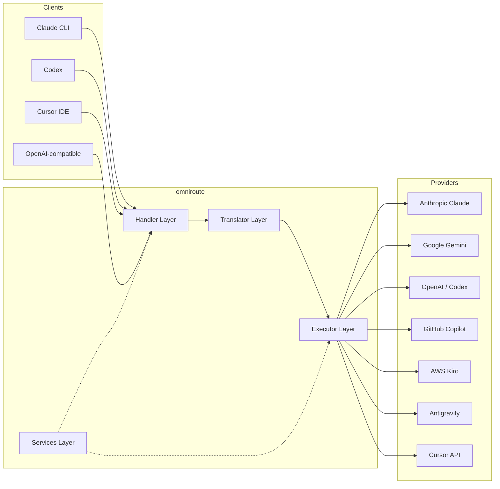
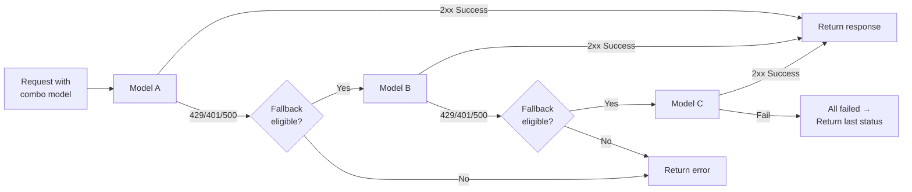
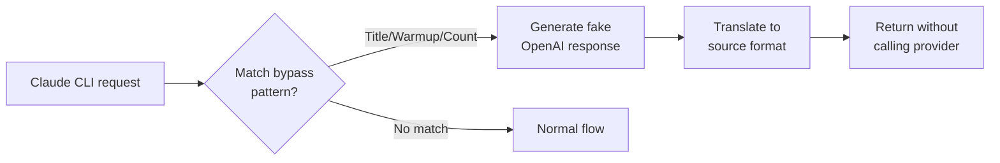

# omniroute — Codebase Documentation (العربية)

🌐 **Languages:** 🇺🇸 [English](../../../../docs/CODEBASE_DOCUMENTATION.md) · 🇪🇸 [es](../../es/docs/CODEBASE_DOCUMENTATION.md) · 🇫🇷 [fr](../../fr/docs/CODEBASE_DOCUMENTATION.md) · 🇩🇪 [de](../../de/docs/CODEBASE_DOCUMENTATION.md) · 🇮🇹 [it](../../it/docs/CODEBASE_DOCUMENTATION.md) · 🇷🇺 [ru](../../ru/docs/CODEBASE_DOCUMENTATION.md) · 🇨🇳 [zh-CN](../../zh-CN/docs/CODEBASE_DOCUMENTATION.md) · 🇯🇵 [ja](../../ja/docs/CODEBASE_DOCUMENTATION.md) · 🇰🇷 [ko](../../ko/docs/CODEBASE_DOCUMENTATION.md) · 🇸🇦 [ar](../../ar/docs/CODEBASE_DOCUMENTATION.md) · 🇮🇳 [hi](../../hi/docs/CODEBASE_DOCUMENTATION.md) · 🇮🇳 [in](../../in/docs/CODEBASE_DOCUMENTATION.md) · 🇹🇭 [th](../../th/docs/CODEBASE_DOCUMENTATION.md) · 🇻🇳 [vi](../../vi/docs/CODEBASE_DOCUMENTATION.md) · 🇮🇩 [id](../../id/docs/CODEBASE_DOCUMENTATION.md) · 🇲🇾 [ms](../../ms/docs/CODEBASE_DOCUMENTATION.md) · 🇳🇱 [nl](../../nl/docs/CODEBASE_DOCUMENTATION.md) · 🇵🇱 [pl](../../pl/docs/CODEBASE_DOCUMENTATION.md) · 🇸🇪 [sv](../../sv/docs/CODEBASE_DOCUMENTATION.md) · 🇳🇴 [no](../../no/docs/CODEBASE_DOCUMENTATION.md) · 🇩🇰 [da](../../da/docs/CODEBASE_DOCUMENTATION.md) · 🇫🇮 [fi](../../fi/docs/CODEBASE_DOCUMENTATION.md) · 🇵🇹 [pt](../../pt/docs/CODEBASE_DOCUMENTATION.md) · 🇷🇴 [ro](../../ro/docs/CODEBASE_DOCUMENTATION.md) · 🇭🇺 [hu](../../hu/docs/CODEBASE_DOCUMENTATION.md) · 🇧🇬 [bg](../../bg/docs/CODEBASE_DOCUMENTATION.md) · 🇸🇰 [sk](../../sk/docs/CODEBASE_DOCUMENTATION.md) · 🇺🇦 [uk-UA](../../uk-UA/docs/CODEBASE_DOCUMENTATION.md) · 🇮🇱 [he](../../he/docs/CODEBASE_DOCUMENTATION.md) · 🇵🇭 [phi](../../phi/docs/CODEBASE_DOCUMENTATION.md) · 🇧🇷 [pt-BR](../../pt-BR/docs/CODEBASE_DOCUMENTATION.md) · 🇨🇿 [cs](../../cs/docs/CODEBASE_DOCUMENTATION.md) · 🇹🇷 [tr](../../tr/docs/CODEBASE_DOCUMENTATION.md)

---

> دليل شامل ومناسب للمبتدئين إلى مدير المدير AI**omniroute**متعدد الموفرين.---## 1. What Is omniroute?

omniroute هو**جهاز وكيل التوجيه**يقع بين عملاء الذكاء الاصطناعي (Claude CLI، وCodex، وCursor IDE، وما إلى ذلك) وموفري الذكاء الاصطناعي (Anthropic، وGoogle، وOpenAI، وAWS، وGitHub، وما إلى ذلك). يحل مشكلة واحدة كبيرة:

> **يتحدث عملاء الذكاء الاصطناعي المختلفون "لغات" مختلفة (تنسيقات واجهة برمجة التطبيقات)، ويتوقع مقدمو خدمات الذكاء الاصطناعي المختلفون "لغات مختلفة" أيضاً.**يترجم المسار الشامل بما فيه الكفاية.

فكر في الأمر التالي مترجم عالمي في الأمم المتحدة - يمكن لأي مندوبات أي لغة، والمترجم هل يمكن أن يترجمها لأي مندوب آخر.---## 2. Architecture Overview



### Core Principle: Hub-and-Spoke Translation

تمر جميع ترجمةات عبر**تنسيق OpenAI كمركز**:`
تنسيق العميل → [OpenAI Hub] → تنسيق الموفر (طلب)
تنسيق الموفر → [OpenAI Hub] → تنسيق العميل (الاستجابة)`

هذا يعني أنك تحتاج فقط إلى مترجمين**N**(واحد لكل تنسيق) بدلاً من**N²**(كل زوج).---

## 3. Project Structure

````
الطريق الشامل/
├── open-sse/ ← مكتبة الوكيل الأساسية (محمول، لا إطاري)
│ ├── Index.js ← نقطة الدخول الرئيسية، تصدر كل شيء
│ ├── التكوين/ ← التكوين والثوابت
│ ├── المنفذون/ ← تنفيذ الطلب الخاص بالمزود
│ ├── معالجات/ ← طلب تنسيق التعامل
│ ├── الخدمات/ ← منطق الأعمال (المصادقة، النماذج، الاحتياطي، الاستخدام)
│ ├── مترجم/ ← تنسيق محرك الترجمة
│ │ ├── طلب/ ← طلب مترجمين (8 ملفات)
│ │ ├── استجابة/ ← مترجمو الاستجابة (7 ملفات)
│ │ └── مساعدون/ ← أدوات الترجمة المشتركة (6 ملفات)
│ └── المرافق/ ← وظائف المرافق
├── src/ ← طبقة التطبيق (وقت تشغيل Express/Worker)
│ ├── التطبيق/ ← واجهة مستخدم الويب، مسارات واجهة برمجة التطبيقات، البرامج الوسيطة
│ ├── lib/ ← قاعدة البيانات والمصادقة وكود المكتبة المشتركة
│ ├── mitm/ ← أدوات الوكيل الوسيطة
│ ├── النماذج/ ← نماذج قواعد البيانات
│ ├── مشترك/ ← أدوات مساعدة مشتركة (مغلفات حول open-sse)
│ ├── sse/ ← معالجات نقطة النهاية SSE
│ └── المتجر/ ← إدارة الدولة
├── البيانات/ ← بيانات وقت التشغيل (بيانات الاعتماد والسجلات)
│ └── Provider-credentials.json (تجاوز بيانات الاعتماد الخارجية، gitignored)
└── اختبار/ ← اختبار المرافق```

---

## 4. Module-by-Module Breakdown

### 4.1 Config (`open-sse/config/`)

**المصدر الوحيد للحقيقة**لجميع إعدادات الموفر.

| ملف | الغرض |
| ----------------------------- | ------------------------------------------------------------------------------------------------------------------------------------------------------------------------------------------------------------------------ |
| `الثوابت.ts` | كائن `PROVIDERS` يحتوي على عناوين URL الأساسية وبيانات اعتماد OAuth (الافتراضية) والرؤوس ومطالبات النظام الافتراضية لكل موفر. يحدد أيضًا `HTTP_STATUS` و`ERROR_TYPES` و`COOLDOWN_MS` و`BACKOFF_CONFIG` و`SKIP_PATTERNS`. |
| "credentialLoader.ts" | يقوم بتحميل بيانات الاعتماد الخارجية من "data/provider-credentials.json" ويدمجها في الإعدادات الافتراضية المضمنة في "PROVIDERS". يحافظ على الأسرار خارج نطاق التحكم بالمصدر مع الحفاظ على التوافق مع الإصدارات السابقة.               |
| `providerModels.ts` | سجل النموذج المركزي: الأسماء المستعارة لموفر الخرائط → معرفات النموذج. وظائف مثل `getModels()` و`getProviderByAlias()`.                                                                                                          |
| `codexInstructions.ts` | تعليمات النظام التي تم إدخالها في طلبات الدستور الغذائي (قيود التحرير، قواعد الاختبار، سياسات الموافقة).                                                                                                                 |
| `defaultThinkingSignature.ts` | توقيعات "التفكير" الافتراضية لنماذج كلود وجيميني.                                                                                                                                                               |
| `olmaModels.ts` | تعريف المخطط لنماذج أولاما المحلية (الاسم، الحجم، العائلة، التكميم).                                                                                                                                             |#### Credential Loading Flow

```mermaid
مخطط انسيابي TD
    A["يبدأ التطبيق"] --> B["constants.ts يحدد مقدمي الخدمة\nبإعدادات افتراضية مضمنة"]
    B --> C{"data/provider-credentials.json\nexists؟"}
    ج -->|نعم| D["credentialLoader يقرأ JSON"]
    ج -->|لا| E["استخدام الإعدادات الافتراضية المشفرة"]
    D --> F{"لكل موفر في JSON"}
    F --> G{"الموفر موجود\nفي الموفرين؟"}
    ز -->|لا| H["تحذير السجل، تخطي"]
    ز -->|نعم| أنا{"القيمة هي كائن؟"}
    أنا -->|لا| J["تحذير السجل، تخطي"]
    أنا -->|نعم| K["دمج معرف العميل، ClientSecret،\ntokenUrl، authUrl، RefreshUrl"]
    ك --> ف
    ح --> ف
    ي --> ف
    F -->|تم| L["الموفرون جاهزون\nببيانات اعتماد مدمجة"]
    ه --> ل```

---

### 4.2 Executors (`open-sse/executors/`)

يقوم المنفذون بتغليف**المنطق الخاص بالمزود**باستخدام**نمط الإستراتيجية**. يتجاوز كل منفذ الأساليب الأساسية حسب الحاجة.```mermaid
classDiagram
    class BaseExecutor {
        +buildUrl(model, stream, options)
        +buildHeaders(credentials, stream, body)
        +transformRequest(body, model, stream, credentials)
        +execute(url, options)
        +shouldRetry(status, error)
        +refreshCredentials(credentials, log)
    }

    class DefaultExecutor {
        +refreshCredentials()
    }

    class AntigravityExecutor {
        +buildUrl()
        +buildHeaders()
        +transformRequest()
        +shouldRetry()
        +refreshCredentials()
    }

    class CursorExecutor {
        +buildUrl()
        +buildHeaders()
        +transformRequest()
        +parseResponse()
        +generateChecksum()
    }

    class KiroExecutor {
        +buildUrl()
        +buildHeaders()
        +transformRequest()
        +parseEventStream()
        +refreshCredentials()
    }

    BaseExecutor <|-- DefaultExecutor
    BaseExecutor <|-- AntigravityExecutor
    BaseExecutor <|-- CursorExecutor
    BaseExecutor <|-- KiroExecutor
    BaseExecutor <|-- CodexExecutor
    BaseExecutor <|-- GeminiCLIExecutor
    BaseExecutor <|-- GithubExecutor
````

| المنفذ               | مقدم                                                | التخصص الرئيسي                                                                                                                    |
| -------------------- | --------------------------------------------------- | --------------------------------------------------------------------------------------------------------------------------------- | ------------------------------------------ |
| `base.ts`            | —                                                   | قاعدة الملخصات: إنشاء عنوان URL، والرؤوس، ومنطقة إعادة المحاولة، وتحديث بيانات الاعتماد                                           |
| `default.ts`         | كلود، جيميني، أوبن آي آي، جي إل إم، كيمي، ميني ماكس | تحديث رمز OAuth العام للموفرين الكلاسيكيين                                                                                        |
| `مكافحة الجاذبية.ts` | جوجل كلود كود                                       | إنشاء معرف المشروع/الجلسة، وإرجاع عناوين URL الإعلامية، بعد محاولة تحديد موقع رسائل الخطأ ("إعادة بعد 2 ساعة و7 دقائق و23 ثانية") |
| `cursor.ts`          | منطقة تطوير متعددة للمؤشر                           | **الأكثر مخاطرًا**: مصادقة التسجيل الاختباري SHA-256، وترميز طلب Protobuf، وEventStream ثنائي → تحليل اتصال SSE                   |
| `codex.ts`           | OpenAI Codex                                        | حجم تعليمات النظام، وإدارة مستويات التفكير، تجديد المعلمات غير المدعومة                                                           |
| `الجوزاء-cli.ts`     | جوجل الجوزاء CLI                                    | إنشاء عنوان URL مخصص (`streamGenerateContent`)، وتحديث رمز OAuth المميز لـ Google                                                 |
| `جيثب.ts`            | جيثب مساعد الطيار                                   | نظام رمزي ثنائي (GitHub OAuth + Copilot token)، محاكاة رأس VSCode                                                                 |
| `kiro.ts`            | AWS CodeWhisperer                                   | التحليل الثنائي لـ AWS EventStream، وإطارات أحداث AMZN، والتقدير المميز                                                           |
| `index.ts`           | —                                                   | المصنع: اسم موفر ← فئة المنفذ، مع خيار بديل افتراضي                                                                               | ---### 4.3 Handlers (`open-sse/handlers/`) |

**طبقة تأتي**— تترتب على الترجمة والتنفيذ والتدفق ويسبب سبب.

| ملف                   | الحصاد                                                                                                                                                            |
| --------------------- | ----------------------------------------------------------------------------------------------------------------------------------------------------------------- | -------------------------------------------- |
| `chatCore.ts`         | **المنسق المركزي**(~ 600 سطر). لاحظ مع دورة حياة الطلب الكامل: اكتشاف ← الترجمة ← رحلة مميزة ← عزيزي القارئ/غير المتدفق ← تحديث ← أسباب ← تسجيل الاستخدام.        |
| `responsesHandler.ts` | محول برمجة تطبيقات الخاصة بـ OpenAI: تحويل تنسيق الردود ← إرسال ملفات الدردشة ← إرسال إلى `chatCore` ← تحويل SSE مرة أخرى إلى تنسيق الردود.                       |
| `embeddings.ts`       | محرك إنشاء التضمين: يحل نموذج التضمين → الموفر، ويرسل إلى واجهة برمجة تطبيقات الموفر، ويعيد الاتصال بالتضمين المتوافق مع OpenAI. يدعم 6+ مقدمي الخدمات.           |
| `imageGeneration.ts`  | معالج إنشاء الصور: يحل نموذج الصورة → الموفر، ويدعم الأوضاع المتوافقة مع OpenAI، وGemini-image (Antigravity)، والوضع الاحتياطي (Nebius). إرجاع صور base64 أو URL. | #### دورة حياة الطلب (chatCore.ts)```mermaid |

sequenceDiagram
participant Client
participant chatCore
participant Translator
participant Executor
participant Provider

    Client->>chatCore: Request (any format)
    chatCore->>chatCore: Detect source format
    chatCore->>chatCore: Check bypass patterns
    chatCore->>chatCore: Resolve model & provider
    chatCore->>Translator: Translate request (source → OpenAI → target)
    chatCore->>Executor: Get executor for provider
    Executor->>Executor: Build URL, headers, transform request
    Executor->>Executor: Refresh credentials if needed
    Executor->>Provider: HTTP fetch (streaming or non-streaming)

    alt Streaming
        Provider-->>chatCore: SSE stream
        chatCore->>chatCore: Pipe through SSE transform stream
        Note over chatCore: Transform stream translates<br/>each chunk: target → OpenAI → source
        chatCore-->>Client: Translated SSE stream
    else Non-streaming
        Provider-->>chatCore: JSON response
        chatCore->>Translator: Translate response
        chatCore-->>Client: Translated JSON
    end

    alt Error (401, 429, 500...)
        chatCore->>Executor: Retry with credential refresh
        chatCore->>chatCore: Account fallback logic
    end

````

---

### 4.4 Services (`open-sse/services/`)

منطق الأعمال الذي يدعم المعالجات والمنفذين.| File                 | Purpose                                                                                                                                                                                                                                                                                                                                |
| -------------------- | -------------------------------------------------------------------------------------------------------------------------------------------------------------------------------------------------------------------------------------------------------------------------------------------------------------------------------------- |
| `provider.ts`        | **Format detection** (`detectFormat`): analyzes request body structure to identify Claude/OpenAI/Gemini/Antigravity/Responses formats (includes `max_tokens` heuristic for Claude). Also: URL building, header building, thinking config normalization. Supports `openai-compatible-*` and `anthropic-compatible-*` dynamic providers. |
| `model.ts`           | Model string parsing (`claude/model-name` → `{provider: "claude", model: "model-name"}`), alias resolution with collision detection, input sanitization (rejects path traversal/control chars), and model info resolution with async alias getter support.                                                                             |
| `accountFallback.ts` | Rate-limit handling: exponential backoff (1s → 2s → 4s → max 2min), account cooldown management, error classification (which errors trigger fallback vs. not).                                                                                                                                                                         |
| `tokenRefresh.ts`    | OAuth token refresh for **every provider**: Google (Gemini, Antigravity), Claude, Codex, Qwen, Qoder, GitHub (OAuth + Copilot dual-token), Kiro (AWS SSO OIDC + Social Auth). Includes in-flight promise deduplication cache and retry with exponential backoff.                                                                       |
| `combo.ts`           | **Combo models**: chains of fallback models. If model A fails with a fallback-eligible error, try model B, then C, etc. Returns actual upstream status codes.                                                                                                                                                                          |
| `usage.ts`           | Fetches quota/usage data from provider APIs (GitHub Copilot quotas, Antigravity model quotas, Codex rate limits, Kiro usage breakdowns, Claude settings).                                                                                                                                                                              |
| `accountSelector.ts` | Smart account selection with scoring algorithm: considers priority, health status, round-robin position, and cooldown state to pick the optimal account for each request.                                                                                                                                                              |
| `contextManager.ts`  | Request context lifecycle management: creates and tracks per-request context objects with metadata (request ID, timestamps, provider info) for debugging and logging.                                                                                                                                                                  |
| `ipFilter.ts`        | IP-based access control: supports allowlist and blocklist modes. Validates client IP against configured rules before processing API requests.                                                                                                                                                                                          |
| `sessionManager.ts`  | Session tracking with client fingerprinting: tracks active sessions using hashed client identifiers, monitors request counts, and provides session metrics.                                                                                                                                                                            |
| `signatureCache.ts`  | Request signature-based deduplication cache: prevents duplicate requests by caching recent request signatures and returning cached responses for identical requests within a time window.                                                                                                                                              |
| `systemPrompt.ts`    | Global system prompt injection: prepends or appends a configurable system prompt to all requests, with per-provider compatibility handling.                                                                                                                                                                                            |
| `thinkingBudget.ts`  | Reasoning token budget management: supports passthrough, auto (strip thinking config), custom (fixed budget), and adaptive (complexity-scaled) modes for controlling thinking/reasoning tokens.                                                                                                                                        |
| `wildcardRouter.ts`  | Wildcard model pattern routing: resolves wildcard patterns (e.g., `*/claude-*`) to concrete provider/model pairs based on availability and priority.                                                                                                                                                                                   |

#### Token Refresh Deduplication

```mermaid
sequenceDiagram
    participant R1 as Request 1
    participant R2 as Request 2
    participant Cache as refreshPromiseCache
    participant OAuth as OAuth Provider

    R1->>Cache: getAccessToken("gemini", token)
    Cache->>Cache: No in-flight promise
    Cache->>OAuth: Start refresh
    R2->>Cache: getAccessToken("gemini", token)
    Cache->>Cache: Found in-flight promise
    Cache-->>R2: Return existing promise
    OAuth-->>Cache: New access token
    Cache-->>R1: New access token
    Cache-->>R2: Same access token (shared)
    Cache->>Cache: Delete cache entry
````

#### Account Fallback State Machine

```mermaid
stateDiagram-v2
    [*] --> Active
    Active --> Error: Request fails (401/429/500)
    Error --> Cooldown: Apply backoff
    Cooldown --> Active: Cooldown expires
    Active --> Active: Request succeeds (reset backoff)

    state Error {
        [*] --> ClassifyError
        ClassifyError --> ShouldFallback: Rate limit / Auth / Transient
        ClassifyError --> NoFallback: 400 Bad Request
    }

    state Cooldown {
        [*] --> ExponentialBackoff
        ExponentialBackoff: Level 0 = 1s
        ExponentialBackoff: Level 1 = 2s
        ExponentialBackoff: Level 2 = 4s
        ExponentialBackoff: Max = 2min
    }
```

#### Combo Model Chain



---

### 4.5 Translator (`open-sse/translator/`)

**محرك استعداد**باستخدام نظام التوقيع الذاتي.#### الكائنات```mermaid
graph TD
subgraph "Request Translation"
A["Claude → OpenAI"]
B["Gemini → OpenAI"]
C["Antigravity → OpenAI"]
D["OpenAI Responses → OpenAI"]
E["OpenAI → Claude"]
F["OpenAI → Gemini"]
G["OpenAI → Kiro"]
H["OpenAI → Cursor"]
end

    subgraph "Response Translation"
        I["Claude → OpenAI"]
        J["Gemini → OpenAI"]
        K["Kiro → OpenAI"]
        L["Cursor → OpenAI"]
        M["OpenAI → Claude"]
        N["OpenAI → Antigravity"]
        O["OpenAI → Responses"]
    end

````

| الدليل | ملفات | الوصف |
| ------------ | ------------- | -------------------------------------------------------------------------------------------------------------------------------------------------------------------------------------------------------------------------------- |
| `طلب/` | 8 مترجمين | تحويل أجسام بين الصيغ. يتم تسجيل كل ملف ذاتيًا عبر "التسجيل (من، إلى، fn)" عند الاستيراد.                                                                                                                                                         |
| `الاستجابة/` | 7 مترجمين | تحويل قطع المضخّم بين الصيغة. للتعرف على أنواع أحداث SSE وكتل التفكير وأدوات الأدوات.                                                                                                                                                         |
| `المساعدين/` | 6 مساعدين | الأداة المساعدة المشتركة: `cludeHelper` (استخراج النظام، البحث المطلوب البحث)، `geminiHelper` (تخطيط الأجزاء/المحتويات)، `openaiHelper` (خيار مناسب)، `toolCallHelper` (إنشاء المعرف، البحث المطلوب المطلوبة)، `maxTokensHelper`، `responsesApiHelper`. |
| `index.ts` | — | ترجمة المحرك: `translateRequest()`، `translateResponse()`، إدارة الحالة، التسجيل.                                                                                                                                                                     |
| `formats.ts` | — | ثوابت عادة: `OPENAI`، `CLAUDE`، `GEMINI`، `ANTIGRAVITY`، `KIRO`، `CURSOR`، `OPENAI_RESPONSES`.                                                                                                                                                             |#### التصميم الرئيسي: المكونات الإضافية ذاتية التسجيل```javascript
// Each translator file calls register() on import:
import { register } from "../index.js";
register("claude", "openai", translateClaudeToOpenAI);

// The index.js imports all translator files, triggering registration:
import "./request/claude-to-openai.js"; // ← self-registers
````

---

### 4.6 Utils (`open-sse/utils/`)

| ملف                | الحصاد                                                                                                                                                                                                                                                             |
| ------------------ | ------------------------------------------------------------------------------------------------------------------------------------------------------------------------------------------------------------------------------------------------------------------ | --------------------------------- |
| "خطأ.ts"           | إنشاء كلمات للأخطاء (تنسيق متوافق مع OpenAI)، وسبب المشكلة، واستخراجها، وحاول إعادة محاولة Antigravity من رسائل الخطأ، وأخطاء SSE.                                                                                                                                 |
| "stream.ts"        | **SSE Transform Stream**— خط أنابيب البث الأساسي. وضعان: "الترجمة" (ترجمة كاملة) و"العبور" (التطبيع + الطلب المستخدم). وأخذ بعين الاعتبار التخزين المؤقت للقطعة وتقدير استخدامها وتتبع طول الفيديو. تجنب مثيلات وحدة التشفير/وحدة فك التشفير لكل حالة DC المشتركة. |
| `streamHelpers.ts` | SSE ذات المستوى المنخفض: `parseSSELine` (متسامح مع المسافات البيضاء)، `hasValuableContent` ( تصفية أدوات الفارغة لـ OpenAI/Claude/Gemini)، `fixInvalidId`، `formatSSE` (تسلسل SSE مدرك للتنسيق مع `perf_metrics`).                                                 |
| `usageTracking.ts` | استخدام النسخة المميزة من أي تنسيق (Claude/OpenAI/Gemini/Responses)، والاستعانة بـ DNS لكل رمز مميز للأداة/الرسالة، والمخزن المؤقت (هامش أمان 2000 رمز مميز)، وتصفية الخاصيات بالتنسيق، وتسجيل وحدة التحكم مع ANSI.                                                |
| `requestLogger.ts` | Legacy file-based request logging helper kept for compatibility. Current deployments should prefer `APP_LOG_TO_FILE` for application logs and the call log pipeline for persisted request artifacts.                                                               |
| `bypassHandler.ts` | ويمثل خيارًا محددًا لـ Claude CLI (عنوان الإنتاج، والحماية، والعد) ويعيد ميزة دون الاتصال بأي مكان. يدعم كل من الدف وغير الدف. لذلك عمدا على نطاق كلود CLI.                                                                                                        |
| `networkProxy.ts`  | يحل عنوان URL للوكلاء لموفر معين مع الأسبقية: تفعيل الخاص بالموفر → تفعيل العام → متغيرات البيئة (`HTTPS_PROXY`/`HTTP_PROXY`/`ALL_PROXY`). يدعم استثناءات `NO_PROXY`. اختيارية ذاكرة تخزين مؤقتة لمدة 30 ثانية.                                                    | #### خط أنابيب تدفق SSE```mermaid |

flowchart TD
A["Provider SSE stream"] --> B["TextDecoder\n(per-stream instance)"]
B --> C["Buffer lines\n(split on newline)"]
C --> D["parseSSELine()\n(trim whitespace, parse JSON)"]
D --> E{"Mode?"}
E -->|TRANSLATE| F["translateResponse()\ntarget → OpenAI → source"]
E -->|PASSTHROUGH| G["fixInvalidId()\nnormalize chunk"]
F --> H["hasValuableContent()\nfilter empty chunks"]
G --> H
H -->|"Has content"| I["extractUsage()\ntrack token counts"]
H -->|"Empty"| J["Skip chunk"]
I --> K["formatSSE()\nserialize + clean perf_metrics"]
K --> L["TextEncoder\n(per-stream instance)"]
L --> M["Enqueue to\nclient stream"]

    style A fill:#f9f,stroke:#333
    style M fill:#9f9,stroke:#333

```

#### Request Logger Session Structure

```

logs/
└── claude_gemini_claude-sonnet_20260208_143045/
├── 1_req_client.json ← Raw client request
├── 2_req_source.json ← After initial conversion
├── 3_req_openai.json ← OpenAI intermediate format
├── 4_req_target.json ← Final target format
├── 5_res_provider.txt ← Provider SSE chunks (streaming)
├── 5_res_provider.json ← Provider response (non-streaming)
├── 6_res_openai.txt ← OpenAI intermediate chunks
├── 7_res_client.txt ← Client-facing SSE chunks
└── 6_error.json ← Error details (if any)

````

---

### 4.7 Application Layer (`src/`)

| الدليل | الحصاد |
| ------------- | ---------------------------------------------------------------------- |
| `src/app/` | واجهة مستخدم الويب، مسارات واجهة برمجة التطبيقات (API)، البرامج الأساسية السريعة، معالجات رد اتصال OAuth |
| `src/lib/` | إلى قاعدة الوصول إلى البيانات (`localDb.ts`، `usageDb.ts`)، المصادقة، البرمجة |
| `src/mitm/` | أداة مساعدة للوسيط لاعتراض حركة المرور |
| `src/models/` | تعريفات قواعد البيانات |
| `src/shared/` | أغلفة حول وظائف open-sse (المزود، الدفق، الخطأ، إلخ) |
| `src/sse/` | معالجات نقطة نهاية SSE التي تتوفر في مكتبة open-sse بمسارات Express |
| `src/store/` | إدارة التطبيق |#### مسارات API البارزة

| الطريق | طرق | الحصاد |
| --------------------------------------------- | --------------- | ------------------------------------------------------------------------------------- |
| `/api/provider-models` | الحصول على/نشر/حذف | CRUD للنماذج المتخصصة لكل |
| `/api/models/catalog` | احصل على | مجمع كتالوج لجميع الارتباطات (الدردشة، التضمين، الصورة، تخصيص) مجمعة حسب الموفر |
| `/api/settings/proxy` | الحصول على/وضع/حذف | الجاهزة التفصيلي (`العالمي/الموفرون/المجموعات/المفاتيح`) |
| `/api/settings/proxy/test` | مشاركة | التحقق من صحة الاتصال الوكيل وإرجاع IP/زمن الوصول العام |
| `/v1/providers/[provider]/chat/completions` | مشاركة | عمليات البحث عن الاختيار المناسب لكل شخص مع التحقق من صحة النموذج |
| `/v1/providers/[provider]/embeddings` | مشاركة | عمليات تضمين التخصص حسب الاختيار مع نموذج التحقق من الصحة |
| `/v1/providers/[provider]/images/ Generations` | مشاركة | إنشاء صور مخصصة لكل وثيقة معتمدة من نموذج صحة |
| `/api/settings/ip-filter` | الحصول على/وضع | قائمة IP الخاصة بها/إدارة القائمة المحظورة |
| `/api/settings/thinking-budget` | الحصول على/وضع | المحددة المحددة الرمز (العبور/التلقائي/المخصص/التكيفي) |
| `/api/settings/system-prompt` | الحصول على/وضع | القطع المؤقتة لأدوات البناء العالمية |
| `/api/sessions` | احصل على | تحديد العضوية ومعاييرها |
| `/api/rate-limits` | احصل على | الحالة لا يمكن تعديلها لكل حساب |---## 5. Key Design Patterns

### 5.1 Hub-and-Spoke Translation

تتم ترجمة جميع الاحتمالات من خلال**تنسيق OpenAI كمحور**. لا تتطلب إضافة موفر جديد سوى كتابة**زوج واحد**من المترجمين (من/ إلى OpenAI)، وليس عدد N من المترجمين.### 5.2 Executor Strategy Pattern

كل ما لديها فئة تنفيذية مخصصة ترث من "BaseExecutor". تم تصنيع المصنع الموجود في "executors/index.ts" وبالتالي أصبح المصنع جاهزًا في وقت التشغيل.### 5.3 نظام البرنامج الإضافي للتسجيل الذاتي

وحدات المترجمة نفسها عند الاستيراد عبر ``تسجيل ()'. إن إضافة مترجم جديد يعني مجرد إنشاء ملف واستيراده.### 5.4 Account Fallback with Exponential Backoff

عندما يقوم بتقديم خدمة بإرجاع 429/401/500، يمكن أن يتكامل مع الحساب التالي، مع تطبيق أحدث الحداثات الأسية (1ث → 2ث → 4ث → 2 دقيقة الضرر التام).### 5.5 Combo Model Chains

يقوم "التحرير والسرد" بتجميع سلاسل "المزود/النموذج" حاسوبياً. في حالة الفشل الأول، يتم الرجوع إلى المنتج الأصلي.### 5.6 الترجمة المتدفقة ذات الحالة

الحفاظ على ترجمة الأجزاء ذات الحالة عبر SSE (تتبع كتلة التفكير، وتراكم الاتصال بالجهة، وفهرسة كتلة المحتوى) عبر تقنية `initState()`.### 5.7 المخزن المؤقت لسلامة الاستخدام

تم إضافة مخزن مؤقت مكون من 2000 رمز مميز إلى الحد الأقصى من الاستخدام لمساعدة العملاء على الوصول إلى حدود النافذة بسبب الحمل الزائد من مطالبات النظام وترجمة السائقين.---## 6. Supported Formats

| التنسيق | | المعرف |
| ----------------------- | --------------- | ------------------ |
| استكمالات الدردشة OpenAI | المصدر + الهدف | `أوبيني` |
| برمجة تطبيقات استجابات OpenAI | المصدر + الهدف | `الردود المفتوحة` |
| أنثروب كلود | المصدر + الهدف | "كلود" |
| جوجل الجوزاء | المصدر + الهدف | `الجوزاء` |
| جوجل الجوزاء CLI | الهدف فقط | `الجوزاء-كلي` |
| مكافحة الجاذبية | المصدر + الهدف | `مضادة الجاذبية` |
| أوس كيرو | الهدف فقط | `كيرو` |
| |مؤثر الهدف فقط | `المؤشر` |---## 7. Supported Providers

| مقدم | طريقة المصادقة | المنفذ | المذكرة الرئيسية |
| ------------------------ | ---------------------- | ----------- | --------------------------------------------- |
| أنثروب كلود | واجهة برمجة التطبيقات الرئيسية أو OAuth | افتراضي | يستخدم رأس `x-api-key` |
| جوجل الجوزاء | واجهة برمجة التطبيقات الرئيسية أو OAuth | افتراضي | يستخدم رأس `x-goog-api-key` |
| جوجل الجوزاء CLI | أووث | الجوزاء كلي | يستخدم نقطة نهاية "streamGenerateContent" |
| مكافحة الجاذبية | أووث | مكافحة الجاذبية | شراء عناوين URL الخاصة بها، إعادة محاولة البحث عن المواقع |
| أوبن آي | واجهة برمجة التطبيقات الرئيسية | افتراضي | مصادقة الحامل |
| الدستور الغذائي | أووث | الدستور الغذائي | يدخل تعليمات النظام ويدير التفكير |
| جيثب مساعد الطيار | OAuth + رمز مساعد الطيار | جيثب | رمز مزدوج، محاكاة رأس VSCode |
| كيرو (AWS) | AWS SSO OIDC أو اجتماعي | كيرو | تحليل دفق الأحداث الثنائية |
| بيئة تطوير متكاملة للمؤشر | تصويت الاختياري | |مؤثر ترميز Protobuf، الجلسات الاختباري SHA-256 |
| كوين | أووث | افتراضي | المصادقة القياسية |
| قدير | OAuth (أساسي + حامل) | افتراضي | رأس المصادقة |
| اوبن راوتر | واجهة برمجة التطبيقات الرئيسية | افتراضي | مصادقة الحامل |
| جي إل إم، كيمي، ميني ماكس | واجهة برمجة التطبيقات الرئيسية | افتراضي | متوافق مع كلود، استخدم `x-api-key` |
| `متوافق مع openai-*` | واجهة برمجة التطبيقات الرئيسية | افتراضي | برمجة: أي نقطة نهاية متوافقة مع OpenAI |
| `متوافق مع البشر-*` | واجهة برمجة التطبيقات الرئيسية | افتراضي | برمجة: أي نقطة نهاية متوافقة مع كلود |---## 8. Data Flow Summary

### Streaming Request

```mermaid
flowchart LR
    A["Client"] --> B["detectFormat()"]
    B --> C["translateRequest()\nsource → OpenAI → target"]
    C --> D["Executor\nbuildUrl + buildHeaders"]
    D --> E["fetch(providerURL)"]
    E --> F["createSSEStream()\nTRANSLATE mode"]
    F --> G["parseSSELine()"]
    G --> H["translateResponse()\ntarget → OpenAI → source"]
    H --> I["extractUsage()\n+ addBuffer"]
    I --> J["formatSSE()"]
    J --> K["Client receives\ntranslated SSE"]
    K --> L["logUsage()\nsaveRequestUsage()"]
````

### Non-Streaming Request

```mermaid
flowchart LR
    A["Client"] --> B["detectFormat()"]
    B --> C["translateRequest()\nsource → OpenAI → target"]
    C --> D["Executor.execute()"]
    D --> E["translateResponse()\ntarget → OpenAI → source"]
    E --> F["Return JSON\nresponse"]
```

### Bypass Flow (Claude CLI)


