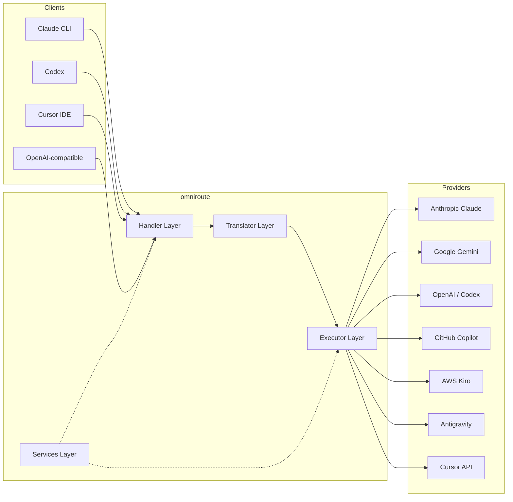
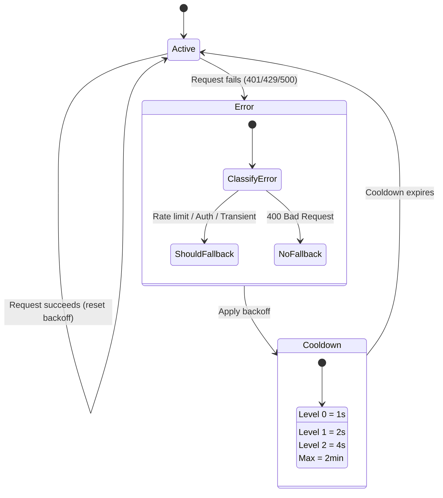
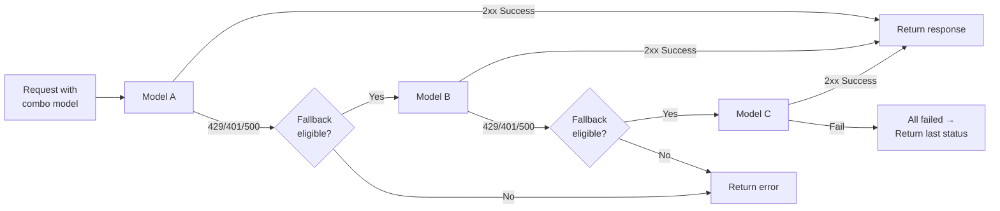
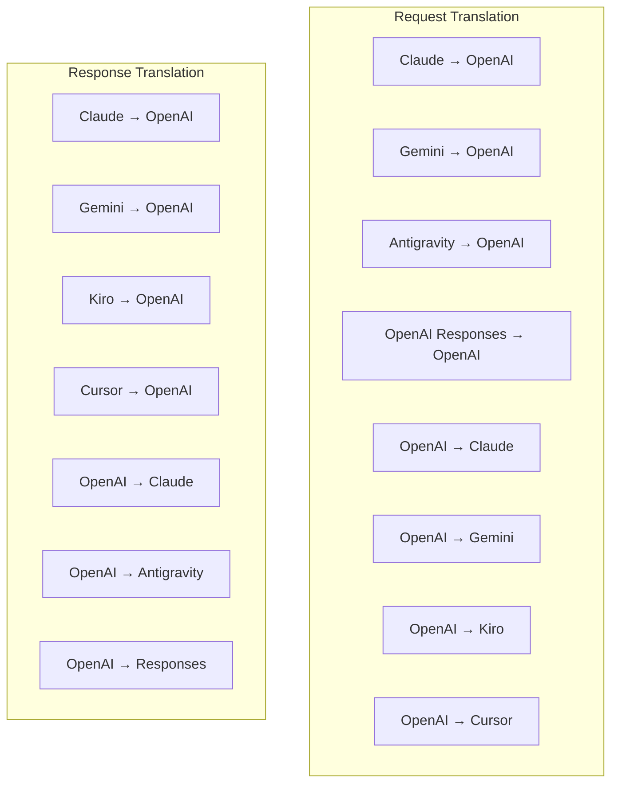
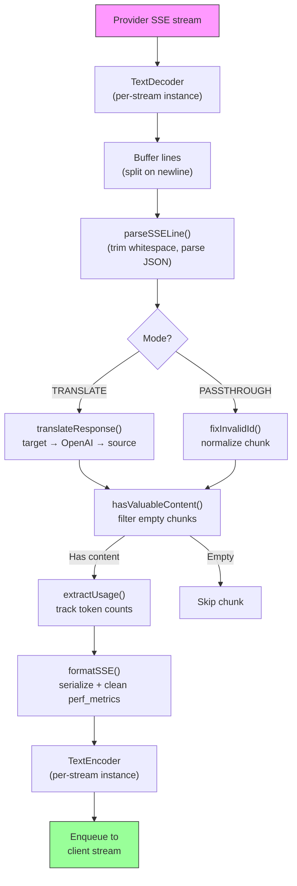
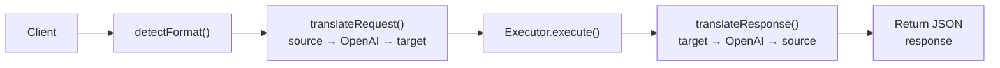
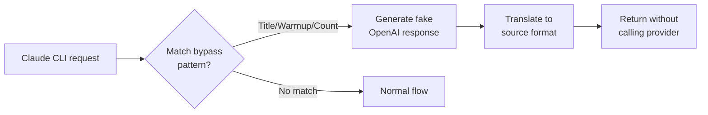

# omniroute — Codebase Documentation (Български)

🌐 **Languages:** 🇺🇸 [English](../../../../docs/CODEBASE_DOCUMENTATION.md) · 🇪🇸 [es](../../es/docs/CODEBASE_DOCUMENTATION.md) · 🇫🇷 [fr](../../fr/docs/CODEBASE_DOCUMENTATION.md) · 🇩🇪 [de](../../de/docs/CODEBASE_DOCUMENTATION.md) · 🇮🇹 [it](../../it/docs/CODEBASE_DOCUMENTATION.md) · 🇷🇺 [ru](../../ru/docs/CODEBASE_DOCUMENTATION.md) · 🇨🇳 [zh-CN](../../zh-CN/docs/CODEBASE_DOCUMENTATION.md) · 🇯🇵 [ja](../../ja/docs/CODEBASE_DOCUMENTATION.md) · 🇰🇷 [ko](../../ko/docs/CODEBASE_DOCUMENTATION.md) · 🇸🇦 [ar](../../ar/docs/CODEBASE_DOCUMENTATION.md) · 🇮🇳 [hi](../../hi/docs/CODEBASE_DOCUMENTATION.md) · 🇮🇳 [in](../../in/docs/CODEBASE_DOCUMENTATION.md) · 🇹🇭 [th](../../th/docs/CODEBASE_DOCUMENTATION.md) · 🇻🇳 [vi](../../vi/docs/CODEBASE_DOCUMENTATION.md) · 🇮🇩 [id](../../id/docs/CODEBASE_DOCUMENTATION.md) · 🇲🇾 [ms](../../ms/docs/CODEBASE_DOCUMENTATION.md) · 🇳🇱 [nl](../../nl/docs/CODEBASE_DOCUMENTATION.md) · 🇵🇱 [pl](../../pl/docs/CODEBASE_DOCUMENTATION.md) · 🇸🇪 [sv](../../sv/docs/CODEBASE_DOCUMENTATION.md) · 🇳🇴 [no](../../no/docs/CODEBASE_DOCUMENTATION.md) · 🇩🇰 [da](../../da/docs/CODEBASE_DOCUMENTATION.md) · 🇫🇮 [fi](../../fi/docs/CODEBASE_DOCUMENTATION.md) · 🇵🇹 [pt](../../pt/docs/CODEBASE_DOCUMENTATION.md) · 🇷🇴 [ro](../../ro/docs/CODEBASE_DOCUMENTATION.md) · 🇭🇺 [hu](../../hu/docs/CODEBASE_DOCUMENTATION.md) · 🇧🇬 [bg](../../bg/docs/CODEBASE_DOCUMENTATION.md) · 🇸🇰 [sk](../../sk/docs/CODEBASE_DOCUMENTATION.md) · 🇺🇦 [uk-UA](../../uk-UA/docs/CODEBASE_DOCUMENTATION.md) · 🇮🇱 [he](../../he/docs/CODEBASE_DOCUMENTATION.md) · 🇵🇭 [phi](../../phi/docs/CODEBASE_DOCUMENTATION.md) · 🇧🇷 [pt-BR](../../pt-BR/docs/CODEBASE_DOCUMENTATION.md) · 🇨🇿 [cs](../../cs/docs/CODEBASE_DOCUMENTATION.md) · 🇹🇷 [tr](../../tr/docs/CODEBASE_DOCUMENTATION.md)

---

> Изчерпателно, удобно за начинаещи ръководство за**omniroute**мултипровайдерен AI прокси рутер.---

## 1. What Is omniroute?

omniroute е**прокси рутер**, който се намира между AI клиенти (Claude CLI, Codex, Cursor IDE и др.) и AI доставчици (Anthropic, Google, OpenAI, AWS, GitHub и др.). Решава един голям проблем:

> **Различните AI клиенти говорят различни „езици“ (API формати) и различните доставчици на AI също очакват различни „езици“.**omniroute превежда автоматично между тях.

Мислете за това като за универсален преводач в Обединените нации - всеки делегат може да говори всеки език и преводачът го преобразува за всеки друг делегат.---

## 2. Architecture Overview



### Core Principle: Hub-and-Spoke Translation

Всички преводи на формати преминават през**OpenAI формат като център**:```
Client Format → [OpenAI Hub] → Provider Format (request)
Provider Format → [OpenAI Hub] → Client Format (response)

```

Това означава, че имате нужда само от**N преводачи**(по един на формат) вместо от**N²**(всяка двойка).---

## 3. Project Structure

```

omniroute/
├── open-sse/ ← Core proxy library (portable, framework-agnostic)
│ ├── index.js ← Main entry point, exports everything
│ ├── config/ ← Configuration & constants
│ ├── executors/ ← Provider-specific request execution
│ ├── handlers/ ← Request handling orchestration
│ ├── services/ ← Business logic (auth, models, fallback, usage)
│ ├── translator/ ← Format translation engine
│ │ ├── request/ ← Request translators (8 files)
│ │ ├── response/ ← Response translators (7 files)
│ │ └── helpers/ ← Shared translation utilities (6 files)
│ └── utils/ ← Utility functions
├── src/ ← Application layer (Express/Worker runtime)
│ ├── app/ ← Web UI, API routes, middleware
│ ├── lib/ ← Database, auth, and shared library code
│ ├── mitm/ ← Man-in-the-middle proxy utilities
│ ├── models/ ← Database models
│ ├── shared/ ← Shared utilities (wrappers around open-sse)
│ ├── sse/ ← SSE endpoint handlers
│ └── store/ ← State management
├── data/ ← Runtime data (credentials, logs)
│ └── provider-credentials.json (external credentials override, gitignored)
└── tester/ ← Test utilities

````

---

## 4. Module-by-Module Breakdown

### 4.1 Config (`open-sse/config/`)

**Единственият източник на истина**за всички конфигурации на доставчика.

| Файл | Цел |
| ----------------------------- | ----------------------------------------------------------------------------------------------------------------------------------------------------------------------------------------------------------------------------------------------------- |
| `константи.ts` | Обект „PROVIDERS“ с основни URL адреси, идентификационни данни за OAuth (по подразбиране), заглавки и системни подкани по подразбиране за всеки доставчик. Също така дефинира `HTTP_STATUS`, `ERROR_TYPES`, `COOLDOWN_MS`, `BACKOFF_CONFIG` и `SKIP_PATTERNS`. |
| `credentialLoader.ts` | Зарежда външни идентификационни данни от `data/provider-credentials.json` и ги обединява върху твърдо кодираните настройки по подразбиране в `PROVIDERS`. Пази тайните извън контрола на източника, като същевременно поддържа обратна съвместимост.               |
| `providerModels.ts` | Централен регистър на моделите: псевдоними на доставчика на карти → ID на модела. Функции като `getModels()`, `getProviderByAlias()`.                                                                                                          |
| `codexInstructions.ts` | Системни инструкции, инжектирани в заявките на Codex (ограничения за редактиране, правила на пясъчника, правила за одобрение).                                                                                                                 |
| `defaultThinkingSignature.ts` | „Мислещи“ подписи по подразбиране за модели Claude и Gemini.                                                                                                                                                               |
| `ollamaModels.ts` | Дефиниция на схема за локални модели Ollama (име, размер, семейство, квантуване).                                                                                                                                             |#### Credential Loading Flow

```mermaid
flowchart TD
    A["App starts"] --> B["constants.ts defines PROVIDERS\nwith hardcoded defaults"]
    B --> C{"data/provider-credentials.json\nexists?"}
    C -->|Yes| D["credentialLoader reads JSON"]
    C -->|No| E["Use hardcoded defaults"]
    D --> F{"For each provider in JSON"}
    F --> G{"Provider exists\nin PROVIDERS?"}
    G -->|No| H["Log warning, skip"]
    G -->|Yes| I{"Value is object?"}
    I -->|No| J["Log warning, skip"]
    I -->|Yes| K["Merge clientId, clientSecret,\ntokenUrl, authUrl, refreshUrl"]
    K --> F
    H --> F
    J --> F
    F -->|Done| L["PROVIDERS ready with\nmerged credentials"]
    E --> L
````

---

### 4.2 Executors (`open-sse/executors/`)

Изпълнителите капсулират**специфична за доставчика логика**, използвайки**Стратегически модел**. Всеки изпълнител замества основните методи, ако е необходимо.```mermaid
classDiagram
class BaseExecutor {
+buildUrl(model, stream, options)
+buildHeaders(credentials, stream, body)
+transformRequest(body, model, stream, credentials)
+execute(url, options)
+shouldRetry(status, error)
+refreshCredentials(credentials, log)
}

    class DefaultExecutor {
        +refreshCredentials()
    }

    class AntigravityExecutor {
        +buildUrl()
        +buildHeaders()
        +transformRequest()
        +shouldRetry()
        +refreshCredentials()
    }

    class CursorExecutor {
        +buildUrl()
        +buildHeaders()
        +transformRequest()
        +parseResponse()
        +generateChecksum()
    }

    class KiroExecutor {
        +buildUrl()
        +buildHeaders()
        +transformRequest()
        +parseEventStream()
        +refreshCredentials()
    }

    BaseExecutor <|-- DefaultExecutor
    BaseExecutor <|-- AntigravityExecutor
    BaseExecutor <|-- CursorExecutor
    BaseExecutor <|-- KiroExecutor
    BaseExecutor <|-- CodexExecutor
    BaseExecutor <|-- GeminiCLIExecutor
    BaseExecutor <|-- GithubExecutor

````

| Изпълнител | Доставчик | Ключови специализации |
| ---------------- | ---------------------------------------------- | ---------------------------------------------------------------------------------------------------------------------------------- |
| `base.ts` | — | Абстрактна база: изграждане на URL, заглавки, логика за повторен опит, опресняване на идентификационни данни |
| `default.ts` | Claude, Gemini, OpenAI, GLM, Kimi, MiniMax | Генерично опресняване на OAuth токен за стандартни доставчици |
| `antigravity.ts` | Google Cloud Code | Генериране на идентификатор на проект/сесия, резервен URL адрес с множество URL адреси, персонализирано анализиране на повторен опит от съобщения за грешка („нулиране след 2h7m23s“) |
| `cursor.ts` | Курсор IDE |**Най-сложни**: SHA-256 контролна сума auth, Protobuf кодиране на заявка, двоичен EventStream → SSE отговор анализ |
| `codex.ts` | OpenAI Codex | Вкарва системни инструкции, управлява нивата на мислене, премахва неподдържаните параметри |
| `gemini-cli.ts` | Google Gemini CLI | Изграждане на персонализиран URL (`streamGenerateContent`), опресняване на токена на Google OAuth |
| `github.ts` | Копилот на GitHub | Система с двоен токен (GitHub OAuth + Copilot token), имитиране на заглавката на VSCode |
| `kiro.ts` | AWS CodeWhisperer | Двоичен анализ на AWS EventStream, рамки за събития AMZN, оценка на токена |
| `index.ts` | — | Фабрика: картографира името на доставчика → клас изпълнител, с резервен вариант по подразбиране |---

### 4.3 Handlers (`open-sse/handlers/`)

**Слоят за оркестрация**— координира превода, изпълнението, поточното предаване и обработката на грешки.

| Файл | Цел |
| --------------------- | ----------------------------------------------------------------------------------------------------------------------------------------------------------------------------------------------------------------------------------------------------- |
| `chatCore.ts` |**Централен оркестратор**(~600 реда). Обработва пълния жизнен цикъл на заявката: откриване на формат → превод → изпращане на изпълнител → стрийминг/не-стрийминг отговор → опресняване на токена → обработка на грешки → регистриране на използването. |
| `responsesHandler.ts` | Адаптер за API за отговори на OpenAI: преобразува формата на отговорите → Завършвания на чат → изпраща до `chatCore` → конвертира SSE обратно във формат на отговорите.                                                                        |
| `embeddings.ts` | Манипулатор за генериране на вграждане: разрешава модел на вграждане → доставчик, изпраща до API на доставчика, връща съвместим с OpenAI отговор за вграждане. Поддържа 6+ доставчици.                                                    |
| `imageGeneration.ts` | Манипулатор за генериране на изображения: разрешава модел на изображение → доставчик, поддържа режими, съвместими с OpenAI, Gemini-image (Антигравитация) и резервни (Nebius). Връща base64 или URL изображения.                                          |#### Request Lifecycle (chatCore.ts)

```mermaid
sequenceDiagram
    participant Client
    participant chatCore
    participant Translator
    participant Executor
    participant Provider

    Client->>chatCore: Request (any format)
    chatCore->>chatCore: Detect source format
    chatCore->>chatCore: Check bypass patterns
    chatCore->>chatCore: Resolve model & provider
    chatCore->>Translator: Translate request (source → OpenAI → target)
    chatCore->>Executor: Get executor for provider
    Executor->>Executor: Build URL, headers, transform request
    Executor->>Executor: Refresh credentials if needed
    Executor->>Provider: HTTP fetch (streaming or non-streaming)

    alt Streaming
        Provider-->>chatCore: SSE stream
        chatCore->>chatCore: Pipe through SSE transform stream
        Note over chatCore: Transform stream translates<br/>each chunk: target → OpenAI → source
        chatCore-->>Client: Translated SSE stream
    else Non-streaming
        Provider-->>chatCore: JSON response
        chatCore->>Translator: Translate response
        chatCore-->>Client: Translated JSON
    end

    alt Error (401, 429, 500...)
        chatCore->>Executor: Retry with credential refresh
        chatCore->>chatCore: Account fallback logic
    end
````

---

### 4.4 Services (`open-sse/services/`)

| Бизнес логика, която поддържа манипулаторите и изпълнителите. | File                                                                                                                                                                                                                                                                                                                                   | Purpose |
| ------------------------------------------------------------- | -------------------------------------------------------------------------------------------------------------------------------------------------------------------------------------------------------------------------------------------------------------------------------------------------------------------------------------- | ------- |
| `provider.ts`                                                 | **Format detection** (`detectFormat`): analyzes request body structure to identify Claude/OpenAI/Gemini/Antigravity/Responses formats (includes `max_tokens` heuristic for Claude). Also: URL building, header building, thinking config normalization. Supports `openai-compatible-*` and `anthropic-compatible-*` dynamic providers. |
| `model.ts`                                                    | Model string parsing (`claude/model-name` → `{provider: "claude", model: "model-name"}`), alias resolution with collision detection, input sanitization (rejects path traversal/control chars), and model info resolution with async alias getter support.                                                                             |
| `accountFallback.ts`                                          | Rate-limit handling: exponential backoff (1s → 2s → 4s → max 2min), account cooldown management, error classification (which errors trigger fallback vs. not).                                                                                                                                                                         |
| `tokenRefresh.ts`                                             | OAuth token refresh for **every provider**: Google (Gemini, Antigravity), Claude, Codex, Qwen, Qoder, GitHub (OAuth + Copilot dual-token), Kiro (AWS SSO OIDC + Social Auth). Includes in-flight promise deduplication cache and retry with exponential backoff.                                                                       |
| `combo.ts`                                                    | **Combo models**: chains of fallback models. If model A fails with a fallback-eligible error, try model B, then C, etc. Returns actual upstream status codes.                                                                                                                                                                          |
| `usage.ts`                                                    | Fetches quota/usage data from provider APIs (GitHub Copilot quotas, Antigravity model quotas, Codex rate limits, Kiro usage breakdowns, Claude settings).                                                                                                                                                                              |
| `accountSelector.ts`                                          | Smart account selection with scoring algorithm: considers priority, health status, round-robin position, and cooldown state to pick the optimal account for each request.                                                                                                                                                              |
| `contextManager.ts`                                           | Request context lifecycle management: creates and tracks per-request context objects with metadata (request ID, timestamps, provider info) for debugging and logging.                                                                                                                                                                  |
| `ipFilter.ts`                                                 | IP-based access control: supports allowlist and blocklist modes. Validates client IP against configured rules before processing API requests.                                                                                                                                                                                          |
| `sessionManager.ts`                                           | Session tracking with client fingerprinting: tracks active sessions using hashed client identifiers, monitors request counts, and provides session metrics.                                                                                                                                                                            |
| `signatureCache.ts`                                           | Request signature-based deduplication cache: prevents duplicate requests by caching recent request signatures and returning cached responses for identical requests within a time window.                                                                                                                                              |
| `systemPrompt.ts`                                             | Global system prompt injection: prepends or appends a configurable system prompt to all requests, with per-provider compatibility handling.                                                                                                                                                                                            |
| `thinkingBudget.ts`                                           | Reasoning token budget management: supports passthrough, auto (strip thinking config), custom (fixed budget), and adaptive (complexity-scaled) modes for controlling thinking/reasoning tokens.                                                                                                                                        |
| `wildcardRouter.ts`                                           | Wildcard model pattern routing: resolves wildcard patterns (e.g., `*/claude-*`) to concrete provider/model pairs based on availability and priority.                                                                                                                                                                                   |

#### Token Refresh Deduplication

```mermaid
sequenceDiagram
    participant R1 as Request 1
    participant R2 as Request 2
    participant Cache as refreshPromiseCache
    participant OAuth as OAuth Provider

    R1->>Cache: getAccessToken("gemini", token)
    Cache->>Cache: No in-flight promise
    Cache->>OAuth: Start refresh
    R2->>Cache: getAccessToken("gemini", token)
    Cache->>Cache: Found in-flight promise
    Cache-->>R2: Return existing promise
    OAuth-->>Cache: New access token
    Cache-->>R1: New access token
    Cache-->>R2: Same access token (shared)
    Cache->>Cache: Delete cache entry
```

#### Account Fallback State Machine



#### Combo Model Chain



---

### 4.5 Translator (`open-sse/translator/`)

**Машината за превод на формати**, използваща саморегистрираща се плъгин система.#### Архитектура



| Указател     | Файлове     | Описание                                                                                                                                                                                                                                                                                                       |
| ------------ | ----------- | -------------------------------------------------------------------------------------------------------------------------------------------------------------------------------------------------------------------------------------------------------------------------------------------------------------- | ----------------------------------------- |
| `заявка/`    | 8 преводачи | Преобразувайте тела на заявки между формати. Всеки файл се саморегистрира чрез `register(from, to, fn)` при импортиране.                                                                                                                                                                                       |
| `отговор/`   | 7 преводачи | Преобразувайте поточно предавани отговори между формати. Обработва SSE типове събития, мисловни блокове, извиквания на инструменти.                                                                                                                                                                            |
| `помощници/` | 6 помощника | Споделени помощни програми: `claudeHelper` (извличане на системна подкана, конфигурация на мислене), `geminiHelper` (картографиране на части/съдържание), `openaiHelper` (филтриране на формат), `toolCallHelper` (генериране на ID, инжектиране на липсващ отговор), `maxTokensHelper`, `responsesApiHelper`. |
| `index.ts`   | —           | Механизъм за превод: `translateRequest()`, `translateResponse()`, управление на състоянието, регистър.                                                                                                                                                                                                         |
| `formats.ts` | —           | Константи на формата: `OPENAI`, `CLAUDE`, `GEMINI`, `ANTIGRAVITY`, `KIRO`, `CURSOR`, `OPENAI_RESPONSES`.                                                                                                                                                                                                       | #### Key Design: Self-Registering Plugins |

```javascript
// Each translator file calls register() on import:
import { register } from "../index.js";
register("claude", "openai", translateClaudeToOpenAI);

// The index.js imports all translator files, triggering registration:
import "./request/claude-to-openai.js"; // ← self-registers
```

---

### 4.6 Utils (`open-sse/utils/`)

| Файл               | Цел                                                                                                                                                                                                                                                                                                                                                   |
| ------------------ | ----------------------------------------------------------------------------------------------------------------------------------------------------------------------------------------------------------------------------------------------------------------------------------------------------------------------------------------------------- | --------------------------- |
| `error.ts`         | Изграждане на отговор при грешка (съвместим с OpenAI формат), анализиране на грешка нагоре по веригата, извличане на времето за повторен опит на Antigravity от съобщения за грешка, поточно предаване на грешка на SSE.                                                                                                                              |
| `stream.ts`        | **SSE Transform Stream**— основният тръбопровод за стрийминг. Два режима: `TRANSLATE` (превод в пълен формат) и `PASSTHROUGH` (нормализиране + извличане на използването). Управлява буфериране на парчета, оценка на използването, проследяване на дължината на съдържанието. Екземплярите на енкодер/декодер на поток избягват споделено състояние. |
| `streamHelpers.ts` | Помощни програми за SSE на ниско ниво: `parseSSELine` (толерантно към бели интервали), `hasValuableContent` (филтрира празни парчета за OpenAI/Claude/Gemini), `fixInvalidId`, `formatSSE` (съобразено с формат SSE сериализиране с почистване на `perf_metrics`).                                                                                    |
| `usageTracking.ts` | Извличане на използване на токени от всеки формат (Claude/OpenAI/Gemini/Responses), оценка с отделни съотношения на инструмент/съобщение char-per-token, добавяне на буфер (марж за безопасност от 2000 токена), филтриране на специфично за формат поле, конзолно регистриране с ANSI цветове.                                                       |
| `requestLogger.ts` | Legacy file-based request logging helper kept for compatibility. Current deployments should prefer `APP_LOG_TO_FILE` for application logs and the call log pipeline for persisted request artifacts.                                                                                                                                                  |
| `bypassHandler.ts` | Прихваща специфични модели от Claude CLI (извличане на заглавие, загряване, броене) и връща фалшиви отговори, без да се обажда на доставчик. Поддържа както стрийминг, така и не стрийминг. Умишлено ограничен до Claude CLI обхват.                                                                                                                  |
| `networkProxy.ts`  | Разрешава изходящ URL адрес на прокси за даден доставчик с предимство: специфична за доставчика конфигурация → глобална конфигурация → променливи на средата (`HTTPS_PROXY`/`HTTP_PROXY`/`ALL_PROXY`). Поддържа изключения `NO_PROXY`. Кешира конфигурацията за 30s.                                                                                  | #### SSE Streaming Pipeline |



#### Request Logger Session Structure

```
logs/
└── claude_gemini_claude-sonnet_20260208_143045/
    ├── 1_req_client.json      ← Raw client request
    ├── 2_req_source.json      ← After initial conversion
    ├── 3_req_openai.json      ← OpenAI intermediate format
    ├── 4_req_target.json      ← Final target format
    ├── 5_res_provider.txt     ← Provider SSE chunks (streaming)
    ├── 5_res_provider.json    ← Provider response (non-streaming)
    ├── 6_res_openai.txt       ← OpenAI intermediate chunks
    ├── 7_res_client.txt       ← Client-facing SSE chunks
    └── 6_error.json           ← Error details (if any)
```

---

### 4.7 Application Layer (`src/`)

| Указател          | Цел                                                                                                          |
| ----------------- | ------------------------------------------------------------------------------------------------------------ | ----------------------- |
| `src/приложение/` | Уеб потребителски интерфейс, API маршрути, Express междинен софтуер, манипулатори за обратно извикване OAuth |
| `src/lib/`        | Достъп до база данни (`localDb.ts`, `usageDb.ts`), удостоверяване, споделено                                 |
| `src/mitm/`       | Прокси помощни програми Man-in-the-middle за прихващане на трафик на доставчик                               |
| `src/модели/`     | Дефиниции на модел на база данни                                                                             |
| `src/споделено/`  | Обвивки около open-sse функции (доставчик, поток, грешка и др.)                                              |
| `src/sse/`        | SSE манипулатори на крайни точки, които свързват библиотеката open-sse към експресни маршрути                |
| `src/магазин/`    | Управление на състоянието на приложението                                                                    | #### Notable API Routes |

| Маршрут                                        | Методи                           | Цел                                                                                                     |
| ---------------------------------------------- | -------------------------------- | ------------------------------------------------------------------------------------------------------- | --- |
| `/api/provider-models`                         | ПОЛУЧАВАНЕ/ПУБЛИКУВАНЕ/ИЗТРИВАНЕ | CRUD за потребителски модели на доставчик                                                               |
| `/api/models/catalog`                          | ВЗЕМЕТЕ                          | Обобщен каталог на всички модели (чат, вграждане, изображение, персонализирани), групирани по доставчик |
| `/api/настройки/прокси`                        | ПОЛУЧАВАНЕ/ПОСТАВЯНЕ/ИЗТРИВАНЕ   | Йерархична изходяща прокси конфигурация (`global/providers/combos/keys`)                                |
| `/api/settings/proxy/test`                     | ПУБЛИКАЦИЯ                       | Валидира прокси свързаността и връща публичен IP/латентност                                             |
| `/v1/providers/[доставчик]/chat/completions`   | ПУБЛИКАЦИЯ                       | Специализирани завършвания на чат за всеки доставчик с валидиране на модел                              |
| `/v1/providers/[provider]/embeddings`          | ПУБЛИКАЦИЯ                       | Специализирани вграждания за всеки доставчик с валидиране на модел                                      |
| `/v1/providers/[доставчик]/images/generations` | ПУБЛИКАЦИЯ                       | Специално генериране на изображения за всеки доставчик с валидиране на модел                            |
| `/api/настройки/ip-филтър`                     | ВЗЕМИ/ПОСТАВИ                    | Управление на списък с разрешени/блокирани IP                                                           |
| `/api/settings/thinking-budget`                | ВЗЕМИ/ПОСТАВИ                    | Конфигурация на бюджета на токена за разсъждение (преминаване/автоматично/персонализирано/адаптивно)    |
| `/api/settings/system-prompt`                  | ВЗЕМИ/ПОСТАВИ                    | Бързо инжектиране на глобална система за всички заявки                                                  |
| `/api/сесии`                                   | ВЗЕМЕТЕ                          | Проследяване на активна сесия и показатели                                                              |
| `/api/rate-limits`                             | ВЗЕМЕТЕ                          | Състояние на ограничение на лимита по сметка                                                            | --- |

## 5. Key Design Patterns

### 5.1 Hub-and-Spoke Translation

Всички формати се превеждат през**OpenAI формат като център**. Добавянето на нов доставчик изисква само писане на**една двойка**преводачи (към/от OpenAI), а не на N двойки.### 5.2 Executor Strategy Pattern

Всеки доставчик има специален клас изпълнител, наследен от „BaseExecutor“. Фабриката в `executors/index.ts` избира правилния по време на изпълнение.### 5.3 Self-Registering Plugin System

Модулите за транслатори се регистрират при импортиране чрез `register()`. Добавянето на нов преводач е просто създаване на файл и импортирането му.### 5.4 Account Fallback with Exponential Backoff

Когато доставчикът върне 429/401/500, системата може да превключи към следващия акаунт, прилагайки експоненциално охлаждане (1s → 2s → 4s → max 2min).### 5.5 Combo Model Chains

„Комбо“ групира множество низове „доставчик/модел“. Ако първият не успее, автоматично се върнете към следващия.### 5.6 Stateful Streaming Translation

Преводът на отговор поддържа състоянието в SSE блокове (проследяване на мислещ блок, натрупване на извикване на инструмент, индексиране на блок съдържание) чрез механизма `initState()`.### 5.7 Usage Safety Buffer

Добавя се буфер от 2000 токена към отчетеното използване, за да се предотврати достигането на ограниченията на контекстните прозорци на клиентите поради натоварване от системни подкани и превод на формати.---

## 6. Supported Formats

| Формат                    | Посока         | Идентификатор     |
| ------------------------- | -------------- | ----------------- | --- |
| Завършвания на OpenAI чат | източник + цел | `опенай`          |
| OpenAI Responses API      | източник + цел | `openaj-отговори` |
| Антропичен Клод           | източник + цел | `клод`            |
| Google Gemini             | източник + цел | `близнаци`        |
| Google Gemini CLI         | само цел       | `gemini-cli`      |
| Антигравитация            | източник + цел | `антигравитация`  |
| AWS Киро                  | само цел       | `киро`            |
| Курсор                    | само цел       | `курсор`          | --- |

## 7. Supported Providers

| Доставчик                | Метод за удостоверяване          | Изпълнител      | Основни бележки                                    |
| ------------------------ | -------------------------------- | --------------- | -------------------------------------------------- | --- |
| Антропичен Клод          | API ключ или OAuth               | По подразбиране | Използва заглавка `x-api-key`                      |
| Google Gemini            | API ключ или OAuth               | По подразбиране | Използва заглавка `x-goog-api-key`                 |
| Google Gemini CLI        | OAuth                            | GeminiCLI       | Използва крайна точка `streamGenerateContent`      |
| Антигравитация           | OAuth                            | Антигравитация  | Multi-URL резервен, персонализиран повторен анализ |
| OpenAI                   | API ключ                         | По подразбиране | Удостоверяване на стандартен носител               |
| Кодекс                   | OAuth                            | Кодекс          | Инжектира системни инструкции, управлява мисленето |
| Копилот на GitHub        | OAuth + Copilot token            | Github          | Двоен токен, имитираща заглавка на VSCode          |
| Киро (AWS)               | AWS SSO OIDC или социални        | Киро            | Парсинг на двоичен EventStream                     |
| Курсор IDE               | Контролна сума за удостоверяване | Курсор          | Protobuf кодиране, SHA-256 контролни суми          |
| Куен                     | OAuth                            | По подразбиране | Стандартно удостоверяване                          |
| Qoder                    | OAuth (основен + носител)        | По подразбиране | Заглавка за двойно удостоверяване                  |
| OpenRouter               | API ключ                         | По подразбиране | Удостоверяване на стандартен носител               |
| GLM, Kimi, MiniMax       | API ключ                         | По подразбиране | Съвместим с Claude, използвайте `x-api-key`        |
| `openai-compatible-*`    | API ключ                         | По подразбиране | Динамично: всяка крайна точка, съвместима с OpenAI |
| `anthropic-compatible-*` | API ключ                         | По подразбиране | Динамично: всяка крайна точка, съвместима с Claude | --- |

## 8. Data Flow Summary

### Streaming Request

```mermaid
flowchart LR
    A["Client"] --> B["detectFormat()"]
    B --> C["translateRequest()\nsource → OpenAI → target"]
    C --> D["Executor\nbuildUrl + buildHeaders"]
    D --> E["fetch(providerURL)"]
    E --> F["createSSEStream()\nTRANSLATE mode"]
    F --> G["parseSSELine()"]
    G --> H["translateResponse()\ntarget → OpenAI → source"]
    H --> I["extractUsage()\n+ addBuffer"]
    I --> J["formatSSE()"]
    J --> K["Client receives\ntranslated SSE"]
    K --> L["logUsage()\nsaveRequestUsage()"]
```



### Non-Streaming Request



### Bypass Flow (Claude CLI)


