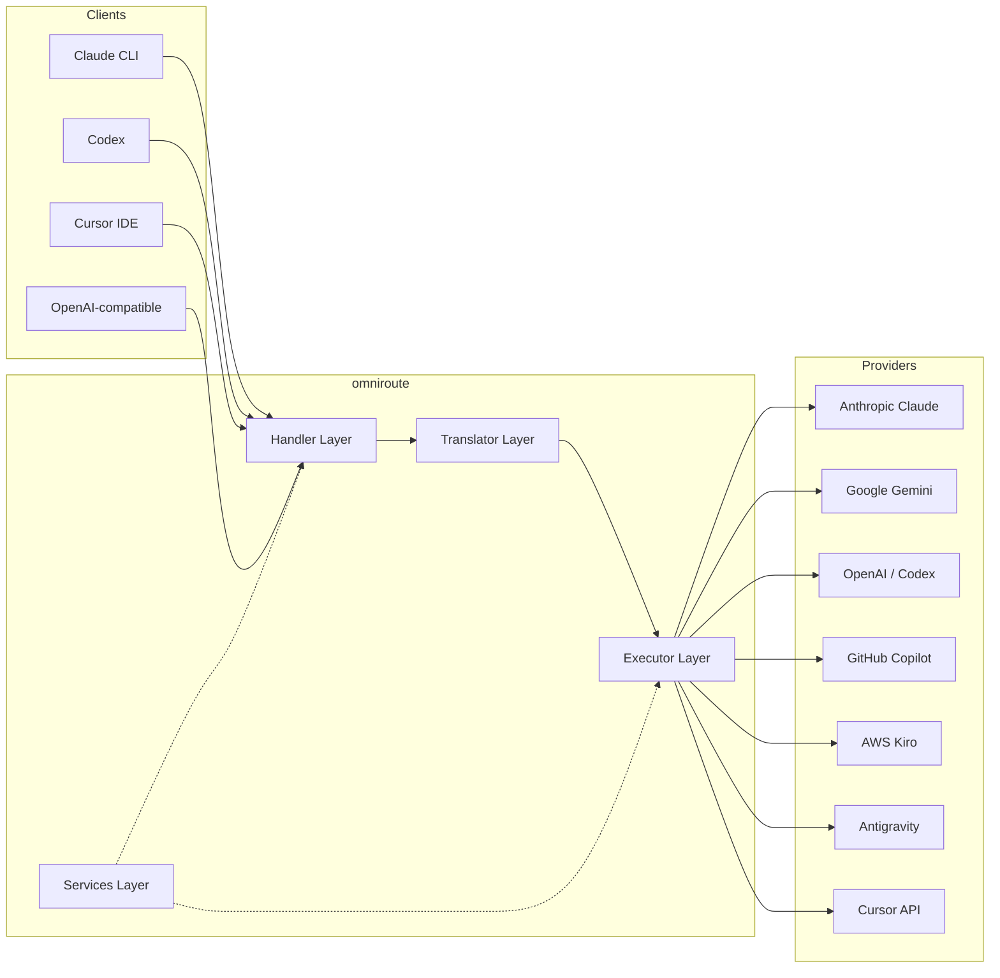
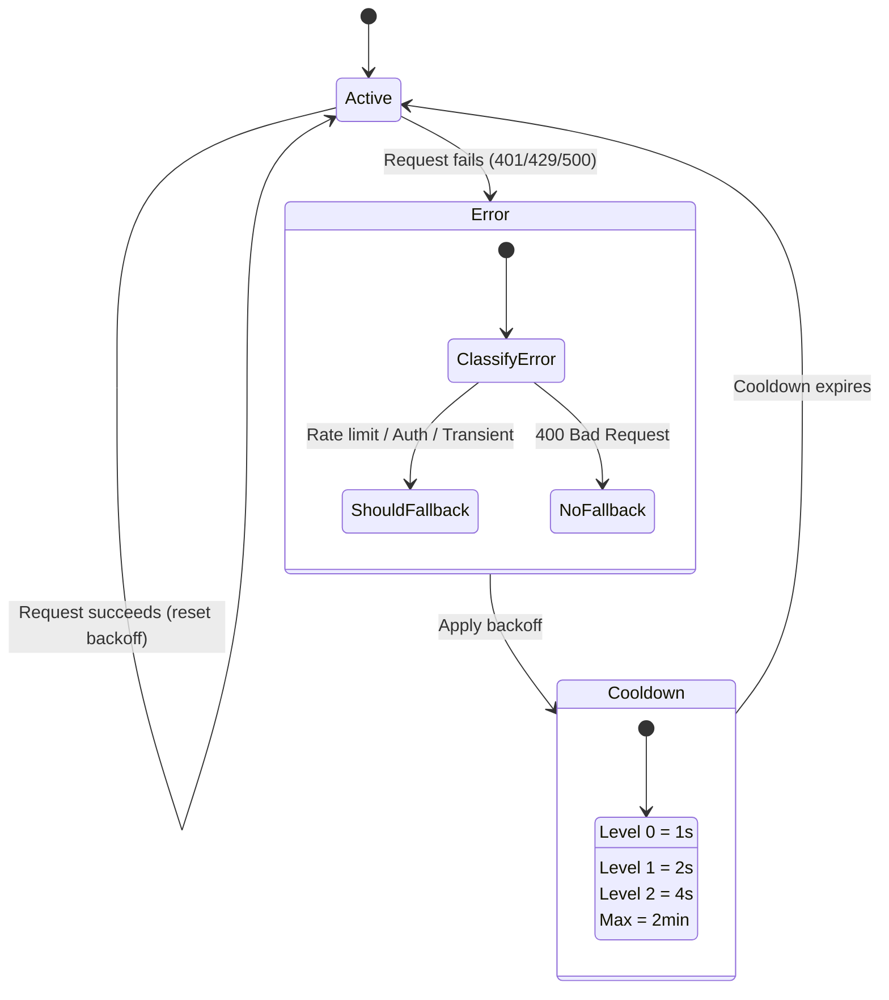
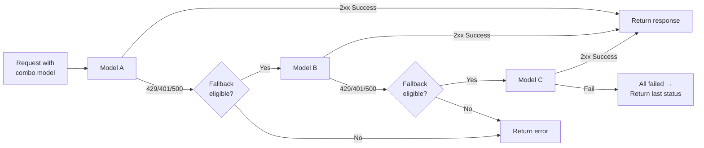
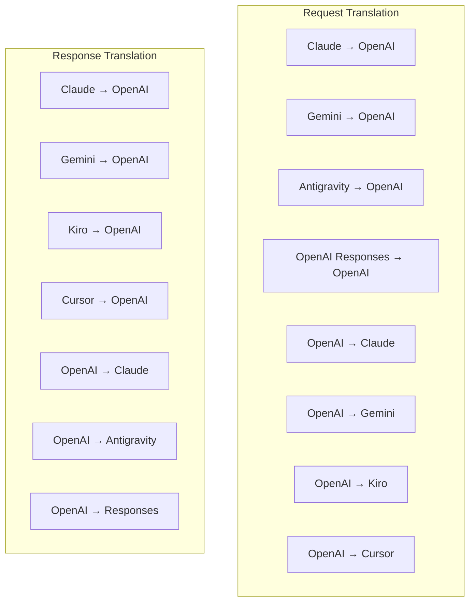
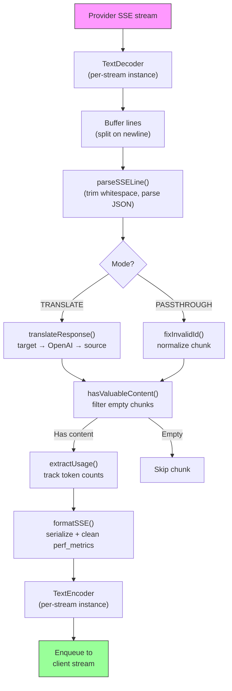
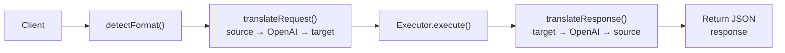
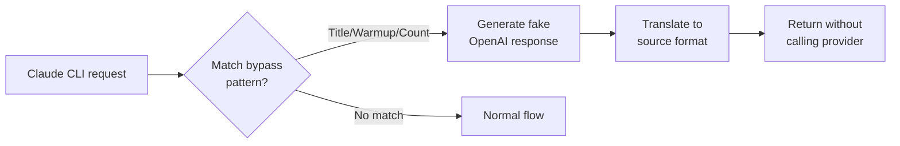

# omniroute — Codebase Documentation (Čeština)

🌐 **Languages:** 🇺🇸 [English](../../../../docs/CODEBASE_DOCUMENTATION.md) · 🇪🇸 [es](../../es/docs/CODEBASE_DOCUMENTATION.md) · 🇫🇷 [fr](../../fr/docs/CODEBASE_DOCUMENTATION.md) · 🇩🇪 [de](../../de/docs/CODEBASE_DOCUMENTATION.md) · 🇮🇹 [it](../../it/docs/CODEBASE_DOCUMENTATION.md) · 🇷🇺 [ru](../../ru/docs/CODEBASE_DOCUMENTATION.md) · 🇨🇳 [zh-CN](../../zh-CN/docs/CODEBASE_DOCUMENTATION.md) · 🇯🇵 [ja](../../ja/docs/CODEBASE_DOCUMENTATION.md) · 🇰🇷 [ko](../../ko/docs/CODEBASE_DOCUMENTATION.md) · 🇸🇦 [ar](../../ar/docs/CODEBASE_DOCUMENTATION.md) · 🇮🇳 [hi](../../hi/docs/CODEBASE_DOCUMENTATION.md) · 🇮🇳 [in](../../in/docs/CODEBASE_DOCUMENTATION.md) · 🇹🇭 [th](../../th/docs/CODEBASE_DOCUMENTATION.md) · 🇻🇳 [vi](../../vi/docs/CODEBASE_DOCUMENTATION.md) · 🇮🇩 [id](../../id/docs/CODEBASE_DOCUMENTATION.md) · 🇲🇾 [ms](../../ms/docs/CODEBASE_DOCUMENTATION.md) · 🇳🇱 [nl](../../nl/docs/CODEBASE_DOCUMENTATION.md) · 🇵🇱 [pl](../../pl/docs/CODEBASE_DOCUMENTATION.md) · 🇸🇪 [sv](../../sv/docs/CODEBASE_DOCUMENTATION.md) · 🇳🇴 [no](../../no/docs/CODEBASE_DOCUMENTATION.md) · 🇩🇰 [da](../../da/docs/CODEBASE_DOCUMENTATION.md) · 🇫🇮 [fi](../../fi/docs/CODEBASE_DOCUMENTATION.md) · 🇵🇹 [pt](../../pt/docs/CODEBASE_DOCUMENTATION.md) · 🇷🇴 [ro](../../ro/docs/CODEBASE_DOCUMENTATION.md) · 🇭🇺 [hu](../../hu/docs/CODEBASE_DOCUMENTATION.md) · 🇧🇬 [bg](../../bg/docs/CODEBASE_DOCUMENTATION.md) · 🇸🇰 [sk](../../sk/docs/CODEBASE_DOCUMENTATION.md) · 🇺🇦 [uk-UA](../../uk-UA/docs/CODEBASE_DOCUMENTATION.md) · 🇮🇱 [he](../../he/docs/CODEBASE_DOCUMENTATION.md) · 🇵🇭 [phi](../../phi/docs/CODEBASE_DOCUMENTATION.md) · 🇧🇷 [pt-BR](../../pt-BR/docs/CODEBASE_DOCUMENTATION.md) · 🇨🇿 [cs](../../cs/docs/CODEBASE_DOCUMENTATION.md) · 🇹🇷 [tr](../../tr/docs/CODEBASE_DOCUMENTATION.md)

---

> Komplexní průvodce proxy routerem**omniroute**pro více poskytovatelů s umělou inteligencí pro začátečníky.---

## 1. What Is omniroute?

omniroute je**proxy router**, který sedí mezi klienty AI (Claude CLI, Codex, Cursor IDE atd.) a poskytovateli AI (Anthropic, Google, OpenAI, AWS, GitHub atd.). Řeší jeden velký problém:

> **Různí klienti AI mluví různými „jazyky“ (formáty API) a různí poskytovatelé AI také očekávají různé „jazyky“.**omniroute mezi nimi automaticky překládá.

Představte si to jako univerzální překladatel v Organizaci spojených národů – každý delegát může mluvit jakýmkoli jazykem a překladatel jej převede na jakéhokoli jiného delegáta.---

## 2. Architecture Overview



### Core Principle: Hub-and-Spoke Translation

Veškerý překlad formátu prochází**formátem OpenAI jako centrem**:```
Client Format → [OpenAI Hub] → Provider Format (request)
Provider Format → [OpenAI Hub] → Client Format (response)

```

To znamená, že potřebujete pouze**N překladatelů**(jeden na formát) místo**N²**(každý pár).---

## 3. Project Structure

```

omniroute/
├── open-sse/ ← Core proxy library (portable, framework-agnostic)
│ ├── index.js ← Main entry point, exports everything
│ ├── config/ ← Configuration & constants
│ ├── executors/ ← Provider-specific request execution
│ ├── handlers/ ← Request handling orchestration
│ ├── services/ ← Business logic (auth, models, fallback, usage)
│ ├── translator/ ← Format translation engine
│ │ ├── request/ ← Request translators (8 files)
│ │ ├── response/ ← Response translators (7 files)
│ │ └── helpers/ ← Shared translation utilities (6 files)
│ └── utils/ ← Utility functions
├── src/ ← Application layer (Express/Worker runtime)
│ ├── app/ ← Web UI, API routes, middleware
│ ├── lib/ ← Database, auth, and shared library code
│ ├── mitm/ ← Man-in-the-middle proxy utilities
│ ├── models/ ← Database models
│ ├── shared/ ← Shared utilities (wrappers around open-sse)
│ ├── sse/ ← SSE endpoint handlers
│ └── store/ ← State management
├── data/ ← Runtime data (credentials, logs)
│ └── provider-credentials.json (external credentials override, gitignored)
└── tester/ ← Test utilities

````

---

## 4. Module-by-Module Breakdown

### 4.1 Config (`open-sse/config/`)

**Jediný zdroj pravdy**pro všechny konfigurace poskytovatelů.

| Soubor | Účel |
| ------------------------------ | ------------------------------------------------------------------------------------------------------ ------------------------------------------------------------------------------------------------------ |
| `constants.ts` | Objekt `PROVIDERS` se základními adresami URL, přihlašovacími údaji OAuth (výchozí), záhlavími a výchozími systémovými výzvami pro každého poskytovatele. Definuje také `HTTP_STATUS`, `ERROR_TYPES`, `COOLDOWN_MS`, `BACKOFF_CONFIG` a `SKIP_PATTERNS`. |
| `credentialLoader.ts` | Načte externí přihlašovací údaje z `data/provider-credentials.json` a sloučí je přes pevně zakódované výchozí hodnoty v `PROVIDERS`. Udržuje tajemství mimo kontrolu zdroje při zachování zpětné kompatibility.               |
| `providerModels.ts` | Centrální registr modelů: mapuje aliasy poskytovatelů → ID modelů. Funkce jako `getModels()`, `getProviderByAlias()`.                                                                                                          |
| `codexInstructions.ts` | Systémové pokyny vložené do požadavků Codexu (omezení úprav, pravidla karantény, zásady schvalování).                                                                                                                 |
| `defaultThinkingSignature.ts` | Výchozí „myšlenkové“ podpisy pro modely Claude a Gemini.                                                                                                                                                               |
| `ollamaModels.ts` | Definice schématu pro lokální modely Ollama (název, velikost, rodina, kvantizace).                                                                                                                                             |#### Credential Loading Flow

```mermaid
flowchart TD
    A["App starts"] --> B["constants.ts defines PROVIDERS\nwith hardcoded defaults"]
    B --> C{"data/provider-credentials.json\nexists?"}
    C -->|Yes| D["credentialLoader reads JSON"]
    C -->|No| E["Use hardcoded defaults"]
    D --> F{"For each provider in JSON"}
    F --> G{"Provider exists\nin PROVIDERS?"}
    G -->|No| H["Log warning, skip"]
    G -->|Yes| I{"Value is object?"}
    I -->|No| J["Log warning, skip"]
    I -->|Yes| K["Merge clientId, clientSecret,\ntokenUrl, authUrl, refreshUrl"]
    K --> F
    H --> F
    J --> F
    F -->|Done| L["PROVIDERS ready with\nmerged credentials"]
    E --> L
````

---

### 4.2 Executors (`open-sse/executors/`)

Exekutoři zapouzdřují**logiku specifickou pro poskytovatele**pomocí**Strategy Pattern**. Každý exekutor podle potřeby přepíše základní metody.```mermaid
classDiagram
class BaseExecutor {
+buildUrl(model, stream, options)
+buildHeaders(credentials, stream, body)
+transformRequest(body, model, stream, credentials)
+execute(url, options)
+shouldRetry(status, error)
+refreshCredentials(credentials, log)
}

    class DefaultExecutor {
        +refreshCredentials()
    }

    class AntigravityExecutor {
        +buildUrl()
        +buildHeaders()
        +transformRequest()
        +shouldRetry()
        +refreshCredentials()
    }

    class CursorExecutor {
        +buildUrl()
        +buildHeaders()
        +transformRequest()
        +parseResponse()
        +generateChecksum()
    }

    class KiroExecutor {
        +buildUrl()
        +buildHeaders()
        +transformRequest()
        +parseEventStream()
        +refreshCredentials()
    }

    BaseExecutor <|-- DefaultExecutor
    BaseExecutor <|-- AntigravityExecutor
    BaseExecutor <|-- CursorExecutor
    BaseExecutor <|-- KiroExecutor
    BaseExecutor <|-- CodexExecutor
    BaseExecutor <|-- GeminiCLIExecutor
    BaseExecutor <|-- GithubExecutor

````

| Exekutor | Poskytovatel | Klíčové specializace |
| ----------------- | ------------------------------------------- | ---------------------------------------------------------------------------------------------------------
| `base.ts` | — | Abstraktní základ: Tvorba URL, záhlaví, logika opakování, obnovení pověření |
| `default.ts` | Claude, Gemini, OpenAI, GLM, Kimi, MiniMax | Obecná obnova tokenu OAuth pro standardní poskytovatele |
| `antigravity.ts` | Google Cloud Code | Generování ID projektu/relace, záložní více adres URL, vlastní opakování analýzy z chybových zpráv ("resetovat po 2h7m23s") |
| `kurzor.ts` | Kurzor IDE |**Nejsložitější**: Ověření kontrolního součtu SHA-256, kódování požadavku Protobuf, binární EventStream → parsování odpovědi SSE |
| `codex.ts` | Kodex OpenAI | Vkládá systémové instrukce, řídí úrovně myšlení, odstraňuje nepodporované parametry |
| `gemini-cli.ts` | Google Gemini CLI | Vytvoření vlastní adresy URL (`streamGenerateContent`), obnovení tokenu Google OAuth |
| `github.ts` | GitHub Copilot | Systém dvou tokenů (GitHub OAuth + token Copilot), napodobování hlavičky VSCode |
| `kiro.ts` | AWS CodeWhisperer | Binární analýza AWS EventStream, rámce událostí AMZN, odhad tokenu |
| `index.ts` | — | Továrna: název poskytovatele map → třída exekutora, s výchozí nouzou |---

### 4.3 Handlers (`open-sse/handlers/`)

**orchestration layer**– koordinuje překlad, provádění, streamování a zpracování chyb.

| Soubor | Účel |
| ---------------------- | ---------------------------------------------------------------------------------------------------- ---------------------------------------------------------------------------------------------------- |
| `chatCore.ts` |**Centrální orchestrátor**(~600 řádků). Zvládá celý životní cyklus požadavku: detekce formátu → překlad → odeslání exekutora → odezva streamování/nestreamování → obnovení tokenu → zpracování chyb → protokolování využití. |
| `responsesHandler.ts` | Adaptér pro OpenAI Responses API: převádí formát odpovědí → Dokončení chatu → odesílá do `chatCore` → převádí SSE zpět na formát odpovědí.                                                                        |
| `embeddings.ts` | Obslužný program generování vkládání: řeší model vkládání → poskytovatel, odesílá rozhraní API poskytovatele, vrací odezvu vkládání kompatibilní s OpenAI. Podporuje 6+ poskytovatelů.                                                    |
| `imageGeneration.ts` | Ovladač generování obrázků: řeší model obrázku → poskytovatel, podporuje režimy kompatibilní s OpenAI, Gemini-image (Antigravity) a záložní (Nebius). Vrátí base64 nebo obrázky URL.                                          |#### Request Lifecycle (chatCore.ts)

```mermaid
sequenceDiagram
    participant Client
    participant chatCore
    participant Translator
    participant Executor
    participant Provider

    Client->>chatCore: Request (any format)
    chatCore->>chatCore: Detect source format
    chatCore->>chatCore: Check bypass patterns
    chatCore->>chatCore: Resolve model & provider
    chatCore->>Translator: Translate request (source → OpenAI → target)
    chatCore->>Executor: Get executor for provider
    Executor->>Executor: Build URL, headers, transform request
    Executor->>Executor: Refresh credentials if needed
    Executor->>Provider: HTTP fetch (streaming or non-streaming)

    alt Streaming
        Provider-->>chatCore: SSE stream
        chatCore->>chatCore: Pipe through SSE transform stream
        Note over chatCore: Transform stream translates<br/>each chunk: target → OpenAI → source
        chatCore-->>Client: Translated SSE stream
    else Non-streaming
        Provider-->>chatCore: JSON response
        chatCore->>Translator: Translate response
        chatCore-->>Client: Translated JSON
    end

    alt Error (401, 429, 500...)
        chatCore->>Executor: Retry with credential refresh
        chatCore->>chatCore: Account fallback logic
    end
````

---

### 4.4 Services (`open-sse/services/`)

| Obchodní logika, která podporuje handlery a exekutory. | File                                                                                                                                                                                                                                                                                                                                   | Purpose |
| ------------------------------------------------------ | -------------------------------------------------------------------------------------------------------------------------------------------------------------------------------------------------------------------------------------------------------------------------------------------------------------------------------------- | ------- |
| `provider.ts`                                          | **Format detection** (`detectFormat`): analyzes request body structure to identify Claude/OpenAI/Gemini/Antigravity/Responses formats (includes `max_tokens` heuristic for Claude). Also: URL building, header building, thinking config normalization. Supports `openai-compatible-*` and `anthropic-compatible-*` dynamic providers. |
| `model.ts`                                             | Model string parsing (`claude/model-name` → `{provider: "claude", model: "model-name"}`), alias resolution with collision detection, input sanitization (rejects path traversal/control chars), and model info resolution with async alias getter support.                                                                             |
| `accountFallback.ts`                                   | Rate-limit handling: exponential backoff (1s → 2s → 4s → max 2min), account cooldown management, error classification (which errors trigger fallback vs. not).                                                                                                                                                                         |
| `tokenRefresh.ts`                                      | OAuth token refresh for **every provider**: Google (Gemini, Antigravity), Claude, Codex, Qwen, Qoder, GitHub (OAuth + Copilot dual-token), Kiro (AWS SSO OIDC + Social Auth). Includes in-flight promise deduplication cache and retry with exponential backoff.                                                                       |
| `combo.ts`                                             | **Combo models**: chains of fallback models. If model A fails with a fallback-eligible error, try model B, then C, etc. Returns actual upstream status codes.                                                                                                                                                                          |
| `usage.ts`                                             | Fetches quota/usage data from provider APIs (GitHub Copilot quotas, Antigravity model quotas, Codex rate limits, Kiro usage breakdowns, Claude settings).                                                                                                                                                                              |
| `accountSelector.ts`                                   | Smart account selection with scoring algorithm: considers priority, health status, round-robin position, and cooldown state to pick the optimal account for each request.                                                                                                                                                              |
| `contextManager.ts`                                    | Request context lifecycle management: creates and tracks per-request context objects with metadata (request ID, timestamps, provider info) for debugging and logging.                                                                                                                                                                  |
| `ipFilter.ts`                                          | IP-based access control: supports allowlist and blocklist modes. Validates client IP against configured rules before processing API requests.                                                                                                                                                                                          |
| `sessionManager.ts`                                    | Session tracking with client fingerprinting: tracks active sessions using hashed client identifiers, monitors request counts, and provides session metrics.                                                                                                                                                                            |
| `signatureCache.ts`                                    | Request signature-based deduplication cache: prevents duplicate requests by caching recent request signatures and returning cached responses for identical requests within a time window.                                                                                                                                              |
| `systemPrompt.ts`                                      | Global system prompt injection: prepends or appends a configurable system prompt to all requests, with per-provider compatibility handling.                                                                                                                                                                                            |
| `thinkingBudget.ts`                                    | Reasoning token budget management: supports passthrough, auto (strip thinking config), custom (fixed budget), and adaptive (complexity-scaled) modes for controlling thinking/reasoning tokens.                                                                                                                                        |
| `wildcardRouter.ts`                                    | Wildcard model pattern routing: resolves wildcard patterns (e.g., `*/claude-*`) to concrete provider/model pairs based on availability and priority.                                                                                                                                                                                   |

#### Token Refresh Deduplication

```mermaid
sequenceDiagram
    participant R1 as Request 1
    participant R2 as Request 2
    participant Cache as refreshPromiseCache
    participant OAuth as OAuth Provider

    R1->>Cache: getAccessToken("gemini", token)
    Cache->>Cache: No in-flight promise
    Cache->>OAuth: Start refresh
    R2->>Cache: getAccessToken("gemini", token)
    Cache->>Cache: Found in-flight promise
    Cache-->>R2: Return existing promise
    OAuth-->>Cache: New access token
    Cache-->>R1: New access token
    Cache-->>R2: Same access token (shared)
    Cache->>Cache: Delete cache entry
```

#### Account Fallback State Machine



#### Combo Model Chain



---

### 4.5 Translator (`open-sse/translator/`)

**Formátový překladový stroj**využívající samoregistrující se zásuvný systém.#### Architektura



| Adresář      | Soubory        | Popis                                                                                                                                                                                                                                                                     |
| ------------ | -------------- | ------------------------------------------------------------------------------------------------------------------------------------------------------------------------------------------------------------------------------------------------------------------------- | ----------------------------------------- |
| `požadavek/` | 8 překladatelů | Převeďte těla požadavků mezi formáty. Každý soubor se při importu sám zaregistruje pomocí `register(from, to, fn)`.                                                                                                                                                       |
| `reakce/`    | 7 překladatelů | Převádějte bloky odezvy streamování mezi formáty. Zvládá typy událostí SSE, bloky myšlení, volání nástrojů.                                                                                                                                                               |
| `pomocníci/` | 6 pomocníků    | Sdílené nástroje: `claudeHelper` (extrakce systémového promptu, konfigurace myšlení), `geminiHelper` (mapování částí/obsahu), `openaiHelper` (filtrování formátů), `toolCallHelper` (generování ID, chybějící vložení odpovědi), `maxTokensHelper`, `responsesApiHelper`. |
| `index.ts`   | —              | Překladový stroj: `translateRequest()`, `translateResponse()`, správa stavu, registr.                                                                                                                                                                                     |
| `formats.ts` | —              | Formátové konstanty: `OPENAI`, `CLAUDE`, `GEMINI`, `ANTIGRAVITY`, `KIRO`, `CURSOR`, `OPENAI_RESPONSES`.                                                                                                                                                                   | #### Key Design: Self-Registering Plugins |

```javascript
// Each translator file calls register() on import:
import { register } from "../index.js";
register("claude", "openai", translateClaudeToOpenAI);

// The index.js imports all translator files, triggering registration:
import "./request/claude-to-openai.js"; // ← self-registers
```

---

### 4.6 Utils (`open-sse/utils/`)

| Soubor             | Účel                                                                                                                                                                                                                                                                                                                |
| ------------------ | ------------------------------------------------------------------------------------------------------------------------------------------------------------------------------------------------------------------------------------------------------------------------------------------------------------------- | --------------------------- |
| `error.ts`         | Vytváření chybové odezvy (formát kompatibilní s OpenAI), analýza chyb upstream, extrakce opakování antigravity z chybových zpráv, streamování chyb SSE.                                                                                                                                                             |
| `stream.ts`        | **SSE Transform Stream**– hlavní streamovací kanál. Dva režimy: `TRANSLATE` (překlad plného formátu) a `PASSTHROUGH` (normalizovat + extrahovat použití). Zvládá ukládání do vyrovnávací paměti, odhad využití, sledování délky obsahu. Instance kodéru/dekodéru pro jednotlivé proudy se vyhýbají sdílenému stavu. |
| `streamHelpers.ts` | Nízkoúrovňové nástroje SSE: `parseSSELine` (tolerující mezery), `hasValuableContent` (filtruje prázdné bloky pro OpenAI/Claude/Gemini), `fixInvalidId`, `formatSSE` (serializace SSE s ohledem na formát s vyčištěním `perf_metrics`).                                                                              |
| `usageTracking.ts` | Extrakce využití tokenů z libovolného formátu (Claude/OpenAI/Gemini/Responses), odhad pomocí samostatných poměrů znaků na token nástroje/zprávy, přidání do vyrovnávací paměti (bezpečnostní rezerva 2000 tokenů), filtrování polí podle formátu, protokolování konzoly pomocí barev ANSI.                          |
| `requestLogger.ts` | Legacy file-based request logging helper kept for compatibility. Current deployments should prefer `APP_LOG_TO_FILE` for application logs and the call log pipeline for persisted request artifacts.                                                                                                                |
| `bypassHandler.ts` | Zachycuje specifické vzory z Claude CLI (extrakce titulů, zahřívání, počet) a vrací falešné odpovědi bez volání jakéhokoli poskytovatele. Podporuje streamování i nestreamování. Záměrně omezeno na rozsah Claude CLI.                                                                                              |
| `networkProxy.ts`  | Vyřeší odchozí adresu URL proxy pro daného poskytovatele s prioritou: konfigurace specifická pro poskytovatele → globální konfigurace → proměnné prostředí (`HTTPS_PROXY`/`HTTP_PROXY`/`ALL_PROXY`). Podporuje výjimky `NO_PROXY`. Konfiguraci mezipaměti po dobu 30 s.                                             | #### SSE Streaming Pipeline |



#### Request Logger Session Structure

```
logs/
└── claude_gemini_claude-sonnet_20260208_143045/
    ├── 1_req_client.json      ← Raw client request
    ├── 2_req_source.json      ← After initial conversion
    ├── 3_req_openai.json      ← OpenAI intermediate format
    ├── 4_req_target.json      ← Final target format
    ├── 5_res_provider.txt     ← Provider SSE chunks (streaming)
    ├── 5_res_provider.json    ← Provider response (non-streaming)
    ├── 6_res_openai.txt       ← OpenAI intermediate chunks
    ├── 7_res_client.txt       ← Client-facing SSE chunks
    └── 6_error.json           ← Error details (if any)
```

---

### 4.7 Application Layer (`src/`)

| Adresář       | Účel                                                                                                 |
| ------------- | ---------------------------------------------------------------------------------------------------- | ----------------------- |
| `src/app/`    | Webové uživatelské rozhraní, trasy API, expresní middleware, obslužné nástroje zpětného volání OAuth |
| `src/lib/`    | Přístup k databázi (`localDb.ts`, `usageDb.ts`), ověřování, sdílené                                  |
| `src/mitm/`   | Man-in-the-middle proxy nástroje pro zachycení provozu poskytovatele                                 |
| `src/models/` | Definice databázových modelů                                                                         |
| `src/shared/` | Obaly kolem funkcí open-sse (poskytovatel, stream, chyba atd.)                                       |
| `src/sse/`    | Obslužné rutiny koncových bodů SSE, které propojují knihovnu open-sse s cestami Express              |
| `src/store/`  | Správa stavu aplikace                                                                                | #### Notable API Routes |

| Trasa                                             | Metody               | Účel                                                                                         |
| ------------------------------------------------- | -------------------- | -------------------------------------------------------------------------------------------- | --- |
| `/api/provider-models`                            | ZÍSKAT/POSLAT/SMAZAT | CRUD pro vlastní modely na poskytovatele                                                     |
| `/api/models/catalog`                             | ZÍSKEJTE             | Souhrnný katalog všech modelů (chat, embedding, image, custom) seskupený podle poskytovatele |
| `/api/settings/proxy`                             | GET/PUT/DELETE       | Hierarchická konfigurace odchozího proxy (`globální/poskytovatelé/komba/klíče`)              |
| `/api/settings/proxy/test`                        | PŘÍSPĚVEK            | Ověřuje připojení proxy a vrací veřejnou IP/latenci                                          |
| `/v1/providers/[poskytovatel]/chat/completions`   | PŘÍSPĚVEK            | Vyhrazená dokončení chatu na poskytovatele s ověřením modelu                                 |
| `/v1/providers/[poskytovatel]/embeddings`         | PŘÍSPĚVEK            | Vyhrazené vložení pro poskytovatele s ověřením modelu                                        |
| `/v1/providers/[poskytovatel]/images/generations` | PŘÍSPĚVEK            | Vyhrazené generování obrazu podle poskytovatele s ověřením modelu                            |
| `/api/settings/ip-filter`                         | GET/PUT              | Správa seznamu povolených/blokovaných IP                                                     |
| `/api/settings/thinking-budget`                   | GET/PUT              | Konfigurace rozpočtu tokenu odůvodnění (průchozí/automatické/vlastní/adaptivní)              |
| `/api/settings/system-prompt`                     | GET/PUT              | Globální systémová okamžitá injekce pro všechny požadavky                                    |
| `/api/sessions`                                   | ZÍSKEJTE             | Sledování aktivní relace a metriky                                                           |
| `/api/rate-limits`                                | ZÍSKEJTE             | Stav limitu sazby na účet                                                                    | --- |

## 5. Key Design Patterns

### 5.1 Hub-and-Spoke Translation

Všechny formáty se překládají prostřednictvím**formátu OpenAI jako centra**. Přidání nového poskytovatele vyžaduje pouze napsat**jeden pár**překladatelů (do/z OpenAI), nikoli N párů.### 5.2 Executor Strategy Pattern

Každý poskytovatel má vyhrazenou třídu exekutorů, která dědí z `BaseExecutor`. Továrna v `executors/index.ts` vybere ten správný za běhu.### 5.3 Self-Registering Plugin System

Moduly překladatele se při importu zaregistrují pomocí `register()`. Přidání nového překladače znamená pouze vytvoření souboru a jeho import.### 5.4 Account Fallback with Exponential Backoff

Když poskytovatel vrátí 429/401/500, systém se může přepnout na další účet a použít exponenciální cooldowny (1s → 2s → 4s → max 2min).### 5.5 Combo Model Chains

"Combo" seskupuje více řetězců "poskytovatel/model". Pokud první selže, automaticky se vraťte k dalšímu.### 5.6 Stateful Streaming Translation

Překlad odezvy udržuje stav napříč bloky SSE (sledování bloků myšlení, akumulace volání nástrojů, indexování bloků obsahu) prostřednictvím mechanismu `initState()`.### 5.7 Usage Safety Buffer

K nahlášenému využití je přidána vyrovnávací paměť s 2000 tokeny, aby se klientům zabránilo narazit na limity kontextového okna kvůli režii systémových výzev a překladu formátu.---

## 6. Supported Formats

| Formát                 | Směr        | Identifikátor     |
| ---------------------- | ----------- | ----------------- | --- |
| Dokončení chatu OpenAI | zdroj + cíl | "openai"          |
| OpenAI Responses API   | zdroj + cíl | "openai-odpovědi" |
| Antropický Claude      | zdroj + cíl | "claude"          |
| Google Gemini          | zdroj + cíl | "blíženci"        |
| Google Gemini CLI      | pouze cíl   | `gemini-cli`      |
| Antigravitace          | zdroj + cíl | "antigravitace"   |
| AWS Kiro               | pouze cíl   | "kiro"            |
| Kurzor                 | pouze cíl   | "kurzor"          | --- |

## 7. Supported Providers

| Poskytovatel                | Metoda ověřování                | Exekutor      | Klíčové poznámky                                      |
| --------------------------- | ------------------------------- | ------------- | ----------------------------------------------------- | --- |
| Antropický Claude           | Klíč API nebo OAuth             | Výchozí       | Používá hlavičku `x-api-key`                          |
| Google Gemini               | Klíč API nebo OAuth             | Výchozí       | Používá záhlaví `x-goog-api-key`                      |
| Google Gemini CLI           | OAuth                           | GeminiCLI     | Používá koncový bod `streamGenerateContent`           |
| Antigravitace               | OAuth                           | Antigravitace | Záložní více adres URL, vlastní opakování analýzy     |
| OpenAI                      | API klíč                        | Výchozí       | Standardní ověření nositele                           |
| Codex                       | OAuth                           | Codex         | Vkládá systémové pokyny, řídí myšlení                 |
| GitHub Copilot              | OAuth + token Copilot           | Github        | Duální token, hlavička VSCode napodobující            |
| Kiro (AWS)                  | AWS SSO OIDC nebo sociální sítě | Kiro          | Analýza binárního EventStreamu                        |
| Kurzor IDE                  | Ověření kontrolního součtu      | Kurzor        | Kódování Protobuf, kontrolní součty SHA-256           |
| Qwen                        | OAuth                           | Výchozí       | Standardní autentizace                                |
| Qoder                       | OAuth (základní + nosič)        | Výchozí       | Dual auth header                                      |
| OpenRouter                  | API klíč                        | Výchozí       | Standardní ověření nositele                           |
| GLM, Kimi, MiniMax          | API klíč                        | Výchozí       | Claude kompatibilní, použijte `x-api-key`             |
| `openai-compatible-*`       | API klíč                        | Výchozí       | Dynamický: jakýkoli koncový bod kompatibilní s OpenAI |
| `antropický-kompatibilní-*` | API klíč                        | Výchozí       | Dynamický: jakýkoli koncový bod kompatibilní s Claude | --- |

## 8. Data Flow Summary

### Streaming Request

```mermaid
flowchart LR
    A["Client"] --> B["detectFormat()"]
    B --> C["translateRequest()\nsource → OpenAI → target"]
    C --> D["Executor\nbuildUrl + buildHeaders"]
    D --> E["fetch(providerURL)"]
    E --> F["createSSEStream()\nTRANSLATE mode"]
    F --> G["parseSSELine()"]
    G --> H["translateResponse()\ntarget → OpenAI → source"]
    H --> I["extractUsage()\n+ addBuffer"]
    I --> J["formatSSE()"]
    J --> K["Client receives\ntranslated SSE"]
    K --> L["logUsage()\nsaveRequestUsage()"]
```



### Non-Streaming Request



### Bypass Flow (Claude CLI)


