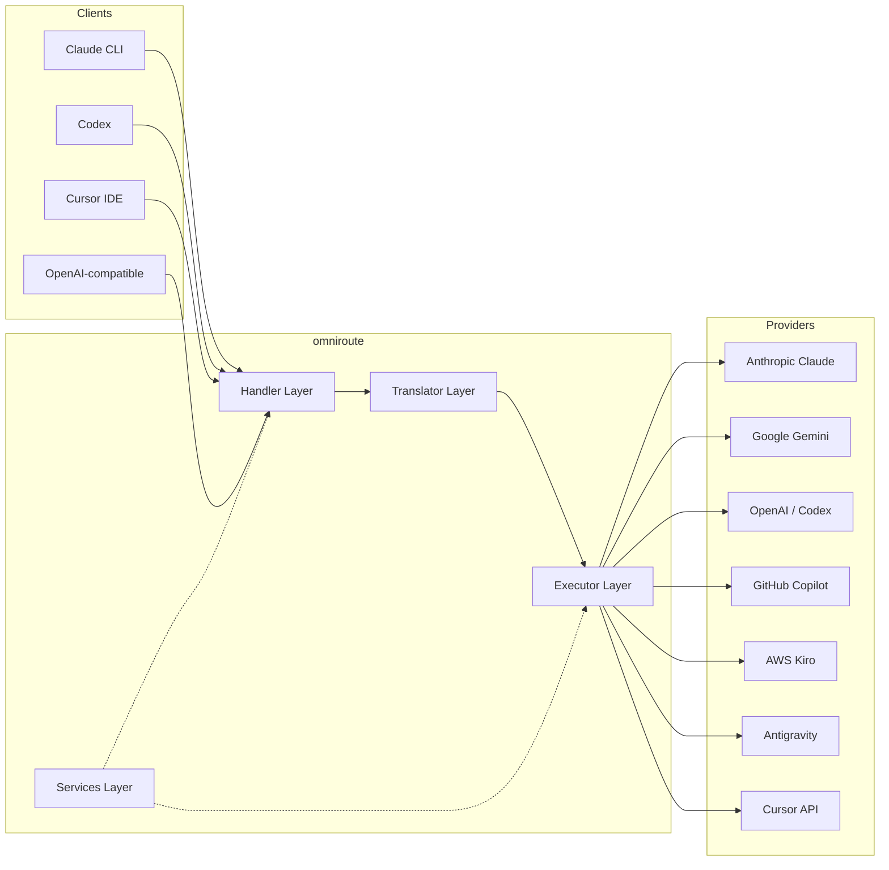
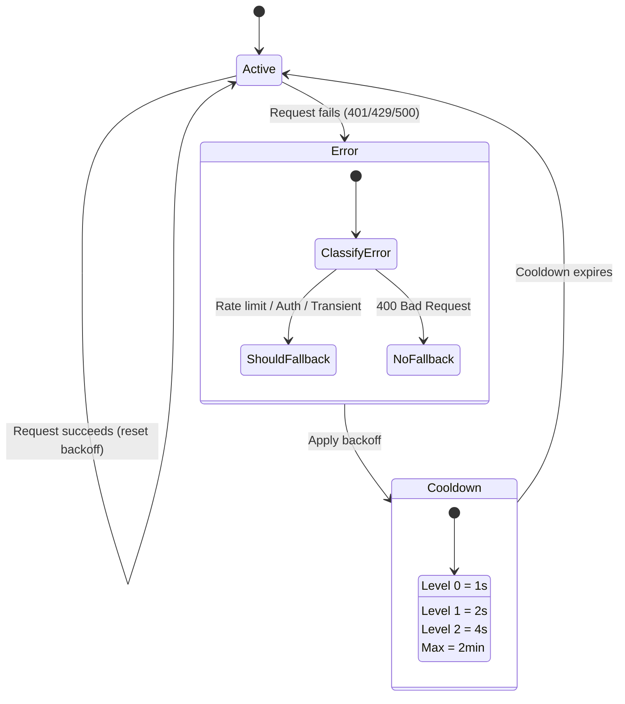
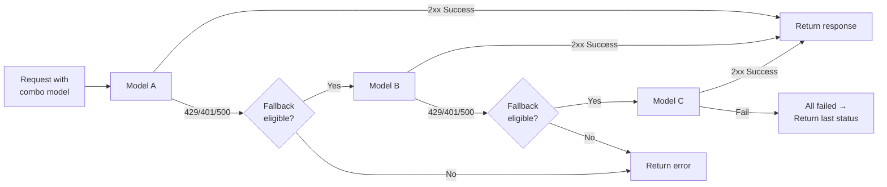
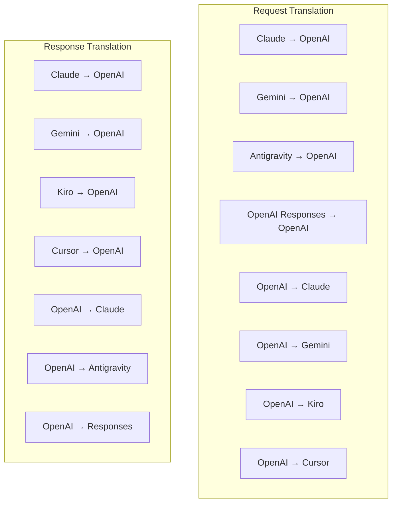
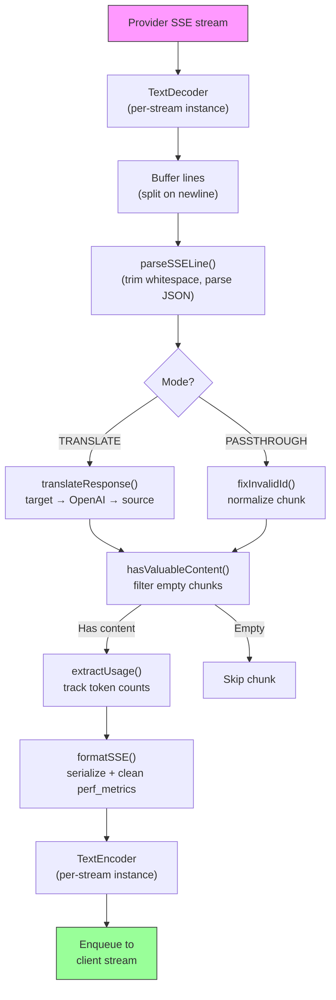
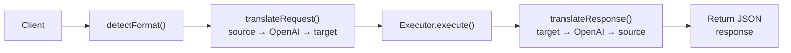
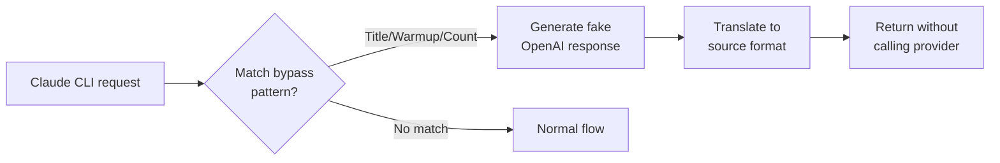

# omniroute — Codebase Documentation (Dansk)

🌐 **Languages:** 🇺🇸 [English](../../../../docs/CODEBASE_DOCUMENTATION.md) · 🇪🇸 [es](../../es/docs/CODEBASE_DOCUMENTATION.md) · 🇫🇷 [fr](../../fr/docs/CODEBASE_DOCUMENTATION.md) · 🇩🇪 [de](../../de/docs/CODEBASE_DOCUMENTATION.md) · 🇮🇹 [it](../../it/docs/CODEBASE_DOCUMENTATION.md) · 🇷🇺 [ru](../../ru/docs/CODEBASE_DOCUMENTATION.md) · 🇨🇳 [zh-CN](../../zh-CN/docs/CODEBASE_DOCUMENTATION.md) · 🇯🇵 [ja](../../ja/docs/CODEBASE_DOCUMENTATION.md) · 🇰🇷 [ko](../../ko/docs/CODEBASE_DOCUMENTATION.md) · 🇸🇦 [ar](../../ar/docs/CODEBASE_DOCUMENTATION.md) · 🇮🇳 [hi](../../hi/docs/CODEBASE_DOCUMENTATION.md) · 🇮🇳 [in](../../in/docs/CODEBASE_DOCUMENTATION.md) · 🇹🇭 [th](../../th/docs/CODEBASE_DOCUMENTATION.md) · 🇻🇳 [vi](../../vi/docs/CODEBASE_DOCUMENTATION.md) · 🇮🇩 [id](../../id/docs/CODEBASE_DOCUMENTATION.md) · 🇲🇾 [ms](../../ms/docs/CODEBASE_DOCUMENTATION.md) · 🇳🇱 [nl](../../nl/docs/CODEBASE_DOCUMENTATION.md) · 🇵🇱 [pl](../../pl/docs/CODEBASE_DOCUMENTATION.md) · 🇸🇪 [sv](../../sv/docs/CODEBASE_DOCUMENTATION.md) · 🇳🇴 [no](../../no/docs/CODEBASE_DOCUMENTATION.md) · 🇩🇰 [da](../../da/docs/CODEBASE_DOCUMENTATION.md) · 🇫🇮 [fi](../../fi/docs/CODEBASE_DOCUMENTATION.md) · 🇵🇹 [pt](../../pt/docs/CODEBASE_DOCUMENTATION.md) · 🇷🇴 [ro](../../ro/docs/CODEBASE_DOCUMENTATION.md) · 🇭🇺 [hu](../../hu/docs/CODEBASE_DOCUMENTATION.md) · 🇧🇬 [bg](../../bg/docs/CODEBASE_DOCUMENTATION.md) · 🇸🇰 [sk](../../sk/docs/CODEBASE_DOCUMENTATION.md) · 🇺🇦 [uk-UA](../../uk-UA/docs/CODEBASE_DOCUMENTATION.md) · 🇮🇱 [he](../../he/docs/CODEBASE_DOCUMENTATION.md) · 🇵🇭 [phi](../../phi/docs/CODEBASE_DOCUMENTATION.md) · 🇧🇷 [pt-BR](../../pt-BR/docs/CODEBASE_DOCUMENTATION.md) · 🇨🇿 [cs](../../cs/docs/CODEBASE_DOCUMENTATION.md) · 🇹🇷 [tr](../../tr/docs/CODEBASE_DOCUMENTATION.md)

---

> En omfattende, begyndervenlig guide til**omniroute**multi-udbyder AI proxy-routeren.---

## 1. What Is omniroute?

omniroute er en**proxy-router**, der sidder mellem AI-klienter (Claude CLI, Codex, Cursor IDE osv.) og AI-udbydere (Anthropic, Google, OpenAI, AWS, GitHub osv.). Det løser et stort problem:

> **Forskellige AI-klienter taler forskellige "sprog" (API-formater), og forskellige AI-udbydere forventer også forskellige "sprog".**omniroute oversætter mellem dem automatisk.

Tænk på det som en universel oversætter i FN - enhver delegeret kan tale et hvilket som helst sprog, og oversætteren konverterer det til enhver anden delegeret.---

## 2. Architecture Overview



### Core Principle: Hub-and-Spoke Translation

Al formatoversættelse passerer gennem**OpenAI-formatet som hub**:```
Client Format → [OpenAI Hub] → Provider Format (request)
Provider Format → [OpenAI Hub] → Client Format (response)

```

Det betyder, at du kun behøver**N oversættere**(én pr. format) i stedet for**N²**(hvert par).---

## 3. Project Structure

```

omniroute/
├── open-sse/ ← Core proxy library (portable, framework-agnostic)
│ ├── index.js ← Main entry point, exports everything
│ ├── config/ ← Configuration & constants
│ ├── executors/ ← Provider-specific request execution
│ ├── handlers/ ← Request handling orchestration
│ ├── services/ ← Business logic (auth, models, fallback, usage)
│ ├── translator/ ← Format translation engine
│ │ ├── request/ ← Request translators (8 files)
│ │ ├── response/ ← Response translators (7 files)
│ │ └── helpers/ ← Shared translation utilities (6 files)
│ └── utils/ ← Utility functions
├── src/ ← Application layer (Express/Worker runtime)
│ ├── app/ ← Web UI, API routes, middleware
│ ├── lib/ ← Database, auth, and shared library code
│ ├── mitm/ ← Man-in-the-middle proxy utilities
│ ├── models/ ← Database models
│ ├── shared/ ← Shared utilities (wrappers around open-sse)
│ ├── sse/ ← SSE endpoint handlers
│ └── store/ ← State management
├── data/ ← Runtime data (credentials, logs)
│ └── provider-credentials.json (external credentials override, gitignored)
└── tester/ ← Test utilities

````

---

## 4. Module-by-Module Breakdown

### 4.1 Config (`open-sse/config/`)

Den**enkelte kilde til sandhed**for alle udbyderkonfigurationer.

| Fil | Formål |
| ------------------------------ | ------------------------------------------------------------------------------------------------------------------------------------------------------------------------------------------------------------------ |
| `konstanter.ts` | `PROVIDERS`-objekt med basis-URL'er, OAuth-legitimationsoplysninger (standarder), headere og standardsystemprompter for hver udbyder. Definerer også `HTTP_STATUS`, `ERROR_TYPES`, `COOLDOWN_MS`, `BACKOFF_CONFIG` og `SKIP_PATTERNS`. |
| `credentialLoader.ts` | Indlæser eksterne legitimationsoplysninger fra `data/provider-credentials.json` og fletter dem over de hårdkodede standardindstillinger i `PROVIDERS`. Holder hemmeligheder uden for kildekontrol og bevarer bagudkompatibilitet.               |
| `providerModels.ts` | Central modelregistrering: kortudbyderaliasser → model-id'er. Funktioner som `getModels()`, `getProviderByAlias()`.                                                                                                          |
| `codexInstructions.ts` | Systeminstruktioner indsat i Codex-anmodninger (redigeringsbegrænsninger, sandkasseregler, godkendelsespolitikker).                                                                                                                 |
| `defaultThinkingSignature.ts` | Standard "tænkende" signaturer for Claude og Gemini modeller.                                                                                                                                                               |
| `ollamaModels.ts` | Skemadefinition for lokale Ollama-modeller (navn, størrelse, familie, kvantisering).                                                                                                                                             |#### Credential Loading Flow

```mermaid
flowchart TD
    A["App starts"] --> B["constants.ts defines PROVIDERS\nwith hardcoded defaults"]
    B --> C{"data/provider-credentials.json\nexists?"}
    C -->|Yes| D["credentialLoader reads JSON"]
    C -->|No| E["Use hardcoded defaults"]
    D --> F{"For each provider in JSON"}
    F --> G{"Provider exists\nin PROVIDERS?"}
    G -->|No| H["Log warning, skip"]
    G -->|Yes| I{"Value is object?"}
    I -->|No| J["Log warning, skip"]
    I -->|Yes| K["Merge clientId, clientSecret,\ntokenUrl, authUrl, refreshUrl"]
    K --> F
    H --> F
    J --> F
    F -->|Done| L["PROVIDERS ready with\nmerged credentials"]
    E --> L
````

---

### 4.2 Executors (`open-sse/executors/`)

Eksekutører indkapsler**udbyderspecifik logik**ved hjælp af**Strategy Pattern**. Hver executor tilsidesætter basismetoder efter behov.```mermaid
classDiagram
class BaseExecutor {
+buildUrl(model, stream, options)
+buildHeaders(credentials, stream, body)
+transformRequest(body, model, stream, credentials)
+execute(url, options)
+shouldRetry(status, error)
+refreshCredentials(credentials, log)
}

    class DefaultExecutor {
        +refreshCredentials()
    }

    class AntigravityExecutor {
        +buildUrl()
        +buildHeaders()
        +transformRequest()
        +shouldRetry()
        +refreshCredentials()
    }

    class CursorExecutor {
        +buildUrl()
        +buildHeaders()
        +transformRequest()
        +parseResponse()
        +generateChecksum()
    }

    class KiroExecutor {
        +buildUrl()
        +buildHeaders()
        +transformRequest()
        +parseEventStream()
        +refreshCredentials()
    }

    BaseExecutor <|-- DefaultExecutor
    BaseExecutor <|-- AntigravityExecutor
    BaseExecutor <|-- CursorExecutor
    BaseExecutor <|-- KiroExecutor
    BaseExecutor <|-- CodexExecutor
    BaseExecutor <|-- GeminiCLIExecutor
    BaseExecutor <|-- GithubExecutor

````

| Eksekutør | Udbyder | Nøglespecialiseringer |
| ---------------- | ------------------------------------------ | ------------------------------------------------------------------------------------------------------------------ |
| `base.ts` | — | Abstrakt base: URL-opbygning, overskrifter, genforsøgslogik, opdatering af legitimationsoplysninger |
| `default.ts` | Claude, Gemini, OpenAI, GLM, Kimi, MiniMax | Generisk OAuth-tokenopdatering til standardudbydere |
| `antigravity.ts` | Google Cloud-kode | Generering af projekt-/sessions-id, multi-URL fallback, brugerdefineret genforsøg at parse fra fejlmeddelelser ("nulstil efter 2t7m23s") |
| `cursor.ts` | Markør IDE |**Mest kompleks**: SHA-256 checksum auth, Protobuf request encoding, binær EventStream → SSE respons parsing |
| `codex.ts` | OpenAI Codex | Injicerer systeminstruktioner, styrer tankeniveauer, fjerner ikke-understøttede parametre |
| `gemini-cli.ts` | Google Gemini CLI | Opbygning af tilpasset URL (`streamGenerateContent`), opdatering af Google OAuth-token |
| `github.ts` | GitHub Copilot | Dobbelt token-system (GitHub OAuth + Copilot-token), VSCode-header-efterligning |
| `kiro.ts` | AWS CodeWhisperer | AWS EventStream binær parsing, AMZN hændelsesrammer, token estimering |
| `index.ts` | — | Fabrik: navn på kortudbyder → eksekveringsklasse, med standard fallback |---

### 4.3 Handlers (`open-sse/handlers/`)

**Orkestreringslaget**— koordinerer oversættelse, udførelse, streaming og fejlhåndtering.

| Fil | Formål |
| ---------------------- | -------------------------------------------------------------------------------------------------------------------------------------------------------------------------------------------------------------- |
| `chatCore.ts` |**Central orkestrator**(~600 linjer). Håndterer hele forespørgselslivscyklussen: formatdetektion → oversættelse → eksekutørafsendelse → streaming/ikke-streamingsvar → token-opdatering → fejlhåndtering → logføring af brug. |
| `responsesHandler.ts` | Adapter til OpenAI's Responses API: konverterer svarformat → Chatfuldførelser → sender til `chatCore` → konverterer SSE tilbage til svarformat.                                                                        |
| `indlejringer.ts` | Indlejringsgenereringshåndtering: løser indlejringsmodel → udbyder, sender til udbyder API, returnerer OpenAI-kompatibelt indlejringssvar. Understøtter 6+ udbydere.                                                    |
| `imageGeneration.ts` | Billedgenereringshåndtering: løser billedmodel → udbyder, understøtter OpenAI-kompatibel, Gemini-image (Antigravity) og fallback (Nebius) tilstande. Returnerer base64- eller URL-billeder.                                          |#### Request Lifecycle (chatCore.ts)

```mermaid
sequenceDiagram
    participant Client
    participant chatCore
    participant Translator
    participant Executor
    participant Provider

    Client->>chatCore: Request (any format)
    chatCore->>chatCore: Detect source format
    chatCore->>chatCore: Check bypass patterns
    chatCore->>chatCore: Resolve model & provider
    chatCore->>Translator: Translate request (source → OpenAI → target)
    chatCore->>Executor: Get executor for provider
    Executor->>Executor: Build URL, headers, transform request
    Executor->>Executor: Refresh credentials if needed
    Executor->>Provider: HTTP fetch (streaming or non-streaming)

    alt Streaming
        Provider-->>chatCore: SSE stream
        chatCore->>chatCore: Pipe through SSE transform stream
        Note over chatCore: Transform stream translates<br/>each chunk: target → OpenAI → source
        chatCore-->>Client: Translated SSE stream
    else Non-streaming
        Provider-->>chatCore: JSON response
        chatCore->>Translator: Translate response
        chatCore-->>Client: Translated JSON
    end

    alt Error (401, 429, 500...)
        chatCore->>Executor: Retry with credential refresh
        chatCore->>chatCore: Account fallback logic
    end
````

---

### 4.4 Services (`open-sse/services/`)

| Forretningslogik, der understøtter behandlerne og udførerne. | File                                                                                                                                                                                                                                                                                                                                   | Purpose |
| ------------------------------------------------------------ | -------------------------------------------------------------------------------------------------------------------------------------------------------------------------------------------------------------------------------------------------------------------------------------------------------------------------------------- | ------- |
| `provider.ts`                                                | **Format detection** (`detectFormat`): analyzes request body structure to identify Claude/OpenAI/Gemini/Antigravity/Responses formats (includes `max_tokens` heuristic for Claude). Also: URL building, header building, thinking config normalization. Supports `openai-compatible-*` and `anthropic-compatible-*` dynamic providers. |
| `model.ts`                                                   | Model string parsing (`claude/model-name` → `{provider: "claude", model: "model-name"}`), alias resolution with collision detection, input sanitization (rejects path traversal/control chars), and model info resolution with async alias getter support.                                                                             |
| `accountFallback.ts`                                         | Rate-limit handling: exponential backoff (1s → 2s → 4s → max 2min), account cooldown management, error classification (which errors trigger fallback vs. not).                                                                                                                                                                         |
| `tokenRefresh.ts`                                            | OAuth token refresh for **every provider**: Google (Gemini, Antigravity), Claude, Codex, Qwen, Qoder, GitHub (OAuth + Copilot dual-token), Kiro (AWS SSO OIDC + Social Auth). Includes in-flight promise deduplication cache and retry with exponential backoff.                                                                       |
| `combo.ts`                                                   | **Combo models**: chains of fallback models. If model A fails with a fallback-eligible error, try model B, then C, etc. Returns actual upstream status codes.                                                                                                                                                                          |
| `usage.ts`                                                   | Fetches quota/usage data from provider APIs (GitHub Copilot quotas, Antigravity model quotas, Codex rate limits, Kiro usage breakdowns, Claude settings).                                                                                                                                                                              |
| `accountSelector.ts`                                         | Smart account selection with scoring algorithm: considers priority, health status, round-robin position, and cooldown state to pick the optimal account for each request.                                                                                                                                                              |
| `contextManager.ts`                                          | Request context lifecycle management: creates and tracks per-request context objects with metadata (request ID, timestamps, provider info) for debugging and logging.                                                                                                                                                                  |
| `ipFilter.ts`                                                | IP-based access control: supports allowlist and blocklist modes. Validates client IP against configured rules before processing API requests.                                                                                                                                                                                          |
| `sessionManager.ts`                                          | Session tracking with client fingerprinting: tracks active sessions using hashed client identifiers, monitors request counts, and provides session metrics.                                                                                                                                                                            |
| `signatureCache.ts`                                          | Request signature-based deduplication cache: prevents duplicate requests by caching recent request signatures and returning cached responses for identical requests within a time window.                                                                                                                                              |
| `systemPrompt.ts`                                            | Global system prompt injection: prepends or appends a configurable system prompt to all requests, with per-provider compatibility handling.                                                                                                                                                                                            |
| `thinkingBudget.ts`                                          | Reasoning token budget management: supports passthrough, auto (strip thinking config), custom (fixed budget), and adaptive (complexity-scaled) modes for controlling thinking/reasoning tokens.                                                                                                                                        |
| `wildcardRouter.ts`                                          | Wildcard model pattern routing: resolves wildcard patterns (e.g., `*/claude-*`) to concrete provider/model pairs based on availability and priority.                                                                                                                                                                                   |

#### Token Refresh Deduplication

```mermaid
sequenceDiagram
    participant R1 as Request 1
    participant R2 as Request 2
    participant Cache as refreshPromiseCache
    participant OAuth as OAuth Provider

    R1->>Cache: getAccessToken("gemini", token)
    Cache->>Cache: No in-flight promise
    Cache->>OAuth: Start refresh
    R2->>Cache: getAccessToken("gemini", token)
    Cache->>Cache: Found in-flight promise
    Cache-->>R2: Return existing promise
    OAuth-->>Cache: New access token
    Cache-->>R1: New access token
    Cache-->>R2: Same access token (shared)
    Cache->>Cache: Delete cache entry
```

#### Account Fallback State Machine



#### Combo Model Chain



---

### 4.5 Translator (`open-sse/translator/`)

**formatoversættelsesmotoren**ved hjælp af et selvregistrerende plugin-system.#### Arkitektur



| Katalog      | Filer         | Beskrivelse                                                                                                                                                                                                                                                    |
| ------------ | ------------- | -------------------------------------------------------------------------------------------------------------------------------------------------------------------------------------------------------------------------------------------------------------- | ----------------------------------------- |
| `anmodning/` | 8 oversættere | Konverter anmodningstekster mellem formater. Hver fil selvregistreres via `register(fra, til, fn)` ved import.                                                                                                                                                 |
| `svar/`      | 7 oversættere | Konverter streamingsvarstykker mellem formater. Håndterer SSE-hændelsestyper, tænkeblokke, værktøjskald.                                                                                                                                                       |
| `hjælpere/`  | 6 hjælpere    | Delte hjælpeprogrammer: `claudeHelper` (udtræk af systemprompt, tænkekonfig), `geminiHelper` (mapping af dele/indhold), `openaiHelper` (formatfiltrering), `toolCallHelper` (ID-generering, manglende svarinjektion), `maxTokensHelper`, `responsesApiHelper`. |
| `index.ts`   | —             | Oversættelsesmaskine: `translateRequest()`, `translateResponse()`, tilstandsstyring, registreringsdatabasen.                                                                                                                                                   |
| `formats.ts` | —             | Formatkonstanter: `OPENAI`, `CLAUDE`, `GEMINI`, `ANTIGRAVITY`, `KIRO`, `CURSOR`, `OPENAI_RESPONSES`.                                                                                                                                                           | #### Key Design: Self-Registering Plugins |

```javascript
// Each translator file calls register() on import:
import { register } from "../index.js";
register("claude", "openai", translateClaudeToOpenAI);

// The index.js imports all translator files, triggering registration:
import "./request/claude-to-openai.js"; // ← self-registers
```

---

### 4.6 Utils (`open-sse/utils/`)

| Fil                | Formål                                                                                                                                                                                                                                                                                     |
| ------------------ | ------------------------------------------------------------------------------------------------------------------------------------------------------------------------------------------------------------------------------------------------------------------------------------------ | --------------------------- |
| `error.ts`         | Opbygning af fejlsvar (OpenAI-kompatibelt format), upstream fejlparsing, Antigravity genforsøgstidsudtrækning fra fejlmeddelelser, SSE fejlstreaming.                                                                                                                                      |
| `stream.ts`        | **SSE Transform Stream**— den centrale streamingpipeline. To tilstande: 'OVERSÆTT' (oversættelse i fuld format) og 'PASSTHROUGH' (normalisere + udtræk brug). Håndterer chunk-buffring, brugsestimering, indholdslængdesporing. Per-stream encoder/decoder-instanser undgår delt tilstand. |
| `streamHelpers.ts` | SSE-værktøjer på lavt niveau: `parseSSELine` (whitespace-tolerant), `hasValuableContent` (filtrerer tomme bidder til OpenAI/Claude/Gemini), `fixInvalidId`, `formatSSE` (format-bevidst SSE-serialisering med `perf_metrics`-oprydning).                                                   |
| `usageTracking.ts` | Udtræk af tokenbrug fra ethvert format (Claude/OpenAI/Gemini/Responses), estimering med separate værktøj/meddelelse-char-per-token-forhold, buffertilsætning (2000 tokens sikkerhedsmargen), formatspecifik feltfiltrering, konsollogning med ANSI-farver.                                 |
| `requestLogger.ts` | Legacy file-based request logging helper kept for compatibility. Current deployments should prefer `APP_LOG_TO_FILE` for application logs and the call log pipeline for persisted request artifacts.                                                                                       |
| `bypassHandler.ts` | Opsnapper specifikke mønstre fra Claude CLI (titeludtræk, opvarmning, optælling) og returnerer falske svar uden at ringe til nogen udbyder. Understøtter både streaming og ikke-streaming. Med vilje begrænset til Claude CLI-omfang.                                                      |
| `netværkProxy.ts`  | Løser udgående proxy-URL for en given udbyder med forrang: udbyderspecifik konfiguration → global konfiguration → miljøvariabler (`HTTPS_PROXY`/`HTTP_PROXY`/`ALL_PROXY`). Understøtter "NO_PROXY"-ekskluderinger. Caches konfiguration for 30'erne.                                       | #### SSE Streaming Pipeline |



#### Request Logger Session Structure

```
logs/
└── claude_gemini_claude-sonnet_20260208_143045/
    ├── 1_req_client.json      ← Raw client request
    ├── 2_req_source.json      ← After initial conversion
    ├── 3_req_openai.json      ← OpenAI intermediate format
    ├── 4_req_target.json      ← Final target format
    ├── 5_res_provider.txt     ← Provider SSE chunks (streaming)
    ├── 5_res_provider.json    ← Provider response (non-streaming)
    ├── 6_res_openai.txt       ← OpenAI intermediate chunks
    ├── 7_res_client.txt       ← Client-facing SSE chunks
    └── 6_error.json           ← Error details (if any)
```

---

### 4.7 Application Layer (`src/`)

| Katalog       | Formål                                                                       |
| ------------- | ---------------------------------------------------------------------------- | ----------------------- |
| `src/app/`    | Web-UI, API-ruter, Express-middleware, OAuth-tilbagekaldsbehandlere          |
| `src/lib/`    | Databaseadgang (`localDb.ts`, `usageDb.ts`), autentificering, delt           |
| `src/mitm/`   | Man-in-the-middle proxy-værktøjer til at opsnappe udbydertrafik              |
| `src/models/` | Databasemodeldefinitioner                                                    |
| `src/shared/` | Indpakninger omkring åben-sse-funktioner (udbyder, stream, fejl osv.)        |
| `src/sse/`    | SSE-slutpunktshandlere, der forbinder open-sse-biblioteket til Express-ruter |
| `src/store/`  | Administration af applikationstilstand                                       | #### Notable API Routes |

| Rute                                           | Metoder       | Formål                                                                                                 |
| ---------------------------------------------- | ------------- | ------------------------------------------------------------------------------------------------------ | --- |
| `/api/udbyder-modeller`                        | GET/POST/SLET | CRUD til brugerdefinerede modeller pr. udbyder                                                         |
| `/api/models/catalog`                          | FÅ            | Samlet katalog over alle modeller (chat, indlejring, billede, brugerdefineret) grupperet efter udbyder |
| `/api/indstillinger/proxy`                     | GET/SETT/SLET | Hierarkisk udgående proxy-konfiguration (`global/udbydere/kombinationer/nøgler`)                       |
| `/api/settings/proxy/test`                     | POST          | Validerer proxy-forbindelse og returnerer offentlig IP/latency                                         |
| `/v1/udbydere/[udbyder]/chat/afslutninger`     | POST          | Dedikerede chat-afslutninger pr. udbyder med modelvalidering                                           |
| `/v1/udbydere/[udbyder]/indlejringer`          | POST          | Dedikerede indlejringer pr. udbyder med modelvalidering                                                |
| `/v1/udbydere/[udbyder]/billeder/generationer` | POST          | Dedikeret billedgenerering pr. udbyder med modelvalidering                                             |
| `/api/indstillinger/ip-filter`                 | GET/PUT       | Administration af IP-tilladelsesliste/blokeringsliste                                                  |
| `/api/indstillinger/tænkebudget`               | GET/PUT       | Begrundelsestokens budgetkonfiguration (passthrough/auto/custom/adaptive)                              |
| `/api/settings/system-prompt`                  | GET/PUT       | Global systemprompt-injektion for alle anmodninger                                                     |
| `/api/sessioner`                               | FÅ            | Aktiv sessionssporing og metrics                                                                       |
| `/api/rate-limits`                             | FÅ            | Satsgrænsestatus pr. konto                                                                             | --- |

## 5. Key Design Patterns

### 5.1 Hub-and-Spoke Translation

Alle formater oversættes gennem**OpenAI-format som hub**. Tilføjelse af en ny udbyder kræver kun at skrive**et par**af oversættere (til/fra OpenAI), ikke N par.### 5.2 Executor Strategy Pattern

Hver udbyder har en dedikeret eksekveringsklasse, der arver fra `BaseExecutor`. Fabrikken i `executors/index.ts` vælger den rigtige ved kørsel.### 5.3 Self-Registering Plugin System

Oversættermoduler registrerer sig selv ved import via `register()`. Tilføjelse af en ny oversætter er blot at oprette en fil og importere den.### 5.4 Account Fallback with Exponential Backoff

Når en udbyder returnerer 429/401/500, kan systemet skifte til den næste konto ved at anvende eksponentielle nedkøling (1s → 2s → 4s → max 2min).### 5.5 Combo Model Chains

En "combo" grupperer flere `udbyder/model`-strenge. Hvis den første fejler, går du automatisk tilbage til den næste.### 5.6 Stateful Streaming Translation

Svaroversættelse opretholder tilstand på tværs af SSE-chunks (tænkebloksporing, akkumulering af værktøjsopkald, indholdsblokindeksering) via `initState()`-mekanismen.### 5.7 Usage Safety Buffer

En 2000-token buffer tilføjes til rapporteret brug for at forhindre klienter i at ramme kontekstvinduegrænser på grund af overhead fra systemprompter og formatoversættelse.---

## 6. Supported Formats

| Format                   | Retning     | Identifikator     |
| ------------------------ | ----------- | ----------------- | --- |
| OpenAI Chat fuldførelser | kilde + mål | `openai`          |
| OpenAI Responses API     | kilde + mål | `openai-svar`     |
| Antropiske Claude        | kilde + mål | `claude`          |
| Google Gemini            | kilde + mål | `gemini`          |
| Google Gemini CLI        | kun mål     | `gemini-cli`      |
| Antigravitation          | kilde + mål | `antityngdekraft` |
| AWS Kiro                 | kun mål     | `kiro`            |
| Markør                   | kun mål     | `markør`          | --- |

## 7. Supported Providers

| Udbyder                  | Auth metode                   | Eksekutør       | Nøglebemærkninger                               |
| ------------------------ | ----------------------------- | --------------- | ----------------------------------------------- | --- |
| Antropiske Claude        | API-nøgle eller OAuth         | Standard        | Bruger "x-api-key" header                       |
| Google Gemini            | API-nøgle eller OAuth         | Standard        | Bruger "x-goog-api-key" header                  |
| Google Gemini CLI        | OAuth                         | GeminiCLI       | Bruger `streamGenerateContent` slutpunkt        |
| Antigravitation          | OAuth                         | Antigravitation | Multi-URL fallback, tilpasset genforsøg parsing |
| OpenAI                   | API nøgle                     | Standard        | Standard bærer auth                             |
| Codex                    | OAuth                         | Codex           | Injicerer systeminstruktioner, styrer tænkning  |
| GitHub Copilot           | OAuth + Copilot-token         | Github          | Dobbelt token, VSCode-header-efterligning       |
| Kiro (AWS)               | AWS SSO OIDC eller Social     | Kiro            | Binær EventStream-parsing                       |
| Markør IDE               | Kontrolsum auth               | Markør          | Protobuf-kodning, SHA-256 kontrolsummer         |
| Qwen                     | OAuth                         | Standard        | Standard auth                                   |
| Qoder                    | OAuth (grundlæggende + bærer) | Standard        | Dobbelt godkendelseshoved                       |
| OpenRouter               | API nøgle                     | Standard        | Standard bærer auth                             |
| GLM, Kimi, MiniMax       | API nøgle                     | Standard        | Claude-kompatibel, brug `x-api-key`             |
| `openai-kompatibel-*`    | API nøgle                     | Standard        | Dynamisk: ethvert OpenAI-kompatibelt slutpunkt  |
| `antropisk-kompatibel-*` | API nøgle                     | Standard        | Dynamisk: ethvert Claude-kompatibelt slutpunkt  | --- |

## 8. Data Flow Summary

### Streaming Request

```mermaid
flowchart LR
    A["Client"] --> B["detectFormat()"]
    B --> C["translateRequest()\nsource → OpenAI → target"]
    C --> D["Executor\nbuildUrl + buildHeaders"]
    D --> E["fetch(providerURL)"]
    E --> F["createSSEStream()\nTRANSLATE mode"]
    F --> G["parseSSELine()"]
    G --> H["translateResponse()\ntarget → OpenAI → source"]
    H --> I["extractUsage()\n+ addBuffer"]
    I --> J["formatSSE()"]
    J --> K["Client receives\ntranslated SSE"]
    K --> L["logUsage()\nsaveRequestUsage()"]
```



### Non-Streaming Request



### Bypass Flow (Claude CLI)


