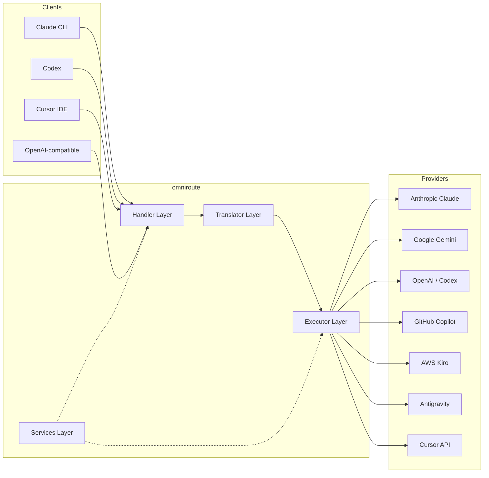
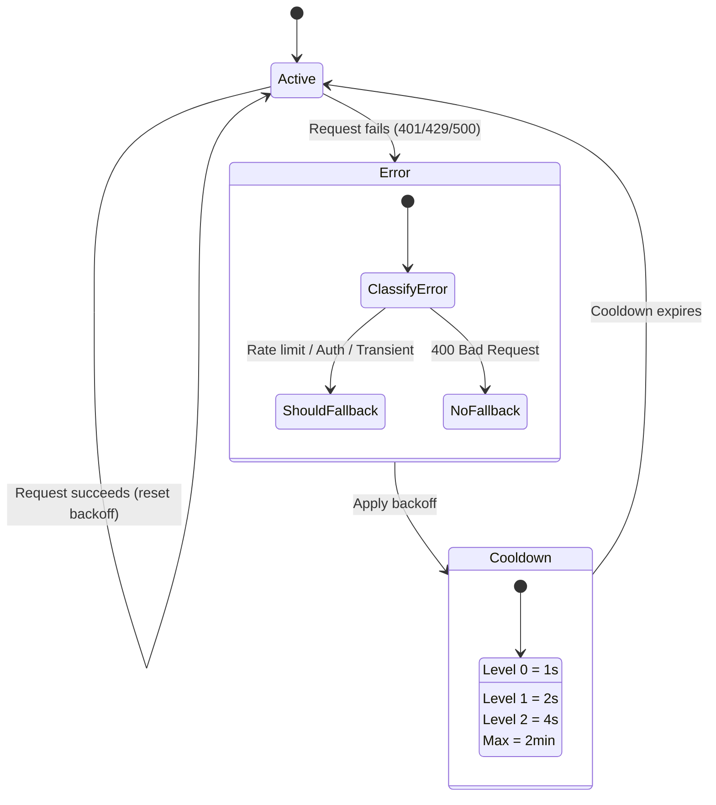
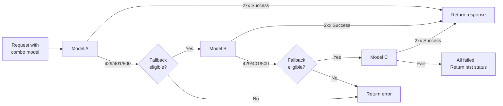
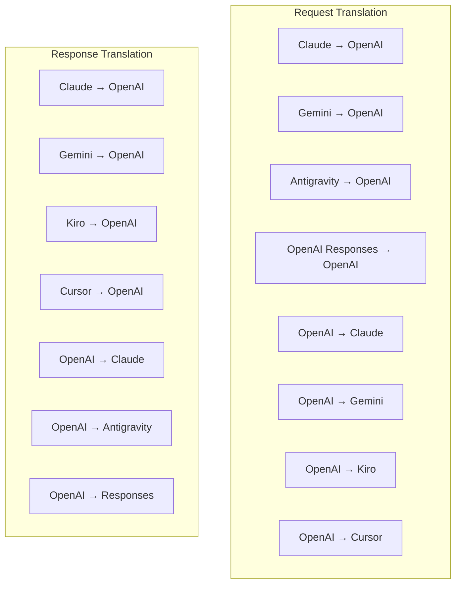
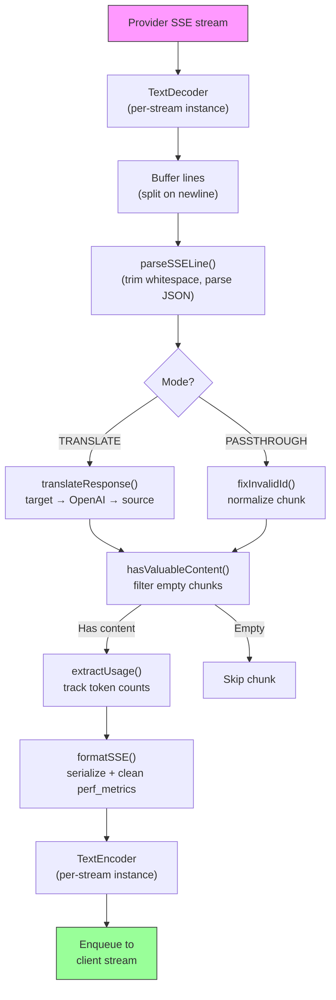
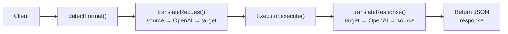
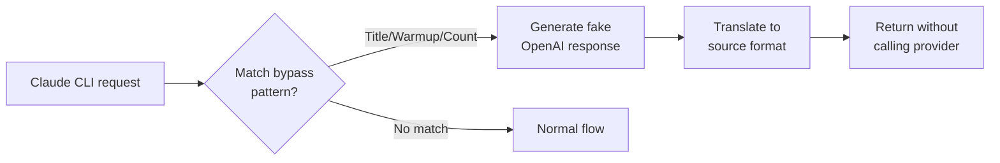

# omniroute — Codebase Documentation (Deutsch)

🌐 **Languages:** 🇺🇸 [English](../../../../docs/CODEBASE_DOCUMENTATION.md) · 🇪🇸 [es](../../es/docs/CODEBASE_DOCUMENTATION.md) · 🇫🇷 [fr](../../fr/docs/CODEBASE_DOCUMENTATION.md) · 🇩🇪 [de](../../de/docs/CODEBASE_DOCUMENTATION.md) · 🇮🇹 [it](../../it/docs/CODEBASE_DOCUMENTATION.md) · 🇷🇺 [ru](../../ru/docs/CODEBASE_DOCUMENTATION.md) · 🇨🇳 [zh-CN](../../zh-CN/docs/CODEBASE_DOCUMENTATION.md) · 🇯🇵 [ja](../../ja/docs/CODEBASE_DOCUMENTATION.md) · 🇰🇷 [ko](../../ko/docs/CODEBASE_DOCUMENTATION.md) · 🇸🇦 [ar](../../ar/docs/CODEBASE_DOCUMENTATION.md) · 🇮🇳 [hi](../../hi/docs/CODEBASE_DOCUMENTATION.md) · 🇮🇳 [in](../../in/docs/CODEBASE_DOCUMENTATION.md) · 🇹🇭 [th](../../th/docs/CODEBASE_DOCUMENTATION.md) · 🇻🇳 [vi](../../vi/docs/CODEBASE_DOCUMENTATION.md) · 🇮🇩 [id](../../id/docs/CODEBASE_DOCUMENTATION.md) · 🇲🇾 [ms](../../ms/docs/CODEBASE_DOCUMENTATION.md) · 🇳🇱 [nl](../../nl/docs/CODEBASE_DOCUMENTATION.md) · 🇵🇱 [pl](../../pl/docs/CODEBASE_DOCUMENTATION.md) · 🇸🇪 [sv](../../sv/docs/CODEBASE_DOCUMENTATION.md) · 🇳🇴 [no](../../no/docs/CODEBASE_DOCUMENTATION.md) · 🇩🇰 [da](../../da/docs/CODEBASE_DOCUMENTATION.md) · 🇫🇮 [fi](../../fi/docs/CODEBASE_DOCUMENTATION.md) · 🇵🇹 [pt](../../pt/docs/CODEBASE_DOCUMENTATION.md) · 🇷🇴 [ro](../../ro/docs/CODEBASE_DOCUMENTATION.md) · 🇭🇺 [hu](../../hu/docs/CODEBASE_DOCUMENTATION.md) · 🇧🇬 [bg](../../bg/docs/CODEBASE_DOCUMENTATION.md) · 🇸🇰 [sk](../../sk/docs/CODEBASE_DOCUMENTATION.md) · 🇺🇦 [uk-UA](../../uk-UA/docs/CODEBASE_DOCUMENTATION.md) · 🇮🇱 [he](../../he/docs/CODEBASE_DOCUMENTATION.md) · 🇵🇭 [phi](../../phi/docs/CODEBASE_DOCUMENTATION.md) · 🇧🇷 [pt-BR](../../pt-BR/docs/CODEBASE_DOCUMENTATION.md) · 🇨🇿 [cs](../../cs/docs/CODEBASE_DOCUMENTATION.md) · 🇹🇷 [tr](../../tr/docs/CODEBASE_DOCUMENTATION.md)

---

> Eine umfassende, einsteigerfreundliche Anleitung zum Multi-Provider-KI-Proxy-Router**omniroute**.---

## 1. What Is omniroute?

Omniroute ist ein**Proxy-Router**, der zwischen KI-Clients (Claude CLI, Codex, Cursor IDE usw.) und KI-Anbietern (Anthropic, Google, OpenAI, AWS, GitHub usw.) sitzt. Es löst ein großes Problem:

> **Verschiedene KI-Clients sprechen unterschiedliche „Sprachen“ (API-Formate) und unterschiedliche KI-Anbieter erwarten auch unterschiedliche „Sprachen“.**Omniroute übersetzt automatisch zwischen ihnen.

Stellen Sie sich das wie einen Universalübersetzer bei den Vereinten Nationen vor: Jeder Delegierte kann jede Sprache sprechen, und der Übersetzer übersetzt sie für jeden anderen Delegierten.---

## 2. Architecture Overview



### Core Principle: Hub-and-Spoke Translation

Die gesamte Formatübersetzung erfolgt über das**OpenAI-Format als Hub**:```
Client Format → [OpenAI Hub] → Provider Format (request)
Provider Format → [OpenAI Hub] → Client Format (response)

```

Das bedeutet, dass Sie nur**N Übersetzer**(einen pro Format) statt**N²**(jedes Paar) benötigen.---

## 3. Project Structure

```

omniroute/
├── open-sse/ ← Core proxy library (portable, framework-agnostic)
│ ├── index.js ← Main entry point, exports everything
│ ├── config/ ← Configuration & constants
│ ├── executors/ ← Provider-specific request execution
│ ├── handlers/ ← Request handling orchestration
│ ├── services/ ← Business logic (auth, models, fallback, usage)
│ ├── translator/ ← Format translation engine
│ │ ├── request/ ← Request translators (8 files)
│ │ ├── response/ ← Response translators (7 files)
│ │ └── helpers/ ← Shared translation utilities (6 files)
│ └── utils/ ← Utility functions
├── src/ ← Application layer (Express/Worker runtime)
│ ├── app/ ← Web UI, API routes, middleware
│ ├── lib/ ← Database, auth, and shared library code
│ ├── mitm/ ← Man-in-the-middle proxy utilities
│ ├── models/ ← Database models
│ ├── shared/ ← Shared utilities (wrappers around open-sse)
│ ├── sse/ ← SSE endpoint handlers
│ └── store/ ← State management
├── data/ ← Runtime data (credentials, logs)
│ └── provider-credentials.json (external credentials override, gitignored)
└── tester/ ← Test utilities

````

---

## 4. Module-by-Module Breakdown

### 4.1 Config (`open-sse/config/`)

Die**Single Source of Truth**für die gesamte Anbieterkonfiguration.

| Datei | Zweck |
| -------------- | ----------------------------------------------------------------------------------------------------------------------------------------------------------------------------------------------------------------------------------------------------- |
| `Konstanten.ts` | „PROVIDERS“-Objekt mit Basis-URLs, OAuth-Anmeldeinformationen (Standard), Headern und Standard-Systemaufforderungen für jeden Anbieter. Definiert außerdem „HTTP_STATUS“, „ERROR_TYPES“, „COOLDOWN_MS“, „BACKOFF_CONFIG“ und „SKIP_PATTERNS“. |
| `credentialLoader.ts` | Lädt externe Anmeldeinformationen aus „data/provider-credentials.json“ und führt sie über die fest codierten Standardeinstellungen in „PROVIDERS“ zusammen. Hält Geheimnisse von der Quellcodeverwaltung fern und sorgt gleichzeitig für Abwärtskompatibilität.               |
| `providerModels.ts` | Zentrale Modellregistrierung: Ordnet Anbieter-Aliase → Modell-IDs zu. Funktionen wie „getModels()“, „getProviderByAlias()“.                                                                                                          |
| `codexInstructions.ts` | In Codex-Anfragen eingefügte Systemanweisungen (Bearbeitungsbeschränkungen, Sandbox-Regeln, Genehmigungsrichtlinien).                                                                                                                 |
| `defaultThinkingSignature.ts` | Standardmäßige „denkende“ Signaturen für die Modelle Claude und Gemini.                                                                                                                                                               |
| `ollamaModels.ts` | Schemadefinition für lokale Ollama-Modelle (Name, Größe, Familie, Quantisierung).                                                                                                                                             |#### Credential Loading Flow

```mermaid
flowchart TD
    A["App starts"] --> B["constants.ts defines PROVIDERS\nwith hardcoded defaults"]
    B --> C{"data/provider-credentials.json\nexists?"}
    C -->|Yes| D["credentialLoader reads JSON"]
    C -->|No| E["Use hardcoded defaults"]
    D --> F{"For each provider in JSON"}
    F --> G{"Provider exists\nin PROVIDERS?"}
    G -->|No| H["Log warning, skip"]
    G -->|Yes| I{"Value is object?"}
    I -->|No| J["Log warning, skip"]
    I -->|Yes| K["Merge clientId, clientSecret,\ntokenUrl, authUrl, refreshUrl"]
    K --> F
    H --> F
    J --> F
    F -->|Done| L["PROVIDERS ready with\nmerged credentials"]
    E --> L
````

---

### 4.2 Executors (`open-sse/executors/`)

Ausführende kapseln**anbieterspezifische Logik**mithilfe des**Strategiemusters**. Jeder Executor überschreibt bei Bedarf Basismethoden.```mermaid
classDiagram
class BaseExecutor {
+buildUrl(model, stream, options)
+buildHeaders(credentials, stream, body)
+transformRequest(body, model, stream, credentials)
+execute(url, options)
+shouldRetry(status, error)
+refreshCredentials(credentials, log)
}

    class DefaultExecutor {
        +refreshCredentials()
    }

    class AntigravityExecutor {
        +buildUrl()
        +buildHeaders()
        +transformRequest()
        +shouldRetry()
        +refreshCredentials()
    }

    class CursorExecutor {
        +buildUrl()
        +buildHeaders()
        +transformRequest()
        +parseResponse()
        +generateChecksum()
    }

    class KiroExecutor {
        +buildUrl()
        +buildHeaders()
        +transformRequest()
        +parseEventStream()
        +refreshCredentials()
    }

    BaseExecutor <|-- DefaultExecutor
    BaseExecutor <|-- AntigravityExecutor
    BaseExecutor <|-- CursorExecutor
    BaseExecutor <|-- KiroExecutor
    BaseExecutor <|-- CodexExecutor
    BaseExecutor <|-- GeminiCLIExecutor
    BaseExecutor <|-- GithubExecutor

````

| Testamentsvollstrecker | Anbieter | Schlüsselspezialisierungen |
| ---------------- | ------------------------------------------ | ------------------------------------------------------------------------------------------------------------------- |
| `base.ts` | — | Abstrakte Basis: URL-Erstellung, Header, Wiederholungslogik, Aktualisierung der Anmeldeinformationen |
| `default.ts` | Claude, Gemini, OpenAI, GLM, Kimi, MiniMax | Generische OAuth-Token-Aktualisierung für Standardanbieter |
| `antigravity.ts` | Google Cloud-Code | Projekt-/Sitzungs-ID-Generierung, Multi-URL-Fallback, benutzerdefinierte Wiederholungsanalyse von Fehlermeldungen („Zurücksetzen nach 2h7m23s“) |
| `cursor.ts` | Cursor-IDE |**Am komplexesten**: SHA-256-Prüfsummenauthentifizierung, Protobuf-Anforderungskodierung, binäres EventStream → SSE-Antwortanalyse |
| `codex.ts` | OpenAI-Codex | Fügt Systemanweisungen ein, verwaltet Denkebenen und entfernt nicht unterstützte Parameter |
| `gemini-cli.ts` | Google Gemini-CLI | Benutzerdefinierte URL-Erstellung („streamGenerateContent“), Google OAuth-Token-Aktualisierung |
| `github.ts` | GitHub-Copilot | Dual-Token-System (GitHub OAuth + Copilot-Token), VSCode-Header-Nachahmung |
| `kiro.ts` | AWS CodeWhisperer | AWS EventStream-Binäranalyse, AMZN-Ereignisrahmen, Token-Schätzung |
| `index.ts` | — | Factory: ordnet Anbieternamen → Executor-Klasse zu, mit Standard-Fallback |---

### 4.3 Handlers (`open-sse/handlers/`)

Die**Orchestrierungsebene**– koordiniert Übersetzung, Ausführung, Streaming und Fehlerbehandlung.

| Datei | Zweck |
| --------------------- | ------------------------------------------------------------------------------------------------------------------------------------------------------------------------------------------------------------------------------------------------------------------- |
| `chatCore.ts` |**Zentraler Orchestrator**(~600 Leitungen). Verarbeitet den gesamten Anforderungslebenszyklus: Formaterkennung → Übersetzung → Executor-Versand → Streaming-/Nicht-Streaming-Antwort → Token-Aktualisierung → Fehlerbehandlung → Nutzungsprotokollierung. |
| `responsesHandler.ts` | Adapter für die Antwort-API von OpenAI: Konvertiert das Antwortformat → Chat-Abschlüsse → sendet an „chatCore“ → konvertiert SSE zurück in das Antwortformat.                                                                        |
| `embeddings.ts` | Handler für die Einbettungsgenerierung: Löst Einbettungsmodell → Anbieter auf, sendet an die Anbieter-API und gibt eine OpenAI-kompatible Einbettungsantwort zurück. Unterstützt mehr als 6 Anbieter.                                                    |
| `imageGeneration.ts` | Bildgenerierungs-Handler: Löst Bildmodell → Anbieter auf, unterstützt OpenAI-kompatible, Gemini-Image- (Antigravity) und Fallback-Modi (Nebius). Gibt Base64- oder URL-Bilder zurück.                                          |#### Request Lifecycle (chatCore.ts)

```mermaid
sequenceDiagram
    participant Client
    participant chatCore
    participant Translator
    participant Executor
    participant Provider

    Client->>chatCore: Request (any format)
    chatCore->>chatCore: Detect source format
    chatCore->>chatCore: Check bypass patterns
    chatCore->>chatCore: Resolve model & provider
    chatCore->>Translator: Translate request (source → OpenAI → target)
    chatCore->>Executor: Get executor for provider
    Executor->>Executor: Build URL, headers, transform request
    Executor->>Executor: Refresh credentials if needed
    Executor->>Provider: HTTP fetch (streaming or non-streaming)

    alt Streaming
        Provider-->>chatCore: SSE stream
        chatCore->>chatCore: Pipe through SSE transform stream
        Note over chatCore: Transform stream translates<br/>each chunk: target → OpenAI → source
        chatCore-->>Client: Translated SSE stream
    else Non-streaming
        Provider-->>chatCore: JSON response
        chatCore->>Translator: Translate response
        chatCore-->>Client: Translated JSON
    end

    alt Error (401, 429, 500...)
        chatCore->>Executor: Retry with credential refresh
        chatCore->>chatCore: Account fallback logic
    end
````

---

### 4.4 Services (`open-sse/services/`)

| Geschäftslogik, die die Handler und Ausführenden unterstützt. | File                                                                                                                                                                                                                                                                                                                                   | Purpose |
| ------------------------------------------------------------- | -------------------------------------------------------------------------------------------------------------------------------------------------------------------------------------------------------------------------------------------------------------------------------------------------------------------------------------- | ------- |
| `provider.ts`                                                 | **Format detection** (`detectFormat`): analyzes request body structure to identify Claude/OpenAI/Gemini/Antigravity/Responses formats (includes `max_tokens` heuristic for Claude). Also: URL building, header building, thinking config normalization. Supports `openai-compatible-*` and `anthropic-compatible-*` dynamic providers. |
| `model.ts`                                                    | Model string parsing (`claude/model-name` → `{provider: "claude", model: "model-name"}`), alias resolution with collision detection, input sanitization (rejects path traversal/control chars), and model info resolution with async alias getter support.                                                                             |
| `accountFallback.ts`                                          | Rate-limit handling: exponential backoff (1s → 2s → 4s → max 2min), account cooldown management, error classification (which errors trigger fallback vs. not).                                                                                                                                                                         |
| `tokenRefresh.ts`                                             | OAuth token refresh for **every provider**: Google (Gemini, Antigravity), Claude, Codex, Qwen, Qoder, GitHub (OAuth + Copilot dual-token), Kiro (AWS SSO OIDC + Social Auth). Includes in-flight promise deduplication cache and retry with exponential backoff.                                                                       |
| `combo.ts`                                                    | **Combo models**: chains of fallback models. If model A fails with a fallback-eligible error, try model B, then C, etc. Returns actual upstream status codes.                                                                                                                                                                          |
| `usage.ts`                                                    | Fetches quota/usage data from provider APIs (GitHub Copilot quotas, Antigravity model quotas, Codex rate limits, Kiro usage breakdowns, Claude settings).                                                                                                                                                                              |
| `accountSelector.ts`                                          | Smart account selection with scoring algorithm: considers priority, health status, round-robin position, and cooldown state to pick the optimal account for each request.                                                                                                                                                              |
| `contextManager.ts`                                           | Request context lifecycle management: creates and tracks per-request context objects with metadata (request ID, timestamps, provider info) for debugging and logging.                                                                                                                                                                  |
| `ipFilter.ts`                                                 | IP-based access control: supports allowlist and blocklist modes. Validates client IP against configured rules before processing API requests.                                                                                                                                                                                          |
| `sessionManager.ts`                                           | Session tracking with client fingerprinting: tracks active sessions using hashed client identifiers, monitors request counts, and provides session metrics.                                                                                                                                                                            |
| `signatureCache.ts`                                           | Request signature-based deduplication cache: prevents duplicate requests by caching recent request signatures and returning cached responses for identical requests within a time window.                                                                                                                                              |
| `systemPrompt.ts`                                             | Global system prompt injection: prepends or appends a configurable system prompt to all requests, with per-provider compatibility handling.                                                                                                                                                                                            |
| `thinkingBudget.ts`                                           | Reasoning token budget management: supports passthrough, auto (strip thinking config), custom (fixed budget), and adaptive (complexity-scaled) modes for controlling thinking/reasoning tokens.                                                                                                                                        |
| `wildcardRouter.ts`                                           | Wildcard model pattern routing: resolves wildcard patterns (e.g., `*/claude-*`) to concrete provider/model pairs based on availability and priority.                                                                                                                                                                                   |

#### Token Refresh Deduplication

```mermaid
sequenceDiagram
    participant R1 as Request 1
    participant R2 as Request 2
    participant Cache as refreshPromiseCache
    participant OAuth as OAuth Provider

    R1->>Cache: getAccessToken("gemini", token)
    Cache->>Cache: No in-flight promise
    Cache->>OAuth: Start refresh
    R2->>Cache: getAccessToken("gemini", token)
    Cache->>Cache: Found in-flight promise
    Cache-->>R2: Return existing promise
    OAuth-->>Cache: New access token
    Cache-->>R1: New access token
    Cache-->>R2: Same access token (shared)
    Cache->>Cache: Delete cache entry
```

#### Account Fallback State Machine



#### Combo Model Chain



---

### 4.5 Translator (`open-sse/translator/`)

Die**Formatübersetzungs-Engine**verwendet ein selbstregistrierendes Plugin-System.#### Architektur



| Verzeichnis  | Dateien      | Beschreibung                                                                                                                                                                                                                                                                                              |
| ------------ | ------------ | --------------------------------------------------------------------------------------------------------------------------------------------------------------------------------------------------------------------------------------------------------------------------------------------------------- | ----------------------------------------- |
| `Anfrage/`   | 8 Übersetzer | Konvertieren Sie Anforderungstexte zwischen Formaten. Jede Datei registriert sich beim Import über „register(from, to, fn)“ selbst.                                                                                                                                                                       |
| `Antwort/`   | 7 Übersetzer | Konvertieren Sie Streaming-Antwortblöcke zwischen Formaten. Behandelt SSE-Ereignistypen, Denkblockaden und Toolaufrufe.                                                                                                                                                                                   |
| `Helfer/`    | 6 Helfer     | Gemeinsame Dienstprogramme: „claudeHelper“ (Extraktion von Systemeingabeaufforderungen, Thinking-Konfiguration), „geminiHelper“ (Zuordnung von Teilen/Inhalten), „openaiHelper“ (Formatfilterung), „toolCallHelper“ (ID-Generierung, fehlende Antwortinjektion), „maxTokensHelper“, „responsesApiHelper“. |
| `index.ts`   | —            | Übersetzungs-Engine: „translateRequest()“, „translateResponse()“, Statusverwaltung, Registrierung.                                                                                                                                                                                                        |
| `formats.ts` | —            | Formatkonstanten: „OPENAI“, „CLAUDE“, „GEMINI“, „ANTIGRAVITY“, „KIRO“, „CURSOR“, „OPENAI_RESPONSES“.                                                                                                                                                                                                      | #### Key Design: Self-Registering Plugins |

```javascript
// Each translator file calls register() on import:
import { register } from "../index.js";
register("claude", "openai", translateClaudeToOpenAI);

// The index.js imports all translator files, triggering registration:
import "./request/claude-to-openai.js"; // ← self-registers
```

---

### 4.6 Utils (`open-sse/utils/`)

| Datei              | Zweck                                                                                                                                                                                                                                                                                                                  |
| ------------------ | ---------------------------------------------------------------------------------------------------------------------------------------------------------------------------------------------------------------------------------------------------------------------------------------------------------------------- | --------------------------- |
| `error.ts`         | Erstellung von Fehlerantworten (OpenAI-kompatibles Format), Upstream-Fehleranalyse, Antigravity-Wiederholungszeit-Extraktion aus Fehlermeldungen, SSE-Fehler-Streaming.                                                                                                                                                |
| `stream.ts`        | **SSE Transform Stream**– die zentrale Streaming-Pipeline. Zwei Modi: „TRANSLATE“ (Vollformatübersetzung) und „PASSTHROUGH“ (Nutzung normalisieren + extrahieren). Verarbeitet Chunk-Pufferung, Nutzungsschätzung und Inhaltslängenverfolgung. Pro-Stream-Encoder-/Decoder-Instanzen vermeiden den gemeinsamen Status. |
| `streamHelpers.ts` | Low-Level-SSE-Dienstprogramme: „parseSSELine“ (leerraumtolerant), „hasValuableContent“ (filtert leere Blöcke für OpenAI/Claude/Gemini), „fixInvalidId“, „formatSSE“ (formatbewusste SSE-Serialisierung mit „perf_metrics“-Bereinigung).                                                                                |
| `usageTracking.ts` | Extraktion der Token-Nutzung aus jedem Format (Claude/OpenAI/Gemini/Responses), Schätzung mit separaten Zeichen-pro-Token-Verhältnissen für Tools/Nachrichten, Pufferzugabe (2000 Token-Sicherheitsspielraum), formatspezifische Feldfilterung, Konsolenprotokollierung mit ANSI-Farben.                               |
| `requestLogger.ts` | Legacy file-based request logging helper kept for compatibility. Current deployments should prefer `APP_LOG_TO_FILE` for application logs and the call log pipeline for persisted request artifacts.                                                                                                                   |
| `bypassHandler.ts` | Fängt bestimmte Muster von Claude CLI ab (Titelextraktion, Aufwärmen, Zählung) und gibt gefälschte Antworten zurück, ohne einen Anbieter anzurufen. Unterstützt sowohl Streaming als auch Nicht-Streaming. Absichtlich auf den Claude-CLI-Bereich beschränkt.                                                          |
| `networkProxy.ts`  | Löst die ausgehende Proxy-URL für einen bestimmten Anbieter mit der Priorität auf: anbieterspezifische Konfiguration → globale Konfiguration → Umgebungsvariablen („HTTPS_PROXY“/„HTTP_PROXY“/„ALL_PROXY“). Unterstützt „NO_PROXY“-Ausschlüsse. Speichert die Konfiguration 30 Sekunden lang im Cache.                 | #### SSE Streaming Pipeline |



#### Request Logger Session Structure

```
logs/
└── claude_gemini_claude-sonnet_20260208_143045/
    ├── 1_req_client.json      ← Raw client request
    ├── 2_req_source.json      ← After initial conversion
    ├── 3_req_openai.json      ← OpenAI intermediate format
    ├── 4_req_target.json      ← Final target format
    ├── 5_res_provider.txt     ← Provider SSE chunks (streaming)
    ├── 5_res_provider.json    ← Provider response (non-streaming)
    ├── 6_res_openai.txt       ← OpenAI intermediate chunks
    ├── 7_res_client.txt       ← Client-facing SSE chunks
    └── 6_error.json           ← Error details (if any)
```

---

### 4.7 Application Layer (`src/`)

| Verzeichnis   | Zweck                                                                               |
| ------------- | ----------------------------------------------------------------------------------- | ----------------------- |
| `src/app/`    | Web-Benutzeroberfläche, API-Routen, Express-Middleware, OAuth-Callback-Handler      |
| `src/lib/`    | Datenbankzugriff („localDb.ts“, „usageDb.ts“), Authentifizierung, gemeinsam genutzt |
| `src/mitm/`   | Man-in-the-Middle-Proxy-Dienstprogramme zum Abfangen des Provider-Verkehrs          |
| `src/models/` | Datenbankmodelldefinitionen                                                         |
| `src/shared/` | Wrapper um Open-SSE-Funktionen (Anbieter, Stream, Fehler usw.)                      |
| `src/sse/`    | SSE-Endpunkthandler, die die open-sse-Bibliothek mit Express-Routen verbinden       |
| `src/store/`  | Anwendungsstatusverwaltung                                                          | #### Notable API Routes |

| Route                                         | Methoden        | Zweck                                                                                                   |
| --------------------------------------------- | --------------- | ------------------------------------------------------------------------------------------------------- | --- |
| `/api/provider-models`                        | GET/POST/DELETE | CRUD für benutzerdefinierte Modelle pro Anbieter                                                        |
| `/api/models/catalog`                         | GET             | Aggregierter Katalog aller Modelle (Chat, Einbettung, Bild, benutzerdefiniert), gruppiert nach Anbieter |
| `/api/settings/proxy`                         | GET/PUT/DELETE  | Hierarchische ausgehende Proxy-Konfiguration (`global/providers/combos/keys`)                           |
| `/api/settings/proxy/test`                    | POST            | Validiert die Proxy-Konnektivität und gibt öffentliche IP/Latenz zurück                                 |
| `/v1/providers/[provider]/chat/completions`   | POST            | Dedizierte Chat-Abschlüsse pro Anbieter mit Modellvalidierung                                           |
| `/v1/providers/[provider]/embeddings`         | POST            | Dedizierte Einbettungen pro Anbieter mit Modellvalidierung                                              |
| `/v1/providers/[provider]/images/generations` | POST            | Dedizierte Image-Generierung pro Anbieter mit Modellvalidierung                                         |
| `/api/settings/ip-filter`                     | GET/PUT         | Verwaltung von IP-Zulassungs-/Blockierungslisten                                                        |
| `/api/settings/thinking-budget`               | GET/PUT         | Konfiguration des Reasoning-Token-Budgets (Passthrough/Auto/Benutzerdefiniert/Adaptiv)                  |
| `/api/settings/system-prompt`                 | GET/PUT         | Globale System-Prompt-Injektion für alle Anfragen                                                       |
| `/api/sessions`                               | GET             | Aktive Sitzungsverfolgung und Metriken                                                                  |
| `/api/rate-limits`                            | GET             | Status der Ratenbegrenzung pro Konto                                                                    | --- |

## 5. Key Design Patterns

### 5.1 Hub-and-Spoke Translation

Alle Formate werden über das**OpenAI-Format als Hub**übersetzt. Für das Hinzufügen eines neuen Anbieters ist nur das Schreiben von**einem Paar**Übersetzern (zu/von OpenAI) erforderlich, nicht von N Paaren.### 5.2 Executor Strategy Pattern

Jeder Anbieter verfügt über eine eigene Executor-Klasse, die von „BaseExecutor“ erbt. Die Factory in „executors/index.ts“ wählt zur Laufzeit die richtige aus.### 5.3 Self-Registering Plugin System

Übersetzermodule registrieren sich beim Import über „register()“. Beim Hinzufügen eines neuen Übersetzers wird lediglich eine Datei erstellt und importiert.### 5.4 Account Fallback with Exponential Backoff

Wenn ein Anbieter 429/401/500 zurückgibt, kann das System zum nächsten Konto wechseln und dabei exponentielle Abklingzeiten anwenden (1 Sek. → 2 Sek. → 4 Sek. → max. 2 Min.).### 5.5 Combo Model Chains

Eine „Kombination“ gruppiert mehrere „Anbieter/Modell“-Strings. Wenn der erste fehlschlägt, wird automatisch auf den nächsten zurückgegriffen.### 5.6 Stateful Streaming Translation

Die Antwortübersetzung behält den Status über SSE-Chunks hinweg bei (Nachverfolgung von Denkblöcken, Akkumulation von Tool-Aufrufen, Indizierung von Inhaltsblöcken) über den Mechanismus „initState()“.### 5.7 Usage Safety Buffer

Der gemeldeten Nutzung wird ein 2000-Token-Puffer hinzugefügt, um zu verhindern, dass Clients aufgrund von Overhead durch Systemeingabeaufforderungen und Formatübersetzung die Kontextfenstergrenzen erreichen.---

## 6. Supported Formats

| Formatieren            | Richtung      | Bezeichner         |
| ---------------------- | ------------- | ------------------ | --- |
| OpenAI-Chat-Abschlüsse | Quelle + Ziel | `openai`           |
| OpenAI Responses API   | Quelle + Ziel | `openai-responses` |
| Anthropischer Claude   | Quelle + Ziel | `Claude`           |
| Google Gemini          | Quelle + Ziel | „Zwillinge“        |
| Google Gemini-CLI      | Nur Ziel      | `gemini-cli`       |
| Antigravitation        | Quelle + Ziel | „Antigravitation“  |
| AWS Kiro               | Nur Ziel      | `Kiro`             |
| Cursor                 | Nur Ziel      | „Cursor“           | --- |

## 7. Supported Providers

| Anbieter                    | Authentifizierungsmethode   | Testamentsvollstrecker | Wichtige Anmerkungen                                        |
| --------------------------- | --------------------------- | ---------------------- | ----------------------------------------------------------- | --- |
| Anthropischer Claude        | API-Schlüssel oder OAuth    | Standard               | Verwendet den Header „x-api-key“                            |
| Google Gemini               | API-Schlüssel oder OAuth    | Standard               | Verwendet den Header „x-goog-api-key“                       |
| Google Gemini-CLI           | OAuth                       | GeminiCLI              | Verwendet den Endpunkt „streamGenerateContent“              |
| Antigravitation             | OAuth                       | Antigravitation        | Multi-URL-Fallback, benutzerdefinierte Wiederholungsanalyse |
| OpenAI                      | API-Schlüssel               | Standard               | Standard Bearer-Authentifizierung                           |
| Kodex                       | OAuth                       | Kodex                  | Fügt Systemanweisungen ein, verwaltet das Denken            |
| GitHub-Copilot              | OAuth + Copilot-Token       | Github                 | Dual-Token, VSCode-Header-Nachahmung                        |
| Kiro (AWS)                  | AWS SSO OIDC oder Social    | Kiro                   | Binäres EventStream-Parsen                                  |
| Cursor-IDE                  | Prüfsummenauthentifizierung | Cursor                 | Protobuf-Kodierung, SHA-256-Prüfsummen                      |
| Qwen                        | OAuth                       | Standard               | Standardauthentifizierung                                   |
| Qoder                       | OAuth (Basic + Bearer)      | Standard               | Dual-Auth-Header                                            |
| OpenRouter                  | API-Schlüssel               | Standard               | Standard Bearer-Authentifizierung                           |
| GLM, Kimi, MiniMax          | API-Schlüssel               | Standard               | Claude-kompatibel, verwenden Sie „x-api-key“                |
| `openai-kompatible-*`       | API-Schlüssel               | Standard               | Dynamisch: jeder OpenAI-kompatible Endpunkt                 |
| `anthropisch-verträglich-*` | API-Schlüssel               | Standard               | Dynamisch: jeder Claude-kompatible Endpunkt                 | --- |

## 8. Data Flow Summary

### Streaming Request

```mermaid
flowchart LR
    A["Client"] --> B["detectFormat()"]
    B --> C["translateRequest()\nsource → OpenAI → target"]
    C --> D["Executor\nbuildUrl + buildHeaders"]
    D --> E["fetch(providerURL)"]
    E --> F["createSSEStream()\nTRANSLATE mode"]
    F --> G["parseSSELine()"]
    G --> H["translateResponse()\ntarget → OpenAI → source"]
    H --> I["extractUsage()\n+ addBuffer"]
    I --> J["formatSSE()"]
    J --> K["Client receives\ntranslated SSE"]
    K --> L["logUsage()\nsaveRequestUsage()"]
```



### Non-Streaming Request



### Bypass Flow (Claude CLI)


