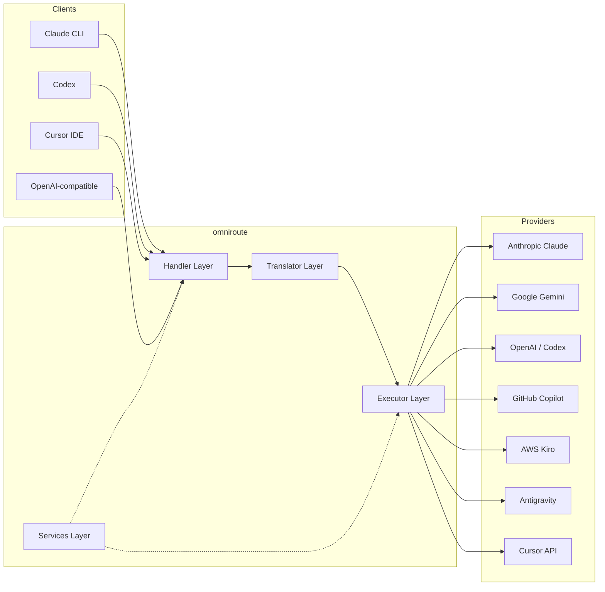
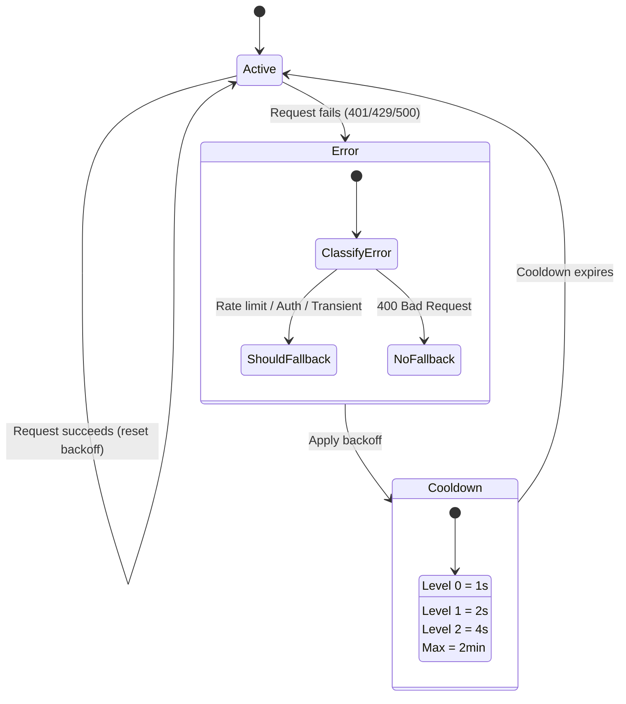
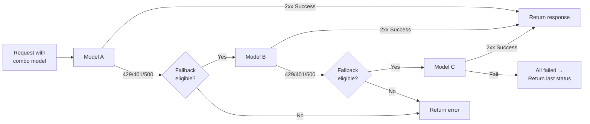
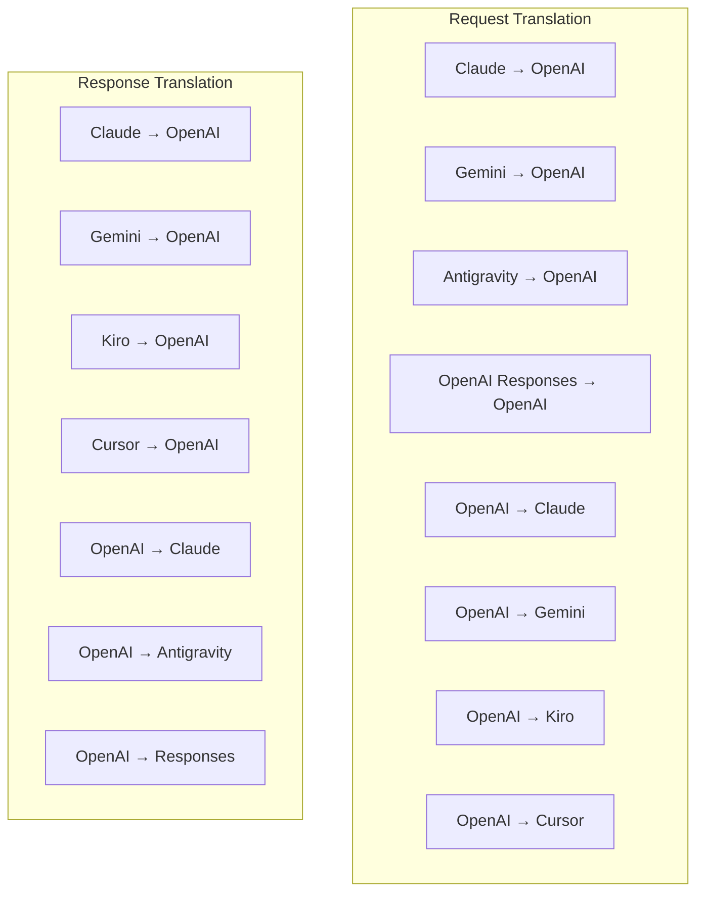
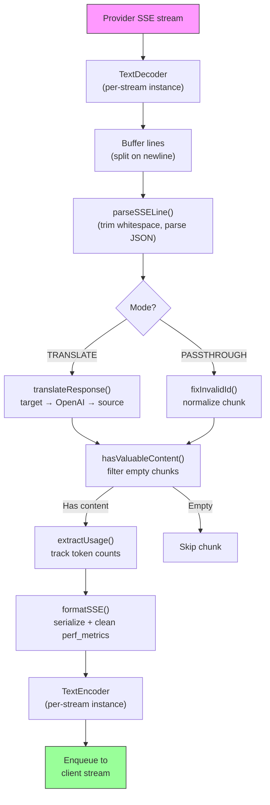
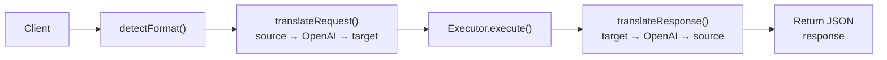
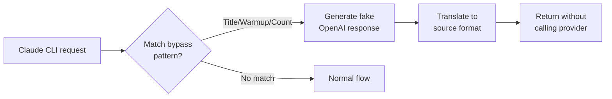

# omniroute — Codebase Documentation (Español)

🌐 **Languages:** 🇺🇸 [English](../../../../docs/CODEBASE_DOCUMENTATION.md) · 🇪🇸 [es](../../es/docs/CODEBASE_DOCUMENTATION.md) · 🇫🇷 [fr](../../fr/docs/CODEBASE_DOCUMENTATION.md) · 🇩🇪 [de](../../de/docs/CODEBASE_DOCUMENTATION.md) · 🇮🇹 [it](../../it/docs/CODEBASE_DOCUMENTATION.md) · 🇷🇺 [ru](../../ru/docs/CODEBASE_DOCUMENTATION.md) · 🇨🇳 [zh-CN](../../zh-CN/docs/CODEBASE_DOCUMENTATION.md) · 🇯🇵 [ja](../../ja/docs/CODEBASE_DOCUMENTATION.md) · 🇰🇷 [ko](../../ko/docs/CODEBASE_DOCUMENTATION.md) · 🇸🇦 [ar](../../ar/docs/CODEBASE_DOCUMENTATION.md) · 🇮🇳 [hi](../../hi/docs/CODEBASE_DOCUMENTATION.md) · 🇮🇳 [in](../../in/docs/CODEBASE_DOCUMENTATION.md) · 🇹🇭 [th](../../th/docs/CODEBASE_DOCUMENTATION.md) · 🇻🇳 [vi](../../vi/docs/CODEBASE_DOCUMENTATION.md) · 🇮🇩 [id](../../id/docs/CODEBASE_DOCUMENTATION.md) · 🇲🇾 [ms](../../ms/docs/CODEBASE_DOCUMENTATION.md) · 🇳🇱 [nl](../../nl/docs/CODEBASE_DOCUMENTATION.md) · 🇵🇱 [pl](../../pl/docs/CODEBASE_DOCUMENTATION.md) · 🇸🇪 [sv](../../sv/docs/CODEBASE_DOCUMENTATION.md) · 🇳🇴 [no](../../no/docs/CODEBASE_DOCUMENTATION.md) · 🇩🇰 [da](../../da/docs/CODEBASE_DOCUMENTATION.md) · 🇫🇮 [fi](../../fi/docs/CODEBASE_DOCUMENTATION.md) · 🇵🇹 [pt](../../pt/docs/CODEBASE_DOCUMENTATION.md) · 🇷🇴 [ro](../../ro/docs/CODEBASE_DOCUMENTATION.md) · 🇭🇺 [hu](../../hu/docs/CODEBASE_DOCUMENTATION.md) · 🇧🇬 [bg](../../bg/docs/CODEBASE_DOCUMENTATION.md) · 🇸🇰 [sk](../../sk/docs/CODEBASE_DOCUMENTATION.md) · 🇺🇦 [uk-UA](../../uk-UA/docs/CODEBASE_DOCUMENTATION.md) · 🇮🇱 [he](../../he/docs/CODEBASE_DOCUMENTATION.md) · 🇵🇭 [phi](../../phi/docs/CODEBASE_DOCUMENTATION.md) · 🇧🇷 [pt-BR](../../pt-BR/docs/CODEBASE_DOCUMENTATION.md) · 🇨🇿 [cs](../../cs/docs/CODEBASE_DOCUMENTATION.md) · 🇹🇷 [tr](../../tr/docs/CODEBASE_DOCUMENTATION.md)

---

> Una guía completa y fácil de usar para principiantes sobre el enrutador proxy de IA multiproveedor**omniroute**.---

## 1. What Is omniroute?

omniroute es un**enrutador proxy**que se encuentra entre clientes de IA (Claude CLI, Codex, Cursor IDE, etc.) y proveedores de IA (Anthropic, Google, OpenAI, AWS, GitHub, etc.). Resuelve un gran problema:

> **Diferentes clientes de IA hablan diferentes "idiomas" (formatos API), y diferentes proveedores de IA también esperan "idiomas" diferentes.**omniroute traduce entre ellos automáticamente.

Piense en ello como un traductor universal en las Naciones Unidas: cualquier delegado puede hablar cualquier idioma y el traductor lo convierte para cualquier otro delegado.---

## 2. Architecture Overview



### Core Principle: Hub-and-Spoke Translation

Toda la traducción de formatos pasa a través del**formato OpenAI como centro**:```
Client Format → [OpenAI Hub] → Provider Format (request)
Provider Format → [OpenAI Hub] → Client Format (response)

```

Esto significa que solo necesitas**N traductores**(uno por formato) en lugar de**N²**(cada par).---

## 3. Project Structure

```

omniroute/
├── open-sse/ ← Core proxy library (portable, framework-agnostic)
│ ├── index.js ← Main entry point, exports everything
│ ├── config/ ← Configuration & constants
│ ├── executors/ ← Provider-specific request execution
│ ├── handlers/ ← Request handling orchestration
│ ├── services/ ← Business logic (auth, models, fallback, usage)
│ ├── translator/ ← Format translation engine
│ │ ├── request/ ← Request translators (8 files)
│ │ ├── response/ ← Response translators (7 files)
│ │ └── helpers/ ← Shared translation utilities (6 files)
│ └── utils/ ← Utility functions
├── src/ ← Application layer (Express/Worker runtime)
│ ├── app/ ← Web UI, API routes, middleware
│ ├── lib/ ← Database, auth, and shared library code
│ ├── mitm/ ← Man-in-the-middle proxy utilities
│ ├── models/ ← Database models
│ ├── shared/ ← Shared utilities (wrappers around open-sse)
│ ├── sse/ ← SSE endpoint handlers
│ └── store/ ← State management
├── data/ ← Runtime data (credentials, logs)
│ └── provider-credentials.json (external credentials override, gitignored)
└── tester/ ← Test utilities

````

---

## 4. Module-by-Module Breakdown

### 4.1 Config (`open-sse/config/`)

La**única fuente de verdad**para todas las configuraciones de proveedores.

| Archivo | Propósito |
| ----------------------- | ------------------------------------------------------------------------------------------------------------------------------------------------------------------------------------------------------------------------------------- |
| `constantes.ts` | Objeto `PROVIDERS` con URL base, credenciales de OAuth (predeterminadas), encabezados y mensajes del sistema predeterminados para cada proveedor. También define `HTTP_STATUS`, `ERROR_TYPES`, `COOLDOWN_MS`, `BACKOFF_CONFIG` y `SKIP_PATTERNS`. |
| `credentialLoader.ts` | Carga credenciales externas desde `data/provider-credentials.json` y las combina con los valores predeterminados codificados en `PROVIDERS`. Mantiene los secretos fuera del control de código fuente y al mismo tiempo mantiene la compatibilidad con versiones anteriores.               |
| `proveedorModels.ts` | Registro central de modelos: alias de proveedores de mapas → ID de modelos. Funciones como `getModels()`, `getProviderByAlias()`.                                                                                                          |
| `codexInstructions.ts` | Instrucciones del sistema inyectadas en solicitudes del Codex (restricciones de edición, reglas de espacio aislado, políticas de aprobación).                                                                                                                 |
| `defaultThinkingSignature.ts` | Firmas "pensantes" predeterminadas para los modelos Claude y Gemini.                                                                                                                                                               |
| `ollamaModels.ts` | Definición de esquemas para modelos locales de Ollama (nombre, tamaño, familia, cuantificación).                                                                                                                                             |#### Credential Loading Flow

```mermaid
flowchart TD
    A["App starts"] --> B["constants.ts defines PROVIDERS\nwith hardcoded defaults"]
    B --> C{"data/provider-credentials.json\nexists?"}
    C -->|Yes| D["credentialLoader reads JSON"]
    C -->|No| E["Use hardcoded defaults"]
    D --> F{"For each provider in JSON"}
    F --> G{"Provider exists\nin PROVIDERS?"}
    G -->|No| H["Log warning, skip"]
    G -->|Yes| I{"Value is object?"}
    I -->|No| J["Log warning, skip"]
    I -->|Yes| K["Merge clientId, clientSecret,\ntokenUrl, authUrl, refreshUrl"]
    K --> F
    H --> F
    J --> F
    F -->|Done| L["PROVIDERS ready with\nmerged credentials"]
    E --> L
````

---

### 4.2 Executors (`open-sse/executors/`)

Los ejecutores encapsulan**lógica específica del proveedor**utilizando el**Patrón de estrategia**. Cada ejecutor anula los métodos base según sea necesario.```mermaid
classDiagram
class BaseExecutor {
+buildUrl(model, stream, options)
+buildHeaders(credentials, stream, body)
+transformRequest(body, model, stream, credentials)
+execute(url, options)
+shouldRetry(status, error)
+refreshCredentials(credentials, log)
}

    class DefaultExecutor {
        +refreshCredentials()
    }

    class AntigravityExecutor {
        +buildUrl()
        +buildHeaders()
        +transformRequest()
        +shouldRetry()
        +refreshCredentials()
    }

    class CursorExecutor {
        +buildUrl()
        +buildHeaders()
        +transformRequest()
        +parseResponse()
        +generateChecksum()
    }

    class KiroExecutor {
        +buildUrl()
        +buildHeaders()
        +transformRequest()
        +parseEventStream()
        +refreshCredentials()
    }

    BaseExecutor <|-- DefaultExecutor
    BaseExecutor <|-- AntigravityExecutor
    BaseExecutor <|-- CursorExecutor
    BaseExecutor <|-- KiroExecutor
    BaseExecutor <|-- CodexExecutor
    BaseExecutor <|-- GeminiCLIExecutor
    BaseExecutor <|-- GithubExecutor

````

| Ejecutor | Proveedor | Especializaciones clave |
| ---------------- | ------------------------------------------ | ------------------------------------------------------------------------------------------------------------------- |
| `base.ts` | — | Base abstracta: creación de URL, encabezados, lógica de reintento, actualización de credenciales |
| `default.ts` | Claude, Géminis, OpenAI, GLM, Kimi, MiniMax | Actualización de token genérico de OAuth para proveedores estándar |
| `antigravedad.ts` | Código de la nube de Google | Generación de ID de proyecto/sesión, respaldo de múltiples URL, reintento personalizado de análisis de mensajes de error ("restablecer después de 2h7m23s") |
| `cursor.ts` | Cursor IDE |**Más complejo**: autenticación de suma de comprobación SHA-256, codificación de solicitud Protobuf, EventStream binario → análisis de respuesta SSE |
| `codex.ts` | Códice OpenAI | Inyecta instrucciones del sistema, gestiona los niveles de pensamiento, elimina parámetros no compatibles |
| `géminis-cli.ts` | CLI de Google Géminis | Creación de URL personalizadas (`streamGenerateContent`), actualización del token OAuth de Google |
| `github.ts` | Copiloto de GitHub | Sistema de token dual (GitHub OAuth + token Copilot), imitación del encabezado VSCode |
| `kiro.ts` | Susurrador de códigos de AWS | Análisis binario de AWS EventStream, marcos de eventos AMZN, estimación de tokens |
| `índice.ts` | — | Fábrica: nombre del proveedor de mapas → clase de ejecutor, con respaldo predeterminado |---

### 4.3 Handlers (`open-sse/handlers/`)

La**capa de orquestación**: coordina la traducción, la ejecución, la transmisión y el manejo de errores.

| Archivo | Propósito |
| --------------------- | ------------------------------------------------------------------------------------------------------------------------------------------------------------------------------------------------------------------- |
| `chatCore.ts` |**Orquestador central**(~600 líneas). Maneja el ciclo de vida completo de la solicitud: detección de formato → traducción → envío del ejecutor → respuesta de transmisión/no transmisión → actualización del token → manejo de errores → registro de uso. |
| `respuestasHandler.ts` | Adaptador para la API de Respuestas de OpenAI: convierte el formato de Respuestas → Finalizaciones de chat → envía a `chatCore` → convierte SSE nuevamente al formato de Respuestas.                                                                        |
| `incrustaciones.ts` | Controlador de generación de incrustación: resuelve el modelo de incrustación → proveedor, envía la API del proveedor y devuelve una respuesta de incrustación compatible con OpenAI. Admite más de 6 proveedores.                                                    |
| `imageGeneración.ts` | Controlador de generación de imágenes: resuelve el modelo de imagen → proveedor, admite los modos compatibles con OpenAI, imagen Gemini (Antigravity) y respaldo (Nebius). Devuelve imágenes base64 o URL.                                          |#### Request Lifecycle (chatCore.ts)

```mermaid
sequenceDiagram
    participant Client
    participant chatCore
    participant Translator
    participant Executor
    participant Provider

    Client->>chatCore: Request (any format)
    chatCore->>chatCore: Detect source format
    chatCore->>chatCore: Check bypass patterns
    chatCore->>chatCore: Resolve model & provider
    chatCore->>Translator: Translate request (source → OpenAI → target)
    chatCore->>Executor: Get executor for provider
    Executor->>Executor: Build URL, headers, transform request
    Executor->>Executor: Refresh credentials if needed
    Executor->>Provider: HTTP fetch (streaming or non-streaming)

    alt Streaming
        Provider-->>chatCore: SSE stream
        chatCore->>chatCore: Pipe through SSE transform stream
        Note over chatCore: Transform stream translates<br/>each chunk: target → OpenAI → source
        chatCore-->>Client: Translated SSE stream
    else Non-streaming
        Provider-->>chatCore: JSON response
        chatCore->>Translator: Translate response
        chatCore-->>Client: Translated JSON
    end

    alt Error (401, 429, 500...)
        chatCore->>Executor: Retry with credential refresh
        chatCore->>chatCore: Account fallback logic
    end
````

---

### 4.4 Services (`open-sse/services/`)

| Lógica de negocios que soporta a los manejadores y ejecutores. | File                                                                                                                                                                                                                                                                                                                                   | Purpose |
| -------------------------------------------------------------- | -------------------------------------------------------------------------------------------------------------------------------------------------------------------------------------------------------------------------------------------------------------------------------------------------------------------------------------- | ------- |
| `provider.ts`                                                  | **Format detection** (`detectFormat`): analyzes request body structure to identify Claude/OpenAI/Gemini/Antigravity/Responses formats (includes `max_tokens` heuristic for Claude). Also: URL building, header building, thinking config normalization. Supports `openai-compatible-*` and `anthropic-compatible-*` dynamic providers. |
| `model.ts`                                                     | Model string parsing (`claude/model-name` → `{provider: "claude", model: "model-name"}`), alias resolution with collision detection, input sanitization (rejects path traversal/control chars), and model info resolution with async alias getter support.                                                                             |
| `accountFallback.ts`                                           | Rate-limit handling: exponential backoff (1s → 2s → 4s → max 2min), account cooldown management, error classification (which errors trigger fallback vs. not).                                                                                                                                                                         |
| `tokenRefresh.ts`                                              | OAuth token refresh for **every provider**: Google (Gemini, Antigravity), Claude, Codex, Qwen, Qoder, GitHub (OAuth + Copilot dual-token), Kiro (AWS SSO OIDC + Social Auth). Includes in-flight promise deduplication cache and retry with exponential backoff.                                                                       |
| `combo.ts`                                                     | **Combo models**: chains of fallback models. If model A fails with a fallback-eligible error, try model B, then C, etc. Returns actual upstream status codes.                                                                                                                                                                          |
| `usage.ts`                                                     | Fetches quota/usage data from provider APIs (GitHub Copilot quotas, Antigravity model quotas, Codex rate limits, Kiro usage breakdowns, Claude settings).                                                                                                                                                                              |
| `accountSelector.ts`                                           | Smart account selection with scoring algorithm: considers priority, health status, round-robin position, and cooldown state to pick the optimal account for each request.                                                                                                                                                              |
| `contextManager.ts`                                            | Request context lifecycle management: creates and tracks per-request context objects with metadata (request ID, timestamps, provider info) for debugging and logging.                                                                                                                                                                  |
| `ipFilter.ts`                                                  | IP-based access control: supports allowlist and blocklist modes. Validates client IP against configured rules before processing API requests.                                                                                                                                                                                          |
| `sessionManager.ts`                                            | Session tracking with client fingerprinting: tracks active sessions using hashed client identifiers, monitors request counts, and provides session metrics.                                                                                                                                                                            |
| `signatureCache.ts`                                            | Request signature-based deduplication cache: prevents duplicate requests by caching recent request signatures and returning cached responses for identical requests within a time window.                                                                                                                                              |
| `systemPrompt.ts`                                              | Global system prompt injection: prepends or appends a configurable system prompt to all requests, with per-provider compatibility handling.                                                                                                                                                                                            |
| `thinkingBudget.ts`                                            | Reasoning token budget management: supports passthrough, auto (strip thinking config), custom (fixed budget), and adaptive (complexity-scaled) modes for controlling thinking/reasoning tokens.                                                                                                                                        |
| `wildcardRouter.ts`                                            | Wildcard model pattern routing: resolves wildcard patterns (e.g., `*/claude-*`) to concrete provider/model pairs based on availability and priority.                                                                                                                                                                                   |

#### Token Refresh Deduplication

```mermaid
sequenceDiagram
    participant R1 as Request 1
    participant R2 as Request 2
    participant Cache as refreshPromiseCache
    participant OAuth as OAuth Provider

    R1->>Cache: getAccessToken("gemini", token)
    Cache->>Cache: No in-flight promise
    Cache->>OAuth: Start refresh
    R2->>Cache: getAccessToken("gemini", token)
    Cache->>Cache: Found in-flight promise
    Cache-->>R2: Return existing promise
    OAuth-->>Cache: New access token
    Cache-->>R1: New access token
    Cache-->>R2: Same access token (shared)
    Cache->>Cache: Delete cache entry
```

#### Account Fallback State Machine



#### Combo Model Chain



---

### 4.5 Translator (`open-sse/translator/`)

El**motor de traducción de formatos**que utiliza un sistema de complementos de registro automático.#### Arquitectura



| Directorio    | Archivos      | Descripción                                                                                                                                                                                                                                                                                                  |
| ------------- | ------------- | ------------------------------------------------------------------------------------------------------------------------------------------------------------------------------------------------------------------------------------------------------------------------------------------------------------ | ----------------------------------------- |
| `solicitud/`  | 8 traductores | Convierta cuerpos de solicitudes entre formatos. Cada archivo se registra automáticamente mediante `register(from, to, fn)` al importar.                                                                                                                                                                     |
| `respuesta/`  | 7 traductores | Convierta fragmentos de respuesta de transmisión entre formatos. Maneja tipos de eventos SSE, bloques de pensamiento y llamadas a herramientas.                                                                                                                                                              |
| `ayudantes/`  | 6 ayudantes   | Utilidades compartidas: `claudeHelper` (extracción de mensajes del sistema, configuración de pensamiento), `geminiHelper` (mapeo de partes/contenidos), `openaiHelper` (filtrado de formato), `toolCallHelper` (generación de ID, inyección de respuesta faltante), `maxTokensHelper`, `responsesApiHelper`. |
| `índice.ts`   | —             | Motor de traducción: `translateRequest()`, `translateResponse()`, gestión de estado, registro.                                                                                                                                                                                                               |
| `formatos.ts` | —             | Constantes de formato: `OPENAI`, `CLAUDE`, `GEMINI`, `ANTIGRAVITY`, `KIRO`, `CURSOR`, `OPENAI_RESPONSES`.                                                                                                                                                                                                    | #### Key Design: Self-Registering Plugins |

```javascript
// Each translator file calls register() on import:
import { register } from "../index.js";
register("claude", "openai", translateClaudeToOpenAI);

// The index.js imports all translator files, triggering registration:
import "./request/claude-to-openai.js"; // ← self-registers
```

---

### 4.6 Utils (`open-sse/utils/`)

| Archivo            | Propósito                                                                                                                                                                                                                                                                                                                                                                |
| ------------------ | ------------------------------------------------------------------------------------------------------------------------------------------------------------------------------------------------------------------------------------------------------------------------------------------------------------------------------------------------------------------------ | --------------------------- |
| `error.ts`         | Creación de respuestas a errores (formato compatible con OpenAI), análisis de errores ascendentes, extracción en tiempo de reintento de Antigravity de mensajes de error, transmisión de errores SSE.                                                                                                                                                                    |
| `corriente.ts`     | **SSE Transform Stream**: el canal principal de transmisión. Dos modos: `TRANSLATE` (traducción de formato completo) y `PASSTHROUGH` (normalizar + extraer uso). Maneja el almacenamiento en búfer de fragmentos, la estimación de uso y el seguimiento de la longitud del contenido. Las instancias de codificador/decodificador por flujo evitan el estado compartido. |
| `streamHelpers.ts` | Utilidades SSE de bajo nivel: `parseSSELine` (tolerante a espacios en blanco), `hasValuableContent` (filtra fragmentos vacíos para OpenAI/Claude/Gemini), `fixInvalidId`, `formatSSE` (serialización SSE con reconocimiento de formato con limpieza `perf_metrics`).                                                                                                     |
| `usageTracking.ts` | Extracción de uso de tokens de cualquier formato (Claude/OpenAI/Gemini/Responses), estimación con proporciones separadas de caracteres por token de herramienta/mensaje, adición de búfer (margen de seguridad de 2000 tokens), filtrado de campos específicos del formato, registro de consola con colores ANSI.                                                        |
| `requestLogger.ts` | Legacy file-based request logging helper kept for compatibility. Current deployments should prefer `APP_LOG_TO_FILE` for application logs and the call log pipeline for persisted request artifacts.                                                                                                                                                                     |
| `bypassHandler.ts` | Intercepta patrones específicos de Claude CLI (extracción de títulos, calentamiento, recuento) y devuelve respuestas falsas sin llamar a ningún proveedor. Admite tanto streaming como no streaming. Limitado intencionalmente al alcance de Claude CLI.                                                                                                                 |
| `redProxy.ts`      | Resuelve la URL del proxy saliente para un proveedor determinado con prioridad: configuración específica del proveedor → configuración global → variables de entorno (`HTTPS_PROXY`/`HTTP_PROXY`/`ALL_PROXY`). Admite exclusiones `NO_PROXY`. Configuración de cachés durante 30 segundos.                                                                               | #### SSE Streaming Pipeline |



#### Request Logger Session Structure

```
logs/
└── claude_gemini_claude-sonnet_20260208_143045/
    ├── 1_req_client.json      ← Raw client request
    ├── 2_req_source.json      ← After initial conversion
    ├── 3_req_openai.json      ← OpenAI intermediate format
    ├── 4_req_target.json      ← Final target format
    ├── 5_res_provider.txt     ← Provider SSE chunks (streaming)
    ├── 5_res_provider.json    ← Provider response (non-streaming)
    ├── 6_res_openai.txt       ← OpenAI intermediate chunks
    ├── 7_res_client.txt       ← Client-facing SSE chunks
    └── 6_error.json           ← Error details (if any)
```

---

### 4.7 Application Layer (`src/`)

| Directorio        | Propósito                                                                                             |
| ----------------- | ----------------------------------------------------------------------------------------------------- | ----------------------- |
| `src/aplicación/` | Interfaz de usuario web, rutas API, middleware Express, controladores de devolución de llamadas OAuth |
| `src/lib/`        | Acceso a base de datos (`localDb.ts`, `usageDb.ts`), autenticación, compartido                        |
| `src/mitm/`       | Utilidades de proxy Man-in-the-middle para interceptar el tráfico de proveedores                      |
| `src/modelos/`    | Definiciones de modelos de bases de datos                                                             |
| `src/compartido/` | Envoltorios de funciones open-sse (proveedor, flujo, error, etc.)                                     |
| `src/sse/`        | Controladores de puntos finales SSE que conectan la biblioteca open-sse a rutas Express               |
| `src/tienda/`     | Gestión del estado de la aplicación                                                                   | #### Notable API Routes |

| Ruta                                                | Métodos                   | Propósito                                                                                                   |
| --------------------------------------------------- | ------------------------- | ----------------------------------------------------------------------------------------------------------- | --- |
| `/api/modelos-proveedor`                            | OBTENER/PUBLICAR/ELIMINAR | CRUD para modelos personalizados por proveedor                                                              |
| `/api/modelos/catalogo`                             | OBTENER                   | Catálogo agregado de todos los modelos (chat, incrustado, imagen, personalizado) agrupados por proveedor    |
| `/api/configuración/proxy`                          | OBTENER/PONER/ELIMINAR    | Configuración jerárquica del proxy saliente (`global/providers/combos/keys`)                                |
| `/api/configuración/proxy/prueba`                   | PUBLICAR                  | Valida la conectividad del proxy y devuelve IP pública/latencia                                             |
| `/v1/proveedores/[proveedor]/chat/compleciones`     | PUBLICAR                  | Finalizaciones de chat dedicadas por proveedor con validación de modelo                                     |
| `/v1/proveedores/[proveedor]/incrustaciones`        | PUBLICAR                  | Incorporaciones dedicadas por proveedor con validación de modelo                                            |
| `/v1/proveedores/[proveedor]/imágenes/generaciones` | PUBLICAR                  | Generación de imágenes dedicada por proveedor con validación de modelo                                      |
| `/api/settings/ip-filter`                           | OBTENER/PONER             | Gestión de listas de IP permitidas/bloqueadas                                                               |
| `/api/settings/thinking-budget`                     | OBTENER/PONER             | Configuración del presupuesto del token de razonamiento (transferencia/automático/personalizado/adaptativo) |
| `/api/configuración/sistema-prompt`                 | OBTENER/PONER             | Inyección rápida del sistema global para todas las solicitudes                                              |
| `/api/sesiones`                                     | OBTENER                   | Seguimiento y métricas de sesiones activas                                                                  |
| `/api/límites de velocidad`                         | OBTENER                   | Estado del límite de tasa por cuenta                                                                        | --- |

## 5. Key Design Patterns

### 5.1 Hub-and-Spoke Translation

Todos los formatos se traducen a través del**formato OpenAI como centro**. Agregar un nuevo proveedor solo requiere escribir**un par**de traductores (hacia/desde OpenAI), no N pares.### 5.2 Executor Strategy Pattern

Cada proveedor tiene una clase ejecutora dedicada que hereda de `BaseExecutor`. La fábrica en `executors/index.ts` selecciona la correcta en tiempo de ejecución.### 5.3 Self-Registering Plugin System

Los módulos traductores se registran al importar mediante `register()`. Agregar un nuevo traductor es simplemente crear un archivo e importarlo.### 5.4 Account Fallback with Exponential Backoff

Cuando un proveedor devuelve 429/401/500, el sistema puede cambiar a la siguiente cuenta, aplicando tiempos de reutilización exponenciales (1 s → 2 s → 4 s → máx. 2 min).### 5.5 Combo Model Chains

Un "combo" agrupa varias cadenas de "proveedor/modelo". Si el primero falla, se pasa automáticamente al siguiente.### 5.6 Stateful Streaming Translation

La traducción de respuestas mantiene el estado en todos los fragmentos de SSE (seguimiento de bloques de pensamiento, acumulación de llamadas de herramientas, indexación de bloques de contenido) a través del mecanismo `initState()`.### 5.7 Usage Safety Buffer

Se agrega un búfer de 2000 tokens al uso informado para evitar que los clientes alcancen los límites de la ventana de contexto debido a la sobrecarga de las indicaciones del sistema y la traducción de formato.---

## 6. Supported Formats

| Formato                        | Dirección        | Identificador       |
| ------------------------------ | ---------------- | ------------------- | --- |
| Finalizaciones del chat OpenAI | fuente + destino | `openai`            |
| API de respuestas OpenAI       | fuente + destino | `respuestas openai` |
| Claude antrópico               | fuente + destino | `claude`            |
| Google Géminis                 | fuente + destino | `géminis`           |
| CLI de Google Géminis          | sólo objetivo    | `géminis-cli`       |
| Antigravedad                   | fuente + destino | `antigravedad`      |
| AWS Kiro                       | sólo objetivo    | `kiro`              |
| Cursores                       | sólo objetivo    | `cursor`            | --- |

## 7. Supported Providers

| Proveedor                 | Método de autenticación               | Ejecutor       | Notas clave                                                     |
| ------------------------- | ------------------------------------- | -------------- | --------------------------------------------------------------- | --- |
| Claude antrópico          | Clave API u OAuth                     | Predeterminado | Utiliza el encabezado `x-api-key`                               |
| Google Géminis            | Clave API u OAuth                     | Predeterminado | Utiliza el encabezado `x-goog-api-key`                          |
| CLI de Google Géminis     | OAuth                                 | GéminisCLI     | Utiliza el punto final `streamGenerateContent`                  |
| Antigravedad              | OAuth                                 | Antigravedad   | Respaldo de múltiples URL, análisis de reintentos personalizado |
| Abierta AI                | Clave API                             | Predeterminado | Autenticación de abanderado                                     |
| Códice                    | OAuth                                 | Códice         | Inyecta instrucciones del sistema, gestiona el pensamiento      |
| Copiloto de GitHub        | OAuth + token de copiloto             | GitHub         | Token dual, imitación del encabezado VSCode                     |
| Kiro (AWS)                | AWS SSO OIDC o redes sociales         | kiro           | Análisis binario de EventStream                                 |
| Cursor IDE                | Autenticación de suma de comprobación | Cursores       | Codificación Protobuf, sumas de comprobación SHA-256            |
| Qwen                      | OAuth                                 | Predeterminado | Autenticación estándar                                          |
| Qoder                     | OAuth (Básico + Portador)             | Predeterminado | Encabezado de autenticación dual                                |
| Enrutador abierto         | Clave API                             | Predeterminado | Autenticación de abanderado                                     |
| GLM, Kimi, MiniMax        | Clave API                             | Predeterminado | Compatible con Claude, use `x-api-key`                          |
| `compatible con openai-*` | Clave API                             | Predeterminado | Dinámico: cualquier punto final compatible con OpenAI           |
| `antrópico-compatible-*`  | Clave API                             | Predeterminado | Dinámico: cualquier punto final compatible con Claude           | --- |

## 8. Data Flow Summary

### Streaming Request

```mermaid
flowchart LR
    A["Client"] --> B["detectFormat()"]
    B --> C["translateRequest()\nsource → OpenAI → target"]
    C --> D["Executor\nbuildUrl + buildHeaders"]
    D --> E["fetch(providerURL)"]
    E --> F["createSSEStream()\nTRANSLATE mode"]
    F --> G["parseSSELine()"]
    G --> H["translateResponse()\ntarget → OpenAI → source"]
    H --> I["extractUsage()\n+ addBuffer"]
    I --> J["formatSSE()"]
    J --> K["Client receives\ntranslated SSE"]
    K --> L["logUsage()\nsaveRequestUsage()"]
```



### Non-Streaming Request



### Bypass Flow (Claude CLI)


