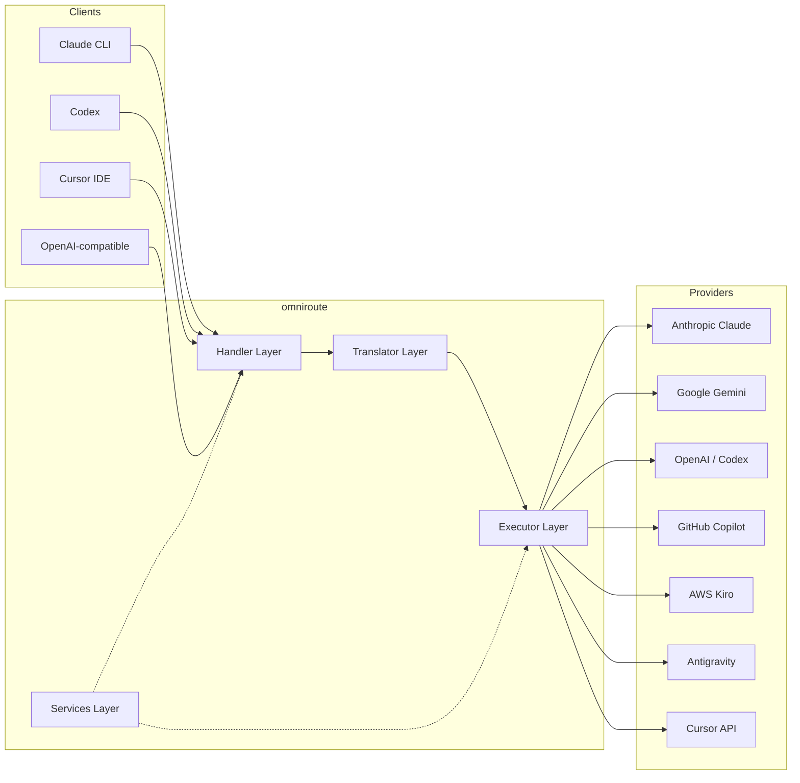
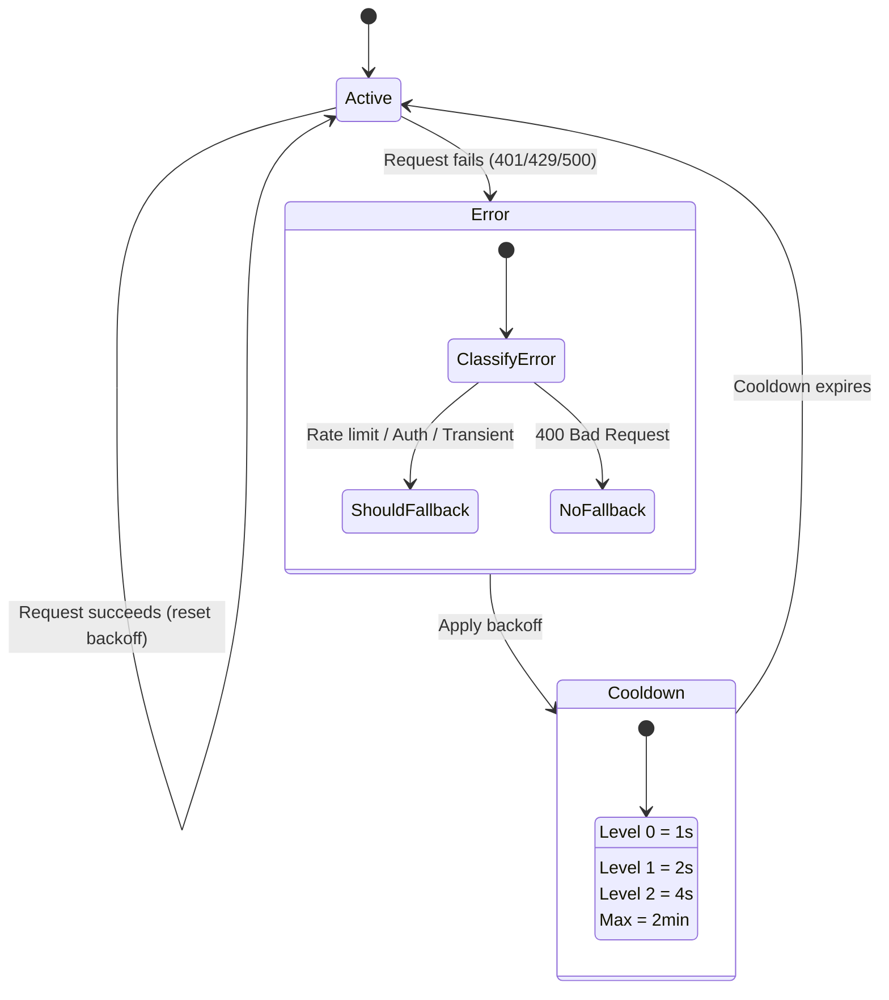
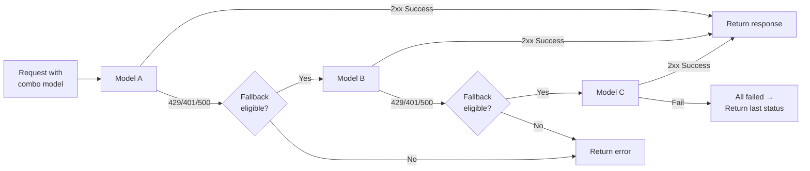
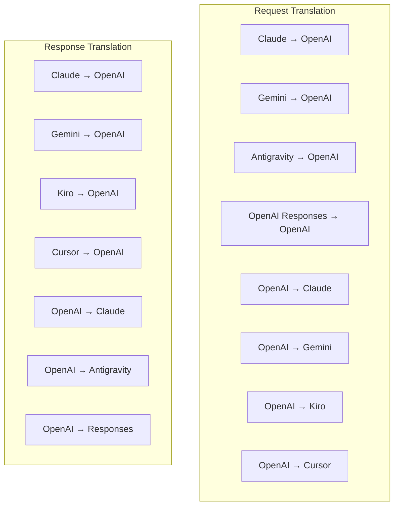
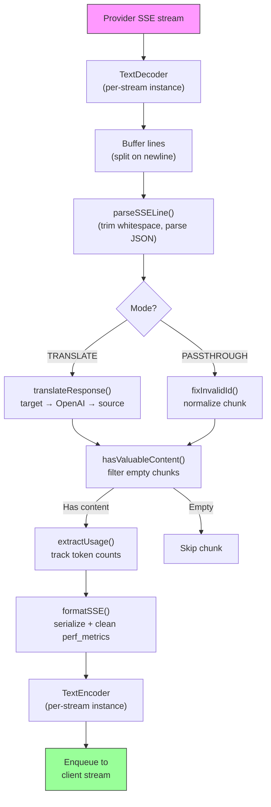
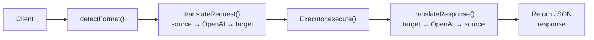
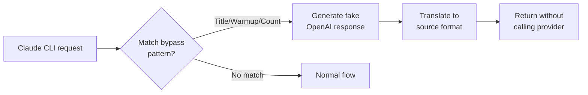

# omniroute — Codebase Documentation (Suomi)

🌐 **Languages:** 🇺🇸 [English](../../../../docs/CODEBASE_DOCUMENTATION.md) · 🇪🇸 [es](../../es/docs/CODEBASE_DOCUMENTATION.md) · 🇫🇷 [fr](../../fr/docs/CODEBASE_DOCUMENTATION.md) · 🇩🇪 [de](../../de/docs/CODEBASE_DOCUMENTATION.md) · 🇮🇹 [it](../../it/docs/CODEBASE_DOCUMENTATION.md) · 🇷🇺 [ru](../../ru/docs/CODEBASE_DOCUMENTATION.md) · 🇨🇳 [zh-CN](../../zh-CN/docs/CODEBASE_DOCUMENTATION.md) · 🇯🇵 [ja](../../ja/docs/CODEBASE_DOCUMENTATION.md) · 🇰🇷 [ko](../../ko/docs/CODEBASE_DOCUMENTATION.md) · 🇸🇦 [ar](../../ar/docs/CODEBASE_DOCUMENTATION.md) · 🇮🇳 [hi](../../hi/docs/CODEBASE_DOCUMENTATION.md) · 🇮🇳 [in](../../in/docs/CODEBASE_DOCUMENTATION.md) · 🇹🇭 [th](../../th/docs/CODEBASE_DOCUMENTATION.md) · 🇻🇳 [vi](../../vi/docs/CODEBASE_DOCUMENTATION.md) · 🇮🇩 [id](../../id/docs/CODEBASE_DOCUMENTATION.md) · 🇲🇾 [ms](../../ms/docs/CODEBASE_DOCUMENTATION.md) · 🇳🇱 [nl](../../nl/docs/CODEBASE_DOCUMENTATION.md) · 🇵🇱 [pl](../../pl/docs/CODEBASE_DOCUMENTATION.md) · 🇸🇪 [sv](../../sv/docs/CODEBASE_DOCUMENTATION.md) · 🇳🇴 [no](../../no/docs/CODEBASE_DOCUMENTATION.md) · 🇩🇰 [da](../../da/docs/CODEBASE_DOCUMENTATION.md) · 🇫🇮 [fi](../../fi/docs/CODEBASE_DOCUMENTATION.md) · 🇵🇹 [pt](../../pt/docs/CODEBASE_DOCUMENTATION.md) · 🇷🇴 [ro](../../ro/docs/CODEBASE_DOCUMENTATION.md) · 🇭🇺 [hu](../../hu/docs/CODEBASE_DOCUMENTATION.md) · 🇧🇬 [bg](../../bg/docs/CODEBASE_DOCUMENTATION.md) · 🇸🇰 [sk](../../sk/docs/CODEBASE_DOCUMENTATION.md) · 🇺🇦 [uk-UA](../../uk-UA/docs/CODEBASE_DOCUMENTATION.md) · 🇮🇱 [he](../../he/docs/CODEBASE_DOCUMENTATION.md) · 🇵🇭 [phi](../../phi/docs/CODEBASE_DOCUMENTATION.md) · 🇧🇷 [pt-BR](../../pt-BR/docs/CODEBASE_DOCUMENTATION.md) · 🇨🇿 [cs](../../cs/docs/CODEBASE_DOCUMENTATION.md) · 🇹🇷 [tr](../../tr/docs/CODEBASE_DOCUMENTATION.md)

---

> Kattava, aloittelijaystävällinen opas**omniroute**usean palveluntarjoajan AI-välityspalvelimen reitittimeen.---

## 1. What Is omniroute?

omniroute on**välityspalvelinreititin**, joka sijaitsee AI-asiakkaiden (Claude CLI, Codex, Cursor IDE jne.) ja tekoälypalvelujen tarjoajien (Anthropic, Google, OpenAI, AWS, GitHub jne.) välillä. Se ratkaisee yhden suuren ongelman:

> **Eri AI-asiakkaat puhuvat eri "kieliä" (API-muotoja), ja eri tekoälypalveluntarjoajat odottavat myös erilaisia "kieliä".**Omniroute kääntää niiden välillä automaattisesti.

Ajattele sitä kuin yleinen kääntäjä Yhdistyneissä Kansakunnissa – jokainen edustaja voi puhua mitä tahansa kieltä, ja kääntäjä muuntaa sen kenelle tahansa muulle edustajalle.---

## 2. Architecture Overview



### Core Principle: Hub-and-Spoke Translation

Kaikki muotojen käännökset kulkevat**OpenAI-muodon kautta keskittimenä**:```
Client Format → [OpenAI Hub] → Provider Format (request)
Provider Format → [OpenAI Hub] → Client Format (response)

```

Tämä tarkoittaa, että tarvitset vain**N kääntäjää**(yksi per muoto)**N²**(jokainen pari) sijaan.---

## 3. Project Structure

```

omniroute/
├── open-sse/ ← Core proxy library (portable, framework-agnostic)
│ ├── index.js ← Main entry point, exports everything
│ ├── config/ ← Configuration & constants
│ ├── executors/ ← Provider-specific request execution
│ ├── handlers/ ← Request handling orchestration
│ ├── services/ ← Business logic (auth, models, fallback, usage)
│ ├── translator/ ← Format translation engine
│ │ ├── request/ ← Request translators (8 files)
│ │ ├── response/ ← Response translators (7 files)
│ │ └── helpers/ ← Shared translation utilities (6 files)
│ └── utils/ ← Utility functions
├── src/ ← Application layer (Express/Worker runtime)
│ ├── app/ ← Web UI, API routes, middleware
│ ├── lib/ ← Database, auth, and shared library code
│ ├── mitm/ ← Man-in-the-middle proxy utilities
│ ├── models/ ← Database models
│ ├── shared/ ← Shared utilities (wrappers around open-sse)
│ ├── sse/ ← SSE endpoint handlers
│ └── store/ ← State management
├── data/ ← Runtime data (credentials, logs)
│ └── provider-credentials.json (external credentials override, gitignored)
└── tester/ ← Test utilities

````

---

## 4. Module-by-Module Breakdown

### 4.1 Config (`open-sse/config/`)

**yksi totuuden lähde**kaikille palveluntarjoajan määrityksille.

| Tiedosto | Tarkoitus |
| ------------------------------ | --------------------------------------------------------------------------------------------------- --------------------------------------------------------------------------------------------------- |
| `constants.ts` | 'PROVIDERS'-objekti, jossa on perus-URL-osoitteet, OAuth-kirjautumistiedot (oletusarvot), otsikot ja oletusarvoiset järjestelmäkehotteet jokaiselle palveluntarjoajalle. Määrittää myös "HTTP_STATUS", "ERROR_TYPES", "COOLDOWN_MS", "BACKOFF_CONFIG" ja "SKIP_PATTERNS". |
| `credentialLoader.ts` | Lataa ulkoiset valtuustiedot tiedostosta "data/provider-credentials.json" ja yhdistää ne PROVIDERS:n kovakoodattujen oletusarvojen päälle. Pitää salaisuudet poissa lähteen hallinnasta säilyttäen samalla yhteensopivuuden taaksepäin.               |
| `providerModels.ts` | Keskitetty mallirekisteri: karttatoimittajan aliakset → mallitunnukset. Toiminnot, kuten "getModels()", "getProviderByAlias()".                                                                                                          |
| `codexInstructions.ts` | Codex-pyyntöihin lisätyt järjestelmäohjeet (muokkausrajoitukset, hiekkalaatikkosäännöt, hyväksymiskäytännöt).                                                                                                                 |
| `defaultThinkingSignature.ts` | Oletusarvoiset "ajattelevat" allekirjoitukset Claude- ja Gemini-malleille.                                                                                                                                                               |
| `ollamaModels.ts` | Kaaviomäärittely paikallisille Ollama-malleille (nimi, koko, perhe, kvantisointi).                                                                                                                                             |#### Credential Loading Flow

```mermaid
flowchart TD
    A["App starts"] --> B["constants.ts defines PROVIDERS\nwith hardcoded defaults"]
    B --> C{"data/provider-credentials.json\nexists?"}
    C -->|Yes| D["credentialLoader reads JSON"]
    C -->|No| E["Use hardcoded defaults"]
    D --> F{"For each provider in JSON"}
    F --> G{"Provider exists\nin PROVIDERS?"}
    G -->|No| H["Log warning, skip"]
    G -->|Yes| I{"Value is object?"}
    I -->|No| J["Log warning, skip"]
    I -->|Yes| K["Merge clientId, clientSecret,\ntokenUrl, authUrl, refreshUrl"]
    K --> F
    H --> F
    J --> F
    F -->|Done| L["PROVIDERS ready with\nmerged credentials"]
    E --> L
````

---

### 4.2 Executors (`open-sse/executors/`)

Toteuttajat kapseloivat**palveluntarjoajakohtaisen logiikan**käyttämällä**strategiamallia**. Jokainen suorittaja ohittaa perusmenetelmät tarpeen mukaan.```mermaid
classDiagram
class BaseExecutor {
+buildUrl(model, stream, options)
+buildHeaders(credentials, stream, body)
+transformRequest(body, model, stream, credentials)
+execute(url, options)
+shouldRetry(status, error)
+refreshCredentials(credentials, log)
}

    class DefaultExecutor {
        +refreshCredentials()
    }

    class AntigravityExecutor {
        +buildUrl()
        +buildHeaders()
        +transformRequest()
        +shouldRetry()
        +refreshCredentials()
    }

    class CursorExecutor {
        +buildUrl()
        +buildHeaders()
        +transformRequest()
        +parseResponse()
        +generateChecksum()
    }

    class KiroExecutor {
        +buildUrl()
        +buildHeaders()
        +transformRequest()
        +parseEventStream()
        +refreshCredentials()
    }

    BaseExecutor <|-- DefaultExecutor
    BaseExecutor <|-- AntigravityExecutor
    BaseExecutor <|-- CursorExecutor
    BaseExecutor <|-- KiroExecutor
    BaseExecutor <|-- CodexExecutor
    BaseExecutor <|-- GeminiCLIExecutor
    BaseExecutor <|-- GithubExecutor

````

| Toteuttaja | Palveluntarjoaja | Keskeiset erikoisalat |
| ----------------- | ------------------------------------------- | ---------------------------------------------------------------------------------------- |
| `base.ts` | — | Abstrakti pohja: URL-osoitteiden rakentaminen, otsikot, uudelleenyrityslogiikka, tunnistetietojen päivitys |
| `default.ts` | Claude, Gemini, OpenAI, GLM, Kimi, MiniMax | Yleinen OAuth-tunnuksen päivitys vakiopalveluntarjoajille |
| `antigravity.ts` | Google Cloud Code | Projektin/istunnon tunnuksen luominen, usean URL-osoitteen varaosa, mukautettu uudelleenjäsennysyritys virheilmoituksista ("reset after 2t7m23s") |
| `kursori.ts` | Kohdistin IDE |**Monimutkaisin**: SHA-256-tarkistussumman todennus, Protobuf-pyyntökoodaus, binaarinen EventStream → SSE-vastauksen jäsennys |
| `codex.ts` | OpenAI Codex | Lisää järjestelmäkäskyjä, hallitsee ajattelutasoja, poistaa ei-tuetut parametrit |
| `gemini-cli.ts` | Google Gemini CLI | Muokatun URL-osoitteen rakennus (`streamGenerateContent`), Google OAuth -tunnuksen päivitys |
| `github.ts` | GitHub Copilot | Dual token -järjestelmä (GitHub OAuth + Copilot-tunnus), VSCode-otsikon matkiminen |
| `kiro.ts` | AWS CodeWhisperer | AWS EventStream binäärijäsennys, AMZN-tapahtumakehykset, tunnuksen arviointi |
| "index.ts" | — | Tehdas: karttojen toimittajan nimi → suorittajaluokka, oletusarvolla |---

### 4.3 Handlers (`open-sse/handlers/`)

**orkestrointikerros**— koordinoi käännöstä, suoritusta, suoratoistoa ja virheiden käsittelyä.

| Tiedosto | Tarkoitus |
| ---------------------- | --------------------------------------------------------------------------------------------------- --------------------------------------------------------------------------------------------------- |
| `chatCore.ts` |**Keskiorkesteri**(~600 riviä). Käsittelee koko pyynnön elinkaaren: muodon tunnistus → käännös → suorittimen lähettäminen → suoratoisto/ei-suoratoistovaste → tunnuksen päivitys → virheiden käsittely → käytön loki. |
| `responsesHandler.ts` | Sovitin OpenAI:n Responses API:lle: muuntaa vastausmuodon → Chat Completions → lähettää `chatCoreen` → muuntaa SSE:n takaisin Responses-muotoon.                                                                        |
| `embeddings.ts` | Upottamisen sukupolven käsittelijä: ratkaisee upotusmallin → toimittaja, lähettää palveluntarjoajan API:lle, palauttaa OpenAI-yhteensopivan upotusvastauksen. Tukee 6+ palveluntarjoajia.                                                    |
| `imageGeneration.ts` | Kuvanluontikäsittelijä: ratkaisee kuvamallin → palveluntarjoajan, tukee OpenAI-yhteensopivia, Gemini-image- (Antigravity) ja backback (Nebius) -tiloja. Palauttaa base64- tai URL-kuvat.                                          |#### Request Lifecycle (chatCore.ts)

```mermaid
sequenceDiagram
    participant Client
    participant chatCore
    participant Translator
    participant Executor
    participant Provider

    Client->>chatCore: Request (any format)
    chatCore->>chatCore: Detect source format
    chatCore->>chatCore: Check bypass patterns
    chatCore->>chatCore: Resolve model & provider
    chatCore->>Translator: Translate request (source → OpenAI → target)
    chatCore->>Executor: Get executor for provider
    Executor->>Executor: Build URL, headers, transform request
    Executor->>Executor: Refresh credentials if needed
    Executor->>Provider: HTTP fetch (streaming or non-streaming)

    alt Streaming
        Provider-->>chatCore: SSE stream
        chatCore->>chatCore: Pipe through SSE transform stream
        Note over chatCore: Transform stream translates<br/>each chunk: target → OpenAI → source
        chatCore-->>Client: Translated SSE stream
    else Non-streaming
        Provider-->>chatCore: JSON response
        chatCore->>Translator: Translate response
        chatCore-->>Client: Translated JSON
    end

    alt Error (401, 429, 500...)
        chatCore->>Executor: Retry with credential refresh
        chatCore->>chatCore: Account fallback logic
    end
````

---

### 4.4 Services (`open-sse/services/`)

| Liiketoimintalogiikka, joka tukee käsittelijöitä ja toimeenpanijoita. | File                                                                                                                                                                                                                                                                                                                                   | Purpose |
| --------------------------------------------------------------------- | -------------------------------------------------------------------------------------------------------------------------------------------------------------------------------------------------------------------------------------------------------------------------------------------------------------------------------------- | ------- |
| `provider.ts`                                                         | **Format detection** (`detectFormat`): analyzes request body structure to identify Claude/OpenAI/Gemini/Antigravity/Responses formats (includes `max_tokens` heuristic for Claude). Also: URL building, header building, thinking config normalization. Supports `openai-compatible-*` and `anthropic-compatible-*` dynamic providers. |
| `model.ts`                                                            | Model string parsing (`claude/model-name` → `{provider: "claude", model: "model-name"}`), alias resolution with collision detection, input sanitization (rejects path traversal/control chars), and model info resolution with async alias getter support.                                                                             |
| `accountFallback.ts`                                                  | Rate-limit handling: exponential backoff (1s → 2s → 4s → max 2min), account cooldown management, error classification (which errors trigger fallback vs. not).                                                                                                                                                                         |
| `tokenRefresh.ts`                                                     | OAuth token refresh for **every provider**: Google (Gemini, Antigravity), Claude, Codex, Qwen, Qoder, GitHub (OAuth + Copilot dual-token), Kiro (AWS SSO OIDC + Social Auth). Includes in-flight promise deduplication cache and retry with exponential backoff.                                                                       |
| `combo.ts`                                                            | **Combo models**: chains of fallback models. If model A fails with a fallback-eligible error, try model B, then C, etc. Returns actual upstream status codes.                                                                                                                                                                          |
| `usage.ts`                                                            | Fetches quota/usage data from provider APIs (GitHub Copilot quotas, Antigravity model quotas, Codex rate limits, Kiro usage breakdowns, Claude settings).                                                                                                                                                                              |
| `accountSelector.ts`                                                  | Smart account selection with scoring algorithm: considers priority, health status, round-robin position, and cooldown state to pick the optimal account for each request.                                                                                                                                                              |
| `contextManager.ts`                                                   | Request context lifecycle management: creates and tracks per-request context objects with metadata (request ID, timestamps, provider info) for debugging and logging.                                                                                                                                                                  |
| `ipFilter.ts`                                                         | IP-based access control: supports allowlist and blocklist modes. Validates client IP against configured rules before processing API requests.                                                                                                                                                                                          |
| `sessionManager.ts`                                                   | Session tracking with client fingerprinting: tracks active sessions using hashed client identifiers, monitors request counts, and provides session metrics.                                                                                                                                                                            |
| `signatureCache.ts`                                                   | Request signature-based deduplication cache: prevents duplicate requests by caching recent request signatures and returning cached responses for identical requests within a time window.                                                                                                                                              |
| `systemPrompt.ts`                                                     | Global system prompt injection: prepends or appends a configurable system prompt to all requests, with per-provider compatibility handling.                                                                                                                                                                                            |
| `thinkingBudget.ts`                                                   | Reasoning token budget management: supports passthrough, auto (strip thinking config), custom (fixed budget), and adaptive (complexity-scaled) modes for controlling thinking/reasoning tokens.                                                                                                                                        |
| `wildcardRouter.ts`                                                   | Wildcard model pattern routing: resolves wildcard patterns (e.g., `*/claude-*`) to concrete provider/model pairs based on availability and priority.                                                                                                                                                                                   |

#### Token Refresh Deduplication

```mermaid
sequenceDiagram
    participant R1 as Request 1
    participant R2 as Request 2
    participant Cache as refreshPromiseCache
    participant OAuth as OAuth Provider

    R1->>Cache: getAccessToken("gemini", token)
    Cache->>Cache: No in-flight promise
    Cache->>OAuth: Start refresh
    R2->>Cache: getAccessToken("gemini", token)
    Cache->>Cache: Found in-flight promise
    Cache-->>R2: Return existing promise
    OAuth-->>Cache: New access token
    Cache-->>R1: New access token
    Cache-->>R2: Same access token (shared)
    Cache->>Cache: Delete cache entry
```

#### Account Fallback State Machine



#### Combo Model Chain



---

### 4.5 Translator (`open-sse/translator/`)

**muotojen käännösmoottori**, joka käyttää itse rekisteröivää laajennusjärjestelmää.#### Arkkitehtuuri



| Hakemisto    | Tiedostot   | Kuvaus                                                                                                                                                                                                                                                                                |
| ------------ | ----------- | ------------------------------------------------------------------------------------------------------------------------------------------------------------------------------------------------------------------------------------------------------------------------------------- | ----------------------------------------- |
| `pyyntö/`    | 8 kääntäjää | Muunna pyyntörungot muotojen välillä. Jokainen tiedosto rekisteröityy itse komennolla "register(from, to, fn)" tuonnin yhteydessä.                                                                                                                                                    |
| `vastaus/`   | 7 kääntäjää | Muunna suoratoistovastauspalat muotojen välillä. Käsittelee SSE-tapahtumatyyppejä, ajattelulohkoja, työkalukutsuja.                                                                                                                                                                   |
| "auttajat/"  | 6 avustajaa | Jaetut apuohjelmat: `claudeHelper` (järjestelmäkehotteen purkaminen, ajattelumääritykset), `geminiHelper` (osien/sisällön kartoitus), `openaiHelper` (muodon suodatus), `toolCallHelper` (tunnuksen luominen, puuttuvan vastauksen lisäys), `maxTokensHelper`, `ApiHelperes.`respons. |
| "index.ts"   | —           | Käännösmoottori: "translateRequest()", "translateResponse()", tilanhallinta, rekisteri.                                                                                                                                                                                               |
| `formats.ts` | —           | Muotovakiot: "OPENAI", "CLAUDE", "GEMINI", "ANTIGRAVITY", "KIRO", "CURSOR", "OPENAI_RESPONSES".                                                                                                                                                                                       | #### Key Design: Self-Registering Plugins |

```javascript
// Each translator file calls register() on import:
import { register } from "../index.js";
register("claude", "openai", translateClaudeToOpenAI);

// The index.js imports all translator files, triggering registration:
import "./request/claude-to-openai.js"; // ← self-registers
```

---

### 4.6 Utils (`open-sse/utils/`)

| Tiedosto           | Tarkoitus                                                                                                                                                                                                                                                                                             |
| ------------------ | ----------------------------------------------------------------------------------------------------------------------------------------------------------------------------------------------------------------------------------------------------------------------------------------------------- | --------------------------- |
| `error.ts`         | Virhevastausten rakentaminen (OpenAI-yhteensopiva muoto), ylävirran virheen jäsennys, Antigravitaatio-uudelleenyritysten erottaminen virheilmoituksista, SSE-virheiden suoratoisto.                                                                                                                   |
| "stream.ts"        | **SSE Transform Stream**— suoratoiston ydinputki. Kaksi tilaa: `TRANSLATE` (täysmuotoinen käännös) ja `PASSTHROUGH` (normalisoi + poimi käyttö). Käsittelee osien puskuroinnin, käyttöarvioinnin ja sisällön pituuden seurannan. Virtakohtaiset enkooderi/dekooderiinstanssit välttävät jaetun tilan. |
| `streamHelpers.ts` | Matalan tason SSE-apuohjelmat: "parseSSELine" (välilyöntejä sietävä), "hasValuableContent" (suodattaa tyhjät osat OpenAI:lle/Claudelle/Geminille), fixInvalidId, "formatSSE" (muototietoinen SSE-serialisointi ja "perf_metrics").                                                                    |
| `usageTracking.ts` | Tokenin käytön poiminta mistä tahansa muodosta (Claude/OpenAI/Gemini/Responses), arvio erillisillä työkalu/viestin char-per-token-suhteilla, puskurin lisäys (2000 merkkiä turvamarginaali), muotokohtainen kenttäsuodatus, konsolin kirjaaminen ANSI-väreillä.                                       |
| `requestLogger.ts` | Legacy file-based request logging helper kept for compatibility. Current deployments should prefer `APP_LOG_TO_FILE` for application logs and the call log pipeline for persisted request artifacts.                                                                                                  |
| `bypassHandler.ts` | Kaappaa tiettyjä malleja Claude CLI:stä (otsikon poimiminen, lämmittely, laskenta) ja palauttaa vääriä vastauksia soittamatta palveluntarjoajille. Tukee sekä suoratoistoa että ei-suoratoistoa. Tarkoituksella rajoitettu Claude CLI:n soveltamisalaan.                                              |
| `networkProxy.ts`  | Ratkaisee tietyn palveluntarjoajan lähtevän välityspalvelimen URL-osoitteen etusijalla: palveluntarjoajakohtainen määritys → yleinen määritys → ympäristömuuttujat (`HTTPS_PROXY`/`HTTP_PROXY`/`ALL_PROXY`). Tukee NO_PROXY-poikkeuksia. Välimuistin konfiguraatio 30 sekuntia.                       | #### SSE Streaming Pipeline |



#### Request Logger Session Structure

```
logs/
└── claude_gemini_claude-sonnet_20260208_143045/
    ├── 1_req_client.json      ← Raw client request
    ├── 2_req_source.json      ← After initial conversion
    ├── 3_req_openai.json      ← OpenAI intermediate format
    ├── 4_req_target.json      ← Final target format
    ├── 5_res_provider.txt     ← Provider SSE chunks (streaming)
    ├── 5_res_provider.json    ← Provider response (non-streaming)
    ├── 6_res_openai.txt       ← OpenAI intermediate chunks
    ├── 7_res_client.txt       ← Client-facing SSE chunks
    └── 6_error.json           ← Error details (if any)
```

---

### 4.7 Application Layer (`src/`)

| Hakemisto     | Tarkoitus                                                                               |
| ------------- | --------------------------------------------------------------------------------------- | ----------------------- |
| `src/app/`    | Verkkokäyttöliittymä, API-reitit, Express-väliohjelmisto, OAuth-soittojen käsittelijät  |
| `src/lib/`    | Tietokannan käyttö (`localDb.ts`, `usageDb.ts`), todennus, jaettu                       |
| `src/mitm/`   | Man-in-the-middle-välityspalvelinapuohjelmat palveluntarjoajan liikenteen sieppaamiseen |
| `src/models/` | Tietokantamallin määritelmät                                                            |
| `src/shared/` | Open-sse-funktioiden kääreet (tarjoaja, stream, virhe jne.)                             |
| `src/sse/`    | SSE-päätepisteen käsittelijät, jotka yhdistävät avoimen SS-kirjaston Express-reiteille  |
| `src/store/`  | Sovellustilan hallinta                                                                  | #### Notable API Routes |

| Reitti                                        | Menetelmät          | Tarkoitus                                                                                       |
| --------------------------------------------- | ------------------- | ----------------------------------------------------------------------------------------------- | --- |
| "/api/provider-models"                        | HANKI/LÄHETÄ/POISTA | CRUD mukautetuille malleille toimittajakohtaisesti                                              |
| "/api/models/catalog"                         | HANKI               | Koottu luettelo kaikista malleista (chat, upotus, kuva, mukautettu) ryhmitelty tarjoajan mukaan |
| `/api/settings/proxy`                         | GET/PUT/DELETE      | Hierarkkinen lähtevän välityspalvelimen määritys (`global/providers/combos/keys`)               |
| "/api/settings/proxy/test"                    | POST                | Vahvistaa välityspalvelinyhteyden ja palauttaa julkisen IP-osoitteen/latenssin                  |
| "/v1/providers/[provider]/chat/completions"   | POST                | Palveluntarjoajakohtaiset keskustelut ja mallin vahvistus                                       |
| "/v1/providers/[provider]/embeddings"         | POST                | Palveluntarjoajakohtaiset upotukset mallin vahvistuksella                                       |
| "/v1/providers/[provider]/images/generations" | POST                | Palveluntarjoajakohtainen kuvien luominen mallin tarkistuksen kanssa                            |
| `/api/settings/ip-filter`                     | GET/PUT             | IP-sallittujen/estoluetteloiden hallinta                                                        |
| `/api/settings/thinking-budget`               | GET/PUT             | Päättelytunnuksen budjetin määritys (passthrough/auto/custom/adaptive)                          |
| `/api/settings/system-prompt`                 | GET/PUT             | Globaali järjestelmän pikainjektio kaikkiin pyyntöihin                                          |
| "/api/sessions"                               | HANKI               | Aktiivisen istunnon seuranta ja mittarit                                                        |
| "/api/rate-limits"                            | HANKI               | Tilikohtaisen koron rajan tila                                                                  | --- |

## 5. Key Design Patterns

### 5.1 Hub-and-Spoke Translation

Kaikki muodot käännetään**OpenAI-muodon kautta keskittimenä**. Uuden palveluntarjoajan lisääminen edellyttää vain**yksi parin**kirjoittamista (OpenAI:lle/OpenAI:sta), ei N paria.### 5.2 Executor Strategy Pattern

Jokaisella palveluntarjoajalla on oma suorittajaluokka, joka perii "BaseExecutorista". Tehdas tiedostossa "executors/index.ts" valitsee oikean ajon aikana.### 5.3 Self-Registering Plugin System

Kääntäjämoduulit rekisteröivät itsensä tuonnissa "register()" -toiminnolla. Uuden kääntäjän lisääminen on vain tiedoston luomista ja sen tuontia.### 5.4 Account Fallback with Exponential Backoff

Kun palveluntarjoaja palauttaa numeron 429/401/500, järjestelmä voi siirtyä seuraavalle tilille käyttämällä eksponentiaalisia viilennyksiä (1 s → 2 s → 4 s → max 2 min).### 5.5 Combo Model Chains

"Yhdistelmä" ryhmittelee useita "toimittaja/malli"-merkkijonoja. Jos ensimmäinen epäonnistuu, palaa automaattisesti seuraavaan.### 5.6 Stateful Streaming Translation

Vastauskäännös säilyttää tilan SSE-paloissa (ajattelulohkojen seuranta, työkalukutsujen kerääminen, sisältölohkojen indeksointi) "initState()"-mekanismin kautta.### 5.7 Usage Safety Buffer

Raportoituun käyttöön lisätään 2 000 tunnuksen puskuri, joka estää asiakkaita saavuttamasta kontekstiikkunan rajoja järjestelmäkehotteiden ja muotojen käännöksen aiheuttaman ylimääräisen rasituksen vuoksi.---

## 6. Supported Formats

| Muoto                                  | Suunta        | Tunniste           |
| -------------------------------------- | ------------- | ------------------ | --- |
| OpenAI-keskustelun loppuun saattaminen | lähde + kohde | "openai"           |
| OpenAI Responses API                   | lähde + kohde | "openai-responses" |
| Antrooppinen Claude                    | lähde + kohde | `claude`           |
| Google Gemini                          | lähde + kohde | "kaksoset"         |
| Google Gemini CLI                      | vain kohde    | "gemini-cli"       |
| Antigravitaatio                        | lähde + kohde | "antigravitaatio"  |
| AWS Kiro                               | vain kohde    | "kiro"             |
| Kursori                                | vain kohde    | "kursori"          | --- |

## 7. Supported Providers

| Palveluntarjoaja                 | Todennusmenetelmä         | Toteuttaja      | Tärkeimmät huomautukset                                    |
| -------------------------------- | ------------------------- | --------------- | ---------------------------------------------------------- | --- |
| Antrooppinen Claude              | API-avain tai OAuth       | Oletus          | Käyttää x-api-key-otsikkoa                                 |
| Google Gemini                    | API-avain tai OAuth       | Oletus          | Käyttää "x-goog-api-key"-otsikkoa                          |
| Google Gemini CLI                | OAuth                     | GeminiCLI       | Käyttää streamGenerateContent-päätepistettä                |
| Antigravitaatio                  | OAuth                     | Antigravitaatio | Usean URL-osoitteen varaosa, mukautettu jäsennys uudelleen |
| OpenAI                           | API-avain                 | Oletus          | Vakiosiirtotodennus                                        |
| Codex                            | OAuth                     | Codex           | Ruiskuttaa järjestelmäohjeita, hallitsee ajattelua         |
| GitHub Copilot                   | OAuth + Copilot-tunnus    | Github          | Kaksoistunnus, VSCode-otsikkoa jäljittelevä                |
| Kiro (AWS)                       | AWS SSO OIDC tai Social   | Kiro            | Binäärinen EventStream-jäsennys                            |
| Kohdistin IDE                    | Tarkistussumma auth       | Kursori         | Protobuf-koodaus, SHA-256-tarkistussummat                  |
| Qwen                             | OAuth                     | Oletus          | Vakiotodennus                                              |
| Qoder                            | OAuth (Perus + siirtotie) | Oletus          | Dual auth otsikko                                          |
| OpenRouter                       | API-avain                 | Oletus          | Vakiosiirtotodennus                                        |
| GLM, Kimi, MiniMax               | API-avain                 | Oletus          | Claude-yhteensopiva, käytä "x-api-key"                     |
| `openai-yhteensopiva-*`          | API-avain                 | Oletus          | Dynaaminen: mikä tahansa OpenAI-yhteensopiva päätepiste    |
| `ihmisten kanssa yhteensopiva-*` | API-avain                 | Oletus          | Dynaaminen: mikä tahansa Claude-yhteensopiva päätepiste    | --- |

## 8. Data Flow Summary

### Streaming Request

```mermaid
flowchart LR
    A["Client"] --> B["detectFormat()"]
    B --> C["translateRequest()\nsource → OpenAI → target"]
    C --> D["Executor\nbuildUrl + buildHeaders"]
    D --> E["fetch(providerURL)"]
    E --> F["createSSEStream()\nTRANSLATE mode"]
    F --> G["parseSSELine()"]
    G --> H["translateResponse()\ntarget → OpenAI → source"]
    H --> I["extractUsage()\n+ addBuffer"]
    I --> J["formatSSE()"]
    J --> K["Client receives\ntranslated SSE"]
    K --> L["logUsage()\nsaveRequestUsage()"]
```



### Non-Streaming Request



### Bypass Flow (Claude CLI)


