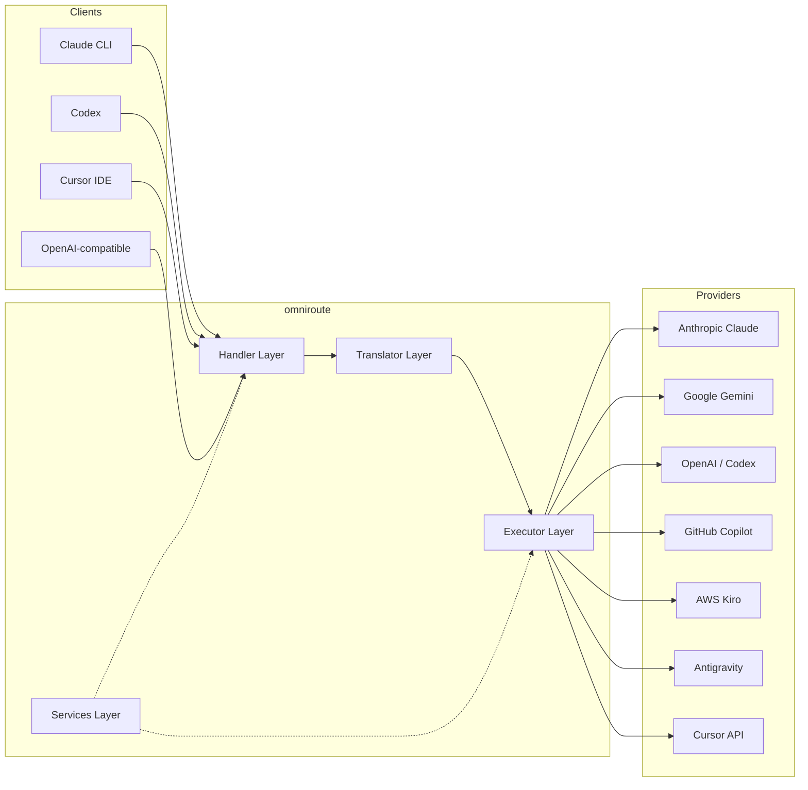
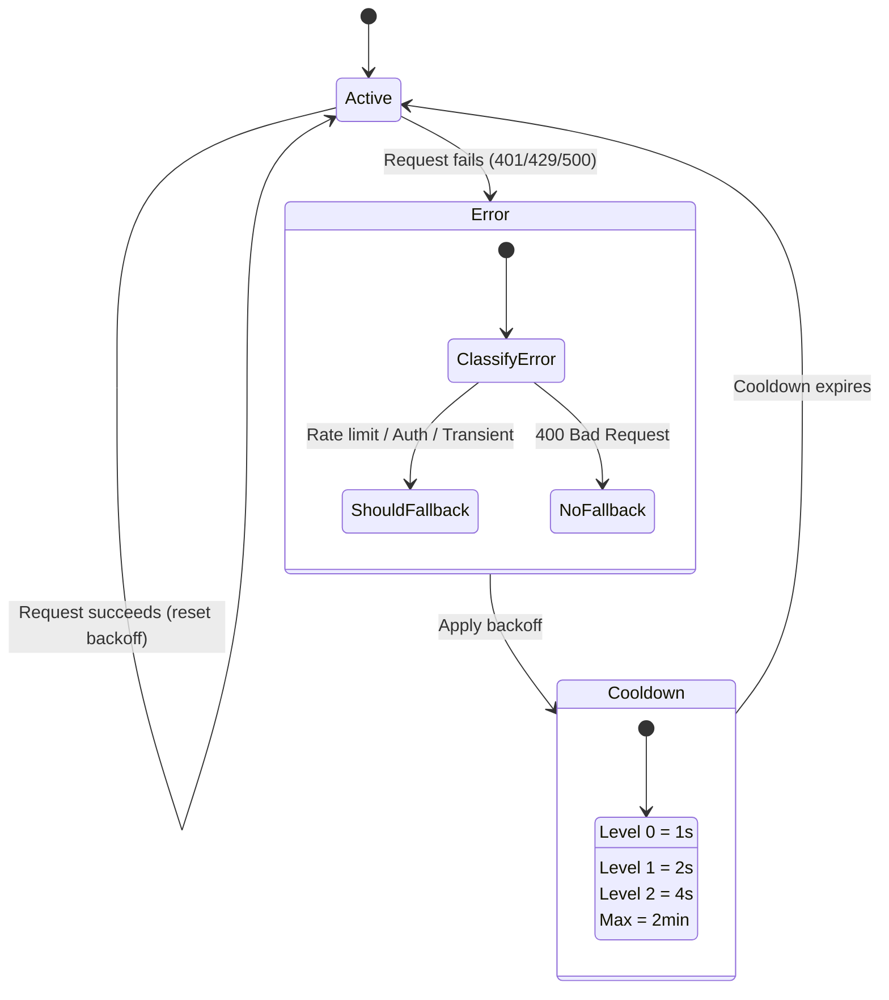
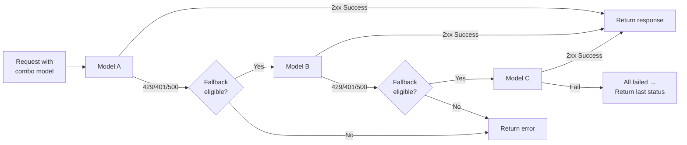
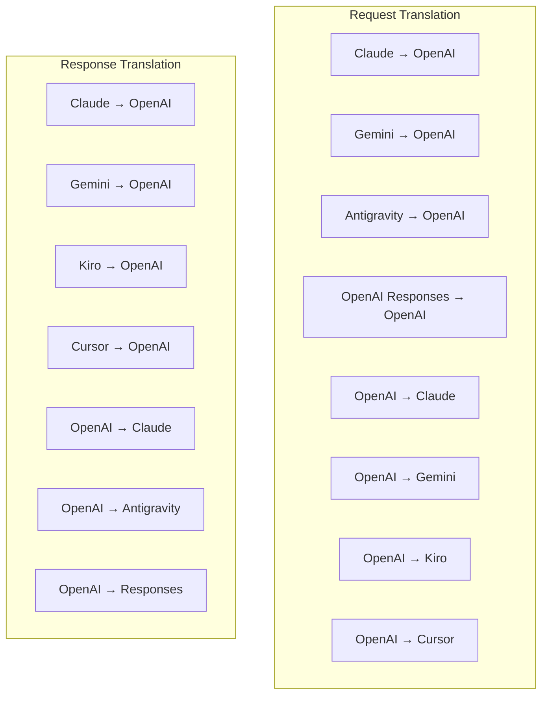
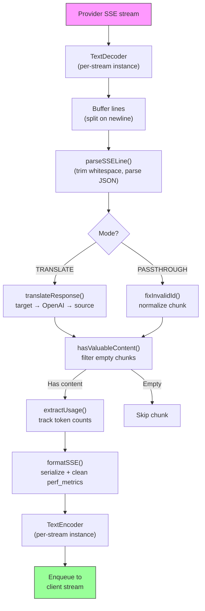
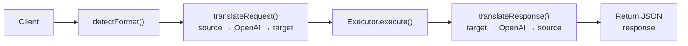
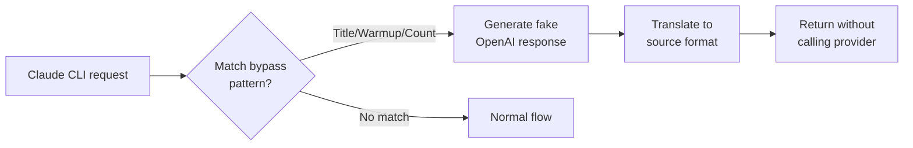

# omniroute — Codebase Documentation (Français)

🌐 **Languages:** 🇺🇸 [English](../../../../docs/CODEBASE_DOCUMENTATION.md) · 🇪🇸 [es](../../es/docs/CODEBASE_DOCUMENTATION.md) · 🇫🇷 [fr](../../fr/docs/CODEBASE_DOCUMENTATION.md) · 🇩🇪 [de](../../de/docs/CODEBASE_DOCUMENTATION.md) · 🇮🇹 [it](../../it/docs/CODEBASE_DOCUMENTATION.md) · 🇷🇺 [ru](../../ru/docs/CODEBASE_DOCUMENTATION.md) · 🇨🇳 [zh-CN](../../zh-CN/docs/CODEBASE_DOCUMENTATION.md) · 🇯🇵 [ja](../../ja/docs/CODEBASE_DOCUMENTATION.md) · 🇰🇷 [ko](../../ko/docs/CODEBASE_DOCUMENTATION.md) · 🇸🇦 [ar](../../ar/docs/CODEBASE_DOCUMENTATION.md) · 🇮🇳 [hi](../../hi/docs/CODEBASE_DOCUMENTATION.md) · 🇮🇳 [in](../../in/docs/CODEBASE_DOCUMENTATION.md) · 🇹🇭 [th](../../th/docs/CODEBASE_DOCUMENTATION.md) · 🇻🇳 [vi](../../vi/docs/CODEBASE_DOCUMENTATION.md) · 🇮🇩 [id](../../id/docs/CODEBASE_DOCUMENTATION.md) · 🇲🇾 [ms](../../ms/docs/CODEBASE_DOCUMENTATION.md) · 🇳🇱 [nl](../../nl/docs/CODEBASE_DOCUMENTATION.md) · 🇵🇱 [pl](../../pl/docs/CODEBASE_DOCUMENTATION.md) · 🇸🇪 [sv](../../sv/docs/CODEBASE_DOCUMENTATION.md) · 🇳🇴 [no](../../no/docs/CODEBASE_DOCUMENTATION.md) · 🇩🇰 [da](../../da/docs/CODEBASE_DOCUMENTATION.md) · 🇫🇮 [fi](../../fi/docs/CODEBASE_DOCUMENTATION.md) · 🇵🇹 [pt](../../pt/docs/CODEBASE_DOCUMENTATION.md) · 🇷🇴 [ro](../../ro/docs/CODEBASE_DOCUMENTATION.md) · 🇭🇺 [hu](../../hu/docs/CODEBASE_DOCUMENTATION.md) · 🇧🇬 [bg](../../bg/docs/CODEBASE_DOCUMENTATION.md) · 🇸🇰 [sk](../../sk/docs/CODEBASE_DOCUMENTATION.md) · 🇺🇦 [uk-UA](../../uk-UA/docs/CODEBASE_DOCUMENTATION.md) · 🇮🇱 [he](../../he/docs/CODEBASE_DOCUMENTATION.md) · 🇵🇭 [phi](../../phi/docs/CODEBASE_DOCUMENTATION.md) · 🇧🇷 [pt-BR](../../pt-BR/docs/CODEBASE_DOCUMENTATION.md) · 🇨🇿 [cs](../../cs/docs/CODEBASE_DOCUMENTATION.md) · 🇹🇷 [tr](../../tr/docs/CODEBASE_DOCUMENTATION.md)

---

> Un guide complet et convivial pour les débutants sur le routeur proxy IA multifournisseur**omniroute**.---

## 1. What Is omniroute?

omniroute est un**routeur proxy**qui se situe entre les clients IA (Claude CLI, Codex, Cursor IDE, etc.) et les fournisseurs d'IA (Anthropic, Google, OpenAI, AWS, GitHub, etc.). Cela résout un gros problème :

> **Different AI clients speak different "languages" (API formats), and different AI providers expect different "languages" too.**omniroute translates between them automatically.

Considérez-le comme un traducteur universel aux Nations Unies : n'importe quel délégué peut parler n'importe quelle langue, et le traducteur la convertit pour n'importe quel autre délégué.---

## 2. Architecture Overview



### Core Principle: Hub-and-Spoke Translation

Toutes les traductions de format passent par le**format OpenAI comme hub** :```
Client Format → [OpenAI Hub] → Provider Format (request)
Provider Format → [OpenAI Hub] → Client Format (response)

```

Cela signifie que vous n'avez besoin que de**N traducteurs**(un par format) au lieu de**N²**(chaque paire).---

## 3. Project Structure

```

omniroute/
├── open-sse/ ← Core proxy library (portable, framework-agnostic)
│ ├── index.js ← Main entry point, exports everything
│ ├── config/ ← Configuration & constants
│ ├── executors/ ← Provider-specific request execution
│ ├── handlers/ ← Request handling orchestration
│ ├── services/ ← Business logic (auth, models, fallback, usage)
│ ├── translator/ ← Format translation engine
│ │ ├── request/ ← Request translators (8 files)
│ │ ├── response/ ← Response translators (7 files)
│ │ └── helpers/ ← Shared translation utilities (6 files)
│ └── utils/ ← Utility functions
├── src/ ← Application layer (Express/Worker runtime)
│ ├── app/ ← Web UI, API routes, middleware
│ ├── lib/ ← Database, auth, and shared library code
│ ├── mitm/ ← Man-in-the-middle proxy utilities
│ ├── models/ ← Database models
│ ├── shared/ ← Shared utilities (wrappers around open-sse)
│ ├── sse/ ← SSE endpoint handlers
│ └── store/ ← State management
├── data/ ← Runtime data (credentials, logs)
│ └── provider-credentials.json (external credentials override, gitignored)
└── tester/ ← Test utilities

````

---

## 4. Module-by-Module Breakdown

### 4.1 Config (`open-sse/config/`)

La**source unique de vérité**pour toutes les configurations de fournisseurs.

| Fichier | Objectif |
| ----------------------------- | ------------------------------------------------------------------------------------------------------------------------------------------------------------------------------------------------------------------------- |
| `constantes.ts` | Objet `PROVIDERS` avec les URL de base, les informations d'identification OAuth (par défaut), les en-têtes et les invites système par défaut pour chaque fournisseur. Définit également `HTTP_STATUS`, `ERROR_TYPES`, `COOLDOWN_MS`, `BACKOFF_CONFIG` et `SKIP_PATTERNS`. |
| `credentialLoader.ts` | Charge les informations d'identification externes à partir de « data/provider-credentials.json » et les fusionne avec les valeurs par défaut codées en dur dans « PROVIDERS ». Garde les secrets hors du contrôle des sources tout en conservant la compatibilité ascendante.               |
| `providerModels.ts` | Registre central des modèles : mappe les alias des fournisseurs → les ID de modèle. Des fonctions comme `getModels()`, `getProviderByAlias()`.                                                                                                          |
| `codexInstructions.ts` | Instructions système injectées dans les requêtes Codex (contraintes d'édition, règles sandbox, politiques d'approbation).                                                                                                                 |
| `defaultThinkingSignature.ts` | Signatures « pensées » par défaut pour les modèles Claude et Gemini.                                                                                                                                                               |
| `ollamaModels.ts` | Définition de schéma pour les modèles Ollama locaux (nom, taille, famille, quantification).                                                                                                                                             |#### Credential Loading Flow

```mermaid
flowchart TD
    A["App starts"] --> B["constants.ts defines PROVIDERS\nwith hardcoded defaults"]
    B --> C{"data/provider-credentials.json\nexists?"}
    C -->|Yes| D["credentialLoader reads JSON"]
    C -->|No| E["Use hardcoded defaults"]
    D --> F{"For each provider in JSON"}
    F --> G{"Provider exists\nin PROVIDERS?"}
    G -->|No| H["Log warning, skip"]
    G -->|Yes| I{"Value is object?"}
    I -->|No| J["Log warning, skip"]
    I -->|Yes| K["Merge clientId, clientSecret,\ntokenUrl, authUrl, refreshUrl"]
    K --> F
    H --> F
    J --> F
    F -->|Done| L["PROVIDERS ready with\nmerged credentials"]
    E --> L
````

---

### 4.2 Executors (`open-sse/executors/`)

Les exécuteurs encapsulent la**logique spécifique au fournisseur**à l'aide du**Modèle de stratégie**. Chaque exécuteur remplace les méthodes de base selon les besoins.```mermaid
classDiagram
class BaseExecutor {
+buildUrl(model, stream, options)
+buildHeaders(credentials, stream, body)
+transformRequest(body, model, stream, credentials)
+execute(url, options)
+shouldRetry(status, error)
+refreshCredentials(credentials, log)
}

    class DefaultExecutor {
        +refreshCredentials()
    }

    class AntigravityExecutor {
        +buildUrl()
        +buildHeaders()
        +transformRequest()
        +shouldRetry()
        +refreshCredentials()
    }

    class CursorExecutor {
        +buildUrl()
        +buildHeaders()
        +transformRequest()
        +parseResponse()
        +generateChecksum()
    }

    class KiroExecutor {
        +buildUrl()
        +buildHeaders()
        +transformRequest()
        +parseEventStream()
        +refreshCredentials()
    }

    BaseExecutor <|-- DefaultExecutor
    BaseExecutor <|-- AntigravityExecutor
    BaseExecutor <|-- CursorExecutor
    BaseExecutor <|-- KiroExecutor
    BaseExecutor <|-- CodexExecutor
    BaseExecutor <|-- GeminiCLIExecutor
    BaseExecutor <|-- GithubExecutor

````

| Exécuteur testamentaire | Fournisseur | Spécialisations clés |
| ---------------- | ------------------------------------------ | ------------------------------------------------------------------------------------------------------------------- |
| `base.ts` | — | Base abstraite : création d'URL, en-têtes, logique de nouvelle tentative, actualisation des informations d'identification |
| `par défaut.ts` | Claude, Gémeaux, OpenAI, GLM, Kimi, MiniMax | Actualisation du jeton OAuth générique pour les fournisseurs standards |
| `antigravité.ts` | Code Google Cloud | Génération d'ID de projet/session, secours multi-URL, nouvelle tentative d'analyse personnalisée à partir des messages d'erreur ("réinitialisation après 2h7m23s") |
| `curseur.ts` | Curseur IDE |**Le plus complexe** : authentification par somme de contrôle SHA-256, encodage de requête Protobuf, EventStream binaire → analyse de réponse SSE |
| `codex.ts` | Codex OpenAI | Injecte les instructions système, gère les niveaux de réflexion, supprime les paramètres non pris en charge |
| `gemini-cli.ts` | CLI Google Gemini | Création d'URL personnalisées (`streamGenerateContent`), actualisation du jeton Google OAuth |
| `github.ts` | Copilote GitHub | Système à double jeton (GitHub OAuth + jeton Copilot), imitation d'en-tête VSCode |
| `kiro.ts` | AWS CodeWhisperer | Analyse binaire AWS EventStream, cadres d'événements AMZN, estimation de jetons |
| `index.ts` | — | Factory : nom du fournisseur de cartes → classe d'exécuteur, avec solution de secours par défaut |---

### 4.3 Handlers (`open-sse/handlers/`)

La**couche d'orchestration** : coordonne la traduction, l'exécution, le streaming et la gestion des erreurs.

| Fichier | Objectif |
| ------------------------------------ | ------------------------------------------------------------------------------------------------------------------------------------------------------------------------------------------------------------ |
| `chatCore.ts` |**Orchestrateur central**(~600 lignes). Gère le cycle de vie complet de la demande : détection du format → traduction → répartition de l'exécuteur → réponse en streaming/non-streaming → actualisation du jeton → gestion des erreurs → journalisation de l'utilisation. |
| `responsesHandler.ts` | Adaptateur pour l'API Responses d'OpenAI : convertit le format des réponses → Fins de discussion → envoie à `chatCore` → reconvertit SSE au format de réponses.                                                                        |
| `embeddings.ts` | Gestionnaire de génération d'intégration : résout le modèle d'intégration → fournisseur, envoi à l'API du fournisseur, renvoie la réponse d'intégration compatible OpenAI. Prend en charge plus de 6 fournisseurs.                                                    |
| `imageGeneration.ts` | Gestionnaire de génération d'images : résout le modèle d'image → fournisseur, prend en charge les modes compatibles OpenAI, Gemini-image (Antigravity) et de secours (Nebius). Renvoie des images base64 ou URL.                                          |#### Request Lifecycle (chatCore.ts)

```mermaid
sequenceDiagram
    participant Client
    participant chatCore
    participant Translator
    participant Executor
    participant Provider

    Client->>chatCore: Request (any format)
    chatCore->>chatCore: Detect source format
    chatCore->>chatCore: Check bypass patterns
    chatCore->>chatCore: Resolve model & provider
    chatCore->>Translator: Translate request (source → OpenAI → target)
    chatCore->>Executor: Get executor for provider
    Executor->>Executor: Build URL, headers, transform request
    Executor->>Executor: Refresh credentials if needed
    Executor->>Provider: HTTP fetch (streaming or non-streaming)

    alt Streaming
        Provider-->>chatCore: SSE stream
        chatCore->>chatCore: Pipe through SSE transform stream
        Note over chatCore: Transform stream translates<br/>each chunk: target → OpenAI → source
        chatCore-->>Client: Translated SSE stream
    else Non-streaming
        Provider-->>chatCore: JSON response
        chatCore->>Translator: Translate response
        chatCore-->>Client: Translated JSON
    end

    alt Error (401, 429, 500...)
        chatCore->>Executor: Retry with credential refresh
        chatCore->>chatCore: Account fallback logic
    end
````

---

### 4.4 Services (`open-sse/services/`)

| Logique métier qui prend en charge les gestionnaires et les exécuteurs. | File                                                                                                                                                                                                                                                                                                                                   | Purpose |
| ----------------------------------------------------------------------- | -------------------------------------------------------------------------------------------------------------------------------------------------------------------------------------------------------------------------------------------------------------------------------------------------------------------------------------- | ------- |
| `provider.ts`                                                           | **Format detection** (`detectFormat`): analyzes request body structure to identify Claude/OpenAI/Gemini/Antigravity/Responses formats (includes `max_tokens` heuristic for Claude). Also: URL building, header building, thinking config normalization. Supports `openai-compatible-*` and `anthropic-compatible-*` dynamic providers. |
| `model.ts`                                                              | Model string parsing (`claude/model-name` → `{provider: "claude", model: "model-name"}`), alias resolution with collision detection, input sanitization (rejects path traversal/control chars), and model info resolution with async alias getter support.                                                                             |
| `accountFallback.ts`                                                    | Rate-limit handling: exponential backoff (1s → 2s → 4s → max 2min), account cooldown management, error classification (which errors trigger fallback vs. not).                                                                                                                                                                         |
| `tokenRefresh.ts`                                                       | OAuth token refresh for **every provider**: Google (Gemini, Antigravity), Claude, Codex, Qwen, Qoder, GitHub (OAuth + Copilot dual-token), Kiro (AWS SSO OIDC + Social Auth). Includes in-flight promise deduplication cache and retry with exponential backoff.                                                                       |
| `combo.ts`                                                              | **Combo models**: chains of fallback models. If model A fails with a fallback-eligible error, try model B, then C, etc. Returns actual upstream status codes.                                                                                                                                                                          |
| `usage.ts`                                                              | Fetches quota/usage data from provider APIs (GitHub Copilot quotas, Antigravity model quotas, Codex rate limits, Kiro usage breakdowns, Claude settings).                                                                                                                                                                              |
| `accountSelector.ts`                                                    | Smart account selection with scoring algorithm: considers priority, health status, round-robin position, and cooldown state to pick the optimal account for each request.                                                                                                                                                              |
| `contextManager.ts`                                                     | Request context lifecycle management: creates and tracks per-request context objects with metadata (request ID, timestamps, provider info) for debugging and logging.                                                                                                                                                                  |
| `ipFilter.ts`                                                           | IP-based access control: supports allowlist and blocklist modes. Validates client IP against configured rules before processing API requests.                                                                                                                                                                                          |
| `sessionManager.ts`                                                     | Session tracking with client fingerprinting: tracks active sessions using hashed client identifiers, monitors request counts, and provides session metrics.                                                                                                                                                                            |
| `signatureCache.ts`                                                     | Request signature-based deduplication cache: prevents duplicate requests by caching recent request signatures and returning cached responses for identical requests within a time window.                                                                                                                                              |
| `systemPrompt.ts`                                                       | Global system prompt injection: prepends or appends a configurable system prompt to all requests, with per-provider compatibility handling.                                                                                                                                                                                            |
| `thinkingBudget.ts`                                                     | Reasoning token budget management: supports passthrough, auto (strip thinking config), custom (fixed budget), and adaptive (complexity-scaled) modes for controlling thinking/reasoning tokens.                                                                                                                                        |
| `wildcardRouter.ts`                                                     | Wildcard model pattern routing: resolves wildcard patterns (e.g., `*/claude-*`) to concrete provider/model pairs based on availability and priority.                                                                                                                                                                                   |

#### Token Refresh Deduplication

```mermaid
sequenceDiagram
    participant R1 as Request 1
    participant R2 as Request 2
    participant Cache as refreshPromiseCache
    participant OAuth as OAuth Provider

    R1->>Cache: getAccessToken("gemini", token)
    Cache->>Cache: No in-flight promise
    Cache->>OAuth: Start refresh
    R2->>Cache: getAccessToken("gemini", token)
    Cache->>Cache: Found in-flight promise
    Cache-->>R2: Return existing promise
    OAuth-->>Cache: New access token
    Cache-->>R1: New access token
    Cache-->>R2: Same access token (shared)
    Cache->>Cache: Delete cache entry
```

#### Account Fallback State Machine



#### Combo Model Chain



---

### 4.5 Translator (`open-sse/translator/`)

Le**moteur de traduction de format**utilisant un système de plugin d'auto-enregistrement.#### Architecture



| Annuaire     | Fichiers      | Descriptif                                                                                                                                                                                                                                                                                   |
| ------------ | ------------- | -------------------------------------------------------------------------------------------------------------------------------------------------------------------------------------------------------------------------------------------------------------------------------------------- | ----------------------------------------- |
| `demande/`   | 8 traducteurs | Convertissez les corps de requête entre les formats. Chaque fichier s'auto-enregistre via `register(from, to, fn)` lors de l'importation.                                                                                                                                                    |
| `réponse/`   | 7 traducteurs | Convertissez les morceaux de réponse en streaming entre les formats. Gère les types d’événements SSE, les blocs de réflexion et les appels d’outils.                                                                                                                                         |
| `helpers/`   | 6 aides       | Utilitaires partagés : `claudeHelper` (extraction d'invite système, configuration de réflexion), `geminiHelper` (mapping parties/contenu), `openaiHelper` (filtrage de format), `toolCallHelper` (génération d'ID, injection de réponse manquante), `maxTokensHelper`, `responsesApiHelper`. |
| `index.ts`   | —             | Moteur de traduction : `translateRequest()`, `translateResponse()`, gestion des états, registre.                                                                                                                                                                                             |
| `formats.ts` | —             | Constantes de format : `OPENAI`, `CLAUDE`, `GEMINI`, `ANTIGRAVITY`, `KIRO`, `CURSOR`, `OPENAI_RESPONSES`.                                                                                                                                                                                    | #### Key Design: Self-Registering Plugins |

```javascript
// Each translator file calls register() on import:
import { register } from "../index.js";
register("claude", "openai", translateClaudeToOpenAI);

// The index.js imports all translator files, triggering registration:
import "./request/claude-to-openai.js"; // ← self-registers
```

---

### 4.6 Utils (`open-sse/utils/`)

| Fichier            | Objectif                                                                                                                                                                                                                                                                                                                                                    |
| ------------------ | ----------------------------------------------------------------------------------------------------------------------------------------------------------------------------------------------------------------------------------------------------------------------------------------------------------------------------------------------------------- | --------------------------- |
| `erreur.ts`        | Création de réponses aux erreurs (format compatible OpenAI), analyse des erreurs en amont, extraction du temps de nouvelle tentative Antigravity à partir des messages d'erreur, streaming d'erreurs SSE.                                                                                                                                                   |
| `stream.ts`        | **SSE Transform Stream** : le pipeline de streaming principal. Deux modes : `TRANSLATE` (traduction plein format) et `PASSTHROUGH` (normaliser + extraire l'utilisation). Gère la mise en mémoire tampon des blocs, l'estimation de l'utilisation et le suivi de la longueur du contenu. Les instances d'encodeur/décodeur par flux évitent l'état partagé. |
| `streamHelpers.ts` | Utilitaires SSE de bas niveau : `parseSSELine` (tolérant les espaces), `hasValuableContent` (filtre les morceaux vides pour OpenAI/Claude/Gemini), `fixInvalidId`, `formatSSE` (sérialisation SSE sensible au format avec nettoyage `perf_metrics`).                                                                                                        |
| `usageTracking.ts` | Extraction de l'utilisation des jetons à partir de n'importe quel format (Claude/OpenAI/Gemini/Responses), estimation avec des ratios outil/message séparés par jeton, ajout de tampon (marge de sécurité de 2000 jetons), filtrage de champs spécifiques au format, journalisation de la console avec couleurs ANSI.                                       |
| `requestLogger.ts` | Legacy file-based request logging helper kept for compatibility. Current deployments should prefer `APP_LOG_TO_FILE` for application logs and the call log pipeline for persisted request artifacts.                                                                                                                                                        |
| `bypassHandler.ts` | Intercepte les modèles spécifiques de Claude CLI (extraction de titre, échauffement, décompte) et renvoie de fausses réponses sans appeler aucun fournisseur. Prend en charge le streaming et le non-streaming. Intentionnellement limité à la portée Claude CLI.                                                                                           |
| `networkProxy.ts`  | Résout l'URL du proxy sortant pour un fournisseur donné avec la priorité : configuration spécifique au fournisseur → configuration globale → variables d'environnement (`HTTPS_PROXY`/`HTTP_PROXY`/`ALL_PROXY`). Prend en charge les exclusions `NO_PROXY`. Met en cache la configuration pendant 30 s.                                                     | #### SSE Streaming Pipeline |



#### Request Logger Session Structure

```
logs/
└── claude_gemini_claude-sonnet_20260208_143045/
    ├── 1_req_client.json      ← Raw client request
    ├── 2_req_source.json      ← After initial conversion
    ├── 3_req_openai.json      ← OpenAI intermediate format
    ├── 4_req_target.json      ← Final target format
    ├── 5_res_provider.txt     ← Provider SSE chunks (streaming)
    ├── 5_res_provider.json    ← Provider response (non-streaming)
    ├── 6_res_openai.txt       ← OpenAI intermediate chunks
    ├── 7_res_client.txt       ← Client-facing SSE chunks
    └── 6_error.json           ← Error details (if any)
```

---

### 4.7 Application Layer (`src/`)

| Annuaire       | Objectif                                                                                              |
| -------------- | ----------------------------------------------------------------------------------------------------- | ----------------------- |
| `src/app/`     | Interface utilisateur Web, routes API, middleware express, gestionnaires de rappel OAuth              |
| `src/lib/`     | Accès à la base de données (`localDb.ts`, `usageDb.ts`), authentification, partagé                    |
| `src/mitm/`    | Utilitaires proxy Man-in-the-middle pour intercepter le trafic des fournisseurs                       |
| `src/modèles/` | Définitions du modèle de base de données                                                              |
| `src/partagé/` | Wrappers autour des fonctions open-sse (fournisseur, flux, erreur, etc.)                              |
| `src/sse/`     | Gestionnaires de points de terminaison SSE qui connectent la bibliothèque open-sse aux routes Express |
| `src/magasin/` | Gestion de l'état des applications                                                                    | #### Notable API Routes |

| Itinéraire                                    | Méthodes                 | Objectif                                                                                                |
| --------------------------------------------- | ------------------------ | ------------------------------------------------------------------------------------------------------- | --- |
| `/api/provider-models`                        | OBTENIR/POST/DELETE      | CRUD pour les modèles personnalisés par fournisseur                                                     |
| `/api/models/catalogue`                       | OBTENIR                  | Catalogue agrégé de tous les modèles (chat, intégration, image, personnalisé) regroupés par fournisseur |
| `/api/settings/proxy`                         | OBTENIR/METTRE/SUPPRIMER | Configuration du proxy sortant hiérarchique (`global/providers/combos/keys`)                            |
| `/api/settings/proxy/test`                    | POSTER                   | Valide la connectivité proxy et renvoie l'adresse IP/latence publique                                   |
| `/v1/providers/[provider]/chat/completions`   | POSTER                   | Compléments de chat dédiés par fournisseur avec validation du modèle                                    |
| `/v1/providers/[provider]/embeddings`         | POSTER                   | Intégrations dédiées par fournisseur avec validation du modèle                                          |
| `/v1/providers/[provider]/images/générations` | POSTER                   | Génération d'images dédiée par fournisseur avec validation du modèle                                    |
| `/api/settings/ip-filter`                     | OBTENIR/METTRE           | Gestion des listes autorisées/bloquées IP                                                               |
| `/api/settings/thinking-budget`               | OBTENIR/METTRE           | Configuration du budget du jeton de raisonnement (passthrough/auto/custom/adaptatif)                    |
| `/api/settings/system-prompt`                 | OBTENIR/METTRE           | Injection rapide du système global pour toutes les demandes                                             |
| `/api/sessions`                               | OBTENIR                  | Suivi et métriques des sessions actives                                                                 |
| `/api/rate-limites`                           | OBTENIR                  | Statut de limite de débit par compte                                                                    | --- |

## 5. Key Design Patterns

### 5.1 Hub-and-Spoke Translation

Tous les formats sont traduits via le**format OpenAI comme hub**. L'ajout d'un nouveau fournisseur ne nécessite que l'écriture d'**une paire**de traducteurs (vers/depuis OpenAI), et non de N paires.### 5.2 Executor Strategy Pattern

Chaque fournisseur dispose d'une classe d'exécuteur dédiée héritant de « BaseExecutor ». L'usine dans `executors/index.ts` sélectionne la bonne au moment de l'exécution.### 5.3 Self-Registering Plugin System

Les modules de traduction s'enregistrent eux-mêmes lors de l'importation via `register()`. Ajouter un nouveau traducteur consiste simplement à créer un fichier et à l'importer.### 5.4 Account Fallback with Exponential Backoff

Lorsqu'un fournisseur renvoie 429/401/500, le système peut passer au compte suivant, en appliquant des temps de recharge exponentiels (1s → 2s → 4s → max 2min).### 5.5 Combo Model Chains

Un « combo » regroupe plusieurs chaînes « fournisseur/modèle ». Si le premier échoue, revenez automatiquement au suivant.### 5.6 Stateful Streaming Translation

La traduction des réponses maintient l'état dans les morceaux SSE (suivi des blocs de réflexion, accumulation d'appels d'outils, indexation des blocs de contenu) via le mécanisme `initState()`.### 5.7 Usage Safety Buffer

Un tampon de 2 000 jetons est ajouté à l'utilisation signalée pour empêcher les clients d'atteindre les limites de la fenêtre contextuelle en raison de la surcharge des invites système et de la traduction du format.---

## 6. Supported Formats

| Formater                   | Itinéraire       | Identifiant       |
| -------------------------- | ---------------- | ----------------- | --- |
| Achèvements du chat OpenAI | source + cible   | `openai`          |
| API de réponses OpenAI     | source + cible   | `openai-réponses` |
| Claude Anthropique         | source + cible   | `claude`          |
| Google Gémeaux             | source + cible   | `Gémeaux`         |
| CLI Google Gemini          | cible uniquement | `gemini-cli`      |
| Antigravité                | source + cible   | `antigravité`     |
| AWSKiro                    | cible uniquement | `kiro`            |
| Curseur                    | cible uniquement | `curseur`         | --- |

## 7. Supported Providers

| Fournisseur                | Méthode d'authentification               | Exécuteur testamentaire | Notes clés                                                                |
| -------------------------- | ---------------------------------------- | ----------------------- | ------------------------------------------------------------------------- | --- |
| Claude Anthropique         | Clé API ou OAuth                         | Par défaut              | Utilise l'en-tête `x-api-key`                                             |
| Google Gémeaux             | Clé API ou OAuth                         | Par défaut              | Utilise l'en-tête `x-goog-api-key`                                        |
| CLI Google Gemini          | OAuth                                    | GémeauxCLI              | Utilise le point de terminaison `streamGenerateContent`                   |
| Antigravité                | OAuth                                    | Antigravité             | Solution de secours multi-URL, nouvelle tentative d'analyse personnalisée |
| OpenAI                     | Clé API                                  | Par défaut              | Authentification du porte-étendard                                        |
| Codex                      | OAuth                                    | Codex                   | Injecte les instructions système, gère la réflexion                       |
| Copilote GitHub            | OAuth + jeton Copilot                    | GitHub                  | Double jeton, en-tête VSCode imitant                                      |
| Kiro (AWS)                 | AWS SSO OIDC ou Social                   | Kiro                    | Analyse binaire d'EventStream                                             |
| Curseur IDE                | Authentification de la somme de contrôle | Curseur                 | Encodage Protobuf, sommes de contrôle SHA-256                             |
| Qwen                       | OAuth                                    | Par défaut              | Authentification standard                                                 |
| Qoder                      | OAuth (Basique + Porteur)                | Par défaut              | En-tête à double authentification                                         |
| OuvrirRouter               | Clé API                                  | Par défaut              | Authentification du porte-étendard                                        |
| GLM, Kimi, MiniMax         | Clé API                                  | Par défaut              | Compatible avec Claude, utilisez `x-api-key`                              |
| `openai-compatible-*`      | Clé API                                  | Par défaut              | Dynamique : tout point de terminaison compatible OpenAI                   |
| `anthropique-compatible-*` | Clé API                                  | Par défaut              | Dynamique : tout point de terminaison compatible Claude                   | --- |

## 8. Data Flow Summary

### Streaming Request

```mermaid
flowchart LR
    A["Client"] --> B["detectFormat()"]
    B --> C["translateRequest()\nsource → OpenAI → target"]
    C --> D["Executor\nbuildUrl + buildHeaders"]
    D --> E["fetch(providerURL)"]
    E --> F["createSSEStream()\nTRANSLATE mode"]
    F --> G["parseSSELine()"]
    G --> H["translateResponse()\ntarget → OpenAI → source"]
    H --> I["extractUsage()\n+ addBuffer"]
    I --> J["formatSSE()"]
    J --> K["Client receives\ntranslated SSE"]
    K --> L["logUsage()\nsaveRequestUsage()"]
```



### Non-Streaming Request



### Bypass Flow (Claude CLI)


