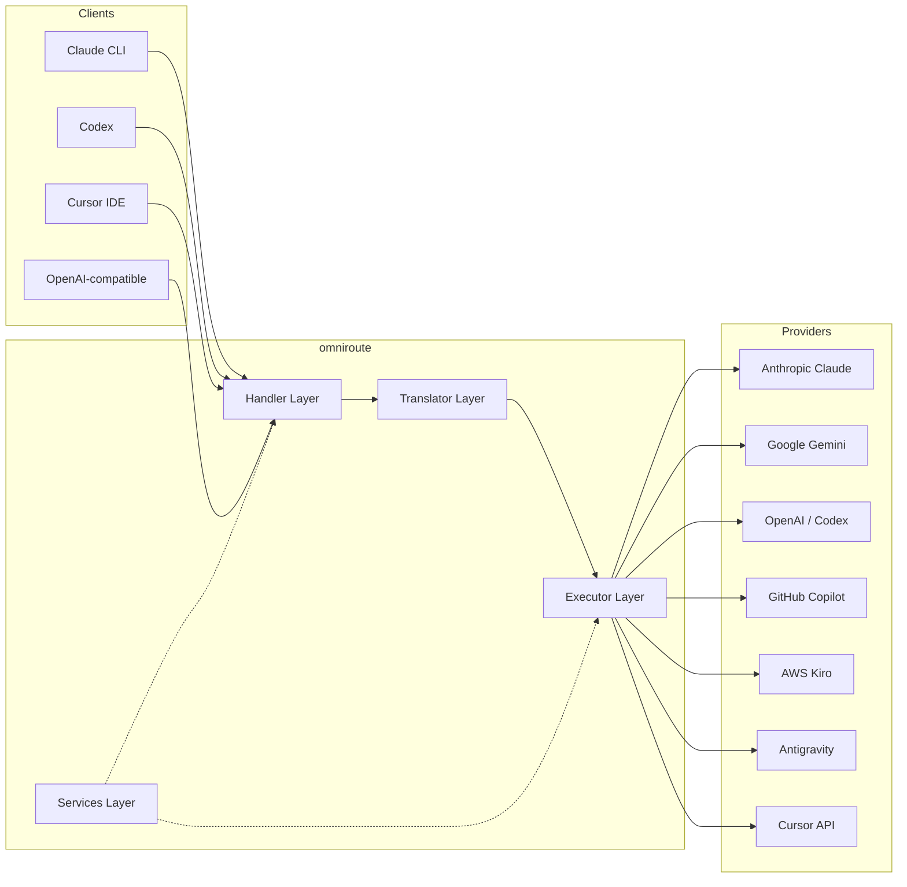
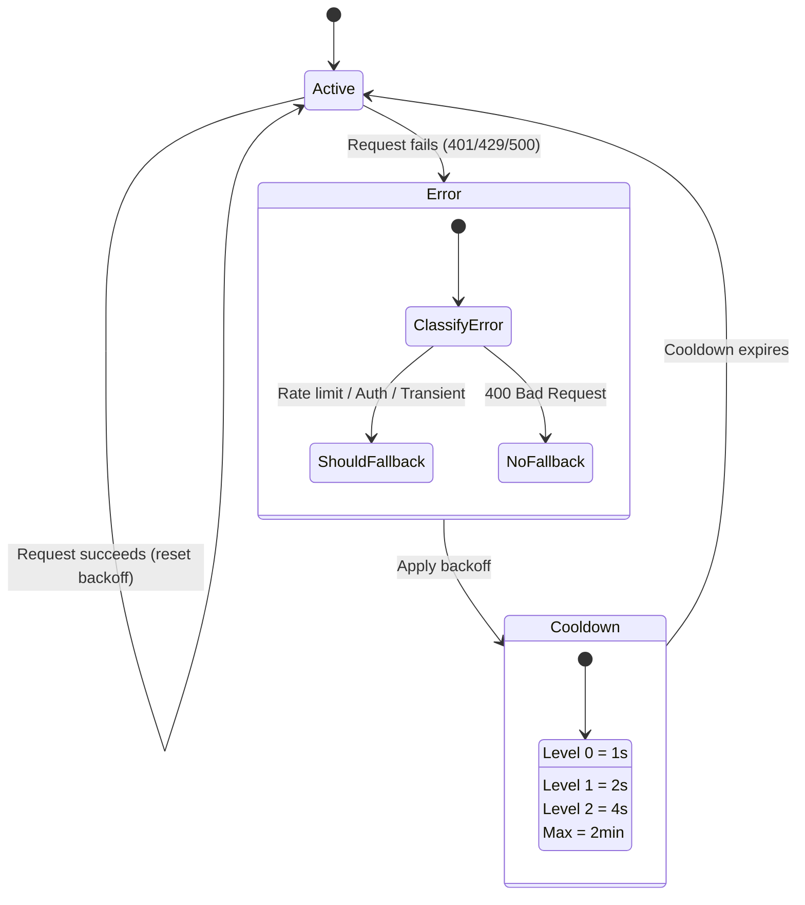
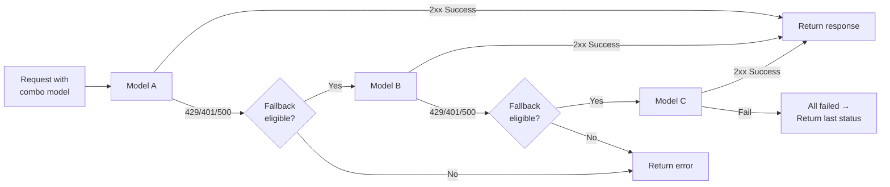
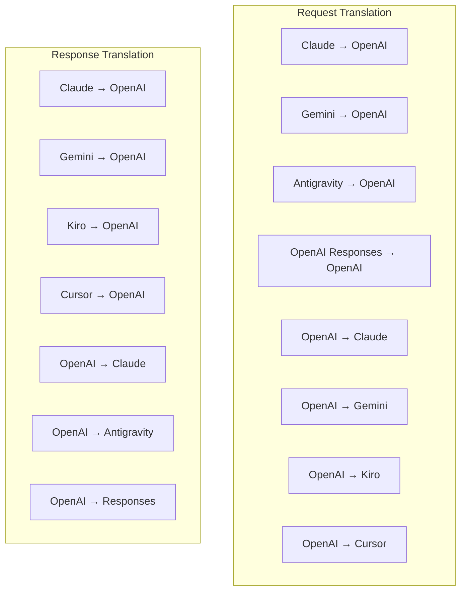
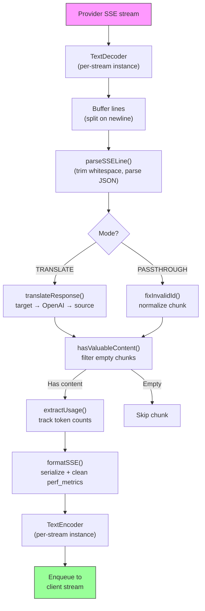
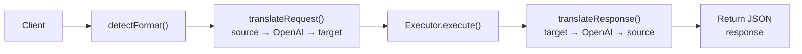
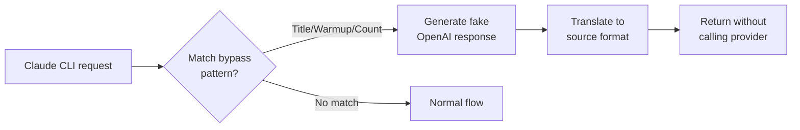

# omniroute — Codebase Documentation (हिन्दी)

🌐 **Languages:** 🇺🇸 [English](../../../../docs/CODEBASE_DOCUMENTATION.md) · 🇪🇸 [es](../../es/docs/CODEBASE_DOCUMENTATION.md) · 🇫🇷 [fr](../../fr/docs/CODEBASE_DOCUMENTATION.md) · 🇩🇪 [de](../../de/docs/CODEBASE_DOCUMENTATION.md) · 🇮🇹 [it](../../it/docs/CODEBASE_DOCUMENTATION.md) · 🇷🇺 [ru](../../ru/docs/CODEBASE_DOCUMENTATION.md) · 🇨🇳 [zh-CN](../../zh-CN/docs/CODEBASE_DOCUMENTATION.md) · 🇯🇵 [ja](../../ja/docs/CODEBASE_DOCUMENTATION.md) · 🇰🇷 [ko](../../ko/docs/CODEBASE_DOCUMENTATION.md) · 🇸🇦 [ar](../../ar/docs/CODEBASE_DOCUMENTATION.md) · 🇮🇳 [hi](../../hi/docs/CODEBASE_DOCUMENTATION.md) · 🇮🇳 [in](../../in/docs/CODEBASE_DOCUMENTATION.md) · 🇹🇭 [th](../../th/docs/CODEBASE_DOCUMENTATION.md) · 🇻🇳 [vi](../../vi/docs/CODEBASE_DOCUMENTATION.md) · 🇮🇩 [id](../../id/docs/CODEBASE_DOCUMENTATION.md) · 🇲🇾 [ms](../../ms/docs/CODEBASE_DOCUMENTATION.md) · 🇳🇱 [nl](../../nl/docs/CODEBASE_DOCUMENTATION.md) · 🇵🇱 [pl](../../pl/docs/CODEBASE_DOCUMENTATION.md) · 🇸🇪 [sv](../../sv/docs/CODEBASE_DOCUMENTATION.md) · 🇳🇴 [no](../../no/docs/CODEBASE_DOCUMENTATION.md) · 🇩🇰 [da](../../da/docs/CODEBASE_DOCUMENTATION.md) · 🇫🇮 [fi](../../fi/docs/CODEBASE_DOCUMENTATION.md) · 🇵🇹 [pt](../../pt/docs/CODEBASE_DOCUMENTATION.md) · 🇷🇴 [ro](../../ro/docs/CODEBASE_DOCUMENTATION.md) · 🇭🇺 [hu](../../hu/docs/CODEBASE_DOCUMENTATION.md) · 🇧🇬 [bg](../../bg/docs/CODEBASE_DOCUMENTATION.md) · 🇸🇰 [sk](../../sk/docs/CODEBASE_DOCUMENTATION.md) · 🇺🇦 [uk-UA](../../uk-UA/docs/CODEBASE_DOCUMENTATION.md) · 🇮🇱 [he](../../he/docs/CODEBASE_DOCUMENTATION.md) · 🇵🇭 [phi](../../phi/docs/CODEBASE_DOCUMENTATION.md) · 🇧🇷 [pt-BR](../../pt-BR/docs/CODEBASE_DOCUMENTATION.md) · 🇨🇿 [cs](../../cs/docs/CODEBASE_DOCUMENTATION.md) · 🇹🇷 [tr](../../tr/docs/CODEBASE_DOCUMENTATION.md)

---

> **ओम्नीरूटे**मल्टी-प्रोवाइडर एआई प्रॉक्सी राउटर के लिए एक व्यापक, शुरुआती-अनुकूल मार्गदर्शिका।---

## 1. What Is omniroute?

ऑम्नीरूट एक**प्रॉक्सी राउटर**है जो एआई क्लाइंट (क्लाउड सीएलआई, कोडेक्स, कर्सर आईडीई, आदि) और एआई प्रदाताओं (एंथ्रोपिक, गूगल, ओपनएआई, एडब्ल्यूएस, गिटहब, आदि) के बीच बैठता है। यह एक बड़ी समस्या का समाधान करता है:

> **अलग-अलग एआई क्लाइंट अलग-अलग "भाषाएं" (एपीआई प्रारूप) बोलते हैं, और अलग-अलग एआई प्रदाता भी अलग-अलग "भाषाओं" की अपेक्षा करते हैं।**ऑम्नीरूट स्वचालित रूप से उनके बीच अनुवाद करता है।

इसे संयुक्त राष्ट्र में एक सार्वभौमिक अनुवादक की तरह समझें - कोई भी प्रतिनिधि कोई भी भाषा बोल सकता है, और अनुवादक इसे किसी अन्य प्रतिनिधि के लिए परिवर्तित कर देता है।---

## 2. Architecture Overview



### Core Principle: Hub-and-Spoke Translation

सभी प्रारूप अनुवाद**हब के रूप में ओपनएआई प्रारूप**से होकर गुजरता है:```
Client Format → [OpenAI Hub] → Provider Format (request)
Provider Format → [OpenAI Hub] → Client Format (response)

```

इसका मतलब है कि आपको**N²**(प्रत्येक जोड़ी) के बजाय केवल**N अनुवादकों**(प्रति प्रारूप एक) की आवश्यकता है।---

## 3. Project Structure

```

omniroute/
├── open-sse/ ← Core proxy library (portable, framework-agnostic)
│ ├── index.js ← Main entry point, exports everything
│ ├── config/ ← Configuration & constants
│ ├── executors/ ← Provider-specific request execution
│ ├── handlers/ ← Request handling orchestration
│ ├── services/ ← Business logic (auth, models, fallback, usage)
│ ├── translator/ ← Format translation engine
│ │ ├── request/ ← Request translators (8 files)
│ │ ├── response/ ← Response translators (7 files)
│ │ └── helpers/ ← Shared translation utilities (6 files)
│ └── utils/ ← Utility functions
├── src/ ← Application layer (Express/Worker runtime)
│ ├── app/ ← Web UI, API routes, middleware
│ ├── lib/ ← Database, auth, and shared library code
│ ├── mitm/ ← Man-in-the-middle proxy utilities
│ ├── models/ ← Database models
│ ├── shared/ ← Shared utilities (wrappers around open-sse)
│ ├── sse/ ← SSE endpoint handlers
│ └── store/ ← State management
├── data/ ← Runtime data (credentials, logs)
│ └── provider-credentials.json (external credentials override, gitignored)
└── tester/ ← Test utilities

````

---

## 4. Module-by-Module Breakdown

### 4.1 Config (`open-sse/config/`)

सभी प्रदाता कॉन्फ़िगरेशन के लिए**सत्य का एकल स्रोत**।

| फ़ाइल | उद्देश्य |
| -------------------------------- | ------------------------------------------------------------------------------------------------------------------------------------------------------------------------------------------------------------------ |
| `स्थिरांक.ts` | प्रत्येक प्रदाता के लिए आधार URL, OAuth क्रेडेंशियल (डिफ़ॉल्ट), हेडर और डिफ़ॉल्ट सिस्टम संकेतों के साथ `PROVIDERS` ऑब्जेक्ट। `HTTP_STATUS`, `ERROR_TYPES`, `COOLDOWN_MS`, `BACKOFF_CONFIG`, और `SKIP_PATTERNS` को भी परिभाषित करता है। |
| `credentialLoader.ts` | `data/provider-credentials.json` से बाहरी क्रेडेंशियल लोड करता है और उन्हें `PROVIDERS` में हार्डकोडेड डिफॉल्ट्स पर मर्ज करता है। पश्चगामी संगतता बनाए रखते हुए रहस्यों को स्रोत नियंत्रण से बाहर रखता है।               |
| `providerModels.ts` | केंद्रीय मॉडल रजिस्ट्री: मानचित्र प्रदाता उपनाम → मॉडल आईडी। `getModels()`, `getProviderByAlias()` जैसे फ़ंक्शन।                                                                                                          |
| `codexInstructions.ts` | सिस्टम निर्देश कोडेक्स अनुरोधों (संपादन बाधाएं, सैंडबॉक्स नियम, अनुमोदन नीतियां) में शामिल किए गए हैं।                                                                                                                 |
| `defaultThinkingSignature.ts` | क्लाउड और जेमिनी मॉडल के लिए डिफ़ॉल्ट "सोच" हस्ताक्षर।                                                                                                                                                               |
| `ollamaModels.ts` | स्थानीय ओलामा मॉडल के लिए स्कीमा परिभाषा (नाम, आकार, परिवार, परिमाणीकरण)।                                                                                                                                             |#### Credential Loading Flow

```mermaid
flowchart TD
    A["App starts"] --> B["constants.ts defines PROVIDERS\nwith hardcoded defaults"]
    B --> C{"data/provider-credentials.json\nexists?"}
    C -->|Yes| D["credentialLoader reads JSON"]
    C -->|No| E["Use hardcoded defaults"]
    D --> F{"For each provider in JSON"}
    F --> G{"Provider exists\nin PROVIDERS?"}
    G -->|No| H["Log warning, skip"]
    G -->|Yes| I{"Value is object?"}
    I -->|No| J["Log warning, skip"]
    I -->|Yes| K["Merge clientId, clientSecret,\ntokenUrl, authUrl, refreshUrl"]
    K --> F
    H --> F
    J --> F
    F -->|Done| L["PROVIDERS ready with\nmerged credentials"]
    E --> L
````

---

### 4.2 Executors (`open-sse/executors/`)

निष्पादक**रणनीति पैटर्न**का उपयोग करके**प्रदाता-विशिष्ट तर्क**को समाहित करते हैं। प्रत्येक निष्पादक आवश्यकतानुसार आधार विधियों को ओवरराइड करता है।```mermaid
classDiagram
class BaseExecutor {
+buildUrl(model, stream, options)
+buildHeaders(credentials, stream, body)
+transformRequest(body, model, stream, credentials)
+execute(url, options)
+shouldRetry(status, error)
+refreshCredentials(credentials, log)
}

    class DefaultExecutor {
        +refreshCredentials()
    }

    class AntigravityExecutor {
        +buildUrl()
        +buildHeaders()
        +transformRequest()
        +shouldRetry()
        +refreshCredentials()
    }

    class CursorExecutor {
        +buildUrl()
        +buildHeaders()
        +transformRequest()
        +parseResponse()
        +generateChecksum()
    }

    class KiroExecutor {
        +buildUrl()
        +buildHeaders()
        +transformRequest()
        +parseEventStream()
        +refreshCredentials()
    }

    BaseExecutor <|-- DefaultExecutor
    BaseExecutor <|-- AntigravityExecutor
    BaseExecutor <|-- CursorExecutor
    BaseExecutor <|-- KiroExecutor
    BaseExecutor <|-- CodexExecutor
    BaseExecutor <|-- GeminiCLIExecutor
    BaseExecutor <|-- GithubExecutor

````

| निष्पादक | प्रदाता | प्रमुख विशेषज्ञताएँ |
| ---------------- | ------------------------------------------------ | ------------------------------------------------------------------------------------------------------------------ |
| `बेस.टीएस` | — | सार आधार: यूआरएल निर्माण, हेडर, पुनः प्रयास तर्क, क्रेडेंशियल ताज़ा |
| `default.ts` | क्लाउड, जेमिनी, ओपनएआई, जीएलएम, किमी, मिनीमैक्स | मानक प्रदाताओं के लिए जेनेरिक OAuth टोकन ताज़ा करें |
| `एंटीग्रेविटी.टीएस` | गूगल क्लाउड कोड | प्रोजेक्ट/सत्र आईडी जनरेशन, मल्टी-यूआरएल फ़ॉलबैक, त्रुटि संदेशों से कस्टम पुनः प्रयास पार्सिंग ("2h7m23s के बाद रीसेट करें") |
| `कर्सर.ts` | कर्सर आईडीई |**सबसे जटिल**: SHA-256 चेकसम ऑथ, प्रोटोबफ अनुरोध एन्कोडिंग, बाइनरी इवेंटस्ट्रीम → SSE प्रतिक्रिया पार्सिंग |
| `कोडेक्स.ts` | ओपनएआई कोडेक्स | सिस्टम निर्देशों को इंजेक्ट करता है, सोच के स्तर को प्रबंधित करता है, असमर्थित मापदंडों को हटाता है |
| `मिथुन-cli.ts` | गूगल जेमिनी सीएलआई | कस्टम URL बिल्डिंग (`streamGenerateContent`), Google OAuth टोकन रिफ्रेश |
| `github.ts` | गिटहब कोपायलट | दोहरी टोकन प्रणाली (GitHub OAuth + Copilot टोकन), VSCode हेडर की नकल |
| `kiro.ts` | एडब्ल्यूएस कोडव्हिस्परर | एडब्ल्यूएस इवेंटस्ट्रीम बाइनरी पार्सिंग, एएमजेडएन इवेंट फ्रेम, टोकन अनुमान |
| `index.ts` | — | फ़ैक्टरी: मानचित्र प्रदाता का नाम → निष्पादक वर्ग, डिफ़ॉल्ट फ़ॉलबैक के साथ |---

### 4.3 Handlers (`open-sse/handlers/`)

**ऑर्केस्ट्रेशन परत**- अनुवाद, निष्पादन, स्ट्रीमिंग और त्रुटि प्रबंधन का समन्वय करती है।

| फ़ाइल | उद्देश्य |
| ---------------------- | ------------------------------------------------------------------------------------------------------------------------------------------------------------------------------------------------------------------ |
| `chatCore.ts` |**केंद्रीय ऑर्केस्ट्रेटर**(~600 पंक्तियाँ)। संपूर्ण अनुरोध जीवनचक्र को संभालता है: प्रारूप का पता लगाना → अनुवाद → निष्पादक प्रेषण → स्ट्रीमिंग/गैर-स्ट्रीमिंग प्रतिक्रिया → टोकन ताज़ा करना → त्रुटि प्रबंधन → उपयोग लॉगिंग। |
| `responsesHandler.ts` | ओपनएआई के रिस्पॉन्स एपीआई के लिए एडेप्टर: रिस्पॉन्स फॉर्मेट को परिवर्तित करता है → चैट समापन → `चैटकोर` को भेजता है → एसएसई को रिस्पॉन्स फॉर्मेट में वापस परिवर्तित करता है।                                                                        |
| `एम्बेडिंग्स.टीएस` | एंबेडिंग जेनरेशन हैंडलर: एंबेडिंग मॉडल → प्रदाता को हल करता है, प्रदाता एपीआई को भेजता है, ओपनएआई-संगत एंबेडिंग प्रतिक्रिया देता है। 6+ प्रदाताओं का समर्थन करता है।                                                    |
| `इमेजजेनरेशन.टीएस` | छवि निर्माण हैंडलर: छवि मॉडल → प्रदाता को हल करता है, ओपनएआई-संगत, जेमिनी-छवि (एंटीग्रेविटी), और फ़ॉलबैक (नेबियस) मोड का समर्थन करता है। बेस64 या यूआरएल छवियाँ लौटाता है।                                          |#### Request Lifecycle (chatCore.ts)

```mermaid
sequenceDiagram
    participant Client
    participant chatCore
    participant Translator
    participant Executor
    participant Provider

    Client->>chatCore: Request (any format)
    chatCore->>chatCore: Detect source format
    chatCore->>chatCore: Check bypass patterns
    chatCore->>chatCore: Resolve model & provider
    chatCore->>Translator: Translate request (source → OpenAI → target)
    chatCore->>Executor: Get executor for provider
    Executor->>Executor: Build URL, headers, transform request
    Executor->>Executor: Refresh credentials if needed
    Executor->>Provider: HTTP fetch (streaming or non-streaming)

    alt Streaming
        Provider-->>chatCore: SSE stream
        chatCore->>chatCore: Pipe through SSE transform stream
        Note over chatCore: Transform stream translates<br/>each chunk: target → OpenAI → source
        chatCore-->>Client: Translated SSE stream
    else Non-streaming
        Provider-->>chatCore: JSON response
        chatCore->>Translator: Translate response
        chatCore-->>Client: Translated JSON
    end

    alt Error (401, 429, 500...)
        chatCore->>Executor: Retry with credential refresh
        chatCore->>chatCore: Account fallback logic
    end
````

---

### 4.4 Services (`open-sse/services/`)

| व्यावसायिक तर्क जो संचालकों और निष्पादकों का समर्थन करता है। | File                                                                                                                                                                                                                                                                                                                                   | Purpose |
| ------------------------------------------------------------ | -------------------------------------------------------------------------------------------------------------------------------------------------------------------------------------------------------------------------------------------------------------------------------------------------------------------------------------- | ------- |
| `provider.ts`                                                | **Format detection** (`detectFormat`): analyzes request body structure to identify Claude/OpenAI/Gemini/Antigravity/Responses formats (includes `max_tokens` heuristic for Claude). Also: URL building, header building, thinking config normalization. Supports `openai-compatible-*` and `anthropic-compatible-*` dynamic providers. |
| `model.ts`                                                   | Model string parsing (`claude/model-name` → `{provider: "claude", model: "model-name"}`), alias resolution with collision detection, input sanitization (rejects path traversal/control chars), and model info resolution with async alias getter support.                                                                             |
| `accountFallback.ts`                                         | Rate-limit handling: exponential backoff (1s → 2s → 4s → max 2min), account cooldown management, error classification (which errors trigger fallback vs. not).                                                                                                                                                                         |
| `tokenRefresh.ts`                                            | OAuth token refresh for **every provider**: Google (Gemini, Antigravity), Claude, Codex, Qwen, Qoder, GitHub (OAuth + Copilot dual-token), Kiro (AWS SSO OIDC + Social Auth). Includes in-flight promise deduplication cache and retry with exponential backoff.                                                                       |
| `combo.ts`                                                   | **Combo models**: chains of fallback models. If model A fails with a fallback-eligible error, try model B, then C, etc. Returns actual upstream status codes.                                                                                                                                                                          |
| `usage.ts`                                                   | Fetches quota/usage data from provider APIs (GitHub Copilot quotas, Antigravity model quotas, Codex rate limits, Kiro usage breakdowns, Claude settings).                                                                                                                                                                              |
| `accountSelector.ts`                                         | Smart account selection with scoring algorithm: considers priority, health status, round-robin position, and cooldown state to pick the optimal account for each request.                                                                                                                                                              |
| `contextManager.ts`                                          | Request context lifecycle management: creates and tracks per-request context objects with metadata (request ID, timestamps, provider info) for debugging and logging.                                                                                                                                                                  |
| `ipFilter.ts`                                                | IP-based access control: supports allowlist and blocklist modes. Validates client IP against configured rules before processing API requests.                                                                                                                                                                                          |
| `sessionManager.ts`                                          | Session tracking with client fingerprinting: tracks active sessions using hashed client identifiers, monitors request counts, and provides session metrics.                                                                                                                                                                            |
| `signatureCache.ts`                                          | Request signature-based deduplication cache: prevents duplicate requests by caching recent request signatures and returning cached responses for identical requests within a time window.                                                                                                                                              |
| `systemPrompt.ts`                                            | Global system prompt injection: prepends or appends a configurable system prompt to all requests, with per-provider compatibility handling.                                                                                                                                                                                            |
| `thinkingBudget.ts`                                          | Reasoning token budget management: supports passthrough, auto (strip thinking config), custom (fixed budget), and adaptive (complexity-scaled) modes for controlling thinking/reasoning tokens.                                                                                                                                        |
| `wildcardRouter.ts`                                          | Wildcard model pattern routing: resolves wildcard patterns (e.g., `*/claude-*`) to concrete provider/model pairs based on availability and priority.                                                                                                                                                                                   |

#### Token Refresh Deduplication

```mermaid
sequenceDiagram
    participant R1 as Request 1
    participant R2 as Request 2
    participant Cache as refreshPromiseCache
    participant OAuth as OAuth Provider

    R1->>Cache: getAccessToken("gemini", token)
    Cache->>Cache: No in-flight promise
    Cache->>OAuth: Start refresh
    R2->>Cache: getAccessToken("gemini", token)
    Cache->>Cache: Found in-flight promise
    Cache-->>R2: Return existing promise
    OAuth-->>Cache: New access token
    Cache-->>R1: New access token
    Cache-->>R2: Same access token (shared)
    Cache->>Cache: Delete cache entry
```

#### Account Fallback State Machine



#### Combo Model Chain



---

### 4.5 Translator (`open-sse/translator/`)

स्व-पंजीकरण प्लगइन सिस्टम का उपयोग करके**प्रारूप अनुवाद इंजन**।#### आर्किटेक्चर



| निर्देशिका     | फ़ाइलें   | विवरण                                                                                                                                                                                                                                                               |
| -------------- | --------- | ------------------------------------------------------------------------------------------------------------------------------------------------------------------------------------------------------------------------------------------------------------------- | ----------------------------------------- |
| `अनुरोध/`      | 8 अनुवादक | प्रारूपों के बीच अनुरोध निकायों को परिवर्तित करें। प्रत्येक फ़ाइल आयात पर `रजिस्टर(से, से, एफएन)` के माध्यम से स्व-पंजीकृत होती है।                                                                                                                                 |
| `प्रतिक्रिया/` | 7 अनुवादक | प्रारूपों के बीच स्ट्रीमिंग प्रतिक्रिया खंडों को परिवर्तित करें। एसएसई इवेंट प्रकार, थिंकिंग ब्लॉक, टूल कॉल को संभालता है।                                                                                                                                          |
| `सहायक/`       | 6 सहायक   | साझा उपयोगिताएँ: `क्लाउडहेल्पर` (सिस्टम प्रॉम्प्ट एक्सट्रैक्शन, थिंकिंग कॉन्फिग), `जेमिनीहेल्पर` (पार्ट्स/कंटेंट मैपिंग), `ओपनाईहेल्पर` (फॉर्मेट फ़िल्टरिंग), `टूलकॉलहेल्पर` (आईडी जेनरेशन, मिसिंग रिस्पॉन्स इंजेक्शन), `मैक्सटोकेन्सहेल्पर`, `रेस्पॉन्सएपिहेल्पर`। |
| `index.ts`     | —         | अनुवाद इंजन: `translateRequest()`, `translateResponse()`, राज्य प्रबंधन, रजिस्ट्री।                                                                                                                                                                                 |
| `formats.ts`   | —         | प्रारूप स्थिरांक: `ओपेनाई`, `क्लाउड`, `जेमिनी`, `एंटीग्रेविटी`, `किरो`, `कर्सर`, `ओपेनएआई_रेस्पॉन्स`।                                                                                                                                                               | #### Key Design: Self-Registering Plugins |

```javascript
// Each translator file calls register() on import:
import { register } from "../index.js";
register("claude", "openai", translateClaudeToOpenAI);

// The index.js imports all translator files, triggering registration:
import "./request/claude-to-openai.js"; // ← self-registers
```

---

### 4.6 Utils (`open-sse/utils/`)

| फ़ाइल              | उद्देश्य                                                                                                                                                                                                                                                                 |
| ------------------ | ------------------------------------------------------------------------------------------------------------------------------------------------------------------------------------------------------------------------------------------------------------------------ | --------------------------- |
| `त्रुटि.ts`        | त्रुटि प्रतिक्रिया निर्माण (ओपनएआई-संगत प्रारूप), अपस्ट्रीम त्रुटि पार्सिंग, त्रुटि संदेशों से एंटीग्रेविटी रिट्री-टाइम निष्कर्षण, एसएसई त्रुटि स्ट्रीमिंग।                                                                                                              |
| `stream.ts`        | **एसएसई ट्रांसफॉर्म स्ट्रीम**- कोर स्ट्रीमिंग पाइपलाइन। दो मोड: `अनुवाद` (पूर्ण प्रारूप अनुवाद) और `पासथ्रू` (सामान्यीकृत + उपयोग निकालें)। चंक बफ़रिंग, उपयोग अनुमान, सामग्री लंबाई ट्रैकिंग को संभालता है। प्रति-स्ट्रीम एनकोडर/डिकोडर उदाहरण साझा स्थिति से बचते हैं। |
| `streamHelpers.ts` | निम्न-स्तरीय SSE उपयोगिताएँ: `parseSSELine` (व्हाट्सएप-टॉलरेंट), `hasValuableContent` (OpenAI/Claude/Gemini के लिए खाली हिस्सों को फ़िल्टर करता है), `fixInvalidId`, `formatSSE` (`perf_metrics` क्लीनअप के साथ प्रारूप-जागरूक SSE क्रमबद्धता)।                          |
| `useTracking.ts`   | किसी भी प्रारूप से टोकन उपयोग निष्कर्षण (क्लाउड/ओपनएआई/मिथुन/प्रतिक्रियाएं), अलग टूल/संदेश चार-प्रति-टोकन अनुपात के साथ अनुमान, बफर जोड़ (2000 टोकन सुरक्षा मार्जिन), प्रारूप-विशिष्ट फ़ील्ड फ़िल्टरिंग, एएनएसआई रंगों के साथ कंसोल लॉगिंग।                              |
| `requestLogger.ts` | Legacy file-based request logging helper kept for compatibility. Current deployments should prefer `APP_LOG_TO_FILE` for application logs and the call log pipeline for persisted request artifacts.                                                                     |
| `bypassHandler.ts` | क्लाउड सीएलआई (शीर्षक निष्कर्षण, वार्मअप, गिनती) से विशिष्ट पैटर्न को रोकता है और किसी भी प्रदाता को कॉल किए बिना नकली प्रतिक्रियाएं लौटाता है। स्ट्रीमिंग और नॉन-स्ट्रीमिंग दोनों का समर्थन करता है। जानबूझकर क्लाउड सीएलआई दायरे तक सीमित।                             |
| `networkProxy.ts`  | किसी दिए गए प्रदाता के लिए आउटबाउंड प्रॉक्सी URL को प्राथमिकता के साथ हल करता है: प्रदाता-विशिष्ट कॉन्फ़िगरेशन → वैश्विक कॉन्फ़िगरेशन → पर्यावरण चर (`HTTPS_PROXY`/`HTTP_PROXY`/`ALL_PROXY`)। `NO_PROXY` बहिष्करण का समर्थन करता है। 30 के दशक के लिए कैश कॉन्फिगरेशन।   | #### SSE Streaming Pipeline |



#### Request Logger Session Structure

```
logs/
└── claude_gemini_claude-sonnet_20260208_143045/
    ├── 1_req_client.json      ← Raw client request
    ├── 2_req_source.json      ← After initial conversion
    ├── 3_req_openai.json      ← OpenAI intermediate format
    ├── 4_req_target.json      ← Final target format
    ├── 5_res_provider.txt     ← Provider SSE chunks (streaming)
    ├── 5_res_provider.json    ← Provider response (non-streaming)
    ├── 6_res_openai.txt       ← OpenAI intermediate chunks
    ├── 7_res_client.txt       ← Client-facing SSE chunks
    └── 6_error.json           ← Error details (if any)
```

---

### 4.7 Application Layer (`src/`)

| निर्देशिका    | उद्देश्य                                                                        |
| ------------- | ------------------------------------------------------------------------------- | ----------------------- |
| `src/app/`    | वेब यूआई, एपीआई रूट, एक्सप्रेस मिडलवेयर, ओएथ कॉलबैक हैंडलर                      |
| `src/lib/`    | डेटाबेस एक्सेस (`localDb.ts`, `usageDb.ts`), प्रमाणीकरण, साझा                   |
| `src/mitm/`   | प्रदाता ट्रैफ़िक को रोकने के लिए मैन-इन-द-मिडिल प्रॉक्सी उपयोगिताएँ             |
| `src/मॉडल/`   | डेटाबेस मॉडल परिभाषाएँ                                                          |
| `src/shared/` | ओपन-एसएसई फ़ंक्शंस (प्रदाता, स्ट्रीम, त्रुटि, आदि) के आसपास रैपर                |
| `src/sse/`    | एसएसई एंडपॉइंट हैंडलर जो ओपन-एसएसई लाइब्रेरी को एक्सप्रेस मार्गों से जोड़ते हैं |
| `src/store/`  | आवेदन राज्य प्रबंधन                                                             | #### Notable API Routes |

| मार्ग                                | तरीके                         | उद्देश्य                                                                        |
| ------------------------------------ | ----------------------------- | ------------------------------------------------------------------------------- | --- |
| `/एपीआई/प्रदाता-मॉडल`                | प्राप्त करें/पोस्ट करें/हटाएं | प्रति प्रदाता कस्टम मॉडल के लिए सीआरयूडी                                        |
| `/एपीआई/मॉडल/कैटलॉग`                 | प्राप्त करें                  | प्रदाता द्वारा समूहीकृत सभी मॉडलों (चैट, एम्बेडिंग, छवि, कस्टम) की एकत्रित सूची |
| `/एपीआई/सेटिंग्स/प्रॉक्सी`           | प्राप्त/पुट/डिलीट             | पदानुक्रमित आउटबाउंड प्रॉक्सी कॉन्फ़िगरेशन (`वैश्विक/प्रदाता/कॉम्बोस/कुंजियाँ`) |
| `/एपीआई/सेटिंग्स/प्रॉक्सी/टेस्ट`     | पोस्ट                         | प्रॉक्सी कनेक्टिविटी को सत्यापित करता है और सार्वजनिक आईपी/विलंबता लौटाता है    |
| `/v1/प्रदाता/[प्रदाता]/चैट/समापन`    | पोस्ट                         | मॉडल सत्यापन के साथ प्रति-प्रदाता समर्पित चैट पूर्णताएँ                         |
| `/v1/प्रदाता/[प्रदाता]/एम्बेडिंग्स`  | पोस्ट                         | मॉडल सत्यापन के साथ समर्पित प्रति-प्रदाता एम्बेडिंग                             |
| `/v1/प्रदाता/[प्रदाता]/छवियां/पीढ़ी` | पोस्ट                         | मॉडल सत्यापन के साथ प्रति-प्रदाता समर्पित छवि निर्माण                           |
| `/एपीआई/सेटिंग्स/आईपी-फ़िल्टर`       | प्राप्त/डालें                 | आईपी ​​अनुमति सूची/अवरुद्ध सूची प्रबंधन                                         |
| `/एपीआई/सेटिंग्स/थिंकिंग-बजट`        | प्राप्त/डालें                 | रीज़निंग टोकन बजट कॉन्फ़िगरेशन (पासथ्रू/ऑटो/कस्टम/अनुकूली)                      |
| `/api/settings/system-prompt`        | प्राप्त/डालें                 | सभी अनुरोधों के लिए वैश्विक सिस्टम प्रॉम्प्ट इंजेक्शन                           |
| `/एपीआई/सत्र`                        | प्राप्त करें                  | सक्रिय सत्र ट्रैकिंग और मेट्रिक्स                                               |
| `/एपीआई/रेट-लिमिट्स`                 | प्राप्त करें                  | प्रति खाता दर सीमा स्थिति                                                       | --- |

## 5. Key Design Patterns

### 5.1 Hub-and-Spoke Translation

सभी प्रारूप**हब के रूप में ओपनएआई प्रारूप**के माध्यम से अनुवादित होते हैं। एक नया प्रदाता जोड़ने के लिए केवल अनुवादकों की**एक जोड़ी**(OpenAI से/से) लिखने की आवश्यकता होती है, N जोड़ी की नहीं।### 5.2 Executor Strategy Pattern

प्रत्येक प्रदाता के पास `BaseExecutor` से विरासत में मिला एक समर्पित निष्पादक वर्ग होता है। `निष्पादक/index.ts` में फ़ैक्टरी रनटाइम पर सही का चयन करती है।### 5.3 Self-Registering Plugin System

अनुवादक मॉड्यूल `रजिस्टर()` के माध्यम से आयात पर खुद को पंजीकृत करते हैं। एक नया अनुवादक जोड़ने का अर्थ केवल एक फ़ाइल बनाना और उसे आयात करना है।### 5.4 Account Fallback with Exponential Backoff

जब कोई प्रदाता 429/401/500 लौटाता है, तो सिस्टम घातीय कूलडाउन (1s → 2s → 4s → अधिकतम 2 मिनट) लागू करते हुए, अगले खाते पर स्विच कर सकता है।### 5.5 Combo Model Chains

एक "कॉम्बो" कई `प्रदाता/मॉडल` स्ट्रिंग्स को समूहित करता है। यदि पहला विफल हो जाता है, तो स्वचालित रूप से अगले पर फ़ॉलबैक हो जाता है।### 5.6 Stateful Streaming Translation

प्रतिक्रिया अनुवाद 'initState()' तंत्र के माध्यम से SSE खंडों (सोच ब्लॉक ट्रैकिंग, टूल कॉल संचय, सामग्री ब्लॉक अनुक्रमण) में स्थिति बनाए रखता है।### 5.7 Usage Safety Buffer

सिस्टम संकेतों और प्रारूप अनुवाद से ओवरहेड के कारण ग्राहकों को संदर्भ विंडो सीमा तक पहुंचने से रोकने के लिए रिपोर्ट किए गए उपयोग में 2000-टोकन बफर जोड़ा गया है।---

## 6. Supported Formats

| प्रारूप                | दिशा           | पहचानकर्ता            |
| ---------------------- | -------------- | --------------------- | --- |
| OpenAI चैट पूर्णताएँ   | स्रोत + लक्ष्य | 'ओपनाई'               |
| ओपनएआई रिस्पॉन्स एपीआई | स्रोत + लक्ष्य | `ओपनाई-प्रतिक्रियाएं` |
| एंथ्रोपिक क्लाउड       | स्रोत + लक्ष्य | 'क्लाउड'              |
| गूगल जेमिनी            | स्रोत + लक्ष्य | 'मिथुन'               |
| गूगल जेमिनी सीएलआई     | केवल लक्ष्य    | 'मिथुन-क्ली'          |
| प्रतिगुरुत्वाकर्षण     | स्रोत + लक्ष्य | `एंटीग्रेविटी`        |
| एडब्ल्यूएस किरो        | केवल लक्ष्य    | 'किरो'                |
| कर्सर                  | केवल लक्ष्य    | 'कर्सर'               | --- |

## 7. Supported Providers

| प्रदाता                 | प्रामाणिक विधि                   | निष्पादक           | मुख्य नोट्स                                            |
| ----------------------- | -------------------------------- | ------------------ | ------------------------------------------------------ | --- |
| एंथ्रोपिक क्लाउड        | एपीआई कुंजी या OAuth             | डिफ़ॉल्ट           | `x-api-key` हेडर का उपयोग करता है                      |
| गूगल जेमिनी             | एपीआई कुंजी या OAuth             | डिफ़ॉल्ट           | `x-goog-api-key` हेडर का उपयोग करता है                 |
| गूगल जेमिनी सीएलआई      | OAuth                            | जेमिनीसीएलआई       | `streamGenerateContent` समापन बिंदु का उपयोग करता है   |
| प्रतिगुरुत्वाकर्षण      | OAuth                            | प्रतिगुरुत्वाकर्षण | मल्टी-यूआरएल फ़ॉलबैक, कस्टम पुनः प्रयास पार्सिंग       |
| ओपनएआई                  | एपीआई कुंजी                      | डिफ़ॉल्ट           | मानक वाहक प्राधिकरण                                    |
| कोडेक्स                 | OAuth                            | कोडेक्स            | सिस्टम निर्देश इंजेक्ट करता है, सोच का प्रबंधन करता है |
| गिटहब कोपायलट           | OAuth + सहपायलट टोकन             | जीथूब              | दोहरा टोकन, VSCode हेडर की नकल                         |
| किरो (एडब्ल्यूएस)       | एडब्ल्यूएस एसएसओ ओआईडीसी या सोशल | किरो               | बाइनरी इवेंटस्ट्रीम पार्सिंग                           |
| कर्सर आईडीई             | चेकसम ऑथ                         | कर्सर              | प्रोटोबफ़ एन्कोडिंग, SHA-256 चेकसम                     |
| क्वेन                   | OAuth                            | डिफ़ॉल्ट           | मानक प्रमाणीकरण                                        |
| कोडर                    | OAuth (बेसिक + बियरर)            | डिफ़ॉल्ट           | डुअल ऑथ हेडर                                           |
| ओपनराउटर                | एपीआई कुंजी                      | डिफ़ॉल्ट           | मानक वाहक प्राधिकरण                                    |
| जीएलएम, किमी, मिनीमैक्स | एपीआई कुंजी                      | डिफ़ॉल्ट           | क्लाउड-संगत, `x-api-key` का उपयोग करें                 |
| `ओपनई-संगत-*`           | एपीआई कुंजी                      | डिफ़ॉल्ट           | गतिशील: कोई भी OpenAI-संगत समापन बिंदु                 |
| `मानव-संगत-*`           | एपीआई कुंजी                      | डिफ़ॉल्ट           | गतिशील: कोई भी क्लाउड-संगत समापन बिंदु                 | --- |

## 8. Data Flow Summary

### Streaming Request

```mermaid
flowchart LR
    A["Client"] --> B["detectFormat()"]
    B --> C["translateRequest()\nsource → OpenAI → target"]
    C --> D["Executor\nbuildUrl + buildHeaders"]
    D --> E["fetch(providerURL)"]
    E --> F["createSSEStream()\nTRANSLATE mode"]
    F --> G["parseSSELine()"]
    G --> H["translateResponse()\ntarget → OpenAI → source"]
    H --> I["extractUsage()\n+ addBuffer"]
    I --> J["formatSSE()"]
    J --> K["Client receives\ntranslated SSE"]
    K --> L["logUsage()\nsaveRequestUsage()"]
```



### Non-Streaming Request



### Bypass Flow (Claude CLI)


