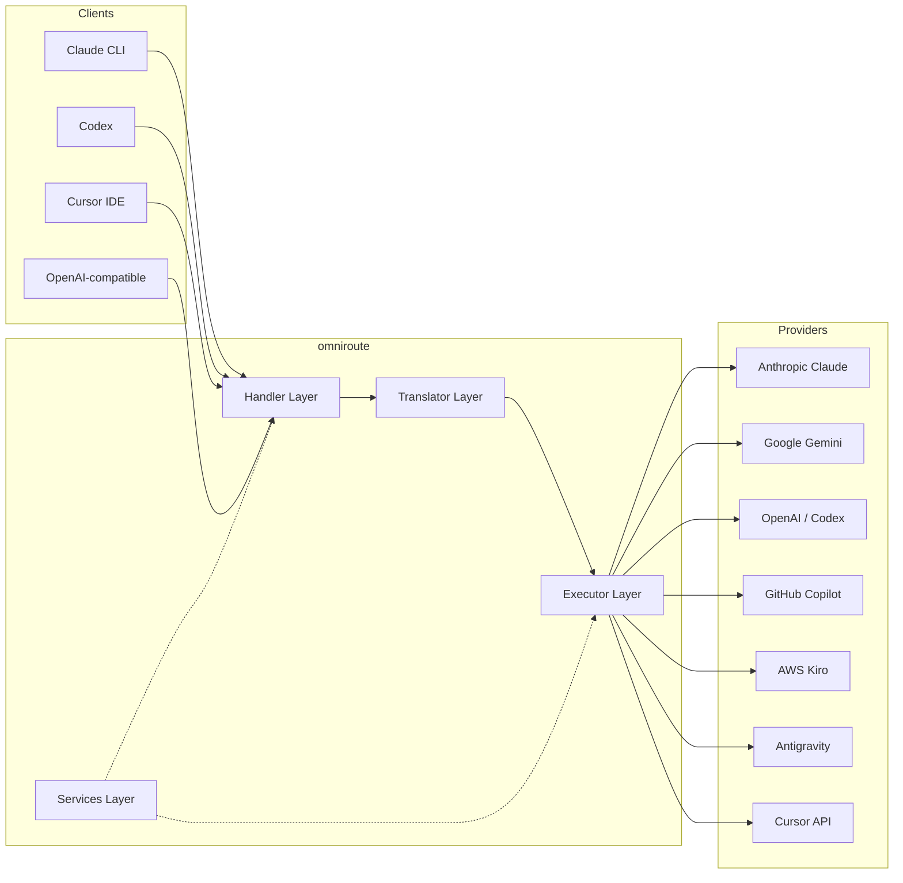
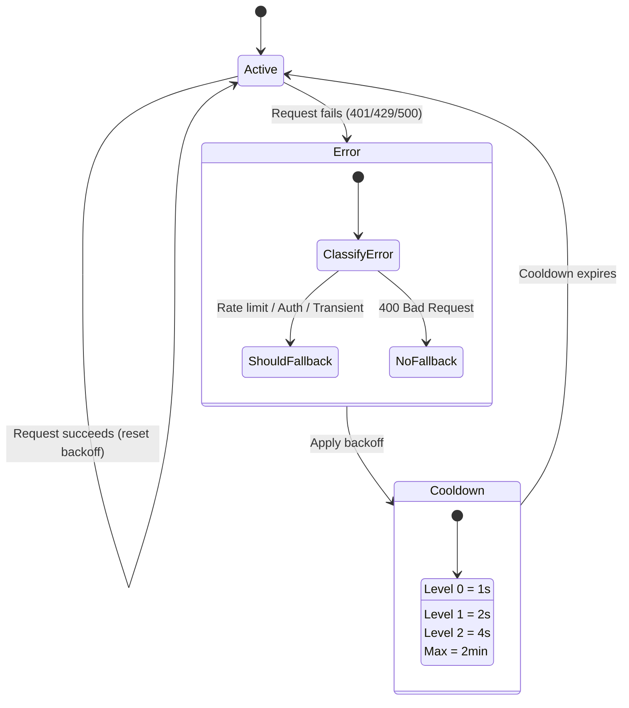
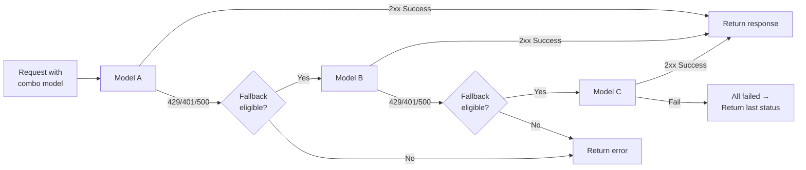
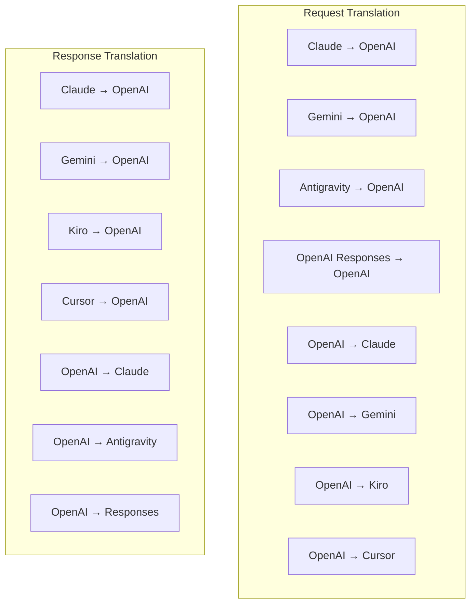
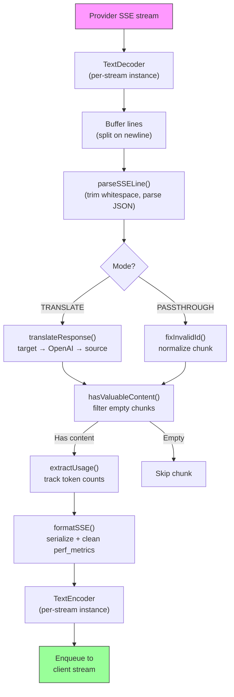
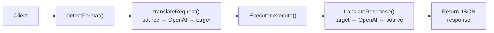
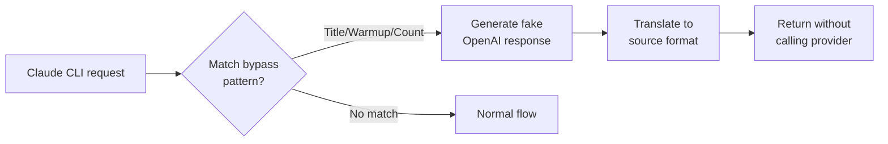

# omniroute — Codebase Documentation (Magyar)

🌐 **Languages:** 🇺🇸 [English](../../../../docs/CODEBASE_DOCUMENTATION.md) · 🇪🇸 [es](../../es/docs/CODEBASE_DOCUMENTATION.md) · 🇫🇷 [fr](../../fr/docs/CODEBASE_DOCUMENTATION.md) · 🇩🇪 [de](../../de/docs/CODEBASE_DOCUMENTATION.md) · 🇮🇹 [it](../../it/docs/CODEBASE_DOCUMENTATION.md) · 🇷🇺 [ru](../../ru/docs/CODEBASE_DOCUMENTATION.md) · 🇨🇳 [zh-CN](../../zh-CN/docs/CODEBASE_DOCUMENTATION.md) · 🇯🇵 [ja](../../ja/docs/CODEBASE_DOCUMENTATION.md) · 🇰🇷 [ko](../../ko/docs/CODEBASE_DOCUMENTATION.md) · 🇸🇦 [ar](../../ar/docs/CODEBASE_DOCUMENTATION.md) · 🇮🇳 [hi](../../hi/docs/CODEBASE_DOCUMENTATION.md) · 🇮🇳 [in](../../in/docs/CODEBASE_DOCUMENTATION.md) · 🇹🇭 [th](../../th/docs/CODEBASE_DOCUMENTATION.md) · 🇻🇳 [vi](../../vi/docs/CODEBASE_DOCUMENTATION.md) · 🇮🇩 [id](../../id/docs/CODEBASE_DOCUMENTATION.md) · 🇲🇾 [ms](../../ms/docs/CODEBASE_DOCUMENTATION.md) · 🇳🇱 [nl](../../nl/docs/CODEBASE_DOCUMENTATION.md) · 🇵🇱 [pl](../../pl/docs/CODEBASE_DOCUMENTATION.md) · 🇸🇪 [sv](../../sv/docs/CODEBASE_DOCUMENTATION.md) · 🇳🇴 [no](../../no/docs/CODEBASE_DOCUMENTATION.md) · 🇩🇰 [da](../../da/docs/CODEBASE_DOCUMENTATION.md) · 🇫🇮 [fi](../../fi/docs/CODEBASE_DOCUMENTATION.md) · 🇵🇹 [pt](../../pt/docs/CODEBASE_DOCUMENTATION.md) · 🇷🇴 [ro](../../ro/docs/CODEBASE_DOCUMENTATION.md) · 🇭🇺 [hu](../../hu/docs/CODEBASE_DOCUMENTATION.md) · 🇧🇬 [bg](../../bg/docs/CODEBASE_DOCUMENTATION.md) · 🇸🇰 [sk](../../sk/docs/CODEBASE_DOCUMENTATION.md) · 🇺🇦 [uk-UA](../../uk-UA/docs/CODEBASE_DOCUMENTATION.md) · 🇮🇱 [he](../../he/docs/CODEBASE_DOCUMENTATION.md) · 🇵🇭 [phi](../../phi/docs/CODEBASE_DOCUMENTATION.md) · 🇧🇷 [pt-BR](../../pt-BR/docs/CODEBASE_DOCUMENTATION.md) · 🇨🇿 [cs](../../cs/docs/CODEBASE_DOCUMENTATION.md) · 🇹🇷 [tr](../../tr/docs/CODEBASE_DOCUMENTATION.md)

---

> Átfogó, kezdőbarát útmutató az**omniroute**több szolgáltató AI-proxy routeréhez.---

## 1. What Is omniroute?

Az omniroute egy**proxy router**, amely AI kliensek (Claude CLI, Codex, Cursor IDE stb.) és mesterséges intelligenciaszolgáltatók (Anthropic, Google, OpenAI, AWS, GitHub stb.) között helyezkedik el. Egy nagy problémát old meg:

> **A különböző AI-kliensek különböző „nyelveket” (API-formátumokat) beszélnek, és a különböző AI-szolgáltatók is eltérő „nyelveket” várnak el.**Az omniroute automatikusan lefordítja őket.

Tekints úgy, mint egy univerzális fordító az Egyesült Nemzetek Szervezetében – minden küldött bármilyen nyelven beszélhet, és a fordító bármely más küldött számára átalakítja.---

## 2. Architecture Overview



### Core Principle: Hub-and-Spoke Translation

Minden formátumfordítás átmegy az**OpenAI formátumon, mint központon**:```
Client Format → [OpenAI Hub] → Provider Format (request)
Provider Format → [OpenAI Hub] → Client Format (response)

```

Ez azt jelenti, hogy csak**N fordítóra**(formátumonként egy) van szüksége a**N²**(minden pár) helyett.---

## 3. Project Structure

```

omniroute/
├── open-sse/ ← Core proxy library (portable, framework-agnostic)
│ ├── index.js ← Main entry point, exports everything
│ ├── config/ ← Configuration & constants
│ ├── executors/ ← Provider-specific request execution
│ ├── handlers/ ← Request handling orchestration
│ ├── services/ ← Business logic (auth, models, fallback, usage)
│ ├── translator/ ← Format translation engine
│ │ ├── request/ ← Request translators (8 files)
│ │ ├── response/ ← Response translators (7 files)
│ │ └── helpers/ ← Shared translation utilities (6 files)
│ └── utils/ ← Utility functions
├── src/ ← Application layer (Express/Worker runtime)
│ ├── app/ ← Web UI, API routes, middleware
│ ├── lib/ ← Database, auth, and shared library code
│ ├── mitm/ ← Man-in-the-middle proxy utilities
│ ├── models/ ← Database models
│ ├── shared/ ← Shared utilities (wrappers around open-sse)
│ ├── sse/ ← SSE endpoint handlers
│ └── store/ ← State management
├── data/ ← Runtime data (credentials, logs)
│ └── provider-credentials.json (external credentials override, gitignored)
└── tester/ ← Test utilities

````

---

## 4. Module-by-Module Breakdown

### 4.1 Config (`open-sse/config/`)

Az**egyetlen igazságforrás**minden szolgáltatói konfigurációhoz.

| Fájl | Cél |
| ------------------------------ | --------------------------------------------------------------------------------------------------- ---------------------------------------------------------------------------------------------------- |
| `állandók.ts` | `PROVIDERS' objektum alap URL-ekkel, OAuth hitelesítési adatokkal (alapértelmezett), fejlécekkel és alapértelmezett rendszerkérdésekkel minden szolgáltatóhoz. Meghatározza a `HTTP_STATUS`, `ERROR_TYPES`, `COOLDOWN_MS`, `BACKOFF_CONFIG` és `SKIP_PATTERNS-t is. |
| `credentialLoader.ts` | Betölti a külső hitelesítő adatokat a "data/provider-credentials.json" fájlból, és egyesíti őket a "SZOLGÁLTATÓK" merevkódolt alapértékei között. Kizárja a titkokat a forrás ellenőrzése alól, miközben fenntartja a visszafelé kompatibilitást.               |
| `providerModels.ts`           | Központi modellnyilvántartás: térképszolgáltatói álnevek → modellazonosítók. Olyan függvények, mint a "getModels()", "getProviderByAlias()".                                                                                                          |
| `codexInstructions.ts` | A Codex kérésekbe beszúrt rendszerutasítások (szerkesztési megszorítások, sandbox-szabályok, jóváhagyási szabályzatok).                                                                                                                 |
| `defaultThinkingSignature.ts` | Claude és Gemini modellek alapértelmezett "gondolkodó" aláírásai.                                                                                                                                                               |
| `ollamaModels.ts` | Sémadefiníció helyi Ollama modellekhez (név, méret, család, kvantálás).                                                                                                                                             |#### Credential Loading Flow

```mermaid
flowchart TD
    A["App starts"] --> B["constants.ts defines PROVIDERS\nwith hardcoded defaults"]
    B --> C{"data/provider-credentials.json\nexists?"}
    C -->|Yes| D["credentialLoader reads JSON"]
    C -->|No| E["Use hardcoded defaults"]
    D --> F{"For each provider in JSON"}
    F --> G{"Provider exists\nin PROVIDERS?"}
    G -->|No| H["Log warning, skip"]
    G -->|Yes| I{"Value is object?"}
    I -->|No| J["Log warning, skip"]
    I -->|Yes| K["Merge clientId, clientSecret,\ntokenUrl, authUrl, refreshUrl"]
    K --> F
    H --> F
    J --> F
    F -->|Done| L["PROVIDERS ready with\nmerged credentials"]
    E --> L
````

---

### 4.2 Executors (`open-sse/executors/`)

A végrehajtók a**szolgáltató-specifikus logikát**a**stratégiai minta**segítségével foglalják magukba. Minden végrehajtó szükség szerint felülírja az alapmetódusokat.```mermaid
classDiagram
class BaseExecutor {
+buildUrl(model, stream, options)
+buildHeaders(credentials, stream, body)
+transformRequest(body, model, stream, credentials)
+execute(url, options)
+shouldRetry(status, error)
+refreshCredentials(credentials, log)
}

    class DefaultExecutor {
        +refreshCredentials()
    }

    class AntigravityExecutor {
        +buildUrl()
        +buildHeaders()
        +transformRequest()
        +shouldRetry()
        +refreshCredentials()
    }

    class CursorExecutor {
        +buildUrl()
        +buildHeaders()
        +transformRequest()
        +parseResponse()
        +generateChecksum()
    }

    class KiroExecutor {
        +buildUrl()
        +buildHeaders()
        +transformRequest()
        +parseEventStream()
        +refreshCredentials()
    }

    BaseExecutor <|-- DefaultExecutor
    BaseExecutor <|-- AntigravityExecutor
    BaseExecutor <|-- CursorExecutor
    BaseExecutor <|-- KiroExecutor
    BaseExecutor <|-- CodexExecutor
    BaseExecutor <|-- GeminiCLIExecutor
    BaseExecutor <|-- GithubExecutor

````

| Végrehajtó | Szolgáltató | Legfontosabb szakterületek |
| ----------------- | ------------------------------------------- | ----------------------------------------------------------------------------------------------------- |
| `base.ts` | — | Absztrakt alap: URL-építés, fejlécek, újrapróbálkozási logika, hitelesítő adatok frissítése |
| `default.ts` | Claude, Gemini, OpenAI, GLM, Kimi, MiniMax | Általános OAuth-token frissítés szabványos szolgáltatók számára |
| `antigravitáció.ts` | Google Cloud Code | Projekt/munkamenet azonosító generálása, több URL-es tartalék, egyéni újrapróbálkozás a hibaüzenetekből ("visszaállítás 2h7m23s után") |
| `kurzor.ts` | Kurzor IDE |**Legösszetettebb**: SHA-256 ellenőrzőösszeg hitelesítés, Protobuf kéréskódolás, bináris EventStream → SSE válaszelemzés |
| `codex.ts` | OpenAI Codex | Rendszerutasításokat injektál, gondolkodási szinteket kezel, eltávolítja a nem támogatott paramétereket |
| `gemini-cli.ts` | Google Gemini CLI | Egyéni URL-építés (`streamGenerateContent`), Google OAuth-token frissítése |
| `github.ts` | GitHub másodpilóta | Kettős token rendszer (GitHub OAuth + másodpilóta token), VSCode fejléc utánzás |
| `kiro.ts` | AWS CodeWhisperer | AWS EventStream bináris elemzés, AMZN eseménykeretek, token becslés |
| "index.ts" | — | Gyári: térképszolgáltató neve → végrehajtó osztály, alapértelmezett tartalék |---

### 4.3 Handlers (`open-sse/handlers/`)

A**hangszerelési réteg**— koordinálja a fordítást, a végrehajtást, a streamelést és a hibakezelést.

| Fájl | Cél |
| ---------------------- | ---------------------------------------------------------------------------------------------------- ---------------------------------------------------------------------------------------------------- |
| `chatCore.ts` |**Központi hangszerelő**(~600 sor). Kezeli a teljes kérés életciklust: formátumészlelés → fordítás → végrehajtó feladása → streaming/nem streaming válasz → token frissítés → hibakezelés → használati naplózás. |
| `responsesHandler.ts` | Adapter az OpenAI Responses API-jához: átalakítja a válaszformátumot → Chat Completions → elküldi a `chatCore-nak` → visszakonvertálja az SSE-t válaszformátumba.                                                                        |
| `beágyazások.ts` | Beágyazás generációs kezelő: feloldja a beágyazási modellt → szolgáltató, elküldi a szolgáltató API-nak, visszaküldi az OpenAI-kompatibilis beágyazási választ. 6+ szolgáltatót támogat.                                                    |
| `imageGeneration.ts` | Képgeneráló kezelő: feloldja a képmodell → szolgáltatót, támogatja az OpenAI-kompatibilis, a Gemini-image (Antigravitáció) és a tartalék (Nebius) módokat. A base64 vagy URL képeket adja vissza.                                          |#### Request Lifecycle (chatCore.ts)

```mermaid
sequenceDiagram
    participant Client
    participant chatCore
    participant Translator
    participant Executor
    participant Provider

    Client->>chatCore: Request (any format)
    chatCore->>chatCore: Detect source format
    chatCore->>chatCore: Check bypass patterns
    chatCore->>chatCore: Resolve model & provider
    chatCore->>Translator: Translate request (source → OpenAI → target)
    chatCore->>Executor: Get executor for provider
    Executor->>Executor: Build URL, headers, transform request
    Executor->>Executor: Refresh credentials if needed
    Executor->>Provider: HTTP fetch (streaming or non-streaming)

    alt Streaming
        Provider-->>chatCore: SSE stream
        chatCore->>chatCore: Pipe through SSE transform stream
        Note over chatCore: Transform stream translates<br/>each chunk: target → OpenAI → source
        chatCore-->>Client: Translated SSE stream
    else Non-streaming
        Provider-->>chatCore: JSON response
        chatCore->>Translator: Translate response
        chatCore-->>Client: Translated JSON
    end

    alt Error (401, 429, 500...)
        chatCore->>Executor: Retry with credential refresh
        chatCore->>chatCore: Account fallback logic
    end
````

---

### 4.4 Services (`open-sse/services/`)

| Üzleti logika, amely támogatja a kezelőket és a végrehajtókat. | File                                                                                                                                                                                                                                                                                                                                   | Purpose |
| -------------------------------------------------------------- | -------------------------------------------------------------------------------------------------------------------------------------------------------------------------------------------------------------------------------------------------------------------------------------------------------------------------------------- | ------- |
| `provider.ts`                                                  | **Format detection** (`detectFormat`): analyzes request body structure to identify Claude/OpenAI/Gemini/Antigravity/Responses formats (includes `max_tokens` heuristic for Claude). Also: URL building, header building, thinking config normalization. Supports `openai-compatible-*` and `anthropic-compatible-*` dynamic providers. |
| `model.ts`                                                     | Model string parsing (`claude/model-name` → `{provider: "claude", model: "model-name"}`), alias resolution with collision detection, input sanitization (rejects path traversal/control chars), and model info resolution with async alias getter support.                                                                             |
| `accountFallback.ts`                                           | Rate-limit handling: exponential backoff (1s → 2s → 4s → max 2min), account cooldown management, error classification (which errors trigger fallback vs. not).                                                                                                                                                                         |
| `tokenRefresh.ts`                                              | OAuth token refresh for **every provider**: Google (Gemini, Antigravity), Claude, Codex, Qwen, Qoder, GitHub (OAuth + Copilot dual-token), Kiro (AWS SSO OIDC + Social Auth). Includes in-flight promise deduplication cache and retry with exponential backoff.                                                                       |
| `combo.ts`                                                     | **Combo models**: chains of fallback models. If model A fails with a fallback-eligible error, try model B, then C, etc. Returns actual upstream status codes.                                                                                                                                                                          |
| `usage.ts`                                                     | Fetches quota/usage data from provider APIs (GitHub Copilot quotas, Antigravity model quotas, Codex rate limits, Kiro usage breakdowns, Claude settings).                                                                                                                                                                              |
| `accountSelector.ts`                                           | Smart account selection with scoring algorithm: considers priority, health status, round-robin position, and cooldown state to pick the optimal account for each request.                                                                                                                                                              |
| `contextManager.ts`                                            | Request context lifecycle management: creates and tracks per-request context objects with metadata (request ID, timestamps, provider info) for debugging and logging.                                                                                                                                                                  |
| `ipFilter.ts`                                                  | IP-based access control: supports allowlist and blocklist modes. Validates client IP against configured rules before processing API requests.                                                                                                                                                                                          |
| `sessionManager.ts`                                            | Session tracking with client fingerprinting: tracks active sessions using hashed client identifiers, monitors request counts, and provides session metrics.                                                                                                                                                                            |
| `signatureCache.ts`                                            | Request signature-based deduplication cache: prevents duplicate requests by caching recent request signatures and returning cached responses for identical requests within a time window.                                                                                                                                              |
| `systemPrompt.ts`                                              | Global system prompt injection: prepends or appends a configurable system prompt to all requests, with per-provider compatibility handling.                                                                                                                                                                                            |
| `thinkingBudget.ts`                                            | Reasoning token budget management: supports passthrough, auto (strip thinking config), custom (fixed budget), and adaptive (complexity-scaled) modes for controlling thinking/reasoning tokens.                                                                                                                                        |
| `wildcardRouter.ts`                                            | Wildcard model pattern routing: resolves wildcard patterns (e.g., `*/claude-*`) to concrete provider/model pairs based on availability and priority.                                                                                                                                                                                   |

#### Token Refresh Deduplication

```mermaid
sequenceDiagram
    participant R1 as Request 1
    participant R2 as Request 2
    participant Cache as refreshPromiseCache
    participant OAuth as OAuth Provider

    R1->>Cache: getAccessToken("gemini", token)
    Cache->>Cache: No in-flight promise
    Cache->>OAuth: Start refresh
    R2->>Cache: getAccessToken("gemini", token)
    Cache->>Cache: Found in-flight promise
    Cache-->>R2: Return existing promise
    OAuth-->>Cache: New access token
    Cache-->>R1: New access token
    Cache-->>R2: Same access token (shared)
    Cache->>Cache: Delete cache entry
```

#### Account Fallback State Machine



#### Combo Model Chain



---

### 4.5 Translator (`open-sse/translator/`)

A**formátumfordító motor**egy önregisztráló bővítményrendszerrel.#### Architektúra



| Címtár          | Fájlok    | Leírás                                                                                                                                                                                                                                                                                  |
| --------------- | --------- | --------------------------------------------------------------------------------------------------------------------------------------------------------------------------------------------------------------------------------------------------------------------------------------- | ----------------------------------------- |
| `kérés/`        | 8 fordító | A kéréstörzsek átalakítása formátumok között. Az importáláskor minden fájl önregisztrálja a `register(from, to, fn)` paramétert.                                                                                                                                                        |
| `válasz/`       | 7 fordító | A streaming válaszdarabok konvertálása formátumok között. Kezeli az SSE eseménytípusokat, gondolkodási blokkokat, eszközhívásokat.                                                                                                                                                      |
| `segítők/`      | 6 segítő  | Megosztott segédprogramok: `claudeHelper` (rendszerkérdések kibontása, gondolkodási konfiguráció), `geminiHelper` (alkatrészek/tartalom-leképezés), `openaiHelper` (formátumszűrés), `toolCallHelper` (azonosító generálása, hiányzó válasz injekció), `maxTokensHelper`, `ApiHelperes. |
| "index.ts"      | —         | Fordítómotor: "translateRequest()", "translateResponse()", állapotkezelés, nyilvántartás.                                                                                                                                                                                               |
| `formátumok.ts` | —         | Formátumkonstansok: „OPENAI”, „CLAUDE”, „GEMINI”, „ANTIGRAVITY”, „KIRO”, „CURSOR”, „OPENAI_RESPONSES”.                                                                                                                                                                                  | #### Key Design: Self-Registering Plugins |

```javascript
// Each translator file calls register() on import:
import { register } from "../index.js";
register("claude", "openai", translateClaudeToOpenAI);

// The index.js imports all translator files, triggering registration:
import "./request/claude-to-openai.js"; // ← self-registers
```

---

### 4.6 Utils (`open-sse/utils/`)

| Fájl               | Cél                                                                                                                                                                                                                                                                                                                              |
| ------------------ | -------------------------------------------------------------------------------------------------------------------------------------------------------------------------------------------------------------------------------------------------------------------------------------------------------------------------------- | --------------------------- |
| `hiba.ts`          | Hibaválasz kiépítése (OpenAI-kompatibilis formátum), felfelé irányuló hibaelemzés, Antigravitációs újrapróbálkozási idő kivonat a hibaüzenetekből, SSE hibaadatfolyam.                                                                                                                                                           |
| `folyam.ts`        | **SSE Transform Stream**– a mag adatfolyam-folyamat. Két mód: „TRANSLATE” (teljes formátumú fordítás) és „PASSTHROUGH” (használat normalizálása + kivonat). Kezeli a darabok pufferelését, a felhasználás becslését, a tartalom hosszának követését. A folyamonkénti kódoló/dekódoló példányok elkerülik a megosztott állapotot. |
| `streamHelpers.ts` | Alacsony szintű SSE-segédprogramok: `parseSSELine` (szóköztűrő), `hasValuableContent` (üres darabokat szűr az OpenAI/Claude/Gemini számára), `fixInvalidId`, `formatSSE` (formátum-tudatos SSE szerializálás a `perf_metrics` paraméterrel).                                                                                     |
| `usageTracking.ts` | Tokenhasználati kinyerés bármilyen formátumból (Claude/OpenAI/Gemini/Responses), becslés külön eszköz/üzenet char-per-token arányokkal, puffer hozzáadása (2000 token biztonsági ráhagyás), formátum-specifikus mezőszűrés, konzolnaplózás ANSI színekkel.                                                                       |
| `requestLogger.ts` | Legacy file-based request logging helper kept for compatibility. Current deployments should prefer `APP_LOG_TO_FILE` for application logs and the call log pipeline for persisted request artifacts.                                                                                                                             |
| `bypassHandler.ts` | Elfogja a Claude CLI meghatározott mintáit (címkivonás, bemelegítés, számlálás), és hamis válaszokat ad vissza anélkül, hogy bármelyik szolgáltatót is felhívná. Támogatja a streaminget és a nem adatfolyamot egyaránt. Szándékosan a Claude CLI hatókörére korlátozva.                                                         |
| `networkProxy.ts`  | Feloldja egy adott szolgáltató kimenő proxy URL-jét elsőbbséggel: szolgáltató-specifikus konfiguráció → globális konfiguráció → környezeti változók (`HTTPS_PROXY`/`HTTP_PROXY`/`ALL_PROXY`). Támogatja a „NO_PROXY” kizárásokat. Gyorsítótár konfiguráció 30 másodpercig.                                                       | #### SSE Streaming Pipeline |



#### Request Logger Session Structure

```
logs/
└── claude_gemini_claude-sonnet_20260208_143045/
    ├── 1_req_client.json      ← Raw client request
    ├── 2_req_source.json      ← After initial conversion
    ├── 3_req_openai.json      ← OpenAI intermediate format
    ├── 4_req_target.json      ← Final target format
    ├── 5_res_provider.txt     ← Provider SSE chunks (streaming)
    ├── 5_res_provider.json    ← Provider response (non-streaming)
    ├── 6_res_openai.txt       ← OpenAI intermediate chunks
    ├── 7_res_client.txt       ← Client-facing SSE chunks
    └── 6_error.json           ← Error details (if any)
```

---

### 4.7 Application Layer (`src/`)

| Címtár        | Cél                                                                                          |
| ------------- | -------------------------------------------------------------------------------------------- | ----------------------- |
| `src/app/`    | Webes felhasználói felület, API útvonalak, Express köztes szoftver, OAuth visszahíváskezelők |
| `src/lib/`    | Adatbázis-hozzáférés (`localDb.ts`, `usageDb.ts`), hitelesítés, megosztott                   |
| `src/mitm/`   | Man-in-the-middle proxy segédprogramok a szolgáltatói forgalom lehallgatásához               |
| `src/models/` | Adatbázismodell-definíciók                                                                   |
| `src/shared/` | Az open-sse függvények körüli burkolók (szolgáltató, adatfolyam, hiba stb.)                  |
| `src/sse/`    | SSE végpontkezelők, amelyek az open-sse könyvtárat az Express útvonalakhoz kötik             |
| `src/store/`  | Alkalmazás állapotkezelés                                                                    | #### Notable API Routes |

| Útvonal                                          | Módszerek       | Cél                                                                                                            |
| ------------------------------------------------ | --------------- | -------------------------------------------------------------------------------------------------------------- | --- |
| "/api/provider-models"                           | GET/POST/DELETE | CRUD egyedi modellekhez szolgáltatónként                                                                       |
| "/api/models/catalog"                            | GET             | Összesített katalógus az összes modellről (csevegés, beágyazás, kép, egyéni) szolgáltató szerint csoportosítva |
| "/api/settings/proxy"                            | GET/PUT/DELETE  | Hierarchikus kimenő proxykonfiguráció (`global/providers/combos/keys`)                                         |
| "/api/settings/proxy/test"                       | POST            | Ellenőrzi a proxy-kapcsolatot, és visszaadja a nyilvános IP-címet/latenciát                                    |
| "/v1/providers/[provider]/chat/completions"      | POST            | Dedikált szolgáltatónkénti csevegés-befejezések modellellenőrzéssel                                            |
| "/v1/providers/[szolgáltató]/beágyazások"        | POST            | Dedikált szolgáltatónkénti beágyazások modellellenőrzéssel                                                     |
| "/v1/providers/[szolgáltató]/images/generations" | POST            | Dedikált szolgáltatónkénti képgenerálás modellellenőrzéssel                                                    |
| `/api/settings/ip-filter`                        | GET/PUT         | IP engedélyezési lista/blokklista kezelése                                                                     |
| `/api/settings/thhinking-budget`                 | GET/PUT         | Indoklási token költségkeret-konfiguráció (passthrough/auto/custom/adaptative)                                 |
| `/api/settings/system-prompt`                    | GET/PUT         | Globális rendszer azonnali befecskendezése minden kérelemhez                                                   |
| "/api/munkamenetek"                              | GET             | Aktív munkamenet-követés és mérőszámok                                                                         |
| "/api/rate-limits"                               | GET             | számlánkénti kamatláb korlát állapota                                                                          | --- |

## 5. Key Design Patterns

### 5.1 Hub-and-Spoke Translation

Minden formátum az**OpenAI formátumon keresztül történik, mint a hub**. Új szolgáltató hozzáadásához csak**egy pár**fordítót kell írni (OpenAI-ra/OpenAI-ról), N párra nem.### 5.2 Executor Strategy Pattern

Minden szolgáltatónak van egy dedikált végrehajtó osztálya, amely a `BaseExecutortól' örökli. The factory in `executors/index.ts` selects the right one at runtime.### 5.3 Self-Registering Plugin System

A fordítómodulok regisztrálják magukat az importáláskor a "register()" segítségével. Új fordító hozzáadása csak egy fájl létrehozását és importálását jelenti.### 5.4 Account Fallback with Exponential Backoff

Amikor egy szolgáltató visszaadja a 429/401/500 számot, a rendszer átválthat a következő fiókra, exponenciális lehűtést alkalmazva (1 mp → 2 mp → 4 mp → max 2 perc).### 5.5 Combo Model Chains

A „kombó” több „szolgáltató/modell” karakterláncot csoportosít. Ha az első sikertelen, akkor automatikusan visszaáll a következőre.### 5.6 Stateful Streaming Translation

A válaszfordítás az "initState()" mechanizmuson keresztül fenntartja az állapotot az SSE-darabokon (gondolkodási blokk követése, eszközhívás-felhalmozás, tartalomblokk indexelése).### 5.7 Usage Safety Buffer

Egy 2000 tokenből álló puffert adunk a jelentett használathoz, hogy megakadályozzuk, hogy az ügyfelek elérjék a kontextusablak korlátait a rendszerkérések és a formátumfordítás miatti többletterhelés miatt.---

## 6. Supported Formats

| Formátum                | Irány        | Azonosító          |
| ----------------------- | ------------ | ------------------ | --- |
| OpenAI Chat befejezések | forrás + cél | "openai"           |
| OpenAI Responses API    | forrás + cél | "openai-responses" |
| Antropikus Claude       | forrás + cél | `claude`           |
| Google Gemini           | forrás + cél | "gemini"           |
| Google Gemini CLI       | csak cél     | `gemini-cli`       |
| Antigravitáció          | forrás + cél | "antigravitáció"   |
| AWS Kiro                | csak cél     | "kiro"             |
| Kurzor                  | csak cél     | "kurzor"           | --- |

## 7. Supported Providers

| Szolgáltató                 | Hitelesítési módszer        | Végrehajtó      | Főbb megjegyzések                                    |
| --------------------------- | --------------------------- | --------------- | ---------------------------------------------------- | --- |
| Antropikus Claude           | API-kulcs vagy OAuth        | Alapértelmezett | `x-api-key` fejlécet használ                         |
| Google Gemini               | API-kulcs vagy OAuth        | Alapértelmezett | Az "x-goog-api-key" fejlécet használja               |
| Google Gemini CLI           | OAuth                       | GeminiCLI       | A "streamGenerateContent" végpontot használja        |
| Antigravitáció              | OAuth                       | Antigravitáció  | Több URL-es tartalék, egyéni újrapróbálkozás         |
| OpenAI                      | API kulcs                   | Alapértelmezett | Normál hordozó hitelesítés                           |
| Codex                       | OAuth                       | Codex           | Rendszerutasításokat ad be, irányítja a gondolkodást |
| GitHub másodpilóta          | OAuth + másodpilóta token   | Github          | Kettős token, VSCode fejléc utánzás                  |
| Kiro (AWS)                  | AWS SSO OIDC vagy Social    | Kiro            | Bináris EventStream elemzés                          |
| Kurzor IDE                  | Ellenőrzőösszeg hitelesítés | Kurzor          | Protobuf kódolás, SHA-256 ellenőrző összegek         |
| Qwen                        | OAuth                       | Alapértelmezett | Normál hitelesítés                                   |
| Qoder                       | OAuth (alap + hordozó)      | Alapértelmezett | Kettős hitelesítési fejléc                           |
| OpenRouter                  | API kulcs                   | Alapértelmezett | Normál hordozó hitelesítés                           |
| GLM, Kimi, MiniMax          | API kulcs                   | Alapértelmezett | Claude-kompatibilis, használja az `x-api-key`        |
| `openai-kompatibilis-*`     | API kulcs                   | Alapértelmezett | Dinamikus: bármely OpenAI-kompatibilis végpont       |
| `antropikus-kompatibilis-*` | API kulcs                   | Alapértelmezett | Dinamikus: bármely Claude-kompatibilis végpont       | --- |

## 8. Data Flow Summary

### Streaming Request

```mermaid
flowchart LR
    A["Client"] --> B["detectFormat()"]
    B --> C["translateRequest()\nsource → OpenAI → target"]
    C --> D["Executor\nbuildUrl + buildHeaders"]
    D --> E["fetch(providerURL)"]
    E --> F["createSSEStream()\nTRANSLATE mode"]
    F --> G["parseSSELine()"]
    G --> H["translateResponse()\ntarget → OpenAI → source"]
    H --> I["extractUsage()\n+ addBuffer"]
    I --> J["formatSSE()"]
    J --> K["Client receives\ntranslated SSE"]
    K --> L["logUsage()\nsaveRequestUsage()"]
```



### Non-Streaming Request



### Bypass Flow (Claude CLI)


