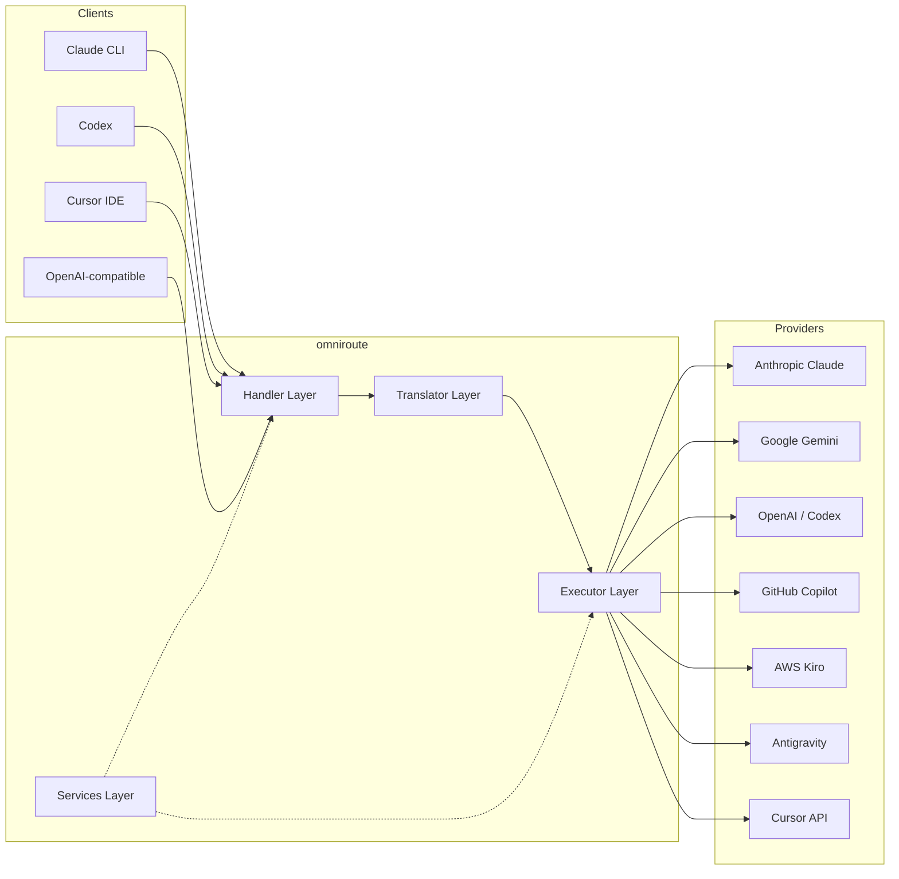
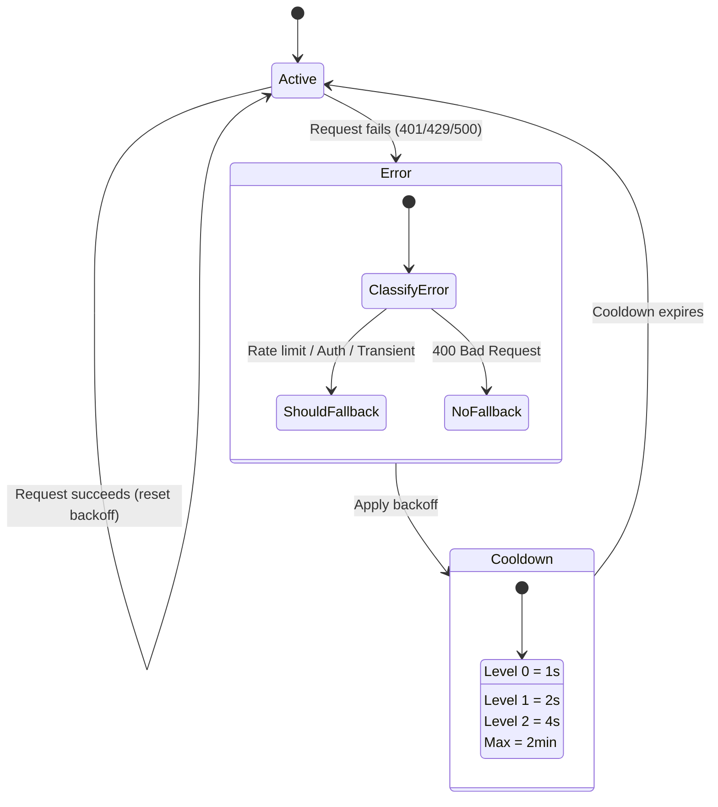
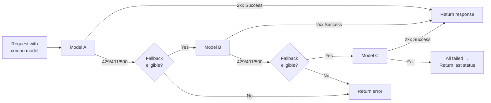
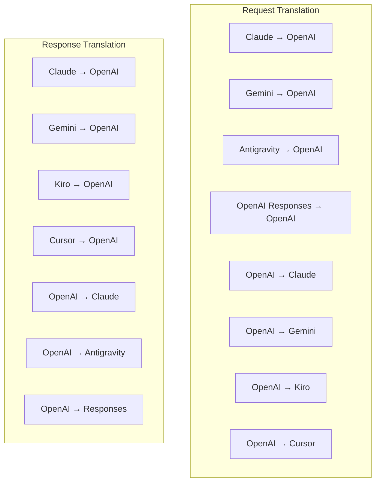
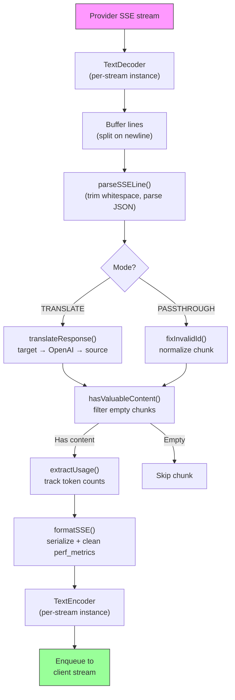
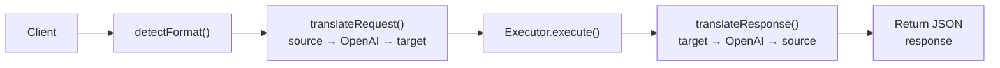
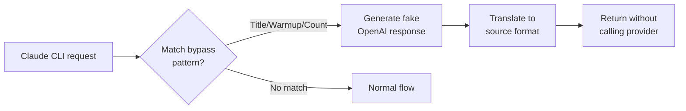

# omniroute — Codebase Documentation (Bahasa Indonesia)

🌐 **Languages:** 🇺🇸 [English](../../../../docs/CODEBASE_DOCUMENTATION.md) · 🇪🇸 [es](../../es/docs/CODEBASE_DOCUMENTATION.md) · 🇫🇷 [fr](../../fr/docs/CODEBASE_DOCUMENTATION.md) · 🇩🇪 [de](../../de/docs/CODEBASE_DOCUMENTATION.md) · 🇮🇹 [it](../../it/docs/CODEBASE_DOCUMENTATION.md) · 🇷🇺 [ru](../../ru/docs/CODEBASE_DOCUMENTATION.md) · 🇨🇳 [zh-CN](../../zh-CN/docs/CODEBASE_DOCUMENTATION.md) · 🇯🇵 [ja](../../ja/docs/CODEBASE_DOCUMENTATION.md) · 🇰🇷 [ko](../../ko/docs/CODEBASE_DOCUMENTATION.md) · 🇸🇦 [ar](../../ar/docs/CODEBASE_DOCUMENTATION.md) · 🇮🇳 [hi](../../hi/docs/CODEBASE_DOCUMENTATION.md) · 🇮🇳 [in](../../in/docs/CODEBASE_DOCUMENTATION.md) · 🇹🇭 [th](../../th/docs/CODEBASE_DOCUMENTATION.md) · 🇻🇳 [vi](../../vi/docs/CODEBASE_DOCUMENTATION.md) · 🇮🇩 [id](../../id/docs/CODEBASE_DOCUMENTATION.md) · 🇲🇾 [ms](../../ms/docs/CODEBASE_DOCUMENTATION.md) · 🇳🇱 [nl](../../nl/docs/CODEBASE_DOCUMENTATION.md) · 🇵🇱 [pl](../../pl/docs/CODEBASE_DOCUMENTATION.md) · 🇸🇪 [sv](../../sv/docs/CODEBASE_DOCUMENTATION.md) · 🇳🇴 [no](../../no/docs/CODEBASE_DOCUMENTATION.md) · 🇩🇰 [da](../../da/docs/CODEBASE_DOCUMENTATION.md) · 🇫🇮 [fi](../../fi/docs/CODEBASE_DOCUMENTATION.md) · 🇵🇹 [pt](../../pt/docs/CODEBASE_DOCUMENTATION.md) · 🇷🇴 [ro](../../ro/docs/CODEBASE_DOCUMENTATION.md) · 🇭🇺 [hu](../../hu/docs/CODEBASE_DOCUMENTATION.md) · 🇧🇬 [bg](../../bg/docs/CODEBASE_DOCUMENTATION.md) · 🇸🇰 [sk](../../sk/docs/CODEBASE_DOCUMENTATION.md) · 🇺🇦 [uk-UA](../../uk-UA/docs/CODEBASE_DOCUMENTATION.md) · 🇮🇱 [he](../../he/docs/CODEBASE_DOCUMENTATION.md) · 🇵🇭 [phi](../../phi/docs/CODEBASE_DOCUMENTATION.md) · 🇧🇷 [pt-BR](../../pt-BR/docs/CODEBASE_DOCUMENTATION.md) · 🇨🇿 [cs](../../cs/docs/CODEBASE_DOCUMENTATION.md) · 🇹🇷 [tr](../../tr/docs/CODEBASE_DOCUMENTATION.md)

---

> Panduan komprehensif dan mudah bagi pemula untuk router proxy AI multi-penyedia**omniroute**.---

## 1. What Is omniroute?

omniroute adalah**router proxy**yang berada di antara klien AI (Claude CLI, Codex, Cursor IDE, dll.) dan penyedia AI (Anthropic, Google, OpenAI, AWS, GitHub, dll.). Ini memecahkan satu masalah besar:

> **Klien AI yang berbeda menggunakan "bahasa" (format API) yang berbeda, dan penyedia AI yang berbeda juga mengharapkan "bahasa" yang berbeda.**omniroute menerjemahkan bahasa tersebut secara otomatis.

Anggap saja seperti penerjemah universal di Perserikatan Bangsa-Bangsa — setiap delegasi dapat berbicara dalam bahasa apa pun, dan penerjemah tersebut mengonversikannya untuk delegasi lainnya.---

## 2. Architecture Overview



### Core Principle: Hub-and-Spoke Translation

Semua terjemahan format melewati**format OpenAI sebagai hub**:```
Client Format → [OpenAI Hub] → Provider Format (request)
Provider Format → [OpenAI Hub] → Client Format (response)

```

Artinya, Anda hanya memerlukan**N penerjemah**(satu per format) dan bukan**N²**(setiap pasangan).---

## 3. Project Structure

```

omniroute/
├── open-sse/ ← Core proxy library (portable, framework-agnostic)
│ ├── index.js ← Main entry point, exports everything
│ ├── config/ ← Configuration & constants
│ ├── executors/ ← Provider-specific request execution
│ ├── handlers/ ← Request handling orchestration
│ ├── services/ ← Business logic (auth, models, fallback, usage)
│ ├── translator/ ← Format translation engine
│ │ ├── request/ ← Request translators (8 files)
│ │ ├── response/ ← Response translators (7 files)
│ │ └── helpers/ ← Shared translation utilities (6 files)
│ └── utils/ ← Utility functions
├── src/ ← Application layer (Express/Worker runtime)
│ ├── app/ ← Web UI, API routes, middleware
│ ├── lib/ ← Database, auth, and shared library code
│ ├── mitm/ ← Man-in-the-middle proxy utilities
│ ├── models/ ← Database models
│ ├── shared/ ← Shared utilities (wrappers around open-sse)
│ ├── sse/ ← SSE endpoint handlers
│ └── store/ ← State management
├── data/ ← Runtime data (credentials, logs)
│ └── provider-credentials.json (external credentials override, gitignored)
└── tester/ ← Test utilities

````

---

## 4. Module-by-Module Breakdown

### 4.1 Config (`open-sse/config/`)

**Satu-satunya sumber kebenaran**untuk semua konfigurasi penyedia.

| Berkas | Tujuan |
| ----------------------------- | ----------------------------------------------------------------------------------------------------------------------------------------------------------------------------------------------------------- |
| `konstanta.ts` | Objek `PROVIDERS` dengan URL dasar, kredensial OAuth (default), header, dan perintah sistem default untuk setiap penyedia. Juga mendefinisikan `HTTP_STATUS`, `ERROR_TYPES`, `COOLDOWN_MS`, `BACKOFF_CONFIG`, dan `SKIP_PATTERNS`. |
| `credentialLoader.ts` | Memuat kredensial eksternal dari `data/provider-credentials.json` dan menggabungkannya dengan default hardcode di `PROVIDERS`. Menjaga rahasia di luar kendali sumber sambil menjaga kompatibilitas ke belakang.               |
| `providerModels.ts` | Registri model pusat: alias penyedia peta → ID model. Fungsi seperti `getModels()`, `getProviderByAlias()`.                                                                                                          |
| `codexInstructions.ts` | Instruksi sistem dimasukkan ke dalam permintaan Codex (batasan pengeditan, aturan sandbox, kebijakan persetujuan).                                                                                                                 |
| `defaultThinkingSignature.ts` | Tanda tangan "berpikir" default untuk model Claude dan Gemini.                                                                                                                                                               |
| `ollamaModels.ts` | Definisi skema untuk model Ollama lokal (nama, ukuran, keluarga, kuantisasi).                                                                                                                                             |#### Credential Loading Flow

```mermaid
flowchart TD
    A["App starts"] --> B["constants.ts defines PROVIDERS\nwith hardcoded defaults"]
    B --> C{"data/provider-credentials.json\nexists?"}
    C -->|Yes| D["credentialLoader reads JSON"]
    C -->|No| E["Use hardcoded defaults"]
    D --> F{"For each provider in JSON"}
    F --> G{"Provider exists\nin PROVIDERS?"}
    G -->|No| H["Log warning, skip"]
    G -->|Yes| I{"Value is object?"}
    I -->|No| J["Log warning, skip"]
    I -->|Yes| K["Merge clientId, clientSecret,\ntokenUrl, authUrl, refreshUrl"]
    K --> F
    H --> F
    J --> F
    F -->|Done| L["PROVIDERS ready with\nmerged credentials"]
    E --> L
````

---

### 4.2 Executors (`open-sse/executors/`)

Pelaksana merangkum**logika khusus penyedia**menggunakan**Pola Strategi**. Setiap pelaksana mengganti metode dasar sesuai kebutuhan.```mermaid
classDiagram
class BaseExecutor {
+buildUrl(model, stream, options)
+buildHeaders(credentials, stream, body)
+transformRequest(body, model, stream, credentials)
+execute(url, options)
+shouldRetry(status, error)
+refreshCredentials(credentials, log)
}

    class DefaultExecutor {
        +refreshCredentials()
    }

    class AntigravityExecutor {
        +buildUrl()
        +buildHeaders()
        +transformRequest()
        +shouldRetry()
        +refreshCredentials()
    }

    class CursorExecutor {
        +buildUrl()
        +buildHeaders()
        +transformRequest()
        +parseResponse()
        +generateChecksum()
    }

    class KiroExecutor {
        +buildUrl()
        +buildHeaders()
        +transformRequest()
        +parseEventStream()
        +refreshCredentials()
    }

    BaseExecutor <|-- DefaultExecutor
    BaseExecutor <|-- AntigravityExecutor
    BaseExecutor <|-- CursorExecutor
    BaseExecutor <|-- KiroExecutor
    BaseExecutor <|-- CodexExecutor
    BaseExecutor <|-- GeminiCLIExecutor
    BaseExecutor <|-- GithubExecutor

````

| Pelaksana | Penyedia | Spesialisasi Utama |
| ---------------- | ------------------------------------------ | ------------------------------------------------------------------------------------------------------------------- |
| `base.ts` | — | Basis abstrak: Pembuatan URL, header, logika coba lagi, penyegaran kredensial |
| `default.ts` | Claude, Gemini, OpenAI, GLM, Kimi, MiniMax | Penyegaran token OAuth generik untuk penyedia standar |
| `antigravitasi.ts` | Kode Google Cloud | Pembuatan ID proyek/sesi, penggantian multi-URL, penguraian coba ulang khusus dari pesan kesalahan ("reset setelah 2h7m23s") |
| `kursor.ts` | IDE Kursor |**Paling rumit**: autentikasi checksum SHA-256, pengkodean permintaan Protobuf, biner EventStream → penguraian respons SSE |
| `codex.ts` | Kodeks OpenAI | Menyuntikkan instruksi sistem, mengelola tingkat pemikiran, menghapus parameter yang tidak didukung |
| `gemini-kli.ts` | CLI Google Gemini | Pembuatan URL khusus (`streamGenerateContent`), penyegaran token Google OAuth |
| `github.ts` | Kopilot GitHub | Sistem token ganda (GitHub OAuth + token Copilot), header VSCode meniru |
| `kiro.ts` | AWS CodeWhisperer | Penguraian biner AWS EventStream, bingkai peristiwa AMZN, estimasi token |
| `indeks.ts` | — | Pabrik: nama penyedia peta → kelas pelaksana, dengan fallback default |---

### 4.3 Handlers (`open-sse/handlers/`)

**Lapisan orkestrasi**— mengoordinasikan terjemahan, eksekusi, streaming, dan penanganan kesalahan.

| Berkas | Tujuan |
| --------------------- | ------------------------------------------------------------------------------------------------------------------------------------------------------------------------------------------- |
| `chatCore.ts` |**Orkestra pusat**(~600 baris). Menangani siklus hidup permintaan secara lengkap: deteksi format → terjemahan → pengiriman pelaksana → respons streaming/non-streaming → penyegaran token → penanganan kesalahan → pencatatan penggunaan. |
| `responsesHandler.ts` | Adaptor untuk API Respons OpenAI: mengonversi format Respons → Penyelesaian Obrolan → mengirim ke `chatCore` → mengonversi SSE kembali ke format Respons.                                                                        |
| `embeddings.ts` | Penangan generasi penyematan: menyelesaikan model penyematan → penyedia, mengirimkan ke API penyedia, mengembalikan respons penyematan yang kompatibel dengan OpenAI. Mendukung 6+ penyedia.                                                    |
| `imageGeneration.ts` | Pengendali pembuatan gambar: menyelesaikan model gambar → penyedia, mendukung mode yang kompatibel dengan OpenAI, gambar Gemini (Antigravity), dan fallback (Nebius). Mengembalikan gambar base64 atau URL.                                          |#### Request Lifecycle (chatCore.ts)

```mermaid
sequenceDiagram
    participant Client
    participant chatCore
    participant Translator
    participant Executor
    participant Provider

    Client->>chatCore: Request (any format)
    chatCore->>chatCore: Detect source format
    chatCore->>chatCore: Check bypass patterns
    chatCore->>chatCore: Resolve model & provider
    chatCore->>Translator: Translate request (source → OpenAI → target)
    chatCore->>Executor: Get executor for provider
    Executor->>Executor: Build URL, headers, transform request
    Executor->>Executor: Refresh credentials if needed
    Executor->>Provider: HTTP fetch (streaming or non-streaming)

    alt Streaming
        Provider-->>chatCore: SSE stream
        chatCore->>chatCore: Pipe through SSE transform stream
        Note over chatCore: Transform stream translates<br/>each chunk: target → OpenAI → source
        chatCore-->>Client: Translated SSE stream
    else Non-streaming
        Provider-->>chatCore: JSON response
        chatCore->>Translator: Translate response
        chatCore-->>Client: Translated JSON
    end

    alt Error (401, 429, 500...)
        chatCore->>Executor: Retry with credential refresh
        chatCore->>chatCore: Account fallback logic
    end
````

---

### 4.4 Services (`open-sse/services/`)

| Logika bisnis yang mendukung penangan dan pelaksana. | File                                                                                                                                                                                                                                                                                                                                   | Purpose |
| ---------------------------------------------------- | -------------------------------------------------------------------------------------------------------------------------------------------------------------------------------------------------------------------------------------------------------------------------------------------------------------------------------------- | ------- |
| `provider.ts`                                        | **Format detection** (`detectFormat`): analyzes request body structure to identify Claude/OpenAI/Gemini/Antigravity/Responses formats (includes `max_tokens` heuristic for Claude). Also: URL building, header building, thinking config normalization. Supports `openai-compatible-*` and `anthropic-compatible-*` dynamic providers. |
| `model.ts`                                           | Model string parsing (`claude/model-name` → `{provider: "claude", model: "model-name"}`), alias resolution with collision detection, input sanitization (rejects path traversal/control chars), and model info resolution with async alias getter support.                                                                             |
| `accountFallback.ts`                                 | Rate-limit handling: exponential backoff (1s → 2s → 4s → max 2min), account cooldown management, error classification (which errors trigger fallback vs. not).                                                                                                                                                                         |
| `tokenRefresh.ts`                                    | OAuth token refresh for **every provider**: Google (Gemini, Antigravity), Claude, Codex, Qwen, Qoder, GitHub (OAuth + Copilot dual-token), Kiro (AWS SSO OIDC + Social Auth). Includes in-flight promise deduplication cache and retry with exponential backoff.                                                                       |
| `combo.ts`                                           | **Combo models**: chains of fallback models. If model A fails with a fallback-eligible error, try model B, then C, etc. Returns actual upstream status codes.                                                                                                                                                                          |
| `usage.ts`                                           | Fetches quota/usage data from provider APIs (GitHub Copilot quotas, Antigravity model quotas, Codex rate limits, Kiro usage breakdowns, Claude settings).                                                                                                                                                                              |
| `accountSelector.ts`                                 | Smart account selection with scoring algorithm: considers priority, health status, round-robin position, and cooldown state to pick the optimal account for each request.                                                                                                                                                              |
| `contextManager.ts`                                  | Request context lifecycle management: creates and tracks per-request context objects with metadata (request ID, timestamps, provider info) for debugging and logging.                                                                                                                                                                  |
| `ipFilter.ts`                                        | IP-based access control: supports allowlist and blocklist modes. Validates client IP against configured rules before processing API requests.                                                                                                                                                                                          |
| `sessionManager.ts`                                  | Session tracking with client fingerprinting: tracks active sessions using hashed client identifiers, monitors request counts, and provides session metrics.                                                                                                                                                                            |
| `signatureCache.ts`                                  | Request signature-based deduplication cache: prevents duplicate requests by caching recent request signatures and returning cached responses for identical requests within a time window.                                                                                                                                              |
| `systemPrompt.ts`                                    | Global system prompt injection: prepends or appends a configurable system prompt to all requests, with per-provider compatibility handling.                                                                                                                                                                                            |
| `thinkingBudget.ts`                                  | Reasoning token budget management: supports passthrough, auto (strip thinking config), custom (fixed budget), and adaptive (complexity-scaled) modes for controlling thinking/reasoning tokens.                                                                                                                                        |
| `wildcardRouter.ts`                                  | Wildcard model pattern routing: resolves wildcard patterns (e.g., `*/claude-*`) to concrete provider/model pairs based on availability and priority.                                                                                                                                                                                   |

#### Token Refresh Deduplication

```mermaid
sequenceDiagram
    participant R1 as Request 1
    participant R2 as Request 2
    participant Cache as refreshPromiseCache
    participant OAuth as OAuth Provider

    R1->>Cache: getAccessToken("gemini", token)
    Cache->>Cache: No in-flight promise
    Cache->>OAuth: Start refresh
    R2->>Cache: getAccessToken("gemini", token)
    Cache->>Cache: Found in-flight promise
    Cache-->>R2: Return existing promise
    OAuth-->>Cache: New access token
    Cache-->>R1: New access token
    Cache-->>R2: Same access token (shared)
    Cache->>Cache: Delete cache entry
```

#### Account Fallback State Machine



#### Combo Model Chain



---

### 4.5 Translator (`open-sse/translator/`)

**mesin terjemahan format**menggunakan sistem plugin pendaftaran mandiri.#### Arsitektur



| Direktori     | File         | Deskripsi                                                                                                                                                                                                                                                          |
| ------------- | ------------ | ------------------------------------------------------------------------------------------------------------------------------------------------------------------------------------------------------------------------------------------------------------------ | ----------------------------------------- |
| `permintaan/` | 8 penerjemah | Konversi badan permintaan antar format. Setiap file didaftarkan sendiri melalui `daftar(dari, ke, fn)` saat diimpor.                                                                                                                                               |
| `tanggapan/`  | 7 penerjemah | Konversikan potongan respons streaming antar format. Menangani jenis acara SSE, blok pemikiran, panggilan alat.                                                                                                                                                    |
| `pembantu/`   | 6 pembantu   | Utilitas bersama: `claudeHelper` (ekstraksi prompt sistem, konfigurasi pemikiran), `geminiHelper` (pemetaan bagian/konten), `openaiHelper` (pemfilteran format), `toolCallHelper` (pembuatan ID, injeksi respons hilang), `maxTokensHelper`, `responsesApiHelper`. |
| `indeks.ts`   | —            | Mesin penerjemah: `translateRequest()`, `translateResponse()`, manajemen status, registri.                                                                                                                                                                         |
| `format.ts`   | —            | Konstanta format: `OPENAI`, `CLAUDE`, `GEMINI`, `ANTIGRAVITY`, `KIRO`, `CURSOR`, `OPENAI_RESPONSES`.                                                                                                                                                               | #### Key Design: Self-Registering Plugins |

```javascript
// Each translator file calls register() on import:
import { register } from "../index.js";
register("claude", "openai", translateClaudeToOpenAI);

// The index.js imports all translator files, triggering registration:
import "./request/claude-to-openai.js"; // ← self-registers
```

---

### 4.6 Utils (`open-sse/utils/`)

| Berkas             | Tujuan                                                                                                                                                                                                                                                                                                   |
| ------------------ | -------------------------------------------------------------------------------------------------------------------------------------------------------------------------------------------------------------------------------------------------------------------------------------------------------- | --------------------------- |
| `kesalahan.ts`     | Pembuatan respons kesalahan (format yang kompatibel dengan OpenAI), penguraian kesalahan hulu, ekstraksi waktu percobaan ulang Antigravitasi dari pesan kesalahan, streaming kesalahan SSE.                                                                                                              |
| `stream.ts`        | **SSE Transform Stream**— saluran streaming inti. Dua mode: `TRANSLATE` (terjemahan format penuh) dan `PASSTHROUGH` (menormalkan + mengekstrak penggunaan). Menangani buffering potongan, estimasi penggunaan, pelacakan panjang konten. Instance encoder/decoder per-aliran menghindari status bersama. |
| `streamHelpers.ts` | Utilitas SSE tingkat rendah: `parseSSELine` (toleran spasi), `hasValuableContent` (memfilter potongan kosong untuk OpenAI/Claude/Gemini), `fixInvalidId`, `formatSSE` (serialisasi SSE yang mendukung format dengan pembersihan `perf_metrics`).                                                         |
| `usageTracking.ts` | Ekstraksi penggunaan token dari format apa pun (Claude/OpenAI/Gemini/Responses), estimasi dengan rasio karakter per token alat/pesan terpisah, penambahan buffer (margin keamanan token 2000), pemfilteran bidang khusus format, logging konsol dengan warna ANSI.                                       |
| `requestLogger.ts` | Legacy file-based request logging helper kept for compatibility. Current deployments should prefer `APP_LOG_TO_FILE` for application logs and the call log pipeline for persisted request artifacts.                                                                                                     |
| `bypassHandler.ts` | Mencegat pola tertentu dari Claude CLI (ekstraksi judul, pemanasan, penghitungan) dan mengembalikan respons palsu tanpa menghubungi penyedia mana pun. Mendukung streaming dan non-streaming. Sengaja dibatasi pada scope Claude CLI.                                                                    |
| `networkProxy.ts`  | Menyelesaikan URL proksi keluar untuk penyedia tertentu dengan prioritas: konfigurasi khusus penyedia → konfigurasi global → variabel lingkungan (`HTTPS_PROXY`/`HTTP_PROXY`/`ALL_PROXY`). Mendukung pengecualian `NO_PROXY`. Konfigurasi cache selama 30 detik.                                         | #### SSE Streaming Pipeline |



#### Request Logger Session Structure

```
logs/
└── claude_gemini_claude-sonnet_20260208_143045/
    ├── 1_req_client.json      ← Raw client request
    ├── 2_req_source.json      ← After initial conversion
    ├── 3_req_openai.json      ← OpenAI intermediate format
    ├── 4_req_target.json      ← Final target format
    ├── 5_res_provider.txt     ← Provider SSE chunks (streaming)
    ├── 5_res_provider.json    ← Provider response (non-streaming)
    ├── 6_res_openai.txt       ← OpenAI intermediate chunks
    ├── 7_res_client.txt       ← Client-facing SSE chunks
    └── 6_error.json           ← Error details (if any)
```

---

### 4.7 Application Layer (`src/`)

| Direktori        | Tujuan                                                                               |
| ---------------- | ------------------------------------------------------------------------------------ | ----------------------- |
| `src/aplikasi/`  | UI web, rute API, middleware Express, penangan panggilan balik OAuth                 |
| `src/lib/`       | Akses basis data (`localDb.ts`, `usageDb.ts`), autentikasi, dibagikan                |
| `src/mitm/`      | Utilitas proxy man-in-the-middle untuk mencegat lalu lintas penyedia                 |
| `src/model/`     | Definisi model basis data                                                            |
| `src/dibagikan/` | Pembungkus di sekitar fungsi open-sse (penyedia, aliran, kesalahan, dll.)            |
| `src/sse/`       | Penangan titik akhir SSE yang menghubungkan perpustakaan sse terbuka ke rute Ekspres |
| `src/toko/`      | Manajemen status aplikasi                                                            | #### Notable API Routes |

| Rute                                           | Metode                  | Tujuan                                                                                                |
| ---------------------------------------------- | ----------------------- | ----------------------------------------------------------------------------------------------------- | --- |
| `/api/penyedia-model`                          | DAPATKAN/POSTING/HAPUS  | CRUD untuk model khusus per penyedia                                                                  |
| `/api/model/katalog`                           | DAPATKAN                | Katalog gabungan semua model (obrolan, penyematan, gambar, khusus) dikelompokkan berdasarkan penyedia |
| `/api/pengaturan/proksi`                       | DAPATKAN/MASUKKAN/HAPUS | Konfigurasi proksi keluar hierarki (`global/penyedia/combos/keys`)                                    |
| `/api/settings/proxy/test`                     | POSTING                 | Memvalidasi konektivitas proxy dan mengembalikan IP/latensi publik                                    |
| `/v1/penyedia/[penyedia]/obrolan/penyelesaian` | POSTING                 | Penyelesaian obrolan khusus per penyedia dengan validasi model                                        |
| `/v1/penyedia/[penyedia]/embeddings`           | POSTING                 | Penyematan khusus per penyedia dengan validasi model                                                  |
| `/v1/penyedia/[penyedia]/gambar/generasi`      | POSTING                 | Pembuatan gambar khusus per penyedia dengan validasi model                                            |
| `/api/settings/ip-filter`                      | DAPATKAN/MASUKKAN       | Manajemen daftar IP yang diizinkan/daftar blokir                                                      |
| `/api/settings/berpikir-anggaran`              | DAPATKAN/MASUKKAN       | Penalaran konfigurasi anggaran token (passthrough/auto/custom/adaptive)                               |
| `/api/settings/system-prompt`                  | DAPATKAN/MASUKKAN       | Injeksi prompt sistem global untuk semua permintaan                                                   |
| `/api/sesi`                                    | DAPATKAN                | Pelacakan dan metrik sesi aktif                                                                       |
| `/api/batas kecepatan`                         | DAPATKAN                | Status batas tarif per akun                                                                           | --- |

## 5. Key Design Patterns

### 5.1 Hub-and-Spoke Translation

Semua format diterjemahkan melalui**format OpenAI sebagai hub**. Menambahkan penyedia baru hanya memerlukan penulisan**satu pasang**penerjemah (ke/dari OpenAI), bukan N pasang.### 5.2 Executor Strategy Pattern

Setiap penyedia memiliki kelas eksekutor khusus yang diwarisi dari `BaseExecutor`. Pabrik di `executors/index.ts` memilih yang tepat saat runtime.### 5.3 Self-Registering Plugin System

Modul penerjemah mendaftarkan dirinya sendiri saat diimpor melalui `register()`. Menambahkan penerjemah baru hanyalah membuat file dan mengimpornya.### 5.4 Account Fallback with Exponential Backoff

Ketika penyedia mengembalikan 429/401/500, sistem dapat beralih ke akun berikutnya, menerapkan cooldown eksponensial (1 dtk → 2 dtk → 4 dtk → maksimal 2 menit).### 5.5 Combo Model Chains

Sebuah "kombo" mengelompokkan beberapa string `penyedia/model`. Jika yang pertama gagal, kembali ke yang berikutnya secara otomatis.### 5.6 Stateful Streaming Translation

Terjemahan respons mempertahankan status di seluruh potongan SSE (pelacakan blok pemikiran, akumulasi panggilan alat, pengindeksan blok konten) melalui mekanisme `initState()`.### 5.7 Usage Safety Buffer

Buffer 2000 token ditambahkan ke penggunaan yang dilaporkan untuk mencegah klien mencapai batas jendela konteks karena overhead dari perintah sistem dan terjemahan format.---

## 6. Supported Formats

| Format                      | Arah             | Pengenal           |
| --------------------------- | ---------------- | ------------------ | --- |
| Penyelesaian Obrolan OpenAI | sumber + sasaran | `buka`             |
| API Respons OpenAI          | sumber + sasaran | `openai-tanggapan` |
| Claude Antropik             | sumber + sasaran | `claude`           |
| Google Gemini               | sumber + sasaran | `gemini`           |
| CLI Google Gemini           | hanya sasaran    | `gemini-cli`       |
| Antigravitasi               | sumber + sasaran | `antigravitasi`    |
| AWSKiro                     | hanya sasaran    | `kiro`             |
| Kursor                      | hanya sasaran    | `kursor`           | --- |

## 7. Supported Providers

| Penyedia                       | Metode Otentikasi        | Pelaksana     | Catatan Penting                                            |
| ------------------------------ | ------------------------ | ------------- | ---------------------------------------------------------- | --- |
| Claude Antropik                | Kunci API atau OAuth     | Bawaan        | Menggunakan tajuk `x-api-key`                              |
| Google Gemini                  | Kunci API atau OAuth     | Bawaan        | Menggunakan tajuk `x-goog-api-key`                         |
| CLI Google Gemini              | OAuth                    | Gemini CLI    | Menggunakan titik akhir `streamGenerateContent`            |
| Antigravitasi                  | OAuth                    | Antigravitasi | Penggantian multi-URL, penguraian coba ulang khusus        |
| OpenAI                         | Kunci API                | Bawaan        | Autentikasi Pembawa Standar                                |
| Kodeks                         | OAuth                    | Kodeks        | Menyuntikkan instruksi sistem, mengelola pemikiran         |
| Kopilot GitHub                 | OAuth + Token Kopilot    | Github        | Token ganda, header VSCode meniru                          |
| Kiro (AWS)                     | AWS SSO OIDC atau Sosial | Kiro          | Penguraian Biner EventStream                               |
| IDE Kursor                     | Otentikasi checksum      | Kursor        | Pengkodean protobuf, checksum SHA-256                      |
| Qwen                           | OAuth                    | Bawaan        | Otentikasi standar                                         |
| Qoder                          | OAuth (Dasar + Pembawa)  | Default       | Header autentikasi ganda                                   |
| BukaRouter                     | Kunci API                | Bawaan        | Autentikasi Pembawa Standar                                |
| GLM, Kimi, MiniMax             | Kunci API                | Bawaan        | Kompatibel dengan Claude, gunakan `x-api-key`              |
| `kompatibel dengan openai-*`   | Kunci API                | Bawaan        | Dinamis: semua titik akhir yang kompatibel dengan OpenAI   |
| `kompatibel dengan antropik-*` | Kunci API                | Bawaan        | Dinamis: titik akhir apa pun yang kompatibel dengan Claude | --- |

## 8. Data Flow Summary

### Streaming Request

```mermaid
flowchart LR
    A["Client"] --> B["detectFormat()"]
    B --> C["translateRequest()\nsource → OpenAI → target"]
    C --> D["Executor\nbuildUrl + buildHeaders"]
    D --> E["fetch(providerURL)"]
    E --> F["createSSEStream()\nTRANSLATE mode"]
    F --> G["parseSSELine()"]
    G --> H["translateResponse()\ntarget → OpenAI → source"]
    H --> I["extractUsage()\n+ addBuffer"]
    I --> J["formatSSE()"]
    J --> K["Client receives\ntranslated SSE"]
    K --> L["logUsage()\nsaveRequestUsage()"]
```



### Non-Streaming Request



### Bypass Flow (Claude CLI)


