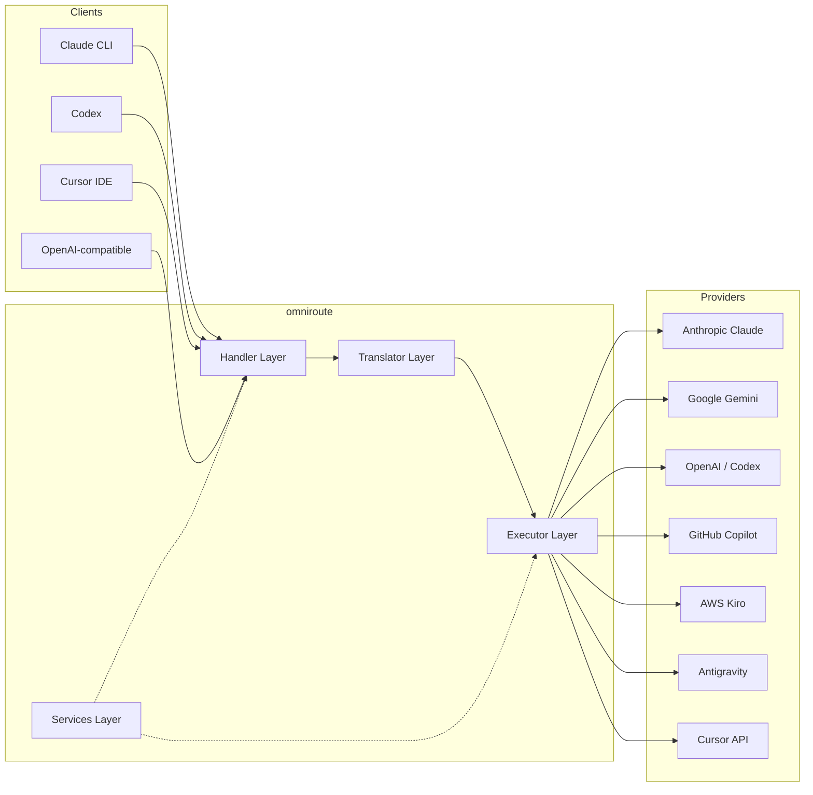
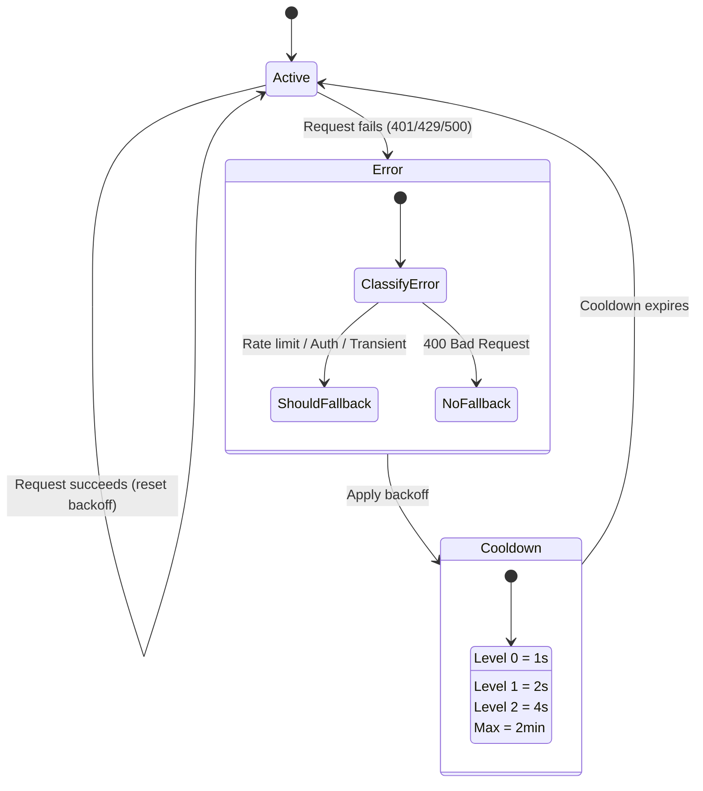
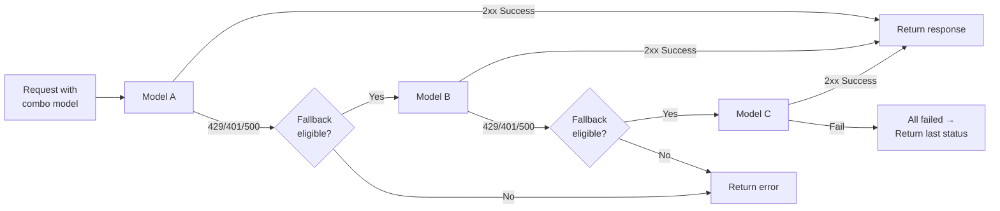
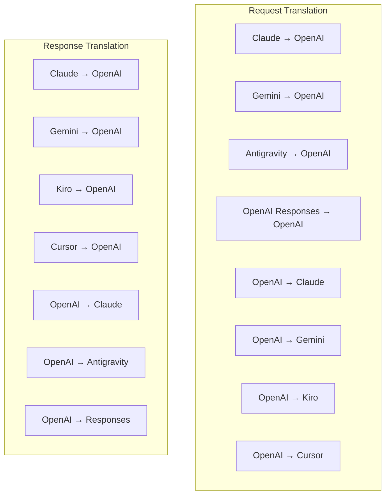
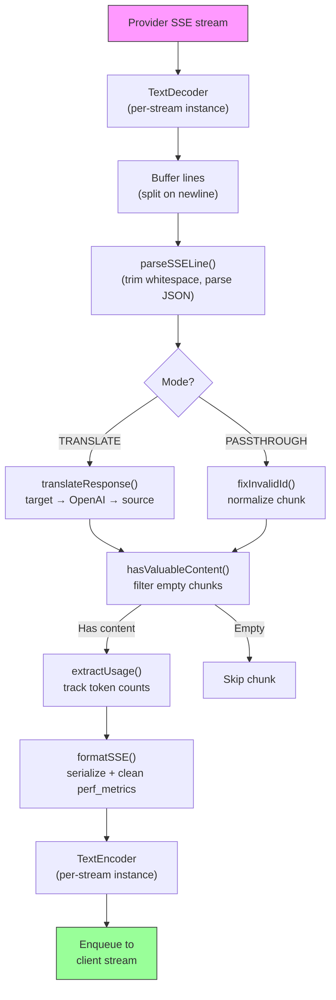
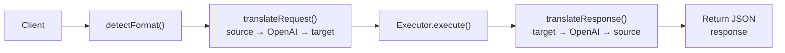
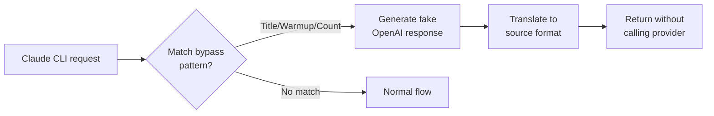

# omniroute — Codebase Documentation (Italiano)

🌐 **Languages:** 🇺🇸 [English](../../../../docs/CODEBASE_DOCUMENTATION.md) · 🇪🇸 [es](../../es/docs/CODEBASE_DOCUMENTATION.md) · 🇫🇷 [fr](../../fr/docs/CODEBASE_DOCUMENTATION.md) · 🇩🇪 [de](../../de/docs/CODEBASE_DOCUMENTATION.md) · 🇮🇹 [it](../../it/docs/CODEBASE_DOCUMENTATION.md) · 🇷🇺 [ru](../../ru/docs/CODEBASE_DOCUMENTATION.md) · 🇨🇳 [zh-CN](../../zh-CN/docs/CODEBASE_DOCUMENTATION.md) · 🇯🇵 [ja](../../ja/docs/CODEBASE_DOCUMENTATION.md) · 🇰🇷 [ko](../../ko/docs/CODEBASE_DOCUMENTATION.md) · 🇸🇦 [ar](../../ar/docs/CODEBASE_DOCUMENTATION.md) · 🇮🇳 [hi](../../hi/docs/CODEBASE_DOCUMENTATION.md) · 🇮🇳 [in](../../in/docs/CODEBASE_DOCUMENTATION.md) · 🇹🇭 [th](../../th/docs/CODEBASE_DOCUMENTATION.md) · 🇻🇳 [vi](../../vi/docs/CODEBASE_DOCUMENTATION.md) · 🇮🇩 [id](../../id/docs/CODEBASE_DOCUMENTATION.md) · 🇲🇾 [ms](../../ms/docs/CODEBASE_DOCUMENTATION.md) · 🇳🇱 [nl](../../nl/docs/CODEBASE_DOCUMENTATION.md) · 🇵🇱 [pl](../../pl/docs/CODEBASE_DOCUMENTATION.md) · 🇸🇪 [sv](../../sv/docs/CODEBASE_DOCUMENTATION.md) · 🇳🇴 [no](../../no/docs/CODEBASE_DOCUMENTATION.md) · 🇩🇰 [da](../../da/docs/CODEBASE_DOCUMENTATION.md) · 🇫🇮 [fi](../../fi/docs/CODEBASE_DOCUMENTATION.md) · 🇵🇹 [pt](../../pt/docs/CODEBASE_DOCUMENTATION.md) · 🇷🇴 [ro](../../ro/docs/CODEBASE_DOCUMENTATION.md) · 🇭🇺 [hu](../../hu/docs/CODEBASE_DOCUMENTATION.md) · 🇧🇬 [bg](../../bg/docs/CODEBASE_DOCUMENTATION.md) · 🇸🇰 [sk](../../sk/docs/CODEBASE_DOCUMENTATION.md) · 🇺🇦 [uk-UA](../../uk-UA/docs/CODEBASE_DOCUMENTATION.md) · 🇮🇱 [he](../../he/docs/CODEBASE_DOCUMENTATION.md) · 🇵🇭 [phi](../../phi/docs/CODEBASE_DOCUMENTATION.md) · 🇧🇷 [pt-BR](../../pt-BR/docs/CODEBASE_DOCUMENTATION.md) · 🇨🇿 [cs](../../cs/docs/CODEBASE_DOCUMENTATION.md) · 🇹🇷 [tr](../../tr/docs/CODEBASE_DOCUMENTATION.md)

---

> Una guida completa e adatta ai principianti al router proxy AI multi-provider**omniroute**.---

## 1. What Is omniroute?

omniroute è un**router proxy**che si trova tra i client AI (Claude CLI, Codex, Cursor IDE, ecc.) e i fornitori di AI (Anthropic, Google, OpenAI, AWS, GitHub, ecc.). Risolve un grosso problema:

> **Client IA diversi parlano "linguaggi" diversi (formati API) e anche fornitori di IA diversi si aspettano "linguaggi" diversi.**omniroute traduce automaticamente tra loro.

Pensatelo come un traduttore universale alle Nazioni Unite: qualsiasi delegato può parlare qualsiasi lingua e il traduttore la converte per qualsiasi altro delegato.---

## 2. Architecture Overview



### Core Principle: Hub-and-Spoke Translation

Tutte le traduzioni dei formati passano attraverso il**formato OpenAI come hub**:```
Client Format → [OpenAI Hub] → Provider Format (request)
Provider Format → [OpenAI Hub] → Client Format (response)

```

Ciò significa che hai bisogno solo di**N traduttori**(uno per formato) invece di**N²**(ogni coppia).---

## 3. Project Structure

```

omniroute/
├── open-sse/ ← Core proxy library (portable, framework-agnostic)
│ ├── index.js ← Main entry point, exports everything
│ ├── config/ ← Configuration & constants
│ ├── executors/ ← Provider-specific request execution
│ ├── handlers/ ← Request handling orchestration
│ ├── services/ ← Business logic (auth, models, fallback, usage)
│ ├── translator/ ← Format translation engine
│ │ ├── request/ ← Request translators (8 files)
│ │ ├── response/ ← Response translators (7 files)
│ │ └── helpers/ ← Shared translation utilities (6 files)
│ └── utils/ ← Utility functions
├── src/ ← Application layer (Express/Worker runtime)
│ ├── app/ ← Web UI, API routes, middleware
│ ├── lib/ ← Database, auth, and shared library code
│ ├── mitm/ ← Man-in-the-middle proxy utilities
│ ├── models/ ← Database models
│ ├── shared/ ← Shared utilities (wrappers around open-sse)
│ ├── sse/ ← SSE endpoint handlers
│ └── store/ ← State management
├── data/ ← Runtime data (credentials, logs)
│ └── provider-credentials.json (external credentials override, gitignored)
└── tester/ ← Test utilities

````

---

## 4. Module-by-Module Breakdown

### 4.1 Config (`open-sse/config/`)

L'**unica fonte di verità**per la configurazione di tutti i provider.

| File | Scopo |
| ----------------------- | ------------------------------------------------------------------------------------------------------------------------------------------------------------------------------------------------------------------------------- |
| `costanti.ts` | Oggetto "PROVIDERS" con URL di base, credenziali OAuth (predefinite), intestazioni e prompt di sistema predefiniti per ogni provider. Definisce inoltre `HTTP_STATUS`, `ERROR_TYPES`, `COOLDOWN_MS`, `BACKOFF_CONFIG` e `SKIP_PATTERNS`. |
| `credentialLoader.ts` | Carica le credenziali esterne da "data/provider-credentials.json" e le unisce alle impostazioni predefinite hardcoded in "PROVIDERS". Mantiene i segreti fuori dal controllo del codice sorgente mantenendo la compatibilità con le versioni precedenti.               |
| `providerModels.ts` | Registro centrale del modello: alias del fornitore delle mappe → ID del modello. Funzioni come `getModels()`, `getProviderByAlias()`.                                                                                                          |
| `codexInstructions.ts` | Istruzioni di sistema inserite nelle richieste del Codex (vincoli di modifica, regole sandbox, politiche di approvazione).                                                                                                                 |
| `defaultThinkingSignature.ts` | Firme "pensanti" predefinite per i modelli Claude e Gemini.                                                                                                                                                               |
| `ollamaModels.ts` | Definizione di schemi per modelli Ollama locali (nome, dimensione, famiglia, quantizzazione).                                                                                                                                             |#### Credential Loading Flow

```mermaid
flowchart TD
    A["App starts"] --> B["constants.ts defines PROVIDERS\nwith hardcoded defaults"]
    B --> C{"data/provider-credentials.json\nexists?"}
    C -->|Yes| D["credentialLoader reads JSON"]
    C -->|No| E["Use hardcoded defaults"]
    D --> F{"For each provider in JSON"}
    F --> G{"Provider exists\nin PROVIDERS?"}
    G -->|No| H["Log warning, skip"]
    G -->|Yes| I{"Value is object?"}
    I -->|No| J["Log warning, skip"]
    I -->|Yes| K["Merge clientId, clientSecret,\ntokenUrl, authUrl, refreshUrl"]
    K --> F
    H --> F
    J --> F
    F -->|Done| L["PROVIDERS ready with\nmerged credentials"]
    E --> L
````

---

### 4.2 Executors (`open-sse/executors/`)

Gli esecutori incapsulano la**logica specifica del provider**utilizzando il**Strategy Pattern**. Ogni esecutore sovrascrive i metodi di base secondo necessità.```mermaid
classDiagram
class BaseExecutor {
+buildUrl(model, stream, options)
+buildHeaders(credentials, stream, body)
+transformRequest(body, model, stream, credentials)
+execute(url, options)
+shouldRetry(status, error)
+refreshCredentials(credentials, log)
}

    class DefaultExecutor {
        +refreshCredentials()
    }

    class AntigravityExecutor {
        +buildUrl()
        +buildHeaders()
        +transformRequest()
        +shouldRetry()
        +refreshCredentials()
    }

    class CursorExecutor {
        +buildUrl()
        +buildHeaders()
        +transformRequest()
        +parseResponse()
        +generateChecksum()
    }

    class KiroExecutor {
        +buildUrl()
        +buildHeaders()
        +transformRequest()
        +parseEventStream()
        +refreshCredentials()
    }

    BaseExecutor <|-- DefaultExecutor
    BaseExecutor <|-- AntigravityExecutor
    BaseExecutor <|-- CursorExecutor
    BaseExecutor <|-- KiroExecutor
    BaseExecutor <|-- CodexExecutor
    BaseExecutor <|-- GeminiCLIExecutor
    BaseExecutor <|-- GithubExecutor

````

| Esecutore testamentario | Fornitore | Specializzazioni chiave |
| ---------------- | ----------------------------------- | ------------------------------------------------------------------------------------------------------------------- |
| `base.ts` | — | Base astratta: creazione di URL, intestazioni, logica dei tentativi, aggiornamento delle credenziali |
| `default.ts` | Claude, Gemini, OpenAI, GLM, Kimi, MiniMax | Aggiornamento del token OAuth generico per i provider standard |
| `antigravity.ts` | Codice Google Cloud | Generazione ID progetto/sessione, fallback multi-URL, nuovi tentativi di analisi personalizzati dai messaggi di errore ("reimposta dopo 2h7m23s") |
| `cursore.ts` | Cursore IDE |**Più complesso**: autenticazione checksum SHA-256, codifica della richiesta Protobuf, EventStream binario → Analisi della risposta SSE |
| `codex.ts` | Codice OpenAI | Inserisce istruzioni di sistema, gestisce i livelli di pensiero, rimuove i parametri non supportati |
| `gemini-cli.ts` | CLI di Google Gemini | Creazione di URL personalizzati (`streamGenerateContent`), aggiornamento del token OAuth di Google |
| `github.ts` | Copilota GitHub | Sistema a doppio token (GitHub OAuth + token Copilot), intestazione VSCode che imita |
| `kiro.ts` | AWS CodeWhisperer | Analisi binaria AWS EventStream, frame di eventi AMZN, stima dei token |
| `indice.ts` | — | Fabbrica: nome del provider delle mappe → classe dell'esecutore, con fallback predefinito |---

### 4.3 Handlers (`open-sse/handlers/`)

Il**livello di orchestrazione**: coordina la traduzione, l'esecuzione, lo streaming e la gestione degli errori.

| File | Scopo |
| --------------------- | ---------------------------------------------------------------------------------------------------------------------------------------------------------------------------------------------------------------------- |
| `chatCore.ts` |**Orchestratore centrale**(~600 linee). Gestisce il ciclo di vita completo della richiesta: rilevamento del formato → traduzione → invio dell'esecutore → risposta in streaming/non streaming → aggiornamento del token → gestione degli errori → registrazione dell'utilizzo. |
| `responsesHandler.ts` | Adattatore per l'API Responses di OpenAI: converte il formato Responses → Completamenti chat → invia a `chatCore` → riconverte SSE nel formato Responses.                                                                        |
| `embeddings.ts` | Gestore della generazione di incorporamento: risolve il modello di incorporamento → provider, invia all'API del provider, restituisce una risposta di incorporamento compatibile con OpenAI. Supporta più di 6 fornitori.                                                    |
| `imageGeneration.ts` | Gestore di generazione di immagini: risolve il modello di immagine → provider, supporta le modalità compatibili con OpenAI, Gemini-image (Antigravity) e fallback (Nebius). Restituisce immagini base64 o URL.                                          |#### Request Lifecycle (chatCore.ts)

```mermaid
sequenceDiagram
    participant Client
    participant chatCore
    participant Translator
    participant Executor
    participant Provider

    Client->>chatCore: Request (any format)
    chatCore->>chatCore: Detect source format
    chatCore->>chatCore: Check bypass patterns
    chatCore->>chatCore: Resolve model & provider
    chatCore->>Translator: Translate request (source → OpenAI → target)
    chatCore->>Executor: Get executor for provider
    Executor->>Executor: Build URL, headers, transform request
    Executor->>Executor: Refresh credentials if needed
    Executor->>Provider: HTTP fetch (streaming or non-streaming)

    alt Streaming
        Provider-->>chatCore: SSE stream
        chatCore->>chatCore: Pipe through SSE transform stream
        Note over chatCore: Transform stream translates<br/>each chunk: target → OpenAI → source
        chatCore-->>Client: Translated SSE stream
    else Non-streaming
        Provider-->>chatCore: JSON response
        chatCore->>Translator: Translate response
        chatCore-->>Client: Translated JSON
    end

    alt Error (401, 429, 500...)
        chatCore->>Executor: Retry with credential refresh
        chatCore->>chatCore: Account fallback logic
    end
````

---

### 4.4 Services (`open-sse/services/`)

| Logica di business che supporta i gestori e gli esecutori. | File                                                                                                                                                                                                                                                                                                                                   | Purpose |
| ---------------------------------------------------------- | -------------------------------------------------------------------------------------------------------------------------------------------------------------------------------------------------------------------------------------------------------------------------------------------------------------------------------------- | ------- |
| `provider.ts`                                              | **Format detection** (`detectFormat`): analyzes request body structure to identify Claude/OpenAI/Gemini/Antigravity/Responses formats (includes `max_tokens` heuristic for Claude). Also: URL building, header building, thinking config normalization. Supports `openai-compatible-*` and `anthropic-compatible-*` dynamic providers. |
| `model.ts`                                                 | Model string parsing (`claude/model-name` → `{provider: "claude", model: "model-name"}`), alias resolution with collision detection, input sanitization (rejects path traversal/control chars), and model info resolution with async alias getter support.                                                                             |
| `accountFallback.ts`                                       | Rate-limit handling: exponential backoff (1s → 2s → 4s → max 2min), account cooldown management, error classification (which errors trigger fallback vs. not).                                                                                                                                                                         |
| `tokenRefresh.ts`                                          | OAuth token refresh for **every provider**: Google (Gemini, Antigravity), Claude, Codex, Qwen, Qoder, GitHub (OAuth + Copilot dual-token), Kiro (AWS SSO OIDC + Social Auth). Includes in-flight promise deduplication cache and retry with exponential backoff.                                                                       |
| `combo.ts`                                                 | **Combo models**: chains of fallback models. If model A fails with a fallback-eligible error, try model B, then C, etc. Returns actual upstream status codes.                                                                                                                                                                          |
| `usage.ts`                                                 | Fetches quota/usage data from provider APIs (GitHub Copilot quotas, Antigravity model quotas, Codex rate limits, Kiro usage breakdowns, Claude settings).                                                                                                                                                                              |
| `accountSelector.ts`                                       | Smart account selection with scoring algorithm: considers priority, health status, round-robin position, and cooldown state to pick the optimal account for each request.                                                                                                                                                              |
| `contextManager.ts`                                        | Request context lifecycle management: creates and tracks per-request context objects with metadata (request ID, timestamps, provider info) for debugging and logging.                                                                                                                                                                  |
| `ipFilter.ts`                                              | IP-based access control: supports allowlist and blocklist modes. Validates client IP against configured rules before processing API requests.                                                                                                                                                                                          |
| `sessionManager.ts`                                        | Session tracking with client fingerprinting: tracks active sessions using hashed client identifiers, monitors request counts, and provides session metrics.                                                                                                                                                                            |
| `signatureCache.ts`                                        | Request signature-based deduplication cache: prevents duplicate requests by caching recent request signatures and returning cached responses for identical requests within a time window.                                                                                                                                              |
| `systemPrompt.ts`                                          | Global system prompt injection: prepends or appends a configurable system prompt to all requests, with per-provider compatibility handling.                                                                                                                                                                                            |
| `thinkingBudget.ts`                                        | Reasoning token budget management: supports passthrough, auto (strip thinking config), custom (fixed budget), and adaptive (complexity-scaled) modes for controlling thinking/reasoning tokens.                                                                                                                                        |
| `wildcardRouter.ts`                                        | Wildcard model pattern routing: resolves wildcard patterns (e.g., `*/claude-*`) to concrete provider/model pairs based on availability and priority.                                                                                                                                                                                   |

#### Token Refresh Deduplication

```mermaid
sequenceDiagram
    participant R1 as Request 1
    participant R2 as Request 2
    participant Cache as refreshPromiseCache
    participant OAuth as OAuth Provider

    R1->>Cache: getAccessToken("gemini", token)
    Cache->>Cache: No in-flight promise
    Cache->>OAuth: Start refresh
    R2->>Cache: getAccessToken("gemini", token)
    Cache->>Cache: Found in-flight promise
    Cache-->>R2: Return existing promise
    OAuth-->>Cache: New access token
    Cache-->>R1: New access token
    Cache-->>R2: Same access token (shared)
    Cache->>Cache: Delete cache entry
```

#### Account Fallback State Machine



#### Combo Model Chain



---

### 4.5 Translator (`open-sse/translator/`)

Il**motore di traduzione dei formati**che utilizza un sistema di plugin autoregistranti.#### Architettura



| Elenco       | File         | Descrizione                                                                                                                                                                                                                                                                                             |
| ------------ | ------------ | ------------------------------------------------------------------------------------------------------------------------------------------------------------------------------------------------------------------------------------------------------------------------------------------------------- | ----------------------------------------- |
| `richiesta/` | 8 traduttori | Convertire i corpi delle richieste tra formati. Ogni file si autoregistra tramite `register(from, to, fn)` durante l'importazione.                                                                                                                                                                      |
| `risposta/`  | 7 traduttori | Converti blocchi di risposta in streaming tra formati. Gestisce tipi di eventi SSE, blocchi di pensiero, chiamate a strumenti.                                                                                                                                                                          |
| `aiutanti/`  | 6 aiutanti   | Utilità condivise: `claudeHelper` (estrazione del prompt di sistema, configurazione del pensiero), `geminiHelper` (mappatura di parti/contenuti), `openaiHelper` (filtro del formato), `toolCallHelper` (generazione di ID, inserimento di risposte mancanti), `maxTokensHelper`, `responsesApiHelper`. |
| `indice.ts`  | —            | Motore di traduzione: `translateRequest()`, `translateResponse()`, gestione dello stato, registro.                                                                                                                                                                                                      |
| `formati.ts` | —            | Costanti di formato: `OPENAI`, `CLAUDE`, `GEMINI`, `ANTIGRAVITY`, `KIRO`, `CURSOR`, `OPENAI_RESPONSES`.                                                                                                                                                                                                 | #### Key Design: Self-Registering Plugins |

```javascript
// Each translator file calls register() on import:
import { register } from "../index.js";
register("claude", "openai", translateClaudeToOpenAI);

// The index.js imports all translator files, triggering registration:
import "./request/claude-to-openai.js"; // ← self-registers
```

---

### 4.6 Utils (`open-sse/utils/`)

| File               | Scopo                                                                                                                                                                                                                                                                                                                                                                   |
| ------------------ | ----------------------------------------------------------------------------------------------------------------------------------------------------------------------------------------------------------------------------------------------------------------------------------------------------------------------------------------------------------------------- | --------------------------- |
| `errore.ts`        | Creazione di risposte agli errori (formato compatibile con OpenAI), analisi degli errori upstream, estrazione del tempo di tentativo Antigravity dai messaggi di errore, streaming degli errori SSE.                                                                                                                                                                    |
| `stream.ts`        | **SSE Transform Stream**: la pipeline di streaming principale. Due modalità: "TRANSLATE" (traduzione in formato completo) e "PASSTHROUGH" (normalizza + estrai l'utilizzo). Gestisce il buffering dei blocchi, la stima dell'utilizzo, il monitoraggio della lunghezza del contenuto. Le istanze del codificatore/decodificatore per flusso evitano lo stato condiviso. |
| `streamHelpers.ts` | Utilità SSE di basso livello: `parseSSELine` (tollerante agli spazi bianchi), `hasValuableContent` (filtra blocchi vuoti per OpenAI/Claude/Gemini), `fixInvalidId`, `formatSSE` (serializzazione SSE sensibile al formato con pulizia `perf_metrics`).                                                                                                                  |
| `usageTracking.ts` | Estrazione dell'utilizzo dei token da qualsiasi formato (Claude/OpenAI/Gemini/Responses), stima con rapporti separati strumento/messaggio caratteri per token, aggiunta buffer (margine di sicurezza di 2000 token), filtraggio dei campi specifici del formato, registrazione della console con colori ANSI.                                                           |
| `requestLogger.ts` | Legacy file-based request logging helper kept for compatibility. Current deployments should prefer `APP_LOG_TO_FILE` for application logs and the call log pipeline for persisted request artifacts.                                                                                                                                                                    |
| `bypassHandler.ts` | Intercetta modelli specifici dalla CLI di Claude (estrazione del titolo, riscaldamento, conteggio) e restituisce risposte false senza chiamare alcun fornitore. Supporta sia lo streaming che il non streaming. Intenzionalmente limitato all'ambito CLI di Claude.                                                                                                     |
| `networkProxy.ts`  | Risolve l'URL proxy in uscita per un determinato provider con precedenza: configurazione specifica del provider → configurazione globale → variabili di ambiente (`HTTPS_PROXY`/`HTTP_PROXY`/`ALL_PROXY`). Supporta le esclusioni "NO_PROXY". Configurazione della cache per 30 secondi.                                                                                | #### SSE Streaming Pipeline |



#### Request Logger Session Structure

```
logs/
└── claude_gemini_claude-sonnet_20260208_143045/
    ├── 1_req_client.json      ← Raw client request
    ├── 2_req_source.json      ← After initial conversion
    ├── 3_req_openai.json      ← OpenAI intermediate format
    ├── 4_req_target.json      ← Final target format
    ├── 5_res_provider.txt     ← Provider SSE chunks (streaming)
    ├── 5_res_provider.json    ← Provider response (non-streaming)
    ├── 6_res_openai.txt       ← OpenAI intermediate chunks
    ├── 7_res_client.txt       ← Client-facing SSE chunks
    └── 6_error.json           ← Error details (if any)
```

---

### 4.7 Application Layer (`src/`)

| Elenco           | Scopo                                                                               |
| ---------------- | ----------------------------------------------------------------------------------- | ----------------------- |
| `src/app/`       | Interfaccia utente Web, percorsi API, middleware Express, gestori di callback OAuth |
| `src/lib/`       | Accesso al database (`localDb.ts`, `usageDb.ts`), autenticazione, condivisione      |
| `src/mitm/`      | Utilità proxy man-in-the-middle per intercettare il traffico del provider           |
| `src/modelli/`   | Definizioni del modello di database                                                 |
| `src/condiviso/` | Wrapper attorno alle funzioni open-sse (provider, stream, errore, ecc.)             |
| `src/sse/`       | Gestori endpoint SSE che collegano la libreria open-sse alle rotte Express          |
| `src/negozio/`   | Gestione dello stato dell'applicazione                                              | #### Notable API Routes |

| Itinerario                                   | Metodi                    | Scopo                                                                                                            |
| -------------------------------------------- | ------------------------- | ---------------------------------------------------------------------------------------------------------------- | --- |
| `/api/provider-models`                       | OTTIENI/INVIA/ELIMINA     | CRUD per modelli personalizzati per fornitore                                                                    |
| `/api/modelli/catalogo`                      | OTTIENI                   | Catalogo aggregato di tutti i modelli (chat, incorporamento, immagine, personalizzato) raggruppati per fornitore |
| `/api/settings/proxy`                        | OTTIENI/INSERISCI/ELIMINA | Configurazione gerarchica del proxy in uscita (`global/provviders/combos/keys`)                                  |
| `/api/settings/proxy/test`                   | POST                      | Convalida la connettività proxy e restituisce IP pubblico/latenza                                                |
| `/v1/providers/[provider]/chat/completions`  | POST                      | Completamenti chat dedicati per provider con convalida del modello                                               |
| `/v1/providers/[provider]/embeddings`        | POST                      | Incorporamenti dedicati per provider con convalida del modello                                                   |
| `/v1/provider/[provider]/images/generazioni` | POST                      | Generazione di immagini dedicate per provider con convalida del modello                                          |
| `/api/settings/ip-filter`                    | OTTIENI/METTI             | Gestione lista consentita/lista bloccata IP                                                                      |
| `/api/settings/thinking-budget`              | OTTIENI/METTI             | Configurazione del budget del token di ragionamento (passthrough/auto/custom/adaptive)                           |
| `/api/settings/prompt-di-sistema`            | OTTIENI/METTI             | Iniezione rapida del sistema globale per tutte le richieste                                                      |
| `/api/sessions`                              | OTTIENI                   | Monitoraggio e metriche della sessione attiva                                                                    |
| `/api/rate-limits`                           | OTTIENI                   | Stato limite tariffa per account                                                                                 | --- |

## 5. Key Design Patterns

### 5.1 Hub-and-Spoke Translation

Tutti i formati vengono tradotti tramite il**formato OpenAI come hub**. L'aggiunta di un nuovo provider richiede solo la scrittura di**una coppia**di traduttori (da/verso OpenAI), non N coppie.### 5.2 Executor Strategy Pattern

Ogni provider ha una classe di esecutore dedicata che eredita da "BaseExecutor". La factory in `executors/index.ts` seleziona quello giusto in fase di runtime.### 5.3 Self-Registering Plugin System

I moduli di traduzione si registrano durante l'importazione tramite `register()`. Aggiungere un nuovo traduttore significa semplicemente creare un file e importarlo.### 5.4 Account Fallback with Exponential Backoff

Quando un fornitore restituisce 429/401/500, il sistema può passare all'account successivo, applicando tempi di recupero esponenziali (1s → 2s → 4s → max 2min).### 5.5 Combo Model Chains

Una "combo" raggruppa più stringhe "provider/model". Se il primo fallisce, passa automaticamente al successivo.### 5.6 Stateful Streaming Translation

La traduzione della risposta mantiene lo stato tra i blocchi SSE (tracciamento dei blocchi di pensiero, accumulo di chiamate agli strumenti, indicizzazione dei blocchi di contenuto) tramite il meccanismo `initState()`.### 5.7 Usage Safety Buffer

Viene aggiunto un buffer da 2000 token all'utilizzo segnalato per impedire ai client di raggiungere i limiti della finestra di contesto a causa del sovraccarico derivante dai prompt di sistema e dalla conversione del formato.---

## 6. Supported Formats

| Formato                   | Direzione            | Identificatore    |
| ------------------------- | -------------------- | ----------------- | --- |
| Completamenti OpenAI Chat | fonte + destinazione | `openai`          |
| API di risposta OpenAI    | fonte + destinazione | `risposte-openai` |
| Claude antropico          | fonte + destinazione | `claude`          |
| Google Gemelli            | fonte + destinazione | `gemelli`         |
| CLI di Google Gemini      | solo obiettivo       | `gemini-cli`      |
| Antigravità               | fonte + destinazione | `antigravità`     |
| AWS Kiro                  | solo obiettivo       | `kirò`            |
| Cursore                   | solo obiettivo       | `cursore`         | --- |

## 7. Supported Providers

| Fornitore                 | Metodo di autenticazione | Esecutore testamentario | Note chiave                                              |
| ------------------------- | ------------------------ | ----------------------- | -------------------------------------------------------- | --- |
| Claude antropico          | Chiave API o OAuth       | Predefinito             | Utilizza l'intestazione `x-api-key`                      |
| Google Gemelli            | Chiave API o OAuth       | Predefinito             | Utilizza l'intestazione `x-goog-api-key`                 |
| CLI di Google Gemini      | OAuth                    | GemelliCLI              | Utilizza l'endpoint `streamGenerateContent`              |
| Antigravità               | OAuth                    | Antigravità             | Fallback multi-URL, analisi dei tentativi personalizzata |
| OpenAI                    | Chiave API               | Predefinito             | Aut. alfiere                                             |
| Codice                    | OAuth                    | Codice                  | Inserisce istruzioni di sistema, gestisce il pensiero    |
| Copilota GitHub           | OAuth + token copilota   | Github                  | Doppio token, intestazione VSCode che imita              |
| Kiro (AWS)                | AWS SSO OIDC o Social    | Kiro                    | Analisi binaria EventStream                              |
| Cursore IDE               | Autenticazione checksum  | Cursore                 | Codifica Protobuf, checksum SHA-256                      |
| Qwen                      | OAuth                    | Predefinito             | Aut. standard                                            |
| Qoder                     | OAuth (base + portatore) | Predefinito             | Intestazione doppia autenticazione                       |
| OpenRouter                | Chiave API               | Predefinito             | Aut. alfiere                                             |
| GLM, Kimi, MiniMax        | Chiave API               | Predefinito             | Compatibile con Claude, usa `x-api-key`                  |
| `openai-compatibile-*`    | Chiave API               | Predefinito             | Dinamico: qualsiasi endpoint compatibile con OpenAI      |
| `antropico-compatibile-*` | Chiave API               | Predefinito             | Dinamico: qualsiasi endpoint compatibile con Claude      | --- |

## 8. Data Flow Summary

### Streaming Request

```mermaid
flowchart LR
    A["Client"] --> B["detectFormat()"]
    B --> C["translateRequest()\nsource → OpenAI → target"]
    C --> D["Executor\nbuildUrl + buildHeaders"]
    D --> E["fetch(providerURL)"]
    E --> F["createSSEStream()\nTRANSLATE mode"]
    F --> G["parseSSELine()"]
    G --> H["translateResponse()\ntarget → OpenAI → source"]
    H --> I["extractUsage()\n+ addBuffer"]
    I --> J["formatSSE()"]
    J --> K["Client receives\ntranslated SSE"]
    K --> L["logUsage()\nsaveRequestUsage()"]
```



### Non-Streaming Request



### Bypass Flow (Claude CLI)


