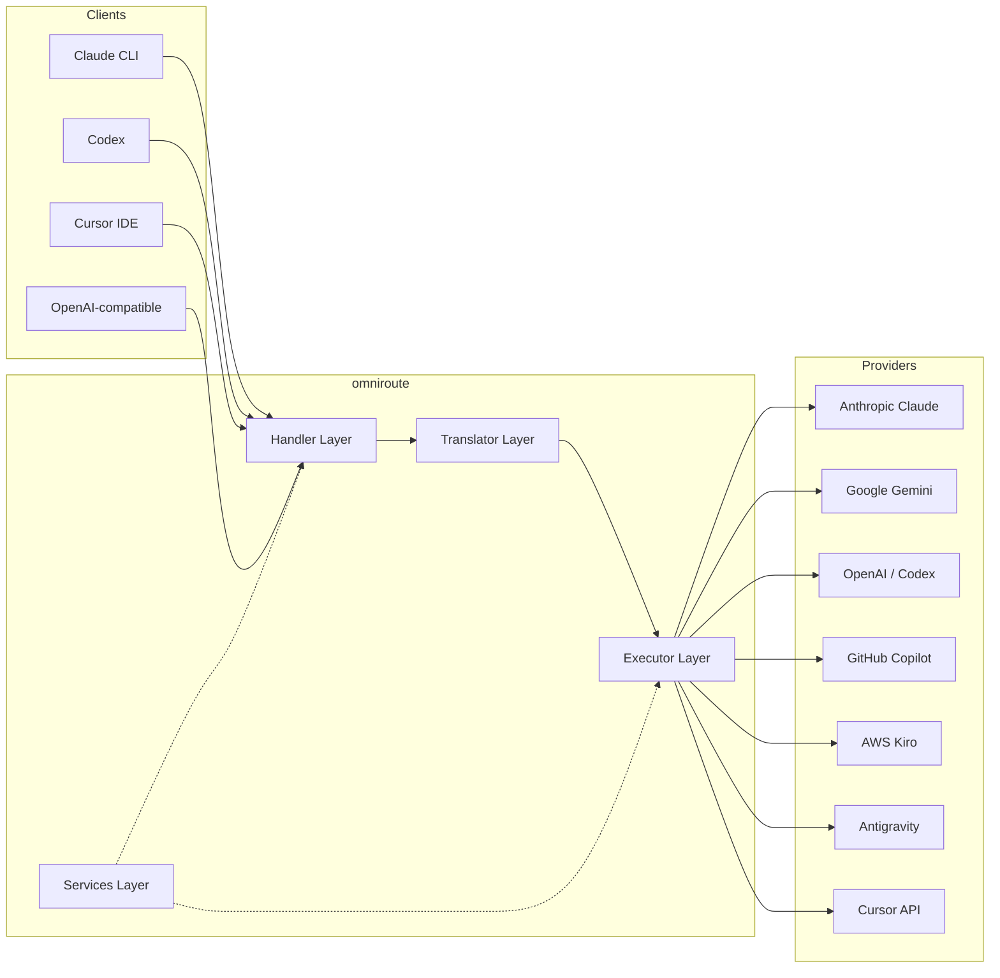
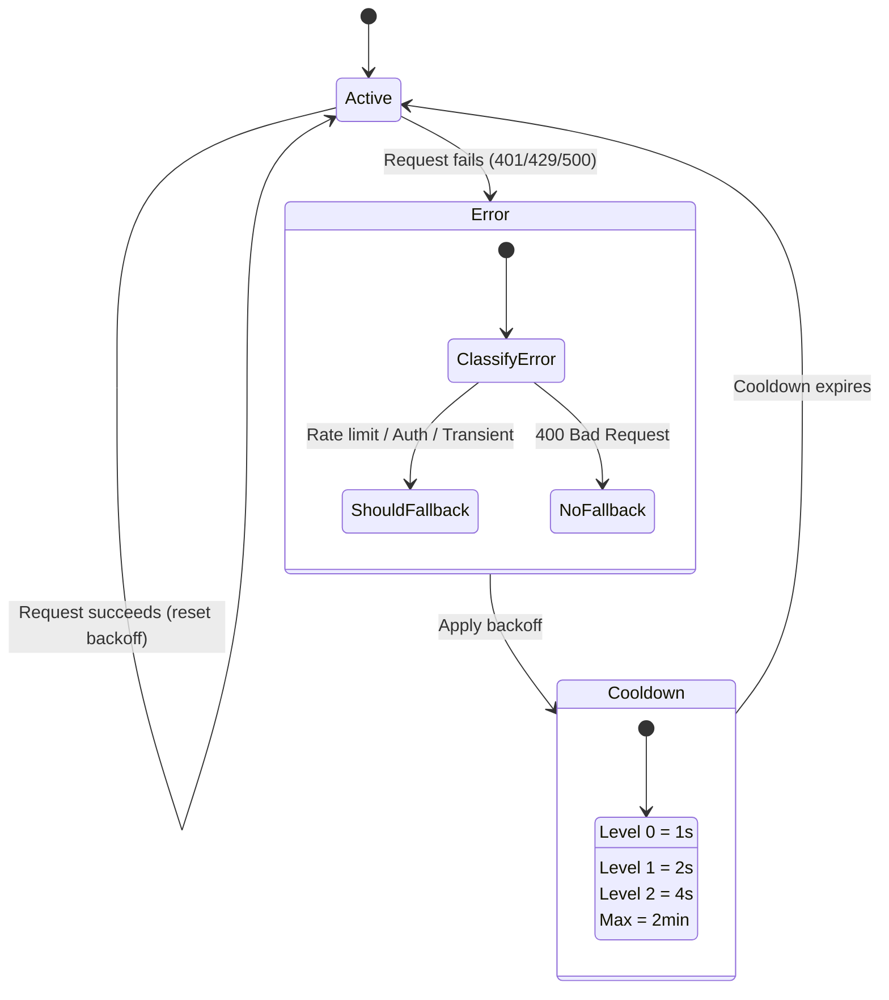
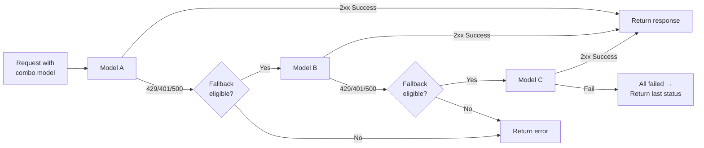
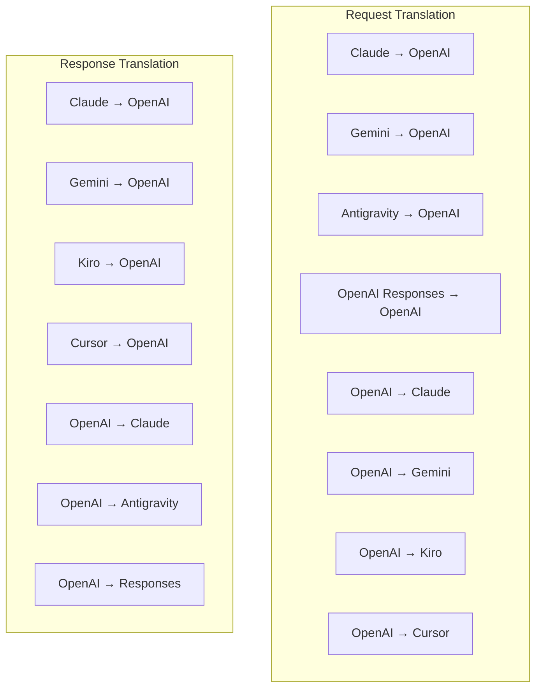
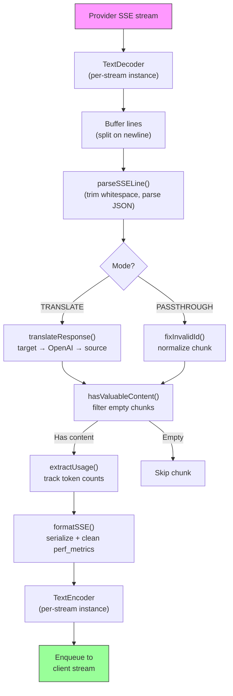
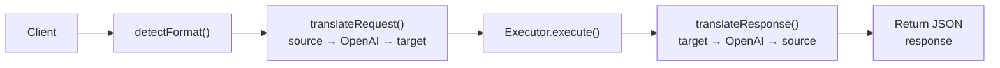
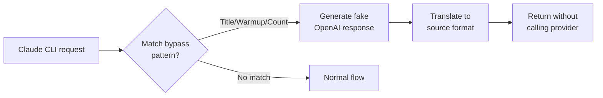

# omniroute — Codebase Documentation (日本語)

🌐 **Languages:** 🇺🇸 [English](../../../../docs/CODEBASE_DOCUMENTATION.md) · 🇪🇸 [es](../../es/docs/CODEBASE_DOCUMENTATION.md) · 🇫🇷 [fr](../../fr/docs/CODEBASE_DOCUMENTATION.md) · 🇩🇪 [de](../../de/docs/CODEBASE_DOCUMENTATION.md) · 🇮🇹 [it](../../it/docs/CODEBASE_DOCUMENTATION.md) · 🇷🇺 [ru](../../ru/docs/CODEBASE_DOCUMENTATION.md) · 🇨🇳 [zh-CN](../../zh-CN/docs/CODEBASE_DOCUMENTATION.md) · 🇯🇵 [ja](../../ja/docs/CODEBASE_DOCUMENTATION.md) · 🇰🇷 [ko](../../ko/docs/CODEBASE_DOCUMENTATION.md) · 🇸🇦 [ar](../../ar/docs/CODEBASE_DOCUMENTATION.md) · 🇮🇳 [hi](../../hi/docs/CODEBASE_DOCUMENTATION.md) · 🇮🇳 [in](../../in/docs/CODEBASE_DOCUMENTATION.md) · 🇹🇭 [th](../../th/docs/CODEBASE_DOCUMENTATION.md) · 🇻🇳 [vi](../../vi/docs/CODEBASE_DOCUMENTATION.md) · 🇮🇩 [id](../../id/docs/CODEBASE_DOCUMENTATION.md) · 🇲🇾 [ms](../../ms/docs/CODEBASE_DOCUMENTATION.md) · 🇳🇱 [nl](../../nl/docs/CODEBASE_DOCUMENTATION.md) · 🇵🇱 [pl](../../pl/docs/CODEBASE_DOCUMENTATION.md) · 🇸🇪 [sv](../../sv/docs/CODEBASE_DOCUMENTATION.md) · 🇳🇴 [no](../../no/docs/CODEBASE_DOCUMENTATION.md) · 🇩🇰 [da](../../da/docs/CODEBASE_DOCUMENTATION.md) · 🇫🇮 [fi](../../fi/docs/CODEBASE_DOCUMENTATION.md) · 🇵🇹 [pt](../../pt/docs/CODEBASE_DOCUMENTATION.md) · 🇷🇴 [ro](../../ro/docs/CODEBASE_DOCUMENTATION.md) · 🇭🇺 [hu](../../hu/docs/CODEBASE_DOCUMENTATION.md) · 🇧🇬 [bg](../../bg/docs/CODEBASE_DOCUMENTATION.md) · 🇸🇰 [sk](../../sk/docs/CODEBASE_DOCUMENTATION.md) · 🇺🇦 [uk-UA](../../uk-UA/docs/CODEBASE_DOCUMENTATION.md) · 🇮🇱 [he](../../he/docs/CODEBASE_DOCUMENTATION.md) · 🇵🇭 [phi](../../phi/docs/CODEBASE_DOCUMENTATION.md) · 🇧🇷 [pt-BR](../../pt-BR/docs/CODEBASE_DOCUMENTATION.md) · 🇨🇿 [cs](../../cs/docs/CODEBASE_DOCUMENTATION.md) · 🇹🇷 [tr](../../tr/docs/CODEBASE_DOCUMENTATION.md)

---

> **omniroute**マルチプロバイダー AI プロキシ ルーターに関する初心者向けの包括的なガイド。---

## 1. What Is omniroute?

オムニルートは、AI クライアント (Claude CLI、Codex、Cursor IDE など) と AI プロバイダー (Anthropic、Google、OpenAI、AWS、GitHub など) の間に位置する**プロキシ ルーター**です。これにより、1 つの大きな問題が解決されます。

> **異なる AI クライアントは異なる「言語」(API 形式) を話し、異なる AI プロバイダーも異なる「言語」を期待します。**オムニルートはそれらの間で自動的に翻訳します。

これを国連の万能翻訳者のようなものだと考えてください。どの代表者もあらゆる言語を話すことができ、翻訳者は他の代表者のためにそれを変換します。---

## 2. Architecture Overview



### Core Principle: Hub-and-Spoke Translation

すべての形式変換は、**OpenAI 形式をハブとして**通過します。```
Client Format → [OpenAI Hub] → Provider Format (request)
Provider Format → [OpenAI Hub] → Client Format (response)

```

これは、**N²**(ペアごと) ではなく、**N トランスレーター**(フォーマットごとに 1 つ) だけが必要であることを意味します。---

## 3. Project Structure

```

omniroute/
├── open-sse/ ← Core proxy library (portable, framework-agnostic)
│ ├── index.js ← Main entry point, exports everything
│ ├── config/ ← Configuration & constants
│ ├── executors/ ← Provider-specific request execution
│ ├── handlers/ ← Request handling orchestration
│ ├── services/ ← Business logic (auth, models, fallback, usage)
│ ├── translator/ ← Format translation engine
│ │ ├── request/ ← Request translators (8 files)
│ │ ├── response/ ← Response translators (7 files)
│ │ └── helpers/ ← Shared translation utilities (6 files)
│ └── utils/ ← Utility functions
├── src/ ← Application layer (Express/Worker runtime)
│ ├── app/ ← Web UI, API routes, middleware
│ ├── lib/ ← Database, auth, and shared library code
│ ├── mitm/ ← Man-in-the-middle proxy utilities
│ ├── models/ ← Database models
│ ├── shared/ ← Shared utilities (wrappers around open-sse)
│ ├── sse/ ← SSE endpoint handlers
│ └── store/ ← State management
├── data/ ← Runtime data (credentials, logs)
│ └── provider-credentials.json (external credentials override, gitignored)
└── tester/ ← Test utilities

````

---

## 4. Module-by-Module Breakdown

### 4.1 Config (`open-sse/config/`)

すべてのプロバイダー構成に関する**唯一の信頼できる情報源**。

|ファイル |目的 |
| ----------------------------- | --------------------------------------------------------------------------------------------------------------------------------------------------------------------------------------------------------------------------- |
| `定数.ts` |すべてのプロバイダーのベース URL、OAuth 認証情報 (デフォルト)、ヘッダー、およびデフォルトのシステム プロンプトを含む「PROVIDERS」オブジェクト。また、`HTTP_STATUS`、`ERROR_TYPES`、`COOLDOWN_MS`、`BACKOFF_CONFIG`、および `SKIP_PATTERNS` も定義します。 |
| `credentialLoader.ts` |外部認証情報を `data/provider-credentials.json` からロードし、それらを `PROVIDERS` のハードコードされたデフォルトにマージします。下位互換性を維持しながら、秘密をソース管理から除外します。               |
| `providerModels.ts` |中央モデル レジストリ: プロバイダーのエイリアス → モデル ID をマップします。 「getModels()」、「getProviderByAlias()」のような関数。                                                                                                          |
| `codex命令.ts` | Codex リクエストに挿入されるシステム命令 (編集制約、サンドボックス ルール、承認ポリシー)。                                                                                                                 |
| `defaultThinkingSignature.ts` | Claude モデルと Gemini モデルのデフォルトの「思考」シグネチャ。                                                                                                                                                               |
| `ollamaModels.ts` |ローカル Ollama モデルのスキーマ定義 (名前、サイズ、ファミリー、量子化)。                                                                                                                                             |#### Credential Loading Flow

```mermaid
flowchart TD
    A["App starts"] --> B["constants.ts defines PROVIDERS\nwith hardcoded defaults"]
    B --> C{"data/provider-credentials.json\nexists?"}
    C -->|Yes| D["credentialLoader reads JSON"]
    C -->|No| E["Use hardcoded defaults"]
    D --> F{"For each provider in JSON"}
    F --> G{"Provider exists\nin PROVIDERS?"}
    G -->|No| H["Log warning, skip"]
    G -->|Yes| I{"Value is object?"}
    I -->|No| J["Log warning, skip"]
    I -->|Yes| K["Merge clientId, clientSecret,\ntokenUrl, authUrl, refreshUrl"]
    K --> F
    H --> F
    J --> F
    F -->|Done| L["PROVIDERS ready with\nmerged credentials"]
    E --> L
````

---

### 4.2 Executors (`open-sse/executors/`)

エグゼキュータは、**戦略パターン**を使用して**プロバイダ固有のロジック**をカプセル化します。各エグゼキュータは、必要に応じて基本メソッドをオーバーライドします。```mermaid
classDiagram
class BaseExecutor {
+buildUrl(model, stream, options)
+buildHeaders(credentials, stream, body)
+transformRequest(body, model, stream, credentials)
+execute(url, options)
+shouldRetry(status, error)
+refreshCredentials(credentials, log)
}

    class DefaultExecutor {
        +refreshCredentials()
    }

    class AntigravityExecutor {
        +buildUrl()
        +buildHeaders()
        +transformRequest()
        +shouldRetry()
        +refreshCredentials()
    }

    class CursorExecutor {
        +buildUrl()
        +buildHeaders()
        +transformRequest()
        +parseResponse()
        +generateChecksum()
    }

    class KiroExecutor {
        +buildUrl()
        +buildHeaders()
        +transformRequest()
        +parseEventStream()
        +refreshCredentials()
    }

    BaseExecutor <|-- DefaultExecutor
    BaseExecutor <|-- AntigravityExecutor
    BaseExecutor <|-- CursorExecutor
    BaseExecutor <|-- KiroExecutor
    BaseExecutor <|-- CodexExecutor
    BaseExecutor <|-- GeminiCLIExecutor
    BaseExecutor <|-- GithubExecutor

````

|執行者 |プロバイダー |主な専門分野 |
| ---------------- | ------------------------------------------ | ------------------------------------------------------------------------------------------------------------------- |
| `base.ts` | — |抽象ベース: URL 構築、ヘッダー、再試行ロジック、資格情報の更新 |
| `デフォルト.ts` |クロード、ジェミニ、OpenAI、GLM、キミ、MiniMax |標準プロバイダーの汎用 OAuth トークンの更新 |
| `反重力.ts` | Googleクラウドコード |プロジェクト/セッション ID の生成、マルチ URL フォールバック、エラー メッセージからのカスタム再試行解析 (「2 時間 7 分 23 秒後にリセット」) |
| `カーソル.ts` |カーソルIDE |**最も複雑**: SHA-256 チェックサム認証、Protobuf リクエスト エンコード、バイナリ EventStream → SSE レスポンス解析 |
| `コーデックス.ts` | OpenAI コーデックス |システム命令の挿入、思考レベルの管理、サポートされていないパラメータの削除 |
| `gemini-cli.ts` | Google Gemini CLI |カスタム URL 構築 (`streamGenerateContent`)、Google OAuth トークンの更新 |
| `github.ts` | GitHub コパイロット |デュアル トークン システム (GitHub OAuth + Copilot トークン)、VSCode ヘッダーの模倣 |
| `kiro.ts` | AWS CodeWhisperer | AWS EventStream バイナリ解析、AMZN イベント フレーム、トークン推定 |
| `インデックス.ts` | — |ファクトリ: デフォルトのフォールバックを使用して、プロバイダー名 → エグゼキューター クラスをマップします。---

### 4.3 Handlers (`open-sse/handlers/`)

**オーケストレーション レイヤー**— 変換、実行、ストリーミング、エラー処理を調整します。

|ファイル |目的 |
| --------------------- | ---------------------------------------------------------------------------------------------------------------------------------------------------------------------------------------- |
| `chatCore.ts` |**中央オーケストレーター**(約 600 行)。リクエストのライフサイクル全体を処理します: フォーマット検出→変換→エグゼキュータディスパッチ→ストリーミング/非ストリーミング応答→トークン更新→エラー処理→使用状況ログ。 |
| `responsesHandler.ts` | OpenAI の応答 API 用アダプター: 応答形式を変換 → チャット完了 → `chatCore` に送信 → SSE を応答形式に変換します。                                                                        |
| `embeddings.ts` |埋め込み生成ハンドラー: 埋め込みモデル→プロバイダーを解決し、プロバイダー API にディスパッチし、OpenAI 互換の埋め込み応答を返します。 6 つ以上のプロバイダーをサポートします。                                                    |
| `imageGeneration.ts` |イメージ生成ハンドラー: イメージ モデル → プロバイダーを解決し、OpenAI 互換、Gemini イメージ (Antigravity)、およびフォールバック (Nebius) モードをサポートします。 Base64 または URL イメージを返します。                                          |#### Request Lifecycle (chatCore.ts)

```mermaid
sequenceDiagram
    participant Client
    participant chatCore
    participant Translator
    participant Executor
    participant Provider

    Client->>chatCore: Request (any format)
    chatCore->>chatCore: Detect source format
    chatCore->>chatCore: Check bypass patterns
    chatCore->>chatCore: Resolve model & provider
    chatCore->>Translator: Translate request (source → OpenAI → target)
    chatCore->>Executor: Get executor for provider
    Executor->>Executor: Build URL, headers, transform request
    Executor->>Executor: Refresh credentials if needed
    Executor->>Provider: HTTP fetch (streaming or non-streaming)

    alt Streaming
        Provider-->>chatCore: SSE stream
        chatCore->>chatCore: Pipe through SSE transform stream
        Note over chatCore: Transform stream translates<br/>each chunk: target → OpenAI → source
        chatCore-->>Client: Translated SSE stream
    else Non-streaming
        Provider-->>chatCore: JSON response
        chatCore->>Translator: Translate response
        chatCore-->>Client: Translated JSON
    end

    alt Error (401, 429, 500...)
        chatCore->>Executor: Retry with credential refresh
        chatCore->>chatCore: Account fallback logic
    end
````

---

### 4.4 Services (`open-sse/services/`)

| ハンドラーとエグゼキューターをサポートするビジネス ロジック。 | File                                                                                                                                                                                                                                                                                                                                   | Purpose |
| ------------------------------------------------------------- | -------------------------------------------------------------------------------------------------------------------------------------------------------------------------------------------------------------------------------------------------------------------------------------------------------------------------------------- | ------- |
| `provider.ts`                                                 | **Format detection** (`detectFormat`): analyzes request body structure to identify Claude/OpenAI/Gemini/Antigravity/Responses formats (includes `max_tokens` heuristic for Claude). Also: URL building, header building, thinking config normalization. Supports `openai-compatible-*` and `anthropic-compatible-*` dynamic providers. |
| `model.ts`                                                    | Model string parsing (`claude/model-name` → `{provider: "claude", model: "model-name"}`), alias resolution with collision detection, input sanitization (rejects path traversal/control chars), and model info resolution with async alias getter support.                                                                             |
| `accountFallback.ts`                                          | Rate-limit handling: exponential backoff (1s → 2s → 4s → max 2min), account cooldown management, error classification (which errors trigger fallback vs. not).                                                                                                                                                                         |
| `tokenRefresh.ts`                                             | OAuth token refresh for **every provider**: Google (Gemini, Antigravity), Claude, Codex, Qwen, Qoder, GitHub (OAuth + Copilot dual-token), Kiro (AWS SSO OIDC + Social Auth). Includes in-flight promise deduplication cache and retry with exponential backoff.                                                                       |
| `combo.ts`                                                    | **Combo models**: chains of fallback models. If model A fails with a fallback-eligible error, try model B, then C, etc. Returns actual upstream status codes.                                                                                                                                                                          |
| `usage.ts`                                                    | Fetches quota/usage data from provider APIs (GitHub Copilot quotas, Antigravity model quotas, Codex rate limits, Kiro usage breakdowns, Claude settings).                                                                                                                                                                              |
| `accountSelector.ts`                                          | Smart account selection with scoring algorithm: considers priority, health status, round-robin position, and cooldown state to pick the optimal account for each request.                                                                                                                                                              |
| `contextManager.ts`                                           | Request context lifecycle management: creates and tracks per-request context objects with metadata (request ID, timestamps, provider info) for debugging and logging.                                                                                                                                                                  |
| `ipFilter.ts`                                                 | IP-based access control: supports allowlist and blocklist modes. Validates client IP against configured rules before processing API requests.                                                                                                                                                                                          |
| `sessionManager.ts`                                           | Session tracking with client fingerprinting: tracks active sessions using hashed client identifiers, monitors request counts, and provides session metrics.                                                                                                                                                                            |
| `signatureCache.ts`                                           | Request signature-based deduplication cache: prevents duplicate requests by caching recent request signatures and returning cached responses for identical requests within a time window.                                                                                                                                              |
| `systemPrompt.ts`                                             | Global system prompt injection: prepends or appends a configurable system prompt to all requests, with per-provider compatibility handling.                                                                                                                                                                                            |
| `thinkingBudget.ts`                                           | Reasoning token budget management: supports passthrough, auto (strip thinking config), custom (fixed budget), and adaptive (complexity-scaled) modes for controlling thinking/reasoning tokens.                                                                                                                                        |
| `wildcardRouter.ts`                                           | Wildcard model pattern routing: resolves wildcard patterns (e.g., `*/claude-*`) to concrete provider/model pairs based on availability and priority.                                                                                                                                                                                   |

#### Token Refresh Deduplication

```mermaid
sequenceDiagram
    participant R1 as Request 1
    participant R2 as Request 2
    participant Cache as refreshPromiseCache
    participant OAuth as OAuth Provider

    R1->>Cache: getAccessToken("gemini", token)
    Cache->>Cache: No in-flight promise
    Cache->>OAuth: Start refresh
    R2->>Cache: getAccessToken("gemini", token)
    Cache->>Cache: Found in-flight promise
    Cache-->>R2: Return existing promise
    OAuth-->>Cache: New access token
    Cache-->>R1: New access token
    Cache-->>R2: Same access token (shared)
    Cache->>Cache: Delete cache entry
```

#### Account Fallback State Machine



#### Combo Model Chain



---

### 4.5 Translator (`open-sse/translator/`)

自己登録プラグイン システムを使用した**フォーマット変換エンジン**。#### アーキテクチャ



| ディレクトリ      | ファイル      | 説明                                                                                                                                                                                                                                                     |
| ----------------- | ------------- | -------------------------------------------------------------------------------------------------------------------------------------------------------------------------------------------------------------------------------------------------------- | ----------------------------------------- |
| `リクエスト/`     | 翻訳者8名     | リクエストボディをフォーマット間で変換します。各ファイルはインポート時に `register(from, to, fn)` を介して自己登録されます。                                                                                                                             |
| `応答/`           | 翻訳者 7 名   | ストリーミング応答チャンクをフォーマット間で変換します。 SSE イベント タイプ、思考ブロック、ツール呼び出しを処理します。                                                                                                                                 |
| `ヘルパーズ/`     | 6人のヘルパー | 共有ユーティリティ: `claudeHelper` (システム プロンプト抽出、思考構成)、`geminiHelper` (パーツ/コンテンツ マッピング)、`openaiHelper` (フォーマット フィルタリング)、`toolCallHelper` (ID 生成、欠落応答注入)、`maxTokensHelper`、`responsesApiHelper`。 |
| `インデックス.ts` | —             | 翻訳エンジン: `translateRequest()`、`translateResponse()`、状態管理、レジストリ。                                                                                                                                                                        |
| `フォーマット.ts` | —             | フォーマット定数: `OPENAI`、`CLAUDE`、`GEMINI`、`ANTIGRAVITY`、`KIRO`、`CURSOR`、`OPENAI_RESPONSES`。                                                                                                                                                    | #### Key Design: Self-Registering Plugins |

```javascript
// Each translator file calls register() on import:
import { register } from "../index.js";
register("claude", "openai", translateClaudeToOpenAI);

// The index.js imports all translator files, triggering registration:
import "./request/claude-to-openai.js"; // ← self-registers
```

---

### 4.6 Utils (`open-sse/utils/`)

| ファイル                  | 目的                                                                                                                                                                                                                                                                                                     |
| ------------------------- | -------------------------------------------------------------------------------------------------------------------------------------------------------------------------------------------------------------------------------------------------------------------------------------------------------- | --------------------------- |
| `エラー.ts`               | エラー応答の構築 (OpenAI 互換形式)、アップストリーム エラー解析、エラー メッセージからの反重力再試行時間の抽出、SSE エラー ストリーミング。                                                                                                                                                              |
| `ストリーム.ts`           | **SSE Transform Stream**— コア ストリーミング パイプライン。 2 つのモード: `TRANSLATE` (完全な形式の変換) と `PASSTHROUGH` (正規化 + 使用法を抽出)。チャンクのバッファリング、使用量の推定、コンテンツの長さの追跡を処理します。ストリームごとのエンコーダ/デコーダ インスタンスは共有状態を回避します。 |
| `streamHelpers.ts`        | 低レベル SSE ユーティリティ: `parseSSELine` (ホワイトスペース耐性)、`hasValuableContent` (OpenAI/Claude/Gemini の空のチャンクをフィルタリング)、`fixInvalidId`、`formatSSE` (`perf_metrics` クリーンアップを使用したフォーマット認識 SSE シリアル化)。                                                   |
| `usageTracking.ts`        | 任意の形式 (Claude/OpenAI/Gemini/Responses) からのトークン使用量の抽出、別個のツール/メッセージの文字数とトークンの比率による推定、バッファーの追加 (2000 トークンの安全マージン)、形式固有のフィールド フィルタリング、ANSI カラーでのコンソール ロギング。                                             |
| `requestLogger.ts`        | Legacy file-based request logging helper kept for compatibility. Current deployments should prefer `APP_LOG_TO_FILE` for application logs and the call log pipeline for persisted request artifacts.                                                                                                     |
| `bypassHandler.ts`        | Claude CLI からの特定のパターン (タイトル抽出、ウォームアップ、カウント) を傍受し、プロバイダーを呼び出さずに偽の応答を返します。ストリーミングと非ストリーミングの両方をサポートします。意図的に Claude CLI スコープに限定されています。                                                                |
| `ネットワークプロキシ.ts` | 指定されたプロバイダーの送信プロキシ URL を、プロバイダー固有の設定 → グローバル設定 → 環境変数 (`HTTPS_PROXY`/`HTTP_PROXY`/`ALL_PROXY`) の優先順位で解決します。 「NO_PROXY」除外をサポートします。設定を 30 秒間キャッシュします。                                                                     | #### SSE Streaming Pipeline |



#### Request Logger Session Structure

```
logs/
└── claude_gemini_claude-sonnet_20260208_143045/
    ├── 1_req_client.json      ← Raw client request
    ├── 2_req_source.json      ← After initial conversion
    ├── 3_req_openai.json      ← OpenAI intermediate format
    ├── 4_req_target.json      ← Final target format
    ├── 5_res_provider.txt     ← Provider SSE chunks (streaming)
    ├── 5_res_provider.json    ← Provider response (non-streaming)
    ├── 6_res_openai.txt       ← OpenAI intermediate chunks
    ├── 7_res_client.txt       ← Client-facing SSE chunks
    └── 6_error.json           ← Error details (if any)
```

---

### 4.7 Application Layer (`src/`)

| ディレクトリ  | 目的                                                                         |
| ------------- | ---------------------------------------------------------------------------- | ----------------------- |
| `src/app/`    | Web UI、API ルート、Express ミドルウェア、OAuth コールバック ハンドラー      |
| `src/lib/`    | データベース アクセス (`localDb.ts`、`usageDb.ts`)、認証、共有               |
| `src/mitm/`   | プロバイダーのトラフィックを傍受する中間者プロキシ ユーティリティ            |
| `src/モデル/` | データベースモデルの定義                                                     |
| `src/shared/` | open-sse 関数 (プロバイダー、ストリーム、エラーなど) のラッパー              |
| `src/sse/`    | open-sse ライブラリを Express ルートに接続する SSE エンドポイント ハンドラー |
| `src/ストア/` | アプリケーション状態管理                                                     | #### Notable API Routes |

| ルート                                          | メソッド       | 目的                                                                                                     |
| ----------------------------------------------- | -------------- | -------------------------------------------------------------------------------------------------------- | --- |
| `/api/provider-models`                          | 取得/投稿/削除 | プロバイダーごとのカスタム モデルの CRUD                                                                 |
| `/api/モデル/カタログ`                          | 入手           | プロバイダーごとにグループ化されたすべてのモデル (チャット、埋め込み、イメージ、カスタム) の集約カタログ |
| `/api/settings/proxy`                           | 取得/挿入/削除 | 階層的な送信プロキシ構成 (`global/providers/combos/keys`)                                                |
| `/api/settings/proxy/test`                      | 投稿           | プロキシ接続を検証し、パブリック IP/遅延を返します。                                                     |
| `/v1/providers/[プロバイダー]/chat/completions` | 投稿           | モデル検証を備えたプロバイダーごとの専用チャット補完                                                     |
| `/v1/providers/[プロバイダー]/embeddings`       | 投稿           | モデル検証を備えたプロバイダーごとの専用埋め込み                                                         |
| `/v1/providers/[プロバイダ]/images/世代`        | 投稿           | モデル検証を備えたプロバイダーごとの専用イメージ生成                                                     |
| `/api/settings/ip-filter`                       | GET/PUT        | IP ホワイトリスト/ブロックリスト管理                                                                     |
| `/api/settings/ Thinking-budget`                | GET/PUT        | 推論トークンの予算構成 (パススルー/自動/カスタム/アダプティブ)                                           |
| `/api/settings/システムプロンプト`              | GET/PUT        | すべてのリクエストに対するグローバル システム プロンプト インジェクション                                |
| `/api/sessions`                                 | 入手           | アクティブなセッションの追跡とメトリクス                                                                 |
| `/api/rate-limits`                              | 入手           | アカウントごとのレート制限ステータス                                                                     | --- |

## 5. Key Design Patterns

### 5.1 Hub-and-Spoke Translation

すべての形式は**OpenAI 形式をハブ**として変換します。新しいプロバイダーを追加するには、N ペアではなく、**1 ペア**のトランスレーター (OpenAI との間) を作成するだけで済みます。### 5.2 Executor Strategy Pattern

各プロバイダーには、「BaseExecutor」を継承する専用のエグゼキューター クラスがあります。 `executors/index.ts` 内のファクトリは、実行時に正しいものを選択します。### 5.3 Self-Registering Plugin System

トランスレータ モジュールは、インポート時に `register()` を介して自身を登録します。新しいトランスレータを追加するには、ファイルを作成してインポートするだけです。### 5.4 Account Fallback with Exponential Backoff

プロバイダーが 429/401/500 を返すと、システムは次のアカウントに切り替えて、指数関数的なクールダウン (1 秒 → 2 秒 → 4 秒 → 最大 2 分) を適用できます。### 5.5 Combo Model Chains

「コンボ」は、複数の「プロバイダ/モデル」文字列をグループ化します。最初の処理が失敗した場合は、自動的に次の処理にフォールバックします。### 5.6 Stateful Streaming Translation

応答の変換は、「initState()」メカニズムを介して SSE チャンク全体の状態 (思考ブロックの追跡、ツール呼び出しの蓄積、コンテンツ ブロックのインデックス作成) を維持します。### 5.7 Usage Safety Buffer

システム プロンプトや形式変換によるオーバーヘッドによってクライアントがコンテキスト ウィンドウの制限に達するのを防ぐために、報告された使用量に 2000 トークンのバッファーが追加されます。---

## 6. Supported Formats

| フォーマット          | 方向                | 識別子             |
| --------------------- | ------------------- | ------------------ | --- |
| OpenAI チャットの完了 | ソース + ターゲット | `オープンナイ`     |
| OpenAI レスポンス API | ソース + ターゲット | `openai-responses` |
| 人間のクロード        | ソース + ターゲット | クロード           |
| Google ジェミニ       | ソース + ターゲット | ジェミニ           |
| Google Gemini CLI     | ターゲットのみ      | `ジェミニ-cli`     |
| 反重力                | ソース + ターゲット | 反重力             |
| AWS キロ              | ターゲットのみ      | `キロ`             |
| カーソル              | ターゲットのみ      | `カーソル`         | --- |

## 7. Supported Providers

| プロバイダー            | 認証方法                      | 執行者       | 重要なメモ                                                  |
| ----------------------- | ----------------------------- | ------------ | ----------------------------------------------------------- | --- |
| 人間のクロード          | API キーまたは OAuth          | デフォルト   | `x-api-key` ヘッダーを使用します。                          |
| Google ジェミニ         | API キーまたは OAuth          | デフォルト   | `x-goog-api-key` ヘッダーを使用します。                     |
| Google Gemini CLI       | OAuth                         | ジェミニCLI  | `streamGenerateContent` エンドポイントを使用します。        |
| 反重力                  | OAuth                         | 反重力       | マルチ URL フォールバック、カスタム再試行解析               |
| オープンAI              | APIキー                       | デフォルト   | 標準ベアラー認証                                            |
| コーデックス            | OAuth                         | コーデックス | システム命令を注入し、思考を管理します                      |
| GitHub コパイロット     | OAuth + コパイロット トークン | ギットハブ   | デュアル トークン、VSCode ヘッダーの模倣                    |
| キロ (AWS)              | AWS SSO OIDC またはソーシャル | キロ         | バイナリ EventStream 解析                                   |
| カーソルIDE             | チェックサム認証              | カーソル     | Protobuf エンコーディング、SHA-256 チェックサム             |
| クウェン                | OAuth                         | デフォルト   | 標準認証                                                    |
| コーダー                | OAuth (ベーシック + ベアラー) | デフォルト   | デュアル認証ヘッダー                                        |
| オープンルーター        | APIキー                       | デフォルト   | 標準ベアラー認証                                            |
| GLM、キミ、ミニマックス | APIキー                       | デフォルト   | Claude と互換性があるため、`x-api-key` を使用してください。 |
| `openai-互換性-*`       | APIキー                       | デフォルト   | 動的: 任意の OpenAI 互換エンドポイント                      |
| `人類互換-*`            | APIキー                       | デフォルト   | 動的: クロードと互換性のある任意のエンドポイント            | --- |

## 8. Data Flow Summary

### Streaming Request

```mermaid
flowchart LR
    A["Client"] --> B["detectFormat()"]
    B --> C["translateRequest()\nsource → OpenAI → target"]
    C --> D["Executor\nbuildUrl + buildHeaders"]
    D --> E["fetch(providerURL)"]
    E --> F["createSSEStream()\nTRANSLATE mode"]
    F --> G["parseSSELine()"]
    G --> H["translateResponse()\ntarget → OpenAI → source"]
    H --> I["extractUsage()\n+ addBuffer"]
    I --> J["formatSSE()"]
    J --> K["Client receives\ntranslated SSE"]
    K --> L["logUsage()\nsaveRequestUsage()"]
```



### Non-Streaming Request



### Bypass Flow (Claude CLI)


