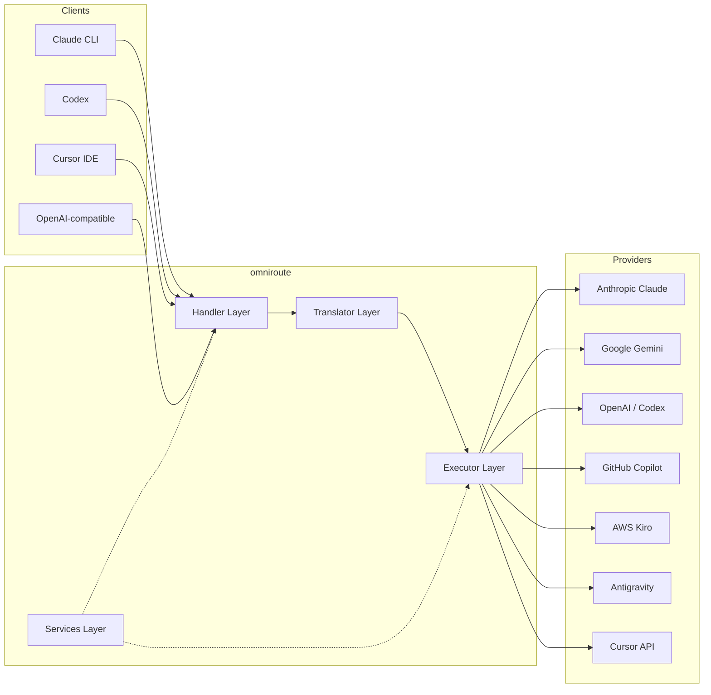
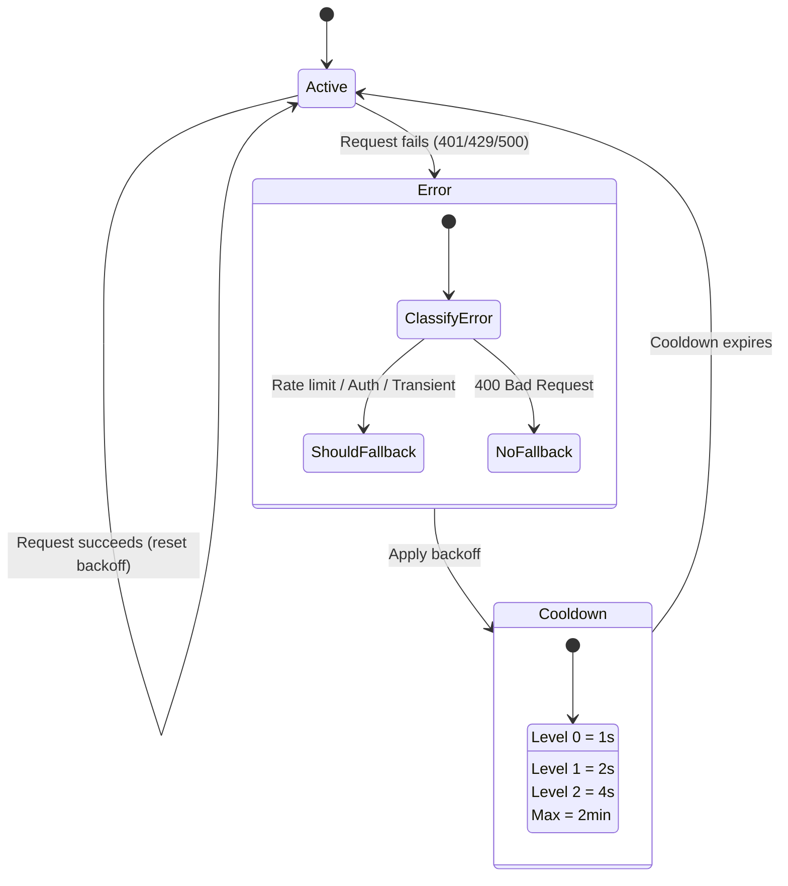
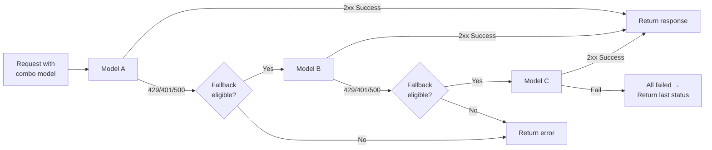
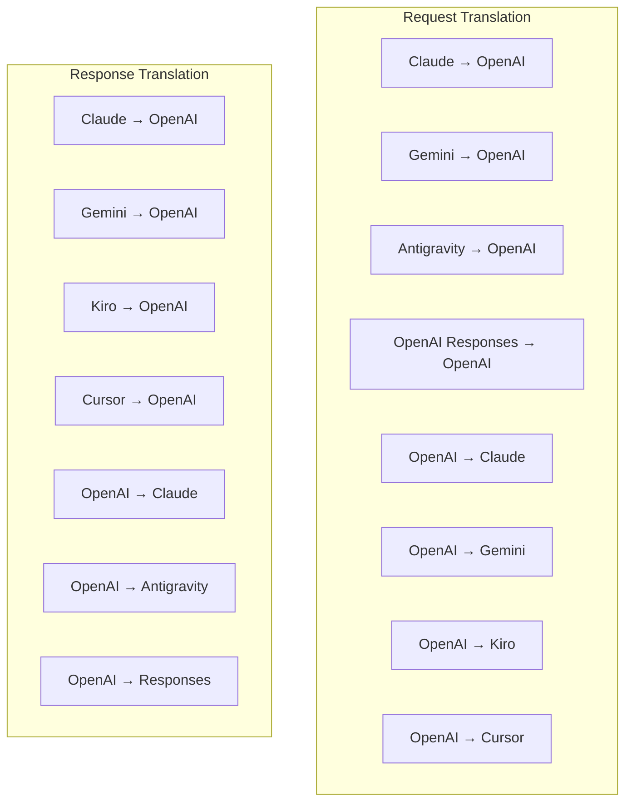
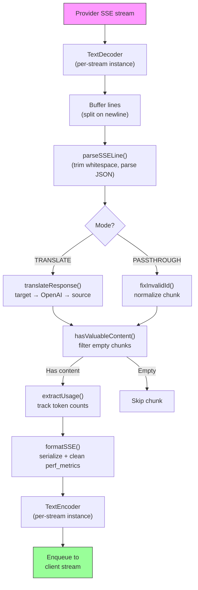
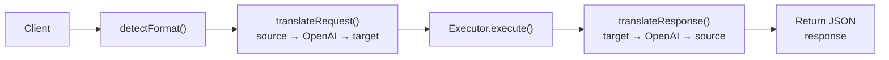
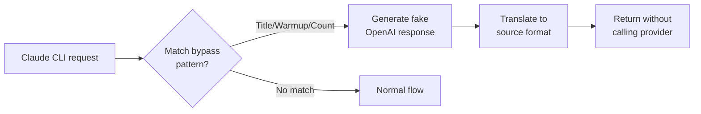

# omniroute — Codebase Documentation (한국어)

🌐 **Languages:** 🇺🇸 [English](../../../../docs/CODEBASE_DOCUMENTATION.md) · 🇪🇸 [es](../../es/docs/CODEBASE_DOCUMENTATION.md) · 🇫🇷 [fr](../../fr/docs/CODEBASE_DOCUMENTATION.md) · 🇩🇪 [de](../../de/docs/CODEBASE_DOCUMENTATION.md) · 🇮🇹 [it](../../it/docs/CODEBASE_DOCUMENTATION.md) · 🇷🇺 [ru](../../ru/docs/CODEBASE_DOCUMENTATION.md) · 🇨🇳 [zh-CN](../../zh-CN/docs/CODEBASE_DOCUMENTATION.md) · 🇯🇵 [ja](../../ja/docs/CODEBASE_DOCUMENTATION.md) · 🇰🇷 [ko](../../ko/docs/CODEBASE_DOCUMENTATION.md) · 🇸🇦 [ar](../../ar/docs/CODEBASE_DOCUMENTATION.md) · 🇮🇳 [hi](../../hi/docs/CODEBASE_DOCUMENTATION.md) · 🇮🇳 [in](../../in/docs/CODEBASE_DOCUMENTATION.md) · 🇹🇭 [th](../../th/docs/CODEBASE_DOCUMENTATION.md) · 🇻🇳 [vi](../../vi/docs/CODEBASE_DOCUMENTATION.md) · 🇮🇩 [id](../../id/docs/CODEBASE_DOCUMENTATION.md) · 🇲🇾 [ms](../../ms/docs/CODEBASE_DOCUMENTATION.md) · 🇳🇱 [nl](../../nl/docs/CODEBASE_DOCUMENTATION.md) · 🇵🇱 [pl](../../pl/docs/CODEBASE_DOCUMENTATION.md) · 🇸🇪 [sv](../../sv/docs/CODEBASE_DOCUMENTATION.md) · 🇳🇴 [no](../../no/docs/CODEBASE_DOCUMENTATION.md) · 🇩🇰 [da](../../da/docs/CODEBASE_DOCUMENTATION.md) · 🇫🇮 [fi](../../fi/docs/CODEBASE_DOCUMENTATION.md) · 🇵🇹 [pt](../../pt/docs/CODEBASE_DOCUMENTATION.md) · 🇷🇴 [ro](../../ro/docs/CODEBASE_DOCUMENTATION.md) · 🇭🇺 [hu](../../hu/docs/CODEBASE_DOCUMENTATION.md) · 🇧🇬 [bg](../../bg/docs/CODEBASE_DOCUMENTATION.md) · 🇸🇰 [sk](../../sk/docs/CODEBASE_DOCUMENTATION.md) · 🇺🇦 [uk-UA](../../uk-UA/docs/CODEBASE_DOCUMENTATION.md) · 🇮🇱 [he](../../he/docs/CODEBASE_DOCUMENTATION.md) · 🇵🇭 [phi](../../phi/docs/CODEBASE_DOCUMENTATION.md) · 🇧🇷 [pt-BR](../../pt-BR/docs/CODEBASE_DOCUMENTATION.md) · 🇨🇿 [cs](../../cs/docs/CODEBASE_DOCUMENTATION.md) · 🇹🇷 [tr](../../tr/docs/CODEBASE_DOCUMENTATION.md)

---

> **옴니루트**다중 제공자 AI 프록시 라우터에 대한 포괄적이고 초보자 친화적인 가이드입니다.---

## 1. What Is omniroute?

omniroute는 AI 클라이언트(Claude CLI, Codex, Cursor IDE 등)와 AI 공급자(Anthropic, Google, OpenAI, AWS, GitHub 등) 사이에 위치하는**프록시 라우터**입니다. 이는 하나의 큰 문제를 해결합니다.

> **다양한 AI 클라이언트는 서로 다른 "언어"(API 형식)를 사용하며, 다양한 AI 제공업체도 서로 다른 "언어"를 기대합니다.**omniroute는 이들 사이를 자동으로 변환합니다.

UN의 범용 통역사처럼 생각해보세요. 모든 대표는 모든 언어를 말할 수 있으며 번역자는 다른 대표를 위해 이를 변환합니다.---

## 2. Architecture Overview



### Core Principle: Hub-and-Spoke Translation

모든 형식 번역은**OpenAI 형식을 허브**로 통과합니다.```
Client Format → [OpenAI Hub] → Provider Format (request)
Provider Format → [OpenAI Hub] → Client Format (response)

```

즉,**N²**(모든 쌍) 대신**N 번역자**(형식당 하나)만 필요하다는 의미입니다.---

## 3. Project Structure

```

omniroute/
├── open-sse/ ← Core proxy library (portable, framework-agnostic)
│ ├── index.js ← Main entry point, exports everything
│ ├── config/ ← Configuration & constants
│ ├── executors/ ← Provider-specific request execution
│ ├── handlers/ ← Request handling orchestration
│ ├── services/ ← Business logic (auth, models, fallback, usage)
│ ├── translator/ ← Format translation engine
│ │ ├── request/ ← Request translators (8 files)
│ │ ├── response/ ← Response translators (7 files)
│ │ └── helpers/ ← Shared translation utilities (6 files)
│ └── utils/ ← Utility functions
├── src/ ← Application layer (Express/Worker runtime)
│ ├── app/ ← Web UI, API routes, middleware
│ ├── lib/ ← Database, auth, and shared library code
│ ├── mitm/ ← Man-in-the-middle proxy utilities
│ ├── models/ ← Database models
│ ├── shared/ ← Shared utilities (wrappers around open-sse)
│ ├── sse/ ← SSE endpoint handlers
│ └── store/ ← State management
├── data/ ← Runtime data (credentials, logs)
│ └── provider-credentials.json (external credentials override, gitignored)
└── tester/ ← Test utilities

````

---

## 4. Module-by-Module Breakdown

### 4.1 Config (`open-sse/config/`)

모든 공급자 구성에 대한**단일 정보 소스**.

| 파일 | 목적 |
| ---------------- | ----------------------------------------------------------------------------------------------------------------------------------------------------------------------------------------------- |
| `상수.ts` | 모든 공급자에 대한 기본 URL, OAuth 자격 증명(기본값), 헤더 및 기본 시스템 프롬프트가 포함된 `PROVIDERS` 개체입니다. 또한 `HTTP_STATUS`, `ERROR_TYPES`, `COOLDOWN_MS`, `BACKOFF_CONFIG` 및 `SKIP_PATTERNS`를 정의합니다. |
| 'credentialLoader.ts' | `data/provider-credentials.json`에서 외부 자격 증명을 로드하고 이를 `PROVIDERS`의 하드코딩된 기본값에 병합합니다. 이전 버전과의 호환성을 유지하면서 소스 제어에서 비밀을 유지합니다.               |
| `providerModels.ts` | 중앙 모델 레지스트리: 공급자 별칭 → 모델 ID를 매핑합니다. `getModels()`, `getProviderByAlias()`와 같은 함수.                                                                                                          |
| `codexInstructions.ts` | Codex 요청에 주입된 시스템 지침(제약 조건, 샌드박스 규칙, 승인 정책 편집)                                                                                                                 |
| `defaultThinkingSignature.ts` | Claude 및 Gemini 모델의 기본 "사고" 서명입니다.                                                                                                                                                               |
| `ollamaModels.ts` | 로컬 Ollama 모델에 대한 스키마 정의(이름, 크기, 계열, 양자화)                                                                                                                                             |#### Credential Loading Flow

```mermaid
flowchart TD
    A["App starts"] --> B["constants.ts defines PROVIDERS\nwith hardcoded defaults"]
    B --> C{"data/provider-credentials.json\nexists?"}
    C -->|Yes| D["credentialLoader reads JSON"]
    C -->|No| E["Use hardcoded defaults"]
    D --> F{"For each provider in JSON"}
    F --> G{"Provider exists\nin PROVIDERS?"}
    G -->|No| H["Log warning, skip"]
    G -->|Yes| I{"Value is object?"}
    I -->|No| J["Log warning, skip"]
    I -->|Yes| K["Merge clientId, clientSecret,\ntokenUrl, authUrl, refreshUrl"]
    K --> F
    H --> F
    J --> F
    F -->|Done| L["PROVIDERS ready with\nmerged credentials"]
    E --> L
````

---

### 4.2 Executors (`open-sse/executors/`)

실행자는**전략 패턴**을 사용하여**제공자별 로직**을 캡슐화합니다. 각 실행자는 필요에 따라 기본 메서드를 재정의합니다.```mermaid
classDiagram
class BaseExecutor {
+buildUrl(model, stream, options)
+buildHeaders(credentials, stream, body)
+transformRequest(body, model, stream, credentials)
+execute(url, options)
+shouldRetry(status, error)
+refreshCredentials(credentials, log)
}

    class DefaultExecutor {
        +refreshCredentials()
    }

    class AntigravityExecutor {
        +buildUrl()
        +buildHeaders()
        +transformRequest()
        +shouldRetry()
        +refreshCredentials()
    }

    class CursorExecutor {
        +buildUrl()
        +buildHeaders()
        +transformRequest()
        +parseResponse()
        +generateChecksum()
    }

    class KiroExecutor {
        +buildUrl()
        +buildHeaders()
        +transformRequest()
        +parseEventStream()
        +refreshCredentials()
    }

    BaseExecutor <|-- DefaultExecutor
    BaseExecutor <|-- AntigravityExecutor
    BaseExecutor <|-- CursorExecutor
    BaseExecutor <|-- KiroExecutor
    BaseExecutor <|-- CodexExecutor
    BaseExecutor <|-- GeminiCLIExecutor
    BaseExecutor <|-- GithubExecutor

````

| 집행자 | 공급자 | 주요 전문 분야 |
| ---------------- | ----------------------------- | ----------------------------------------------------------------------------------------- |
| `base.ts` | — | 추상 기반: URL 구축, 헤더, 재시도 논리, 자격 증명 새로 고침 |
| `default.ts` | 클로드, 제미니, OpenAI, GLM, 키미, 미니맥스 | 표준 공급자를 위한 일반 OAuth 토큰 새로 고침 |
| `반중력.ts` | Google 클라우드 코드 | 프로젝트/세션 ID 생성, 다중 URL 대체, 오류 메시지에서 사용자 정의 재시도 구문 분석("2시간 7분 23초 후 재설정") |
| `cursor.ts` | 커서 IDE |**가장 복잡함**: SHA-256 체크섬 인증, Protobuf 요청 인코딩, 바이너리 EventStream → SSE 응답 구문 분석 |
| `codex.ts` | OpenAI 코덱스 | 시스템 지침 주입, ​​사고 수준 관리, 지원되지 않는 매개변수 제거 |
| `gemini-cli.ts` | 구글 제미니 CLI | 맞춤 URL 구축(`streamGenerateContent`), Google OAuth 토큰 새로고침 |
| `github.ts` | GitHub 부조종사 | 듀얼 토큰 시스템(GitHub OAuth + Copilot 토큰), VSCode 헤더 모방 |
| `kiro.ts` | AWS 코드위스퍼러 | AWS EventStream 바이너리 구문 분석, AMZN 이벤트 프레임, 토큰 추정 |
| `index.ts` | — | 팩토리: 기본 폴백을 사용하여 공급자 이름 → 실행자 클래스 매핑 |---

### 4.3 Handlers (`open-sse/handlers/`)

**조정 레이어**— 번역, 실행, 스트리밍 및 오류 처리를 조정합니다.

| 파일 | 목적 |
| -------- | -------------------------------------------------------------------------------------------------------------------------------------------------------------------------------------------- |
| `chatCore.ts` |**중앙 오케스트레이터**(~600줄). 형식 감지 → 변환 → 실행기 디스패치 → 스트리밍/비스트리밍 응답 → 토큰 새로 고침 → 오류 처리 → 사용 로깅 등 전체 요청 수명 주기를 처리합니다. |
| `responsesHandler.ts` | OpenAI의 응답 API용 어댑터: 응답 형식 변환 → 채팅 완료 → 'chatCore'로 전송 → SSE를 다시 응답 형식으로 변환합니다.                                                                        |
| `embeddings.ts` | 임베딩 생성 핸들러: 임베딩 모델 → 공급자를 확인하고 공급자 API로 디스패치하고 OpenAI 호환 임베딩 응답을 반환합니다. 6개 이상의 공급자를 지원합니다.                                                    |
| `imageGeneration.ts` | 이미지 생성 핸들러: 이미지 모델 → 공급자를 확인하고 OpenAI 호환, Gemini 이미지(반중력) 및 폴백(Nebius) 모드를 지원합니다. base64 또는 URL 이미지를 반환합니다.                                          |#### Request Lifecycle (chatCore.ts)

```mermaid
sequenceDiagram
    participant Client
    participant chatCore
    participant Translator
    participant Executor
    participant Provider

    Client->>chatCore: Request (any format)
    chatCore->>chatCore: Detect source format
    chatCore->>chatCore: Check bypass patterns
    chatCore->>chatCore: Resolve model & provider
    chatCore->>Translator: Translate request (source → OpenAI → target)
    chatCore->>Executor: Get executor for provider
    Executor->>Executor: Build URL, headers, transform request
    Executor->>Executor: Refresh credentials if needed
    Executor->>Provider: HTTP fetch (streaming or non-streaming)

    alt Streaming
        Provider-->>chatCore: SSE stream
        chatCore->>chatCore: Pipe through SSE transform stream
        Note over chatCore: Transform stream translates<br/>each chunk: target → OpenAI → source
        chatCore-->>Client: Translated SSE stream
    else Non-streaming
        Provider-->>chatCore: JSON response
        chatCore->>Translator: Translate response
        chatCore-->>Client: Translated JSON
    end

    alt Error (401, 429, 500...)
        chatCore->>Executor: Retry with credential refresh
        chatCore->>chatCore: Account fallback logic
    end
````

---

### 4.4 Services (`open-sse/services/`)

| 처리기와 실행기를 지원하는 비즈니스 논리입니다. | File                                                                                                                                                                                                                                                                                                                                   | Purpose |
| ----------------------------------------------- | -------------------------------------------------------------------------------------------------------------------------------------------------------------------------------------------------------------------------------------------------------------------------------------------------------------------------------------- | ------- |
| `provider.ts`                                   | **Format detection** (`detectFormat`): analyzes request body structure to identify Claude/OpenAI/Gemini/Antigravity/Responses formats (includes `max_tokens` heuristic for Claude). Also: URL building, header building, thinking config normalization. Supports `openai-compatible-*` and `anthropic-compatible-*` dynamic providers. |
| `model.ts`                                      | Model string parsing (`claude/model-name` → `{provider: "claude", model: "model-name"}`), alias resolution with collision detection, input sanitization (rejects path traversal/control chars), and model info resolution with async alias getter support.                                                                             |
| `accountFallback.ts`                            | Rate-limit handling: exponential backoff (1s → 2s → 4s → max 2min), account cooldown management, error classification (which errors trigger fallback vs. not).                                                                                                                                                                         |
| `tokenRefresh.ts`                               | OAuth token refresh for **every provider**: Google (Gemini, Antigravity), Claude, Codex, Qwen, Qoder, GitHub (OAuth + Copilot dual-token), Kiro (AWS SSO OIDC + Social Auth). Includes in-flight promise deduplication cache and retry with exponential backoff.                                                                       |
| `combo.ts`                                      | **Combo models**: chains of fallback models. If model A fails with a fallback-eligible error, try model B, then C, etc. Returns actual upstream status codes.                                                                                                                                                                          |
| `usage.ts`                                      | Fetches quota/usage data from provider APIs (GitHub Copilot quotas, Antigravity model quotas, Codex rate limits, Kiro usage breakdowns, Claude settings).                                                                                                                                                                              |
| `accountSelector.ts`                            | Smart account selection with scoring algorithm: considers priority, health status, round-robin position, and cooldown state to pick the optimal account for each request.                                                                                                                                                              |
| `contextManager.ts`                             | Request context lifecycle management: creates and tracks per-request context objects with metadata (request ID, timestamps, provider info) for debugging and logging.                                                                                                                                                                  |
| `ipFilter.ts`                                   | IP-based access control: supports allowlist and blocklist modes. Validates client IP against configured rules before processing API requests.                                                                                                                                                                                          |
| `sessionManager.ts`                             | Session tracking with client fingerprinting: tracks active sessions using hashed client identifiers, monitors request counts, and provides session metrics.                                                                                                                                                                            |
| `signatureCache.ts`                             | Request signature-based deduplication cache: prevents duplicate requests by caching recent request signatures and returning cached responses for identical requests within a time window.                                                                                                                                              |
| `systemPrompt.ts`                               | Global system prompt injection: prepends or appends a configurable system prompt to all requests, with per-provider compatibility handling.                                                                                                                                                                                            |
| `thinkingBudget.ts`                             | Reasoning token budget management: supports passthrough, auto (strip thinking config), custom (fixed budget), and adaptive (complexity-scaled) modes for controlling thinking/reasoning tokens.                                                                                                                                        |
| `wildcardRouter.ts`                             | Wildcard model pattern routing: resolves wildcard patterns (e.g., `*/claude-*`) to concrete provider/model pairs based on availability and priority.                                                                                                                                                                                   |

#### Token Refresh Deduplication

```mermaid
sequenceDiagram
    participant R1 as Request 1
    participant R2 as Request 2
    participant Cache as refreshPromiseCache
    participant OAuth as OAuth Provider

    R1->>Cache: getAccessToken("gemini", token)
    Cache->>Cache: No in-flight promise
    Cache->>OAuth: Start refresh
    R2->>Cache: getAccessToken("gemini", token)
    Cache->>Cache: Found in-flight promise
    Cache-->>R2: Return existing promise
    OAuth-->>Cache: New access token
    Cache-->>R1: New access token
    Cache-->>R2: Same access token (shared)
    Cache->>Cache: Delete cache entry
```

#### Account Fallback State Machine



#### Combo Model Chain



---

### 4.5 Translator (`open-sse/translator/`)

자체 등록 플러그인 시스템을 사용하는**형식 번역 엔진**.#### 아키텍처



| 디렉토리     | 파일         | 설명                                                                                                                                                                                                                 |
| ------------ | ------------ | -------------------------------------------------------------------------------------------------------------------------------------------------------------------------------------------------------------------- | ----------------------------------------- |
| `요청/`      | 8명의 번역가 | 형식 간에 요청 본문을 변환합니다. 각 파일은 가져올 때 `register(from, to, fn)`를 통해 자체 등록됩니다.                                                                                                               |
| `응답/`      | 7명의 번역자 | 형식 간에 스트리밍 응답 청크를 변환합니다. SSE 이벤트 유형, 사고 블록, 도구 호출을 처리합니다.                                                                                                                       |
| `도우미/`    | 도우미 6명   | 공유 유틸리티: `claudeHelper`(시스템 프롬프트 추출, 사고 구성), `geminiHelper`(부품/콘텐츠 매핑), `openaiHelper`(형식 필터링), `toolCallHelper`(ID 생성, 누락된 응답 주입), `maxTokensHelper`, `responsesApiHelper`. |
| `index.ts`   | —            | 번역 엔진: `translateRequest()`, `translateResponse()`, 상태 관리, 레지스트리.                                                                                                                                       |
| `formats.ts` | —            | 형식 상수: `OPENAI`, `CLAUDE`, `GEMINI`, `ANTIGRAVITY`, `KIRO`, `CURSOR`, `OPENAI_RESPONSES`.                                                                                                                        | #### Key Design: Self-Registering Plugins |

```javascript
// Each translator file calls register() on import:
import { register } from "../index.js";
register("claude", "openai", translateClaudeToOpenAI);

// The index.js imports all translator files, triggering registration:
import "./request/claude-to-openai.js"; // ← self-registers
```

---

### 4.6 Utils (`open-sse/utils/`)

| 파일               | 목적                                                                                                                                                                                                                                                      |
| ------------------ | --------------------------------------------------------------------------------------------------------------------------------------------------------------------------------------------------------------------------------------------------------- | --------------------------- |
| `error.ts`         | 오류 응답 구축(OpenAI 호환 형식), 업스트림 오류 구문 분석, 오류 메시지에서 반중력 재시도 시간 추출, SSE 오류 스트리밍.                                                                                                                                    |
| `stream.ts`        | **SSE 변환 스트림**— 핵심 스트리밍 파이프라인입니다. 두 가지 모드: `TRANSLATE`(전체 형식 번역) 및 `PASSTHROUGH`(정규화 + 사용법 추출). 청크 버퍼링, 사용량 추정, 콘텐츠 길이 추적을 처리합니다. 스트림별 인코더/디코더 인스턴스는 공유 상태를 방지합니다. |
| `streamHelpers.ts` | 하위 수준 SSE 유틸리티: `parseSSELine`(공백 허용), `hasValuableContent`(OpenAI/Claude/Gemini의 빈 청크 필터링), `fixInvalidId`, `formatSSE`(`perf_metrics` 정리를 통한 형식 인식 SSE 직렬화).                                                             |
| `usageTracking.ts` | 모든 형식(Claude/OpenAI/Gemini/Responses)에서 토큰 사용량 추출, 별도 도구/토큰당 메시지 문자 비율을 사용한 추정, 버퍼 추가(2000 토큰 안전 마진), 형식별 필드 필터링, ANSI 색상을 사용한 콘솔 로깅.                                                        |
| `requestLogger.ts` | Legacy file-based request logging helper kept for compatibility. Current deployments should prefer `APP_LOG_TO_FILE` for application logs and the call log pipeline for persisted request artifacts.                                                      |
| `bypassHandler.ts` | Claude CLI(제목 추출, 워밍업, 카운트)의 특정 패턴을 가로채고 공급자를 호출하지 않고 가짜 응답을 반환합니다. 스트리밍과 비스트리밍을 모두 지원합니다. 의도적으로 Claude CLI 범위로 제한되었습니다.                                                         |
| `networkProxy.ts`  | 공급자별 구성 → 전역 구성 → 환경 변수(`HTTPS_PROXY`/`HTTP_PROXY`/`ALL_PROXY`) 우선 순위에 따라 특정 공급자에 대한 아웃바운드 프록시 URL을 확인합니다. 'NO_PROXY' 제외를 지원합니다. 30초 동안 캐시 구성.                                                  | #### SSE Streaming Pipeline |



#### Request Logger Session Structure

```
logs/
└── claude_gemini_claude-sonnet_20260208_143045/
    ├── 1_req_client.json      ← Raw client request
    ├── 2_req_source.json      ← After initial conversion
    ├── 3_req_openai.json      ← OpenAI intermediate format
    ├── 4_req_target.json      ← Final target format
    ├── 5_res_provider.txt     ← Provider SSE chunks (streaming)
    ├── 5_res_provider.json    ← Provider response (non-streaming)
    ├── 6_res_openai.txt       ← OpenAI intermediate chunks
    ├── 7_res_client.txt       ← Client-facing SSE chunks
    └── 6_error.json           ← Error details (if any)
```

---

### 4.7 Application Layer (`src/`)

| 디렉토리     | 목적                                                                |
| ------------ | ------------------------------------------------------------------- | ----------------------- |
| `src/앱/`    | 웹 UI, API 경로, Express 미들웨어, OAuth 콜백 핸들러                |
| `src/lib/`   | 데이터베이스 액세스(`localDb.ts`, `usageDb.ts`), 인증, 공유         |
| `src/mitm/`  | 공급자 트래픽을 가로채기 위한 중간자 프록시 유틸리티                |
| `src/모델/`  | 데이터베이스 모델 정의                                              |
| `src/공유/`  | open-sse 함수에 대한 래퍼(공급자, 스트림, 오류 등)                  |
| `src/sse/`   | open-sse 라이브러리를 Express 경로에 연결하는 SSE 엔드포인트 핸들러 |
| `src/store/` | 애플리케이션 상태 관리                                              | #### Notable API Routes |

| 경로                                      | 방법               | 목적                                                                             |
| ----------------------------------------- | ------------------ | -------------------------------------------------------------------------------- | --- |
| `/api/provider-models`                    | 가져오기/게시/삭제 | 공급자별 사용자 정의 모델을 위한 CRUD                                            |
| `/api/모델/카탈로그`                      | 받기               | 공급자별로 그룹화된 모든 모델(채팅, 임베딩, 이미지, 사용자 정의)의 집계 카탈로그 |
| `/api/settings/proxy`                     | 가져오기/넣기/삭제 | 계층적 아웃바운드 프록시 구성(`global/providers/combos/keys`)                    |
| `/api/settings/proxy/test`                | 포스트             | 프록시 연결을 확인하고 공용 IP/지연 시간을 반환합니다.                           |
| `/v1/providers/[제공자]/chat/completions` | 포스트             | 모델 검증을 통한 제공업체별 전용 채팅 완료                                       |
| `/v1/providers/[제공자]/embeddings`       | 포스트             | 모델 검증을 통한 제공자별 전용 임베딩                                            |
| `/v1/providers/[제공자]/이미지/세대`      | 포스트             | 모델 검증을 통한 제공자별 전용 이미지 생성                                       |
| `/api/settings/ip-필터`                   | 가져오기/넣기      | IP 허용 목록/차단 목록 관리                                                      |
| `/api/settings/thinking-budget`           | 가져오기/넣기      | 토큰 예산 구성 추론(통과/자동/맞춤/적응)                                         |
| `/api/settings/system-prompt`             | 가져오기/넣기      | 모든 요청에 ​​대해 글로벌 시스템 프롬프트 주입                                   |
| `/api/세션`                               | 받기               | 활성 세션 추적 및 측정항목                                                       |
| `/api/속도 제한`                          | 받기               | 계정별 비율한도 현황                                                             | --- |

## 5. Key Design Patterns

### 5.1 Hub-and-Spoke Translation

모든 형식은**OpenAI 형식을 허브**로 통해 변환됩니다. 새 공급자를 추가하려면 N 쌍이 아닌**한 쌍**의 번역기(OpenAI 간)만 작성하면 됩니다.### 5.2 Executor Strategy Pattern

각 공급자에는 `BaseExecutor`에서 상속된 전용 실행기 클래스가 있습니다. `executors/index.ts`에 있는 팩토리는 런타임에 올바른 것을 선택합니다.### 5.3 Self-Registering Plugin System

번역기 모듈은 `register()`를 통해 가져올 때 자신을 등록합니다. 새로운 번역자를 추가하는 것은 파일을 생성하고 가져오는 것뿐입니다.### 5.4 Account Fallback with Exponential Backoff

공급자가 429/401/500을 반환하면 시스템은 지수 쿨다운(1초 → 2초 → 4초 → 최대 2분)을 적용하여 다음 계정으로 전환할 수 있습니다.### 5.5 Combo Model Chains

"콤보"는 여러 `공급자/모델` 문자열을 그룹화합니다. 첫 번째 작업이 실패하면 자동으로 다음 작업으로 대체됩니다.### 5.6 Stateful Streaming Translation

응답 변환은 `initState()` 메커니즘을 통해 SSE 청크(사고 블록 추적, 도구 호출 누적, 콘텐츠 블록 인덱싱) 전체에서 상태를 유지합니다.### 5.7 Usage Safety Buffer

시스템 프롬프트 및 형식 변환의 오버헤드로 인해 클라이언트가 컨텍스트 창 제한에 도달하는 것을 방지하기 위해 보고된 사용량에 2000토큰 버퍼가 추가되었습니다.---

## 6. Supported Formats

| 형식             | 방향        | 식별자        |
| ---------------- | ----------- | ------------- | --- |
| OpenAI 채팅 완료 | 소스 + 타겟 | '오픈아이'    |
| OpenAI 응답 API  | 소스 + 타겟 | 'openai-응답' |
| 인류학 클로드    | 소스 + 타겟 | '클로드'      |
| 구글 제미니      | 소스 + 타겟 | `쌍둥이자리`  |
| 구글 제미니 CLI  | 대상만      | `gemini-cli`  |
| 반중력           | 소스 + 타겟 | '반중력'      |
| AWS 키로         | 대상만      | '키로'        |
| 커서             | 대상만      | `커서`        | --- |

## 7. Supported Providers

| 공급자              | 인증 방법              | 집행자    | 주요 내용                                   |
| ------------------- | ---------------------- | --------- | ------------------------------------------- | --- |
| 인류학 클로드       | API 키 또는 OAuth      | 기본값    | `x-api-key` 헤더 사용                       |
| 구글 제미니         | API 키 또는 OAuth      | 기본값    | `x-goog-api-key` 헤더 사용                  |
| 구글 제미니 CLI     | OAuth                  | 쌍둥이CLI | `streamGenerateContent` 엔드포인트 사용     |
| 반중력              | OAuth                  | 반중력    | 다중 URL 대체, 사용자 정의 재시도 구문 분석 |
| 오픈AI              | API 키                 | 기본값    | 표준 무기명 인증                            |
| 코덱스              | OAuth                  | 코덱스    | 시스템 지침 주입, ​​사고 관리               |
| GitHub 부조종사     | OAuth + Copilot 토큰   | 깃허브    | 듀얼 토큰, VSCode 헤더 모방                 |
| 키로(AWS)           | AWS SSO OIDC 또는 소셜 | 키로      | 바이너리 EventStream 구문 분석              |
| 커서 IDE            | 체크섬 인증            | 커서      | Protobuf 인코딩, SHA-256 체크섬             |
| 퀀                  | OAuth                  | 기본값    | 표준 인증                                   |
| Qoder               | OAuth(기본 + 전달자)   | 기본값    | 이중 인증 헤더                              |
| 오픈라우터          | API 키                 | 기본값    | 표준 무기명 인증                            |
| GLM, 키미, 미니맥스 | API 키                 | 기본값    | Claude 호환, `x-api-key` 사용               |
| `openai-호환-*`     | API 키                 | 기본값    | 동적: 모든 OpenAI 호환 엔드포인트           |
| `인류와 호환되는-*` | API 키                 | 기본값    | 동적: Claude와 호환되는 모든 엔드포인트     | --- |

## 8. Data Flow Summary

### Streaming Request

```mermaid
flowchart LR
    A["Client"] --> B["detectFormat()"]
    B --> C["translateRequest()\nsource → OpenAI → target"]
    C --> D["Executor\nbuildUrl + buildHeaders"]
    D --> E["fetch(providerURL)"]
    E --> F["createSSEStream()\nTRANSLATE mode"]
    F --> G["parseSSELine()"]
    G --> H["translateResponse()\ntarget → OpenAI → source"]
    H --> I["extractUsage()\n+ addBuffer"]
    I --> J["formatSSE()"]
    J --> K["Client receives\ntranslated SSE"]
    K --> L["logUsage()\nsaveRequestUsage()"]
```



### Non-Streaming Request



### Bypass Flow (Claude CLI)


