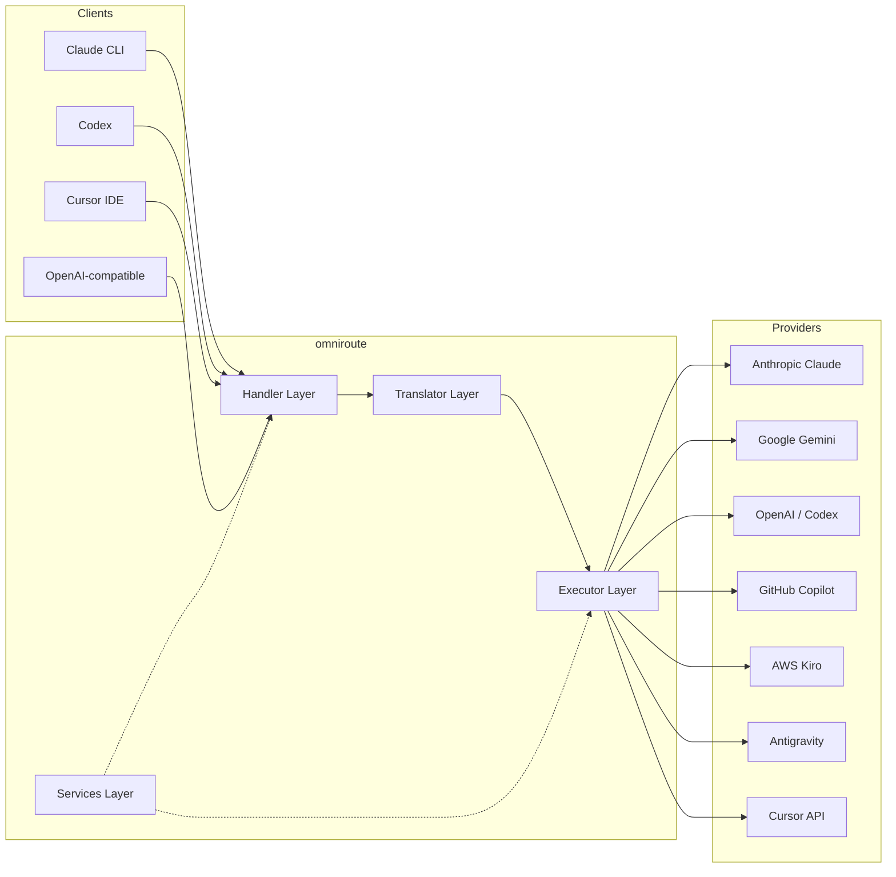
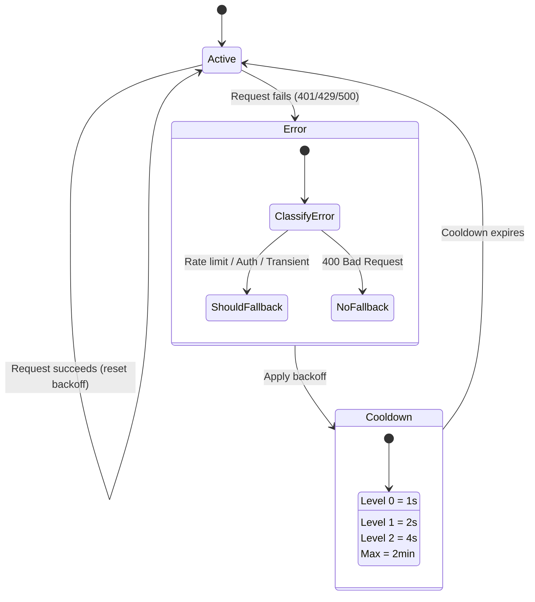
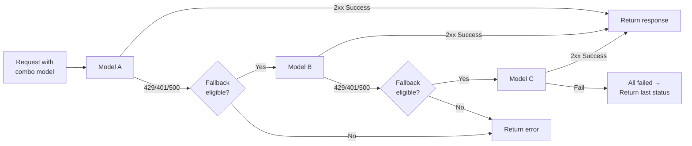
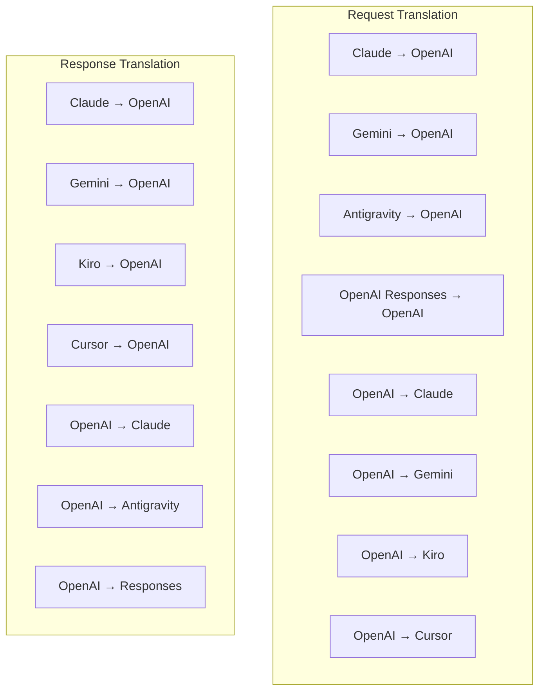
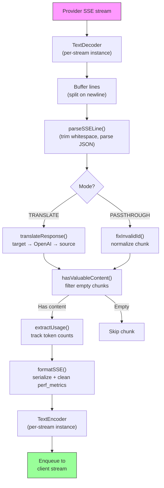
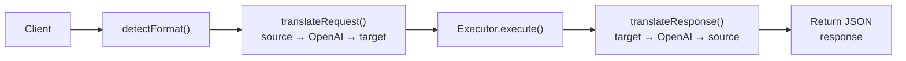
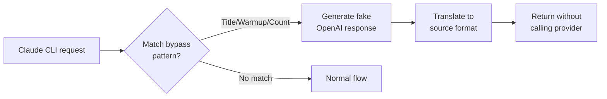

# omniroute — Codebase Documentation (Bahasa Melayu)

🌐 **Languages:** 🇺🇸 [English](../../../../docs/CODEBASE_DOCUMENTATION.md) · 🇪🇸 [es](../../es/docs/CODEBASE_DOCUMENTATION.md) · 🇫🇷 [fr](../../fr/docs/CODEBASE_DOCUMENTATION.md) · 🇩🇪 [de](../../de/docs/CODEBASE_DOCUMENTATION.md) · 🇮🇹 [it](../../it/docs/CODEBASE_DOCUMENTATION.md) · 🇷🇺 [ru](../../ru/docs/CODEBASE_DOCUMENTATION.md) · 🇨🇳 [zh-CN](../../zh-CN/docs/CODEBASE_DOCUMENTATION.md) · 🇯🇵 [ja](../../ja/docs/CODEBASE_DOCUMENTATION.md) · 🇰🇷 [ko](../../ko/docs/CODEBASE_DOCUMENTATION.md) · 🇸🇦 [ar](../../ar/docs/CODEBASE_DOCUMENTATION.md) · 🇮🇳 [hi](../../hi/docs/CODEBASE_DOCUMENTATION.md) · 🇮🇳 [in](../../in/docs/CODEBASE_DOCUMENTATION.md) · 🇹🇭 [th](../../th/docs/CODEBASE_DOCUMENTATION.md) · 🇻🇳 [vi](../../vi/docs/CODEBASE_DOCUMENTATION.md) · 🇮🇩 [id](../../id/docs/CODEBASE_DOCUMENTATION.md) · 🇲🇾 [ms](../../ms/docs/CODEBASE_DOCUMENTATION.md) · 🇳🇱 [nl](../../nl/docs/CODEBASE_DOCUMENTATION.md) · 🇵🇱 [pl](../../pl/docs/CODEBASE_DOCUMENTATION.md) · 🇸🇪 [sv](../../sv/docs/CODEBASE_DOCUMENTATION.md) · 🇳🇴 [no](../../no/docs/CODEBASE_DOCUMENTATION.md) · 🇩🇰 [da](../../da/docs/CODEBASE_DOCUMENTATION.md) · 🇫🇮 [fi](../../fi/docs/CODEBASE_DOCUMENTATION.md) · 🇵🇹 [pt](../../pt/docs/CODEBASE_DOCUMENTATION.md) · 🇷🇴 [ro](../../ro/docs/CODEBASE_DOCUMENTATION.md) · 🇭🇺 [hu](../../hu/docs/CODEBASE_DOCUMENTATION.md) · 🇧🇬 [bg](../../bg/docs/CODEBASE_DOCUMENTATION.md) · 🇸🇰 [sk](../../sk/docs/CODEBASE_DOCUMENTATION.md) · 🇺🇦 [uk-UA](../../uk-UA/docs/CODEBASE_DOCUMENTATION.md) · 🇮🇱 [he](../../he/docs/CODEBASE_DOCUMENTATION.md) · 🇵🇭 [phi](../../phi/docs/CODEBASE_DOCUMENTATION.md) · 🇧🇷 [pt-BR](../../pt-BR/docs/CODEBASE_DOCUMENTATION.md) · 🇨🇿 [cs](../../cs/docs/CODEBASE_DOCUMENTATION.md) · 🇹🇷 [tr](../../tr/docs/CODEBASE_DOCUMENTATION.md)

---

> Panduan komprehensif dan mesra pemula kepada penghala proksi AI**omniroute**berbilang pembekal.---

## 1. What Is omniroute?

omniroute ialah**penghala proksi**yang terletak di antara klien AI (Claude CLI, Codex, Cursor IDE, dll.) dan penyedia AI (Anthropic, Google, OpenAI, AWS, GitHub, dsb.). Ia menyelesaikan satu masalah besar:

> **Pelanggan AI yang berbeza bercakap "bahasa" yang berbeza (format API), dan pembekal AI yang berbeza juga mengharapkan "bahasa" yang berbeza.**omniroute menterjemah antara mereka secara automatik.

Anggaplah ia seperti penterjemah universal di Pertubuhan Bangsa-Bangsa Bersatu — mana-mana perwakilan boleh bercakap apa-apa bahasa, dan penterjemah menukarnya untuk mana-mana perwakilan lain.---

## 2. Architecture Overview



### Core Principle: Hub-and-Spoke Translation

Semua terjemahan format melalui**format OpenAI sebagai hab**:```
Client Format → [OpenAI Hub] → Provider Format (request)
Provider Format → [OpenAI Hub] → Client Format (response)

```

Ini bermakna anda hanya memerlukan**N penterjemah**(satu setiap format) dan bukannya**N²**(setiap pasangan).---

## 3. Project Structure

```

omniroute/
├── open-sse/ ← Core proxy library (portable, framework-agnostic)
│ ├── index.js ← Main entry point, exports everything
│ ├── config/ ← Configuration & constants
│ ├── executors/ ← Provider-specific request execution
│ ├── handlers/ ← Request handling orchestration
│ ├── services/ ← Business logic (auth, models, fallback, usage)
│ ├── translator/ ← Format translation engine
│ │ ├── request/ ← Request translators (8 files)
│ │ ├── response/ ← Response translators (7 files)
│ │ └── helpers/ ← Shared translation utilities (6 files)
│ └── utils/ ← Utility functions
├── src/ ← Application layer (Express/Worker runtime)
│ ├── app/ ← Web UI, API routes, middleware
│ ├── lib/ ← Database, auth, and shared library code
│ ├── mitm/ ← Man-in-the-middle proxy utilities
│ ├── models/ ← Database models
│ ├── shared/ ← Shared utilities (wrappers around open-sse)
│ ├── sse/ ← SSE endpoint handlers
│ └── store/ ← State management
├── data/ ← Runtime data (credentials, logs)
│ └── provider-credentials.json (external credentials override, gitignored)
└── tester/ ← Test utilities

````

---

## 4. Module-by-Module Breakdown

### 4.1 Config (`open-sse/config/`)

**Sumber tunggal kebenaran**untuk semua konfigurasi pembekal.

| Fail | Tujuan |
| ---------------------------- | -----------------------------------------------------------------------------------------------------------------------------------------------------------------------------------------------------------------------------------------------------------------------------------------------------------------------------------
| `pemalar.ts` | Objek `PROVIDERS` dengan URL asas, bukti kelayakan OAuth (lalai), pengepala dan gesaan sistem lalai untuk setiap pembekal. Juga mentakrifkan `HTTP_STATUS`, `ERROR_TYPES`, `COOLDOWN_MS`, `BACKOFF_CONFIG` dan `SKIP_PATTERNS`. |
| `credentialLoader.ts` | Memuatkan bukti kelayakan luaran daripada `data/provider-credentials.json` dan menggabungkannya pada lalai berkod keras dalam `PROVIDERS`. Menyimpan rahsia di luar kawalan sumber sambil mengekalkan keserasian ke belakang.               |
| `providerModels.ts` | Pendaftaran model pusat: alias penyedia peta → ID model. Berfungsi seperti `getModels()`, `getProviderByAlias()`.                                                                                                          |
| `codexInstructions.ts` | Arahan sistem disuntik ke dalam permintaan Codex (kekangan pengeditan, peraturan kotak pasir, dasar kelulusan).                                                                                                                 |
| `defaultThinkingSignature.ts` | Tanda tangan "berfikir" lalai untuk model Claude dan Gemini.                                                                                                                                                               |
| `ollamaModels.ts` | Takrif skema untuk model Ollama tempatan (nama, saiz, keluarga, pengkuantitian).                                                                                                                                             |#### Credential Loading Flow

```mermaid
flowchart TD
    A["App starts"] --> B["constants.ts defines PROVIDERS\nwith hardcoded defaults"]
    B --> C{"data/provider-credentials.json\nexists?"}
    C -->|Yes| D["credentialLoader reads JSON"]
    C -->|No| E["Use hardcoded defaults"]
    D --> F{"For each provider in JSON"}
    F --> G{"Provider exists\nin PROVIDERS?"}
    G -->|No| H["Log warning, skip"]
    G -->|Yes| I{"Value is object?"}
    I -->|No| J["Log warning, skip"]
    I -->|Yes| K["Merge clientId, clientSecret,\ntokenUrl, authUrl, refreshUrl"]
    K --> F
    H --> F
    J --> F
    F -->|Done| L["PROVIDERS ready with\nmerged credentials"]
    E --> L
````

---

### 4.2 Executors (`open-sse/executors/`)

Pelaksana merangkum**logik khusus pembekal**menggunakan**Corak Strategi**. Setiap pelaksana mengatasi kaedah asas seperti yang diperlukan.```mermaid
classDiagram
class BaseExecutor {
+buildUrl(model, stream, options)
+buildHeaders(credentials, stream, body)
+transformRequest(body, model, stream, credentials)
+execute(url, options)
+shouldRetry(status, error)
+refreshCredentials(credentials, log)
}

    class DefaultExecutor {
        +refreshCredentials()
    }

    class AntigravityExecutor {
        +buildUrl()
        +buildHeaders()
        +transformRequest()
        +shouldRetry()
        +refreshCredentials()
    }

    class CursorExecutor {
        +buildUrl()
        +buildHeaders()
        +transformRequest()
        +parseResponse()
        +generateChecksum()
    }

    class KiroExecutor {
        +buildUrl()
        +buildHeaders()
        +transformRequest()
        +parseEventStream()
        +refreshCredentials()
    }

    BaseExecutor <|-- DefaultExecutor
    BaseExecutor <|-- AntigravityExecutor
    BaseExecutor <|-- CursorExecutor
    BaseExecutor <|-- KiroExecutor
    BaseExecutor <|-- CodexExecutor
    BaseExecutor <|-- GeminiCLIExecutor
    BaseExecutor <|-- GithubExecutor

````

| Pelaksana | Pembekal | Pengkhususan Utama |
| ---------------- | ------------------------------------------ | ------------------------------------------------------------------------------------------------------------------- |
| `base.ts` | — | Asas abstrak: Pembinaan URL, pengepala, cuba semula logik, penyegaran semula kelayakan |
| `default.ts` | Claude, Gemini, OpenAI, GLM, Kimi, MiniMax | Muat semula token OAuth generik untuk pembekal standard |
| `antigravity.ts` | Kod Awan Google | Penjanaan ID projek/sesi, sandaran berbilang URL, cuba semula tersuai menghuraikan daripada mesej ralat ("set semula selepas 2h7m23s") |
| `cursor.ts` | IDE kursor |**Paling kompleks**: Pengesahan checksum SHA-256, pengekodan permintaan Protobuf, Perduaan EventStream → Penghuraian respons SSE |
| `codex.ts` | OpenAI Codex | Menyuntik arahan sistem, mengurus tahap pemikiran, mengalih keluar parameter yang tidak disokong |
| `gemini-cli.ts` | Google Gemini CLI | Pembinaan URL tersuai (`streamGenerateContent`), muat semula token Google OAuth |
| `github.ts` | GitHub Copilot | Sistem token dwi (GitHub OAuth + Copilot token), pengepala VSCode meniru |
| `kiro.ts` | AWS CodeWhisperer | Penghuraian binari AWS EventStream, bingkai acara AMZN, anggaran token |
| `index.ts` | — | Kilang: nama pembekal peta → kelas pelaksana, dengan sandaran lalai |---

### 4.3 Handlers (`open-sse/handlers/`)

**Lapisan orkestrasi**— menyelaras terjemahan, pelaksanaan, penstriman dan pengendalian ralat.

| Fail | Tujuan |
| ---------------------- | -----------------------------------------------------------------------------------------------------------------------------------------------------------------------------------------------------------------------------------------------------------------------------------
| `chatCore.ts` |**Orkestra pusat**(~600 baris). Mengendalikan kitaran hayat permintaan yang lengkap: pengesanan format → terjemahan → penghantaran pelaksana → respons penstriman/bukan penstriman → penyegaran token → pengendalian ralat → pengelogan penggunaan. |
| `responsesHandler.ts` | Penyesuai untuk API Respons OpenAI: menukar format Respons → Selesai Sembang → menghantar ke `chatCore` → menukar SSE kembali kepada format Respons.                                                                        |
| `embeddings.ts` | Pengendali penjanaan benam: menyelesaikan model pembenaman → pembekal, menghantar kepada API pembekal, mengembalikan respons pembenaman serasi OpenAI. Menyokong 6+ pembekal.                                                    |
| `imageGeneration.ts` | Pengendali penjanaan imej: menyelesaikan model imej → pembekal, menyokong mod serasi OpenAI, imej Gemini (Antigraviti) dan sandaran (Nebius). Mengembalikan imej base64 atau URL.                                          |#### Request Lifecycle (chatCore.ts)

```mermaid
sequenceDiagram
    participant Client
    participant chatCore
    participant Translator
    participant Executor
    participant Provider

    Client->>chatCore: Request (any format)
    chatCore->>chatCore: Detect source format
    chatCore->>chatCore: Check bypass patterns
    chatCore->>chatCore: Resolve model & provider
    chatCore->>Translator: Translate request (source → OpenAI → target)
    chatCore->>Executor: Get executor for provider
    Executor->>Executor: Build URL, headers, transform request
    Executor->>Executor: Refresh credentials if needed
    Executor->>Provider: HTTP fetch (streaming or non-streaming)

    alt Streaming
        Provider-->>chatCore: SSE stream
        chatCore->>chatCore: Pipe through SSE transform stream
        Note over chatCore: Transform stream translates<br/>each chunk: target → OpenAI → source
        chatCore-->>Client: Translated SSE stream
    else Non-streaming
        Provider-->>chatCore: JSON response
        chatCore->>Translator: Translate response
        chatCore-->>Client: Translated JSON
    end

    alt Error (401, 429, 500...)
        chatCore->>Executor: Retry with credential refresh
        chatCore->>chatCore: Account fallback logic
    end
````

---

### 4.4 Services (`open-sse/services/`)

| Logik perniagaan yang menyokong pengendali dan pelaksana. | File                                                                                                                                                                                                                                                                                                                                   | Purpose |
| --------------------------------------------------------- | -------------------------------------------------------------------------------------------------------------------------------------------------------------------------------------------------------------------------------------------------------------------------------------------------------------------------------------- | ------- |
| `provider.ts`                                             | **Format detection** (`detectFormat`): analyzes request body structure to identify Claude/OpenAI/Gemini/Antigravity/Responses formats (includes `max_tokens` heuristic for Claude). Also: URL building, header building, thinking config normalization. Supports `openai-compatible-*` and `anthropic-compatible-*` dynamic providers. |
| `model.ts`                                                | Model string parsing (`claude/model-name` → `{provider: "claude", model: "model-name"}`), alias resolution with collision detection, input sanitization (rejects path traversal/control chars), and model info resolution with async alias getter support.                                                                             |
| `accountFallback.ts`                                      | Rate-limit handling: exponential backoff (1s → 2s → 4s → max 2min), account cooldown management, error classification (which errors trigger fallback vs. not).                                                                                                                                                                         |
| `tokenRefresh.ts`                                         | OAuth token refresh for **every provider**: Google (Gemini, Antigravity), Claude, Codex, Qwen, Qoder, GitHub (OAuth + Copilot dual-token), Kiro (AWS SSO OIDC + Social Auth). Includes in-flight promise deduplication cache and retry with exponential backoff.                                                                       |
| `combo.ts`                                                | **Combo models**: chains of fallback models. If model A fails with a fallback-eligible error, try model B, then C, etc. Returns actual upstream status codes.                                                                                                                                                                          |
| `usage.ts`                                                | Fetches quota/usage data from provider APIs (GitHub Copilot quotas, Antigravity model quotas, Codex rate limits, Kiro usage breakdowns, Claude settings).                                                                                                                                                                              |
| `accountSelector.ts`                                      | Smart account selection with scoring algorithm: considers priority, health status, round-robin position, and cooldown state to pick the optimal account for each request.                                                                                                                                                              |
| `contextManager.ts`                                       | Request context lifecycle management: creates and tracks per-request context objects with metadata (request ID, timestamps, provider info) for debugging and logging.                                                                                                                                                                  |
| `ipFilter.ts`                                             | IP-based access control: supports allowlist and blocklist modes. Validates client IP against configured rules before processing API requests.                                                                                                                                                                                          |
| `sessionManager.ts`                                       | Session tracking with client fingerprinting: tracks active sessions using hashed client identifiers, monitors request counts, and provides session metrics.                                                                                                                                                                            |
| `signatureCache.ts`                                       | Request signature-based deduplication cache: prevents duplicate requests by caching recent request signatures and returning cached responses for identical requests within a time window.                                                                                                                                              |
| `systemPrompt.ts`                                         | Global system prompt injection: prepends or appends a configurable system prompt to all requests, with per-provider compatibility handling.                                                                                                                                                                                            |
| `thinkingBudget.ts`                                       | Reasoning token budget management: supports passthrough, auto (strip thinking config), custom (fixed budget), and adaptive (complexity-scaled) modes for controlling thinking/reasoning tokens.                                                                                                                                        |
| `wildcardRouter.ts`                                       | Wildcard model pattern routing: resolves wildcard patterns (e.g., `*/claude-*`) to concrete provider/model pairs based on availability and priority.                                                                                                                                                                                   |

#### Token Refresh Deduplication

```mermaid
sequenceDiagram
    participant R1 as Request 1
    participant R2 as Request 2
    participant Cache as refreshPromiseCache
    participant OAuth as OAuth Provider

    R1->>Cache: getAccessToken("gemini", token)
    Cache->>Cache: No in-flight promise
    Cache->>OAuth: Start refresh
    R2->>Cache: getAccessToken("gemini", token)
    Cache->>Cache: Found in-flight promise
    Cache-->>R2: Return existing promise
    OAuth-->>Cache: New access token
    Cache-->>R1: New access token
    Cache-->>R2: Same access token (shared)
    Cache->>Cache: Delete cache entry
```

#### Account Fallback State Machine



#### Combo Model Chain



---

### 4.5 Translator (`open-sse/translator/`)

**enjin terjemahan format**menggunakan sistem pemalam pendaftaran sendiri.#### Seni Bina



| Direktori       | Fail          | Penerangan                                                                                                                                                                                                                                                            |
| --------------- | ------------- | --------------------------------------------------------------------------------------------------------------------------------------------------------------------------------------------------------------------------------------------------------------------- | ----------------------------------------- |
| `permintaan/`   | 8 penterjemah | Tukar badan permintaan antara format. Setiap fail mendaftar sendiri melalui `daftar (dari, kepada, fn)` semasa diimport.                                                                                                                                              |
| `tindak balas/` | 7 penterjemah | Tukar ketulan respons penstriman antara format. Mengendalikan jenis acara SSE, blok pemikiran, panggilan alat.                                                                                                                                                        |
| `pembantu/`     | 6 pembantu    | Utiliti kongsi: `claudeHelper` (pengekstrak segera sistem, konfigurasi pemikiran), `geminiHelper` (pemetaan bahagian/kandungan), `openaiHelper` (penapisan format), `toolCallHelper` (penjanaan ID, suntikan respons tiada), `maxTokensHelper`, `responsesApiHelper`. |
| `index.ts`      | —             | Enjin terjemahan: `translateRequest()`, `translateResponse()`, pengurusan negeri, pendaftaran.                                                                                                                                                                        |
| `formats.ts`    | —             | Pemalar format: `OPENAI`, `CLAUDE`, `GEMINI`, `ANTIGRAVITI`, `KIRO`, `CURSOR`, `OPENAI_RESPONSES`.                                                                                                                                                                    | #### Key Design: Self-Registering Plugins |

```javascript
// Each translator file calls register() on import:
import { register } from "../index.js";
register("claude", "openai", translateClaudeToOpenAI);

// The index.js imports all translator files, triggering registration:
import "./request/claude-to-openai.js"; // ← self-registers
```

---

### 4.6 Utils (`open-sse/utils/`)

| Fail               | Tujuan                                                                                                                                                                                                                                                                                                              |
| ------------------ | ------------------------------------------------------------------------------------------------------------------------------------------------------------------------------------------------------------------------------------------------------------------------------------------------------------------- | --------------------------- |
| `error.ts`         | Pembinaan tindak balas ralat (format serasi OpenAI), penghuraian ralat huluan, Pengekstrakan masa percubaan semula Antigraviti daripada mesej ralat, penstriman ralat SSE.                                                                                                                                          |
| `stream.ts`        | **SSE Transform Stream**— saluran paip penstriman teras. Dua mod: `TRANSLATE` (terjemahan format penuh) dan `PASTHROUGH` (normalkan + penggunaan ekstrak). Mengendalikan penimbalan bongkah, anggaran penggunaan, penjejakan panjang kandungan. Kejadian pengekod/penyahkod per strim mengelakkan keadaan dikongsi. |
| `streamHelpers.ts` | Utiliti SSE peringkat rendah: `parseSSELine` (bertoleransi ruang putih), `hasValuableContent` (menapis bahagian kosong untuk OpenAI/Claude/Gemini), `fixInvalidId`, `formatSSE` (penyirian SSE sedar format dengan pembersihan `perf_metrics`).                                                                     |
| `usageTracking.ts` | Pengekstrakan penggunaan token daripada sebarang format (Claude/OpenAI/Gemini/Responses), anggaran dengan nisbah char-per-token alat/mesej yang berasingan, penambahan penimbal (margin keselamatan 2000 token), penapisan medan khusus format, pengelogan konsol dengan warna ANSI.                                |
| `requestLogger.ts` | Legacy file-based request logging helper kept for compatibility. Current deployments should prefer `APP_LOG_TO_FILE` for application logs and the call log pipeline for persisted request artifacts.                                                                                                                |
| `bypassHandler.ts` | Memintas corak tertentu daripada Claude CLI (pengeluaran tajuk, pemanasan, kiraan) dan mengembalikan respons palsu tanpa menghubungi mana-mana pembekal. Menyokong kedua-dua penstriman dan bukan penstriman. Sengaja dihadkan kepada skop Claude CLI.                                                              |
| `networkProxy.ts`  | Menyelesaikan URL proksi keluar untuk pembekal tertentu dengan keutamaan: konfigurasi khusus pembekal → konfigurasi global → pembolehubah persekitaran (`HTTPS_PROXY`/`HTTP_PROXY`/`ALL_PROXY`). Menyokong pengecualian `NO_PROXY`. Konfigurasi cache untuk 30s.                                                    | #### SSE Streaming Pipeline |



#### Request Logger Session Structure

```
logs/
└── claude_gemini_claude-sonnet_20260208_143045/
    ├── 1_req_client.json      ← Raw client request
    ├── 2_req_source.json      ← After initial conversion
    ├── 3_req_openai.json      ← OpenAI intermediate format
    ├── 4_req_target.json      ← Final target format
    ├── 5_res_provider.txt     ← Provider SSE chunks (streaming)
    ├── 5_res_provider.json    ← Provider response (non-streaming)
    ├── 6_res_openai.txt       ← OpenAI intermediate chunks
    ├── 7_res_client.txt       ← Client-facing SSE chunks
    └── 6_error.json           ← Error details (if any)
```

---

### 4.7 Application Layer (`src/`)

| Direktori     | Tujuan                                                                        |
| ------------- | ----------------------------------------------------------------------------- | ----------------------- |
| `src/app/`    | UI Web, laluan API, perisian tengah Ekspres, pengendali panggil balik OAuth   |
| `src/lib/`    | Akses pangkalan data (`localDb.ts`, `usageDb.ts`), pengesahan, dikongsi       |
| `src/mitm/`   | Utiliti proksi man-in-the-middle untuk memintas trafik pembekal               |
| `src/models/` | Takrif model pangkalan data                                                   |
| `src/shared/` | Pembalut di sekeliling fungsi open-sse (penyedia, strim, ralat, dll.)         |
| `src/sse/`    | Pengendali titik akhir SSE yang menghantar pustaka open-sse ke laluan Express |
| `src/store/`  | Pengurusan keadaan aplikasi                                                   | #### Notable API Routes |

| Laluan                                         | Kaedah               | Tujuan                                                                                    |
| ---------------------------------------------- | -------------------- | ----------------------------------------------------------------------------------------- | --- |
| `/api/provider-models`                         | DAPATKAN/POST/PADAM  | CRUD untuk model tersuai setiap pembekal                                                  |
| `/api/models/catalog`                          | DAPATKAN             | Katalog agregat semua model (sembang, benam, imej, tersuai) dikumpulkan mengikut pembekal |
| `/api/setting/proksi`                          | DAPATKAN/LETAK/PADAM | Konfigurasi proksi keluar hierarki (`global/penyedia/kombo/kunci`)                        |
| `/api/settings/proxy/test`                     | POS                  | Mengesahkan sambungan proksi dan mengembalikan IP/kependaman awam                         |
| `/v1/penyedia/[penyedia]/sembang/penyelesaian` | POS                  | Penyelesaian sembang khusus bagi setiap pembekal dengan pengesahan model                  |
| `/v1/penyedia/[penyedia]/pembenaman`           | POS                  | Pembenaman khusus bagi setiap pembekal dengan pengesahan model                            |
| `/v1/penyedia/[penyedia]/imej/generasi`        | POS                  | Penjanaan imej setiap pembekal khusus dengan pengesahan model                             |
| `/api/setting/penapis-ip`                      | DAPATKAN/LETAK       | Pengurusan senarai dibenarkan/senarai sekat IP                                            |
| `/api/setting/thinking-budget`                 | DAPATKAN/LETAK       | Konfigurasi belanjawan token penaakulan (laluan/auto/tersuai/suai)                        |
| `/api/setting/system-prompt`                   | DAPATKAN/LETAK       | Suntikan segera sistem global untuk semua permintaan                                      |
| `/api/sessions`                                | DAPATKAN             | Penjejakan dan metrik sesi aktif                                                          |
| `/api/rate-limits`                             | DAPATKAN             | Status had kadar setiap akaun                                                             | --- |

## 5. Key Design Patterns

### 5.1 Hub-and-Spoke Translation

Semua format diterjemahkan melalui**format OpenAI sebagai hab**. Menambah penyedia baharu hanya memerlukan penulisan**sepasang**penterjemah (ke/dari OpenAI), bukan N pasangan.### 5.2 Executor Strategy Pattern

Setiap pembekal mempunyai kelas pelaksana khusus yang diwarisi daripada `BaseExecutor`. Kilang dalam `executors/index.ts` memilih yang betul semasa runtime.### 5.3 Self-Registering Plugin System

Modul penterjemah mendaftar sendiri pada import melalui `register()`. Menambah penterjemah baharu hanyalah mencipta fail dan mengimportnya.### 5.4 Account Fallback with Exponential Backoff

Apabila pembekal mengembalikan 429/401/500, sistem boleh bertukar ke akaun seterusnya, menggunakan tempoh bertenang eksponen (1s → 2s → 4s → maks 2min).### 5.5 Combo Model Chains

"Kombo" mengumpulkan berbilang rentetan `penyedia/model`. Jika yang pertama gagal, sandarkan kepada yang seterusnya secara automatik.### 5.6 Stateful Streaming Translation

Terjemahan respons mengekalkan keadaan merentas bahagian SSE (penjejakan blok pemikiran, pengumpulan panggilan alat, pengindeksan blok kandungan) melalui mekanisme `initState()`.### 5.7 Usage Safety Buffer

Penampan 2000-token ditambahkan pada penggunaan yang dilaporkan untuk menghalang pelanggan daripada mencapai had tetingkap konteks kerana overhed daripada gesaan sistem dan terjemahan format.---

## 6. Supported Formats

| Format                 | Arah             | Pengecam         |
| ---------------------- | ---------------- | ---------------- | --- |
| Selesai Sembang OpenAI | sumber + sasaran | `openai`         |
| API Respons OpenAI     | sumber + sasaran | `openai-respons` |
| Claude Anthropic       | sumber + sasaran | `claude`         |
| Google Gemini          | sumber + sasaran | `gemini`         |
| Google Gemini CLI      | sasaran sahaja   | `gemini-cli`     |
| Antigraviti            | sumber + sasaran | `antigraviti`    |
| AWS Kiro               | sasaran sahaja   | `kiro`           |
| Kursor                 | sasaran sahaja   | `kursor`         | --- |

## 7. Supported Providers

| Pembekal            | Kaedah Pengesahan        | Pelaksana   | Nota Utama                                               |
| ------------------- | ------------------------ | ----------- | -------------------------------------------------------- | --- |
| Claude Anthropic    | Kunci API atau OAuth     | Lalai       | Menggunakan pengepala `x-api-key`                        |
| Google Gemini       | Kunci API atau OAuth     | Lalai       | Menggunakan pengepala `x-goog-api-key`                   |
| Google Gemini CLI   | OAuth                    | GeminiCLI   | Menggunakan titik akhir `streamGenerateContent`          |
| Antigraviti         | OAuth                    | Antigraviti | Undur berbilang URL, penghuraian cuba semula tersuai     |
| OpenAI              | Kunci API                | Lalai       | Pengesahan Pembawa Standard                              |
| Codex               | OAuth                    | Codex       | Menyuntik arahan sistem, mengurus pemikiran              |
| GitHub Copilot      | Token OAuth + Copilot    | Github      | Token dwi, ​​pengepala VSCode meniru                     |
| Kiro (AWS)          | AWS SSO OIDC atau Sosial | Kiro        | Perduaan EventStream parsing                             |
| IDE kursor          | Pengesahan semak         | Kursor      | Pengekodan Protobuf, jumlah semak SHA-256                |
| Qwen                | OAuth                    | Lalai       | Pengesahan standard                                      |
| Qoder               | OAuth (Asas + Pembawa)   | Lalai       | Pengepala dwi pengesahan                                 |
| OpenRouter          | Kunci API                | Lalai       | Pengesahan Pembawa Standard                              |
| GLM, Kimi, MiniMax  | Kunci API                | Lalai       | Serasi Claude, gunakan `x-api-key`                       |
| `serasi-openai-*`   | Kunci API                | Lalai       | Dinamik: mana-mana titik akhir serasi OpenAI             |
| `serasi antropik-*` | Kunci API                | Lalai       | Dinamik: mana-mana titik akhir yang serasi dengan Claude | --- |

## 8. Data Flow Summary

### Streaming Request

```mermaid
flowchart LR
    A["Client"] --> B["detectFormat()"]
    B --> C["translateRequest()\nsource → OpenAI → target"]
    C --> D["Executor\nbuildUrl + buildHeaders"]
    D --> E["fetch(providerURL)"]
    E --> F["createSSEStream()\nTRANSLATE mode"]
    F --> G["parseSSELine()"]
    G --> H["translateResponse()\ntarget → OpenAI → source"]
    H --> I["extractUsage()\n+ addBuffer"]
    I --> J["formatSSE()"]
    J --> K["Client receives\ntranslated SSE"]
    K --> L["logUsage()\nsaveRequestUsage()"]
```



### Non-Streaming Request



### Bypass Flow (Claude CLI)


