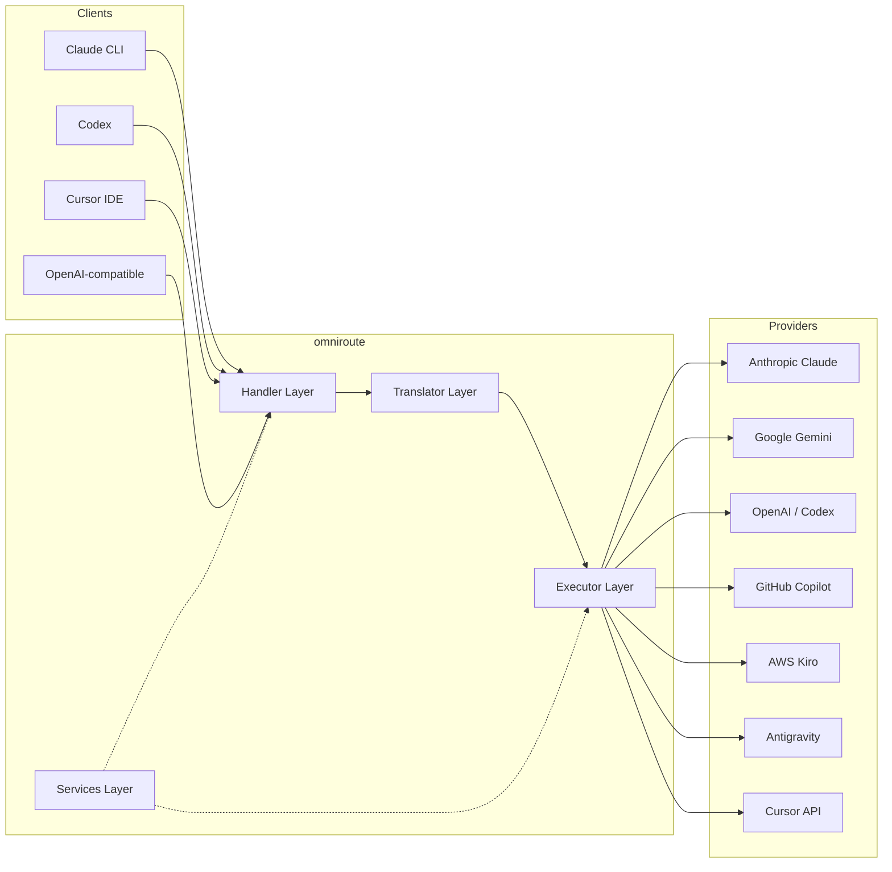
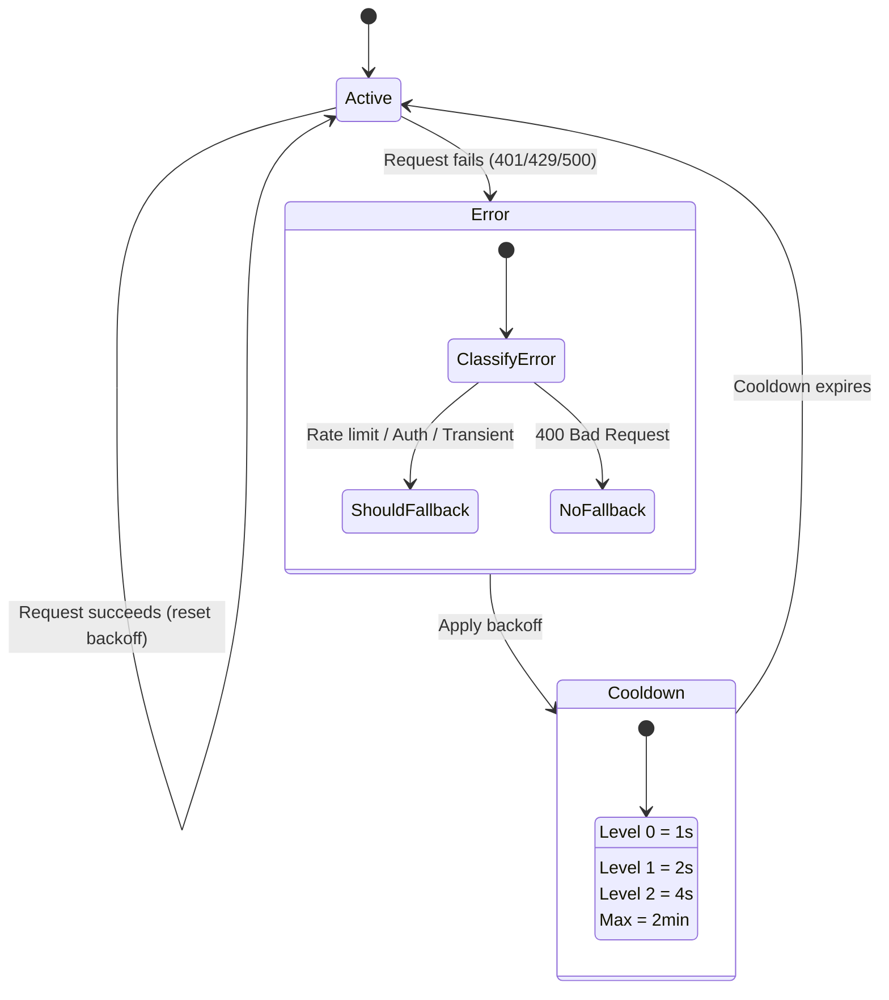
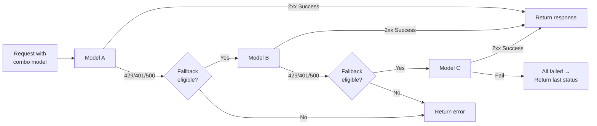
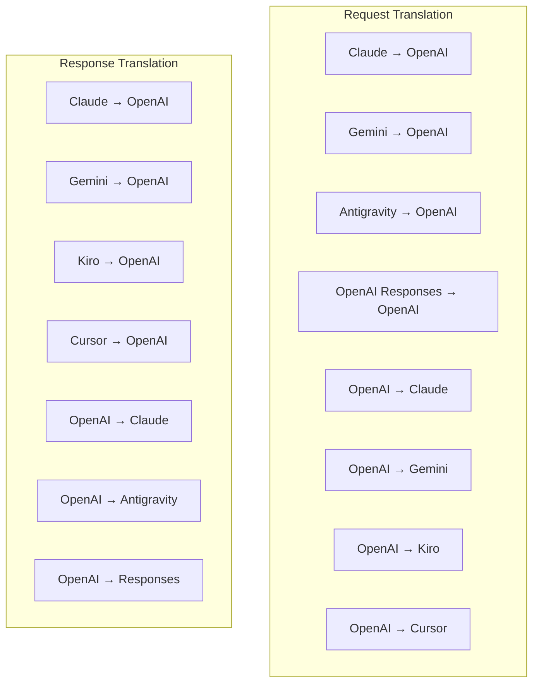
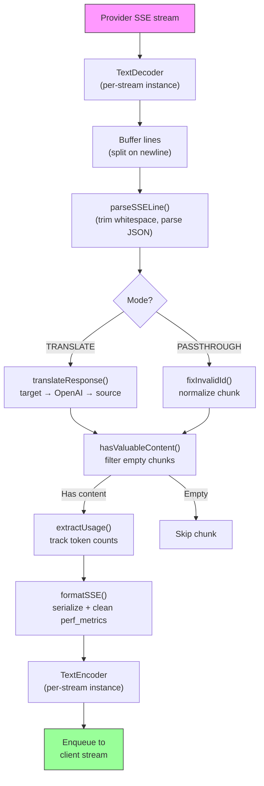
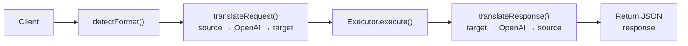
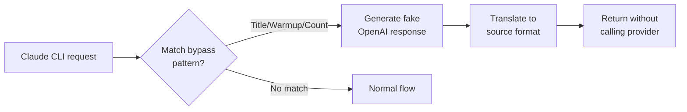

# omniroute — Codebase Documentation (Nederlands)

🌐 **Languages:** 🇺🇸 [English](../../../../docs/CODEBASE_DOCUMENTATION.md) · 🇪🇸 [es](../../es/docs/CODEBASE_DOCUMENTATION.md) · 🇫🇷 [fr](../../fr/docs/CODEBASE_DOCUMENTATION.md) · 🇩🇪 [de](../../de/docs/CODEBASE_DOCUMENTATION.md) · 🇮🇹 [it](../../it/docs/CODEBASE_DOCUMENTATION.md) · 🇷🇺 [ru](../../ru/docs/CODEBASE_DOCUMENTATION.md) · 🇨🇳 [zh-CN](../../zh-CN/docs/CODEBASE_DOCUMENTATION.md) · 🇯🇵 [ja](../../ja/docs/CODEBASE_DOCUMENTATION.md) · 🇰🇷 [ko](../../ko/docs/CODEBASE_DOCUMENTATION.md) · 🇸🇦 [ar](../../ar/docs/CODEBASE_DOCUMENTATION.md) · 🇮🇳 [hi](../../hi/docs/CODEBASE_DOCUMENTATION.md) · 🇮🇳 [in](../../in/docs/CODEBASE_DOCUMENTATION.md) · 🇹🇭 [th](../../th/docs/CODEBASE_DOCUMENTATION.md) · 🇻🇳 [vi](../../vi/docs/CODEBASE_DOCUMENTATION.md) · 🇮🇩 [id](../../id/docs/CODEBASE_DOCUMENTATION.md) · 🇲🇾 [ms](../../ms/docs/CODEBASE_DOCUMENTATION.md) · 🇳🇱 [nl](../../nl/docs/CODEBASE_DOCUMENTATION.md) · 🇵🇱 [pl](../../pl/docs/CODEBASE_DOCUMENTATION.md) · 🇸🇪 [sv](../../sv/docs/CODEBASE_DOCUMENTATION.md) · 🇳🇴 [no](../../no/docs/CODEBASE_DOCUMENTATION.md) · 🇩🇰 [da](../../da/docs/CODEBASE_DOCUMENTATION.md) · 🇫🇮 [fi](../../fi/docs/CODEBASE_DOCUMENTATION.md) · 🇵🇹 [pt](../../pt/docs/CODEBASE_DOCUMENTATION.md) · 🇷🇴 [ro](../../ro/docs/CODEBASE_DOCUMENTATION.md) · 🇭🇺 [hu](../../hu/docs/CODEBASE_DOCUMENTATION.md) · 🇧🇬 [bg](../../bg/docs/CODEBASE_DOCUMENTATION.md) · 🇸🇰 [sk](../../sk/docs/CODEBASE_DOCUMENTATION.md) · 🇺🇦 [uk-UA](../../uk-UA/docs/CODEBASE_DOCUMENTATION.md) · 🇮🇱 [he](../../he/docs/CODEBASE_DOCUMENTATION.md) · 🇵🇭 [phi](../../phi/docs/CODEBASE_DOCUMENTATION.md) · 🇧🇷 [pt-BR](../../pt-BR/docs/CODEBASE_DOCUMENTATION.md) · 🇨🇿 [cs](../../cs/docs/CODEBASE_DOCUMENTATION.md) · 🇹🇷 [tr](../../tr/docs/CODEBASE_DOCUMENTATION.md)

---

> Een uitgebreide, beginnersvriendelijke gids voor de**omniroute**AI-proxyrouter met meerdere providers.---

## 1. What Is omniroute?

omniroute is een**proxyrouter**die zich tussen AI-clients (Claude CLI, Codex, Cursor IDE, enz.) en AI-providers (Anthropic, Google, OpenAI, AWS, GitHub, enz.) bevindt. Het lost één groot probleem op:

> **Verschillende AI-clients spreken verschillende "talen" (API-formaten), en verschillende AI-providers verwachten ook verschillende "talen".**omniroute vertaalt automatisch tussen hen.

Zie het als een universele vertaler bij de Verenigde Naties: elke afgevaardigde kan elke taal spreken, en de vertaler zet deze om voor elke andere afgevaardigde.---

## 2. Architecture Overview



### Core Principle: Hub-and-Spoke Translation

Alle formaatvertalingen passeren het**OpenAI-formaat als hub**:```
Client Format → [OpenAI Hub] → Provider Format (request)
Provider Format → [OpenAI Hub] → Client Format (response)

```

Dit betekent dat u slechts**N vertalers**nodig heeft (één per formaat) in plaats van**N²**(elk paar).---

## 3. Project Structure

```

omniroute/
├── open-sse/ ← Core proxy library (portable, framework-agnostic)
│ ├── index.js ← Main entry point, exports everything
│ ├── config/ ← Configuration & constants
│ ├── executors/ ← Provider-specific request execution
│ ├── handlers/ ← Request handling orchestration
│ ├── services/ ← Business logic (auth, models, fallback, usage)
│ ├── translator/ ← Format translation engine
│ │ ├── request/ ← Request translators (8 files)
│ │ ├── response/ ← Response translators (7 files)
│ │ └── helpers/ ← Shared translation utilities (6 files)
│ └── utils/ ← Utility functions
├── src/ ← Application layer (Express/Worker runtime)
│ ├── app/ ← Web UI, API routes, middleware
│ ├── lib/ ← Database, auth, and shared library code
│ ├── mitm/ ← Man-in-the-middle proxy utilities
│ ├── models/ ← Database models
│ ├── shared/ ← Shared utilities (wrappers around open-sse)
│ ├── sse/ ← SSE endpoint handlers
│ └── store/ ← State management
├── data/ ← Runtime data (credentials, logs)
│ └── provider-credentials.json (external credentials override, gitignored)
└── tester/ ← Test utilities

````

---

## 4. Module-by-Module Breakdown

### 4.1 Config (`open-sse/config/`)

De**enige bron van waarheid**voor alle providerconfiguraties.

| Bestand | Doel |
| --------------------------- | --------------------------------------------------------------------------------------------- ---------------------------------------------------------------------------------------------- |
| `constanten.ts` | `PROVIDERS`-object met basis-URL's, OAuth-inloggegevens (standaard), headers en standaardsysteemprompts voor elke provider. Definieert ook `HTTP_STATUS`, `ERROR_TYPES`, `COOLDOWN_MS`, `BACKOFF_CONFIG` en `SKIP_PATTERNS`. |
| `credentialLoader.ts` | Laadt externe inloggegevens uit `data/provider-credentials.json` en voegt deze samen over de hardgecodeerde standaardwaarden in `PROVIDERS`. Houdt geheimen buiten de broncontrole en behoudt achterwaartse compatibiliteit.               |
| `providerModels.ts` | Centraal modelregister: brengt provideraliassen in kaart → model-ID's. Functies zoals `getModels()`, `getProviderByAlias()`.                                                                                                          |
| `codexInstructions.ts` | Systeeminstructies geïnjecteerd in Codex-verzoeken (bewerkingsbeperkingen, sandbox-regels, goedkeuringsbeleid).                                                                                                                 |
| `defaultThinkingSignature.ts` | Standaard "denkende" handtekeningen voor Claude- en Gemini-modellen.                                                                                                                                                               |
| `ollamaModels.ts` | Schemadefinitie voor lokale Ollama-modellen (naam, grootte, familie, kwantisering).                                                                                                                                             |#### Credential Loading Flow

```mermaid
flowchart TD
    A["App starts"] --> B["constants.ts defines PROVIDERS\nwith hardcoded defaults"]
    B --> C{"data/provider-credentials.json\nexists?"}
    C -->|Yes| D["credentialLoader reads JSON"]
    C -->|No| E["Use hardcoded defaults"]
    D --> F{"For each provider in JSON"}
    F --> G{"Provider exists\nin PROVIDERS?"}
    G -->|No| H["Log warning, skip"]
    G -->|Yes| I{"Value is object?"}
    I -->|No| J["Log warning, skip"]
    I -->|Yes| K["Merge clientId, clientSecret,\ntokenUrl, authUrl, refreshUrl"]
    K --> F
    H --> F
    J --> F
    F -->|Done| L["PROVIDERS ready with\nmerged credentials"]
    E --> L
````

---

### 4.2 Executors (`open-sse/executors/`)

Uitvoerders kapselen**providerspecifieke logica**in met behulp van het**Strategiepatroon**. Elke uitvoerder overschrijft indien nodig de basismethoden.```mermaid
classDiagram
class BaseExecutor {
+buildUrl(model, stream, options)
+buildHeaders(credentials, stream, body)
+transformRequest(body, model, stream, credentials)
+execute(url, options)
+shouldRetry(status, error)
+refreshCredentials(credentials, log)
}

    class DefaultExecutor {
        +refreshCredentials()
    }

    class AntigravityExecutor {
        +buildUrl()
        +buildHeaders()
        +transformRequest()
        +shouldRetry()
        +refreshCredentials()
    }

    class CursorExecutor {
        +buildUrl()
        +buildHeaders()
        +transformRequest()
        +parseResponse()
        +generateChecksum()
    }

    class KiroExecutor {
        +buildUrl()
        +buildHeaders()
        +transformRequest()
        +parseEventStream()
        +refreshCredentials()
    }

    BaseExecutor <|-- DefaultExecutor
    BaseExecutor <|-- AntigravityExecutor
    BaseExecutor <|-- CursorExecutor
    BaseExecutor <|-- KiroExecutor
    BaseExecutor <|-- CodexExecutor
    BaseExecutor <|-- GeminiCLIExecutor
    BaseExecutor <|-- GithubExecutor

````

| executeur | Aanbieder | Belangrijkste specialisaties |
| ---------------- | --------------------------------------- | ---------------------------------------------------------------------------------------------------- |
| `basis.ts` | — | Samenvatting van de basis: URL-opbouw, headers, logica voor opnieuw proberen, vernieuwen van inloggegevens |
| `standaard.ts` | Claude, Gemini, OpenAI, GLM, Kimi, MiniMax | Generieke OAuth-tokenvernieuwing voor standaardproviders |
| `antizwaartekracht.ts` | Google Cloud-code | Generatie van project-/sessie-ID's, fallback met meerdere URL's, aangepaste parsering van foutmeldingen ("reset na 2u7m23s") |
| `cursor.ts` | Cursor-IDE |**Meest complex**: SHA-256 checksum-authenticatie, Protobuf-verzoekcodering, binaire EventStream → Parsing van SSE-antwoorden |
| `codex.ts` | OpenAI-codex | Injecteert systeeminstructies, beheert denkniveaus, verwijdert niet-ondersteunde parameters |
| `gemini-cli.ts` | Google Gemini-CLI | Aangepaste URL bouwen (`streamGenerateContent`), Google OAuth-token vernieuwen |
| `github.ts` | GitHub-copiloot | Dubbel tokensysteem (GitHub OAuth + Copilot-token), VSCode-header die |
| `kiro.ts` | AWS CodeWhisperer | AWS EventStream binaire parsing, AMZN-gebeurtenisframes, tokenschatting |
| `index.ts` | — | Fabriek: kaartprovidernaam → uitvoerderklasse, met standaard fallback |---

### 4.3 Handlers (`open-sse/handlers/`)

De**orkestratielaag**— coördineert de vertaling, uitvoering, streaming en foutafhandeling.

| Bestand | Doel |
| -------------------- | -------------------------------------------------------------------------------------------- -------------------------------------------------------------------------------------------- |
| `chatCore.ts` |**Centrale orkestrator**(~600 lijnen). Verwerkt de volledige levenscyclus van verzoeken: formaatdetectie → vertaling → verzending van de uitvoerder → streaming/niet-streaming antwoord → tokenvernieuwing → foutafhandeling → gebruiksregistratie. |
| `responsesHandler.ts` | Adapter voor OpenAI's Responses API: converteert het antwoordformaat → Chat-voltooiingen → verzendt naar `chatCore` → converteert SSE terug naar het antwoordformaat.                                                                        |
| `embedding.ts` | Handler voor het genereren van inbedding: lost het inbeddingsmodel → provider op, verzendt naar de API van de provider, retourneert OpenAI-compatibele inbeddingsreactie. Ondersteunt 6+ providers.                                                    |
| `imageGeneration.ts` | Handler voor het genereren van afbeeldingen: lost beeldmodel → provider op, ondersteunt OpenAI-compatibele, Gemini-image (Antigravity) en fallback (Nebius) modi. Retourneert base64- of URL-afbeeldingen.                                          |#### Request Lifecycle (chatCore.ts)

```mermaid
sequenceDiagram
    participant Client
    participant chatCore
    participant Translator
    participant Executor
    participant Provider

    Client->>chatCore: Request (any format)
    chatCore->>chatCore: Detect source format
    chatCore->>chatCore: Check bypass patterns
    chatCore->>chatCore: Resolve model & provider
    chatCore->>Translator: Translate request (source → OpenAI → target)
    chatCore->>Executor: Get executor for provider
    Executor->>Executor: Build URL, headers, transform request
    Executor->>Executor: Refresh credentials if needed
    Executor->>Provider: HTTP fetch (streaming or non-streaming)

    alt Streaming
        Provider-->>chatCore: SSE stream
        chatCore->>chatCore: Pipe through SSE transform stream
        Note over chatCore: Transform stream translates<br/>each chunk: target → OpenAI → source
        chatCore-->>Client: Translated SSE stream
    else Non-streaming
        Provider-->>chatCore: JSON response
        chatCore->>Translator: Translate response
        chatCore-->>Client: Translated JSON
    end

    alt Error (401, 429, 500...)
        chatCore->>Executor: Retry with credential refresh
        chatCore->>chatCore: Account fallback logic
    end
````

---

### 4.4 Services (`open-sse/services/`)

| Bedrijfslogica die de behandelaars en uitvoerders ondersteunt. | File                                                                                                                                                                                                                                                                                                                                   | Purpose |
| -------------------------------------------------------------- | -------------------------------------------------------------------------------------------------------------------------------------------------------------------------------------------------------------------------------------------------------------------------------------------------------------------------------------- | ------- |
| `provider.ts`                                                  | **Format detection** (`detectFormat`): analyzes request body structure to identify Claude/OpenAI/Gemini/Antigravity/Responses formats (includes `max_tokens` heuristic for Claude). Also: URL building, header building, thinking config normalization. Supports `openai-compatible-*` and `anthropic-compatible-*` dynamic providers. |
| `model.ts`                                                     | Model string parsing (`claude/model-name` → `{provider: "claude", model: "model-name"}`), alias resolution with collision detection, input sanitization (rejects path traversal/control chars), and model info resolution with async alias getter support.                                                                             |
| `accountFallback.ts`                                           | Rate-limit handling: exponential backoff (1s → 2s → 4s → max 2min), account cooldown management, error classification (which errors trigger fallback vs. not).                                                                                                                                                                         |
| `tokenRefresh.ts`                                              | OAuth token refresh for **every provider**: Google (Gemini, Antigravity), Claude, Codex, Qwen, Qoder, GitHub (OAuth + Copilot dual-token), Kiro (AWS SSO OIDC + Social Auth). Includes in-flight promise deduplication cache and retry with exponential backoff.                                                                       |
| `combo.ts`                                                     | **Combo models**: chains of fallback models. If model A fails with a fallback-eligible error, try model B, then C, etc. Returns actual upstream status codes.                                                                                                                                                                          |
| `usage.ts`                                                     | Fetches quota/usage data from provider APIs (GitHub Copilot quotas, Antigravity model quotas, Codex rate limits, Kiro usage breakdowns, Claude settings).                                                                                                                                                                              |
| `accountSelector.ts`                                           | Smart account selection with scoring algorithm: considers priority, health status, round-robin position, and cooldown state to pick the optimal account for each request.                                                                                                                                                              |
| `contextManager.ts`                                            | Request context lifecycle management: creates and tracks per-request context objects with metadata (request ID, timestamps, provider info) for debugging and logging.                                                                                                                                                                  |
| `ipFilter.ts`                                                  | IP-based access control: supports allowlist and blocklist modes. Validates client IP against configured rules before processing API requests.                                                                                                                                                                                          |
| `sessionManager.ts`                                            | Session tracking with client fingerprinting: tracks active sessions using hashed client identifiers, monitors request counts, and provides session metrics.                                                                                                                                                                            |
| `signatureCache.ts`                                            | Request signature-based deduplication cache: prevents duplicate requests by caching recent request signatures and returning cached responses for identical requests within a time window.                                                                                                                                              |
| `systemPrompt.ts`                                              | Global system prompt injection: prepends or appends a configurable system prompt to all requests, with per-provider compatibility handling.                                                                                                                                                                                            |
| `thinkingBudget.ts`                                            | Reasoning token budget management: supports passthrough, auto (strip thinking config), custom (fixed budget), and adaptive (complexity-scaled) modes for controlling thinking/reasoning tokens.                                                                                                                                        |
| `wildcardRouter.ts`                                            | Wildcard model pattern routing: resolves wildcard patterns (e.g., `*/claude-*`) to concrete provider/model pairs based on availability and priority.                                                                                                                                                                                   |

#### Token Refresh Deduplication

```mermaid
sequenceDiagram
    participant R1 as Request 1
    participant R2 as Request 2
    participant Cache as refreshPromiseCache
    participant OAuth as OAuth Provider

    R1->>Cache: getAccessToken("gemini", token)
    Cache->>Cache: No in-flight promise
    Cache->>OAuth: Start refresh
    R2->>Cache: getAccessToken("gemini", token)
    Cache->>Cache: Found in-flight promise
    Cache-->>R2: Return existing promise
    OAuth-->>Cache: New access token
    Cache-->>R1: New access token
    Cache-->>R2: Same access token (shared)
    Cache->>Cache: Delete cache entry
```

#### Account Fallback State Machine



#### Combo Model Chain



---

### 4.5 Translator (`open-sse/translator/`)

De**formaatvertaalmachine**gebruikt een zelfregistrerend plug-insysteem.#### Architectuur



| Telefoonboek  | Bestanden   | Beschrijving                                                                                                                                                                                                                                                                                    |
| ------------- | ----------- | ----------------------------------------------------------------------------------------------------------------------------------------------------------------------------------------------------------------------------------------------------------------------------------------------- | ----------------------------------------- |
| `verzoek/`    | 8 vertalers | Converteer verzoekteksten tussen formaten. Elk bestand registreert zichzelf via `register(from, to, fn)` bij het importeren.                                                                                                                                                                    |
| `reactie/`    | 7 vertalers | Converteer streamingantwoordbrokken tussen formaten. Verwerkt SSE-gebeurtenistypen, denkblokken, tooloproepen.                                                                                                                                                                                  |
| `helpers/`    | 6 helpers   | Gedeelde hulpprogramma's: `claudeHelper` (extractie van systeemprompts, denkconfiguratie), `geminiHelper` (toewijzing van onderdelen/inhoud), `openaiHelper` (formaatfiltering), `toolCallHelper` (ID genereren, injectie van ontbrekende antwoorden), `maxTokensHelper`, `responsesApiHelper`. |
| `index.ts`    | —           | Vertaalmachine: `translateRequest()`, `translateResponse()`, statusbeheer, register.                                                                                                                                                                                                            |
| `formaten.ts` | —           | Formaatconstanten: `OPENAI`, `CLAUDE`, `GEMINI`, `ANTIGRAVITY`, `KIRO`, `CURSOR`, `OPENAI_RESPONSES`.                                                                                                                                                                                           | #### Key Design: Self-Registering Plugins |

```javascript
// Each translator file calls register() on import:
import { register } from "../index.js";
register("claude", "openai", translateClaudeToOpenAI);

// The index.js imports all translator files, triggering registration:
import "./request/claude-to-openai.js"; // ← self-registers
```

---

### 4.6 Utils (`open-sse/utils/`)

| Bestand            | Doel                                                                                                                                                                                                                                                                                                                                  |
| ------------------ | ------------------------------------------------------------------------------------------------------------------------------------------------------------------------------------------------------------------------------------------------------------------------------------------------------------------------------------- | --------------------------- |
| `fout.ts`          | Opbouw van foutreacties (OpenAI-compatibel formaat), upstream-foutparsing, Antigravity-extractie van nieuwe pogingen uit foutmeldingen, SSE-foutstreaming.                                                                                                                                                                            |
| `stream.ts`        | **SSE Transform Stream**— de belangrijkste streamingpijplijn. Twee modi: `TRANSLATE` (vertaling in volledig formaat) en `PASSTHROUGH` (normaliseren + extraheren van gebruik). Verwerkt chunkbuffering, gebruiksschatting en het bijhouden van de inhoudslengte. Encoder/decoder-instanties per stream vermijden een gedeelde status. |
| `streamHelpers.ts` | SSE-hulpprogramma's op laag niveau: `parseSSELine` (witruimtetolerant), `hasValuableContent` (filtert lege chunks voor OpenAI/Claude/Gemini), `fixInvalidId`, `formatSSE` (formaatbewuste SSE-serialisatie met opschoning van `perf_metrics`).                                                                                        |
| `usageTracking.ts` | Extractie van tokengebruik uit elk formaat (Claude/OpenAI/Gemini/Responses), schatting met afzonderlijke tool/bericht-char-per-token-verhoudingen, buffertoevoeging (veiligheidsmarge van 2000 tokens), formaatspecifieke veldfiltering, consolelogboekregistratie met ANSI-kleuren.                                                  |
| `requestLogger.ts` | Legacy file-based request logging helper kept for compatibility. Current deployments should prefer `APP_LOG_TO_FILE` for application logs and the call log pipeline for persisted request artifacts.                                                                                                                                  |
| `bypassHandler.ts` | Onderschept specifieke patronen van Claude CLI (titelextractie, opwarming, telling) en retourneert valse antwoorden zonder een provider te bellen. Ondersteunt zowel streaming als niet-streaming. Opzettelijk beperkt tot het Claude CLI-bereik.                                                                                     |
| `netwerkProxy.ts`  | Bepaalt de uitgaande proxy-URL voor een bepaalde provider met voorrang: providerspecifieke configuratie → globale configuratie → omgevingsvariabelen (`HTTPS_PROXY`/`HTTP_PROXY`/`ALL_PROXY`). Ondersteunt 'NO_PROXY'-uitsluitingen. Cachesconfiguratie voor 30s.                                                                     | #### SSE Streaming Pipeline |



#### Request Logger Session Structure

```
logs/
└── claude_gemini_claude-sonnet_20260208_143045/
    ├── 1_req_client.json      ← Raw client request
    ├── 2_req_source.json      ← After initial conversion
    ├── 3_req_openai.json      ← OpenAI intermediate format
    ├── 4_req_target.json      ← Final target format
    ├── 5_res_provider.txt     ← Provider SSE chunks (streaming)
    ├── 5_res_provider.json    ← Provider response (non-streaming)
    ├── 6_res_openai.txt       ← OpenAI intermediate chunks
    ├── 7_res_client.txt       ← Client-facing SSE chunks
    └── 6_error.json           ← Error details (if any)
```

---

### 4.7 Application Layer (`src/`)

| Telefoonboek    | Doel                                                                              |
| --------------- | --------------------------------------------------------------------------------- | ----------------------- |
| `src/app/`      | Web-UI, API-routes, Express-middleware, OAuth-callback-handlers                   |
| `src/lib/`      | Databasetoegang (`localDb.ts`, `usageDb.ts`), authenticatie, gedeeld              |
| `src/mitm/`     | Man-in-the-middle-proxyhulpprogramma's voor het onderscheppen van providerverkeer |
| `src/modellen/` | Definities van databasemodellen                                                   |
| `src/gedeeld/`  | Wrappers rond open-sse-functies (provider, stream, fout, etc.)                    |
| `src/sse/`      | SSE-eindpunthandlers die de open-sse-bibliotheek verbinden met Express-routes     |
| `src/winkel/`   | Beheer van applicatiestatus                                                       | #### Notable API Routes |

| Route                                         | Methoden                 | Doel                                                                                                       |
| --------------------------------------------- | ------------------------ | ---------------------------------------------------------------------------------------------------------- | --- |
| `/api/provider-modellen`                      | KRIJGEN/POST/VERWIJDEREN | CRUD voor maatwerkmodellen per aanbieder                                                                   |
| `/api/modellen/catalog`                       | KRIJG                    | Geaggregeerde catalogus van alle modellen (chat, insluiten, afbeelding, aangepast) gegroepeerd op provider |
| `/api/settings/proxy`                         | KRIJGEN/ZET/VERWIJDEREN  | Hiërarchische uitgaande proxyconfiguratie (`global/providers/combos/keys`)                                 |
| `/api/settings/proxy/test`                    | POST                     | Valideert proxy-connectiviteit en retourneert openbare IP/latentie                                         |
| `/v1/providers/[provider]/chat/completions`   | POST                     | Specifieke chatafrondingen per provider met modelvalidatie                                                 |
| `/v1/providers/[provider]/embeddings`         | POST                     | Toegewijde inbedding per provider met modelvalidatie                                                       |
| `/v1/providers/[provider]/images/generations` | POST                     | Specifieke generatie van afbeeldingen per provider met modelvalidatie                                      |
| `/api/settings/ip-filter`                     | KRIJG/ZET                | Beheer van IP-toelatingslijsten/blokkeerlijsten                                                            |
| `/api/settings/thinking-budget`               | KRIJG/ZET                | Redeneren token budgetconfiguratie (passthrough/auto/aangepast/adaptief)                                   |
| `/api/settings/systeemprompt`                 | KRIJG/ZET                | Wereldwijde systeempromptinjectie voor alle verzoeken                                                      |
| `/api/sessions`                               | KRIJG                    | Actieve sessietracking en statistieken                                                                     |
| `/api/rate-limits`                            | KRIJG                    | Status van tarieflimiet per account                                                                        | --- |

## 5. Key Design Patterns

### 5.1 Hub-and-Spoke Translation

Alle formaten worden vertaald via het**OpenAI-formaat als hub**. Voor het toevoegen van een nieuwe provider is slechts**één paar**vertalers nodig (van/naar OpenAI), niet N-paren.### 5.2 Executor Strategy Pattern

Elke provider heeft een speciale executorklasse die overerft van `BaseExecutor`. De fabriek in `executors/index.ts` selecteert tijdens runtime de juiste.### 5.3 Self-Registering Plugin System

Vertaalmodules registreren zichzelf bij het importeren via `register()`. Als u een nieuwe vertaler toevoegt, maakt u eenvoudigweg een bestand aan en importeert u dit.### 5.4 Account Fallback with Exponential Backoff

Wanneer een provider 429/401/500 retourneert, kan het systeem overschakelen naar het volgende account, waarbij exponentiële cooldowns worden toegepast (1s → 2s → 4s → max. 2min).### 5.5 Combo Model Chains

Een "combo" groepeert meerdere `provider/model`-reeksen. Als de eerste mislukt, wordt automatisch teruggevallen op de volgende.### 5.6 Stateful Streaming Translation

Reactievertaling handhaaft de status van SSE-brokken (tracking van denkblokken, accumulatie van toolaanroepen, indexering van inhoudsblokken) via het `initState()`-mechanisme.### 5.7 Usage Safety Buffer

Er wordt een buffer van 2000 token toegevoegd aan het gerapporteerde gebruik om te voorkomen dat clients de limieten van het contextvenster bereiken als gevolg van overhead van systeemprompts en formaatvertaling.---

## 6. Supported Formats

| Formaat                  | Richting    | Identificatie       |
| ------------------------ | ----------- | ------------------- | --- |
| OpenAI Chat-voltooiingen | bron + doel | `openai`            |
| OpenAI-reacties-API      | bron + doel | `openai-reacties`   |
| Antropische Claude       | bron + doel | `claude`            |
| Google Tweeling          | bron + doel | `Tweeling`          |
| Google Gemini-CLI        | alleen doel | `gemini-cli`        |
| Antizwaartekracht        | bron + doel | `antizwaartekracht` |
| AWS Kiro                 | alleen doel | `kiro`              |
| Cursor                   | alleen doel | `cursor`            | --- |

## 7. Supported Providers

| Aanbieder                 | Verificatiemethode      | executeur         | Belangrijkste opmerkingen                                            |
| ------------------------- | ----------------------- | ----------------- | -------------------------------------------------------------------- | --- |
| Antropische Claude        | API-sleutel of OAuth    | Standaard         | Gebruikt `x-api-key` header                                          |
| Google Tweeling           | API-sleutel of OAuth    | Standaard         | Gebruikt `x-goog-api-key` header                                     |
| Google Gemini-CLI         | OAuth                   | GeminiCLI         | Gebruikt `streamGenerateContent` eindpunt                            |
| Antizwaartekracht         | OAuth                   | Antizwaartekracht | Terugval op meerdere URL's, aangepaste parsering van nieuwe pogingen |
| Open AI                   | API-sleutel             | Standaard         | Standaard Bearer-authenticatie                                       |
| Codex                     | OAuth                   | Codex             | Injecteert systeeminstructies, beheert het denken                    |
| GitHub-copiloot           | OAuth + Copilot-token   | Github            | Dubbel token, VSCode-header die                                      |
| Kiro (AWS)                | AWS SSO OIDC of sociaal | Kiro              | Binaire EventStream-parsering                                        |
| Cursor-IDE                | Controlesomverificatie  | Cursor            | Protobuf-codering, SHA-256-controlesommen                            |
| Qwen                      | OAuth                   | Standaard         | Standaardauthenticatie                                               |
| Qoder                     | OAuth (basis + drager)  | Standaard         | Dubbele auth-header                                                  |
| OpenRouter                | API-sleutel             | Standaard         | Standaard Bearer-authenticatie                                       |
| GLM, Kimi, MiniMax        | API-sleutel             | Standaard         | Claude-compatibel, gebruik `x-api-key`                               |
| `openai-compatibel-*`     | API-sleutel             | Standaard         | Dynamisch: elk OpenAI-compatibel eindpunt                            |
| `antropisch-compatibel-*` | API-sleutel             | Standaard         | Dynamisch: elk Claude-compatibel eindpunt                            | --- |

## 8. Data Flow Summary

### Streaming Request

```mermaid
flowchart LR
    A["Client"] --> B["detectFormat()"]
    B --> C["translateRequest()\nsource → OpenAI → target"]
    C --> D["Executor\nbuildUrl + buildHeaders"]
    D --> E["fetch(providerURL)"]
    E --> F["createSSEStream()\nTRANSLATE mode"]
    F --> G["parseSSELine()"]
    G --> H["translateResponse()\ntarget → OpenAI → source"]
    H --> I["extractUsage()\n+ addBuffer"]
    I --> J["formatSSE()"]
    J --> K["Client receives\ntranslated SSE"]
    K --> L["logUsage()\nsaveRequestUsage()"]
```



### Non-Streaming Request



### Bypass Flow (Claude CLI)


