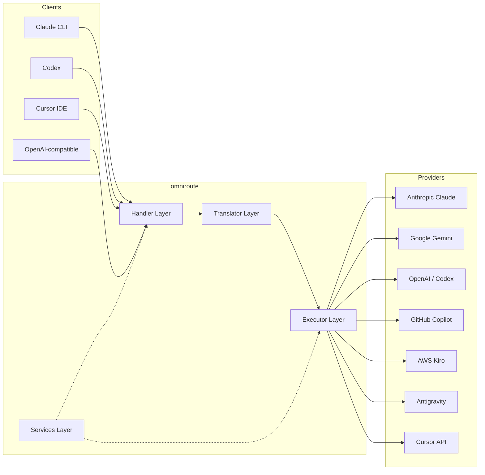
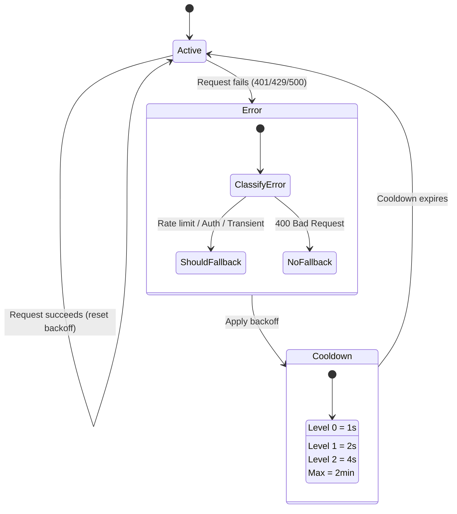
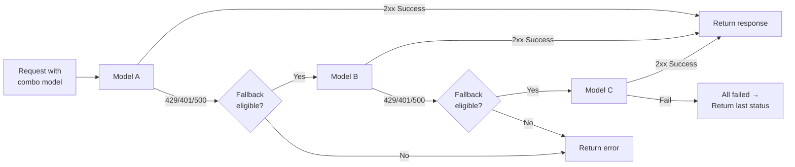
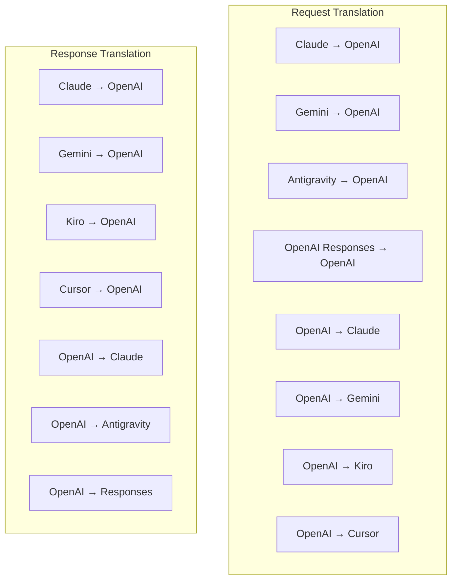
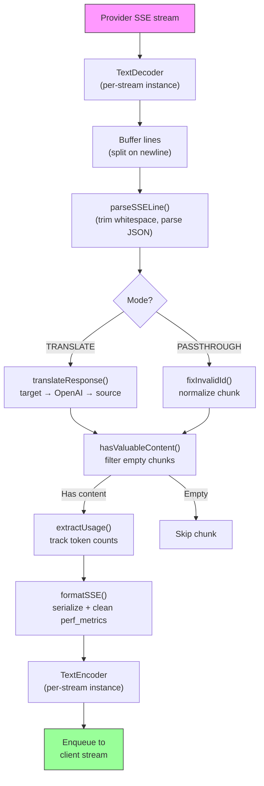
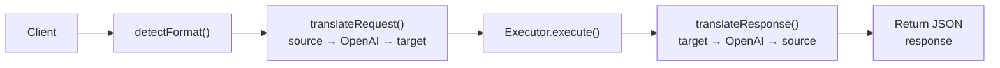
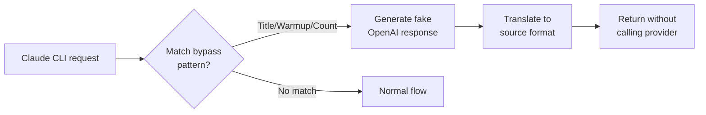

# omniroute — Codebase Documentation (Filipino)

🌐 **Languages:** 🇺🇸 [English](../../../../docs/CODEBASE_DOCUMENTATION.md) · 🇪🇸 [es](../../es/docs/CODEBASE_DOCUMENTATION.md) · 🇫🇷 [fr](../../fr/docs/CODEBASE_DOCUMENTATION.md) · 🇩🇪 [de](../../de/docs/CODEBASE_DOCUMENTATION.md) · 🇮🇹 [it](../../it/docs/CODEBASE_DOCUMENTATION.md) · 🇷🇺 [ru](../../ru/docs/CODEBASE_DOCUMENTATION.md) · 🇨🇳 [zh-CN](../../zh-CN/docs/CODEBASE_DOCUMENTATION.md) · 🇯🇵 [ja](../../ja/docs/CODEBASE_DOCUMENTATION.md) · 🇰🇷 [ko](../../ko/docs/CODEBASE_DOCUMENTATION.md) · 🇸🇦 [ar](../../ar/docs/CODEBASE_DOCUMENTATION.md) · 🇮🇳 [hi](../../hi/docs/CODEBASE_DOCUMENTATION.md) · 🇮🇳 [in](../../in/docs/CODEBASE_DOCUMENTATION.md) · 🇹🇭 [th](../../th/docs/CODEBASE_DOCUMENTATION.md) · 🇻🇳 [vi](../../vi/docs/CODEBASE_DOCUMENTATION.md) · 🇮🇩 [id](../../id/docs/CODEBASE_DOCUMENTATION.md) · 🇲🇾 [ms](../../ms/docs/CODEBASE_DOCUMENTATION.md) · 🇳🇱 [nl](../../nl/docs/CODEBASE_DOCUMENTATION.md) · 🇵🇱 [pl](../../pl/docs/CODEBASE_DOCUMENTATION.md) · 🇸🇪 [sv](../../sv/docs/CODEBASE_DOCUMENTATION.md) · 🇳🇴 [no](../../no/docs/CODEBASE_DOCUMENTATION.md) · 🇩🇰 [da](../../da/docs/CODEBASE_DOCUMENTATION.md) · 🇫🇮 [fi](../../fi/docs/CODEBASE_DOCUMENTATION.md) · 🇵🇹 [pt](../../pt/docs/CODEBASE_DOCUMENTATION.md) · 🇷🇴 [ro](../../ro/docs/CODEBASE_DOCUMENTATION.md) · 🇭🇺 [hu](../../hu/docs/CODEBASE_DOCUMENTATION.md) · 🇧🇬 [bg](../../bg/docs/CODEBASE_DOCUMENTATION.md) · 🇸🇰 [sk](../../sk/docs/CODEBASE_DOCUMENTATION.md) · 🇺🇦 [uk-UA](../../uk-UA/docs/CODEBASE_DOCUMENTATION.md) · 🇮🇱 [he](../../he/docs/CODEBASE_DOCUMENTATION.md) · 🇵🇭 [phi](../../phi/docs/CODEBASE_DOCUMENTATION.md) · 🇧🇷 [pt-BR](../../pt-BR/docs/CODEBASE_DOCUMENTATION.md) · 🇨🇿 [cs](../../cs/docs/CODEBASE_DOCUMENTATION.md) · 🇹🇷 [tr](../../tr/docs/CODEBASE_DOCUMENTATION.md)

---

> Isang komprehensibo, madaling gabay sa baguhan sa**omniroute**multi-provider AI proxy router.---

## 1. What Is omniroute?

Ang omniroute ay isang**proxy router**na nasa pagitan ng mga kliyente ng AI (Claude CLI, Codex, Cursor IDE, atbp.) at mga tagapagbigay ng AI (Anthropic, Google, OpenAI, AWS, GitHub, atbp.). Malulutas nito ang isang malaking problema:

> **Ang iba't ibang mga kliyente ng AI ay nagsasalita ng iba't ibang "mga wika" (mga format ng API), at ang iba't ibang mga tagapagbigay ng AI ay umaasa din ng iba't ibang "mga wika."**Ang omniroute ay awtomatikong nagsasalin sa pagitan ng mga ito.

Isipin ito na parang isang unibersal na tagasalin sa United Nations — sinumang delegado ay maaaring magsalita ng anumang wika, at ang tagasalin ay nagko-convert nito para sa sinumang ibang delegado.---

## 2. Architecture Overview



### Core Principle: Hub-and-Spoke Translation

Ang lahat ng pagsasalin ng format ay dumadaan sa**OpenAI na format bilang hub**:```
Client Format → [OpenAI Hub] → Provider Format (request)
Provider Format → [OpenAI Hub] → Client Format (response)

```

Nangangahulugan ito na kailangan mo lamang ng**N na tagasalin**(isa bawat format) sa halip na**N²**(bawat pares).---

## 3. Project Structure

```

omniroute/
├── open-sse/ ← Core proxy library (portable, framework-agnostic)
│ ├── index.js ← Main entry point, exports everything
│ ├── config/ ← Configuration & constants
│ ├── executors/ ← Provider-specific request execution
│ ├── handlers/ ← Request handling orchestration
│ ├── services/ ← Business logic (auth, models, fallback, usage)
│ ├── translator/ ← Format translation engine
│ │ ├── request/ ← Request translators (8 files)
│ │ ├── response/ ← Response translators (7 files)
│ │ └── helpers/ ← Shared translation utilities (6 files)
│ └── utils/ ← Utility functions
├── src/ ← Application layer (Express/Worker runtime)
│ ├── app/ ← Web UI, API routes, middleware
│ ├── lib/ ← Database, auth, and shared library code
│ ├── mitm/ ← Man-in-the-middle proxy utilities
│ ├── models/ ← Database models
│ ├── shared/ ← Shared utilities (wrappers around open-sse)
│ ├── sse/ ← SSE endpoint handlers
│ └── store/ ← State management
├── data/ ← Runtime data (credentials, logs)
│ └── provider-credentials.json (external credentials override, gitignored)
└── tester/ ← Test utilities

````

---

## 4. Module-by-Module Breakdown

### 4.1 Config (`open-sse/config/`)

Ang**nag-iisang pinagmulan ng katotohanan**para sa lahat ng configuration ng provider.

| File | Layunin |
| ----------------------------- | -----------------------------------------------------------------------------------------------------------------------------------------------------------------------------------------------------------------------------------------------------------------------------------------------------------------------------------------------------------------------------------------------------------
| `constants.ts` | object na `PROVIDERS` na may mga base URL, mga kredensyal ng OAuth (mga default), header, at default na prompt ng system para sa bawat provider. Tinutukoy din ang `HTTP_STATUS`, `ERROR_TYPES`, `COOLDOWN_MS`, `BACKOFF_CONFIG`, at `SKIP_PATTERNS`. |
| `credentialLoader.ts` | Naglo-load ng mga panlabas na kredensyal mula sa `data/provider-credentials.json` at pinagsasama ang mga ito sa mga naka-hardcode na default sa `PROVIDERS`. Pinapanatili ang mga lihim na wala sa kontrol ng pinagmulan habang pinapanatili ang pabalik na pagkakatugma.               |
| `providerModels.ts` | Central model registry: maps provider aliases → model IDs. Mga function tulad ng `getModels()`, `getProviderByAlias()`.                                                                                                          |
| `codexInstructions.ts` | Mga tagubilin ng system na ini-inject sa mga kahilingan sa Codex (mga hadlang sa pag-edit, mga panuntunan sa sandbox, mga patakaran sa pag-apruba).                                                                                                                 |
| `defaultThinkingSignature.ts` | Default na "pag-iisip" na mga lagda para sa mga modelong Claude at Gemini.                                                                                                                                                               |
| `ollamaModels.ts` | Depinisyon ng schema para sa mga lokal na modelo ng Ollama (pangalan, laki, pamilya, quantization).                                                                                                                                             |#### Credential Loading Flow

```mermaid
flowchart TD
    A["App starts"] --> B["constants.ts defines PROVIDERS\nwith hardcoded defaults"]
    B --> C{"data/provider-credentials.json\nexists?"}
    C -->|Yes| D["credentialLoader reads JSON"]
    C -->|No| E["Use hardcoded defaults"]
    D --> F{"For each provider in JSON"}
    F --> G{"Provider exists\nin PROVIDERS?"}
    G -->|No| H["Log warning, skip"]
    G -->|Yes| I{"Value is object?"}
    I -->|No| J["Log warning, skip"]
    I -->|Yes| K["Merge clientId, clientSecret,\ntokenUrl, authUrl, refreshUrl"]
    K --> F
    H --> F
    J --> F
    F -->|Done| L["PROVIDERS ready with\nmerged credentials"]
    E --> L
````

---

### 4.2 Executors (`open-sse/executors/`)

Inilalagay ng mga tagapagpatupad ang**lohika na partikular sa provider**gamit ang**Pattern ng Diskarte**. Ino-override ng bawat executor ang mga base method kung kinakailangan.```mermaid
classDiagram
class BaseExecutor {
+buildUrl(model, stream, options)
+buildHeaders(credentials, stream, body)
+transformRequest(body, model, stream, credentials)
+execute(url, options)
+shouldRetry(status, error)
+refreshCredentials(credentials, log)
}

    class DefaultExecutor {
        +refreshCredentials()
    }

    class AntigravityExecutor {
        +buildUrl()
        +buildHeaders()
        +transformRequest()
        +shouldRetry()
        +refreshCredentials()
    }

    class CursorExecutor {
        +buildUrl()
        +buildHeaders()
        +transformRequest()
        +parseResponse()
        +generateChecksum()
    }

    class KiroExecutor {
        +buildUrl()
        +buildHeaders()
        +transformRequest()
        +parseEventStream()
        +refreshCredentials()
    }

    BaseExecutor <|-- DefaultExecutor
    BaseExecutor <|-- AntigravityExecutor
    BaseExecutor <|-- CursorExecutor
    BaseExecutor <|-- KiroExecutor
    BaseExecutor <|-- CodexExecutor
    BaseExecutor <|-- GeminiCLIExecutor
    BaseExecutor <|-- GithubExecutor

````

| Tagapagpatupad | Provider | Mga Pangunahing Espesyalisasyon |
| ---------------- | ------------------------------------------ | ------------------------------------------------------------------------------------------------------------------- |
| `base.ts` | — | Abstract base: Pagbuo ng URL, mga header, subukang muli ang logic, pag-refresh ng kredensyal |
| `default.ts` | Claude, Gemini, OpenAI, GLM, Kimi, MiniMax | Generic na OAuth token refresh para sa mga karaniwang provider |
| `antigravity.ts` | Google Cloud Code | Pagbuo ng Project/session ID, multi-URL fallback, custom na muling subukang pag-parse mula sa mga mensahe ng error ("i-reset pagkatapos ng 2h7m23s") |
| `cursor.ts` | Cursor IDE |**Pinakakumplikado**: SHA-256 checksum auth, Protobuf request encoding, binary EventStream → SSE response parsing |
| `codex.ts` | OpenAI Codex | Nag-inject ng mga tagubilin sa system, namamahala sa mga antas ng pag-iisip, nag-aalis ng mga hindi sinusuportahang parameter |
| `gemini-cli.ts` | Google Gemini CLI | Custom na pagbuo ng URL (`streamGenerateContent`), pag-refresh ng token ng Google OAuth |
| `github.ts` | GitHub Copilot | Dual token system (GitHub OAuth + Copilot token), paggaya ng header ng VSCode |
| `kiro.ts` | AWS CodeWhisperer | AWS EventStream binary parsing, AMZN event frames, token estimation |
| `index.ts` | — | Pabrika: maps provider name → executor class, na may default na fallback |---

### 4.3 Handlers (`open-sse/handlers/`)

Ang**orchestration layer**— nag-coordinate ng pagsasalin, execution, streaming, at paghawak ng error.

| File | Layunin |
| ---------------------- | -----------------------------------------------------------------------------------------------------------------------------------------------------------------------------------------------------------------------------------------------------------------------------------------------
| `chatCore.ts` |**Central orchestrator**(~600 linya). Pinangangasiwaan ang kumpletong lifecycle ng kahilingan: pagtukoy ng format → pagsasalin → dispatch ng tagapagpatupad → tugon sa streaming/hindi streaming → pag-refresh ng token → paghawak ng error → pag-log sa paggamit. |
| `responsesHandler.ts` | Adapter para sa OpenAI's Responses API: kino-convert ang format ng Mga Tugon → Mga Pagkumpleto ng Chat → ipinapadala sa `chatCore` → ibinalik ang SSE sa format ng Mga Tugon.                                                                        |
| `embeddings.ts` | Tagapangasiwa ng henerasyon ng pag-embed: niresolba ang modelo ng pag-embed → provider, ipinapadala sa API ng provider, ibinabalik ang tugon sa pag-embed na tugma sa OpenAI. Sinusuportahan ang 6+ provider.                                                    |
| `imageGeneration.ts` | Handler ng pagbuo ng imahe: niresolba ang modelo ng imahe → provider, sumusuporta sa OpenAI-compatible, Gemini-image (Antigravity), at fallback (Nebius) mode. Ibinabalik ang base64 o mga larawan ng URL.                                          |#### Request Lifecycle (chatCore.ts)

```mermaid
sequenceDiagram
    participant Client
    participant chatCore
    participant Translator
    participant Executor
    participant Provider

    Client->>chatCore: Request (any format)
    chatCore->>chatCore: Detect source format
    chatCore->>chatCore: Check bypass patterns
    chatCore->>chatCore: Resolve model & provider
    chatCore->>Translator: Translate request (source → OpenAI → target)
    chatCore->>Executor: Get executor for provider
    Executor->>Executor: Build URL, headers, transform request
    Executor->>Executor: Refresh credentials if needed
    Executor->>Provider: HTTP fetch (streaming or non-streaming)

    alt Streaming
        Provider-->>chatCore: SSE stream
        chatCore->>chatCore: Pipe through SSE transform stream
        Note over chatCore: Transform stream translates<br/>each chunk: target → OpenAI → source
        chatCore-->>Client: Translated SSE stream
    else Non-streaming
        Provider-->>chatCore: JSON response
        chatCore->>Translator: Translate response
        chatCore-->>Client: Translated JSON
    end

    alt Error (401, 429, 500...)
        chatCore->>Executor: Retry with credential refresh
        chatCore->>chatCore: Account fallback logic
    end
````

---

### 4.4 Services (`open-sse/services/`)

| Logic ng negosyo na sumusuporta sa mga humahawak at tagapagpatupad. | File                                                                                                                                                                                                                                                                                                                                   | Purpose |
| ------------------------------------------------------------------- | -------------------------------------------------------------------------------------------------------------------------------------------------------------------------------------------------------------------------------------------------------------------------------------------------------------------------------------- | ------- |
| `provider.ts`                                                       | **Format detection** (`detectFormat`): analyzes request body structure to identify Claude/OpenAI/Gemini/Antigravity/Responses formats (includes `max_tokens` heuristic for Claude). Also: URL building, header building, thinking config normalization. Supports `openai-compatible-*` and `anthropic-compatible-*` dynamic providers. |
| `model.ts`                                                          | Model string parsing (`claude/model-name` → `{provider: "claude", model: "model-name"}`), alias resolution with collision detection, input sanitization (rejects path traversal/control chars), and model info resolution with async alias getter support.                                                                             |
| `accountFallback.ts`                                                | Rate-limit handling: exponential backoff (1s → 2s → 4s → max 2min), account cooldown management, error classification (which errors trigger fallback vs. not).                                                                                                                                                                         |
| `tokenRefresh.ts`                                                   | OAuth token refresh for **every provider**: Google (Gemini, Antigravity), Claude, Codex, Qwen, Qoder, GitHub (OAuth + Copilot dual-token), Kiro (AWS SSO OIDC + Social Auth). Includes in-flight promise deduplication cache and retry with exponential backoff.                                                                       |
| `combo.ts`                                                          | **Combo models**: chains of fallback models. If model A fails with a fallback-eligible error, try model B, then C, etc. Returns actual upstream status codes.                                                                                                                                                                          |
| `usage.ts`                                                          | Fetches quota/usage data from provider APIs (GitHub Copilot quotas, Antigravity model quotas, Codex rate limits, Kiro usage breakdowns, Claude settings).                                                                                                                                                                              |
| `accountSelector.ts`                                                | Smart account selection with scoring algorithm: considers priority, health status, round-robin position, and cooldown state to pick the optimal account for each request.                                                                                                                                                              |
| `contextManager.ts`                                                 | Request context lifecycle management: creates and tracks per-request context objects with metadata (request ID, timestamps, provider info) for debugging and logging.                                                                                                                                                                  |
| `ipFilter.ts`                                                       | IP-based access control: supports allowlist and blocklist modes. Validates client IP against configured rules before processing API requests.                                                                                                                                                                                          |
| `sessionManager.ts`                                                 | Session tracking with client fingerprinting: tracks active sessions using hashed client identifiers, monitors request counts, and provides session metrics.                                                                                                                                                                            |
| `signatureCache.ts`                                                 | Request signature-based deduplication cache: prevents duplicate requests by caching recent request signatures and returning cached responses for identical requests within a time window.                                                                                                                                              |
| `systemPrompt.ts`                                                   | Global system prompt injection: prepends or appends a configurable system prompt to all requests, with per-provider compatibility handling.                                                                                                                                                                                            |
| `thinkingBudget.ts`                                                 | Reasoning token budget management: supports passthrough, auto (strip thinking config), custom (fixed budget), and adaptive (complexity-scaled) modes for controlling thinking/reasoning tokens.                                                                                                                                        |
| `wildcardRouter.ts`                                                 | Wildcard model pattern routing: resolves wildcard patterns (e.g., `*/claude-*`) to concrete provider/model pairs based on availability and priority.                                                                                                                                                                                   |

#### Token Refresh Deduplication

```mermaid
sequenceDiagram
    participant R1 as Request 1
    participant R2 as Request 2
    participant Cache as refreshPromiseCache
    participant OAuth as OAuth Provider

    R1->>Cache: getAccessToken("gemini", token)
    Cache->>Cache: No in-flight promise
    Cache->>OAuth: Start refresh
    R2->>Cache: getAccessToken("gemini", token)
    Cache->>Cache: Found in-flight promise
    Cache-->>R2: Return existing promise
    OAuth-->>Cache: New access token
    Cache-->>R1: New access token
    Cache-->>R2: Same access token (shared)
    Cache->>Cache: Delete cache entry
```

#### Account Fallback State Machine



#### Combo Model Chain



---

### 4.5 Translator (`open-sse/translator/`)

Ang**format translation engine**gamit ang isang self-registering plugin system.#### Arkitektura



| Direktoryo      | Mga file      | Paglalarawan                                                                                                                                                                                                                                                        |
| --------------- | ------------- | ------------------------------------------------------------------------------------------------------------------------------------------------------------------------------------------------------------------------------------------------------------------- | ----------------------------------------- |
| `kahilingan/`   | 8 translators | I-convert ang mga katawan ng kahilingan sa pagitan ng mga format. Ang bawat file ay nagrerehistro sa sarili sa pamamagitan ng `register(from, to, fn)` sa pag-import.                                                                                               |
| `tugon/`        | 7 tagasalin   | I-convert ang mga tipak ng tugon sa streaming sa pagitan ng mga format. Pinangangasiwaan ang mga uri ng kaganapan sa SSE, mga bloke ng pag-iisip, mga tawag sa tool.                                                                                                |
| `mga katulong/` | 6 na katulong | Mga shared utilities: `claudeHelper` (system prompt extraction, thinking config), `geminiHelper` (parts/content mapping), `openaiHelper` (format filtering), `toolCallHelper` (ID generation, missing response injection), `maxTokensHelper`, `responsesApiHelper`. |
| `index.ts`      | —             | Translation engine: `translateRequest()`, `translateResponse()`, pamamahala ng estado, registry.                                                                                                                                                                    |
| `formats.ts`    | —             | Mga constant ng format: `OPENAI`, `CLAUDE`, `GEMINI`, `ANTIGRAVITY`, `KIRO`, `CURSOR`, `OPENAI_RESPONSES`.                                                                                                                                                          | #### Key Design: Self-Registering Plugins |

```javascript
// Each translator file calls register() on import:
import { register } from "../index.js";
register("claude", "openai", translateClaudeToOpenAI);

// The index.js imports all translator files, triggering registration:
import "./request/claude-to-openai.js"; // ← self-registers
```

---

### 4.6 Utils (`open-sse/utils/`)

| File               | Layunin                                                                                                                                                                                                                                                                                                                                                       |
| ------------------ | ------------------------------------------------------------------------------------------------------------------------------------------------------------------------------------------------------------------------------------------------------------------------------------------------------------------------------------------------------------- | --------------------------- |
| `error.ts`         | Error response building (OpenAI-compatible format), upstream error parsing, Antigravity retry-time extraction mula sa mga error message, SSE error streaming.                                                                                                                                                                                                 |
| `stream.ts`        | **SSE Transform Stream**— ang pangunahing streaming pipeline. Dalawang mode: `TRANSLATE` (full format translation) at `PASSTHROUGH` (normalize + ang paggamit ng extract). Pinangangasiwaan ang chunk buffering, pagtatantya ng paggamit, pagsubaybay sa haba ng nilalaman. Ang mga instance ng per-stream encoder/decoder ay umiiwas sa nakabahaging estado. |
| `streamHelpers.ts` | Mga utility na mababa ang antas ng SSE: `parseSSELine` (whitespace-tolerant), `hasValuableContent` (filter ang mga walang laman na chunks para sa OpenAI/Claude/Gemini), `fixInvalidId`, `formatSSE` (format-aware SSE serialization na may `perf_metrics` cleanup).                                                                                          |
| `usageTracking.ts` | Pagkuha ng paggamit ng token mula sa anumang format (Claude/OpenAI/Gemini/Responses), pagtatantya na may hiwalay na tool/message char-per-token ratios, pagdaragdag ng buffer (2000 token safety margin), pag-filter ng field na partikular sa format, console logging na may mga kulay ng ANSI.                                                              |
| `requestLogger.ts` | Legacy file-based request logging helper kept for compatibility. Current deployments should prefer `APP_LOG_TO_FILE` for application logs and the call log pipeline for persisted request artifacts.                                                                                                                                                          |
| `bypassHandler.ts` | Hinaharang ang mga partikular na pattern mula kay Claude CLI (pagkuha ng pamagat, warmup, count) at ibinabalik ang mga pekeng tugon nang hindi tumatawag sa anumang provider. Sinusuportahan ang parehong streaming at hindi streaming. Sinasadyang limitado sa saklaw ng Claude CLI.                                                                         |
| `networkProxy.ts`  | Nire-resolve ang outbound proxy URL para sa isang ibinigay na provider nang nangunguna: provider-specific config → global config → environment variables (`HTTPS_PROXY`/`HTTP_PROXY`/`ALL_PROXY`). Sinusuportahan ang mga pagbubukod ng `NO_PROXY`. Caches config para sa 30s.                                                                                | #### SSE Streaming Pipeline |



#### Request Logger Session Structure

```
logs/
└── claude_gemini_claude-sonnet_20260208_143045/
    ├── 1_req_client.json      ← Raw client request
    ├── 2_req_source.json      ← After initial conversion
    ├── 3_req_openai.json      ← OpenAI intermediate format
    ├── 4_req_target.json      ← Final target format
    ├── 5_res_provider.txt     ← Provider SSE chunks (streaming)
    ├── 5_res_provider.json    ← Provider response (non-streaming)
    ├── 6_res_openai.txt       ← OpenAI intermediate chunks
    ├── 7_res_client.txt       ← Client-facing SSE chunks
    └── 6_error.json           ← Error details (if any)
```

---

### 4.7 Application Layer (`src/`)

| Direktoryo    | Layunin                                                                          |
| ------------- | -------------------------------------------------------------------------------- | ----------------------- |
| `src/app/`    | Web UI, mga ruta ng API, Express middleware, OAuth callback handler              |
| `src/lib/`    | Access sa database (`localDb.ts`, `usageDb.ts`), pagpapatunay, ibinahagi         |
| `src/mitm/`   | Man-in-the-middle proxy utility para sa pagharang sa trapiko ng provider         |
| `src/models/` | Mga kahulugan ng modelo ng database                                              |
| `src/shared/` | Mga wrapper sa paligid ng mga open-sse function (provider, stream, error, atbp.) |
| `src/sse/`    | SSE endpoint handler na nag-wire ng open-sse library sa Express na mga ruta      |
| `src/store/`  | Pamamahala ng estado ng aplikasyon                                               | #### Notable API Routes |

| Route                                         | Mga Paraan      | Layunin                                                                                                        |
| --------------------------------------------- | --------------- | -------------------------------------------------------------------------------------------------------------- | --- |
| `/api/provider-models`                        | GET/POST/DELETE | CRUD para sa mga custom na modelo sa bawat provider                                                            |
| `/api/models/catalog`                         | KUMUHA          | Pinagsama-samang catalog ng lahat ng modelo (chat, pag-embed, larawan, custom) na nakapangkat ayon sa provider |
| `/api/setting/proxy`                          | GET/PUT/DELETE  | Hierarchical outbound proxy configuration (`global/providers/combos/keys`)                                     |
| `/api/settings/proxy/test`                    | POST            | Pinapatunayan ang koneksyon ng proxy at ibinabalik ang pampublikong IP/latency                                 |
| `/v1/providers/[provider]/chat/completions`   | POST            | Nakatuon sa bawat provider na mga pagkumpleto ng chat na may pagpapatunay ng modelo                            |
| `/v1/providers/[provider]/embeddings`         | POST            | Mga nakalaang pag-embed ng bawat provider na may pagpapatunay ng modelo                                        |
| `/v1/providers/[provider]/images/generations` | POST            | Nakatuon sa pagbuo ng larawan ng bawat provider na may pagpapatunay ng modelo                                  |
| `/api/settings/ip-filter`                     | GET/PUT         | Pamamahala ng IP allowlist/blocklist                                                                           |
| `/api/setting/thinking-budget`                | GET/PUT         | Reasoning token configuration ng badyet (passthrough/auto/custom/adaptive)                                     |
| `/api/settings/system-prompt`                 | GET/PUT         | Global system prompt injection para sa lahat ng kahilingan                                                     |
| `/api/sessions`                               | KUMUHA          | Aktibong pagsubaybay sa session at mga sukatan                                                                 |
| `/api/rate-limits`                            | KUMUHA          | Katayuan ng limitasyon sa rate ng bawat account                                                                | --- |

## 5. Key Design Patterns

### 5.1 Hub-and-Spoke Translation

Ang lahat ng mga format ay isinasalin sa pamamagitan ng**OpenAI format bilang hub**. Ang pagdaragdag ng bagong provider ay nangangailangan lamang ng pagsulat ng**isang pares**ng mga tagasalin (sa/mula sa OpenAI), hindi N pares.### 5.2 Executor Strategy Pattern

Ang bawat provider ay may nakalaang executor class na nagmana mula sa `BaseExecutor`. Pinipili ng factory sa `executors/index.ts` ang tama sa runtime.### 5.3 Self-Registering Plugin System

Inirerehistro ng mga module ng tagasalin ang kanilang mga sarili sa pag-import sa pamamagitan ng `register()`. Ang pagdaragdag ng bagong tagasalin ay paggawa lamang ng file at pag-import nito.### 5.4 Account Fallback with Exponential Backoff

Kapag nagbalik ang isang provider ng 429/401/500, maaaring lumipat ang system sa susunod na account, na naglalapat ng mga exponential cooldown (1s → 2s → 4s → max 2min).### 5.5 Combo Model Chains

Pinagpangkat ng isang "combo" ang maraming string ng `provider/model`. Kung nabigo ang una, awtomatikong mag-fallback sa susunod.### 5.6 Stateful Streaming Translation

Ang pagsasalin ng tugon ay nagpapanatili ng estado sa mga bahagi ng SSE (pagsubaybay sa pag-iisip ng block, pag-iipon ng tawag sa tool, pag-index ng block ng nilalaman) sa pamamagitan ng mekanismong `initState()`.### 5.7 Usage Safety Buffer

Ang isang 2000-token buffer ay idinagdag sa iniulat na paggamit upang maiwasan ang mga kliyente na maabot ang mga limitasyon sa window ng konteksto dahil sa overhead mula sa mga prompt ng system at pagsasalin ng format.---

## 6. Supported Formats

| Format                         | Direksyon           | Identifier         |
| ------------------------------ | ------------------- | ------------------ | --- |
| Mga Pagkumpleto ng OpenAI Chat | pinagmulan + target | `openai`           |
| OpenAI Responses API           | pinagmulan + target | `openai-responses` |
| Anthropic Claude               | pinagmulan + target | `claude`           |
| Google Gemini                  | pinagmulan + target | `gemini`           |
| Google Gemini CLI              | target lang         | `gemini-cli`       |
| Antigravity                    | pinagmulan + target | `antigravity`      |
| AWS Kiro                       | target lang         | `kiro`             |
| Cursor                         | target lang         | `cursor`           | --- |

## 7. Supported Providers

| Provider                 | Paraan ng Pagpapatunay | Tagapagpatupad | Pangunahing Tala                                               |
| ------------------------ | ---------------------- | -------------- | -------------------------------------------------------------- | --- |
| Anthropic Claude         | API key o OAuth        | Default        | Gumagamit ng `x-api-key` na header                             |
| Google Gemini            | API key o OAuth        | Default        | Gumagamit ng `x-goog-api-key` na header                        |
| Google Gemini CLI        | OAuth                  | GeminiCLI      | Gumagamit ng `streamGenerateContent` endpoint                  |
| Antigravity              | OAuth                  | Antigravity    | Multi-URL fallback, custom na muling subukang pag-parse        |
| OpenAI                   | API key                | Default        | Standard Bearer auth                                           |
| Codex                    | OAuth                  | Codex          | Nag-inject ng mga tagubilin sa system, namamahala sa pag-iisip |
| GitHub Copilot           | OAuth + Copilot token  | Github         | Dual token, paggaya ng header ng VSCode                        |
| Kiro (AWS)               | AWS SSO OIDC o Social  | Kiro           | Binary EventStream pag-parse                                   |
| Cursor IDE               | Checksum auth          | Cursor         | Protobuf encoding, SHA-256 checksums                           |
| Qwen                     | OAuth                  | Default        | Karaniwang pagpapatunay                                        |
| Qoder                    | OAuth (Basic + Bearer) | Default        | Dual auth header                                               |
| OpenRouter               | API key                | Default        | Standard Bearer auth                                           |
| GLM, Kimi, MiniMax       | API key                | Default        | Claude-compatible, gumamit ng `x-api-key`                      |
| `openai-compatible-*`    | API key                | Default        | Dynamic: anumang endpoint na katugma sa OpenAI                 |
| `anthropic-compatible-*` | API key                | Default        | Dynamic: anumang endpoint na katugma sa Claude                 | --- |

## 8. Data Flow Summary

### Streaming Request

```mermaid
flowchart LR
    A["Client"] --> B["detectFormat()"]
    B --> C["translateRequest()\nsource → OpenAI → target"]
    C --> D["Executor\nbuildUrl + buildHeaders"]
    D --> E["fetch(providerURL)"]
    E --> F["createSSEStream()\nTRANSLATE mode"]
    F --> G["parseSSELine()"]
    G --> H["translateResponse()\ntarget → OpenAI → source"]
    H --> I["extractUsage()\n+ addBuffer"]
    I --> J["formatSSE()"]
    J --> K["Client receives\ntranslated SSE"]
    K --> L["logUsage()\nsaveRequestUsage()"]
```



### Non-Streaming Request



### Bypass Flow (Claude CLI)


