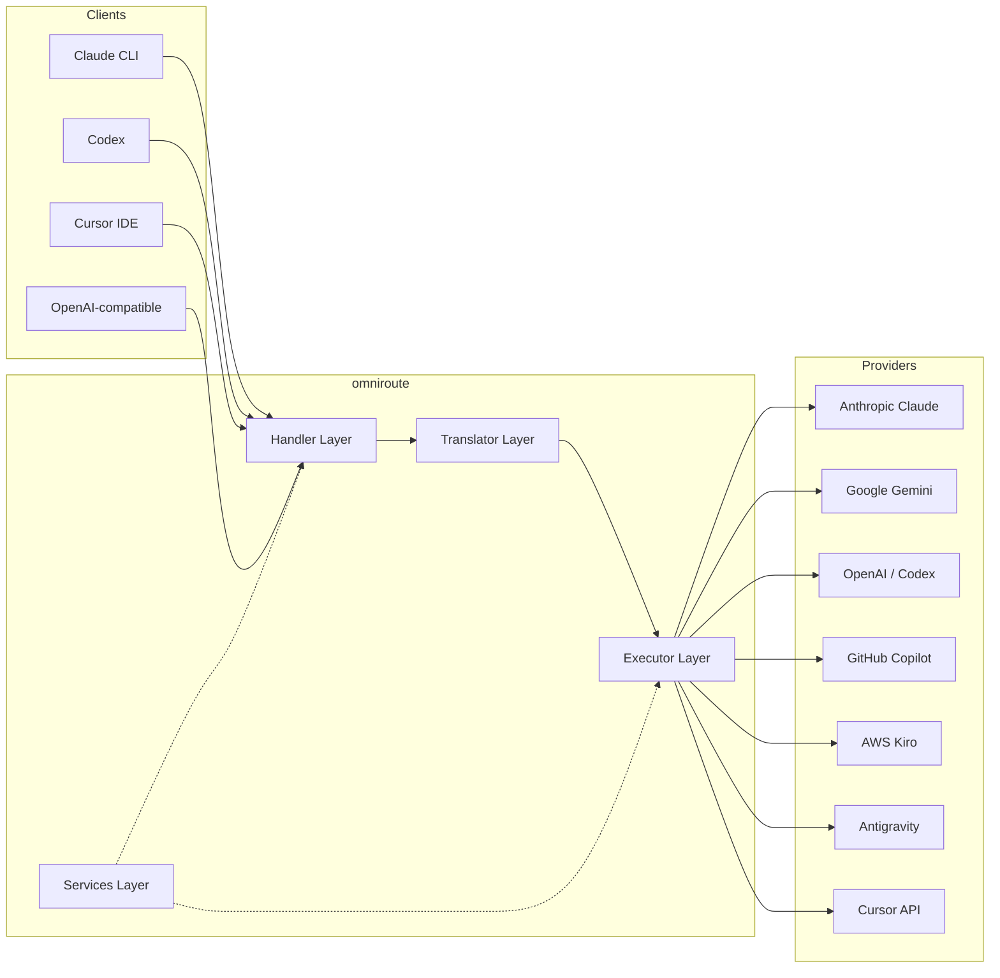
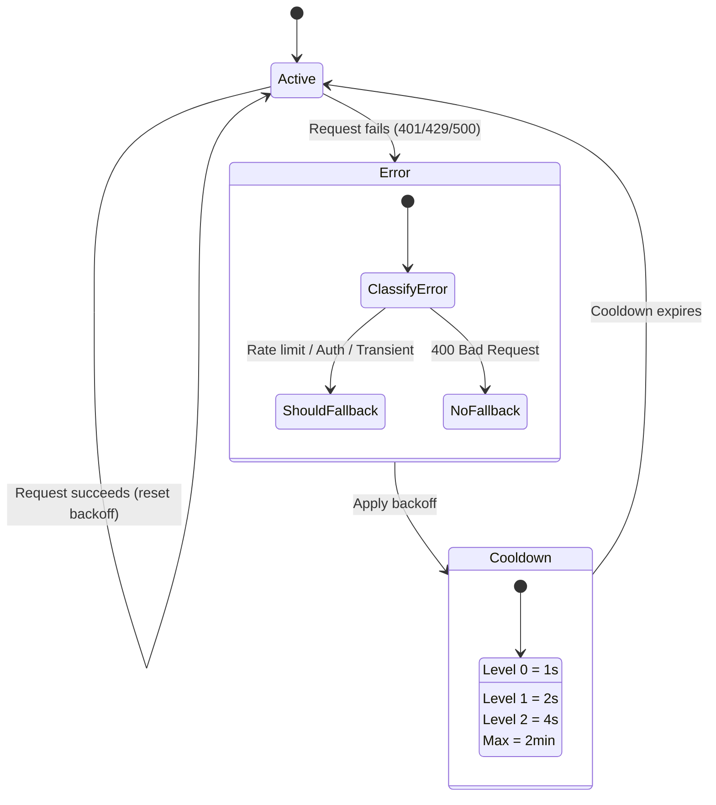
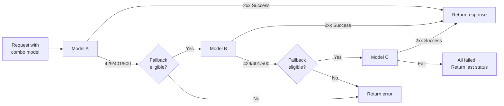
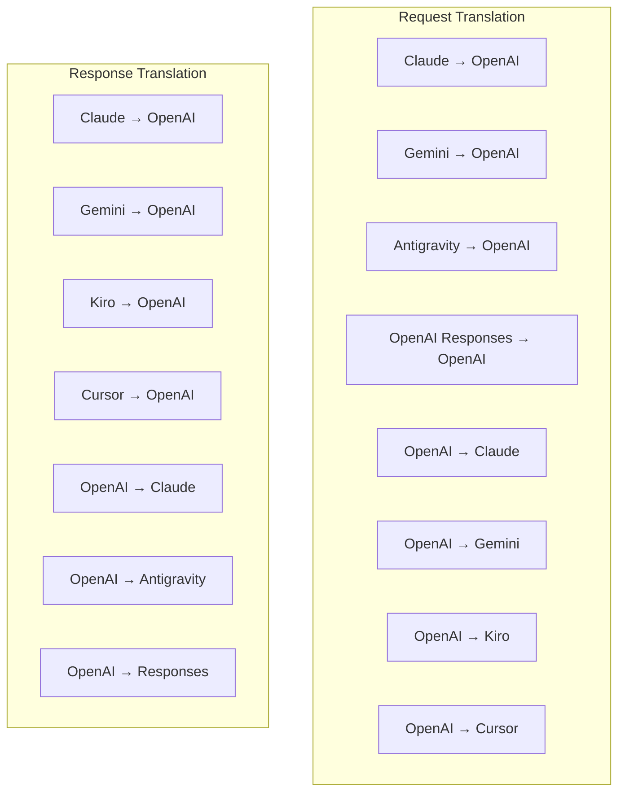
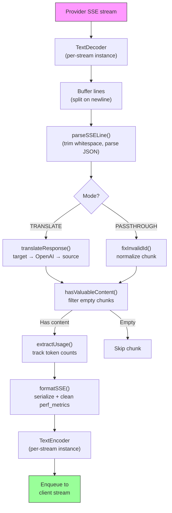
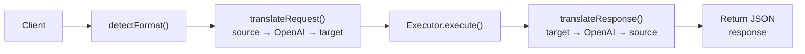
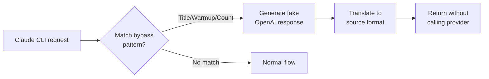

# omniroute — Codebase Documentation (Polski)

🌐 **Languages:** 🇺🇸 [English](../../../../docs/CODEBASE_DOCUMENTATION.md) · 🇪🇸 [es](../../es/docs/CODEBASE_DOCUMENTATION.md) · 🇫🇷 [fr](../../fr/docs/CODEBASE_DOCUMENTATION.md) · 🇩🇪 [de](../../de/docs/CODEBASE_DOCUMENTATION.md) · 🇮🇹 [it](../../it/docs/CODEBASE_DOCUMENTATION.md) · 🇷🇺 [ru](../../ru/docs/CODEBASE_DOCUMENTATION.md) · 🇨🇳 [zh-CN](../../zh-CN/docs/CODEBASE_DOCUMENTATION.md) · 🇯🇵 [ja](../../ja/docs/CODEBASE_DOCUMENTATION.md) · 🇰🇷 [ko](../../ko/docs/CODEBASE_DOCUMENTATION.md) · 🇸🇦 [ar](../../ar/docs/CODEBASE_DOCUMENTATION.md) · 🇮🇳 [hi](../../hi/docs/CODEBASE_DOCUMENTATION.md) · 🇮🇳 [in](../../in/docs/CODEBASE_DOCUMENTATION.md) · 🇹🇭 [th](../../th/docs/CODEBASE_DOCUMENTATION.md) · 🇻🇳 [vi](../../vi/docs/CODEBASE_DOCUMENTATION.md) · 🇮🇩 [id](../../id/docs/CODEBASE_DOCUMENTATION.md) · 🇲🇾 [ms](../../ms/docs/CODEBASE_DOCUMENTATION.md) · 🇳🇱 [nl](../../nl/docs/CODEBASE_DOCUMENTATION.md) · 🇵🇱 [pl](../../pl/docs/CODEBASE_DOCUMENTATION.md) · 🇸🇪 [sv](../../sv/docs/CODEBASE_DOCUMENTATION.md) · 🇳🇴 [no](../../no/docs/CODEBASE_DOCUMENTATION.md) · 🇩🇰 [da](../../da/docs/CODEBASE_DOCUMENTATION.md) · 🇫🇮 [fi](../../fi/docs/CODEBASE_DOCUMENTATION.md) · 🇵🇹 [pt](../../pt/docs/CODEBASE_DOCUMENTATION.md) · 🇷🇴 [ro](../../ro/docs/CODEBASE_DOCUMENTATION.md) · 🇭🇺 [hu](../../hu/docs/CODEBASE_DOCUMENTATION.md) · 🇧🇬 [bg](../../bg/docs/CODEBASE_DOCUMENTATION.md) · 🇸🇰 [sk](../../sk/docs/CODEBASE_DOCUMENTATION.md) · 🇺🇦 [uk-UA](../../uk-UA/docs/CODEBASE_DOCUMENTATION.md) · 🇮🇱 [he](../../he/docs/CODEBASE_DOCUMENTATION.md) · 🇵🇭 [phi](../../phi/docs/CODEBASE_DOCUMENTATION.md) · 🇧🇷 [pt-BR](../../pt-BR/docs/CODEBASE_DOCUMENTATION.md) · 🇨🇿 [cs](../../cs/docs/CODEBASE_DOCUMENTATION.md) · 🇹🇷 [tr](../../tr/docs/CODEBASE_DOCUMENTATION.md)

---

> Obszerny, przyjazny dla początkujących przewodnik po routerze proxy AI**omniroute**obsługującym wielu dostawców.---

## 1. What Is omniroute?

omniroute to**router proxy**, który znajduje się pomiędzy klientami AI (Claude CLI, Codex, Cursor IDE itp.) a dostawcami AI (Anthropic, Google, OpenAI, AWS, GitHub itp.). Rozwiązuje jeden duży problem:

> **Różni klienci AI mówią różnymi „językami” (formatami API), a różni dostawcy AI również oczekują różnych „języków”.**omniroute dokonuje automatycznego tłumaczenia między nimi.

Pomyśl o tym jak o uniwersalnym tłumaczu w Organizacji Narodów Zjednoczonych — każdy delegat może mówić w dowolnym języku, a tłumacz konwertuje go na dowolnego innego delegata.---

## 2. Architecture Overview



### Core Principle: Hub-and-Spoke Translation

Tłumaczenie wszystkich formatów przechodzi przez**format OpenAI jako centrum**:```
Client Format → [OpenAI Hub] → Provider Format (request)
Provider Format → [OpenAI Hub] → Client Format (response)

```

Oznacza to, że potrzebujesz tylko**N tłumaczy**(po jednym na format) zamiast**N²**(każda para).---

## 3. Project Structure

```

omniroute/
├── open-sse/ ← Core proxy library (portable, framework-agnostic)
│ ├── index.js ← Main entry point, exports everything
│ ├── config/ ← Configuration & constants
│ ├── executors/ ← Provider-specific request execution
│ ├── handlers/ ← Request handling orchestration
│ ├── services/ ← Business logic (auth, models, fallback, usage)
│ ├── translator/ ← Format translation engine
│ │ ├── request/ ← Request translators (8 files)
│ │ ├── response/ ← Response translators (7 files)
│ │ └── helpers/ ← Shared translation utilities (6 files)
│ └── utils/ ← Utility functions
├── src/ ← Application layer (Express/Worker runtime)
│ ├── app/ ← Web UI, API routes, middleware
│ ├── lib/ ← Database, auth, and shared library code
│ ├── mitm/ ← Man-in-the-middle proxy utilities
│ ├── models/ ← Database models
│ ├── shared/ ← Shared utilities (wrappers around open-sse)
│ ├── sse/ ← SSE endpoint handlers
│ └── store/ ← State management
├── data/ ← Runtime data (credentials, logs)
│ └── provider-credentials.json (external credentials override, gitignored)
└── tester/ ← Test utilities

````

---

## 4. Module-by-Module Breakdown

### 4.1 Config (`open-sse/config/`)

**Pojedyncze źródło prawdy**dla wszystkich konfiguracji dostawców.

| Plik | Cel |
| ------------------------------ | -------------------------------------------------------------------------------------------------------------------------------------------------------------------------------------------------------------------- |
| `stałe.ts` | Obiekt `PROVIDERS` z podstawowymi adresami URL, poświadczeniami OAuth (domyślne), nagłówkami i domyślnymi monitami systemowymi dla każdego dostawcy. Definiuje także `HTTP_STATUS`, `ERROR_TYPES`, `COOLDOWN_MS`, `BACKOFF_CONFIG` i `SKIP_PATTERNS`. |
| `credentialLoader.ts` | Ładuje zewnętrzne dane uwierzytelniające z pliku `data/provider-credentials.json` i łączy je z zakodowanymi na stałe ustawieniami domyślnymi w `PROVIDERS`. Chroni tajemnice przed kontrolą źródła, zachowując jednocześnie kompatybilność wsteczną.               |
| `providerModels.ts` | Centralny rejestr modeli: aliasy dostawców map → identyfikatory modeli. Funkcje takie jak `getModels()`, `getProviderByAlias()`.                                                                                                          |
| `codexInstructions.ts` | Instrukcje systemowe wstrzykiwane do żądań Kodeksu (ograniczenia edycyjne, reguły piaskownicy, zasady zatwierdzania).                                                                                                                 |
| `defaultThinkingSignature.ts` | Domyślne sygnatury „myślące” dla modeli Claude i Gemini.                                                                                                                                                               |
| `ollamaModels.ts` | Definicja schematu dla lokalnych modeli Ollama (nazwa, rozmiar, rodzina, kwantyzacja).                                                                                                                                             |#### Credential Loading Flow

```mermaid
flowchart TD
    A["App starts"] --> B["constants.ts defines PROVIDERS\nwith hardcoded defaults"]
    B --> C{"data/provider-credentials.json\nexists?"}
    C -->|Yes| D["credentialLoader reads JSON"]
    C -->|No| E["Use hardcoded defaults"]
    D --> F{"For each provider in JSON"}
    F --> G{"Provider exists\nin PROVIDERS?"}
    G -->|No| H["Log warning, skip"]
    G -->|Yes| I{"Value is object?"}
    I -->|No| J["Log warning, skip"]
    I -->|Yes| K["Merge clientId, clientSecret,\ntokenUrl, authUrl, refreshUrl"]
    K --> F
    H --> F
    J --> F
    F -->|Done| L["PROVIDERS ready with\nmerged credentials"]
    E --> L
````

---

### 4.2 Executors (`open-sse/executors/`)

Wykonawcy hermetyzują**logikę specyficzną dla dostawcy**przy użyciu**wzorca strategii**. Każdy wykonawca w razie potrzeby zastępuje metody podstawowe.```mermaid
classDiagram
class BaseExecutor {
+buildUrl(model, stream, options)
+buildHeaders(credentials, stream, body)
+transformRequest(body, model, stream, credentials)
+execute(url, options)
+shouldRetry(status, error)
+refreshCredentials(credentials, log)
}

    class DefaultExecutor {
        +refreshCredentials()
    }

    class AntigravityExecutor {
        +buildUrl()
        +buildHeaders()
        +transformRequest()
        +shouldRetry()
        +refreshCredentials()
    }

    class CursorExecutor {
        +buildUrl()
        +buildHeaders()
        +transformRequest()
        +parseResponse()
        +generateChecksum()
    }

    class KiroExecutor {
        +buildUrl()
        +buildHeaders()
        +transformRequest()
        +parseEventStream()
        +refreshCredentials()
    }

    BaseExecutor <|-- DefaultExecutor
    BaseExecutor <|-- AntigravityExecutor
    BaseExecutor <|-- CursorExecutor
    BaseExecutor <|-- KiroExecutor
    BaseExecutor <|-- CodexExecutor
    BaseExecutor <|-- GeminiCLIExecutor
    BaseExecutor <|-- GithubExecutor

````

| Wykonawca | Dostawca | Kluczowe specjalizacje |
| ---------------- | ------------------------------------------ | ------------------------------------------------------------------------------------------------------------------ |
| `baza.ts` | — | Baza abstrakcyjna: budowanie adresów URL, nagłówki, logika ponownych prób, odświeżanie danych logowania |
| `domyślny.ts` | Claude, Gemini, OpenAI, GLM, Kimi, MiniMax | Ogólne odświeżanie tokena OAuth dla standardowych dostawców |
| `antygrawitacja.ts` | Kod Google Cloud | Generowanie identyfikatora projektu/sesji, rezerwowy adres wielu adresów URL, niestandardowa analiza ponownych prób na podstawie komunikatów o błędach („reset po 2h7m23s”) |
| `kursor.ts` | Kursor IDE |**Najbardziej złożone**: uwierzytelnianie sumy kontrolnej SHA-256, kodowanie żądania Protobuf, binarny EventStream → parsowanie odpowiedzi SSE |
| `kodeks.ts` | Kodeks OpenAI | Wstrzykuje instrukcje systemowe, zarządza poziomami myślenia, usuwa nieobsługiwane parametry |
| `gemini-cli.ts` | Interfejs wiersza polecenia Google Gemini | Tworzenie niestandardowego adresu URL (`streamGenerateContent`), odświeżanie tokena Google OAuth |
| `github.ts` | Drugi pilot GitHuba | System podwójnego tokena (GitHub OAuth + token Copilot), naśladowanie nagłówka VSCode |
| `kiro.ts` | Zaklinacz kodów AWS | Parsowanie binarne AWS EventStream, ramki zdarzeń AMZN, szacowanie tokenów |
| `indeks.ts` | — | Fabryka: nazwa dostawcy map → klasa wykonawcy, z domyślnym rezerwowym |---

### 4.3 Handlers (`open-sse/handlers/`)

**Warstwa orkiestracji**— koordynuje tłumaczenie, wykonywanie, przesyłanie strumieniowe i obsługę błędów.

| Plik | Cel |
| ----------------------------------- | -------------------------------------------------------------------------------------------------------------------------------------------------------------------------------------------------------------------------------------- |
| `chatCore.ts` |**Centralny orkiestrator**(~600 linii). Obsługuje pełny cykl życia żądania: wykrywanie formatu → tłumaczenie → wysyłanie modułu wykonawczego → odpowiedź przesyłana strumieniowo/nie przesyłana strumieniowo → odświeżanie tokena → obsługa błędów → rejestrowanie użycia. |
| `responsesHandler.ts` | Adapter dla interfejsu API odpowiedzi OpenAI: konwertuje format odpowiedzi → Uzupełnienia czatu → wysyła do `chatCore` → konwertuje SSE z powrotem do formatu odpowiedzi.                                                                        |
| `embeddings.ts` | Procedura obsługi generowania osadzania: rozwiązuje model osadzania → dostawca, wysyła do interfejsu API dostawcy, zwraca odpowiedź na osadzanie zgodną z OpenAI. Obsługuje ponad 6 dostawców.                                                    |
| `imageGeneration.ts` | Moduł obsługi generowania obrazu: rozpoznaje model obrazu → dostawca, obsługuje tryby zgodne z OpenAI, obraz Gemini (antygrawitacja) i tryb awaryjny (Nebius). Zwraca obrazy base64 lub URL.                                          |#### Request Lifecycle (chatCore.ts)

```mermaid
sequenceDiagram
    participant Client
    participant chatCore
    participant Translator
    participant Executor
    participant Provider

    Client->>chatCore: Request (any format)
    chatCore->>chatCore: Detect source format
    chatCore->>chatCore: Check bypass patterns
    chatCore->>chatCore: Resolve model & provider
    chatCore->>Translator: Translate request (source → OpenAI → target)
    chatCore->>Executor: Get executor for provider
    Executor->>Executor: Build URL, headers, transform request
    Executor->>Executor: Refresh credentials if needed
    Executor->>Provider: HTTP fetch (streaming or non-streaming)

    alt Streaming
        Provider-->>chatCore: SSE stream
        chatCore->>chatCore: Pipe through SSE transform stream
        Note over chatCore: Transform stream translates<br/>each chunk: target → OpenAI → source
        chatCore-->>Client: Translated SSE stream
    else Non-streaming
        Provider-->>chatCore: JSON response
        chatCore->>Translator: Translate response
        chatCore-->>Client: Translated JSON
    end

    alt Error (401, 429, 500...)
        chatCore->>Executor: Retry with credential refresh
        chatCore->>chatCore: Account fallback logic
    end
````

---

### 4.4 Services (`open-sse/services/`)

| Logika biznesowa obsługująca procedury obsługi i wykonawców. | File                                                                                                                                                                                                                                                                                                                                   | Purpose |
| ------------------------------------------------------------ | -------------------------------------------------------------------------------------------------------------------------------------------------------------------------------------------------------------------------------------------------------------------------------------------------------------------------------------- | ------- |
| `provider.ts`                                                | **Format detection** (`detectFormat`): analyzes request body structure to identify Claude/OpenAI/Gemini/Antigravity/Responses formats (includes `max_tokens` heuristic for Claude). Also: URL building, header building, thinking config normalization. Supports `openai-compatible-*` and `anthropic-compatible-*` dynamic providers. |
| `model.ts`                                                   | Model string parsing (`claude/model-name` → `{provider: "claude", model: "model-name"}`), alias resolution with collision detection, input sanitization (rejects path traversal/control chars), and model info resolution with async alias getter support.                                                                             |
| `accountFallback.ts`                                         | Rate-limit handling: exponential backoff (1s → 2s → 4s → max 2min), account cooldown management, error classification (which errors trigger fallback vs. not).                                                                                                                                                                         |
| `tokenRefresh.ts`                                            | OAuth token refresh for **every provider**: Google (Gemini, Antigravity), Claude, Codex, Qwen, Qoder, GitHub (OAuth + Copilot dual-token), Kiro (AWS SSO OIDC + Social Auth). Includes in-flight promise deduplication cache and retry with exponential backoff.                                                                       |
| `combo.ts`                                                   | **Combo models**: chains of fallback models. If model A fails with a fallback-eligible error, try model B, then C, etc. Returns actual upstream status codes.                                                                                                                                                                          |
| `usage.ts`                                                   | Fetches quota/usage data from provider APIs (GitHub Copilot quotas, Antigravity model quotas, Codex rate limits, Kiro usage breakdowns, Claude settings).                                                                                                                                                                              |
| `accountSelector.ts`                                         | Smart account selection with scoring algorithm: considers priority, health status, round-robin position, and cooldown state to pick the optimal account for each request.                                                                                                                                                              |
| `contextManager.ts`                                          | Request context lifecycle management: creates and tracks per-request context objects with metadata (request ID, timestamps, provider info) for debugging and logging.                                                                                                                                                                  |
| `ipFilter.ts`                                                | IP-based access control: supports allowlist and blocklist modes. Validates client IP against configured rules before processing API requests.                                                                                                                                                                                          |
| `sessionManager.ts`                                          | Session tracking with client fingerprinting: tracks active sessions using hashed client identifiers, monitors request counts, and provides session metrics.                                                                                                                                                                            |
| `signatureCache.ts`                                          | Request signature-based deduplication cache: prevents duplicate requests by caching recent request signatures and returning cached responses for identical requests within a time window.                                                                                                                                              |
| `systemPrompt.ts`                                            | Global system prompt injection: prepends or appends a configurable system prompt to all requests, with per-provider compatibility handling.                                                                                                                                                                                            |
| `thinkingBudget.ts`                                          | Reasoning token budget management: supports passthrough, auto (strip thinking config), custom (fixed budget), and adaptive (complexity-scaled) modes for controlling thinking/reasoning tokens.                                                                                                                                        |
| `wildcardRouter.ts`                                          | Wildcard model pattern routing: resolves wildcard patterns (e.g., `*/claude-*`) to concrete provider/model pairs based on availability and priority.                                                                                                                                                                                   |

#### Token Refresh Deduplication

```mermaid
sequenceDiagram
    participant R1 as Request 1
    participant R2 as Request 2
    participant Cache as refreshPromiseCache
    participant OAuth as OAuth Provider

    R1->>Cache: getAccessToken("gemini", token)
    Cache->>Cache: No in-flight promise
    Cache->>OAuth: Start refresh
    R2->>Cache: getAccessToken("gemini", token)
    Cache->>Cache: Found in-flight promise
    Cache-->>R2: Return existing promise
    OAuth-->>Cache: New access token
    Cache-->>R1: New access token
    Cache-->>R2: Same access token (shared)
    Cache->>Cache: Delete cache entry
```

#### Account Fallback State Machine



#### Combo Model Chain



---

### 4.5 Translator (`open-sse/translator/`)

**Silnik tłumaczenia formatów**wykorzystujący system samorejestrujących się wtyczek.#### Architektura



| Katalog      | Pliki        | Opis                                                                                                                                                                                                                                                                                                                 |
| ------------ | ------------ | -------------------------------------------------------------------------------------------------------------------------------------------------------------------------------------------------------------------------------------------------------------------------------------------------------------------- | ----------------------------------------- |
| `prośba/`    | 8 tłumaczy   | Konwertuj treści żądań między formatami. Każdy plik rejestruje się samodzielnie poprzez polecenie „register(from, to, fn)” podczas importu.                                                                                                                                                                          |
| `odpowiedź/` | 7 tłumaczy   | Konwertuj fragmenty odpowiedzi przesyłanych strumieniowo między formatami. Obsługuje typy zdarzeń SSE, bloki myślowe, wywołania narzędzi.                                                                                                                                                                            |
| `pomocnicy/` | 6 pomocników | Udostępnione narzędzia: `claudeHelper` (ekstrakcja podpowiedzi systemowych, konfiguracja myślenia), `geminiHelper` (mapowanie części/zawartości), `openaiHelper` (filtrowanie formatu), `toolCallHelper` (generowanie identyfikatora, wstrzykiwanie brakującej odpowiedzi), `maxTokensHelper`, `responsesApiHelper`. |
| `indeks.ts`  | —            | Silnik tłumaczący: `translateRequest()`, `translateResponse()`, zarządzanie stanem, rejestr.                                                                                                                                                                                                                         |
| `formaty.ts` | —            | Stałe formatu: `OPENAI`, `CLAUDE`, `GEMINI`, `ANTIGRAVITY`, `KIRO`, `CURSOR`, `OPENAI_RESPONSES`.                                                                                                                                                                                                                    | #### Key Design: Self-Registering Plugins |

```javascript
// Each translator file calls register() on import:
import { register } from "../index.js";
register("claude", "openai", translateClaudeToOpenAI);

// The index.js imports all translator files, triggering registration:
import "./request/claude-to-openai.js"; // ← self-registers
```

---

### 4.6 Utils (`open-sse/utils/`)

| Plik               | Cel                                                                                                                                                                                                                                                                                                                                   |
| ------------------ | ------------------------------------------------------------------------------------------------------------------------------------------------------------------------------------------------------------------------------------------------------------------------------------------------------------------------------------- | --------------------------- |
| `błąd.ts`          | Tworzenie reakcji na błędy (format zgodny z OpenAI), analizowanie błędów w górę, ekstrakcja czasu ponownej próby antygrawitacyjnej z komunikatów o błędach, przesyłanie strumieniowe błędów SSE.                                                                                                                                      |
| `strumień.ts`      | **SSE Transform Stream**— główny potok przesyłania strumieniowego. Dwa tryby: `TRANSLATE` (tłumaczenie w pełnym formacie) i `PASSTHROUGH` (normalizacja + wyodrębnienie użycia). Obsługuje buforowanie fragmentów, szacowanie użycia, śledzenie długości treści. Instancje kodera/dekodera na strumień unikają stanu współdzielonego. |
| `streamHelpers.ts` | Narzędzia SSE niskiego poziomu: `parseSSELine` (tolerujący białe znaki), `hasValuableContent` (filtruje puste fragmenty dla OpenAI/Claude/Gemini), `fixInvalidId`, `formatSSE` (serializacja SSE uwzględniająca format z czyszczeniem `perf_metrics`).                                                                                |
| `usageTracking.ts` | Ekstrakcja użycia tokena z dowolnego formatu (Claude/OpenAI/Gemini/Responses), szacowanie za pomocą oddzielnych współczynników znaków na token narzędzia/wiadomości, dodanie bufora (margines bezpieczeństwa 2000 tokenów), filtrowanie pól specyficzne dla formatu, rejestrowanie konsoli za pomocą kolorów ANSI.                    |
| `requestLogger.ts` | Legacy file-based request logging helper kept for compatibility. Current deployments should prefer `APP_LOG_TO_FILE` for application logs and the call log pipeline for persisted request artifacts.                                                                                                                                  |
| `bypassHandler.ts` | Przechwytuje określone wzorce z Claude CLI (wyodrębnianie tytułu, rozgrzewka, liczenie) i zwraca fałszywe odpowiedzi bez wywoływania żadnego dostawcy. Obsługuje zarówno przesyłanie strumieniowe, jak i inne. Celowo ograniczone do zakresu Claude CLI.                                                                              |
| `networkProxy.ts`  | Rozwiązuje wychodzący adres URL proxy dla danego dostawcy z pierwszeństwem: konfiguracja specyficzna dla dostawcy → konfiguracja globalna → zmienne środowiskowe (`HTTPS_PROXY`/`HTTP_PROXY`/`ALL_PROXY`. Obsługuje wykluczenia `NO_PROXY`. Buforuje konfigurację przez 30 sekund.                                                    | #### SSE Streaming Pipeline |



#### Request Logger Session Structure

```
logs/
└── claude_gemini_claude-sonnet_20260208_143045/
    ├── 1_req_client.json      ← Raw client request
    ├── 2_req_source.json      ← After initial conversion
    ├── 3_req_openai.json      ← OpenAI intermediate format
    ├── 4_req_target.json      ← Final target format
    ├── 5_res_provider.txt     ← Provider SSE chunks (streaming)
    ├── 5_res_provider.json    ← Provider response (non-streaming)
    ├── 6_res_openai.txt       ← OpenAI intermediate chunks
    ├── 7_res_client.txt       ← Client-facing SSE chunks
    └── 6_error.json           ← Error details (if any)
```

---

### 4.7 Application Layer (`src/`)

| Katalog          | Cel                                                                                                            |
| ---------------- | -------------------------------------------------------------------------------------------------------------- | ----------------------- |
| `src/aplikacja/` | Interfejs sieciowy, trasy API, oprogramowanie pośredniczące Express, procedury obsługi wywołań zwrotnych OAuth |
| `src/lib/`       | Dostęp do bazy danych (`localDb.ts`, `usageDb.ts`), uwierzytelnianie, współdzielone                            |
| `src/mitm/`      | Narzędzia proxy typu „man-in-the-middle” do przechwytywania ruchu dostawcy                                     |
| `src/modele/`    | Definicje modeli baz danych                                                                                    |
| `src/shared/`    | Opakowania wokół funkcji open-sse (dostawca, strumień, błąd itp.)                                              |
| `src/sse/`       | Procedury obsługi punktów końcowych SSE, które łączą bibliotekę open-sse z trasami Express                     |
| `źródło/sklep/`  | Zarządzanie stanem aplikacji                                                                                   | #### Notable API Routes |

| Route                                         | Metody            | Cel                                                                                                        |
| --------------------------------------------- | ----------------- | ---------------------------------------------------------------------------------------------------------- | --- |
| `/api/provider-models`                        | POBIERZ/POST/USUŃ | CRUD dla niestandardowych modeli na dostawcę                                                               |
| `/api/modele/katalog`                         | OTRZYMAJ          | Zagregowany katalog wszystkich modeli (czat, osadzanie, obraz, niestandardowy) pogrupowany według dostawcy |
| `/api/ustawienia/proxy`                       | POBIERZ/PUT/USUŃ  | Hierarchiczna konfiguracja wychodzącego proxy (`global/providers/combos/keys`)                             |
| `/api/settings/proxy/test`                    | POST              | Sprawdza łączność proxy i zwraca publiczny adres IP/opóźnienie                                             |
| `/v1/providers/[dostawca]/chat/uzupełnienia`  | POST              | Dedykowane uzupełnianie czatów dla poszczególnych dostawców z walidacją modelu                             |
| `/v1/providers/[dostawca]/embeddings`         | POST              | Dedykowane osadzanie dla poszczególnych dostawców z walidacją modelu                                       |
| `/v1/providers/[dostawca]/images/generations` | POST              | Dedykowane generowanie obrazów dla poszczególnych dostawców z walidacją modelu                             |
| `/api/settings/ip-filter`                     | POBIERZ/WSTAW     | Zarządzanie listą dozwolonych/blokowanych adresów IP                                                       |
| `/api/settings/myślenie-budżet`               | POBIERZ/WSTAW     | Konfiguracja budżetu tokena rozumowania (przejściowa/automatyczna/niestandardowa/adaptacyjna)              |
| `/api/settings/system-prompt`                 | POBIERZ/WSTAW     | Globalny systemowy zastrzyk monitu dla wszystkich żądań                                                    |
| `/api/sesje`                                  | OTRZYMAJ          | Śledzenie i metryki aktywnych sesji                                                                        |
| `/api/limity-szybkości`                       | OTRZYMAJ          | Stan limitu stawek za konto                                                                                | --- |

## 5. Key Design Patterns

### 5.1 Hub-and-Spoke Translation

Wszystkie formaty są tłumaczone poprzez**format OpenAI jako centrum**. Dodanie nowego dostawcy wymaga jedynie napisania**jednej pary**tłumaczy (do/z OpenAI), a nie N par.### 5.2 Executor Strategy Pattern

Każdy dostawca ma dedykowaną klasę executora dziedziczącą z `BaseExecutor`. Fabryka w `executors/index.ts` wybiera właściwą w czasie wykonywania.### 5.3 Self-Registering Plugin System

Moduły tłumacza rejestrują się podczas importu poprzez `register()`. Dodanie nowego tłumacza polega po prostu na utworzeniu pliku i zaimportowaniu go.### 5.4 Account Fallback with Exponential Backoff

Kiedy dostawca zwróci 429/401/500, system może przełączyć się na następne konto, stosując wykładnicze czasy odnowienia (1 s → 2 s → 4 s → maksymalnie 2 minuty).### 5.5 Combo Model Chains

„Kombinacja” grupuje wiele ciągów „dostawca/model”. Jeśli pierwszy się nie powiedzie, automatycznie wróć do następnego.### 5.6 Stateful Streaming Translation

Tłumaczenie odpowiedzi utrzymuje stan we wszystkich fragmentach SSE (śledzenie bloków myślowych, gromadzenie wywołań narzędzi, indeksowanie bloków treści) poprzez mechanizm `initState()`.### 5.7 Usage Safety Buffer

Do raportowanego użycia dodawany jest bufor o pojemności 2000 tokenów, aby zapobiec przekraczaniu przez klientów limitów okna kontekstowego z powodu narzutu wynikającego z monitów systemowych i translacji formatów.---

## 6. Supported Formats

| Formatuj                                  | Kierunek     | Identyfikator       |
| ----------------------------------------- | ------------ | ------------------- | --- |
| Ukończenie czatu OpenAI                   | źródło + cel | `openai`            |
| API odpowiedzi OpenAI                     | źródło + cel | `odpowiedzi openai` |
| Antropiczny Claude                        | źródło + cel | ,,klaudiusz”        |
| Google Bliźnięta                          | źródło + cel | `bliźniaki`         |
| Interfejs wiersza polecenia Google Gemini | tylko cel    | `gemini-cli`        |
| Antygrawitacja                            | źródło + cel | „antygrawitacja”    |
| AWS Kiro                                  | tylko cel    | `kiro`              |
| Kursor                                    | tylko cel    | `kursor`            | --- |

## 7. Supported Providers

| Dostawca                                  | Metoda autoryzacji               | Wykonawca      | Kluczowe notatki                                                         |
| ----------------------------------------- | -------------------------------- | -------------- | ------------------------------------------------------------------------ | --- |
| Antropiczny Claude                        | Klucz API lub OAuth              | Domyślne       | Używa nagłówka `x-api-key`                                               |
| Google Bliźnięta                          | Klucz API lub OAuth              | Domyślne       | Używa nagłówka `x-goog-api-key`                                          |
| Interfejs wiersza polecenia Google Gemini | OAuth                            | BliźniętaCLI   | Używa punktu końcowego `streamGenerateContent`                           |
| Antygrawitacja                            | OAuth                            | Antygrawitacja | Zastępczy adres wielu adresów URL, niestandardowa analiza ponownych prób |
| OpenAI                                    | Klucz API                        | Domyślne       | Autoryzacja okaziciela standardowego                                     |
| Kodeks                                    | OAuth                            | Kodeks         | Wstrzykuje instrukcje systemowe, zarządza myśleniem                      |
| Drugi pilot GitHuba                       | OAuth + token drugiego pilota    | GitHub         | Podwójny token, nagłówek VSCode naśladujący                              |
| Kiro (AWS)                                | AWS SSO OIDC lub społecznościowe | Kiro           | Analiza binarnego strumienia zdarzeń                                     |
| Kursor IDE                                | Autoryzacja sumy kontrolnej      | Kursor         | Kodowanie Protobuf, sumy kontrolne SHA-256                               |
| Qwen                                      | OAuth                            | Domyślne       | Autoryzacja standardowa                                                  |
| Qoder                                     | OAuth (podstawowy + nośnik)      | Domyślne       | Nagłówek podwójnego uwierzytelniania                                     |
| OtwórzRouter                              | Klucz API                        | Domyślne       | Autoryzacja okaziciela standardowego                                     |
| GLM, Kimi, MiniMax                        | Klucz API                        | Domyślne       | Kompatybilny z Claude, użyj `x-api-key`                                  |
| `kompatybilny z Openai-*`                 | Klucz API                        | Domyślne       | Dynamiczny: dowolny punkt końcowy zgodny z OpenAI                        |
| `antropijnie-*`                           | Klucz API                        | Domyślne       | Dynamiczny: dowolny punkt końcowy zgodny z Claude                        | --- |

## 8. Data Flow Summary

### Streaming Request

```mermaid
flowchart LR
    A["Client"] --> B["detectFormat()"]
    B --> C["translateRequest()\nsource → OpenAI → target"]
    C --> D["Executor\nbuildUrl + buildHeaders"]
    D --> E["fetch(providerURL)"]
    E --> F["createSSEStream()\nTRANSLATE mode"]
    F --> G["parseSSELine()"]
    G --> H["translateResponse()\ntarget → OpenAI → source"]
    H --> I["extractUsage()\n+ addBuffer"]
    I --> J["formatSSE()"]
    J --> K["Client receives\ntranslated SSE"]
    K --> L["logUsage()\nsaveRequestUsage()"]
```



### Non-Streaming Request



### Bypass Flow (Claude CLI)


