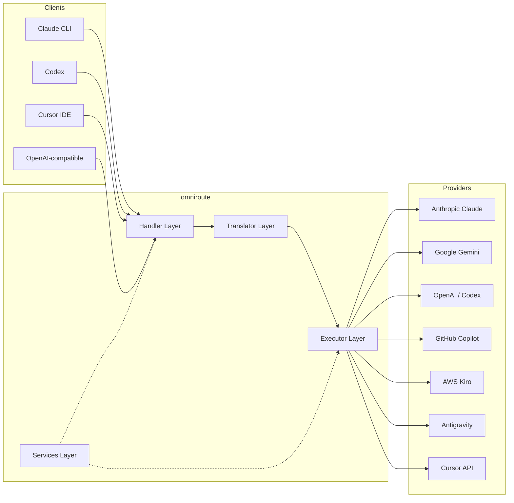
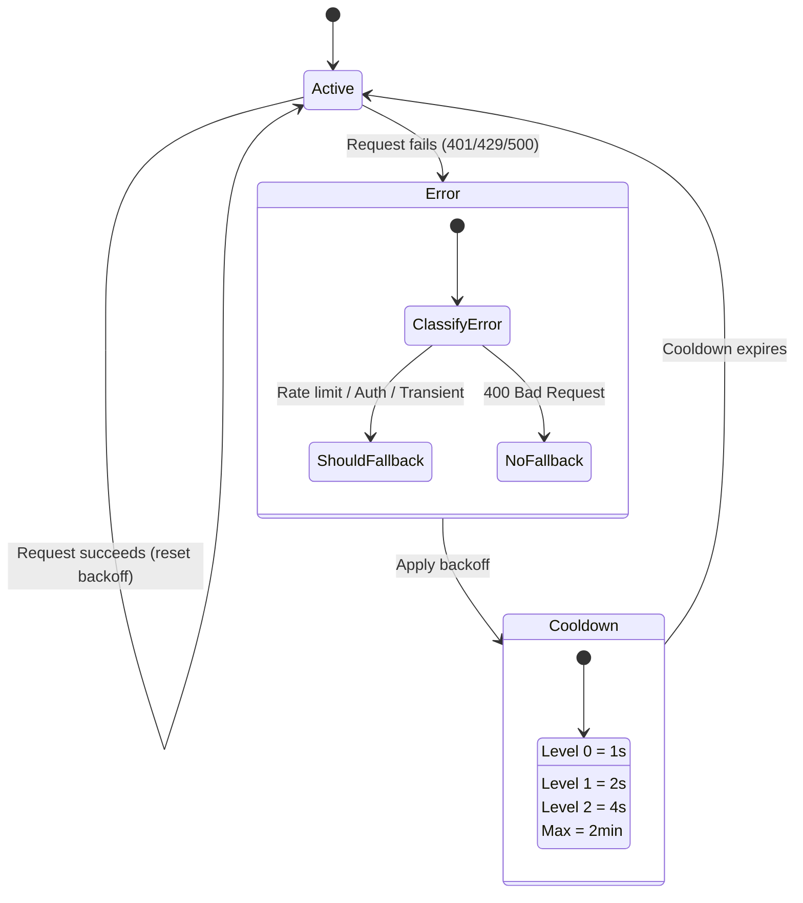
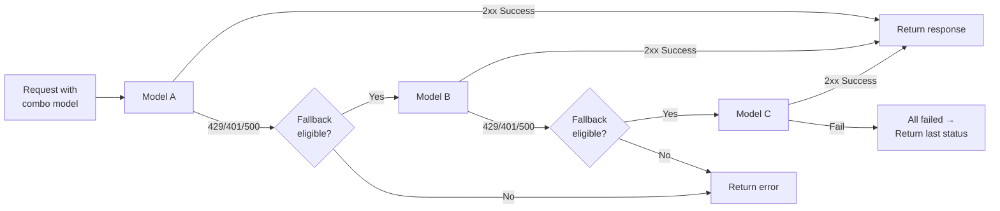
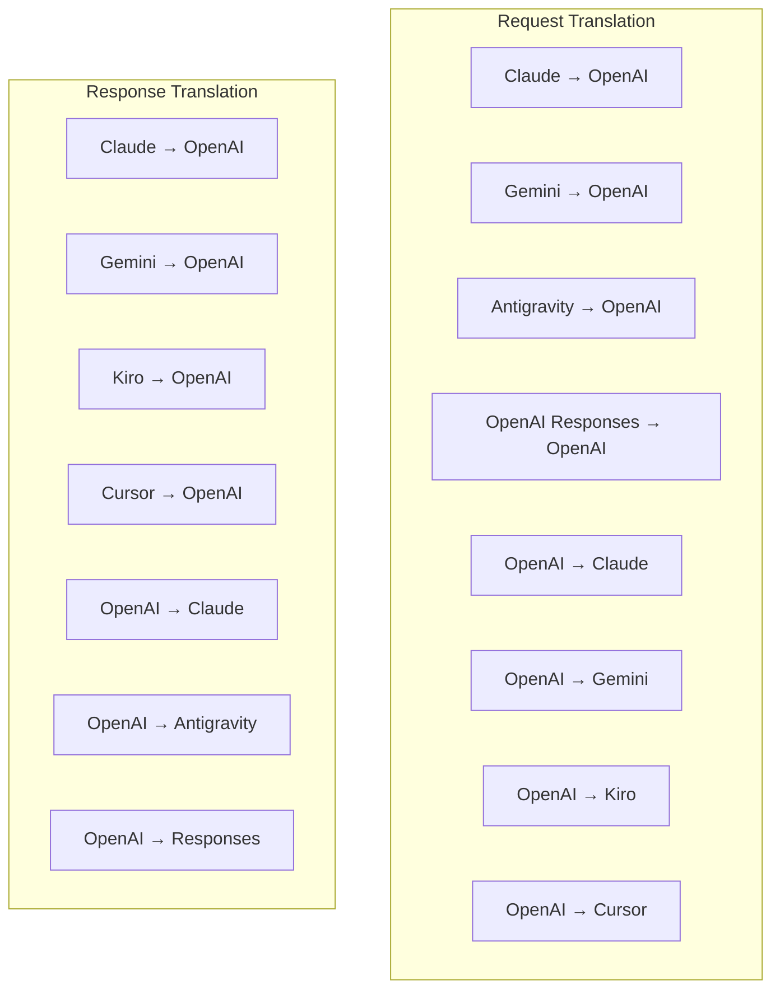
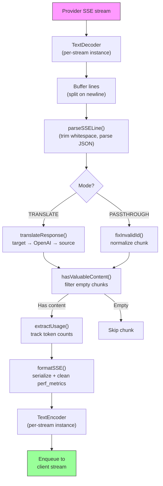
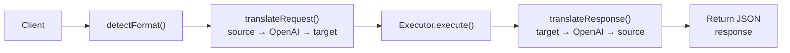
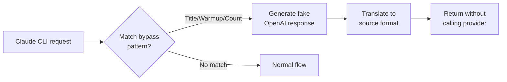

# omniroute — Codebase Documentation (Português (Portugal))

🌐 **Languages:** 🇺🇸 [English](../../../../docs/CODEBASE_DOCUMENTATION.md) · 🇪🇸 [es](../../es/docs/CODEBASE_DOCUMENTATION.md) · 🇫🇷 [fr](../../fr/docs/CODEBASE_DOCUMENTATION.md) · 🇩🇪 [de](../../de/docs/CODEBASE_DOCUMENTATION.md) · 🇮🇹 [it](../../it/docs/CODEBASE_DOCUMENTATION.md) · 🇷🇺 [ru](../../ru/docs/CODEBASE_DOCUMENTATION.md) · 🇨🇳 [zh-CN](../../zh-CN/docs/CODEBASE_DOCUMENTATION.md) · 🇯🇵 [ja](../../ja/docs/CODEBASE_DOCUMENTATION.md) · 🇰🇷 [ko](../../ko/docs/CODEBASE_DOCUMENTATION.md) · 🇸🇦 [ar](../../ar/docs/CODEBASE_DOCUMENTATION.md) · 🇮🇳 [hi](../../hi/docs/CODEBASE_DOCUMENTATION.md) · 🇮🇳 [in](../../in/docs/CODEBASE_DOCUMENTATION.md) · 🇹🇭 [th](../../th/docs/CODEBASE_DOCUMENTATION.md) · 🇻🇳 [vi](../../vi/docs/CODEBASE_DOCUMENTATION.md) · 🇮🇩 [id](../../id/docs/CODEBASE_DOCUMENTATION.md) · 🇲🇾 [ms](../../ms/docs/CODEBASE_DOCUMENTATION.md) · 🇳🇱 [nl](../../nl/docs/CODEBASE_DOCUMENTATION.md) · 🇵🇱 [pl](../../pl/docs/CODEBASE_DOCUMENTATION.md) · 🇸🇪 [sv](../../sv/docs/CODEBASE_DOCUMENTATION.md) · 🇳🇴 [no](../../no/docs/CODEBASE_DOCUMENTATION.md) · 🇩🇰 [da](../../da/docs/CODEBASE_DOCUMENTATION.md) · 🇫🇮 [fi](../../fi/docs/CODEBASE_DOCUMENTATION.md) · 🇵🇹 [pt](../../pt/docs/CODEBASE_DOCUMENTATION.md) · 🇷🇴 [ro](../../ro/docs/CODEBASE_DOCUMENTATION.md) · 🇭🇺 [hu](../../hu/docs/CODEBASE_DOCUMENTATION.md) · 🇧🇬 [bg](../../bg/docs/CODEBASE_DOCUMENTATION.md) · 🇸🇰 [sk](../../sk/docs/CODEBASE_DOCUMENTATION.md) · 🇺🇦 [uk-UA](../../uk-UA/docs/CODEBASE_DOCUMENTATION.md) · 🇮🇱 [he](../../he/docs/CODEBASE_DOCUMENTATION.md) · 🇵🇭 [phi](../../phi/docs/CODEBASE_DOCUMENTATION.md) · 🇧🇷 [pt-BR](../../pt-BR/docs/CODEBASE_DOCUMENTATION.md) · 🇨🇿 [cs](../../cs/docs/CODEBASE_DOCUMENTATION.md) · 🇹🇷 [tr](../../tr/docs/CODEBASE_DOCUMENTATION.md)

---

> Um guia abrangente e para iniciantes sobre o roteador proxy AI multiprovedor**omniroute**.---

## 1. What Is omniroute?

omniroute é um**roteador proxy**que fica entre clientes de IA (Claude CLI, Codex, Cursor IDE, etc.) e provedores de IA (Anthropic, Google, OpenAI, AWS, GitHub, etc.). Isso resolve um grande problema:

> **Diferentes clientes de IA falam "idiomas" diferentes (formatos de API), e diferentes provedores de IA também esperam "idiomas" diferentes.**omniroute traduz entre eles automaticamente.

Pense nisso como um tradutor universal nas Nações Unidas – qualquer delegado pode falar qualquer idioma, e o tradutor converte para qualquer outro delegado.---

## 2. Architecture Overview



### Core Principle: Hub-and-Spoke Translation

Toda a tradução de formato passa pelo**formato OpenAI como hub**:```
Client Format → [OpenAI Hub] → Provider Format (request)
Provider Format → [OpenAI Hub] → Client Format (response)

```

Isso significa que você só precisa de**N tradutores**(um por formato) em vez de**N²**(cada par).---

## 3. Project Structure

```

omniroute/
├── open-sse/ ← Core proxy library (portable, framework-agnostic)
│ ├── index.js ← Main entry point, exports everything
│ ├── config/ ← Configuration & constants
│ ├── executors/ ← Provider-specific request execution
│ ├── handlers/ ← Request handling orchestration
│ ├── services/ ← Business logic (auth, models, fallback, usage)
│ ├── translator/ ← Format translation engine
│ │ ├── request/ ← Request translators (8 files)
│ │ ├── response/ ← Response translators (7 files)
│ │ └── helpers/ ← Shared translation utilities (6 files)
│ └── utils/ ← Utility functions
├── src/ ← Application layer (Express/Worker runtime)
│ ├── app/ ← Web UI, API routes, middleware
│ ├── lib/ ← Database, auth, and shared library code
│ ├── mitm/ ← Man-in-the-middle proxy utilities
│ ├── models/ ← Database models
│ ├── shared/ ← Shared utilities (wrappers around open-sse)
│ ├── sse/ ← SSE endpoint handlers
│ └── store/ ← State management
├── data/ ← Runtime data (credentials, logs)
│ └── provider-credentials.json (external credentials override, gitignored)
└── tester/ ← Test utilities

````

---

## 4. Module-by-Module Breakdown

### 4.1 Config (`open-sse/config/`)

A**única fonte de verdade**para todas as configurações do provedor.

| Arquivo | Finalidade |
| ----------------------------- | ----------------------------------------------------------------------------------------------------------------------------------------------------------------------------------------------------------------------------------- |
| `constantes.ts` | Objeto `PROVIDERS` com URLs base, credenciais OAuth (padrões), cabeçalhos e prompts padrão do sistema para cada provedor. Também define `HTTP_STATUS`, `ERROR_TYPES`, `COOLDOWN_MS`, `BACKOFF_CONFIG` e `SKIP_PATTERNS`. |
| `credentialLoader.ts` | Carrega credenciais externas de `data/provider-credentials.json` e as mescla sobre os padrões codificados em `PROVIDERS`. Mantém os segredos fora do controle de origem, mantendo a compatibilidade com versões anteriores.               |
| `providerModels.ts` | Registro central de modelos: aliases de provedores de mapas → IDs de modelos. Funções como `getModels()`, `getProviderByAlias()`.                                                                                                          |
| `codexInstructions.ts` | Instruções do sistema injetadas em solicitações do Codex (restrições de edição, regras de sandbox, políticas de aprovação).                                                                                                                 |
| `defaultThinkingSignature.ts` | Assinaturas de "pensamento" padrão para os modelos Claude e Gemini.                                                                                                                                                               |
| `ollamaModels.ts` | Definição de esquema para modelos locais de Ollama (nome, tamanho, família, quantização).                                                                                                                                             |#### Credential Loading Flow

```mermaid
flowchart TD
    A["App starts"] --> B["constants.ts defines PROVIDERS\nwith hardcoded defaults"]
    B --> C{"data/provider-credentials.json\nexists?"}
    C -->|Yes| D["credentialLoader reads JSON"]
    C -->|No| E["Use hardcoded defaults"]
    D --> F{"For each provider in JSON"}
    F --> G{"Provider exists\nin PROVIDERS?"}
    G -->|No| H["Log warning, skip"]
    G -->|Yes| I{"Value is object?"}
    I -->|No| J["Log warning, skip"]
    I -->|Yes| K["Merge clientId, clientSecret,\ntokenUrl, authUrl, refreshUrl"]
    K --> F
    H --> F
    J --> F
    F -->|Done| L["PROVIDERS ready with\nmerged credentials"]
    E --> L
````

---

### 4.2 Executors (`open-sse/executors/`)

Os executores encapsulam**lógica específica do provedor**usando o**Padrão de estratégia**. Cada executor substitui os métodos básicos conforme necessário.```mermaid
classDiagram
class BaseExecutor {
+buildUrl(model, stream, options)
+buildHeaders(credentials, stream, body)
+transformRequest(body, model, stream, credentials)
+execute(url, options)
+shouldRetry(status, error)
+refreshCredentials(credentials, log)
}

    class DefaultExecutor {
        +refreshCredentials()
    }

    class AntigravityExecutor {
        +buildUrl()
        +buildHeaders()
        +transformRequest()
        +shouldRetry()
        +refreshCredentials()
    }

    class CursorExecutor {
        +buildUrl()
        +buildHeaders()
        +transformRequest()
        +parseResponse()
        +generateChecksum()
    }

    class KiroExecutor {
        +buildUrl()
        +buildHeaders()
        +transformRequest()
        +parseEventStream()
        +refreshCredentials()
    }

    BaseExecutor <|-- DefaultExecutor
    BaseExecutor <|-- AntigravityExecutor
    BaseExecutor <|-- CursorExecutor
    BaseExecutor <|-- KiroExecutor
    BaseExecutor <|-- CodexExecutor
    BaseExecutor <|-- GeminiCLIExecutor
    BaseExecutor <|-- GithubExecutor

````

| Executor | Provedor | Principais Especializações |
| ---------------- | ------------------------------------------ | ------------------------------------------------------------------------------------------------------------------- |
| `base.ts` | — | Base abstrata: construção de URL, cabeçalhos, lógica de repetição, atualização de credenciais |
| `default.ts` | Claude, Gêmeos, OpenAI, GLM, Kimi, MiniMax | Atualização genérica de token OAuth para provedores padrão |
| `antigravidade.ts` | Código do Google Cloud | Geração de ID de projeto/sessão, fallback de vários URLs, análise de repetição personalizada de mensagens de erro ("redefinir após 2h7m23s") |
| `cursor.ts` | Cursor IDE |**Mais complexo**: autenticação de soma de verificação SHA-256, codificação de solicitação Protobuf, EventStream binário → análise de resposta SSE |
| `codex.ts` | Códice OpenAI | Injeta instruções do sistema, gerencia níveis de pensamento, remove parâmetros não suportados |
| `gemini-cli.ts` | CLI do Google Gemini | Criação de URL personalizada (`streamGenerateContent`), atualização de token OAuth do Google |
| `github.ts` | Copiloto GitHub | Sistema de token duplo (token GitHub OAuth + Copilot), imitação de cabeçalho VSCode |
| `kiro.ts` | AWS CodeWhisperer | Análise binária AWS EventStream, event frames AMZN, estimativa de token |
| `index.ts` | — | Fábrica: nome do provedor de mapas → classe do executor, com fallback padrão |---

### 4.3 Handlers (`open-sse/handlers/`)

A**camada de orquestração**— coordena tradução, execução, streaming e tratamento de erros.

| Arquivo | Finalidade |
| --------------------- | ---------------------------------------------------------------------------------------------------------------------------------------------------------------------------------------------------------------------- |
| `chatCore.ts` |**Orquestrador central**(~600 linhas). Lida com o ciclo de vida completo da solicitação: detecção de formato → tradução → envio do executor → resposta de streaming/não streaming → atualização de token → tratamento de erros → registro de uso. |
| `responsesHandler.ts` | Adaptador para API de respostas da OpenAI: converte o formato de respostas → conclusões de bate-papo → envia para `chatCore` → converte SSE de volta para o formato de respostas.                                                                        |
| `embeddings.ts` | Manipulador de geração de incorporação: resolve o modelo de incorporação → provedor, despacha para a API do provedor, retorna uma resposta de incorporação compatível com OpenAI. Suporta mais de 6 provedores.                                                    |
| `imageGeneration.ts` | Manipulador de geração de imagem: resolve modelo de imagem → provedor, suporta modos compatíveis com OpenAI, imagem Gemini (Antigravidade) e fallback (Nebius). Retorna imagens base64 ou URL.                                          |#### Request Lifecycle (chatCore.ts)

```mermaid
sequenceDiagram
    participant Client
    participant chatCore
    participant Translator
    participant Executor
    participant Provider

    Client->>chatCore: Request (any format)
    chatCore->>chatCore: Detect source format
    chatCore->>chatCore: Check bypass patterns
    chatCore->>chatCore: Resolve model & provider
    chatCore->>Translator: Translate request (source → OpenAI → target)
    chatCore->>Executor: Get executor for provider
    Executor->>Executor: Build URL, headers, transform request
    Executor->>Executor: Refresh credentials if needed
    Executor->>Provider: HTTP fetch (streaming or non-streaming)

    alt Streaming
        Provider-->>chatCore: SSE stream
        chatCore->>chatCore: Pipe through SSE transform stream
        Note over chatCore: Transform stream translates<br/>each chunk: target → OpenAI → source
        chatCore-->>Client: Translated SSE stream
    else Non-streaming
        Provider-->>chatCore: JSON response
        chatCore->>Translator: Translate response
        chatCore-->>Client: Translated JSON
    end

    alt Error (401, 429, 500...)
        chatCore->>Executor: Retry with credential refresh
        chatCore->>chatCore: Account fallback logic
    end
````

---

### 4.4 Services (`open-sse/services/`)

| Lógica de negócios que dá suporte aos manipuladores e executores. | File                                                                                                                                                                                                                                                                                                                                   | Purpose |
| ----------------------------------------------------------------- | -------------------------------------------------------------------------------------------------------------------------------------------------------------------------------------------------------------------------------------------------------------------------------------------------------------------------------------- | ------- |
| `provider.ts`                                                     | **Format detection** (`detectFormat`): analyzes request body structure to identify Claude/OpenAI/Gemini/Antigravity/Responses formats (includes `max_tokens` heuristic for Claude). Also: URL building, header building, thinking config normalization. Supports `openai-compatible-*` and `anthropic-compatible-*` dynamic providers. |
| `model.ts`                                                        | Model string parsing (`claude/model-name` → `{provider: "claude", model: "model-name"}`), alias resolution with collision detection, input sanitization (rejects path traversal/control chars), and model info resolution with async alias getter support.                                                                             |
| `accountFallback.ts`                                              | Rate-limit handling: exponential backoff (1s → 2s → 4s → max 2min), account cooldown management, error classification (which errors trigger fallback vs. not).                                                                                                                                                                         |
| `tokenRefresh.ts`                                                 | OAuth token refresh for **every provider**: Google (Gemini, Antigravity), Claude, Codex, Qwen, Qoder, GitHub (OAuth + Copilot dual-token), Kiro (AWS SSO OIDC + Social Auth). Includes in-flight promise deduplication cache and retry with exponential backoff.                                                                       |
| `combo.ts`                                                        | **Combo models**: chains of fallback models. If model A fails with a fallback-eligible error, try model B, then C, etc. Returns actual upstream status codes.                                                                                                                                                                          |
| `usage.ts`                                                        | Fetches quota/usage data from provider APIs (GitHub Copilot quotas, Antigravity model quotas, Codex rate limits, Kiro usage breakdowns, Claude settings).                                                                                                                                                                              |
| `accountSelector.ts`                                              | Smart account selection with scoring algorithm: considers priority, health status, round-robin position, and cooldown state to pick the optimal account for each request.                                                                                                                                                              |
| `contextManager.ts`                                               | Request context lifecycle management: creates and tracks per-request context objects with metadata (request ID, timestamps, provider info) for debugging and logging.                                                                                                                                                                  |
| `ipFilter.ts`                                                     | IP-based access control: supports allowlist and blocklist modes. Validates client IP against configured rules before processing API requests.                                                                                                                                                                                          |
| `sessionManager.ts`                                               | Session tracking with client fingerprinting: tracks active sessions using hashed client identifiers, monitors request counts, and provides session metrics.                                                                                                                                                                            |
| `signatureCache.ts`                                               | Request signature-based deduplication cache: prevents duplicate requests by caching recent request signatures and returning cached responses for identical requests within a time window.                                                                                                                                              |
| `systemPrompt.ts`                                                 | Global system prompt injection: prepends or appends a configurable system prompt to all requests, with per-provider compatibility handling.                                                                                                                                                                                            |
| `thinkingBudget.ts`                                               | Reasoning token budget management: supports passthrough, auto (strip thinking config), custom (fixed budget), and adaptive (complexity-scaled) modes for controlling thinking/reasoning tokens.                                                                                                                                        |
| `wildcardRouter.ts`                                               | Wildcard model pattern routing: resolves wildcard patterns (e.g., `*/claude-*`) to concrete provider/model pairs based on availability and priority.                                                                                                                                                                                   |

#### Token Refresh Deduplication

```mermaid
sequenceDiagram
    participant R1 as Request 1
    participant R2 as Request 2
    participant Cache as refreshPromiseCache
    participant OAuth as OAuth Provider

    R1->>Cache: getAccessToken("gemini", token)
    Cache->>Cache: No in-flight promise
    Cache->>OAuth: Start refresh
    R2->>Cache: getAccessToken("gemini", token)
    Cache->>Cache: Found in-flight promise
    Cache-->>R2: Return existing promise
    OAuth-->>Cache: New access token
    Cache-->>R1: New access token
    Cache-->>R2: Same access token (shared)
    Cache->>Cache: Delete cache entry
```

#### Account Fallback State Machine



#### Combo Model Chain



---

### 4.5 Translator (`open-sse/translator/`)

O**mecanismo de tradução de formatos**usando um sistema de plugins com autorregistro.#### Arquitetura



| Diretório      | Arquivos     | Descrição                                                                                                                                                                                                                                                                                              |
| -------------- | ------------ | ------------------------------------------------------------------------------------------------------------------------------------------------------------------------------------------------------------------------------------------------------------------------------------------------------ | ----------------------------------------- |
| `solicitação/` | 8 tradutores | Converta corpos de solicitação entre formatos. Cada arquivo é registrado automaticamente via `register(from, to, fn)` na importação.                                                                                                                                                                   |
| `resposta/`    | 7 tradutores | Converta pedaços de resposta de streaming entre formatos. Lida com tipos de eventos SSE, blocos de pensamento e chamadas de ferramentas.                                                                                                                                                               |
| `ajudantes/`   | 6 ajudantes  | Utilitários compartilhados: `claudeHelper` (extração de prompt do sistema, configuração de pensamento), `geminiHelper` (mapeamento de partes/conteúdo), `openaiHelper` (filtragem de formato), `toolCallHelper` (geração de ID, injeção de resposta ausente), `maxTokensHelper`, `responsesApiHelper`. |
| `index.ts`     | —            | Mecanismo de tradução: `translateRequest()`, `translateResponse()`, gerenciamento de estado, registro.                                                                                                                                                                                                 |
| `formatos.ts`  | —            | Constantes de formato: `OPENAI`, `CLAUDE`, `GEMINI`, `ANTIGRAVITY`, `KIRO`, `CURSOR`, `OPENAI_RESPONSES`.                                                                                                                                                                                              | #### Key Design: Self-Registering Plugins |

```javascript
// Each translator file calls register() on import:
import { register } from "../index.js";
register("claude", "openai", translateClaudeToOpenAI);

// The index.js imports all translator files, triggering registration:
import "./request/claude-to-openai.js"; // ← self-registers
```

---

### 4.6 Utils (`open-sse/utils/`)

| Arquivo            | Finalidade                                                                                                                                                                                                                                                                                                                                    |
| ------------------ | --------------------------------------------------------------------------------------------------------------------------------------------------------------------------------------------------------------------------------------------------------------------------------------------------------------------------------------------- | --------------------------- |
| `erro.ts`          | Criação de resposta a erros (formato compatível com OpenAI), análise de erros upstream, extração de tempo de repetição antigravidade de mensagens de erro, streaming de erros SSE.                                                                                                                                                            |
| `stream.ts`        | **SSE Transform Stream**— o principal pipeline de streaming. Dois modos: `TRANSLATE` (tradução de formato completo) e `PASSTHROUGH` (normalizar + extrair o uso). Lida com buffer de blocos, estimativa de uso e rastreamento de comprimento de conteúdo. As instâncias do codificador/decodificador por fluxo evitam o estado compartilhado. |
| `streamHelpers.ts` | Utilitários SSE de baixo nível: `parseSSELine` (tolerante a espaços em branco), `hasValuableContent` (filtra pedaços vazios para OpenAI/Claude/Gemini), `fixInvalidId`, `formatSSE` (serialização SSE com reconhecimento de formato com limpeza `perf_metrics`).                                                                              |
| `usageTracking.ts` | Extração de uso de token de qualquer formato (Claude/OpenAI/Gemini/Responses), estimativa com proporções separadas de caracteres por ferramenta/mensagem por token, adição de buffer (margem de segurança de 2.000 tokens), filtragem de campo específica de formato, registro de console com cores ANSI.                                     |
| `requestLogger.ts` | Legacy file-based request logging helper kept for compatibility. Current deployments should prefer `APP_LOG_TO_FILE` for application logs and the call log pipeline for persisted request artifacts.                                                                                                                                          |
| `bypassHandler.ts` | Intercepta padrões específicos do Claude CLI (extração de título, aquecimento, contagem) e retorna respostas falsas sem ligar para nenhum provedor. Suporta streaming e não streaming. Intencionalmente limitado ao escopo Claude CLI.                                                                                                        |
| `networkProxy.ts`  | Resolve URL de proxy de saída para um determinado provedor com precedência: configuração específica do provedor → configuração global → variáveis ​​de ambiente (`HTTPS_PROXY`/`HTTP_PROXY`/`ALL_PROXY`). Suporta exclusões `NO_PROXY`. Configuração de caches por 30s.                                                                       | #### SSE Streaming Pipeline |



#### Request Logger Session Structure

```
logs/
└── claude_gemini_claude-sonnet_20260208_143045/
    ├── 1_req_client.json      ← Raw client request
    ├── 2_req_source.json      ← After initial conversion
    ├── 3_req_openai.json      ← OpenAI intermediate format
    ├── 4_req_target.json      ← Final target format
    ├── 5_res_provider.txt     ← Provider SSE chunks (streaming)
    ├── 5_res_provider.json    ← Provider response (non-streaming)
    ├── 6_res_openai.txt       ← OpenAI intermediate chunks
    ├── 7_res_client.txt       ← Client-facing SSE chunks
    └── 6_error.json           ← Error details (if any)
```

---

### 4.7 Application Layer (`src/`)

| Diretório            | Finalidade                                                                             |
| -------------------- | -------------------------------------------------------------------------------------- | ----------------------- |
| `src/app/`           | UI da Web, rotas de API, middleware Express, manipuladores de retorno de chamada OAuth |
| `src/lib/`           | Acesso ao banco de dados (`localDb.ts`, `usageDb.ts`), autenticação, compartilhada     |
| `src/mitm/`          | Utilitários proxy man-in-the-middle para interceptar o tráfego do provedor             |
| `src/modelos/`       | Definições de modelo de banco de dados                                                 |
| `src/compartilhado/` | Wrappers em torno de funções open-sse (provedor, fluxo, erro, etc.)                    |
| `src/sse/`           | Manipuladores de endpoint SSE que conectam a biblioteca open-sse às rotas Express      |
| `src/loja/`          | Gerenciamento de estado de aplicação                                                   | #### Notable API Routes |

| Rota                                         | Métodos               | Finalidade                                                                                             |
| -------------------------------------------- | --------------------- | ------------------------------------------------------------------------------------------------------ | --- |
| `/api/provider-models`                       | OBTER/POSTAR/EXCLUIR  | CRUD para modelos customizados por provedor                                                            |
| `/api/models/catálogo`                       | OBTER                 | Catálogo agregado de todos os modelos (chat, incorporação, imagem, customizado) agrupados por provedor |
| `/api/settings/proxy`                        | OBTER/COLOCAR/EXCLUIR | Configuração hierárquica de proxy de saída (`global/providers/combos/keys`)                            |
| `/api/settings/proxy/test`                   | POSTAR                | Valida a conectividade do proxy e retorna IP público/latência                                          |
| `/v1/provedores/[provedor]/chat/completions` | POSTAR                | Conclusões de chat dedicadas por provedor com validação de modelo                                      |
| `/v1/provedores/[provedor]/embeddings`       | POSTAR                | Incorporações dedicadas por provedor com validação de modelo                                           |
| `/v1/provedores/[provedor]/imagens/gerações` | POSTAR                | Geração de imagens dedicadas por provedor com validação de modelo                                      |
| `/api/settings/ip-filtro`                    | OBTER/COLOCAR         | Gerenciamento de lista de permissão/lista de bloqueio de IP                                            |
| `/api/settings/pensamento-orçamento`         | OBTER/COLOCAR         | Configuração do orçamento do token de raciocínio (passagem/automática/personalizada/adaptável)         |
| `/api/settings/prompt do sistema`            | OBTER/COLOCAR         | Injeção imediata do sistema global para todas as solicitações                                          |
| `/api/sessões`                               | OBTER                 | Acompanhamento e métricas de sessões ativas                                                            |
| `/api/limites de taxa`                       | OBTER                 | Status do limite de taxa por conta                                                                     | --- |

## 5. Key Design Patterns

### 5.1 Hub-and-Spoke Translation

Todos os formatos são traduzidos através do**formato OpenAI como hub**. Adicionar um novo provedor requer apenas escrever**um par**de tradutores (de/para OpenAI), não N pares.### 5.2 Executor Strategy Pattern

Cada provedor possui uma classe de executor dedicada que herda de `BaseExecutor`. A fábrica em `executors/index.ts` seleciona o correto em tempo de execução.### 5.3 Self-Registering Plugin System

Os módulos tradutores se registram na importação via `register()`. Adicionar um novo tradutor é apenas criar um arquivo e importá-lo.### 5.4 Account Fallback with Exponential Backoff

Quando um provedor retorna 429/401/500, o sistema pode mudar para a próxima conta, aplicando cooldowns exponenciais (1s → 2s → 4s → máx. 2min).### 5.5 Combo Model Chains

Um "combo" agrupa múltiplas strings `provedor/modelo`. Se o primeiro falhar, volte para o próximo automaticamente.### 5.6 Stateful Streaming Translation

A tradução de resposta mantém o estado em blocos SSE (rastreamento de blocos de pensamento, acúmulo de chamadas de ferramentas, indexação de blocos de conteúdo) por meio do mecanismo `initState()`.### 5.7 Usage Safety Buffer

Um buffer de 2.000 tokens é adicionado ao uso relatado para evitar que os clientes atinjam os limites da janela de contexto devido à sobrecarga dos prompts do sistema e da tradução de formato.---

## 6. Supported Formats

| Formato                        | Direção          | Identificador      |
| ------------------------------ | ---------------- | ------------------ | --- |
| Conclusões do bate-papo OpenAI | origem + destino | `openai`           |
| API de respostas OpenAI        | origem + destino | `openai-respostas` |
| Claude Antrópico               | origem + destino | `cláudio`          |
| Google Gêmeos                  | origem + destino | `gêmeos`           |
| CLI do Google Gemini           | apenas alvo      | `gemini-cli`       |
| Antigravidade                  | origem + destino | `antigravidade`    |
| AWSKiro                        | apenas alvo      | `kiro`             |
| Cursor                         | apenas alvo      | `cursor`           | --- |

## 7. Supported Providers

| Provedor                     | Método de autenticação              | Executor      | Notas principais                                            |
| ---------------------------- | ----------------------------------- | ------------- | ----------------------------------------------------------- | --- |
| Claude Antrópico             | Chave API ou OAuth                  | Padrão        | Usa cabeçalho `x-api-key`                                   |
| Google Gêmeos                | Chave API ou OAuth                  | Padrão        | Usa cabeçalho `x-goog-api-key`                              |
| CLI do Google Gemini         | OAuth                               | GêmeosCLI     | Usa o endpoint `streamGenerateContent`                      |
| Antigravidade                | OAuth                               | Antigravidade | Fallback de vários URLs, análise de repetição personalizada |
| OpenAI                       | Chave de API                        | Padrão        | Autenticação do portador padrão                             |
| Códice                       | OAuth                               | Códice        | Injeta instruções do sistema, gerencia o pensamento         |
| Copiloto GitHub              | Token OAuth + Copiloto              | GitHub        | Token duplo, imitação de cabeçalho VSCode                   |
| Kiro (AWS)                   | AWS SSO OIDC ou social              | Kiro          | Análise binária de EventStream                              |
| Cursor IDE                   | Autenticação de soma de verificação | Cursor        | Codificação protobuf, somas de verificação SHA-256          |
| Qwen                         | OAuth                               | Padrão        | Autenticação padrão                                         |
| Qoder                        | OAuth (Básico + Portador)           | Padrão        | Cabeçalho de autenticação dupla                             |
| OpenRouter                   | Chave de API                        | Padrão        | Autenticação do portador padrão                             |
| GLM, Kimi, MiniMax           | Chave de API                        | Padrão        | Compatível com Claude, use `x-api-key`                      |
| `openai-compatível-*`        | Chave de API                        | Padrão        | Dinâmico: qualquer endpoint compatível com OpenAI           |
| `compatível com antrópico-*` | Chave de API                        | Padrão        | Dinâmico: qualquer endpoint compatível com Claude           | --- |

## 8. Data Flow Summary

### Streaming Request

```mermaid
flowchart LR
    A["Client"] --> B["detectFormat()"]
    B --> C["translateRequest()\nsource → OpenAI → target"]
    C --> D["Executor\nbuildUrl + buildHeaders"]
    D --> E["fetch(providerURL)"]
    E --> F["createSSEStream()\nTRANSLATE mode"]
    F --> G["parseSSELine()"]
    G --> H["translateResponse()\ntarget → OpenAI → source"]
    H --> I["extractUsage()\n+ addBuffer"]
    I --> J["formatSSE()"]
    J --> K["Client receives\ntranslated SSE"]
    K --> L["logUsage()\nsaveRequestUsage()"]
```



### Non-Streaming Request



### Bypass Flow (Claude CLI)


