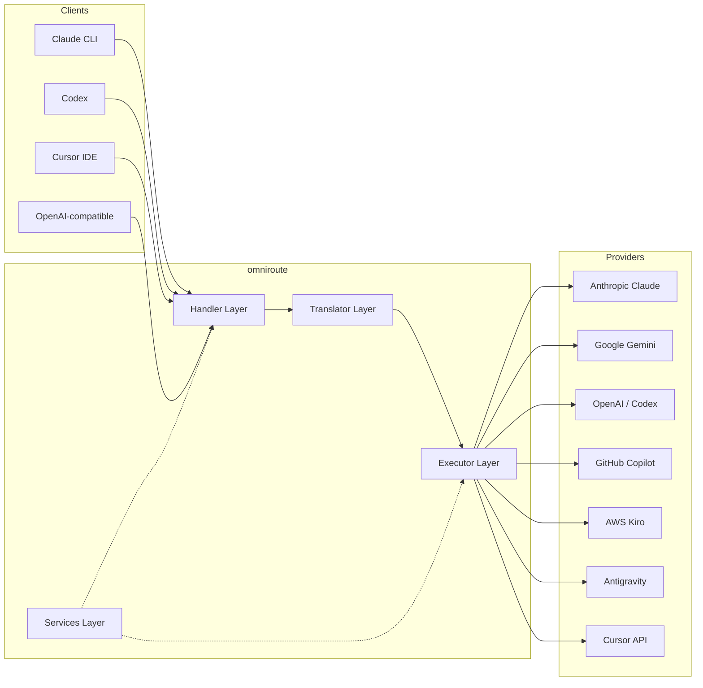
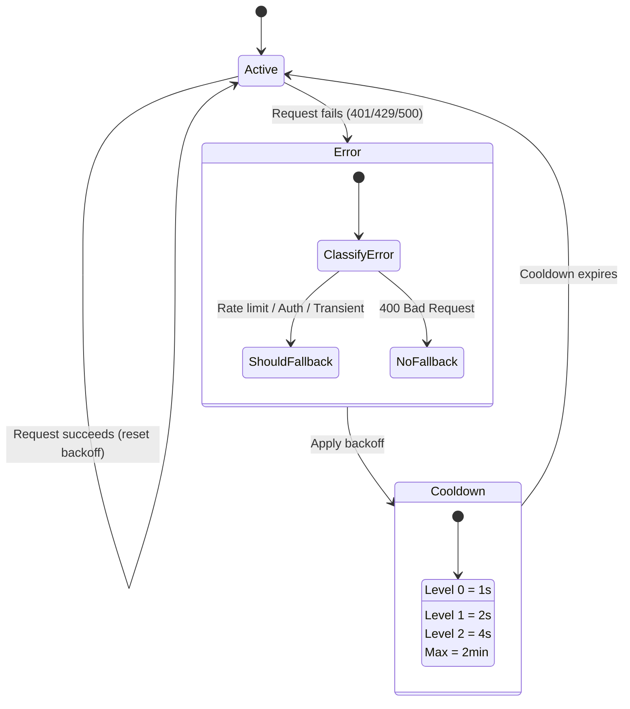
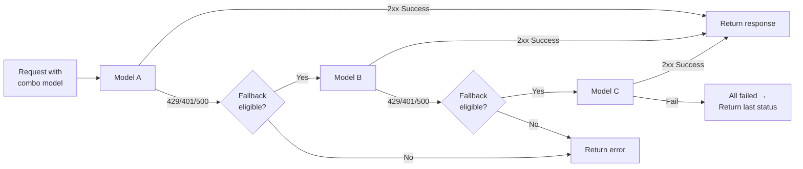
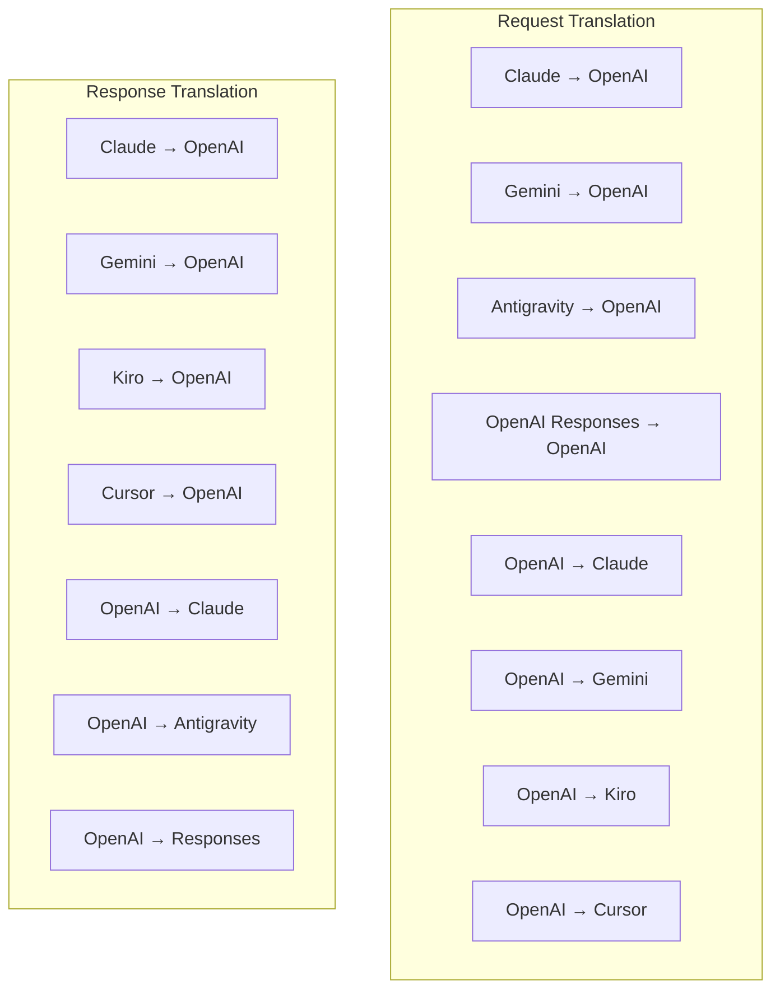
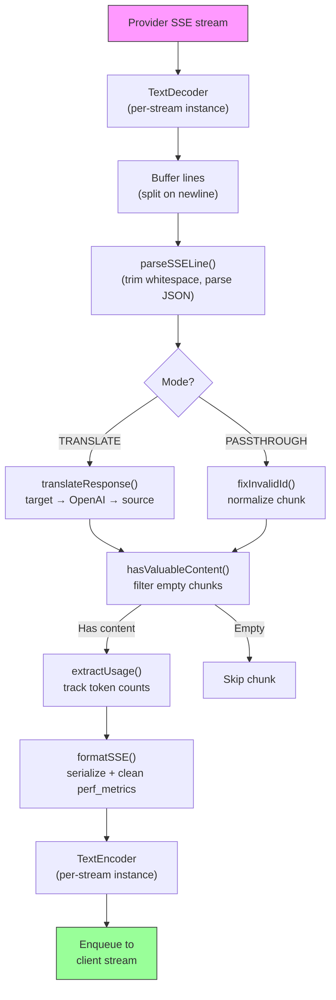
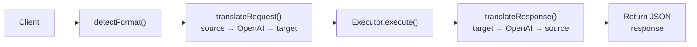
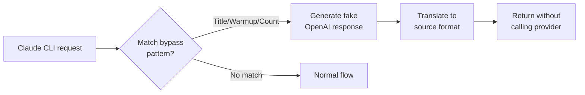

# omniroute — Codebase Documentation (Română)

🌐 **Languages:** 🇺🇸 [English](../../../../docs/CODEBASE_DOCUMENTATION.md) · 🇪🇸 [es](../../es/docs/CODEBASE_DOCUMENTATION.md) · 🇫🇷 [fr](../../fr/docs/CODEBASE_DOCUMENTATION.md) · 🇩🇪 [de](../../de/docs/CODEBASE_DOCUMENTATION.md) · 🇮🇹 [it](../../it/docs/CODEBASE_DOCUMENTATION.md) · 🇷🇺 [ru](../../ru/docs/CODEBASE_DOCUMENTATION.md) · 🇨🇳 [zh-CN](../../zh-CN/docs/CODEBASE_DOCUMENTATION.md) · 🇯🇵 [ja](../../ja/docs/CODEBASE_DOCUMENTATION.md) · 🇰🇷 [ko](../../ko/docs/CODEBASE_DOCUMENTATION.md) · 🇸🇦 [ar](../../ar/docs/CODEBASE_DOCUMENTATION.md) · 🇮🇳 [hi](../../hi/docs/CODEBASE_DOCUMENTATION.md) · 🇮🇳 [in](../../in/docs/CODEBASE_DOCUMENTATION.md) · 🇹🇭 [th](../../th/docs/CODEBASE_DOCUMENTATION.md) · 🇻🇳 [vi](../../vi/docs/CODEBASE_DOCUMENTATION.md) · 🇮🇩 [id](../../id/docs/CODEBASE_DOCUMENTATION.md) · 🇲🇾 [ms](../../ms/docs/CODEBASE_DOCUMENTATION.md) · 🇳🇱 [nl](../../nl/docs/CODEBASE_DOCUMENTATION.md) · 🇵🇱 [pl](../../pl/docs/CODEBASE_DOCUMENTATION.md) · 🇸🇪 [sv](../../sv/docs/CODEBASE_DOCUMENTATION.md) · 🇳🇴 [no](../../no/docs/CODEBASE_DOCUMENTATION.md) · 🇩🇰 [da](../../da/docs/CODEBASE_DOCUMENTATION.md) · 🇫🇮 [fi](../../fi/docs/CODEBASE_DOCUMENTATION.md) · 🇵🇹 [pt](../../pt/docs/CODEBASE_DOCUMENTATION.md) · 🇷🇴 [ro](../../ro/docs/CODEBASE_DOCUMENTATION.md) · 🇭🇺 [hu](../../hu/docs/CODEBASE_DOCUMENTATION.md) · 🇧🇬 [bg](../../bg/docs/CODEBASE_DOCUMENTATION.md) · 🇸🇰 [sk](../../sk/docs/CODEBASE_DOCUMENTATION.md) · 🇺🇦 [uk-UA](../../uk-UA/docs/CODEBASE_DOCUMENTATION.md) · 🇮🇱 [he](../../he/docs/CODEBASE_DOCUMENTATION.md) · 🇵🇭 [phi](../../phi/docs/CODEBASE_DOCUMENTATION.md) · 🇧🇷 [pt-BR](../../pt-BR/docs/CODEBASE_DOCUMENTATION.md) · 🇨🇿 [cs](../../cs/docs/CODEBASE_DOCUMENTATION.md) · 🇹🇷 [tr](../../tr/docs/CODEBASE_DOCUMENTATION.md)

---

> Un ghid cuprinzător, prietenos pentru începători, pentru routerul proxy AI cu mai mulți furnizori**omniroute**.---

## 1. What Is omniroute?

omniroute este un**router proxy**care se află între clienții AI (Claude CLI, Codex, Cursor IDE etc.) și furnizorii AI (Anthropic, Google, OpenAI, AWS, GitHub etc.). Rezolvă o mare problemă:

> **Diferiți clienți AI vorbesc diferite „limbi” (formate API), iar diferiți furnizori de AI se așteaptă și ei la „limbi” diferite.**Omniroute se traduce automat între ele.

Gândiți-vă la asta ca la un traducător universal la Națiunile Unite - orice delegat poate vorbi orice limbă, iar traducătorul o convertește pentru orice alt delegat.---

## 2. Architecture Overview



### Core Principle: Hub-and-Spoke Translation

Toată traducerea formatului trece prin**formatul OpenAI ca hub**:```
Client Format → [OpenAI Hub] → Provider Format (request)
Provider Format → [OpenAI Hub] → Client Format (response)

```

Aceasta înseamnă că aveți nevoie doar de**N traducători**(unul pentru fiecare format) în loc de**N²**(fiecare pereche).---

## 3. Project Structure

```

omniroute/
├── open-sse/ ← Core proxy library (portable, framework-agnostic)
│ ├── index.js ← Main entry point, exports everything
│ ├── config/ ← Configuration & constants
│ ├── executors/ ← Provider-specific request execution
│ ├── handlers/ ← Request handling orchestration
│ ├── services/ ← Business logic (auth, models, fallback, usage)
│ ├── translator/ ← Format translation engine
│ │ ├── request/ ← Request translators (8 files)
│ │ ├── response/ ← Response translators (7 files)
│ │ └── helpers/ ← Shared translation utilities (6 files)
│ └── utils/ ← Utility functions
├── src/ ← Application layer (Express/Worker runtime)
│ ├── app/ ← Web UI, API routes, middleware
│ ├── lib/ ← Database, auth, and shared library code
│ ├── mitm/ ← Man-in-the-middle proxy utilities
│ ├── models/ ← Database models
│ ├── shared/ ← Shared utilities (wrappers around open-sse)
│ ├── sse/ ← SSE endpoint handlers
│ └── store/ ← State management
├── data/ ← Runtime data (credentials, logs)
│ └── provider-credentials.json (external credentials override, gitignored)
└── tester/ ← Test utilities

````

---

## 4. Module-by-Module Breakdown

### 4.1 Config (`open-sse/config/`)

**Sursa unică de adevăr**pentru configurația tuturor furnizorilor.

| Fișier | Scop |
| ----------------------------- | ------------------------------------------------------------------------------------------------ ------------------------------------------------------------------------------------------------- |
| `constante.ts` | Obiect „PROVIDERS” cu adrese URL de bază, acreditări OAuth (implicite), anteturi și solicitări implicite de sistem pentru fiecare furnizor. De asemenea, definește `HTTP_STATUS`, `ERROR_TYPES`, `COOLOWN_MS`, `BACKOFF_CONFIG` și `SKIP_PATTERNS`. |
| `credentialLoader.ts` | Încarcă acreditările externe din `data/provider-credentials.json` și le îmbină peste valorile implicite codificate în `PROVIDERS`. Păstrează secretele sub controlul sursei, menținând în același timp compatibilitatea cu versiunea inversă.               |
| `providerModels.ts` | Registrul central de modele: hărți aliasuri furnizori → ID-uri model. Funcții precum `getModels()`, `getProviderByAlias()`.                                                                                                          |
| `codexInstructions.ts` | Instrucțiuni de sistem injectate în cererile Codex (constrângeri de editare, reguli sandbox, politici de aprobare).                                                                                                                 |
| `defaultThinkingSignature.ts` | Semnături implicite „de gândire” pentru modelele Claude și Gemini.                                                                                                                                                               |
| `ollamaModels.ts` | Definirea schemei pentru modelele locale Ollama (nume, dimensiune, familie, cuantizare).                                                                                                                                             |#### Credential Loading Flow

```mermaid
flowchart TD
    A["App starts"] --> B["constants.ts defines PROVIDERS\nwith hardcoded defaults"]
    B --> C{"data/provider-credentials.json\nexists?"}
    C -->|Yes| D["credentialLoader reads JSON"]
    C -->|No| E["Use hardcoded defaults"]
    D --> F{"For each provider in JSON"}
    F --> G{"Provider exists\nin PROVIDERS?"}
    G -->|No| H["Log warning, skip"]
    G -->|Yes| I{"Value is object?"}
    I -->|No| J["Log warning, skip"]
    I -->|Yes| K["Merge clientId, clientSecret,\ntokenUrl, authUrl, refreshUrl"]
    K --> F
    H --> F
    J --> F
    F -->|Done| L["PROVIDERS ready with\nmerged credentials"]
    E --> L
````

---

### 4.2 Executors (`open-sse/executors/`)

Executorii încapsulează**logica specifică furnizorului**utilizând**Modelul de strategie**. Fiecare executant anulează metodele de bază după cum este necesar.```mermaid
classDiagram
class BaseExecutor {
+buildUrl(model, stream, options)
+buildHeaders(credentials, stream, body)
+transformRequest(body, model, stream, credentials)
+execute(url, options)
+shouldRetry(status, error)
+refreshCredentials(credentials, log)
}

    class DefaultExecutor {
        +refreshCredentials()
    }

    class AntigravityExecutor {
        +buildUrl()
        +buildHeaders()
        +transformRequest()
        +shouldRetry()
        +refreshCredentials()
    }

    class CursorExecutor {
        +buildUrl()
        +buildHeaders()
        +transformRequest()
        +parseResponse()
        +generateChecksum()
    }

    class KiroExecutor {
        +buildUrl()
        +buildHeaders()
        +transformRequest()
        +parseEventStream()
        +refreshCredentials()
    }

    BaseExecutor <|-- DefaultExecutor
    BaseExecutor <|-- AntigravityExecutor
    BaseExecutor <|-- CursorExecutor
    BaseExecutor <|-- KiroExecutor
    BaseExecutor <|-- CodexExecutor
    BaseExecutor <|-- GeminiCLIExecutor
    BaseExecutor <|-- GithubExecutor

````

| Executant | Furnizor | Specializări cheie |
| ---------------- | ------------------------------------------ | ---------------------------------------------------------------------------------------------------|
| `base.ts` | — | Bază abstractă: crearea adresei URL, anteturi, logica reîncercării, reîmprospătarea acreditărilor |
| `default.ts` | Claude, Gemeni, OpenAI, GLM, Kimi, MiniMax | Reîmprospătare generică a jetonului OAuth pentru furnizorii standard |
| `antigravitație.ts` | Cod Google Cloud | Generarea ID-ului de proiect/sesiune, alternativă cu mai multe adrese URL, reîncercare personalizată de analiză din mesajele de eroare („resetare după 2h7m23s”) |
| `cursor.ts` | Cursor IDE |**Cel mai complex**: SHA-256 checksum auth, codificare cerere Protobuf, binar EventStream → analiza răspuns SSE |
| `codex.ts` | OpenAI Codex | Injectează instrucțiuni de sistem, gestionează nivelurile de gândire, elimină parametrii neacceptați |
| `gemini-cli.ts` | Google Gemini CLI | Creare URL personalizată (`streamGenerateContent`), reîmprospătare simbol OAuth Google |
| `github.ts` | GitHub Copilot | Sistem dual token (GitHub OAuth + token Copilot), imitarea antetului VSCode |
| `kiro.ts` | AWS CodeWhisperer | Analiza binară AWS EventStream, cadre de evenimente AMZN, estimare token |
| `index.ts` | — | Fabrică: numele furnizorului de hărți → clasa executorului, cu fallback implicit |---

### 4.3 Handlers (`open-sse/handlers/`)

**Stratul de orchestrare**— coordonează traducerea, execuția, transmiterea în flux și gestionarea erorilor.

| Fișier | Scop |
| --------------------- | ------------------------------------------------------------------------------------------------- ------------------------------------------------------------------------------------------------- |
| `chatCore.ts` |**Orchestrator central**(~600 de linii). Se ocupă de ciclul de viață complet al cererii: detectarea formatului → traducerea → expedierea executorului → răspunsul în flux/non-streaming → reîmprospătarea simbolului → gestionarea erorilor → înregistrarea utilizării. |
| `responsesHandler.ts` | Adaptor pentru API-ul OpenAI Responses: convertește formatul de răspunsuri → Terminări de chat → trimite la `chatCore` → convertește SSE înapoi în formatul de răspunsuri.                                                                        |
| `embeddings.ts` | Managerul de generare de încorporare: rezolvă modelul de încorporare → furnizor, trimite către API-ul furnizorului, returnează un răspuns de încorporare compatibil OpenAI. Suportă peste 6 furnizori.                                                    |
| `imageGeneration.ts` | Managerul de generare a imaginii: rezolvă modelul de imagine → furnizor, acceptă modurile compatibile cu OpenAI, Gemini-image (antigravitație) și modurile de rezervă (Nebius). Returnează imagini base64 sau URL.                                          |#### Request Lifecycle (chatCore.ts)

```mermaid
sequenceDiagram
    participant Client
    participant chatCore
    participant Translator
    participant Executor
    participant Provider

    Client->>chatCore: Request (any format)
    chatCore->>chatCore: Detect source format
    chatCore->>chatCore: Check bypass patterns
    chatCore->>chatCore: Resolve model & provider
    chatCore->>Translator: Translate request (source → OpenAI → target)
    chatCore->>Executor: Get executor for provider
    Executor->>Executor: Build URL, headers, transform request
    Executor->>Executor: Refresh credentials if needed
    Executor->>Provider: HTTP fetch (streaming or non-streaming)

    alt Streaming
        Provider-->>chatCore: SSE stream
        chatCore->>chatCore: Pipe through SSE transform stream
        Note over chatCore: Transform stream translates<br/>each chunk: target → OpenAI → source
        chatCore-->>Client: Translated SSE stream
    else Non-streaming
        Provider-->>chatCore: JSON response
        chatCore->>Translator: Translate response
        chatCore-->>Client: Translated JSON
    end

    alt Error (401, 429, 500...)
        chatCore->>Executor: Retry with credential refresh
        chatCore->>chatCore: Account fallback logic
    end
````

---

### 4.4 Services (`open-sse/services/`)

| Logica de afaceri care sprijină manipulatorii și executanții. | File                                                                                                                                                                                                                                                                                                                                   | Purpose |
| ------------------------------------------------------------- | -------------------------------------------------------------------------------------------------------------------------------------------------------------------------------------------------------------------------------------------------------------------------------------------------------------------------------------- | ------- |
| `provider.ts`                                                 | **Format detection** (`detectFormat`): analyzes request body structure to identify Claude/OpenAI/Gemini/Antigravity/Responses formats (includes `max_tokens` heuristic for Claude). Also: URL building, header building, thinking config normalization. Supports `openai-compatible-*` and `anthropic-compatible-*` dynamic providers. |
| `model.ts`                                                    | Model string parsing (`claude/model-name` → `{provider: "claude", model: "model-name"}`), alias resolution with collision detection, input sanitization (rejects path traversal/control chars), and model info resolution with async alias getter support.                                                                             |
| `accountFallback.ts`                                          | Rate-limit handling: exponential backoff (1s → 2s → 4s → max 2min), account cooldown management, error classification (which errors trigger fallback vs. not).                                                                                                                                                                         |
| `tokenRefresh.ts`                                             | OAuth token refresh for **every provider**: Google (Gemini, Antigravity), Claude, Codex, Qwen, Qoder, GitHub (OAuth + Copilot dual-token), Kiro (AWS SSO OIDC + Social Auth). Includes in-flight promise deduplication cache and retry with exponential backoff.                                                                       |
| `combo.ts`                                                    | **Combo models**: chains of fallback models. If model A fails with a fallback-eligible error, try model B, then C, etc. Returns actual upstream status codes.                                                                                                                                                                          |
| `usage.ts`                                                    | Fetches quota/usage data from provider APIs (GitHub Copilot quotas, Antigravity model quotas, Codex rate limits, Kiro usage breakdowns, Claude settings).                                                                                                                                                                              |
| `accountSelector.ts`                                          | Smart account selection with scoring algorithm: considers priority, health status, round-robin position, and cooldown state to pick the optimal account for each request.                                                                                                                                                              |
| `contextManager.ts`                                           | Request context lifecycle management: creates and tracks per-request context objects with metadata (request ID, timestamps, provider info) for debugging and logging.                                                                                                                                                                  |
| `ipFilter.ts`                                                 | IP-based access control: supports allowlist and blocklist modes. Validates client IP against configured rules before processing API requests.                                                                                                                                                                                          |
| `sessionManager.ts`                                           | Session tracking with client fingerprinting: tracks active sessions using hashed client identifiers, monitors request counts, and provides session metrics.                                                                                                                                                                            |
| `signatureCache.ts`                                           | Request signature-based deduplication cache: prevents duplicate requests by caching recent request signatures and returning cached responses for identical requests within a time window.                                                                                                                                              |
| `systemPrompt.ts`                                             | Global system prompt injection: prepends or appends a configurable system prompt to all requests, with per-provider compatibility handling.                                                                                                                                                                                            |
| `thinkingBudget.ts`                                           | Reasoning token budget management: supports passthrough, auto (strip thinking config), custom (fixed budget), and adaptive (complexity-scaled) modes for controlling thinking/reasoning tokens.                                                                                                                                        |
| `wildcardRouter.ts`                                           | Wildcard model pattern routing: resolves wildcard patterns (e.g., `*/claude-*`) to concrete provider/model pairs based on availability and priority.                                                                                                                                                                                   |

#### Token Refresh Deduplication

```mermaid
sequenceDiagram
    participant R1 as Request 1
    participant R2 as Request 2
    participant Cache as refreshPromiseCache
    participant OAuth as OAuth Provider

    R1->>Cache: getAccessToken("gemini", token)
    Cache->>Cache: No in-flight promise
    Cache->>OAuth: Start refresh
    R2->>Cache: getAccessToken("gemini", token)
    Cache->>Cache: Found in-flight promise
    Cache-->>R2: Return existing promise
    OAuth-->>Cache: New access token
    Cache-->>R1: New access token
    Cache-->>R2: Same access token (shared)
    Cache->>Cache: Delete cache entry
```

#### Account Fallback State Machine



#### Combo Model Chain



---

### 4.5 Translator (`open-sse/translator/`)

**Motorul de traducere a formatului**utilizând un sistem de pluginuri cu auto-înregistrare.#### Arhitectură



| Director     | Fișiere       | Descriere                                                                                                                                                                                                                                                                                         |
| ------------ | ------------- | ------------------------------------------------------------------------------------------------------------------------------------------------------------------------------------------------------------------------------------------------------------------------------------------------- | ----------------------------------------- |
| `cerere/`    | 8 traducători | Convertiți corpurile de solicitare între formate. Fiecare fișier se auto-înregistrează prin „register(from, to, fn)” la import.                                                                                                                                                                   |
| `răspuns/`   | 7 traducători | Conversia fragmentelor de răspuns în flux între formate. Se ocupă de tipurile de evenimente SSE, blocurile de gândire, apelurile de instrumente.                                                                                                                                                  |
| `ajutoare/`  | 6 ajutoare    | Utilitare partajate: `claudeHelper` (extracția promptului sistemului, configurația gândirii), `geminiHelper` (matarea părților/conținutului), `openaiHelper` (filtrarea formatului), `toolCallHelper` (generarea ID-ului, injectarea răspunsului lipsă), `maxTokensHelper`, `responses`ApiHelper` |
| `index.ts`   | —             | Motor de traducere: `translateRequest()`, `translateResponse()`, management de stat, registru.                                                                                                                                                                                                    |
| `formats.ts` | —             | Constante de format: `OPENAI`, `CLAUDE`, `GEMINI`, `ANTIGRAVITY`, `KIRO`, `CURSOR`, `OPENAI_RESPONSES`.                                                                                                                                                                                           | #### Key Design: Self-Registering Plugins |

```javascript
// Each translator file calls register() on import:
import { register } from "../index.js";
register("claude", "openai", translateClaudeToOpenAI);

// The index.js imports all translator files, triggering registration:
import "./request/claude-to-openai.js"; // ← self-registers
```

---

### 4.6 Utils (`open-sse/utils/`)

| Fișier             | Scop                                                                                                                                                                                                                                                                                                                            |
| ------------------ | ------------------------------------------------------------------------------------------------------------------------------------------------------------------------------------------------------------------------------------------------------------------------------------------------------------------------------- | --------------------------- |
| `error.ts`         | Crearea răspunsului la erori (format compatibil cu OpenAI), analizarea erorilor în amonte, extragerea timpului de reîncercare antigravitație din mesajele de eroare, transmiterea erorilor SSE.                                                                                                                                 |
| `stream.ts`        | **SSE Transform Stream**— canalul de streaming de bază. Două moduri: `TRANSLATE` (traducere în format complet) și `PASSTHROUGH` (normalizare + extragere utilizare). Se ocupă de stocarea în tampon, estimarea utilizării, urmărirea duratei conținutului. Instanțele de codificator/decodor per-stream evită starea partajată. |
| `streamHelpers.ts` | Utilitare SSE de nivel scăzut: `parseSSELine` (tolerant la spații albe), `hasValuableContent` (filtrează bucățile goale pentru OpenAI/Claude/Gemini), `fixInvalidId`, `formatSSE` (serializare SSE conștientă de format cu curățare `perf_metrics`).                                                                            |
| `usageTracking.ts` | Extragerea utilizării jetoanelor din orice format (Claude/OpenAI/Gemini/Responses), estimare cu rapoarte separate pentru instrumente/mesaj, adăugare de buffer (marja de siguranță de 2000 de jetoane), filtrare câmp specific formatului, înregistrare în consolă cu culori ANSI.                                              |
| `requestLogger.ts` | Legacy file-based request logging helper kept for compatibility. Current deployments should prefer `APP_LOG_TO_FILE` for application logs and the call log pipeline for persisted request artifacts.                                                                                                                            |
| `bypassHandler.ts` | Interceptează modele specifice din Claude CLI (extragere titlu, încălzire, numărare) și returnează răspunsuri false fără a apela niciun furnizor. Suportă atât streaming, cât și non-streaming. Limitat intenționat la domeniul Claude CLI.                                                                                     |
| `networkProxy.ts`  | Rezolvă URL-ul proxy de ieșire pentru un anumit furnizor cu prioritate: configurație specifică furnizorului → configurație globală → variabile de mediu (`HTTPS_PROXY`/`HTTP_PROXY`/`ALL_PROXY`). Acceptă excluderile „NO_PROXY”. Memorează în cache configurația pentru 30 de secunde.                                         | #### SSE Streaming Pipeline |



#### Request Logger Session Structure

```
logs/
└── claude_gemini_claude-sonnet_20260208_143045/
    ├── 1_req_client.json      ← Raw client request
    ├── 2_req_source.json      ← After initial conversion
    ├── 3_req_openai.json      ← OpenAI intermediate format
    ├── 4_req_target.json      ← Final target format
    ├── 5_res_provider.txt     ← Provider SSE chunks (streaming)
    ├── 5_res_provider.json    ← Provider response (non-streaming)
    ├── 6_res_openai.txt       ← OpenAI intermediate chunks
    ├── 7_res_client.txt       ← Client-facing SSE chunks
    └── 6_error.json           ← Error details (if any)
```

---

### 4.7 Application Layer (`src/`)

| Director      | Scop                                                                                 |
| ------------- | ------------------------------------------------------------------------------------ | ----------------------- |
| `src/app/`    | UI web, rute API, middleware Express, handlere de apel invers OAuth                  |
| `src/lib/`    | Acces la baza de date (`localDb.ts`, `usageDb.ts`), autentificare, partajat          |
| `src/mitm/`   | Utilități proxy Man-in-the-middle pentru interceptarea traficului furnizorului       |
| `src/models/` | Definițiile modelului bazei de date                                                  |
| `src/shared/` | Învelișuri în jurul funcțiilor open-sse (furnizor, flux, eroare etc.)                |
| `src/sse/`    | Managerii de puncte finale SSE care conectează biblioteca open-sse la rutele Express |
| `src/store/`  | Managementul stării aplicației                                                       | #### Notable API Routes |

| Traseu                                        | Metode          | Scop                                                                                                  |
| --------------------------------------------- | --------------- | ----------------------------------------------------------------------------------------------------- | --- |
| `/api/provider-models`                        | GET/POST/DELETE | CRUD pentru modele personalizate per furnizor                                                         |
| `/api/models/catalog`                         | GET             | Catalog agregat al tuturor modelelor (chat, încorporare, imagine, personalizat) grupate după furnizor |
| `/api/settings/proxy`                         | GET/PUT/DELETE  | Configurație ierarhică de ieșire proxy (`global/providers/combos/keys`)                               |
| `/api/settings/proxy/test`                    | POST            | Validează conectivitatea proxy și returnează IP/latența publică                                       |
| `/v1/providers/[furnizor]/chat/completions`   | POST            | Finalizări de chat dedicate pentru fiecare furnizor cu validare a modelului                           |
| `/v1/providers/[furnizor]/embeddings`         | POST            | Înglobări dedicate pentru fiecare furnizor cu validare a modelului                                    |
| `/v1/providers/[furnizor]/images/generations` | POST            | Generare de imagini dedicată pentru fiecare furnizor cu validarea modelului                           |
| `/api/settings/ip-filter`                     | GET/PUT         | Gestionarea listei de permise/liste de blocare IP                                                     |
| `/api/settings/thinking-budget`               | GET/PUT         | Configurarea bugetului simbolului de raționament (passthrough/auto/custom/adaptive)                   |
| `/api/settings/system-prompt`                 | GET/PUT         | Sistem global de injectare promptă pentru toate solicitările                                          |
| `/api/sessions`                               | GET             | Urmărirea sesiunii active și valorile                                                                 |
| `/api/rate-limits`                            | GET             | Starea limitei ratei per cont                                                                         | --- |

## 5. Key Design Patterns

### 5.1 Hub-and-Spoke Translation

Toate formatele se traduc prin**formatul OpenAI ca hub**. Adăugarea unui nou furnizor necesită doar scrierea**o pereche**de traducători (la/de la OpenAI), nu N perechi.### 5.2 Executor Strategy Pattern

Fiecare furnizor are o clasă de executor dedicată care moștenește de la `BaseExecutor`. Fabrica din `executors/index.ts` îl selectează pe cel potrivit în timpul execuției.### 5.3 Self-Registering Plugin System

Modulele translator se înregistrează la import prin `register()`. Adăugarea unui nou traducător înseamnă doar crearea unui fișier și importarea acestuia.### 5.4 Account Fallback with Exponential Backoff

Atunci când un furnizor returnează 429/401/500, sistemul poate trece la următorul cont, aplicând perioade de răcire exponențiale (1s → 2s → 4s → max 2min).### 5.5 Combo Model Chains

Un „combo” grupează mai multe șiruri „furnizor/model”. Dacă primul eșuează, reveniți automat la următorul.### 5.6 Stateful Streaming Translation

Traducerea răspunsurilor menține starea în bucățile SSE (urmărirea blocurilor de gândire, acumularea apelurilor de instrumente, indexarea blocurilor de conținut) prin mecanismul `initState()`.### 5.7 Usage Safety Buffer

Un buffer de 2000 de jetoane este adăugat la utilizarea raportată pentru a preveni clienții să atingă limitele ferestrei de context din cauza supraîncărcării de la solicitările de sistem și traducerea formatului.---

## 6. Supported Formats

| Format                    | Direcție      | Identificator      |
| ------------------------- | ------------- | ------------------ | --- |
| Finalizări de chat OpenAI | sursa + tinta | `openai`           |
| OpenAI Responses API      | sursa + tinta | `openai-responses` |
| Claude antropic           | sursa + tinta | `claude`           |
| Google Gemeni             | sursa + tinta | `gemeni`           |
| Google Gemini CLI         | doar țintă    | `gemini-cli`       |
| Antigravitație            | sursa + tinta | `antigravitație`   |
| AWS Kiro                  | doar țintă    | `kiro`             |
| Cursor                    | doar țintă    | `cursor`           | --- |

## 7. Supported Providers

| Furnizor                | Metoda de autentificare       | Executant      | Note cheie                                                              |
| ----------------------- | ----------------------------- | -------------- | ----------------------------------------------------------------------- | --- |
| Claude antropic         | Cheia API sau OAuth           | Implicit       | Utilizează antetul `x-api-key`                                          |
| Google Gemeni           | Cheia API sau OAuth           | Implicit       | Utilizează antetul `x-goog-api-key`                                     |
| Google Gemini CLI       | OAuth                         | GeminiCLI      | Utilizează punctul final `streamGenerateContent`                        |
| Antigravitație          | OAuth                         | Antigravitație | Alternativ cu mai multe adrese URL, reîncercare personalizată analizare |
| OpenAI                  | Cheia API                     | Implicit       | Autoritatea purtătorului standard                                       |
| Codex                   | OAuth                         | Codex          | Injectează instrucțiuni de sistem, gestionează gândirea                 |
| GitHub Copilot          | OAuth + Jeton Copilot         | Github         | Jeton dublu, imitație antet VSCode                                      |
| Kiro (AWS)              | AWS SSO OIDC sau Social       | Kiro           | Analiza binar EventStream                                               |
| Cursor IDE              | Autentificare sumă de control | Cursor         | Codificare Protobuf, sume de control SHA-256                            |
| Qwen                    | OAuth                         | Implicit       | Autentificare standard                                                  |
| Qoder                   | OAuth (de bază + purtător)    | Implicit       | Antet de autentificare dublă                                            |
| OpenRouter              | Cheia API                     | Implicit       | Autoritatea purtătorului standard                                       |
| GLM, Kimi, MiniMax      | Cheia API                     | Implicit       | Compatibil cu Claude, utilizați `x-api-key`                             |
| `openai-compatibil-*`   | Cheia API                     | Implicit       | Dinamic: orice punct final compatibil OpenAI                            |
| `compatibil-antropic-*` | Cheia API                     | Implicit       | Dinamic: orice punct final compatibil cu Claude                         | --- |

## 8. Data Flow Summary

### Streaming Request

```mermaid
flowchart LR
    A["Client"] --> B["detectFormat()"]
    B --> C["translateRequest()\nsource → OpenAI → target"]
    C --> D["Executor\nbuildUrl + buildHeaders"]
    D --> E["fetch(providerURL)"]
    E --> F["createSSEStream()\nTRANSLATE mode"]
    F --> G["parseSSELine()"]
    G --> H["translateResponse()\ntarget → OpenAI → source"]
    H --> I["extractUsage()\n+ addBuffer"]
    I --> J["formatSSE()"]
    J --> K["Client receives\ntranslated SSE"]
    K --> L["logUsage()\nsaveRequestUsage()"]
```



### Non-Streaming Request



### Bypass Flow (Claude CLI)


