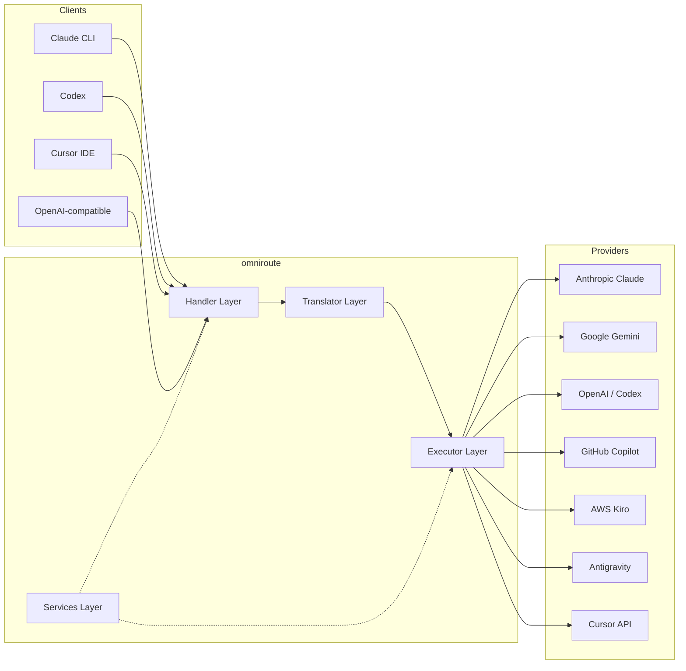
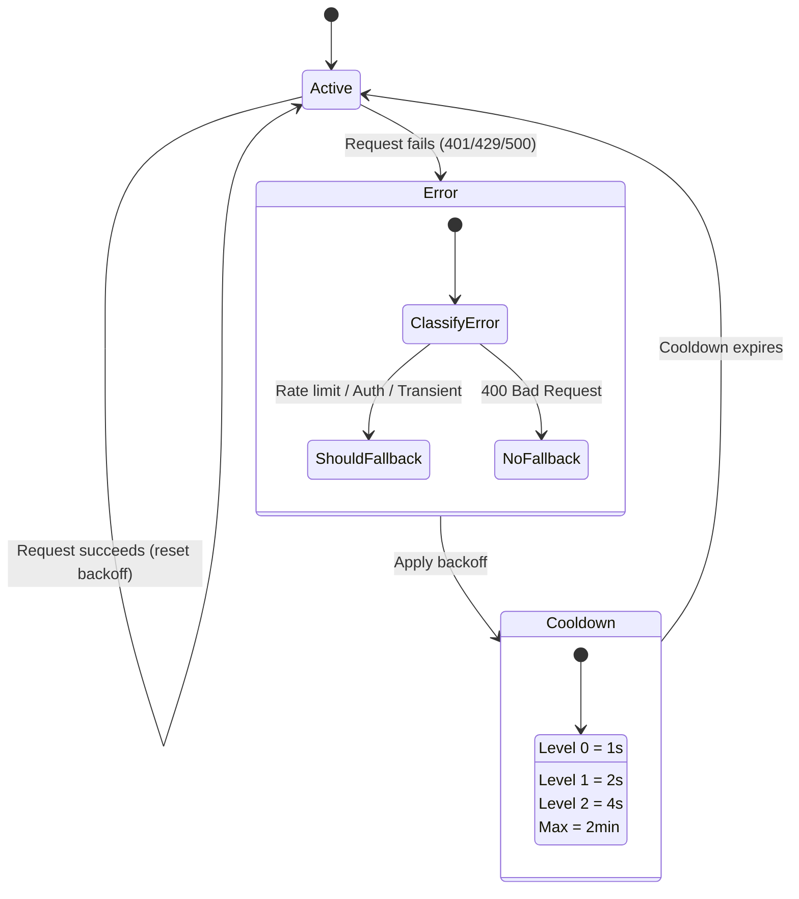
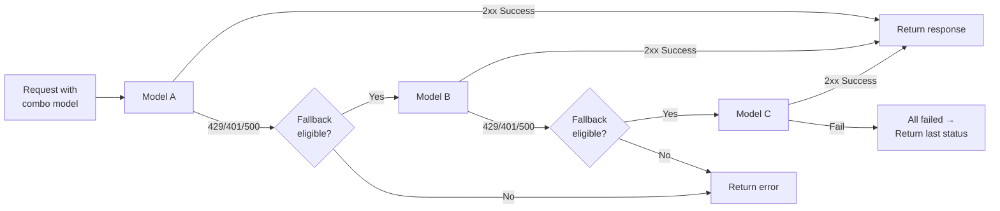
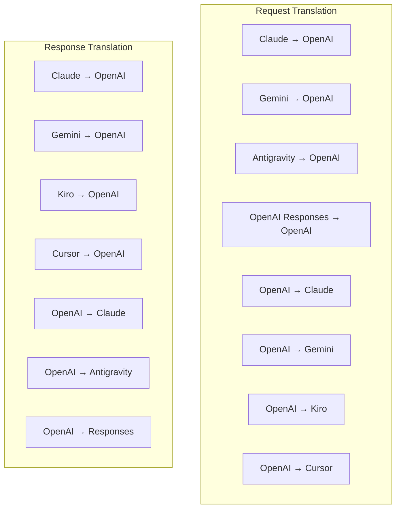
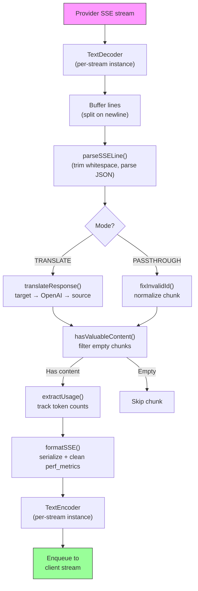
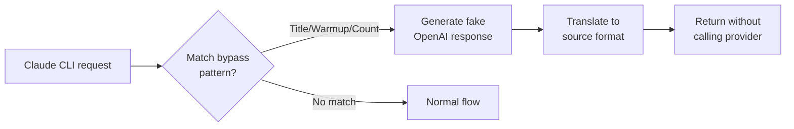

# omniroute — Codebase Documentation (Русский)

🌐 **Languages:** 🇺🇸 [English](../../../../docs/CODEBASE_DOCUMENTATION.md) · 🇪🇸 [es](../../es/docs/CODEBASE_DOCUMENTATION.md) · 🇫🇷 [fr](../../fr/docs/CODEBASE_DOCUMENTATION.md) · 🇩🇪 [de](../../de/docs/CODEBASE_DOCUMENTATION.md) · 🇮🇹 [it](../../it/docs/CODEBASE_DOCUMENTATION.md) · 🇷🇺 [ru](../../ru/docs/CODEBASE_DOCUMENTATION.md) · 🇨🇳 [zh-CN](../../zh-CN/docs/CODEBASE_DOCUMENTATION.md) · 🇯🇵 [ja](../../ja/docs/CODEBASE_DOCUMENTATION.md) · 🇰🇷 [ko](../../ko/docs/CODEBASE_DOCUMENTATION.md) · 🇸🇦 [ar](../../ar/docs/CODEBASE_DOCUMENTATION.md) · 🇮🇳 [hi](../../hi/docs/CODEBASE_DOCUMENTATION.md) · 🇮🇳 [in](../../in/docs/CODEBASE_DOCUMENTATION.md) · 🇹🇭 [th](../../th/docs/CODEBASE_DOCUMENTATION.md) · 🇻🇳 [vi](../../vi/docs/CODEBASE_DOCUMENTATION.md) · 🇮🇩 [id](../../id/docs/CODEBASE_DOCUMENTATION.md) · 🇲🇾 [ms](../../ms/docs/CODEBASE_DOCUMENTATION.md) · 🇳🇱 [nl](../../nl/docs/CODEBASE_DOCUMENTATION.md) · 🇵🇱 [pl](../../pl/docs/CODEBASE_DOCUMENTATION.md) · 🇸🇪 [sv](../../sv/docs/CODEBASE_DOCUMENTATION.md) · 🇳🇴 [no](../../no/docs/CODEBASE_DOCUMENTATION.md) · 🇩🇰 [da](../../da/docs/CODEBASE_DOCUMENTATION.md) · 🇫🇮 [fi](../../fi/docs/CODEBASE_DOCUMENTATION.md) · 🇵🇹 [pt](../../pt/docs/CODEBASE_DOCUMENTATION.md) · 🇷🇴 [ro](../../ro/docs/CODEBASE_DOCUMENTATION.md) · 🇭🇺 [hu](../../hu/docs/CODEBASE_DOCUMENTATION.md) · 🇧🇬 [bg](../../bg/docs/CODEBASE_DOCUMENTATION.md) · 🇸🇰 [sk](../../sk/docs/CODEBASE_DOCUMENTATION.md) · 🇺🇦 [uk-UA](../../uk-UA/docs/CODEBASE_DOCUMENTATION.md) · 🇮🇱 [he](../../he/docs/CODEBASE_DOCUMENTATION.md) · 🇵🇭 [phi](../../phi/docs/CODEBASE_DOCUMENTATION.md) · 🇧🇷 [pt-BR](../../pt-BR/docs/CODEBASE_DOCUMENTATION.md) · 🇨🇿 [cs](../../cs/docs/CODEBASE_DOCUMENTATION.md) · 🇹🇷 [tr](../../tr/docs/CODEBASE_DOCUMENTATION.md)

---

> Подробное руководство для начинающих по**omniroute**прокси-маршрутизатору с искусственным интеллектом, работающим от нескольких поставщиков.---

## 1. What Is omniroute?

omniroute — это**прокси-маршрутизатор**, который находится между клиентами ИИ (Claude CLI, Codex, Cursor IDE и т. д.) и поставщиками ИИ (Anthropic, Google, OpenAI, AWS, GitHub и т. д.). Это решает одну большую проблему:

> **Различные клиенты ИИ говорят на разных «языках» (форматах API), и разные поставщики ИИ тоже ожидают разных «языков».**omniroute автоматически переводит между ними.

Думайте об этом как об универсальном переводчике в Организации Объединенных Наций: любой делегат может говорить на любом языке, а переводчик переводит его для любого другого делегата.---

## 2. Architecture Overview



### Core Principle: Hub-and-Spoke Translation

Вся трансляция формата проходит через**формат OpenAI в качестве концентратора**:```
Client Format → [OpenAI Hub] → Provider Format (request)
Provider Format → [OpenAI Hub] → Client Format (response)

```

Это означает, что вам нужно только**N трансляторов**(по одному на каждый формат) вместо**N²**(каждая пара).---

## 3. Project Structure

```

omniroute/
├── open-sse/ ← Core proxy library (portable, framework-agnostic)
│ ├── index.js ← Main entry point, exports everything
│ ├── config/ ← Configuration & constants
│ ├── executors/ ← Provider-specific request execution
│ ├── handlers/ ← Request handling orchestration
│ ├── services/ ← Business logic (auth, models, fallback, usage)
│ ├── translator/ ← Format translation engine
│ │ ├── request/ ← Request translators (8 files)
│ │ ├── response/ ← Response translators (7 files)
│ │ └── helpers/ ← Shared translation utilities (6 files)
│ └── utils/ ← Utility functions
├── src/ ← Application layer (Express/Worker runtime)
│ ├── app/ ← Web UI, API routes, middleware
│ ├── lib/ ← Database, auth, and shared library code
│ ├── mitm/ ← Man-in-the-middle proxy utilities
│ ├── models/ ← Database models
│ ├── shared/ ← Shared utilities (wrappers around open-sse)
│ ├── sse/ ← SSE endpoint handlers
│ └── store/ ← State management
├── data/ ← Runtime data (credentials, logs)
│ └── provider-credentials.json (external credentials override, gitignored)
└── tester/ ← Test utilities

````

---

## 4. Module-by-Module Breakdown

### 4.1 Config (`open-sse/config/`)

**Единый источник достоверной информации**для всех конфигураций провайдеров.

| Файл | Цель |
| ----------------------------- | -------------------------------------------------------------------------------------------------------------------------------------------------------------------------------------------------------- |
| `constants.ts` | Объект PROVIDERS с базовыми URL-адресами, учетными данными OAuth (по умолчанию), заголовками и системными приглашениями по умолчанию для каждого поставщика. Также определяет HTTP_STATUS, ERROR_TYPES, COOLDOWN_MS, BACKOFF_CONFIG и SKIP_PATTERNS. |
| `credentialLoader.ts` | Загружает внешние учетные данные из data/provider-credentials.json и объединяет их с жестко запрограммированными значениями по умолчанию в PROVIDERS. Сохраняет секреты вне контроля версий, сохраняя при этом обратную совместимость.               |
| `providerModels.ts` | Центральный реестр моделей: псевдонимы поставщиков карт → идентификаторы моделей. Такие функции, как getModels(), getProviderByAlias().                                                                                                          |
| `codexInstructions.ts` | Системные инструкции, внедряемые в запросы Кодекса (ограничения редактирования, правила песочницы, политики утверждения).                                                                                                                 |
| `defaultThinkingSignature.ts` | «Мыслящие» подписи по умолчанию для моделей Claude и Gemini.                                                                                                                                                               |
| `ollamaModels.ts` | Определение схемы для локальных моделей Олламы (имя, размер, семейство, квантование).                                                                                                                                             |#### Credential Loading Flow

```mermaid
flowchart TD
    A["App starts"] --> B["constants.ts defines PROVIDERS\nwith hardcoded defaults"]
    B --> C{"data/provider-credentials.json\nexists?"}
    C -->|Yes| D["credentialLoader reads JSON"]
    C -->|No| E["Use hardcoded defaults"]
    D --> F{"For each provider in JSON"}
    F --> G{"Provider exists\nin PROVIDERS?"}
    G -->|No| H["Log warning, skip"]
    G -->|Yes| I{"Value is object?"}
    I -->|No| J["Log warning, skip"]
    I -->|Yes| K["Merge clientId, clientSecret,\ntokenUrl, authUrl, refreshUrl"]
    K --> F
    H --> F
    J --> F
    F -->|Done| L["PROVIDERS ready with\nmerged credentials"]
    E --> L
````

---

### 4.2 Executors (`open-sse/executors/`)

Исполнители инкапсулируют**логику, специфичную для поставщика**, используя**Шаблон стратегии**. Каждый исполнитель переопределяет базовые методы по мере необходимости.```mermaid
classDiagram
class BaseExecutor {
+buildUrl(model, stream, options)
+buildHeaders(credentials, stream, body)
+transformRequest(body, model, stream, credentials)
+execute(url, options)
+shouldRetry(status, error)
+refreshCredentials(credentials, log)
}

    class DefaultExecutor {
        +refreshCredentials()
    }

    class AntigravityExecutor {
        +buildUrl()
        +buildHeaders()
        +transformRequest()
        +shouldRetry()
        +refreshCredentials()
    }

    class CursorExecutor {
        +buildUrl()
        +buildHeaders()
        +transformRequest()
        +parseResponse()
        +generateChecksum()
    }

    class KiroExecutor {
        +buildUrl()
        +buildHeaders()
        +transformRequest()
        +parseEventStream()
        +refreshCredentials()
    }

    BaseExecutor <|-- DefaultExecutor
    BaseExecutor <|-- AntigravityExecutor
    BaseExecutor <|-- CursorExecutor
    BaseExecutor <|-- KiroExecutor
    BaseExecutor <|-- CodexExecutor
    BaseExecutor <|-- GeminiCLIExecutor
    BaseExecutor <|-- GithubExecutor

````

| Исполнитель | Провайдер | Ключевые специализации |
| ---------------- | ----------------------------------------- | ------------------------------------------------------------------------------------------------------------------ |
| `base.ts` | — | Абстрактная база: построение URL-адресов, заголовки, логика повторов, обновление учетных данных |
| `default.ts` | Клод, Близнецы, OpenAI, GLM, Кими, МиниМакс | Обновление общего токена OAuth для стандартных поставщиков |
| `антигравитация.ц` | Облачный код Google | Генерация идентификатора проекта/сеанса, резервное копирование нескольких URL-адресов, настраиваемый повторный анализ сообщений об ошибках («сброс через 2 часа 7 минут 23 секунды») |
| `курсор.ц` | Курсор IDE |**Самое сложное**: проверка подлинности по контрольной сумме SHA-256, кодирование запроса Protobuf, двоичный поток событий → анализ ответа SSE |
| `codex.ts` | Кодекс OpenAI | Вводит системные инструкции, управляет уровнями мышления, удаляет неподдерживаемые параметры |
| `gemini-cli.ts` | Интерфейс командной строки Google Gemini | Создание собственного URL-адреса (streamGenerateContent), обновление токена Google OAuth |
| `github.ts` | Второй пилот GitHub | Система двух токенов (GitHub OAuth + токен Copilot), имитация заголовка VSCode |
| `киро.ц` | AWS CodeWhisperer | Бинарный анализ AWS EventStream, кадры событий AMZN, оценка токенов |
| `index.ts` | — | Фабрика: имя поставщика карт → класс исполнителя, с резервным вариантом по умолчанию |---

### 4.3 Handlers (`open-sse/handlers/`)

**Уровень оркестрации**— координирует трансляцию, выполнение, потоковую передачу и обработку ошибок.

| Файл | Цель |
| --------------------- | --------------------------------------------------------------------------------------------------------------------------------------------------------------------------------------------------------------------- |
| `chatCore.ts` |**Центральный оркестратор**(~600 строк). Обрабатывает полный жизненный цикл запроса: обнаружение формата → трансляция → отправка исполнителя → потоковый/непоточный ответ → обновление токена → обработка ошибок → журналирование использования. |
| `responsesHandler.ts` | Адаптер для API ответов OpenAI: преобразует формат ответов → Завершения чата → отправляет в `chatCore` → преобразует SSE обратно в формат ответов.                                                                        |
| `embeddings.ts` | Обработчик генерации внедрения: разрешает модель внедрения → поставщик, отправляет в API поставщика, возвращает ответ на внедрение, совместимый с OpenAI. Поддерживает 6+ провайдеров.                                                    |
| `imageGeneration.ts` | Обработчик генерации изображений: определяет модель изображения → поставщик, поддерживает режимы OpenAI-совместимый, Gemini-image (Антигравитация) и резервный режим (Nebius). Возвращает изображения в формате Base64 или URL.                                          |#### Request Lifecycle (chatCore.ts)

```mermaid
sequenceDiagram
    participant Client
    participant chatCore
    participant Translator
    participant Executor
    participant Provider

    Client->>chatCore: Request (any format)
    chatCore->>chatCore: Detect source format
    chatCore->>chatCore: Check bypass patterns
    chatCore->>chatCore: Resolve model & provider
    chatCore->>Translator: Translate request (source → OpenAI → target)
    chatCore->>Executor: Get executor for provider
    Executor->>Executor: Build URL, headers, transform request
    Executor->>Executor: Refresh credentials if needed
    Executor->>Provider: HTTP fetch (streaming or non-streaming)

    alt Streaming
        Provider-->>chatCore: SSE stream
        chatCore->>chatCore: Pipe through SSE transform stream
        Note over chatCore: Transform stream translates<br/>each chunk: target → OpenAI → source
        chatCore-->>Client: Translated SSE stream
    else Non-streaming
        Provider-->>chatCore: JSON response
        chatCore->>Translator: Translate response
        chatCore-->>Client: Translated JSON
    end

    alt Error (401, 429, 500...)
        chatCore->>Executor: Retry with credential refresh
        chatCore->>chatCore: Account fallback logic
    end
````

---

### 4.4 Services (`open-sse/services/`)

| Бизнес-логика, поддерживающая обработчики и исполнители. | File                                                                                                                                                                                                                                                                                                                                   | Purpose |
| -------------------------------------------------------- | -------------------------------------------------------------------------------------------------------------------------------------------------------------------------------------------------------------------------------------------------------------------------------------------------------------------------------------- | ------- |
| `provider.ts`                                            | **Format detection** (`detectFormat`): analyzes request body structure to identify Claude/OpenAI/Gemini/Antigravity/Responses formats (includes `max_tokens` heuristic for Claude). Also: URL building, header building, thinking config normalization. Supports `openai-compatible-*` and `anthropic-compatible-*` dynamic providers. |
| `model.ts`                                               | Model string parsing (`claude/model-name` → `{provider: "claude", model: "model-name"}`), alias resolution with collision detection, input sanitization (rejects path traversal/control chars), and model info resolution with async alias getter support.                                                                             |
| `accountFallback.ts`                                     | Rate-limit handling: exponential backoff (1s → 2s → 4s → max 2min), account cooldown management, error classification (which errors trigger fallback vs. not).                                                                                                                                                                         |
| `tokenRefresh.ts`                                        | OAuth token refresh for **every provider**: Google (Gemini, Antigravity), Claude, Codex, Qwen, Qoder, GitHub (OAuth + Copilot dual-token), Kiro (AWS SSO OIDC + Social Auth). Includes in-flight promise deduplication cache and retry with exponential backoff.                                                                       |
| `combo.ts`                                               | **Combo models**: chains of fallback models. If model A fails with a fallback-eligible error, try model B, then C, etc. Returns actual upstream status codes.                                                                                                                                                                          |
| `usage.ts`                                               | Fetches quota/usage data from provider APIs (GitHub Copilot quotas, Antigravity model quotas, Codex rate limits, Kiro usage breakdowns, Claude settings).                                                                                                                                                                              |
| `accountSelector.ts`                                     | Smart account selection with scoring algorithm: considers priority, health status, round-robin position, and cooldown state to pick the optimal account for each request.                                                                                                                                                              |
| `contextManager.ts`                                      | Request context lifecycle management: creates and tracks per-request context objects with metadata (request ID, timestamps, provider info) for debugging and logging.                                                                                                                                                                  |
| `ipFilter.ts`                                            | IP-based access control: supports allowlist and blocklist modes. Validates client IP against configured rules before processing API requests.                                                                                                                                                                                          |
| `sessionManager.ts`                                      | Session tracking with client fingerprinting: tracks active sessions using hashed client identifiers, monitors request counts, and provides session metrics.                                                                                                                                                                            |
| `signatureCache.ts`                                      | Request signature-based deduplication cache: prevents duplicate requests by caching recent request signatures and returning cached responses for identical requests within a time window.                                                                                                                                              |
| `systemPrompt.ts`                                        | Global system prompt injection: prepends or appends a configurable system prompt to all requests, with per-provider compatibility handling.                                                                                                                                                                                            |
| `thinkingBudget.ts`                                      | Reasoning token budget management: supports passthrough, auto (strip thinking config), custom (fixed budget), and adaptive (complexity-scaled) modes for controlling thinking/reasoning tokens.                                                                                                                                        |
| `wildcardRouter.ts`                                      | Wildcard model pattern routing: resolves wildcard patterns (e.g., `*/claude-*`) to concrete provider/model pairs based on availability and priority.                                                                                                                                                                                   |

#### Token Refresh Deduplication

```mermaid
sequenceDiagram
    participant R1 as Request 1
    participant R2 as Request 2
    participant Cache as refreshPromiseCache
    participant OAuth as OAuth Provider

    R1->>Cache: getAccessToken("gemini", token)
    Cache->>Cache: No in-flight promise
    Cache->>OAuth: Start refresh
    R2->>Cache: getAccessToken("gemini", token)
    Cache->>Cache: Found in-flight promise
    Cache-->>R2: Return existing promise
    OAuth-->>Cache: New access token
    Cache-->>R1: New access token
    Cache-->>R2: Same access token (shared)
    Cache->>Cache: Delete cache entry
```

#### Account Fallback State Machine



#### Combo Model Chain



---

### 4.5 Translator (`open-sse/translator/`)

**Механизм перевода форматов**, использующий систему саморегистрирующихся плагинов.#### Архитектура



| Каталог      | Файлы          | Описание                                                                                                                                                                                                                                                                                               |
| ------------ | -------------- | ------------------------------------------------------------------------------------------------------------------------------------------------------------------------------------------------------------------------------------------------------------------------------------------------------ | ----------------------------------------- |
| `запрос/`    | 8 переводчиков | Преобразование тел запросов между форматами. Каждый файл самостоятельно регистрируется через `register(from, to, fn)` при импорте.                                                                                                                                                                     |
| `ответ/`     | 7 переводчиков | Преобразование фрагментов потокового ответа между форматами. Обрабатывает типы событий SSE, блоки мышления, вызовы инструментов.                                                                                                                                                                       |
| `помощники/` | 6 помощников   | Общие утилиты: `claudeHelper` (извлечение системных подсказок, конфигурация мышления), `geminiHelper` (сопоставление частей/содержимого), `openaiHelper` (фильтрация формата), `toolCallHelper` (генерация идентификаторов, внедрение отсутствующих ответов), `maxTokensHelper`, `responsesApiHelper`. |
| `index.ts`   | —              | Механизм перевода: `translateRequest()`, `translateResponse()`, управление состоянием, реестр.                                                                                                                                                                                                         |
| `formats.ts` | —              | Константы формата: `OPENAI`, `CLAUDE`, `GEMINI`, `ANTIGRAVITY`, `KIRO`, `CURSOR`, `OPENAI_RESPONSES`.                                                                                                                                                                                                  | #### Key Design: Self-Registering Plugins |

```javascript
// Each translator file calls register() on import:
import { register } from "../index.js";
register("claude", "openai", translateClaudeToOpenAI);

// The index.js imports all translator files, triggering registration:
import "./request/claude-to-openai.js"; // ← self-registers
```

---

### 4.6 Utils (`open-sse/utils/`)

| Файл               | Цель                                                                                                                                                                                                                                                                                                                                       |
| ------------------ | ------------------------------------------------------------------------------------------------------------------------------------------------------------------------------------------------------------------------------------------------------------------------------------------------------------------------------------------ | --------------------------- |
| `error.ts`         | Построение ответов об ошибках (формат, совместимый с OpenAI), анализ ошибок восходящего потока, извлечение времени повтора Антигравитации из сообщений об ошибках, потоковая передача ошибок SSE.                                                                                                                                          |
| `stream.ts`        | **SSE Transform Stream**— основной конвейер потоковой передачи. Два режима: `TRANSLATE` (полноформатный перевод) и `PASSTHROUGH` (нормализация + использование извлечения). Управляет буферизацией фрагментов, оценкой использования, отслеживанием длины контента. Экземпляры попоточного кодировщика/декодера избегают общего состояния. |
| `streamHelpers.ts` | Утилиты SSE низкого уровня: parseSSELine (устойчив к пробелам), hasValuableContent (фильтрует пустые фрагменты для OpenAI/Claude/Gemini), fixInvalidId, formatSSE (сериализация SSE с учетом формата с очисткой perf_metrics).                                                                                                             |
| `usageTracking.ts` | Извлечение использования токенов из любого формата (Claude/OpenAI/Gemini/Responses), оценка с помощью отдельных соотношений инструмента/сообщения на токен, добавление буфера (запас безопасности 2000 токенов), фильтрация полей для конкретного формата, ведение журнала консоли с цветами ANSI.                                         |
| `requestLogger.ts` | Legacy file-based request logging helper kept for compatibility. Current deployments should prefer `APP_LOG_TO_FILE` for application logs and the call log pipeline for persisted request artifacts.                                                                                                                                       |
| `bypassHandler.ts` | Перехватывает определенные шаблоны из Claude CLI (извлечение заголовков, прогрев, подсчет) и возвращает поддельные ответы без вызова какого-либо провайдера. Поддерживает как потоковую, так и непотоковую передачу. Намеренно ограничено областью CLI Claude.                                                                             |
| `networkProxy.ts`  | Разрешает URL-адрес исходящего прокси-сервера для данного провайдера с приоритетом: конфигурация конкретного провайдера → глобальная конфигурация → переменные среды (`HTTPS_PROXY`/`HTTP_PROXY`/`ALL_PROXY`). Supports `NO_PROXY` exclusions. Кэширует конфиг на 30 секунд.                                                               | #### SSE Streaming Pipeline |



#### Request Logger Session Structure

```
logs/
└── claude_gemini_claude-sonnet_20260208_143045/
    ├── 1_req_client.json      ← Raw client request
    ├── 2_req_source.json      ← After initial conversion
    ├── 3_req_openai.json      ← OpenAI intermediate format
    ├── 4_req_target.json      ← Final target format
    ├── 5_res_provider.txt     ← Provider SSE chunks (streaming)
    ├── 5_res_provider.json    ← Provider response (non-streaming)
    ├── 6_res_openai.txt       ← OpenAI intermediate chunks
    ├── 7_res_client.txt       ← Client-facing SSE chunks
    └── 6_error.json           ← Error details (if any)
```

---

### 4.7 Application Layer (`src/`)

| Каталог                | Цель                                                                                       |
| ---------------------- | ------------------------------------------------------------------------------------------ | ----------------------- |
| `источник/приложение/` | Веб-интерфейс, маршруты API, промежуточное ПО Express, обработчики обратного вызова OAuth  |
| `src/lib/`             | Доступ к базе данных (localDb.ts, usageDb.ts), аутентификация, общий доступ                |
| `src/mitm/`            | Прокси-утилиты «Человек посередине» для перехвата трафика провайдера                       |
| `src/модели/`          | Определения модели базы данных                                                             |
| `src/shared/`          | Обертки вокруг функций open-sse (поставщик, поток, ошибка и т. д.)                         |
| `src/sse/`             | Обработчики конечных точек SSE, которые подключают библиотеку open-sse к маршрутам Express |
| `источник/магазин/`    | Управление состоянием приложения                                                           | #### Notable API Routes |

| Маршрут                                        | Методы                     | Цель                                                                                                        |
| ---------------------------------------------- | -------------------------- | ----------------------------------------------------------------------------------------------------------- | --- |
| `/api/provider-models`                         | ПОЛУЧИТЬ/ОТПРАВИТЬ/УДАЛИТЬ | CRUD для пользовательских моделей для каждого поставщика                                                    |
| `/api/models/catalog`                          | ПОЛУЧИТЬ                   | Агрегированный каталог всех моделей (чат, встраивание, изображение, кастом), сгруппированный по поставщикам |
| `/api/settings/proxy`                          | ПОЛУЧИТЬ/ПОСТАВИТЬ/УДАЛИТЬ | Иерархическая конфигурация исходящего прокси (`global/providers/combos/keys`)                               |
| `/api/settings/proxy/test`                     | ПОСТ                       | Проверяет подключение прокси-сервера и возвращает общедоступный IP-адрес и задержку                         |
| `/v1/providers/[провайдер]/чат/завершения`     | ПОСТ                       | Специальное завершение чата для каждого поставщика с проверкой модели                                       |
| `/v1/providers/[провайдер]/embeddings`         | ПОСТ                       | Выделенные внедрения для каждого поставщика с проверкой модели                                              |
| `/v1/providers/[провайдер]/images/generations` | ПОСТ                       | Специальное создание изображений для каждого поставщика с проверкой модели                                  |
| `/api/settings/ip-filter`                      | ПОЛУЧИТЬ/ПОСТАВИТЬ         | Управление списком разрешенных/черных IP-адресов                                                            |
| `/api/settings/thinking-budget`                | ПОЛУЧИТЬ/ПОСТАВИТЬ         | Конфигурация бюджета токена обоснования (сквозной/автоматический/пользовательский/адаптивный)               |
| `/api/settings/system-prompt`                  | ПОЛУЧИТЬ/ПОСТАВИТЬ         | Глобальная система быстрого внедрения для всех запросов                                                     |
| `/api/сессии`                                  | ПОЛУЧИТЬ                   | Отслеживание активных сессий и метрики                                                                      |
| `/api/rate-limits`                             | ПОЛУЧИТЬ                   | Статус ограничения ставки для каждого аккаунта                                                              | --- |

## 5. Key Design Patterns

### 5.1 Hub-and-Spoke Translation

Все форматы преобразуются через**формат OpenAI в качестве концентратора**. Для добавления нового провайдера требуется написать только**одну пару**трансляторов (в/из OpenAI), а не N пар.### 5.2 Executor Strategy Pattern

У каждого провайдера есть выделенный класс исполнителя, унаследованный от BaseExecutor. Фабрика в `executors/index.ts` выбирает правильный вариант во время выполнения.### 5.3 Self-Registering Plugin System

Модули переводчика регистрируются при импорте через `register()`. Добавление нового переводчика — это просто создание файла и его импорт.### 5.4 Account Fallback with Exponential Backoff

Когда провайдер возвращает 429/401/500, система может переключиться на следующую учетную запись, применяя экспоненциальное время восстановления (1 с → 2 с → 4 с → максимум 2 минуты).### 5.5 Combo Model Chains

«Комбинация» группирует несколько строк «поставщик/модель». Если первое не удалось, автоматически переходите к следующему.### 5.6 Stateful Streaming Translation

Трансляция ответа поддерживает состояние блоков SSE (отслеживание мыслительных блоков, накопление вызовов инструментов, индексирование блоков контента) с помощью механизма initState().### 5.7 Usage Safety Buffer

К сообщаемому об использовании добавляется буфер на 2000 токенов, чтобы клиенты не превышали ограничения контекстного окна из-за накладных расходов на системные подсказки и преобразование формата.---

## 6. Supported Formats

| Формат                                   | Направление     | Идентификатор    |
| ---------------------------------------- | --------------- | ---------------- | --- |
| Завершения чата OpenAI                   | источник + цель | `опенай`         |
| API ответов OpenAI                       | источник + цель | `openai-ответы`  |
| Антропный Клод                           | источник + цель | `Клод`           |
| Google Близнецы                          | источник + цель | `близнецы`       |
| Интерфейс командной строки Google Gemini | только цель     | `gemini-cli`     |
| Антигравитация                           | источник + цель | `антигравитация` |
| AWS Киро                                 | только цель     | `киро`           |
| Курсор                                   | только цель     | `курсор`         | --- |

## 7. Supported Providers

| Провайдер                                | Метод аутентификации       | Исполнитель    | Ключевые примечания                                                      |
| ---------------------------------------- | -------------------------- | -------------- | ------------------------------------------------------------------------ | --- |
| Антропный Клод                           | Ключ API или OAuth         | По умолчанию   | Использует заголовок `x-api-key`                                         |
| Google Близнецы                          | Ключ API или OAuth         | По умолчанию   | Использует заголовок x-goog-api-key                                      |
| Интерфейс командной строки Google Gemini | ОАутент                    | БлизнецыCLI    | Использует конечную точку `streamGenerateContent`                        |
| Антигравитация                           | ОАутент                    | Антигравитация | Резервный вариант нескольких URL-адресов, индивидуальный анализ повторов |
| ОпенАИ                                   | API-ключ                   | По умолчанию   | Проверка подлинности стандартного носителя                               |
| Кодекс                                   | ОАутент                    | Кодекс         | Вводит системные инструкции, управляет мышлением                         |
| Второй пилот GitHub                      | OAuth + токен Copilot      | Гитхаб         | Dual token, VSCode header mimicking                                      |
| Киро (AWS)                               | AWS SSO OIDC или Social    | Киро           | Анализ двоичного потока событий                                          |
| Курсор IDE                               | Проверка контрольной суммы | Курсор         | Кодирование Protobuf, контрольные суммы SHA-256                          |
| Квен                                     | ОАутент                    | По умолчанию   | Стандартная аутентификация                                               |
| Кодер                                    | OAuth (базовый + носитель) | По умолчанию   | Заголовок двойной аутентификации                                         |
| OpenRouter                               | API-ключ                   | По умолчанию   | Проверка подлинности стандартного носителя                               |
| ГЛМ, Кими, МиниМакс                      | API-ключ                   | По умолчанию   | Совместимость с Claude, используйте `x-api-key`                          |
| `openai-совместимый-*`                   | API-ключ                   | По умолчанию   | Динамический: любая конечная точка, совместимая с OpenAI                 |
| `антропно-совместимый-*`                 | API-ключ                   | По умолчанию   | Динамический: любая конечная точка, совместимая с Claude                 | --- |

## 8. Data Flow Summary

### Streaming Request

```mermaid
flowchart LR
    A["Client"] --> B["detectFormat()"]
    B --> C["translateRequest()\nsource → OpenAI → target"]
    C --> D["Executor\nbuildUrl + buildHeaders"]
    D --> E["fetch(providerURL)"]
    E --> F["createSSEStream()\nTRANSLATE mode"]
    F --> G["parseSSELine()"]
    G --> H["translateResponse()\ntarget → OpenAI → source"]
    H --> I["extractUsage()\n+ addBuffer"]
    I --> J["formatSSE()"]
    J --> K["Client receives\ntranslated SSE"]
    K --> L["logUsage()\nsaveRequestUsage()"]
```



### Non-Streaming Request


### Bypass Flow (Claude CLI)


