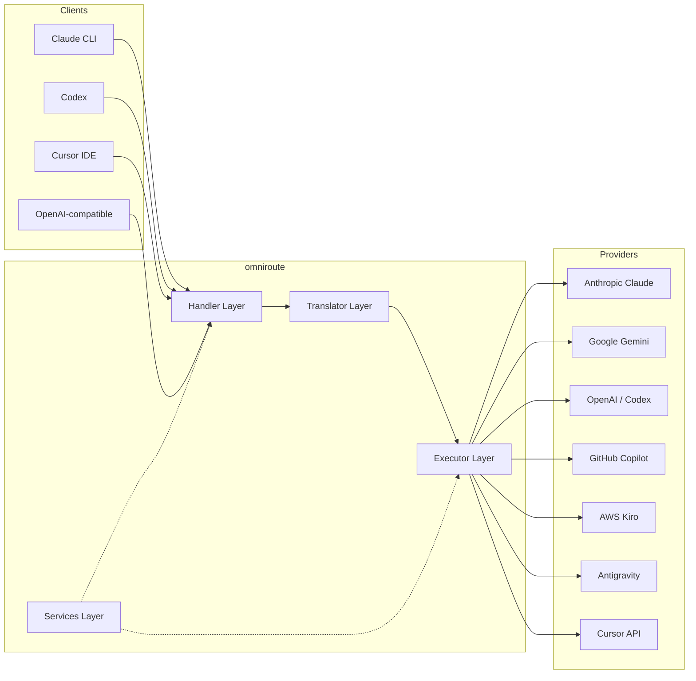
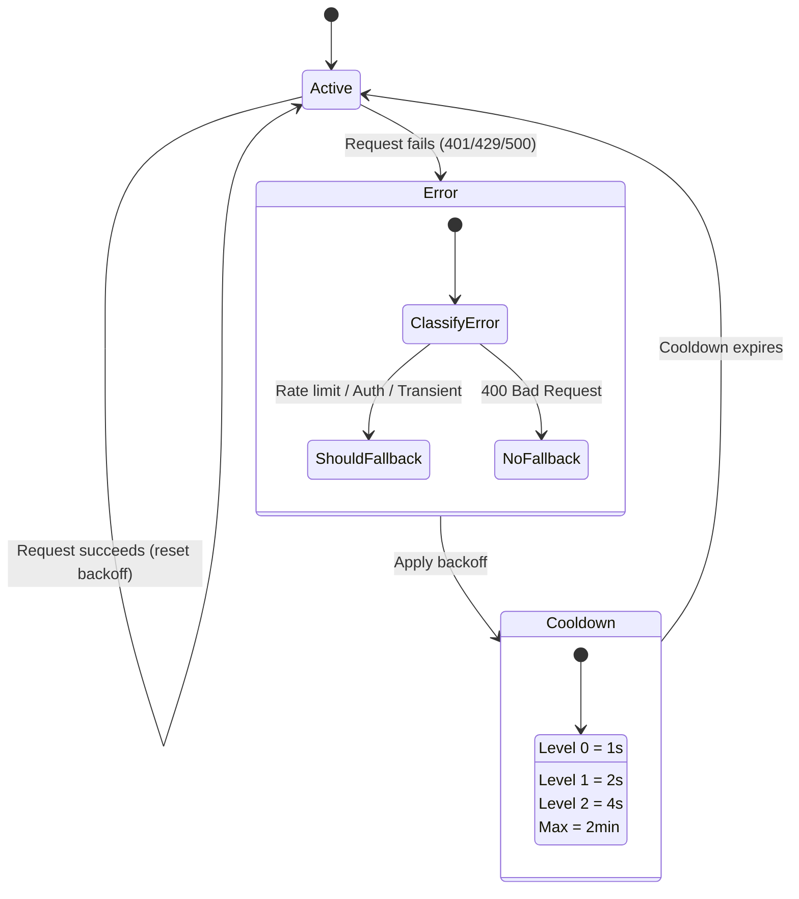
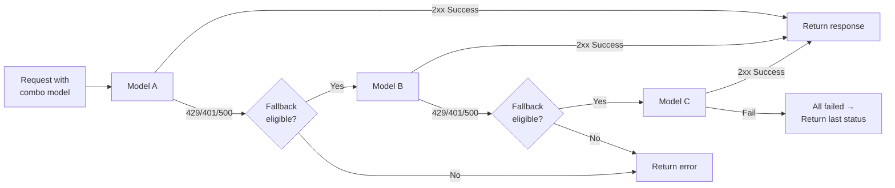
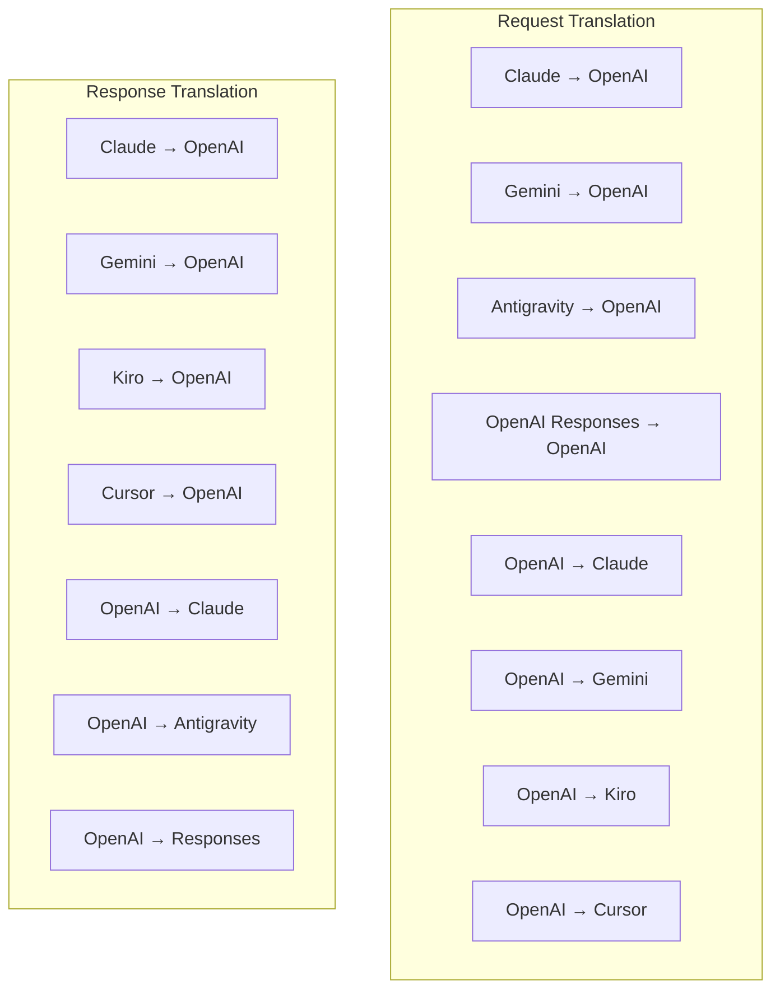
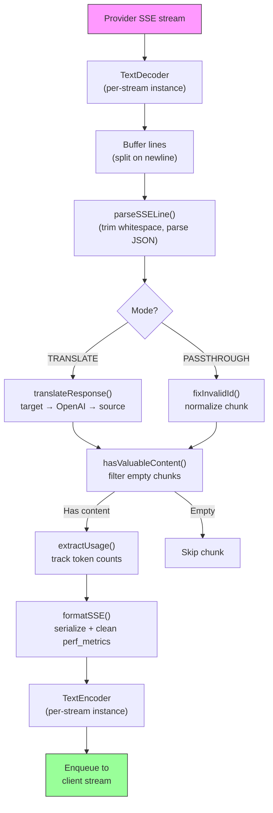
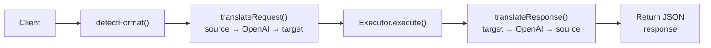
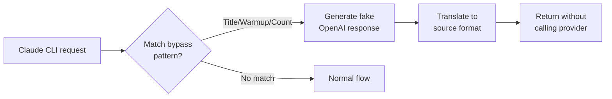

# omniroute — Codebase Documentation (Slovenčina)

🌐 **Languages:** 🇺🇸 [English](../../../../docs/CODEBASE_DOCUMENTATION.md) · 🇪🇸 [es](../../es/docs/CODEBASE_DOCUMENTATION.md) · 🇫🇷 [fr](../../fr/docs/CODEBASE_DOCUMENTATION.md) · 🇩🇪 [de](../../de/docs/CODEBASE_DOCUMENTATION.md) · 🇮🇹 [it](../../it/docs/CODEBASE_DOCUMENTATION.md) · 🇷🇺 [ru](../../ru/docs/CODEBASE_DOCUMENTATION.md) · 🇨🇳 [zh-CN](../../zh-CN/docs/CODEBASE_DOCUMENTATION.md) · 🇯🇵 [ja](../../ja/docs/CODEBASE_DOCUMENTATION.md) · 🇰🇷 [ko](../../ko/docs/CODEBASE_DOCUMENTATION.md) · 🇸🇦 [ar](../../ar/docs/CODEBASE_DOCUMENTATION.md) · 🇮🇳 [hi](../../hi/docs/CODEBASE_DOCUMENTATION.md) · 🇮🇳 [in](../../in/docs/CODEBASE_DOCUMENTATION.md) · 🇹🇭 [th](../../th/docs/CODEBASE_DOCUMENTATION.md) · 🇻🇳 [vi](../../vi/docs/CODEBASE_DOCUMENTATION.md) · 🇮🇩 [id](../../id/docs/CODEBASE_DOCUMENTATION.md) · 🇲🇾 [ms](../../ms/docs/CODEBASE_DOCUMENTATION.md) · 🇳🇱 [nl](../../nl/docs/CODEBASE_DOCUMENTATION.md) · 🇵🇱 [pl](../../pl/docs/CODEBASE_DOCUMENTATION.md) · 🇸🇪 [sv](../../sv/docs/CODEBASE_DOCUMENTATION.md) · 🇳🇴 [no](../../no/docs/CODEBASE_DOCUMENTATION.md) · 🇩🇰 [da](../../da/docs/CODEBASE_DOCUMENTATION.md) · 🇫🇮 [fi](../../fi/docs/CODEBASE_DOCUMENTATION.md) · 🇵🇹 [pt](../../pt/docs/CODEBASE_DOCUMENTATION.md) · 🇷🇴 [ro](../../ro/docs/CODEBASE_DOCUMENTATION.md) · 🇭🇺 [hu](../../hu/docs/CODEBASE_DOCUMENTATION.md) · 🇧🇬 [bg](../../bg/docs/CODEBASE_DOCUMENTATION.md) · 🇸🇰 [sk](../../sk/docs/CODEBASE_DOCUMENTATION.md) · 🇺🇦 [uk-UA](../../uk-UA/docs/CODEBASE_DOCUMENTATION.md) · 🇮🇱 [he](../../he/docs/CODEBASE_DOCUMENTATION.md) · 🇵🇭 [phi](../../phi/docs/CODEBASE_DOCUMENTATION.md) · 🇧🇷 [pt-BR](../../pt-BR/docs/CODEBASE_DOCUMENTATION.md) · 🇨🇿 [cs](../../cs/docs/CODEBASE_DOCUMENTATION.md) · 🇹🇷 [tr](../../tr/docs/CODEBASE_DOCUMENTATION.md)

---

> Komplexný sprievodca**omniroute**multi-poskytovateľa AI proxy routera pre začiatočníkov.---

## 1. What Is omniroute?

omniroute je**proxy router**, ktorý sedí medzi klientmi AI (Claude CLI, Codex, Cursor IDE atď.) a poskytovateľmi AI (Anthropic, Google, OpenAI, AWS, GitHub atď.). Rieši jeden veľký problém:

> **Rôzni klienti AI hovoria rôznymi „jazykmi“ (formáty API) a rôzni poskytovatelia AI tiež očakávajú rôzne „jazyky“.**omniroute medzi nimi automaticky prekladá.

Predstavte si to ako univerzálny prekladateľ v Organizácii Spojených národov – každý delegát môže hovoriť akýmkoľvek jazykom a prekladateľ ho prevedie na akéhokoľvek iného delegáta.---

## 2. Architecture Overview



### Core Principle: Hub-and-Spoke Translation

Celý preklad formátu prechádza cez**formát OpenAI ako centrum**:```
Client Format → [OpenAI Hub] → Provider Format (request)
Provider Format → [OpenAI Hub] → Client Format (response)

```

To znamená, že potrebujete iba**N prekladateľov**(jeden na formát) namiesto**N²**(každý pár).---

## 3. Project Structure

```

omniroute/
├── open-sse/ ← Core proxy library (portable, framework-agnostic)
│ ├── index.js ← Main entry point, exports everything
│ ├── config/ ← Configuration & constants
│ ├── executors/ ← Provider-specific request execution
│ ├── handlers/ ← Request handling orchestration
│ ├── services/ ← Business logic (auth, models, fallback, usage)
│ ├── translator/ ← Format translation engine
│ │ ├── request/ ← Request translators (8 files)
│ │ ├── response/ ← Response translators (7 files)
│ │ └── helpers/ ← Shared translation utilities (6 files)
│ └── utils/ ← Utility functions
├── src/ ← Application layer (Express/Worker runtime)
│ ├── app/ ← Web UI, API routes, middleware
│ ├── lib/ ← Database, auth, and shared library code
│ ├── mitm/ ← Man-in-the-middle proxy utilities
│ ├── models/ ← Database models
│ ├── shared/ ← Shared utilities (wrappers around open-sse)
│ ├── sse/ ← SSE endpoint handlers
│ └── store/ ← State management
├── data/ ← Runtime data (credentials, logs)
│ └── provider-credentials.json (external credentials override, gitignored)
└── tester/ ← Test utilities

````

---

## 4. Module-by-Module Breakdown

### 4.1 Config (`open-sse/config/`)

**Jediný zdroj pravdy**pre všetky konfigurácie poskytovateľov.

| Súbor | Účel |
| ------------------------------ | ------------------------------------------------------------------------------------------------------- ------------------------------------------------------------------------------------------------------ |
| `constants.ts` | Objekt „PROVIDERS“ so základnými adresami URL, povereniami OAuth (predvolené), hlavičkami a predvolenými systémovými výzvami pre každého poskytovateľa. Definuje tiež `HTTP_STATUS`, `ERROR_TYPES`, `COOLDOWN_MS`, `BACKOFF_CONFIG` a `SKIP_PATTERNS`. |
| `credentialLoader.ts` | Načíta externé poverenia zo súboru `data/provider-credentials.json` a zlúči ich s pevne zakódovanými predvolenými nastaveniami v `PROVIDERS`. Udržuje tajomstvá mimo kontroly zdroja pri zachovaní spätnej kompatibility.               |
| `providerModels.ts` | Centrálny register modelov: mapuje aliasy poskytovateľa → ID modelov. Funkcie ako `getModels()`, `getProviderByAlias()`.                                                                                                          |
| `codexInstructions.ts` | Systémové pokyny vložené do požiadaviek kódexu (obmedzenia úprav, pravidlá karantény, zásady schvaľovania).                                                                                                                 |
| `defaultThinkingSignature.ts` | Predvolené „mysliace“ podpisy pre modely Claude a Gemini.                                                                                                                                                               |
| `ollamaModels.ts` | Definícia schémy pre lokálne modely Ollama (názov, veľkosť, rodina, kvantizácia).                                                                                                                                             |#### Credential Loading Flow

```mermaid
flowchart TD
    A["App starts"] --> B["constants.ts defines PROVIDERS\nwith hardcoded defaults"]
    B --> C{"data/provider-credentials.json\nexists?"}
    C -->|Yes| D["credentialLoader reads JSON"]
    C -->|No| E["Use hardcoded defaults"]
    D --> F{"For each provider in JSON"}
    F --> G{"Provider exists\nin PROVIDERS?"}
    G -->|No| H["Log warning, skip"]
    G -->|Yes| I{"Value is object?"}
    I -->|No| J["Log warning, skip"]
    I -->|Yes| K["Merge clientId, clientSecret,\ntokenUrl, authUrl, refreshUrl"]
    K --> F
    H --> F
    J --> F
    F -->|Done| L["PROVIDERS ready with\nmerged credentials"]
    E --> L
````

---

### 4.2 Executors (`open-sse/executors/`)

Vykonávatelia zapuzdrujú**logiku špecifickú pre poskytovateľa**pomocou**Strategy Pattern**. Každý exekútor podľa potreby prepíše základné metódy.```mermaid
classDiagram
class BaseExecutor {
+buildUrl(model, stream, options)
+buildHeaders(credentials, stream, body)
+transformRequest(body, model, stream, credentials)
+execute(url, options)
+shouldRetry(status, error)
+refreshCredentials(credentials, log)
}

    class DefaultExecutor {
        +refreshCredentials()
    }

    class AntigravityExecutor {
        +buildUrl()
        +buildHeaders()
        +transformRequest()
        +shouldRetry()
        +refreshCredentials()
    }

    class CursorExecutor {
        +buildUrl()
        +buildHeaders()
        +transformRequest()
        +parseResponse()
        +generateChecksum()
    }

    class KiroExecutor {
        +buildUrl()
        +buildHeaders()
        +transformRequest()
        +parseEventStream()
        +refreshCredentials()
    }

    BaseExecutor <|-- DefaultExecutor
    BaseExecutor <|-- AntigravityExecutor
    BaseExecutor <|-- CursorExecutor
    BaseExecutor <|-- KiroExecutor
    BaseExecutor <|-- CodexExecutor
    BaseExecutor <|-- GeminiCLIExecutor
    BaseExecutor <|-- GithubExecutor

````

| Exekútor | Poskytovateľ | Kľúčové špecializácie |
| ----------------- | ------------------------------------------- | ------------------------------------------------------------------------------------------------------ |
| `base.ts` | — | Abstraktný základ: vytváranie URL, hlavičky, logika opakovania, obnovenie poverení |
| `default.ts` | Claude, Gemini, OpenAI, GLM, Kimi, MiniMax | Obnovenie všeobecného tokenu OAuth pre štandardných poskytovateľov |
| `antigravity.ts` | Google Cloud Code | Generovanie ID projektu/relácie, záložné riešenie s viacerými adresami URL, vlastná opätovná analýza chybových hlásení ("resetovať po 2h7m23s") |
| `kurzor.ts` | Kurzor IDE |**Najkomplexnejšie**: overenie kontrolného súčtu SHA-256, kódovanie požiadavky Protobuf, binárny prúd udalostí → analýza odpovede SSE |
| `codex.ts` | Kódex OpenAI | Vkladá systémové pokyny, riadi úrovne myslenia, odstraňuje nepodporované parametre |
| `gemini-cli.ts` | Google Gemini CLI | Vytvorenie vlastnej adresy URL (`streamGenerateContent`), obnovenie tokenu Google OAuth |
| `github.ts` | GitHub Copilot | Systém duálneho tokenu (GitHub OAuth + token Copilot), napodobňovanie hlavičky VSCode |
| `kiro.ts` | AWS CodeWhisperer | Binárne analyzovanie AWS EventStream, rámce udalostí AMZN, odhad tokenu |
| `index.ts` | — | Továreň: názov poskytovateľa máp → trieda vykonávateľa, s predvolenou rezervou |---

### 4.3 Handlers (`open-sse/handlers/`)

**orchestačná vrstva**– koordinuje preklad, vykonávanie, streamovanie a spracovanie chýb.

| Súbor | Účel |
| ---------------------- | ------------------------------------------------------------------------------------------------------ ------------------------------------------------------------------------------------------------------ |
| `chatCore.ts` |**Centrálny orchestrátor**(~600 riadkov). Zvláda celý životný cyklus požiadavky: detekcia formátu → preklad → odoslanie vykonávateľa → odozva streamovania/nestreamovania → obnovenie tokenu → spracovanie chýb → protokolovanie používania. |
| `responsesHandler.ts` | Adaptér pre OpenAI Responses API: konvertuje formát odpovedí → Dokončenia chatu → odosiela do `chatCore` → konvertuje SSE späť na formát odpovedí.                                                                        |
| `embeddings.ts` | Obslužný program generovania vkladania: rieši model vkladania → poskytovateľ, odošle poskytovateľovi API, vracia odpoveď na vkladanie kompatibilnú s OpenAI. Podporuje 6+ poskytovateľov.                                                    |
| `imageGeneration.ts` | Obslužný program generovania obrázkov: rieši obrazový model → poskytovateľ, podporuje režimy kompatibilné s OpenAI, Gemini-image (Antigravity) a núdzový režim (Nebius). Vráti base64 alebo obrázky URL.                                          |#### Request Lifecycle (chatCore.ts)

```mermaid
sequenceDiagram
    participant Client
    participant chatCore
    participant Translator
    participant Executor
    participant Provider

    Client->>chatCore: Request (any format)
    chatCore->>chatCore: Detect source format
    chatCore->>chatCore: Check bypass patterns
    chatCore->>chatCore: Resolve model & provider
    chatCore->>Translator: Translate request (source → OpenAI → target)
    chatCore->>Executor: Get executor for provider
    Executor->>Executor: Build URL, headers, transform request
    Executor->>Executor: Refresh credentials if needed
    Executor->>Provider: HTTP fetch (streaming or non-streaming)

    alt Streaming
        Provider-->>chatCore: SSE stream
        chatCore->>chatCore: Pipe through SSE transform stream
        Note over chatCore: Transform stream translates<br/>each chunk: target → OpenAI → source
        chatCore-->>Client: Translated SSE stream
    else Non-streaming
        Provider-->>chatCore: JSON response
        chatCore->>Translator: Translate response
        chatCore-->>Client: Translated JSON
    end

    alt Error (401, 429, 500...)
        chatCore->>Executor: Retry with credential refresh
        chatCore->>chatCore: Account fallback logic
    end
````

---

### 4.4 Services (`open-sse/services/`)

| Obchodná logika, ktorá podporuje manipulátory a vykonávateľov. | File                                                                                                                                                                                                                                                                                                                                   | Purpose |
| -------------------------------------------------------------- | -------------------------------------------------------------------------------------------------------------------------------------------------------------------------------------------------------------------------------------------------------------------------------------------------------------------------------------- | ------- |
| `provider.ts`                                                  | **Format detection** (`detectFormat`): analyzes request body structure to identify Claude/OpenAI/Gemini/Antigravity/Responses formats (includes `max_tokens` heuristic for Claude). Also: URL building, header building, thinking config normalization. Supports `openai-compatible-*` and `anthropic-compatible-*` dynamic providers. |
| `model.ts`                                                     | Model string parsing (`claude/model-name` → `{provider: "claude", model: "model-name"}`), alias resolution with collision detection, input sanitization (rejects path traversal/control chars), and model info resolution with async alias getter support.                                                                             |
| `accountFallback.ts`                                           | Rate-limit handling: exponential backoff (1s → 2s → 4s → max 2min), account cooldown management, error classification (which errors trigger fallback vs. not).                                                                                                                                                                         |
| `tokenRefresh.ts`                                              | OAuth token refresh for **every provider**: Google (Gemini, Antigravity), Claude, Codex, Qwen, Qoder, GitHub (OAuth + Copilot dual-token), Kiro (AWS SSO OIDC + Social Auth). Includes in-flight promise deduplication cache and retry with exponential backoff.                                                                       |
| `combo.ts`                                                     | **Combo models**: chains of fallback models. If model A fails with a fallback-eligible error, try model B, then C, etc. Returns actual upstream status codes.                                                                                                                                                                          |
| `usage.ts`                                                     | Fetches quota/usage data from provider APIs (GitHub Copilot quotas, Antigravity model quotas, Codex rate limits, Kiro usage breakdowns, Claude settings).                                                                                                                                                                              |
| `accountSelector.ts`                                           | Smart account selection with scoring algorithm: considers priority, health status, round-robin position, and cooldown state to pick the optimal account for each request.                                                                                                                                                              |
| `contextManager.ts`                                            | Request context lifecycle management: creates and tracks per-request context objects with metadata (request ID, timestamps, provider info) for debugging and logging.                                                                                                                                                                  |
| `ipFilter.ts`                                                  | IP-based access control: supports allowlist and blocklist modes. Validates client IP against configured rules before processing API requests.                                                                                                                                                                                          |
| `sessionManager.ts`                                            | Session tracking with client fingerprinting: tracks active sessions using hashed client identifiers, monitors request counts, and provides session metrics.                                                                                                                                                                            |
| `signatureCache.ts`                                            | Request signature-based deduplication cache: prevents duplicate requests by caching recent request signatures and returning cached responses for identical requests within a time window.                                                                                                                                              |
| `systemPrompt.ts`                                              | Global system prompt injection: prepends or appends a configurable system prompt to all requests, with per-provider compatibility handling.                                                                                                                                                                                            |
| `thinkingBudget.ts`                                            | Reasoning token budget management: supports passthrough, auto (strip thinking config), custom (fixed budget), and adaptive (complexity-scaled) modes for controlling thinking/reasoning tokens.                                                                                                                                        |
| `wildcardRouter.ts`                                            | Wildcard model pattern routing: resolves wildcard patterns (e.g., `*/claude-*`) to concrete provider/model pairs based on availability and priority.                                                                                                                                                                                   |

#### Token Refresh Deduplication

```mermaid
sequenceDiagram
    participant R1 as Request 1
    participant R2 as Request 2
    participant Cache as refreshPromiseCache
    participant OAuth as OAuth Provider

    R1->>Cache: getAccessToken("gemini", token)
    Cache->>Cache: No in-flight promise
    Cache->>OAuth: Start refresh
    R2->>Cache: getAccessToken("gemini", token)
    Cache->>Cache: Found in-flight promise
    Cache-->>R2: Return existing promise
    OAuth-->>Cache: New access token
    Cache-->>R1: New access token
    Cache-->>R2: Same access token (shared)
    Cache->>Cache: Delete cache entry
```

#### Account Fallback State Machine



#### Combo Model Chain



---

### 4.5 Translator (`open-sse/translator/`)

**Formátový prekladový nástroj**využívajúci samoregistračný systém doplnkov.#### Architektúra



| Adresár       | Súbory          | Popis                                                                                                                                                                                                                                                                             |
| ------------- | --------------- | --------------------------------------------------------------------------------------------------------------------------------------------------------------------------------------------------------------------------------------------------------------------------------- | ----------------------------------------- |
| `požiadavka/` | 8 prekladateľov | Prevod tela požiadaviek medzi formátmi. Každý súbor sa pri importe sám zaregistruje cez `register(from, to, fn)`.                                                                                                                                                                 |
| `response/`   | 7 prekladateľov | Konvertujte časti odozvy streamovania medzi formátmi. Zvláda typy udalostí SSE, bloky myslenia, volania nástrojov.                                                                                                                                                                |
| `pomocníci/`  | 6 pomocníkov    | Zdieľané nástroje: `claudeHelper` (extrakcia systémovej výzvy, konfigurácia myslenia), `geminiHelper` (mapovanie častí/obsahu), `openaiHelper` (filtrovanie formátov), ​​`toolCallHelper` (generovanie ID, chýbajúce vloženie odpovede), `maxTokensHelper`, `responsesApiHelper`. |
| `index.ts`    | —               | Prekladový mechanizmus: `translateRequest()`, `translateResponse()`, správa stavu, register.                                                                                                                                                                                      |
| `formats.ts`  | —               | Formátové konštanty: „OPENAI“, „CLAUDE“, „BLÍŽENCI“, „ANTIGRAVITA“, „KIRO“, „CURSOR“, „OPENAI_RESPONSES“.                                                                                                                                                                         | #### Key Design: Self-Registering Plugins |

```javascript
// Each translator file calls register() on import:
import { register } from "../index.js";
register("claude", "openai", translateClaudeToOpenAI);

// The index.js imports all translator files, triggering registration:
import "./request/claude-to-openai.js"; // ← self-registers
```

---

### 4.6 Utils (`open-sse/utils/`)

| Súbor              | Účel                                                                                                                                                                                                                                                                                                                      |
| ------------------ | ------------------------------------------------------------------------------------------------------------------------------------------------------------------------------------------------------------------------------------------------------------------------------------------------------------------------- | --------------------------- |
| `error.ts`         | Vytváranie odozvy na chyby (formát kompatibilný s OpenAI), analyzovanie chýb upstream, extrakcia opakovania antigravitácie z chybových správ, streamovanie chýb SSE.                                                                                                                                                      |
| `stream.ts`        | **SSE Transform Stream**– hlavný streamingový kanál. Dva režimy: `TRANSLATE` (preklad plného formátu) a `PASSTHROUGH` (normalizovať + extrahovať použitie). Rieši ukladanie kúskov do vyrovnávacej pamäte, odhad využitia, sledovanie dĺžky obsahu. Inštancie kódovača/dekodéra podľa prúdu sa vyhýbajú zdieľanému stavu. |
| `streamHelpers.ts` | Nízkoúrovňové nástroje SSE: `parseSSELine` (tolerujúce biele miesta), `hasValuableContent` (filtruje prázdne časti pre OpenAI/Claude/Gemini), `fixInvalidId`, `formatSSE` (sérializácia SSE s ohľadom na formát s vyčistením `perf_metrics`).                                                                             |
| `usageTracking.ts` | Extrakcia použitia tokenov z ľubovoľného formátu (Claude/OpenAI/Gemini/Responses), odhad so samostatnými pomermi znakov na token/nástroje/správy, pridanie do vyrovnávacej pamäte (bezpečnostná rezerva 2000 tokenov), filtrovanie polí podľa formátu, protokolovanie konzoly s farbami ANSI.                             |
| `requestLogger.ts` | Legacy file-based request logging helper kept for compatibility. Current deployments should prefer `APP_LOG_TO_FILE` for application logs and the call log pipeline for persisted request artifacts.                                                                                                                      |
| `bypassHandler.ts` | Zachytáva špecifické vzory z Claude CLI (extrakcia titulov, zahrievanie, počet) a vracia falošné odpovede bez volania akéhokoľvek poskytovateľa. Podporuje streamovanie aj nestreamovanie. Zámerne obmedzené na rozsah Claude CLI.                                                                                        |
| `networkProxy.ts`  | Vyrieši adresu URL odchádzajúcej proxy pre daného poskytovateľa s prioritou: konfigurácia špecifická pre poskytovateľa → globálna konfigurácia → premenné prostredia (`HTTPS_PROXY`/`HTTP_PROXY`/`ALL_PROXY`). Podporuje vylúčenia „NO_PROXY“. Konfiguráciu vyrovnávacej pamäte na 30 s.                                  | #### SSE Streaming Pipeline |



#### Request Logger Session Structure

```
logs/
└── claude_gemini_claude-sonnet_20260208_143045/
    ├── 1_req_client.json      ← Raw client request
    ├── 2_req_source.json      ← After initial conversion
    ├── 3_req_openai.json      ← OpenAI intermediate format
    ├── 4_req_target.json      ← Final target format
    ├── 5_res_provider.txt     ← Provider SSE chunks (streaming)
    ├── 5_res_provider.json    ← Provider response (non-streaming)
    ├── 6_res_openai.txt       ← OpenAI intermediate chunks
    ├── 7_res_client.txt       ← Client-facing SSE chunks
    └── 6_error.json           ← Error details (if any)
```

---

### 4.7 Application Layer (`src/`)

| Adresár       | Účel                                                                                          |
| ------------- | --------------------------------------------------------------------------------------------- | ----------------------- |
| `src/app/`    | Web UI, API routes, Express middleware, OAuth obslužné programy pre spätné volania            |
| `src/lib/`    | Prístup k databáze (`localDb.ts`, `usageDb.ts`), autentifikácia, zdieľané                     |
| `src/mitm/`   | Man-in-the-middle proxy nástroje na zachytenie prevádzky poskytovateľa                        |
| `src/models/` | Definície databázových modelov                                                                |
| `src/shared/` | Obal okolo funkcií open-sse (poskytovateľ, stream, chyba atď.)                                |
| `src/sse/`    | Obslužné nástroje koncových bodov SSE, ktoré prepájajú knižnicu open-sse s expresnými cestami |
| `src/store/`  | Správa stavu aplikácie                                                                        | #### Notable API Routes |

| Trasa                                                  | Metódy                | Účel                                                                                            |
| ------------------------------------------------------ | --------------------- | ----------------------------------------------------------------------------------------------- | --- |
| `/api/provider-models`                                 | ZÍSKAŤ/POSLAŤ/VYMAZAŤ | CRUD pre vlastné modely podľa poskytovateľa                                                     |
| `/api/models/catalog`                                  | ZÍSKAJTE              | Súhrnný katalóg všetkých modelov (chat, embedding, image, custom) zoskupený podľa poskytovateľa |
| `/api/settings/proxy`                                  | GET/PUT/DELETE        | Hierarchická konfigurácia outbound proxy (`global/providers/combos/keys`)                       |
| `/api/settings/proxy/test`                             | Zverejniť             | Overí pripojenie proxy a vráti verejnú IP/latenciu                                              |
| `/v1/providers/[poskytovateľ]/chat/completions`        | Zverejniť             | Vyhradené dokončenia chatu podľa poskytovateľa s overením modelu                                |
| `/v1/providers/[poskytovateľ]/embeddings`              | Zverejniť             | Vyhradené vloženia podľa jednotlivých poskytovateľov s overením modelu                          |
| `/v1/poskytovatelia/[poskytovateľ]/images/generations` | Zverejniť             | Vyhradené generovanie obrázkov podľa poskytovateľa s overením modelu                            |
| `/api/settings/ip-filter`                              | GET/PUT               | Správa zoznamu povolených/blokovaných IP                                                        |
| `/api/settings/thinking-budget`                        | GET/PUT               | Konfigurácia rozpočtu tokenu odôvodnenia (priechodový/automatický/vlastný/adaptívny)            |
| `/api/settings/system-prompt`                          | GET/PUT               | Globálna systémová okamžitá injekcia pre všetky požiadavky                                      |
| `/api/sessions`                                        | ZÍSKAJTE              | Sledovanie aktívnych relácií a metriky                                                          |
| `/api/rate-limits`                                     | ZÍSKAJTE              | Stav limitu sadzby na účet                                                                      | --- |

## 5. Key Design Patterns

### 5.1 Hub-and-Spoke Translation

Všetky formáty sa prekladajú cez**formát OpenAI ako centrum**. Pridanie nového poskytovateľa vyžaduje iba napísanie**jedného páru**prekladateľov (do/z OpenAI), nie N párov.### 5.2 Executor Strategy Pattern

Každý poskytovateľ má vyhradenú triedu spúšťača, ktorá zdedí z `BaseExecutor`. Továreň v `executors/index.ts` vyberie ten správny za behu.### 5.3 Self-Registering Plugin System

Moduly prekladateľov sa pri importe zaregistrujú cez `register()`. Pridanie nového prekladača je len vytvorenie súboru a jeho importovanie.### 5.4 Account Fallback with Exponential Backoff

Keď poskytovateľ vráti 429/401/500, systém sa môže prepnúť na ďalší účet, pričom použije exponenciálne cooldowny (1s → 2s → 4s → max 2min).### 5.5 Combo Model Chains

"Combo" zoskupuje viacero reťazcov "poskytovateľ/model". Ak prvý zlyhá, automaticky sa vráťte k ďalšiemu.### 5.6 Stateful Streaming Translation

Preklad odozvy udržiava stav naprieč kúskami SSE (sledovanie blokov myslenia, akumulácia volaní nástrojov, indexovanie blokov obsahu) prostredníctvom mechanizmu `initState()`.### 5.7 Usage Safety Buffer

K nahlásenému použitiu je pridaná vyrovnávacia pamäť s 2000 tokenmi, aby sa klientom zabránilo naraziť na limity kontextového okna kvôli réžii systémových výziev a prekladu formátu.---

## 6. Supported Formats

| Formát                  | Smer         | Identifikátor     |
| ----------------------- | ------------ | ----------------- | --- |
| Dokončenia chatu OpenAI | zdroj + cieľ | "openai"          |
| OpenAI Responses API    | zdroj + cieľ | "openai-odpovede" |
| Antropický Claude       | zdroj + cieľ | "claude"          |
| Google Gemini           | zdroj + cieľ | "blíženec"        |
| Google Gemini CLI       | iba cieľ     | `gemini-cli`      |
| Antigravitácia          | zdroj + cieľ | "antigravitácia"  |
| AWS Kiro                | iba cieľ     | "kiro"            |
| Kurzor                  | iba cieľ     | "kurzor"          | --- |

## 7. Supported Providers

| Poskytovateľ                 | Spôsob overenia                   | Exekútor       | Kľúčové poznámky                                               |
| ---------------------------- | --------------------------------- | -------------- | -------------------------------------------------------------- | --- |
| Antropický Claude            | API kľúč alebo OAuth              | Predvolené     | Používa hlavičku `x-api-key`                                   |
| Google Gemini                | API kľúč alebo OAuth              | Predvolené     | Používa hlavičku `x-goog-api-key`                              |
| Google Gemini CLI            | OAuth                             | GeminiCLI      | Používa koncový bod `streamGenerateContent`                    |
| Antigravitácia               | OAuth                             | Antigravitácia | Záložná ochrana viacerých adries URL, vlastná opätovná analýza |
| OpenAI                       | API kľúč                          | Predvolené     | Štandardné overenie nosiča                                     |
| Kódex                        | OAuth                             | Kódex          | Vkladá systémové pokyny, riadi myslenie                        |
| GitHub Copilot               | OAuth + token Copilot             | Github         | Dvojitý token, hlavička VSCode napodobňujúca                   |
| Kiro (AWS)                   | AWS SSO OIDC alebo sociálne siete | Kiro           | Analýza binárneho EventStreamu                                 |
| Kurzor IDE                   | Overenie kontrolného súčtu        | Kurzor         | Kódovanie Protobuf, kontrolné súčty SHA-256                    |
| Qwen                         | OAuth                             | Predvolené     | Štandardné overenie                                            |
| Qoder                        | OAuth (základný + nosič)          | Predvolené     | Hlavička s dvojitým overením                                   |
| OpenRouter                   | API kľúč                          | Predvolené     | Štandardné overenie nosiča                                     |
| GLM, Kimi, MiniMax           | API kľúč                          | Predvolené     | Claude kompatibilný, použite `x-api-key`                       |
| `openai-compatible-*`        | API kľúč                          | Predvolené     | Dynamický: akýkoľvek koncový bod kompatibilný s OpenAI         |
| "antropický-kompatibilný-\*" | API kľúč                          | Predvolené     | Dynamický: akýkoľvek koncový bod kompatibilný s Claude         | --- |

## 8. Data Flow Summary

### Streaming Request

```mermaid
flowchart LR
    A["Client"] --> B["detectFormat()"]
    B --> C["translateRequest()\nsource → OpenAI → target"]
    C --> D["Executor\nbuildUrl + buildHeaders"]
    D --> E["fetch(providerURL)"]
    E --> F["createSSEStream()\nTRANSLATE mode"]
    F --> G["parseSSELine()"]
    G --> H["translateResponse()\ntarget → OpenAI → source"]
    H --> I["extractUsage()\n+ addBuffer"]
    I --> J["formatSSE()"]
    J --> K["Client receives\ntranslated SSE"]
    K --> L["logUsage()\nsaveRequestUsage()"]
```



### Non-Streaming Request



### Bypass Flow (Claude CLI)


