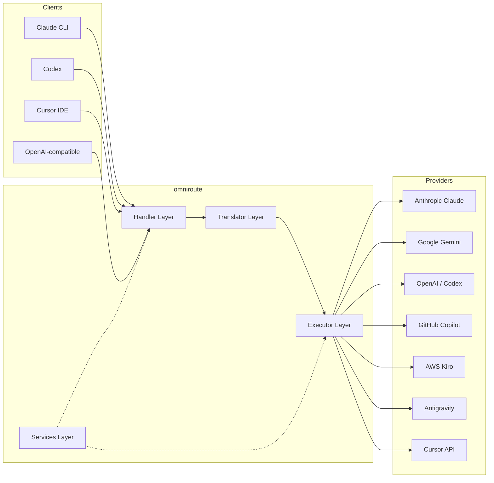
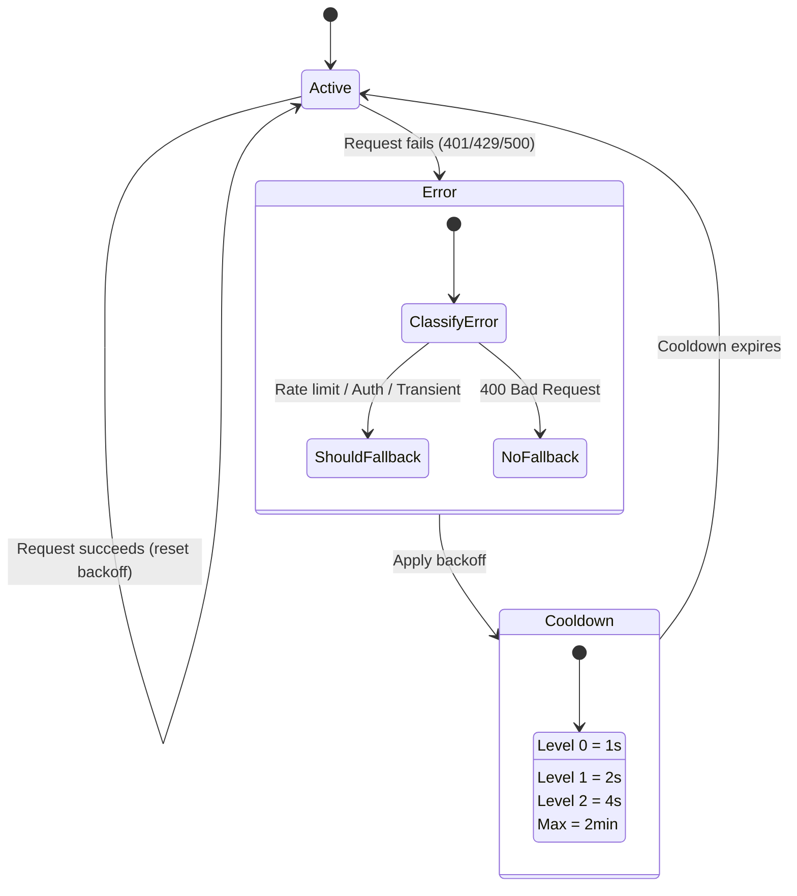
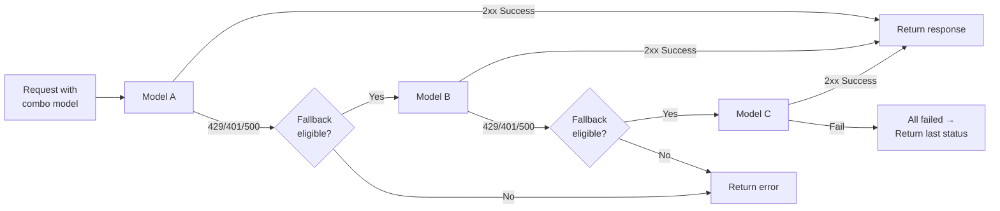
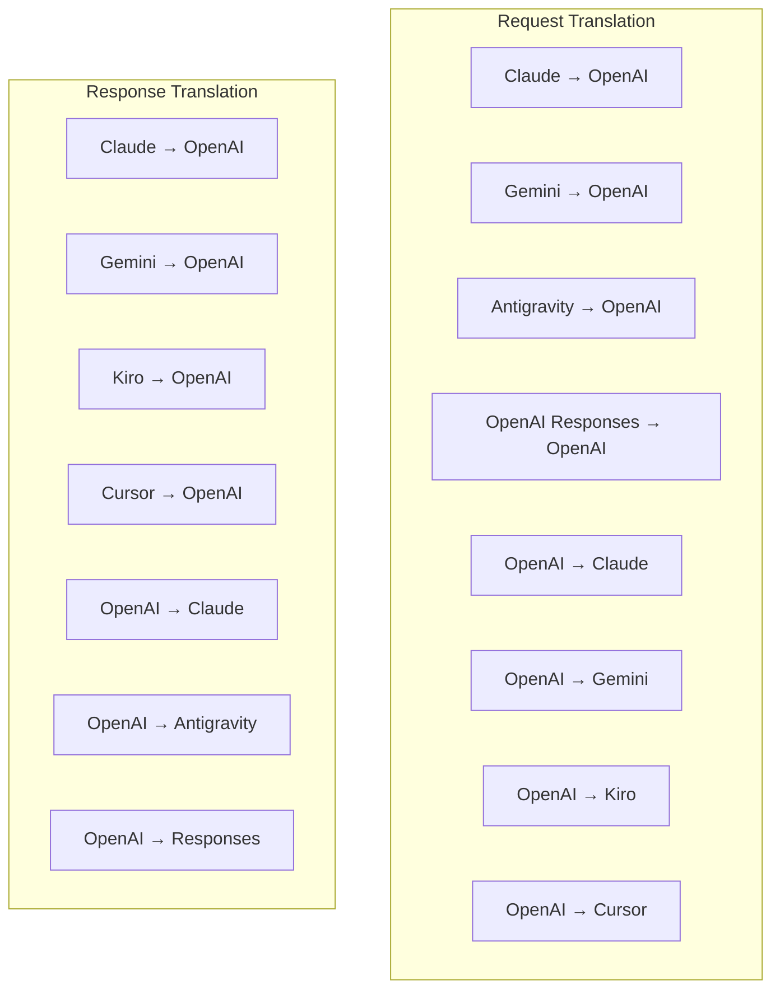
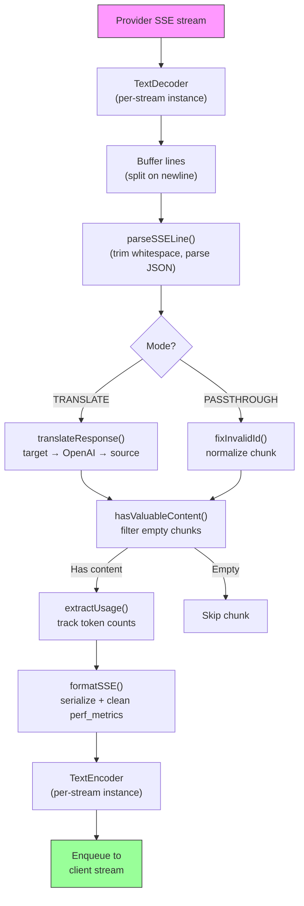
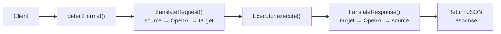
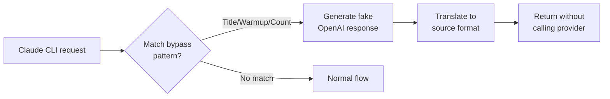

# omniroute — Codebase Documentation (Svenska)

🌐 **Languages:** 🇺🇸 [English](../../../../docs/CODEBASE_DOCUMENTATION.md) · 🇪🇸 [es](../../es/docs/CODEBASE_DOCUMENTATION.md) · 🇫🇷 [fr](../../fr/docs/CODEBASE_DOCUMENTATION.md) · 🇩🇪 [de](../../de/docs/CODEBASE_DOCUMENTATION.md) · 🇮🇹 [it](../../it/docs/CODEBASE_DOCUMENTATION.md) · 🇷🇺 [ru](../../ru/docs/CODEBASE_DOCUMENTATION.md) · 🇨🇳 [zh-CN](../../zh-CN/docs/CODEBASE_DOCUMENTATION.md) · 🇯🇵 [ja](../../ja/docs/CODEBASE_DOCUMENTATION.md) · 🇰🇷 [ko](../../ko/docs/CODEBASE_DOCUMENTATION.md) · 🇸🇦 [ar](../../ar/docs/CODEBASE_DOCUMENTATION.md) · 🇮🇳 [hi](../../hi/docs/CODEBASE_DOCUMENTATION.md) · 🇮🇳 [in](../../in/docs/CODEBASE_DOCUMENTATION.md) · 🇹🇭 [th](../../th/docs/CODEBASE_DOCUMENTATION.md) · 🇻🇳 [vi](../../vi/docs/CODEBASE_DOCUMENTATION.md) · 🇮🇩 [id](../../id/docs/CODEBASE_DOCUMENTATION.md) · 🇲🇾 [ms](../../ms/docs/CODEBASE_DOCUMENTATION.md) · 🇳🇱 [nl](../../nl/docs/CODEBASE_DOCUMENTATION.md) · 🇵🇱 [pl](../../pl/docs/CODEBASE_DOCUMENTATION.md) · 🇸🇪 [sv](../../sv/docs/CODEBASE_DOCUMENTATION.md) · 🇳🇴 [no](../../no/docs/CODEBASE_DOCUMENTATION.md) · 🇩🇰 [da](../../da/docs/CODEBASE_DOCUMENTATION.md) · 🇫🇮 [fi](../../fi/docs/CODEBASE_DOCUMENTATION.md) · 🇵🇹 [pt](../../pt/docs/CODEBASE_DOCUMENTATION.md) · 🇷🇴 [ro](../../ro/docs/CODEBASE_DOCUMENTATION.md) · 🇭🇺 [hu](../../hu/docs/CODEBASE_DOCUMENTATION.md) · 🇧🇬 [bg](../../bg/docs/CODEBASE_DOCUMENTATION.md) · 🇸🇰 [sk](../../sk/docs/CODEBASE_DOCUMENTATION.md) · 🇺🇦 [uk-UA](../../uk-UA/docs/CODEBASE_DOCUMENTATION.md) · 🇮🇱 [he](../../he/docs/CODEBASE_DOCUMENTATION.md) · 🇵🇭 [phi](../../phi/docs/CODEBASE_DOCUMENTATION.md) · 🇧🇷 [pt-BR](../../pt-BR/docs/CODEBASE_DOCUMENTATION.md) · 🇨🇿 [cs](../../cs/docs/CODEBASE_DOCUMENTATION.md) · 🇹🇷 [tr](../../tr/docs/CODEBASE_DOCUMENTATION.md)

---

> En omfattande, nybörjarvänlig guide till**omniroute**AI-proxyrouter med flera leverantörer.---

## 1. What Is omniroute?

omniroute är en**proxyrouter**som sitter mellan AI-klienter (Claude CLI, Codex, Cursor IDE, etc.) och AI-leverantörer (Anthropic, Google, OpenAI, AWS, GitHub, etc.). Det löser ett stort problem:

> **Olika AI-klienter talar olika "språk" (API-format), och olika AI-leverantörer förväntar sig också olika "språk".**omniroute översätter mellan dem automatiskt.

Tänk på det som en universell översättare vid Förenta Nationerna - vilken delegat som helst kan tala vilket språk som helst, och översättaren konverterar det till vilken annan delegat som helst.---

## 2. Architecture Overview



### Core Principle: Hub-and-Spoke Translation

All formatöversättning går genom**OpenAI-formatet som navet**:```
Client Format → [OpenAI Hub] → Provider Format (request)
Provider Format → [OpenAI Hub] → Client Format (response)

```

Det betyder att du bara behöver**N översättare**(en per format) istället för**N²**(varje par).---

## 3. Project Structure

```

omniroute/
├── open-sse/ ← Core proxy library (portable, framework-agnostic)
│ ├── index.js ← Main entry point, exports everything
│ ├── config/ ← Configuration & constants
│ ├── executors/ ← Provider-specific request execution
│ ├── handlers/ ← Request handling orchestration
│ ├── services/ ← Business logic (auth, models, fallback, usage)
│ ├── translator/ ← Format translation engine
│ │ ├── request/ ← Request translators (8 files)
│ │ ├── response/ ← Response translators (7 files)
│ │ └── helpers/ ← Shared translation utilities (6 files)
│ └── utils/ ← Utility functions
├── src/ ← Application layer (Express/Worker runtime)
│ ├── app/ ← Web UI, API routes, middleware
│ ├── lib/ ← Database, auth, and shared library code
│ ├── mitm/ ← Man-in-the-middle proxy utilities
│ ├── models/ ← Database models
│ ├── shared/ ← Shared utilities (wrappers around open-sse)
│ ├── sse/ ← SSE endpoint handlers
│ └── store/ ← State management
├── data/ ← Runtime data (credentials, logs)
│ └── provider-credentials.json (external credentials override, gitignored)
└── tester/ ← Test utilities

````

---

## 4. Module-by-Module Breakdown

### 4.1 Config (`open-sse/config/`)

Den**enda källan till sanning**för alla leverantörskonfigurationer.

| Arkiv | Syfte |
| ------------------------------ | --------------------------------------------------------------------------------------------------------------------------------------------------------------------------------------------------------------------------------------------------------------------------
| `constants.ts` | `PROVIDERS`-objekt med bas-URL:er, OAuth-referenser (standard), rubriker och standardsystemuppmaningar för varje leverantör. Definierar också `HTTP_STATUS`, `ERROR_TYPES`, `COOLDOWN_MS`, `BACKOFF_CONFIG` och `SKIP_PATTERNS`. |
| `credentialLoader.ts` | Laddar externa referenser från `data/provider-credentials.json` och slår samman dem över de hårdkodade standardinställningarna i `PROVIDERS`. Håller hemligheter utom källans kontroll samtidigt som bakåtkompatibiliteten bibehålls.               |
| `providerModels.ts` | Centralt modellregister: kartleverantörsalias → modell-ID:n. Funktioner som `getModels()`, `getProviderByAlias()`.                                                                                                          |
| `codexInstructions.ts` | Systeminstruktioner injicerade i Codex-förfrågningar (redigeringsbegränsningar, sandlåderegler, godkännandepolicyer).                                                                                                                 |
| `defaultThinkingSignature.ts` | Standard "tänkande" signaturer för Claude och Gemini modeller.                                                                                                                                                               |
| `ollamaModels.ts` | Schemadefinition för lokala Ollama-modeller (namn, storlek, familj, kvantisering).                                                                                                                                             |#### Credential Loading Flow

```mermaid
flowchart TD
    A["App starts"] --> B["constants.ts defines PROVIDERS\nwith hardcoded defaults"]
    B --> C{"data/provider-credentials.json\nexists?"}
    C -->|Yes| D["credentialLoader reads JSON"]
    C -->|No| E["Use hardcoded defaults"]
    D --> F{"For each provider in JSON"}
    F --> G{"Provider exists\nin PROVIDERS?"}
    G -->|No| H["Log warning, skip"]
    G -->|Yes| I{"Value is object?"}
    I -->|No| J["Log warning, skip"]
    I -->|Yes| K["Merge clientId, clientSecret,\ntokenUrl, authUrl, refreshUrl"]
    K --> F
    H --> F
    J --> F
    F -->|Done| L["PROVIDERS ready with\nmerged credentials"]
    E --> L
````

---

### 4.2 Executors (`open-sse/executors/`)

Exekutorer kapslar in**leverantörsspecifik logik**med hjälp av**Strategy Pattern**. Varje executor åsidosätter basmetoder efter behov.```mermaid
classDiagram
class BaseExecutor {
+buildUrl(model, stream, options)
+buildHeaders(credentials, stream, body)
+transformRequest(body, model, stream, credentials)
+execute(url, options)
+shouldRetry(status, error)
+refreshCredentials(credentials, log)
}

    class DefaultExecutor {
        +refreshCredentials()
    }

    class AntigravityExecutor {
        +buildUrl()
        +buildHeaders()
        +transformRequest()
        +shouldRetry()
        +refreshCredentials()
    }

    class CursorExecutor {
        +buildUrl()
        +buildHeaders()
        +transformRequest()
        +parseResponse()
        +generateChecksum()
    }

    class KiroExecutor {
        +buildUrl()
        +buildHeaders()
        +transformRequest()
        +parseEventStream()
        +refreshCredentials()
    }

    BaseExecutor <|-- DefaultExecutor
    BaseExecutor <|-- AntigravityExecutor
    BaseExecutor <|-- CursorExecutor
    BaseExecutor <|-- KiroExecutor
    BaseExecutor <|-- CodexExecutor
    BaseExecutor <|-- GeminiCLIExecutor
    BaseExecutor <|-- GithubExecutor

````

| Exekutor | Leverantör | Nyckelspecialiseringar |
| ---------------- | ------------------------------------------ | -------------------------------------------------------------------------------------------------------------------------- |
| `base.ts` | — | Abstrakt bas: URL-byggnad, rubriker, logik för försök igen, uppdatering av autentiseringsuppgifter |
| `default.ts` | Claude, Gemini, OpenAI, GLM, Kimi, MiniMax | Generisk OAuth-tokenuppdatering för standardleverantörer |
| `antigravity.ts` | Google Cloud Code | Generering av projekt-/sessions-ID, reserv för flera webbadresser, anpassad försök att analysera igen från felmeddelanden ("återställ efter 2h7m23s") |
| `cursor.ts` | Markör IDE |**Mest komplex**: SHA-256 kontrollsummaauth, Protobuf-begärankodning, binär EventStream → SSE-svarsanalys |
| `codex.ts` | OpenAI Codex | Injicerar systeminstruktioner, hanterar tankenivåer, tar bort parametrar som inte stöds |
| `gemini-cli.ts` | Google Gemini CLI | Anpassad URL-byggnad (`streamGenerateContent`), uppdatering av Google OAuth-token |
| `github.ts` | GitHub Copilot | Dubbla tokensystem (GitHub OAuth + Copilot-token), VSCode-huvudhärmare |
| `kiro.ts` | AWS CodeWhisperer | AWS EventStream binär analys, AMZN-händelseramar, tokenuppskattning |
| `index.ts` | — | Fabrik: maps provider name → executor class, with default fallback |---

### 4.3 Handlers (`open-sse/handlers/`)

**orkestreringsskiktet**— koordinerar översättning, exekvering, streaming och felhantering.

| Arkiv | Syfte |
| ---------------------- | ------------------------------------------------------------------------------------------------------------------------------------------------------------------------------------------------------------------------------------------------------------------------------------
| `chatCore.ts` |**Centralorkester**(~600 rader). Hanterar hela begärans livscykel: formatdetektering → översättning → exekutorutskick → strömmande/icke-strömmande svar → tokenuppdatering → felhantering → användningsloggning. |
| `responsesHandler.ts` | Adapter för OpenAI:s Responses API: konverterar svarsformat → Chattavslut → skickar till `chatCore` → konverterar SSE tillbaka till svarsformat.                                                                        |
| `inbäddningar.ts` | Inbäddningsgenereringshanterare: löser inbäddningsmodell → leverantör, skickar till leverantörs API, returnerar OpenAI-kompatibelt inbäddningssvar. Stöder 6+ leverantörer.                                                    |
| `imageGeneration.ts` | Bildgenereringshanterare: löser bildmodell → leverantör, stöder OpenAI-kompatibla, Gemini-bild (Antigravity) och reservläge (Nebius). Returnerar base64- eller URL-bilder.                                          |#### Request Lifecycle (chatCore.ts)

```mermaid
sequenceDiagram
    participant Client
    participant chatCore
    participant Translator
    participant Executor
    participant Provider

    Client->>chatCore: Request (any format)
    chatCore->>chatCore: Detect source format
    chatCore->>chatCore: Check bypass patterns
    chatCore->>chatCore: Resolve model & provider
    chatCore->>Translator: Translate request (source → OpenAI → target)
    chatCore->>Executor: Get executor for provider
    Executor->>Executor: Build URL, headers, transform request
    Executor->>Executor: Refresh credentials if needed
    Executor->>Provider: HTTP fetch (streaming or non-streaming)

    alt Streaming
        Provider-->>chatCore: SSE stream
        chatCore->>chatCore: Pipe through SSE transform stream
        Note over chatCore: Transform stream translates<br/>each chunk: target → OpenAI → source
        chatCore-->>Client: Translated SSE stream
    else Non-streaming
        Provider-->>chatCore: JSON response
        chatCore->>Translator: Translate response
        chatCore-->>Client: Translated JSON
    end

    alt Error (401, 429, 500...)
        chatCore->>Executor: Retry with credential refresh
        chatCore->>chatCore: Account fallback logic
    end
````

---

### 4.4 Services (`open-sse/services/`)

| Affärslogik som stödjer hanterarna och utförarna. | File                                                                                                                                                                                                                                                                                                                                   | Purpose |
| ------------------------------------------------- | -------------------------------------------------------------------------------------------------------------------------------------------------------------------------------------------------------------------------------------------------------------------------------------------------------------------------------------- | ------- |
| `provider.ts`                                     | **Format detection** (`detectFormat`): analyzes request body structure to identify Claude/OpenAI/Gemini/Antigravity/Responses formats (includes `max_tokens` heuristic for Claude). Also: URL building, header building, thinking config normalization. Supports `openai-compatible-*` and `anthropic-compatible-*` dynamic providers. |
| `model.ts`                                        | Model string parsing (`claude/model-name` → `{provider: "claude", model: "model-name"}`), alias resolution with collision detection, input sanitization (rejects path traversal/control chars), and model info resolution with async alias getter support.                                                                             |
| `accountFallback.ts`                              | Rate-limit handling: exponential backoff (1s → 2s → 4s → max 2min), account cooldown management, error classification (which errors trigger fallback vs. not).                                                                                                                                                                         |
| `tokenRefresh.ts`                                 | OAuth token refresh for **every provider**: Google (Gemini, Antigravity), Claude, Codex, Qwen, Qoder, GitHub (OAuth + Copilot dual-token), Kiro (AWS SSO OIDC + Social Auth). Includes in-flight promise deduplication cache and retry with exponential backoff.                                                                       |
| `combo.ts`                                        | **Combo models**: chains of fallback models. If model A fails with a fallback-eligible error, try model B, then C, etc. Returns actual upstream status codes.                                                                                                                                                                          |
| `usage.ts`                                        | Fetches quota/usage data from provider APIs (GitHub Copilot quotas, Antigravity model quotas, Codex rate limits, Kiro usage breakdowns, Claude settings).                                                                                                                                                                              |
| `accountSelector.ts`                              | Smart account selection with scoring algorithm: considers priority, health status, round-robin position, and cooldown state to pick the optimal account for each request.                                                                                                                                                              |
| `contextManager.ts`                               | Request context lifecycle management: creates and tracks per-request context objects with metadata (request ID, timestamps, provider info) for debugging and logging.                                                                                                                                                                  |
| `ipFilter.ts`                                     | IP-based access control: supports allowlist and blocklist modes. Validates client IP against configured rules before processing API requests.                                                                                                                                                                                          |
| `sessionManager.ts`                               | Session tracking with client fingerprinting: tracks active sessions using hashed client identifiers, monitors request counts, and provides session metrics.                                                                                                                                                                            |
| `signatureCache.ts`                               | Request signature-based deduplication cache: prevents duplicate requests by caching recent request signatures and returning cached responses for identical requests within a time window.                                                                                                                                              |
| `systemPrompt.ts`                                 | Global system prompt injection: prepends or appends a configurable system prompt to all requests, with per-provider compatibility handling.                                                                                                                                                                                            |
| `thinkingBudget.ts`                               | Reasoning token budget management: supports passthrough, auto (strip thinking config), custom (fixed budget), and adaptive (complexity-scaled) modes for controlling thinking/reasoning tokens.                                                                                                                                        |
| `wildcardRouter.ts`                               | Wildcard model pattern routing: resolves wildcard patterns (e.g., `*/claude-*`) to concrete provider/model pairs based on availability and priority.                                                                                                                                                                                   |

#### Token Refresh Deduplication

```mermaid
sequenceDiagram
    participant R1 as Request 1
    participant R2 as Request 2
    participant Cache as refreshPromiseCache
    participant OAuth as OAuth Provider

    R1->>Cache: getAccessToken("gemini", token)
    Cache->>Cache: No in-flight promise
    Cache->>OAuth: Start refresh
    R2->>Cache: getAccessToken("gemini", token)
    Cache->>Cache: Found in-flight promise
    Cache-->>R2: Return existing promise
    OAuth-->>Cache: New access token
    Cache-->>R1: New access token
    Cache-->>R2: Same access token (shared)
    Cache->>Cache: Delete cache entry
```

#### Account Fallback State Machine



#### Combo Model Chain



---

### 4.5 Translator (`open-sse/translator/`)

**formatöversättningsmotorn**använder ett självregistrerande pluginsystem.#### Arkitektur



| Katalog      | Filer         | Beskrivning                                                                                                                                                                                                                                                         |
| ------------ | ------------- | ------------------------------------------------------------------------------------------------------------------------------------------------------------------------------------------------------------------------------------------------------------------- | ----------------------------------------- |
| `request/`   | 8 översättare | Konvertera begärandekroppar mellan format. Varje fil självregistreras via `register(from, to, fn)` vid import.                                                                                                                                                      |
| `svar/`      | 7 översättare | Konvertera strömmande svarsbitar mellan format. Hanterar SSE-händelsetyper, tankeblock, verktygsanrop.                                                                                                                                                              |
| `hjälpare/`  | 6 hjälpare    | Delade verktyg: `claudeHelper` (extrahering av systemprompt, tankekonfiguration), `geminiHelper` (delar/innehållsmappning), `openaiHelper` (formatfiltrering), `toolCallHelper` (ID-generering, injektion av svar saknas), `maxTokensHelper`, `responsesApiHelper`. |
| `index.ts`   | —             | Översättningsmotor: `translateRequest()`, `translateResponse()`, tillståndshantering, register.                                                                                                                                                                     |
| `formats.ts` | —             | Formatkonstanter: `OPENAI`, `CLAUDE`, `GEMINI`, `ANTIGRAVITY`, `KIRO`, `CURSOR`, `OPENAI_RESPONSES`.                                                                                                                                                                | #### Key Design: Self-Registering Plugins |

```javascript
// Each translator file calls register() on import:
import { register } from "../index.js";
register("claude", "openai", translateClaudeToOpenAI);

// The index.js imports all translator files, triggering registration:
import "./request/claude-to-openai.js"; // ← self-registers
```

---

### 4.6 Utils (`open-sse/utils/`)

| Arkiv              | Syfte                                                                                                                                                                                                                                                                                                |
| ------------------ | ---------------------------------------------------------------------------------------------------------------------------------------------------------------------------------------------------------------------------------------------------------------------------------------------------- | --------------------------- |
| `error.ts`         | Byggande av felsvar (OpenAI-kompatibelt format), uppströms felanalys, Antigravity-återförsöksextraktion från felmeddelanden, SSE-felströmning.                                                                                                                                                       |
| `stream.ts`        | **SSE Transform Stream**— kärnan för streaming. Två lägen: 'ÖVERSÄTT' (översättning i fullformat) och 'PASSTHROUGH' (normalisera + extrahera användning). Hanterar chunkbuffring, användningsuppskattning, spårning av innehållslängd. Encoder/decoder-instanser per ström undviker delat tillstånd. |
| `streamHelpers.ts` | SSE-verktyg på låg nivå: `parseSSELine` (whitespace-tolerant), `hasValuableContent` (filtrerar tomma bitar för OpenAI/Claude/Gemini), `fixInvalidId`, `formatSSE` (formatmedveten SSE-serialisering med `perf_metrics`-rensning).                                                                    |
| `usageTracking.ts` | Extrahering av tokenanvändning från valfritt format (Claude/OpenAI/Gemini/Responses), uppskattning med separata verktyg/meddelande-char-per-token-förhållanden, bufferttillägg (säkerhetsmarginal för 2000 tokens), formatspecifik fältfiltrering, konsolloggning med ANSI-färger.                   |
| `requestLogger.ts` | Legacy file-based request logging helper kept for compatibility. Current deployments should prefer `APP_LOG_TO_FILE` for application logs and the call log pipeline for persisted request artifacts.                                                                                                 |
| `bypassHandler.ts` | Fångar upp specifika mönster från Claude CLI (titelextraktion, uppvärmning, räkning) och returnerar falska svar utan att ringa någon leverantör. Stöder både streaming och icke-streaming. Avsiktligt begränsad till Claude CLI omfattning.                                                          |
| `networkProxy.ts`  | Löser utgående proxy-URL för en given leverantör med prioritet: leverantörsspecifik konfiguration → global konfiguration → miljövariabler (`HTTPS_PROXY`/`HTTP_PROXY`/`ALL_PROXY`). Stöder "NO_PROXY"-undantag. Caches konfiguration för 30s.                                                        | #### SSE Streaming Pipeline |



#### Request Logger Session Structure

```
logs/
└── claude_gemini_claude-sonnet_20260208_143045/
    ├── 1_req_client.json      ← Raw client request
    ├── 2_req_source.json      ← After initial conversion
    ├── 3_req_openai.json      ← OpenAI intermediate format
    ├── 4_req_target.json      ← Final target format
    ├── 5_res_provider.txt     ← Provider SSE chunks (streaming)
    ├── 5_res_provider.json    ← Provider response (non-streaming)
    ├── 6_res_openai.txt       ← OpenAI intermediate chunks
    ├── 7_res_client.txt       ← Client-facing SSE chunks
    └── 6_error.json           ← Error details (if any)
```

---

### 4.7 Application Layer (`src/`)

| Katalog       | Syfte                                                                                  |
| ------------- | -------------------------------------------------------------------------------------- | ----------------------- |
| `src/app/`    | Webbgränssnitt, API-rutter, Express-mellanprogramvara, OAuth-återuppringningshanterare |
| `src/lib/`    | Databasåtkomst (`localDb.ts`, `usageDb.ts`), autentisering, delad                      |
| `src/mitm/`   | Man-in-the-middle-proxyverktyg för att avlyssna leverantörstrafik                      |
| `src/models/` | Databasmodelldefinitioner                                                              |
| `src/shared/` | Omslag runt öppna-sse-funktioner (leverantör, stream, fel, etc.)                       |
| `src/sse/`    | SSE-slutpunktshanterare som kopplar open-sse-biblioteket till Express-rutter           |
| `src/store/`  | Tillståndshantering för applikationer                                                  | #### Notable API Routes |

| Rutt                                                | Metoder          | Syfte                                                                                                 |
| --------------------------------------------------- | ---------------- | ----------------------------------------------------------------------------------------------------- | --- |
| `/api/provider-models`                              | GET/POSTA/RADERA | CRUD för anpassade modeller per leverantör                                                            |
| `/api/models/catalog`                               | FÅ               | Aggregerad katalog över alla modeller (chatt, inbäddning, bild, anpassad) grupperade efter leverantör |
| `/api/inställningar/proxy`                          | GET/PUT/DELETE   | Hierarkisk utgående proxykonfiguration (`global/providers/combos/keys`)                               |
| `/api/settings/proxy/test`                          | POST             | Validerar proxyanslutning och returnerar offentlig IP/latency                                         |
| `/v1/providers/[provider]/chat/completions`         | POST             | Dedikerade chattkompletteringar per leverantör med modellvalidering                                   |
| `/v1/providers/[provider]/inbäddningar`             | POST             | Dedikerade inbäddningar per leverantör med modellvalidering                                           |
| `/v1/leverantörer/[leverantör]/bilder/generationer` | POST             | Dedikerad bildgenerering per leverantör med modellvalidering                                          |
| `/api/settings/ip-filter`                           | GET/PUT          | Hantering av IP-tillståndslistor/blockeringslistor                                                    |
| `/api/settings/tänkebudget`                         | GET/PUT          | Resonemangstokens budgetkonfiguration (passthrough/auto/custom/adaptive)                              |
| `/api/settings/system-prompt`                       | GET/PUT          | Global systeminjektion för alla förfrågningar                                                         |
| `/api/sessioner`                                    | FÅ               | Aktiv sessionsspårning och mätvärden                                                                  |
| `/api/rate-limits`                                  | FÅ               | Räntegränsstatus per konto                                                                            | --- |

## 5. Key Design Patterns

### 5.1 Hub-and-Spoke Translation

Alla format översätts genom**OpenAI-formatet som navet**. Att lägga till en ny leverantör kräver bara att man skriver**ett par**översättare (till/från OpenAI), inte N par.### 5.2 Executor Strategy Pattern

Varje leverantör har en dedikerad executor-klass som ärver från `BaseExecutor`. Fabriken i `executors/index.ts` väljer den rätta vid körning.### 5.3 Self-Registering Plugin System

Översättningsmoduler registrerar sig själva vid import via `register()`. Att lägga till en ny översättare är bara att skapa en fil och importera den.### 5.4 Account Fallback with Exponential Backoff

När en leverantör returnerar 429/401/500 kan systemet byta till nästa konto genom att tillämpa exponentiell nedkylning (1s → 2s → 4s → max 2min).### 5.5 Combo Model Chains

En "combo" grupperar flera `provider/model`-strängar. Om den första misslyckas, återgå automatiskt till nästa.### 5.6 Stateful Streaming Translation

Svarsöversättning upprätthåller tillstånd över SSE-bitar (tänkeblockspårning, verktygsanropsackumulering, innehållsblockindexering) via `initState()`-mekanismen.### 5.7 Usage Safety Buffer

En buffert på 2000 token läggs till rapporterad användning för att förhindra att klienter når kontextfönstergränser på grund av overhead från systemuppmaningar och formatöversättning.---

## 6. Supported Formats

| Format                | Riktning    | Identifierare     |
| --------------------- | ----------- | ----------------- | --- |
| OpenAI Chat Slutförda | källa + mål | `openai`          |
| OpenAI Responses API  | källa + mål | `openai-svar`     |
| Antropisk Claude      | källa + mål | `claude`          |
| Google Tvillingarna   | källa + mål | "tvillingarna"    |
| Google Gemini CLI     | endast mål  | `gemini-cli`      |
| Antigravitation       | källa + mål | `antigravitation` |
| AWS Kiro              | endast mål  | `kiro`            |
| Markör                | endast mål  | `markör`          | --- |

## 7. Supported Providers

| Leverantör               | Auth Method                    | Exekutor        | Viktiga anmärkningar                                                  |
| ------------------------ | ------------------------------ | --------------- | --------------------------------------------------------------------- | --- |
| Antropisk Claude         | API-nyckel eller OAuth         | Standard        | Använder `x-api-key` header                                           |
| Google Tvillingarna      | API-nyckel eller OAuth         | Standard        | Använder "x-goog-api-key" header                                      |
| Google Gemini CLI        | OAuth                          | GeminiCLI       | Använder 'streamGenerateContent'-slutpunkt                            |
| Antigravitation          | OAuth                          | Antigravitation | Alternativ för flera webbadresser, anpassad försök att analysera igen |
| OpenAI                   | API-nyckel                     | Standard        | Standardbärare auth                                                   |
| Codex                    | OAuth                          | Codex           | Injicerar systeminstruktioner, hanterar tänkande                      |
| GitHub Copilot           | OAuth + Copilot-token          | Github          | Dubbla token, VSCode-huvudhärmar                                      |
| Kiro (AWS)               | AWS SSO OIDC eller Social      | Kiro            | Binär EventStream-analys                                              |
| Markör IDE               | Kontrollsumma auth             | Markör          | Protobuf-kodning, SHA-256 kontrollsummor                              |
| Qwen                     | OAuth                          | Standard        | Standardauth                                                          |
| Qoder                    | OAuth (Grundläggande + Bärare) | Standard        | Dubbla autentiseringshuvud                                            |
| OpenRouter               | API-nyckel                     | Standard        | Standardbärare auth                                                   |
| GLM, Kimi, MiniMax       | API-nyckel                     | Standard        | Claude-kompatibel, använd `x-api-key`                                 |
| `openai-kompatibel-*`    | API-nyckel                     | Standard        | Dynamisk: alla OpenAI-kompatibla slutpunkter                          |
| `antropisk-kompatibel-*` | API-nyckel                     | Standard        | Dynamisk: valfri Claude-kompatibel slutpunkt                          | --- |

## 8. Data Flow Summary

### Streaming Request

```mermaid
flowchart LR
    A["Client"] --> B["detectFormat()"]
    B --> C["translateRequest()\nsource → OpenAI → target"]
    C --> D["Executor\nbuildUrl + buildHeaders"]
    D --> E["fetch(providerURL)"]
    E --> F["createSSEStream()\nTRANSLATE mode"]
    F --> G["parseSSELine()"]
    G --> H["translateResponse()\ntarget → OpenAI → source"]
    H --> I["extractUsage()\n+ addBuffer"]
    I --> J["formatSSE()"]
    J --> K["Client receives\ntranslated SSE"]
    K --> L["logUsage()\nsaveRequestUsage()"]
```



### Non-Streaming Request



### Bypass Flow (Claude CLI)


