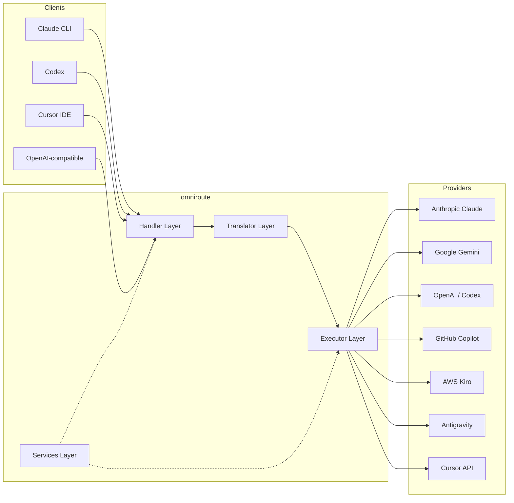
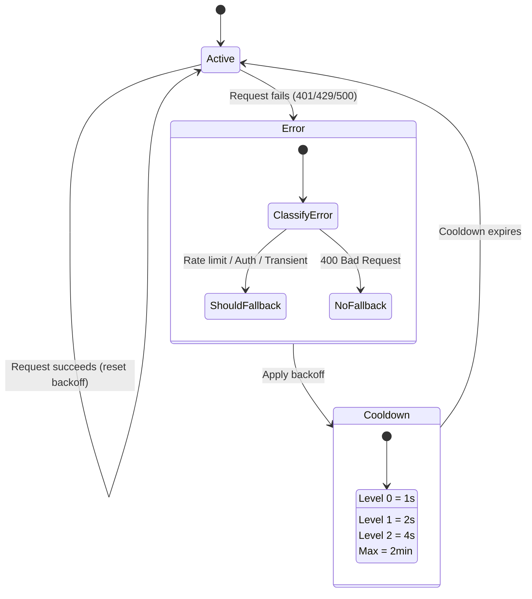
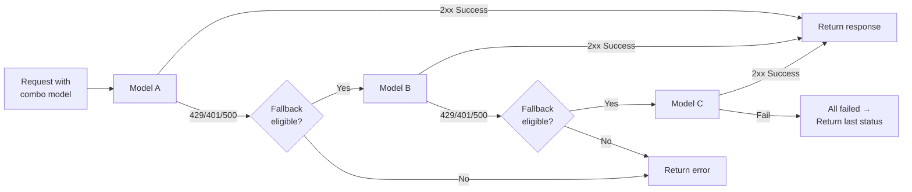
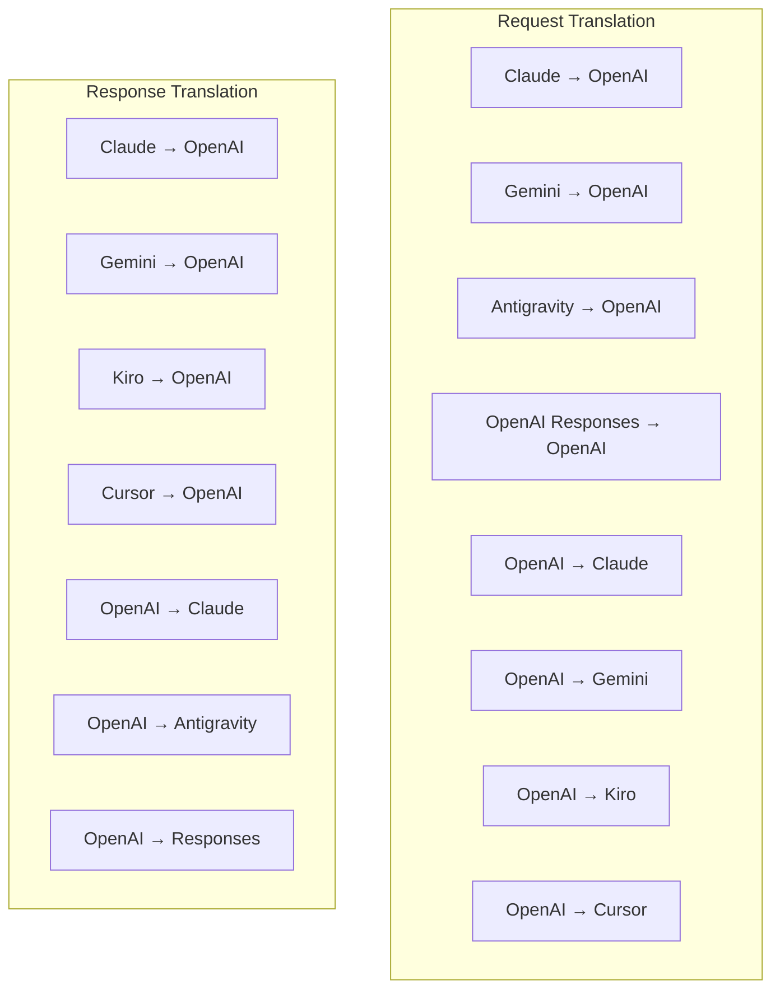
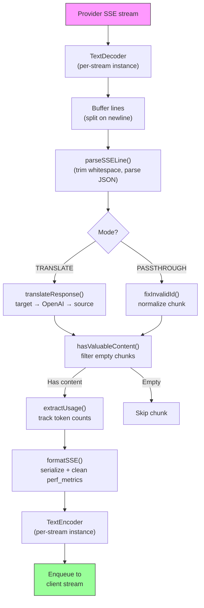
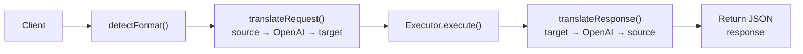
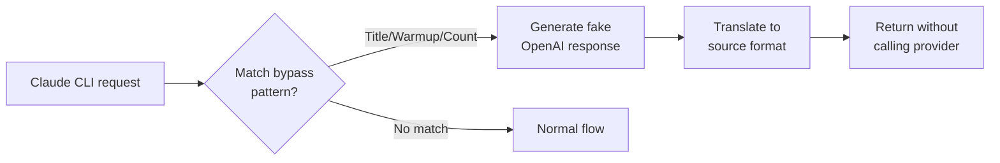

# omniroute — Codebase Documentation (ไทย)

🌐 **Languages:** 🇺🇸 [English](../../../../docs/CODEBASE_DOCUMENTATION.md) · 🇪🇸 [es](../../es/docs/CODEBASE_DOCUMENTATION.md) · 🇫🇷 [fr](../../fr/docs/CODEBASE_DOCUMENTATION.md) · 🇩🇪 [de](../../de/docs/CODEBASE_DOCUMENTATION.md) · 🇮🇹 [it](../../it/docs/CODEBASE_DOCUMENTATION.md) · 🇷🇺 [ru](../../ru/docs/CODEBASE_DOCUMENTATION.md) · 🇨🇳 [zh-CN](../../zh-CN/docs/CODEBASE_DOCUMENTATION.md) · 🇯🇵 [ja](../../ja/docs/CODEBASE_DOCUMENTATION.md) · 🇰🇷 [ko](../../ko/docs/CODEBASE_DOCUMENTATION.md) · 🇸🇦 [ar](../../ar/docs/CODEBASE_DOCUMENTATION.md) · 🇮🇳 [hi](../../hi/docs/CODEBASE_DOCUMENTATION.md) · 🇮🇳 [in](../../in/docs/CODEBASE_DOCUMENTATION.md) · 🇹🇭 [th](../../th/docs/CODEBASE_DOCUMENTATION.md) · 🇻🇳 [vi](../../vi/docs/CODEBASE_DOCUMENTATION.md) · 🇮🇩 [id](../../id/docs/CODEBASE_DOCUMENTATION.md) · 🇲🇾 [ms](../../ms/docs/CODEBASE_DOCUMENTATION.md) · 🇳🇱 [nl](../../nl/docs/CODEBASE_DOCUMENTATION.md) · 🇵🇱 [pl](../../pl/docs/CODEBASE_DOCUMENTATION.md) · 🇸🇪 [sv](../../sv/docs/CODEBASE_DOCUMENTATION.md) · 🇳🇴 [no](../../no/docs/CODEBASE_DOCUMENTATION.md) · 🇩🇰 [da](../../da/docs/CODEBASE_DOCUMENTATION.md) · 🇫🇮 [fi](../../fi/docs/CODEBASE_DOCUMENTATION.md) · 🇵🇹 [pt](../../pt/docs/CODEBASE_DOCUMENTATION.md) · 🇷🇴 [ro](../../ro/docs/CODEBASE_DOCUMENTATION.md) · 🇭🇺 [hu](../../hu/docs/CODEBASE_DOCUMENTATION.md) · 🇧🇬 [bg](../../bg/docs/CODEBASE_DOCUMENTATION.md) · 🇸🇰 [sk](../../sk/docs/CODEBASE_DOCUMENTATION.md) · 🇺🇦 [uk-UA](../../uk-UA/docs/CODEBASE_DOCUMENTATION.md) · 🇮🇱 [he](../../he/docs/CODEBASE_DOCUMENTATION.md) · 🇵🇭 [phi](../../phi/docs/CODEBASE_DOCUMENTATION.md) · 🇧🇷 [pt-BR](../../pt-BR/docs/CODEBASE_DOCUMENTATION.md) · 🇨🇿 [cs](../../cs/docs/CODEBASE_DOCUMENTATION.md) · 🇹🇷 [tr](../../tr/docs/CODEBASE_DOCUMENTATION.md)

---

> คู่มือที่ครอบคลุมและเหมาะสำหรับผู้เริ่มต้นสำหรับเราเตอร์พร็อกซี AI ของผู้ให้บริการหลายราย**omniroute**---

## 1. What Is omniroute?

Omniroute คือ**เราเตอร์พร็อกซี**ที่อยู่ระหว่างไคลเอนต์ AI (Claude CLI, Codex, Cursor IDE ฯลฯ) และผู้ให้บริการ AI (Anthropic, Google, OpenAI, AWS, GitHub ฯลฯ) มันแก้ปัญหาใหญ่อย่างหนึ่ง:

> **ไคลเอนต์ AI ต่างกันพูด "ภาษา" ที่แตกต่างกัน (รูปแบบ API) และผู้ให้บริการ AI ต่างคาดหวัง "ภาษา" ที่แตกต่างกันเช่นกัน**การแปลทุกเส้นทางระหว่างกันโดยอัตโนมัติ

ลองคิดดูว่าสิ่งนี้เหมือนกับนักแปลสากลขององค์การสหประชาชาติ ผู้แทนทุกคนสามารถพูดภาษาใดก็ได้ และผู้แปลจะแปลงภาษาดังกล่าวให้กับผู้แทนคนอื่นๆ---

## 2. Architecture Overview



### Core Principle: Hub-and-Spoke Translation

การแปลทุกรูปแบบผ่าน**รูปแบบ OpenAI เป็นศูนย์กลาง**:```
Client Format → [OpenAI Hub] → Provider Format (request)
Provider Format → [OpenAI Hub] → Client Format (response)

```

ซึ่งหมายความว่าคุณต้องการเพียง**N ตัวแปล**(หนึ่งตัวต่อรูปแบบ) แทนที่จะเป็น**N²**(ทุกคู่)---

## 3. Project Structure

```

omniroute/
├── open-sse/ ← Core proxy library (portable, framework-agnostic)
│ ├── index.js ← Main entry point, exports everything
│ ├── config/ ← Configuration & constants
│ ├── executors/ ← Provider-specific request execution
│ ├── handlers/ ← Request handling orchestration
│ ├── services/ ← Business logic (auth, models, fallback, usage)
│ ├── translator/ ← Format translation engine
│ │ ├── request/ ← Request translators (8 files)
│ │ ├── response/ ← Response translators (7 files)
│ │ └── helpers/ ← Shared translation utilities (6 files)
│ └── utils/ ← Utility functions
├── src/ ← Application layer (Express/Worker runtime)
│ ├── app/ ← Web UI, API routes, middleware
│ ├── lib/ ← Database, auth, and shared library code
│ ├── mitm/ ← Man-in-the-middle proxy utilities
│ ├── models/ ← Database models
│ ├── shared/ ← Shared utilities (wrappers around open-sse)
│ ├── sse/ ← SSE endpoint handlers
│ └── store/ ← State management
├── data/ ← Runtime data (credentials, logs)
│ └── provider-credentials.json (external credentials override, gitignored)
└── tester/ ← Test utilities

````

---

## 4. Module-by-Module Breakdown

### 4.1 Config (`open-sse/config/`)

**แหล่งความจริงแหล่งเดียว**สำหรับการกำหนดค่าของผู้ให้บริการทั้งหมด

| ไฟล์ | วัตถุประสงค์ |
| --------------------------------- | ----------------------------------------------------------------------------------------------------------------------------------------------------------------------------------------------------------------------------- |
| `ค่าคงที่.ts` | ออบเจ็กต์ `PROVIDERS` พร้อมด้วย URL พื้นฐาน ข้อมูลรับรอง OAuth (ค่าเริ่มต้น) ส่วนหัว และระบบเริ่มต้นแจ้งสำหรับผู้ให้บริการทุกราย นอกจากนี้ยังกำหนด `HTTP_STATUS`, `ERROR_TYPES`, `COOLDOWN_MS`, `BACKOFF_CONFIG` และ `SKIP_PATTERNS` ด้วย |
| `ข้อมูลรับรองLoader.ts` | โหลดข้อมูลรับรองภายนอกจาก `data/provider-credentials.json` และรวมเข้ากับค่าเริ่มต้นแบบฮาร์ดโค้ดใน `PROVIDERS` เก็บความลับไว้นอกเหนือการควบคุมของแหล่งที่มาในขณะที่ยังคงความเข้ากันได้แบบย้อนหลัง               |
| `providerModels.ts` | การลงทะเบียนโมเดลส่วนกลาง: นามแฝงของผู้ให้บริการแผนที่ → รหัสโมเดล ฟังก์ชันเช่น `getModels()`, `getProviderByAlias()`                                                                                                          |
| `codexInstructions.ts` | คำแนะนำของระบบที่แทรกเข้าไปในคำขอ Codex (การแก้ไขข้อจำกัด กฎแซนด์บ็อกซ์ นโยบายการอนุมัติ)                                                                                                                 |
| `defaultThinkingSignature.ts` | ลายเซ็น "การคิด" เริ่มต้นสำหรับโมเดล Claude และ Gemini                                                                                                                                                               |
| `ollamaModels.ts` | คำจำกัดความของสคีมาสำหรับโมเดล Ollama ท้องถิ่น (ชื่อ ขนาด ตระกูล การหาปริมาณ)                                                                                                                                             |#### Credential Loading Flow

```mermaid
flowchart TD
    A["App starts"] --> B["constants.ts defines PROVIDERS\nwith hardcoded defaults"]
    B --> C{"data/provider-credentials.json\nexists?"}
    C -->|Yes| D["credentialLoader reads JSON"]
    C -->|No| E["Use hardcoded defaults"]
    D --> F{"For each provider in JSON"}
    F --> G{"Provider exists\nin PROVIDERS?"}
    G -->|No| H["Log warning, skip"]
    G -->|Yes| I{"Value is object?"}
    I -->|No| J["Log warning, skip"]
    I -->|Yes| K["Merge clientId, clientSecret,\ntokenUrl, authUrl, refreshUrl"]
    K --> F
    H --> F
    J --> F
    F -->|Done| L["PROVIDERS ready with\nmerged credentials"]
    E --> L
````

---

### 4.2 Executors (`open-sse/executors/`)

ผู้ดำเนินการสรุป**ตรรกะเฉพาะของผู้ให้บริการ**โดยใช้**รูปแบบกลยุทธ์**ตัวดำเนินการแต่ละตัวจะแทนที่วิธีพื้นฐานตามความจำเป็น```mermaid
classDiagram
class BaseExecutor {
+buildUrl(model, stream, options)
+buildHeaders(credentials, stream, body)
+transformRequest(body, model, stream, credentials)
+execute(url, options)
+shouldRetry(status, error)
+refreshCredentials(credentials, log)
}

    class DefaultExecutor {
        +refreshCredentials()
    }

    class AntigravityExecutor {
        +buildUrl()
        +buildHeaders()
        +transformRequest()
        +shouldRetry()
        +refreshCredentials()
    }

    class CursorExecutor {
        +buildUrl()
        +buildHeaders()
        +transformRequest()
        +parseResponse()
        +generateChecksum()
    }

    class KiroExecutor {
        +buildUrl()
        +buildHeaders()
        +transformRequest()
        +parseEventStream()
        +refreshCredentials()
    }

    BaseExecutor <|-- DefaultExecutor
    BaseExecutor <|-- AntigravityExecutor
    BaseExecutor <|-- CursorExecutor
    BaseExecutor <|-- KiroExecutor
    BaseExecutor <|-- CodexExecutor
    BaseExecutor <|-- GeminiCLIExecutor
    BaseExecutor <|-- GithubExecutor

````

| ผู้ดำเนินการ | ผู้ให้บริการ | ความเชี่ยวชาญพิเศษที่สำคัญ |
| ---------------- | ----------------------------------------------- | ------------------------------------------------------------------------------------------------------------------- |
| `base.ts` | — | ฐานบทคัดย่อ: การสร้าง URL, ส่วนหัว, ตรรกะการลองใหม่, การรีเฟรชข้อมูลรับรอง |
| `default.ts` | Claude, เมถุน, OpenAI, GLM, Kimi, MiniMax | การรีเฟรชโทเค็น OAuth ทั่วไปสำหรับผู้ให้บริการมาตรฐาน |
| `ต้านแรงโน้มถ่วง.ts` | รหัส Google Cloud | การสร้างรหัสโปรเจ็กต์/เซสชัน, ทางเลือกหลาย URL, ลองแยกวิเคราะห์ข้อความแสดงข้อผิดพลาดแบบกำหนดเองอีกครั้ง ("รีเซ็ตหลังจาก 2 ชม. 7 นาที 23 วินาที") |
| `cursor.ts` | เคอร์เซอร์ IDE |**ซับซ้อนที่สุด**: การตรวจสอบสิทธิ์การตรวจสอบ SHA-256, การเข้ารหัสคำขอ Protobuf, ไบนารี EventStream → การแยกวิเคราะห์การตอบสนอง SSE |
| `codex.ts` | OpenAI Codex | ใส่คำสั่งของระบบ จัดการระดับการคิด ลบพารามิเตอร์ที่ไม่รองรับ |
| `gemini-cli.ts` | Google ราศีเมถุน CLI | การสร้าง URL ที่กำหนดเอง (`streamGenerateContent`), การรีเฟรชโทเค็น Google OAuth
| `github.ts` | นักบิน GitHub | ระบบโทเค็นคู่ (โทเค็น GitHub OAuth + โทเค็น Copilot) การเลียนแบบส่วนหัว VSCode
| `kiro.ts` | AWS CodeWhisperer | การแยกวิเคราะห์ไบนารี AWS EventStream, เฟรมเหตุการณ์ AMZN, การประมาณโทเค็น |
| `index.ts` | — | โรงงาน: ชื่อผู้ให้บริการแผนที่ → คลาสผู้ดำเนินการ โดยมีค่าเริ่มต้นสำรอง |---

### 4.3 Handlers (`open-sse/handlers/`)

**เลเยอร์การเรียบเรียง**— ประสานงานการแปล การดำเนินการ การสตรีม และการจัดการข้อผิดพลาด

| ไฟล์ | วัตถุประสงค์ |
| --------------------- | ---------------------------------------------------------------------------------------------------------------------------------------------------------------------------------------------------------------------- |
| `chatCore.ts` |**ผู้เรียบเรียงกลาง**(~600 บรรทัด) จัดการวงจรคำขอที่สมบูรณ์: การตรวจจับรูปแบบ → การแปล → การส่งตัวดำเนินการ → การตอบสนองแบบสตรีมมิ่ง/ไม่สตรีมมิ่ง → การรีเฟรชโทเค็น → การจัดการข้อผิดพลาด → การบันทึกการใช้งาน |
| `responsesHandler.ts` | อะแดปเตอร์สำหรับ Responses API ของ OpenAI: แปลงรูปแบบการตอบกลับ → การแชทเสร็จสิ้น → ส่งไปที่ `chatCore` → แปลง SSE กลับเป็นรูปแบบการตอบกลับ                                                                        |
| `embeddings.ts` | ตัวจัดการการสร้างการฝัง: แก้ไขโมเดลการฝัง → ผู้ให้บริการ, ส่งไปยัง API ของผู้ให้บริการ, ส่งคืนการตอบสนองการฝังที่เข้ากันได้กับ OpenAI รองรับผู้ให้บริการ 6+ ราย                                                    |
| `imageGeneration.ts` | ตัวจัดการการสร้างรูปภาพ: แก้ไขโมเดลรูปภาพ → ผู้ให้บริการ รองรับโหมดที่เข้ากันได้กับ OpenAI, Gemini-image (ต้านแรงโน้มถ่วง) และโหมดทางเลือก (Nebius) ส่งกลับภาพ base64 หรือ URL                                          |#### Request Lifecycle (chatCore.ts)

```mermaid
sequenceDiagram
    participant Client
    participant chatCore
    participant Translator
    participant Executor
    participant Provider

    Client->>chatCore: Request (any format)
    chatCore->>chatCore: Detect source format
    chatCore->>chatCore: Check bypass patterns
    chatCore->>chatCore: Resolve model & provider
    chatCore->>Translator: Translate request (source → OpenAI → target)
    chatCore->>Executor: Get executor for provider
    Executor->>Executor: Build URL, headers, transform request
    Executor->>Executor: Refresh credentials if needed
    Executor->>Provider: HTTP fetch (streaming or non-streaming)

    alt Streaming
        Provider-->>chatCore: SSE stream
        chatCore->>chatCore: Pipe through SSE transform stream
        Note over chatCore: Transform stream translates<br/>each chunk: target → OpenAI → source
        chatCore-->>Client: Translated SSE stream
    else Non-streaming
        Provider-->>chatCore: JSON response
        chatCore->>Translator: Translate response
        chatCore-->>Client: Translated JSON
    end

    alt Error (401, 429, 500...)
        chatCore->>Executor: Retry with credential refresh
        chatCore->>chatCore: Account fallback logic
    end
````

---

### 4.4 Services (`open-sse/services/`)

| ตรรกะทางธุรกิจที่สนับสนุนตัวจัดการและผู้ดำเนินการ | File                                                                                                                                                                                                                                                                                                                                   | Purpose |
| ------------------------------------------------- | -------------------------------------------------------------------------------------------------------------------------------------------------------------------------------------------------------------------------------------------------------------------------------------------------------------------------------------- | ------- |
| `provider.ts`                                     | **Format detection** (`detectFormat`): analyzes request body structure to identify Claude/OpenAI/Gemini/Antigravity/Responses formats (includes `max_tokens` heuristic for Claude). Also: URL building, header building, thinking config normalization. Supports `openai-compatible-*` and `anthropic-compatible-*` dynamic providers. |
| `model.ts`                                        | Model string parsing (`claude/model-name` → `{provider: "claude", model: "model-name"}`), alias resolution with collision detection, input sanitization (rejects path traversal/control chars), and model info resolution with async alias getter support.                                                                             |
| `accountFallback.ts`                              | Rate-limit handling: exponential backoff (1s → 2s → 4s → max 2min), account cooldown management, error classification (which errors trigger fallback vs. not).                                                                                                                                                                         |
| `tokenRefresh.ts`                                 | OAuth token refresh for **every provider**: Google (Gemini, Antigravity), Claude, Codex, Qwen, Qoder, GitHub (OAuth + Copilot dual-token), Kiro (AWS SSO OIDC + Social Auth). Includes in-flight promise deduplication cache and retry with exponential backoff.                                                                       |
| `combo.ts`                                        | **Combo models**: chains of fallback models. If model A fails with a fallback-eligible error, try model B, then C, etc. Returns actual upstream status codes.                                                                                                                                                                          |
| `usage.ts`                                        | Fetches quota/usage data from provider APIs (GitHub Copilot quotas, Antigravity model quotas, Codex rate limits, Kiro usage breakdowns, Claude settings).                                                                                                                                                                              |
| `accountSelector.ts`                              | Smart account selection with scoring algorithm: considers priority, health status, round-robin position, and cooldown state to pick the optimal account for each request.                                                                                                                                                              |
| `contextManager.ts`                               | Request context lifecycle management: creates and tracks per-request context objects with metadata (request ID, timestamps, provider info) for debugging and logging.                                                                                                                                                                  |
| `ipFilter.ts`                                     | IP-based access control: supports allowlist and blocklist modes. Validates client IP against configured rules before processing API requests.                                                                                                                                                                                          |
| `sessionManager.ts`                               | Session tracking with client fingerprinting: tracks active sessions using hashed client identifiers, monitors request counts, and provides session metrics.                                                                                                                                                                            |
| `signatureCache.ts`                               | Request signature-based deduplication cache: prevents duplicate requests by caching recent request signatures and returning cached responses for identical requests within a time window.                                                                                                                                              |
| `systemPrompt.ts`                                 | Global system prompt injection: prepends or appends a configurable system prompt to all requests, with per-provider compatibility handling.                                                                                                                                                                                            |
| `thinkingBudget.ts`                               | Reasoning token budget management: supports passthrough, auto (strip thinking config), custom (fixed budget), and adaptive (complexity-scaled) modes for controlling thinking/reasoning tokens.                                                                                                                                        |
| `wildcardRouter.ts`                               | Wildcard model pattern routing: resolves wildcard patterns (e.g., `*/claude-*`) to concrete provider/model pairs based on availability and priority.                                                                                                                                                                                   |

#### Token Refresh Deduplication

```mermaid
sequenceDiagram
    participant R1 as Request 1
    participant R2 as Request 2
    participant Cache as refreshPromiseCache
    participant OAuth as OAuth Provider

    R1->>Cache: getAccessToken("gemini", token)
    Cache->>Cache: No in-flight promise
    Cache->>OAuth: Start refresh
    R2->>Cache: getAccessToken("gemini", token)
    Cache->>Cache: Found in-flight promise
    Cache-->>R2: Return existing promise
    OAuth-->>Cache: New access token
    Cache-->>R1: New access token
    Cache-->>R2: Same access token (shared)
    Cache->>Cache: Delete cache entry
```

#### Account Fallback State Machine



#### Combo Model Chain



---

### 4.5 Translator (`open-sse/translator/`)

**เครื่องมือแปลรูปแบบ**ใช้ระบบปลั๊กอินที่ลงทะเบียนด้วยตนเอง#### สถาปัตยกรรม



| ไดเรกทอรี       | ไฟล์        | คำอธิบาย                                                                                                                                                                                                                                                         |
| --------------- | ----------- | ---------------------------------------------------------------------------------------------------------------------------------------------------------------------------------------------------------------------------------------------------------------- | ----------------------------------------- |
| `ขอ/`           | นักแปล 8 คน | แปลงเนื้อหาคำขอระหว่างรูปแบบ แต่ละไฟล์จะลงทะเบียนด้วยตนเองผ่าน `register(from, to, fn)` เมื่อนำเข้า                                                                                                                                                              |
| `ตอบกลับ/`      | นักแปล 7 คน | แปลงส่วนการตอบสนองการสตรีมระหว่างรูปแบบต่างๆ จัดการประเภทเหตุการณ์ SSE, บล็อกการคิด, การเรียกใช้เครื่องมือ                                                                                                                                                       |
| `ผู้ช่วยเหลือ/` | 6 ตัวช่วย   | ยูทิลิตี้ที่ใช้ร่วมกัน: `claudeHelper` (การแยกพร้อมท์ของระบบ, การกำหนดค่าการคิด), `geminiHelper` (การแมปชิ้นส่วน/เนื้อหา), `openaiHelper` (การกรองรูปแบบ), `toolCallHelper` (การสร้าง ID, การแทรกการตอบสนองที่ขาดหายไป), `maxTokensHelper`, `responsesApiHelper` |
| `index.ts`      | —           | เครื่องมือแปล: `translateRequest()`, `translateResponse()`, การจัดการสถานะ, การลงทะเบียน                                                                                                                                                                         |
| `formats.ts`    | —           | จัดรูปแบบค่าคงที่: `OPENAI`, `CLAUDE`, `GEMINI`, `ANTIGRAVITY`, `KIRO`, `CURSOR`, `OPENAI_RESPONSES`                                                                                                                                                             | #### Key Design: Self-Registering Plugins |

```javascript
// Each translator file calls register() on import:
import { register } from "../index.js";
register("claude", "openai", translateClaudeToOpenAI);

// The index.js imports all translator files, triggering registration:
import "./request/claude-to-openai.js"; // ← self-registers
```

---

### 4.6 Utils (`open-sse/utils/`)

| ไฟล์               | วัตถุประสงค์                                                                                                                                                                                                                                                                |
| ------------------ | --------------------------------------------------------------------------------------------------------------------------------------------------------------------------------------------------------------------------------------------------------------------------- | --------------------------- |
| `error.ts`         | การสร้างการตอบสนองข้อผิดพลาด (รูปแบบที่เข้ากันได้กับ OpenAI), การแยกวิเคราะห์ข้อผิดพลาดอัปสตรีม, การแยกเวลาลองต้านแรงโน้มถ่วงอีกครั้งจากข้อความแสดงข้อผิดพลาด, การสตรีมข้อผิดพลาด SSE                                                                                       |
| `stream.ts`        | **SSE Transform Stream**— ไปป์ไลน์การสตรีมหลัก สองโหมด: `TRANSLATE` (การแปลแบบเต็ม) และ `PASSTHROUGH` (ทำให้ปกติ + แยกการใช้งาน) จัดการการบัฟเฟอร์แบบก้อน การประมาณการใช้งาน การติดตามความยาวของเนื้อหา อินสแตนซ์ตัวเข้ารหัส/ตัวถอดรหัสต่อสตรีมหลีกเลี่ยงสถานะที่ใช้ร่วมกัน |
| `streamHelpers.ts` | ยูทิลิตี้ SSE ระดับต่ำ: `parseSSELine` (ทนต่อช่องว่าง), `hasValuableContent` (กรองส่วนว่างสำหรับ OpenAI/Claude/Gemini), `fixInvalidId`, `formatSSE` (การจัดลำดับ SSE ที่รับรู้รูปแบบด้วยการล้างข้อมูล `perf_metrics`)                                                       |
| `usageTracking.ts` | การแยกการใช้โทเค็นจากรูปแบบใดๆ (Claude/OpenAI/Gemini/Responses) การประมาณค่าด้วยอัตราส่วนเครื่องมือ/ข้อความที่แยกจากกันต่ออักขระ การเพิ่มบัฟเฟอร์ (อัตราความปลอดภัยของโทเค็น 2,000 โทเค็น) การกรองฟิลด์เฉพาะรูปแบบ การบันทึกคอนโซลด้วยสี ANSI                               |
| `requestLogger.ts` | Legacy file-based request logging helper kept for compatibility. Current deployments should prefer `APP_LOG_TO_FILE` for application logs and the call log pipeline for persisted request artifacts.                                                                        |
| `bypassHandler.ts` | สกัดกั้นรูปแบบเฉพาะจาก Claude CLI (การแยกชื่อ การอุ่นเครื่อง การนับ) และส่งคืนการตอบกลับปลอมโดยไม่ต้องโทรหาผู้ให้บริการใดๆ รองรับทั้งสตรีมมิ่งและไม่สตรีมมิ่ง จำกัดโดยเจตนาไว้ที่ขอบเขตของ Claude CLI                                                                       |
| `networkProxy.ts`  | แก้ไข URL พร็อกซีขาออกสำหรับผู้ให้บริการที่กำหนดโดยมีความสำคัญ: การกำหนดค่าเฉพาะผู้ให้บริการ → การกำหนดค่าส่วนกลาง → ตัวแปรสภาพแวดล้อม (`HTTPS_PROXY`/`HTTP_PROXY`/`ALL_PROXY`) รองรับการยกเว้น `NO_PROXY` กำหนดค่าแคชเป็นเวลา 30 วินาที                                    | #### SSE Streaming Pipeline |



#### Request Logger Session Structure

```
logs/
└── claude_gemini_claude-sonnet_20260208_143045/
    ├── 1_req_client.json      ← Raw client request
    ├── 2_req_source.json      ← After initial conversion
    ├── 3_req_openai.json      ← OpenAI intermediate format
    ├── 4_req_target.json      ← Final target format
    ├── 5_res_provider.txt     ← Provider SSE chunks (streaming)
    ├── 5_res_provider.json    ← Provider response (non-streaming)
    ├── 6_res_openai.txt       ← OpenAI intermediate chunks
    ├── 7_res_client.txt       ← Client-facing SSE chunks
    └── 6_error.json           ← Error details (if any)
```

---

### 4.7 Application Layer (`src/`)

| ไดเรกทอรี      | วัตถุประสงค์                                                                          |
| -------------- | ------------------------------------------------------------------------------------- | ----------------------- |
| `src/แอป/`     | UI ของเว็บ, เส้นทาง API, มิดเดิลแวร์ด่วน, ตัวจัดการการเรียกกลับ OAuth                 |
| `src/lib/`     | การเข้าถึงฐานข้อมูล (`localDb.ts`, `usageDb.ts`), การรับรองความถูกต้อง, ที่ใช้ร่วมกัน |
| `src/mitm/`    | ยูทิลิตี้พร็อกซีแบบ Man-in-the-middle สำหรับการสกัดกั้นการรับส่งข้อมูลของผู้ให้บริการ |
| `src/รุ่น/`    | คำจำกัดความของโมเดลฐานข้อมูล                                                          |
| `src/แชร์/`    | Wrappers รอบฟังก์ชัน open-sse (ผู้ให้บริการ สตรีม ข้อผิดพลาด ฯลฯ)                     |
| `src/sse/`     | ตัวจัดการตำแหน่งข้อมูล SSE ที่เชื่อมต่อไลบรารี open-sse ไปยังเส้นทางด่วน              |
| `src/ร้านค้า/` | การจัดการสถานะแอปพลิเคชัน                                                             | #### Notable API Routes |

| เส้นทาง                                         | วิธีการ      | วัตถุประสงค์                                                                  |
| ----------------------------------------------- | ------------ | ----------------------------------------------------------------------------- | ------- |
| `/api/ผู้ให้บริการ-รุ่น`                        | รับ/โพสต์/ลบ | CRUD สำหรับโมเดลที่กำหนดเองต่อผู้ให้บริการ                                    |
| `/api/models/catalog`                           | รับ          | แค็ตตาล็อกรวมของทุกรุ่น (แชท การฝัง รูปภาพ กำหนดเอง) จัดกลุ่มตามผู้ให้บริการ  |
| `/api/settings/proxy`                           | รับ/วาง/ลบ   | การกำหนดค่าพร็อกซีขาออกแบบลำดับชั้น (`global/providers/combos/keys`)          |
| `/api/settings/proxy/test`                      | โพสต์        | ตรวจสอบการเชื่อมต่อพร็อกซีและส่งคืน IP/เวลาแฝง                                | สาธารณะ |
| `/v1/providers/[ผู้ให้บริการ]/chat/completions` | โพสต์        | การแชทต่อผู้ให้บริการโดยเฉพาะพร้อมการตรวจสอบความถูกต้องของโมเดล               |
| `/v1/ผู้ให้บริการ/[ผู้ให้บริการ]/การฝัง`        | โพสต์        | การฝังต่อผู้ให้บริการโดยเฉพาะพร้อมการตรวจสอบความถูกต้องของโมเดล               |
| `/v1/ผู้ให้บริการ/[ผู้ให้บริการ]/รูปภาพ/รุ่น`   | โพสต์        | การสร้างอิมเมจต่อผู้ให้บริการโดยเฉพาะพร้อมการตรวจสอบโมเดล                     |
| `/api/settings/ip-filter`                       | รับ/ใส่      | การจัดการรายการ IP ที่อนุญาต/รายการบล็อก                                      |
| `/api/settings/การคิดงบประมาณ`                  | รับ/ใส่      | การกำหนดค่างบประมาณโทเค็นการให้เหตุผล (ส่งผ่าน/อัตโนมัติ/กำหนดเอง/แบบปรับได้) |
| `/api/settings/system-prompt`                   | รับ/ใส่      | ระบบ Global พร้อมฉีดสำหรับทุกคำขอ                                             |
| `/api/เซสชัน`                                   | รับ          | การติดตามเซสชันและตัวชี้วัดที่ใช้งานอยู่                                      |
| `/api/จำกัดอัตรา`                               | รับ          | สถานะขีดจำกัดอัตราต่อบัญชี                                                    | ---     |

## 5. Key Design Patterns

### 5.1 Hub-and-Spoke Translation

ทุกรูปแบบแปลผ่าน**รูปแบบ OpenAI เป็นศูนย์กลาง**การเพิ่มผู้ให้บริการใหม่จำเป็นต้องมีการเขียนนักแปล**หนึ่งคู่**(ถึง/จาก OpenAI) ไม่ใช่ N คู่### 5.2 Executor Strategy Pattern

ผู้ให้บริการแต่ละรายมีคลาสผู้ดำเนินการเฉพาะที่สืบทอดมาจาก `BaseExecutor` โรงงานใน `executors/index.ts` จะเลือกโรงงานที่ถูกต้องในขณะรันไทม์### 5.3 Self-Registering Plugin System

โมดูลนักแปลลงทะเบียนตัวเองในการนำเข้าผ่าน `register()` การเพิ่มนักแปลใหม่เป็นเพียงการสร้างไฟล์และนำเข้าเท่านั้น### 5.4 Account Fallback with Exponential Backoff

เมื่อผู้ให้บริการส่งคืน 429/401/500 ระบบสามารถสลับไปยังบัญชีถัดไป โดยใช้คูลดาวน์แบบเอ็กซ์โพเนนเชียล (1 วินาที → 2 วินาที → 4 วินาที → สูงสุด 2 นาที)### 5.5 Combo Model Chains

"คำสั่งผสม" จัดกลุ่มสตริง `ผู้ให้บริการ/โมเดล` หลายรายการ หากรายการแรกล้มเหลว ให้ถอยกลับไปยังรายการถัดไปโดยอัตโนมัติ### 5.6 Stateful Streaming Translation

การแปลการตอบสนองจะรักษาสถานะทั่วทั้งกลุ่ม SSE (การติดตามบล็อกความคิด การสะสมการเรียกใช้เครื่องมือ การทำดัชนีบล็อกเนื้อหา) ผ่านกลไก `initState()`### 5.7 Usage Safety Buffer

มีการเพิ่มบัฟเฟอร์ 2,000 โทเค็นในการใช้งานที่รายงาน เพื่อป้องกันไม่ให้ไคลเอ็นต์เข้าถึงขีดจำกัดหน้าต่างบริบท เนื่องจากโอเวอร์เฮดจากการแจ้งเตือนของระบบและการแปลรูปแบบ---

## 6. Supported Formats

| รูปแบบ                   | ทิศทาง                | ตัวระบุ                |
| ------------------------ | --------------------- | ---------------------- | --- |
| การแชท OpenAI เสร็จสิ้น  | แหล่งที่มา + เป้าหมาย | `เปิดใจ`               |
| API การตอบสนองของ OpenAI | แหล่งที่มา + เป้าหมาย | `การตอบกลับของ openai` |
| มานุษยวิทยาคลอด          | แหล่งที่มา + เป้าหมาย | `โคลด`                 |
| Google ราศีเมถุน         | แหล่งที่มา + เป้าหมาย | `ราศีเมถุน`            |
| Google ราศีเมถุน CLI     | กำหนดเป้าหมายเท่านั้น | `ราศีเมถุน-cli`        |
| ต้านแรงโน้มถ่วง          | แหล่งที่มา + เป้าหมาย | `ต้านแรงโน้มถ่วง`      |
| AWS Kiro                 | กำหนดเป้าหมายเท่านั้น | `คิโระ`                |
| เคอร์เซอร์               | กำหนดเป้าหมายเท่านั้น | `เคอร์เซอร์`           | --- |

## 7. Supported Providers

| ผู้ให้บริการ                 | วิธีการรับรองความถูกต้อง | ผู้ดำเนินการ    | หมายเหตุสำคัญ                                        |
| ---------------------------- | ------------------------ | --------------- | ---------------------------------------------------- | --- |
| มานุษยวิทยาคลอด              | คีย์ API หรือ OAuth      | ค่าเริ่มต้น     | ใช้ส่วนหัว `x-api-key`                               |
| Google ราศีเมถุน             | คีย์ API หรือ OAuth      | ค่าเริ่มต้น     | ใช้ส่วนหัว `x-goog-api-key`                          |
| Google ราศีเมถุน CLI         | OAuth                    | GeminiCLI       | ใช้ปลายทาง `streamGenerateContent`                   |
| ต้านแรงโน้มถ่วง              | OAuth                    | ต้านแรงโน้มถ่วง | ทางเลือกหลาย URL, ลองแยกวิเคราะห์อีกครั้งแบบกำหนดเอง |
| OpenAI                       | คีย์ API                 | ค่าเริ่มต้น     | ผู้ถือมาตรฐานรับรองความถูกต้อง                       |
| โคเด็กซ์                     | OAuth                    | โคเด็กซ์        | อัดคำสั่งระบบ จัดการการคิด                           |
| นักบิน GitHub                | OAuth + โทเค็น Copilot   | Github          | โทเค็นคู่, ส่วนหัว VSCode เลียนแบบ                   |
| คิโระ (AWS)                  | AWS SSO OIDC หรือโซเชียล | คิโระ           | การแยกวิเคราะห์ EventStream ไบนารี                   |
| เคอร์เซอร์ IDE               | การตรวจสอบความถูกต้อง    | เคอร์เซอร์      | การเข้ารหัส Protobuf, เช็คซัม SHA-256                |
| ควีน                         | OAuth                    | ค่าเริ่มต้น     | การรับรองมาตรฐาน                                     |
| คิวเดอร์                     | OAuth (พื้นฐาน + ผู้ถือ) | ค่าเริ่มต้น     | ส่วนหัวการรับรองความถูกต้องแบบคู่                    |
| OpenRouter                   | คีย์ API                 | ค่าเริ่มต้น     | ผู้ถือมาตรฐานรับรองความถูกต้อง                       |
| GLM, Kimi, MiniMax           | คีย์ API                 | ค่าเริ่มต้น     | เข้ากันได้กับ Claude ใช้ `x-api-key`                 |
| `เข้ากันได้กับ openai-*`     | คีย์ API                 | ค่าเริ่มต้น     | ไดนามิก: จุดสิ้นสุดที่เข้ากันได้กับ OpenAI           |
| `มานุษยวิทยาเข้ากันได้กับ-*` | คีย์ API                 | ค่าเริ่มต้น     | ไดนามิก: จุดสิ้นสุดที่เข้ากันได้กับ Claude           | --- |

## 8. Data Flow Summary

### Streaming Request

```mermaid
flowchart LR
    A["Client"] --> B["detectFormat()"]
    B --> C["translateRequest()\nsource → OpenAI → target"]
    C --> D["Executor\nbuildUrl + buildHeaders"]
    D --> E["fetch(providerURL)"]
    E --> F["createSSEStream()\nTRANSLATE mode"]
    F --> G["parseSSELine()"]
    G --> H["translateResponse()\ntarget → OpenAI → source"]
    H --> I["extractUsage()\n+ addBuffer"]
    I --> J["formatSSE()"]
    J --> K["Client receives\ntranslated SSE"]
    K --> L["logUsage()\nsaveRequestUsage()"]
```



### Non-Streaming Request



### Bypass Flow (Claude CLI)


