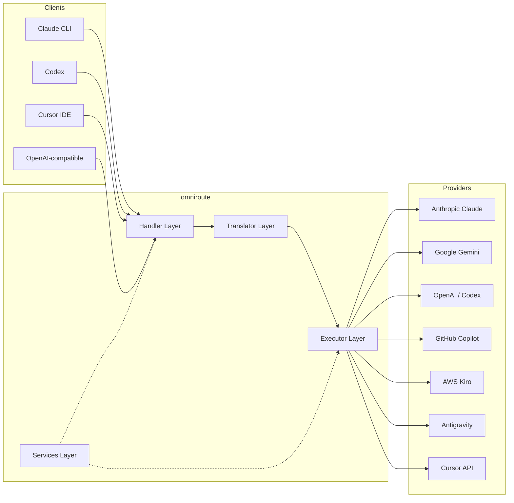
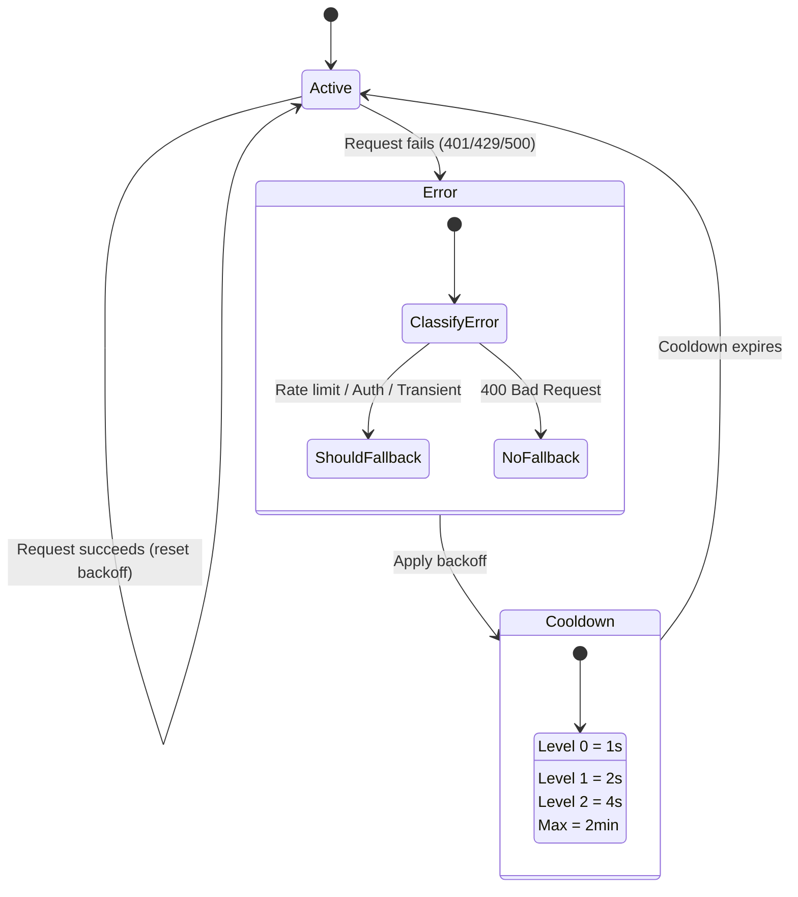
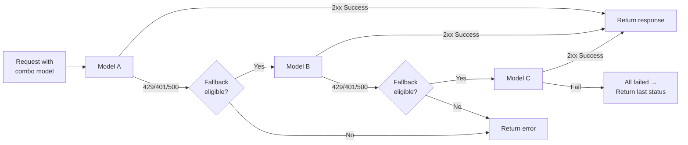
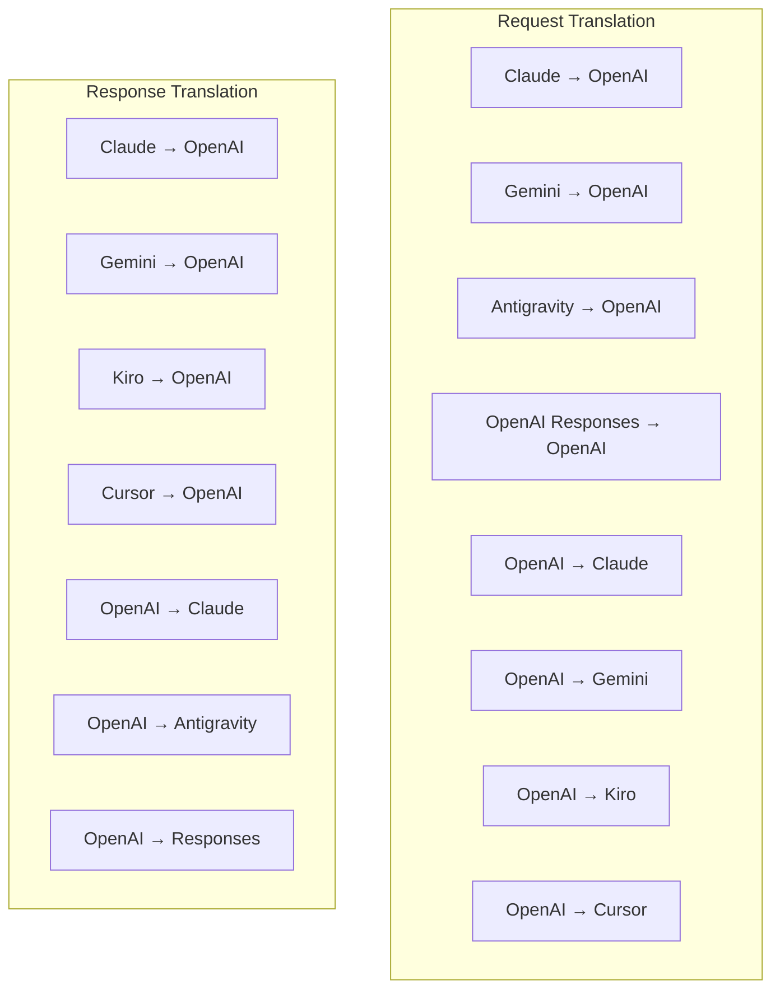
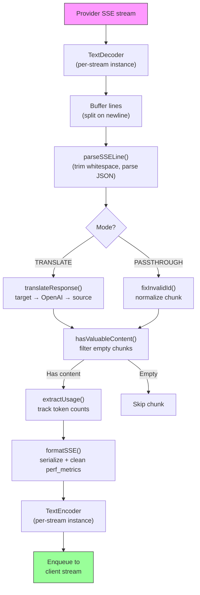
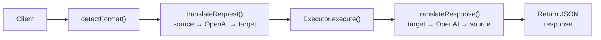
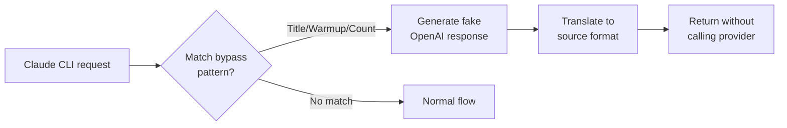

# omniroute — Codebase Documentation (Українська)

🌐 **Languages:** 🇺🇸 [English](../../../../docs/CODEBASE_DOCUMENTATION.md) · 🇪🇸 [es](../../es/docs/CODEBASE_DOCUMENTATION.md) · 🇫🇷 [fr](../../fr/docs/CODEBASE_DOCUMENTATION.md) · 🇩🇪 [de](../../de/docs/CODEBASE_DOCUMENTATION.md) · 🇮🇹 [it](../../it/docs/CODEBASE_DOCUMENTATION.md) · 🇷🇺 [ru](../../ru/docs/CODEBASE_DOCUMENTATION.md) · 🇨🇳 [zh-CN](../../zh-CN/docs/CODEBASE_DOCUMENTATION.md) · 🇯🇵 [ja](../../ja/docs/CODEBASE_DOCUMENTATION.md) · 🇰🇷 [ko](../../ko/docs/CODEBASE_DOCUMENTATION.md) · 🇸🇦 [ar](../../ar/docs/CODEBASE_DOCUMENTATION.md) · 🇮🇳 [hi](../../hi/docs/CODEBASE_DOCUMENTATION.md) · 🇮🇳 [in](../../in/docs/CODEBASE_DOCUMENTATION.md) · 🇹🇭 [th](../../th/docs/CODEBASE_DOCUMENTATION.md) · 🇻🇳 [vi](../../vi/docs/CODEBASE_DOCUMENTATION.md) · 🇮🇩 [id](../../id/docs/CODEBASE_DOCUMENTATION.md) · 🇲🇾 [ms](../../ms/docs/CODEBASE_DOCUMENTATION.md) · 🇳🇱 [nl](../../nl/docs/CODEBASE_DOCUMENTATION.md) · 🇵🇱 [pl](../../pl/docs/CODEBASE_DOCUMENTATION.md) · 🇸🇪 [sv](../../sv/docs/CODEBASE_DOCUMENTATION.md) · 🇳🇴 [no](../../no/docs/CODEBASE_DOCUMENTATION.md) · 🇩🇰 [da](../../da/docs/CODEBASE_DOCUMENTATION.md) · 🇫🇮 [fi](../../fi/docs/CODEBASE_DOCUMENTATION.md) · 🇵🇹 [pt](../../pt/docs/CODEBASE_DOCUMENTATION.md) · 🇷🇴 [ro](../../ro/docs/CODEBASE_DOCUMENTATION.md) · 🇭🇺 [hu](../../hu/docs/CODEBASE_DOCUMENTATION.md) · 🇧🇬 [bg](../../bg/docs/CODEBASE_DOCUMENTATION.md) · 🇸🇰 [sk](../../sk/docs/CODEBASE_DOCUMENTATION.md) · 🇺🇦 [uk-UA](../../uk-UA/docs/CODEBASE_DOCUMENTATION.md) · 🇮🇱 [he](../../he/docs/CODEBASE_DOCUMENTATION.md) · 🇵🇭 [phi](../../phi/docs/CODEBASE_DOCUMENTATION.md) · 🇧🇷 [pt-BR](../../pt-BR/docs/CODEBASE_DOCUMENTATION.md) · 🇨🇿 [cs](../../cs/docs/CODEBASE_DOCUMENTATION.md) · 🇹🇷 [tr](../../tr/docs/CODEBASE_DOCUMENTATION.md)

---

> Вичерпний, зручний для початківців посібник із**omniroute**багатопровайдерного проксі-маршрутизатора AI.---

## 1. What Is omniroute?

omniroute — це**проксі-маршрутизатор**, який знаходиться між клієнтами AI (Claude CLI, Codex, Cursor IDE тощо) та постачальниками AI (Anthropic, Google, OpenAI, AWS, GitHub тощо). Це вирішує одну велику проблему:

> **Різні клієнти ШІ розмовляють різними «мовами» (форматами API), і різні постачальники ШІ також очікують різних «мов».**omniroute автоматично перекладає між ними.

Думайте про це як про універсального перекладача в Організації Об’єднаних Націй — будь-який делегат може говорити будь-якою мовою, і перекладач перетворює її для будь-якого іншого делегата.---

## 2. Architecture Overview



### Core Principle: Hub-and-Spoke Translation

Усі трансляції форматів проходять через**формат OpenAI як центр**:```
Client Format → [OpenAI Hub] → Provider Format (request)
Provider Format → [OpenAI Hub] → Client Format (response)

```

Це означає, що вам потрібно лише**N перекладачів**(по одному на формат) замість**N²**(кожна пара).---

## 3. Project Structure

```

omniroute/
├── open-sse/ ← Core proxy library (portable, framework-agnostic)
│ ├── index.js ← Main entry point, exports everything
│ ├── config/ ← Configuration & constants
│ ├── executors/ ← Provider-specific request execution
│ ├── handlers/ ← Request handling orchestration
│ ├── services/ ← Business logic (auth, models, fallback, usage)
│ ├── translator/ ← Format translation engine
│ │ ├── request/ ← Request translators (8 files)
│ │ ├── response/ ← Response translators (7 files)
│ │ └── helpers/ ← Shared translation utilities (6 files)
│ └── utils/ ← Utility functions
├── src/ ← Application layer (Express/Worker runtime)
│ ├── app/ ← Web UI, API routes, middleware
│ ├── lib/ ← Database, auth, and shared library code
│ ├── mitm/ ← Man-in-the-middle proxy utilities
│ ├── models/ ← Database models
│ ├── shared/ ← Shared utilities (wrappers around open-sse)
│ ├── sse/ ← SSE endpoint handlers
│ └── store/ ← State management
├── data/ ← Runtime data (credentials, logs)
│ └── provider-credentials.json (external credentials override, gitignored)
└── tester/ ← Test utilities

````

---

## 4. Module-by-Module Breakdown

### 4.1 Config (`open-sse/config/`)

**Єдине джерело правди**для всіх конфігурацій постачальників.

| Файл | Призначення |
| ----------------------------- | ------------------------------------------------------------------------------------------------------------------------------------------------------------------ |
| `constants.ts` | Об’єкт «PROVIDERS» із базовими URL-адресами, обліковими даними OAuth (за замовчуванням), заголовками та системними підказками за замовчуванням для кожного постачальника. Також визначає `HTTP_STATUS`, `ERROR_TYPES`, `COOLDOWN_MS`, `BACKOFF_CONFIG` і `SKIP_PATTERNS`. |
| `credentialLoader.ts` | Завантажує зовнішні облікові дані з `data/provider-credentials.json` і об’єднує їх із жорстко запрограмованими параметрами за замовчуванням у `PROVIDERS`. Зберігає секрети поза контролем джерела, зберігаючи зворотну сумісність.               |
| `providerModels.ts` | Центральний реєстр моделей: псевдоніми постачальників карт → ідентифікатори моделей. Такі функції, як `getModels()`, `getProviderByAlias()`.                                                                                                          |
| `codexInstructions.ts` | Системні інструкції, введені в запити Codex (обмеження редагування, правила пісочниці, політики затвердження).                                                                                                                 |
| `defaultThinkingSignature.ts` | Стандартні «мислячі» підписи для моделей Claude і Gemini.                                                                                                                                                               |
| `ollamaModels.ts` | Визначення схеми для локальних моделей Ollama (назва, розмір, сімейство, квантування).                                                                                                                                             |#### Credential Loading Flow

```mermaid
flowchart TD
    A["App starts"] --> B["constants.ts defines PROVIDERS\nwith hardcoded defaults"]
    B --> C{"data/provider-credentials.json\nexists?"}
    C -->|Yes| D["credentialLoader reads JSON"]
    C -->|No| E["Use hardcoded defaults"]
    D --> F{"For each provider in JSON"}
    F --> G{"Provider exists\nin PROVIDERS?"}
    G -->|No| H["Log warning, skip"]
    G -->|Yes| I{"Value is object?"}
    I -->|No| J["Log warning, skip"]
    I -->|Yes| K["Merge clientId, clientSecret,\ntokenUrl, authUrl, refreshUrl"]
    K --> F
    H --> F
    J --> F
    F -->|Done| L["PROVIDERS ready with\nmerged credentials"]
    E --> L
````

---

### 4.2 Executors (`open-sse/executors/`)

Виконавці інкапсулюють**специфічну логіку постачальника**за допомогою**шаблону стратегії**. Кожен виконавець замінює базові методи за потреби.```mermaid
classDiagram
class BaseExecutor {
+buildUrl(model, stream, options)
+buildHeaders(credentials, stream, body)
+transformRequest(body, model, stream, credentials)
+execute(url, options)
+shouldRetry(status, error)
+refreshCredentials(credentials, log)
}

    class DefaultExecutor {
        +refreshCredentials()
    }

    class AntigravityExecutor {
        +buildUrl()
        +buildHeaders()
        +transformRequest()
        +shouldRetry()
        +refreshCredentials()
    }

    class CursorExecutor {
        +buildUrl()
        +buildHeaders()
        +transformRequest()
        +parseResponse()
        +generateChecksum()
    }

    class KiroExecutor {
        +buildUrl()
        +buildHeaders()
        +transformRequest()
        +parseEventStream()
        +refreshCredentials()
    }

    BaseExecutor <|-- DefaultExecutor
    BaseExecutor <|-- AntigravityExecutor
    BaseExecutor <|-- CursorExecutor
    BaseExecutor <|-- KiroExecutor
    BaseExecutor <|-- CodexExecutor
    BaseExecutor <|-- GeminiCLIExecutor
    BaseExecutor <|-- GithubExecutor

````

| Виконавець | Постачальник | Ключові спеціалізації |
| ---------------- | ---------------------------------------------- | ---------------------------------------------------------------------------------------------------------------------------------- |
| `base.ts` | — | Абстрактна база: створення URL-адреси, заголовки, логіка повтору, оновлення облікових даних |
| `default.ts` | Claude, Gemini, OpenAI, GLM, Kimi, MiniMax | Оновлення універсального маркера OAuth для стандартних постачальників |
| `antigravity.ts` | Google Cloud Code | Генерація ідентифікатора проекту/сеансу, резервна копія кількох URL-адрес, користувацький аналіз повторної спроби з повідомлень про помилку ("скинути через 2 год. 7 хв. 23 с.") |
| `cursor.ts` | Курсор IDE |**Найскладніше**: автентифікація контрольної суми SHA-256, кодування запиту Protobuf, двійковий EventStream → аналіз відповіді SSE |
| `codex.ts` | OpenAI Codex | Впроваджує системні інструкції, керує рівнями мислення, видаляє непідтримувані параметри |
| `gemini-cli.ts` | Google Gemini CLI | Створення спеціальної URL-адреси (`streamGenerateContent`), оновлення маркера Google OAuth |
| `github.ts` | Копілот GitHub | Подвійна система маркерів (GitHub OAuth + маркер Copilot), імітація заголовка VSCode |
| `kiro.ts` | AWS CodeWhisperer | Двійковий аналіз AWS EventStream, кадри подій AMZN, оцінка маркерів |
| `index.ts` | — | Фабрика: відображає ім’я постачальника → клас виконавця, із резервним варіантом за замовчуванням |---

### 4.3 Handlers (`open-sse/handlers/`)

**Рівень оркестровки**— координує переклад, виконання, потокове передавання та обробку помилок.

| Файл | Призначення |
| --------------------- | ----------------------------------------------------------------------------------------------------------------------------------------------------- |
| `chatCore.ts` |**Центральний оркестр**(~600 рядків). Обробляє повний життєвий цикл запиту: виявлення формату → переклад → відправка виконавця → потокова/непотокова відповідь → оновлення маркера → обробка помилок → журнал використання. |
| `responsesHandler.ts` | Адаптер для API відповідей OpenAI: перетворює формат відповідей → Завершення чату → надсилає до `chatCore` → перетворює SSE назад у формат відповідей.                                                                        |
| `embeddings.ts` | Обробник генерації вбудовування: розпізнає модель вбудовування → постачальник, надсилає до API постачальника, повертає відповідь на вбудовування, сумісну з OpenAI. Підтримує 6+ провайдерів.                                                    |
| `imageGeneration.ts` | Обробник генерації зображень: розпізнає модель зображення → постачальник, підтримує режими, сумісні з OpenAI, Gemini-image (Antigravity) і резервний (Nebius). Повертає base64 або URL-зображення.                                          |#### Request Lifecycle (chatCore.ts)

```mermaid
sequenceDiagram
    participant Client
    participant chatCore
    participant Translator
    participant Executor
    participant Provider

    Client->>chatCore: Request (any format)
    chatCore->>chatCore: Detect source format
    chatCore->>chatCore: Check bypass patterns
    chatCore->>chatCore: Resolve model & provider
    chatCore->>Translator: Translate request (source → OpenAI → target)
    chatCore->>Executor: Get executor for provider
    Executor->>Executor: Build URL, headers, transform request
    Executor->>Executor: Refresh credentials if needed
    Executor->>Provider: HTTP fetch (streaming or non-streaming)

    alt Streaming
        Provider-->>chatCore: SSE stream
        chatCore->>chatCore: Pipe through SSE transform stream
        Note over chatCore: Transform stream translates<br/>each chunk: target → OpenAI → source
        chatCore-->>Client: Translated SSE stream
    else Non-streaming
        Provider-->>chatCore: JSON response
        chatCore->>Translator: Translate response
        chatCore-->>Client: Translated JSON
    end

    alt Error (401, 429, 500...)
        chatCore->>Executor: Retry with credential refresh
        chatCore->>chatCore: Account fallback logic
    end
````

---

### 4.4 Services (`open-sse/services/`)

| Бізнес-логіка, яка підтримує обробники та виконавці. | File                                                                                                                                                                                                                                                                                                                                   | Purpose |
| ---------------------------------------------------- | -------------------------------------------------------------------------------------------------------------------------------------------------------------------------------------------------------------------------------------------------------------------------------------------------------------------------------------- | ------- |
| `provider.ts`                                        | **Format detection** (`detectFormat`): analyzes request body structure to identify Claude/OpenAI/Gemini/Antigravity/Responses formats (includes `max_tokens` heuristic for Claude). Also: URL building, header building, thinking config normalization. Supports `openai-compatible-*` and `anthropic-compatible-*` dynamic providers. |
| `model.ts`                                           | Model string parsing (`claude/model-name` → `{provider: "claude", model: "model-name"}`), alias resolution with collision detection, input sanitization (rejects path traversal/control chars), and model info resolution with async alias getter support.                                                                             |
| `accountFallback.ts`                                 | Rate-limit handling: exponential backoff (1s → 2s → 4s → max 2min), account cooldown management, error classification (which errors trigger fallback vs. not).                                                                                                                                                                         |
| `tokenRefresh.ts`                                    | OAuth token refresh for **every provider**: Google (Gemini, Antigravity), Claude, Codex, Qwen, Qoder, GitHub (OAuth + Copilot dual-token), Kiro (AWS SSO OIDC + Social Auth). Includes in-flight promise deduplication cache and retry with exponential backoff.                                                                       |
| `combo.ts`                                           | **Combo models**: chains of fallback models. If model A fails with a fallback-eligible error, try model B, then C, etc. Returns actual upstream status codes.                                                                                                                                                                          |
| `usage.ts`                                           | Fetches quota/usage data from provider APIs (GitHub Copilot quotas, Antigravity model quotas, Codex rate limits, Kiro usage breakdowns, Claude settings).                                                                                                                                                                              |
| `accountSelector.ts`                                 | Smart account selection with scoring algorithm: considers priority, health status, round-robin position, and cooldown state to pick the optimal account for each request.                                                                                                                                                              |
| `contextManager.ts`                                  | Request context lifecycle management: creates and tracks per-request context objects with metadata (request ID, timestamps, provider info) for debugging and logging.                                                                                                                                                                  |
| `ipFilter.ts`                                        | IP-based access control: supports allowlist and blocklist modes. Validates client IP against configured rules before processing API requests.                                                                                                                                                                                          |
| `sessionManager.ts`                                  | Session tracking with client fingerprinting: tracks active sessions using hashed client identifiers, monitors request counts, and provides session metrics.                                                                                                                                                                            |
| `signatureCache.ts`                                  | Request signature-based deduplication cache: prevents duplicate requests by caching recent request signatures and returning cached responses for identical requests within a time window.                                                                                                                                              |
| `systemPrompt.ts`                                    | Global system prompt injection: prepends or appends a configurable system prompt to all requests, with per-provider compatibility handling.                                                                                                                                                                                            |
| `thinkingBudget.ts`                                  | Reasoning token budget management: supports passthrough, auto (strip thinking config), custom (fixed budget), and adaptive (complexity-scaled) modes for controlling thinking/reasoning tokens.                                                                                                                                        |
| `wildcardRouter.ts`                                  | Wildcard model pattern routing: resolves wildcard patterns (e.g., `*/claude-*`) to concrete provider/model pairs based on availability and priority.                                                                                                                                                                                   |

#### Token Refresh Deduplication

```mermaid
sequenceDiagram
    participant R1 as Request 1
    participant R2 as Request 2
    participant Cache as refreshPromiseCache
    participant OAuth as OAuth Provider

    R1->>Cache: getAccessToken("gemini", token)
    Cache->>Cache: No in-flight promise
    Cache->>OAuth: Start refresh
    R2->>Cache: getAccessToken("gemini", token)
    Cache->>Cache: Found in-flight promise
    Cache-->>R2: Return existing promise
    OAuth-->>Cache: New access token
    Cache-->>R1: New access token
    Cache-->>R2: Same access token (shared)
    Cache->>Cache: Delete cache entry
```

#### Account Fallback State Machine



#### Combo Model Chain



---

### 4.5 Translator (`open-sse/translator/`)

**Механізм перекладу форматів**, який використовує систему плагінів із самореєстрацією.#### Архітектура



| Довідник     | Файли          | Опис                                                                                                                                                                                                                                                                                            |
| ------------ | -------------- | ----------------------------------------------------------------------------------------------------------------------------------------------------------------------------------------------------------------------------------------------------------------------------------------------- | ----------------------------------------- |
| `запит/`     | 8 перекладачів | Перетворюйте тіла запиту між форматами. Кожен файл самостійно реєструється за допомогою `register(from, to, fn)` під час імпорту.                                                                                                                                                               |
| `відповідь/` | 7 перекладачів | Перетворюйте фрагменти потокової відповіді між форматами. Обробляє типи подій SSE, блоки мислення, виклики інструментів.                                                                                                                                                                        |
| `помічники/` | 6 помічників   | Спільні утиліти: `claudeHelper` (вилучення системної підказки, конфігурація мислення), `geminiHelper` (відображення частин/вмісту), `openaiHelper` (фільтрування формату), `toolCallHelper` (генерація ідентифікатора, введення пропущеної відповіді), `maxTokensHelper`, `responsesApiHelper`. |
| `index.ts`   | —              | Механізм перекладу: `translateRequest()`, `translateResponse()`, управління станом, реєстр.                                                                                                                                                                                                     |
| `formats.ts` | —              | Константи формату: `OPENAI`, `CLAUDE`, `GEMINI`, `ANTIGRAVITY`, `KIRO`, `CURSOR`, `OPENAI_RESPONSES`.                                                                                                                                                                                           | #### Key Design: Self-Registering Plugins |

```javascript
// Each translator file calls register() on import:
import { register } from "../index.js";
register("claude", "openai", translateClaudeToOpenAI);

// The index.js imports all translator files, triggering registration:
import "./request/claude-to-openai.js"; // ← self-registers
```

---

### 4.6 Utils (`open-sse/utils/`)

| Файл               | Призначення                                                                                                                                                                                                                                                                                                            |
| ------------------ | ---------------------------------------------------------------------------------------------------------------------------------------------------------------------------------------------------------------------------------------------------------------------------------------------------------------------- | --------------------------- |
| `error.ts`         | Формування відповіді на помилку (формат, сумісний з OpenAI), синтаксичний аналіз помилок вгорі, вилучення часу повторної спроби Antigravity з повідомлень про помилки, потокова передача помилок SSE.                                                                                                                  |
| `stream.ts`        | **SSE Transform Stream**— основний потоковий конвеєр. Два режими: `TRANSLATE` (повноформатний переклад) і `PASSTHROUGH` (нормалізація + вилучення використання). Керується буферизацією фрагментів, оцінкою використання, відстеженням довжини вмісту. Екземпляри потокового кодера/декодера уникають спільного стану. |
| `streamHelpers.ts` | Утиліти SSE низького рівня: `parseSSELine` (толерантний до пробілів), `hasValuableContent` (фільтрує порожні блоки для OpenAI/Claude/Gemini), `fixInvalidId`, `formatSSE` (серіалізація SSE з урахуванням формату з очищенням `perf_metrics`).                                                                         |
| `usageTracking.ts` | Видалення використання маркерів із будь-якого формату (Claude/OpenAI/Gemini/Responses), оцінка з окремими співвідношеннями символів на маркер для інструментів/повідомлень, додавання буфера (2000 запасів маркерів), фільтрація полів для певного формату, консольне журналювання з кольорами ANSI.                   |
| `requestLogger.ts` | Legacy file-based request logging helper kept for compatibility. Current deployments should prefer `APP_LOG_TO_FILE` for application logs and the call log pipeline for persisted request artifacts.                                                                                                                   |
| `bypassHandler.ts` | Перехоплює певні шаблони від Claude CLI (вилучення заголовків, розминка, підрахунок) і повертає фальшиві відповіді без виклику жодного постачальника. Підтримує як потокове, так і не потокове. Навмисно обмежено областю CLI Claude.                                                                                  |
| `networkProxy.ts`  | Вирішує URL-адресу вихідного проксі-сервера для певного постачальника з пріоритетом: конфігурація для конкретного постачальника → глобальна конфігурація → змінні середовища (`HTTPS_PROXY`/`HTTP_PROXY`/`ALL_PROXY`). Підтримує виключення `NO_PROXY`. Кеш конфігурації на 30 с.                                      | #### SSE Streaming Pipeline |



#### Request Logger Session Structure

```
logs/
└── claude_gemini_claude-sonnet_20260208_143045/
    ├── 1_req_client.json      ← Raw client request
    ├── 2_req_source.json      ← After initial conversion
    ├── 3_req_openai.json      ← OpenAI intermediate format
    ├── 4_req_target.json      ← Final target format
    ├── 5_res_provider.txt     ← Provider SSE chunks (streaming)
    ├── 5_res_provider.json    ← Provider response (non-streaming)
    ├── 6_res_openai.txt       ← OpenAI intermediate chunks
    ├── 7_res_client.txt       ← Client-facing SSE chunks
    └── 6_error.json           ← Error details (if any)
```

---

### 4.7 Application Layer (`src/`)

| Довідник      | Призначення                                                                                                          |
| ------------- | -------------------------------------------------------------------------------------------------------------------- | ----------------------- |
| `src/app/`    | Веб-інтерфейс користувача, маршрути API, проміжне програмне забезпечення Express, обробники зворотних викликів OAuth |
| `src/lib/`    | Доступ до бази даних (`localDb.ts`, `usageDb.ts`), автентифікація, спільний                                          |
| `src/mitm/`   | Проксі-утиліти Man-in-the-middle для перехоплення трафіку провайдера                                                 |
| `src/models/` | Визначення моделі бази даних                                                                                         |
| `src/shared/` | Обгортки навколо функцій open-sse (провайдер, потік, помилка тощо)                                                   |
| `src/sse/`    | Обробники кінцевих точок SSE, які підключають бібліотеку open-sse до експрес-маршрутів                               |
| `src/store/`  | Застосування управління станом                                                                                       | #### Notable API Routes |

| Маршрут                                        | Методи          | Призначення                                                                                                |
| ---------------------------------------------- | --------------- | ---------------------------------------------------------------------------------------------------------- | --- |
| `/api/provider-models`                         | GET/POST/DELETE | CRUD для спеціальних моделей на постачальника                                                              |
| `/api/models/catalog`                          | ОТРИМАТИ        | Зведений каталог усіх моделей (чат, вбудовування, зображення, настроювання), згрупований за постачальником |
| `/api/settings/proxy`                          | GET/PUT/DELETE  | Ієрархічна вихідна конфігурація проксі (`global/providers/combos/keys`)                                    |
| `/api/settings/proxy/test`                     | Опублікувати    | Перевіряє підключення проксі та повертає загальнодоступну IP-адресу/затримку                               |
| `/v1/providers/[провайдер]/chat/completions`   | Опублікувати    | Спеціальне завершення чату для кожного постачальника з перевіркою моделі                                   |
| `/v1/providers/[провайдер]/embeddings`         | Опублікувати    | Спеціальне вбудовування для кожного постачальника з перевіркою моделі                                      |
| `/v1/providers/[провайдер]/images/generations` | Опублікувати    | Спеціальне створення зображень для кожного постачальника з перевіркою моделі                               |
| `/api/settings/ip-filter`                      | GET/PUT         | Керування списком дозволених/чорних IP-адрес                                                               |
| `/api/settings/thinking-budget`                | GET/PUT         | Конфігурація бюджету токена міркування (прохідний/автоматичний/спеціальний/адаптивний)                     |
| `/api/settings/system-prompt`                  | GET/PUT         | Глобальна системна підказка для всіх запитів                                                               |
| `/api/sessions`                                | ОТРИМАТИ        | Відстеження активної сесії та метрика                                                                      |
| `/api/rate-limits`                             | ОТРИМАТИ        | Статус обмеження ставки на обліковий запис                                                                 | --- |

## 5. Key Design Patterns

### 5.1 Hub-and-Spoke Translation

Усі формати перекладаються через**формат OpenAI як центр**. Додавання нового постачальника вимагає лише написання**однієї пари**перекладачів (до/з OpenAI), а не N пар.### 5.2 Executor Strategy Pattern

Кожен провайдер має спеціальний клас виконавця, успадкований від `BaseExecutor`. Фабрика в `executors/index.ts` вибирає правильний під час виконання.### 5.3 Self-Registering Plugin System

Модулі транслятора реєструються під час імпорту через `register()`. Додавання нового перекладача означає лише створення файлу та його імпорт.### 5.4 Account Fallback with Exponential Backoff

Коли постачальник повертає 429/401/500, система може перейти до наступного облікового запису, застосовуючи експоненціальне відновлення (1 с → 2 с → 4 с → макс. 2 хв).### 5.5 Combo Model Chains

"Combo" групує декілька рядків `provider/model`. Якщо перший не вдається, автоматично поверніться до наступного.### 5.6 Stateful Streaming Translation

Трансляція відповіді підтримує стан у блоках SSE (відстеження блоків мислення, накопичення викликів інструментів, індексація блоків вмісту) за допомогою механізму `initState()`.### 5.7 Usage Safety Buffer

Буфер на 2000 маркерів додається до звітів про використання, щоб запобігти перевищенню клієнтами обмежень вікон контексту через накладні витрати на системні підказки та переклад формату.---

## 6. Supported Formats

| Формат                 | Напрям         | Ідентифікатор      |
| ---------------------- | -------------- | ------------------ | --- |
| Завершення чату OpenAI | джерело + ціль | `опенай`           |
| OpenAI Responses API   | джерело + ціль | `openai-відповіді` |
| Антропний Клод         | джерело + ціль | `клод`             |
| Google Gemini          | джерело + ціль | `близнюки`         |
| Google Gemini CLI      | тільки мета    | `gemini-cli`       |
| Антигравітація         | джерело + ціль | `антигравітація`   |
| AWS Kiro               | тільки мета    | `kiro`             |
| Курсор                 | тільки мета    | `курсор`           | --- |

## 7. Supported Providers

| Постачальник             | Метод авторизації               | Виконавець       | Ключові примітки                                                          |
| ------------------------ | ------------------------------- | ---------------- | ------------------------------------------------------------------------- | --- |
| Антропний Клод           | Ключ API або OAuth              | За замовчуванням | Використовує заголовок `x-api-key`                                        |
| Google Gemini            | Ключ API або OAuth              | За замовчуванням | Використовує заголовок `x-goog-api-key`                                   |
| Google Gemini CLI        | OAuth                           | GeminiCLI        | Використовує кінцеву точку `streamGenerateContent`                        |
| Антигравітація           | OAuth                           | Антигравітація   | Резервний варіант із кількома URL-адресами, настроюваний повторний аналіз |
| OpenAI                   | Ключ API                        | За замовчуванням | Автентифікація стандартного носія                                         |
| Кодекс                   | OAuth                           | Кодекс           | Впроваджує системні інструкції, керує мисленням                           |
| Копілот GitHub           | OAuth + маркер Copilot          | Github           | Подвійний маркер, імітація заголовка VSCode                               |
| Кіро (AWS)               | AWS SSO OIDC або Social         | Кіро             | Розбір двійкового потоку подій                                            |
| Курсор IDE               | Аутентифікація контрольної суми | Курсор           | Кодування Protobuf, контрольні суми SHA-256                               |
| Квен                     | OAuth                           | За замовчуванням | Стандартна авторизація                                                    |
| Qoder                    | OAuth (базовий + носій)         | За замовчуванням | Заголовок подвійної авторизації                                           |
| OpenRouter               | Ключ API                        | За замовчуванням | Автентифікація стандартного носія                                         |
| GLM, Kimi, MiniMax       | Ключ API                        | За замовчуванням | Claude-сумісний, використовуйте `x-api-key`                               |
| `openai-compatible-*`    | Ключ API                        | За замовчуванням | Динамічний: будь-яка кінцева точка, сумісна з OpenAI                      |
| `anthropic-compatible-*` | Ключ API                        | За замовчуванням | Динамічний: будь-яка Claude-сумісна кінцева точка                         | --- |

## 8. Data Flow Summary

### Streaming Request

```mermaid
flowchart LR
    A["Client"] --> B["detectFormat()"]
    B --> C["translateRequest()\nsource → OpenAI → target"]
    C --> D["Executor\nbuildUrl + buildHeaders"]
    D --> E["fetch(providerURL)"]
    E --> F["createSSEStream()\nTRANSLATE mode"]
    F --> G["parseSSELine()"]
    G --> H["translateResponse()\ntarget → OpenAI → source"]
    H --> I["extractUsage()\n+ addBuffer"]
    I --> J["formatSSE()"]
    J --> K["Client receives\ntranslated SSE"]
    K --> L["logUsage()\nsaveRequestUsage()"]
```



### Non-Streaming Request



### Bypass Flow (Claude CLI)


