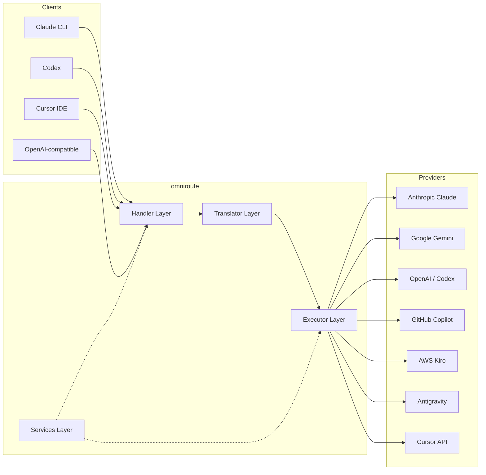
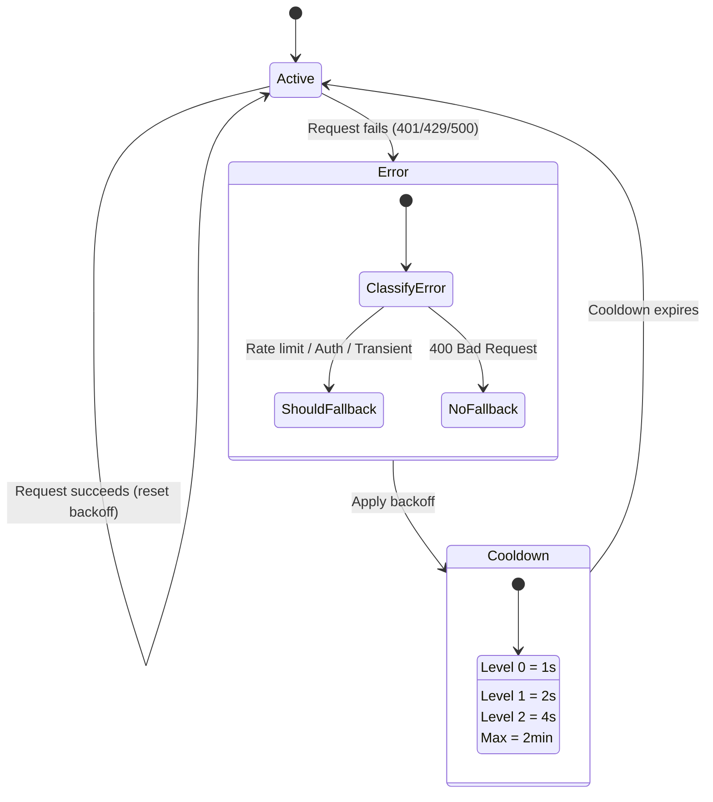
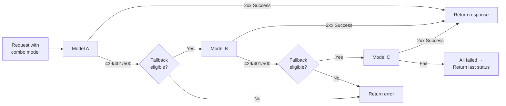
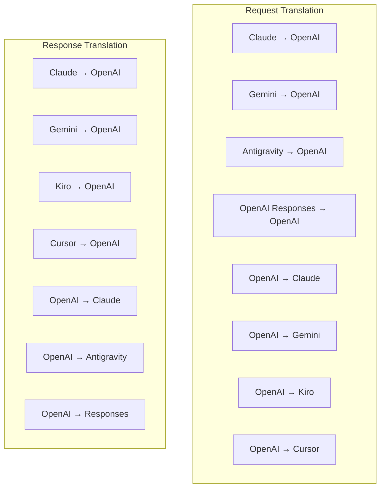
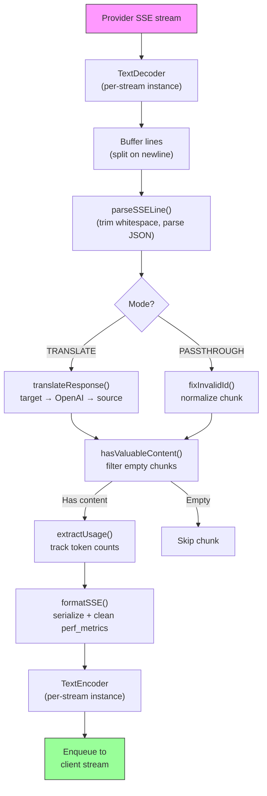
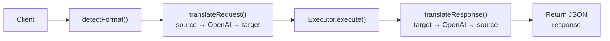
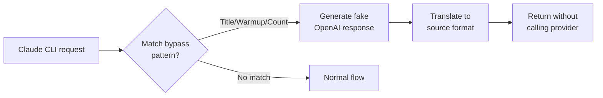

# omniroute — Codebase Documentation (Tiếng Việt)

🌐 **Languages:** 🇺🇸 [English](../../../../docs/CODEBASE_DOCUMENTATION.md) · 🇪🇸 [es](../../es/docs/CODEBASE_DOCUMENTATION.md) · 🇫🇷 [fr](../../fr/docs/CODEBASE_DOCUMENTATION.md) · 🇩🇪 [de](../../de/docs/CODEBASE_DOCUMENTATION.md) · 🇮🇹 [it](../../it/docs/CODEBASE_DOCUMENTATION.md) · 🇷🇺 [ru](../../ru/docs/CODEBASE_DOCUMENTATION.md) · 🇨🇳 [zh-CN](../../zh-CN/docs/CODEBASE_DOCUMENTATION.md) · 🇯🇵 [ja](../../ja/docs/CODEBASE_DOCUMENTATION.md) · 🇰🇷 [ko](../../ko/docs/CODEBASE_DOCUMENTATION.md) · 🇸🇦 [ar](../../ar/docs/CODEBASE_DOCUMENTATION.md) · 🇮🇳 [hi](../../hi/docs/CODEBASE_DOCUMENTATION.md) · 🇮🇳 [in](../../in/docs/CODEBASE_DOCUMENTATION.md) · 🇹🇭 [th](../../th/docs/CODEBASE_DOCUMENTATION.md) · 🇻🇳 [vi](../../vi/docs/CODEBASE_DOCUMENTATION.md) · 🇮🇩 [id](../../id/docs/CODEBASE_DOCUMENTATION.md) · 🇲🇾 [ms](../../ms/docs/CODEBASE_DOCUMENTATION.md) · 🇳🇱 [nl](../../nl/docs/CODEBASE_DOCUMENTATION.md) · 🇵🇱 [pl](../../pl/docs/CODEBASE_DOCUMENTATION.md) · 🇸🇪 [sv](../../sv/docs/CODEBASE_DOCUMENTATION.md) · 🇳🇴 [no](../../no/docs/CODEBASE_DOCUMENTATION.md) · 🇩🇰 [da](../../da/docs/CODEBASE_DOCUMENTATION.md) · 🇫🇮 [fi](../../fi/docs/CODEBASE_DOCUMENTATION.md) · 🇵🇹 [pt](../../pt/docs/CODEBASE_DOCUMENTATION.md) · 🇷🇴 [ro](../../ro/docs/CODEBASE_DOCUMENTATION.md) · 🇭🇺 [hu](../../hu/docs/CODEBASE_DOCUMENTATION.md) · 🇧🇬 [bg](../../bg/docs/CODEBASE_DOCUMENTATION.md) · 🇸🇰 [sk](../../sk/docs/CODEBASE_DOCUMENTATION.md) · 🇺🇦 [uk-UA](../../uk-UA/docs/CODEBASE_DOCUMENTATION.md) · 🇮🇱 [he](../../he/docs/CODEBASE_DOCUMENTATION.md) · 🇵🇭 [phi](../../phi/docs/CODEBASE_DOCUMENTATION.md) · 🇧🇷 [pt-BR](../../pt-BR/docs/CODEBASE_DOCUMENTATION.md) · 🇨🇿 [cs](../../cs/docs/CODEBASE_DOCUMENTATION.md) · 🇹🇷 [tr](../../tr/docs/CODEBASE_DOCUMENTATION.md)

---

> Hướng dẫn toàn diện, thân thiện với người mới bắt đầu về bộ định tuyến proxy AI đa nhà cung cấp**omnroute**.---

## 1. What Is omniroute?

omniroute là**bộ định tuyến proxy**nằm giữa các máy khách AI (Claude CLI, Codex, Cursor IDE, v.v.) và các nhà cung cấp AI (Anthropic, Google, OpenAI, AWS, GitHub, v.v.). Nó giải quyết một vấn đề lớn:

> **Các ứng dụng khách AI khác nhau nói những "ngôn ngữ" (định dạng API) khác nhau và các nhà cung cấp AI khác nhau cũng mong đợi những "ngôn ngữ" khác nhau.**omniroute dịch tự động giữa chúng.

Hãy nghĩ về nó giống như một dịch giả phổ quát tại Liên hợp quốc - bất kỳ đại biểu nào cũng có thể nói bất kỳ ngôn ngữ nào và người phiên dịch sẽ chuyển đổi ngôn ngữ đó cho bất kỳ đại biểu nào khác.---

## 2. Architecture Overview



### Core Principle: Hub-and-Spoke Translation

Tất cả các bản dịch định dạng đều đi qua**định dạng OpenAI làm trung tâm**:```
Client Format → [OpenAI Hub] → Provider Format (request)
Provider Format → [OpenAI Hub] → Client Format (response)

```

Điều này có nghĩa là bạn chỉ cần**N người dịch**(một người cho mỗi định dạng) thay vì**N²**(mỗi cặp).---

## 3. Project Structure

```

omniroute/
├── open-sse/ ← Core proxy library (portable, framework-agnostic)
│ ├── index.js ← Main entry point, exports everything
│ ├── config/ ← Configuration & constants
│ ├── executors/ ← Provider-specific request execution
│ ├── handlers/ ← Request handling orchestration
│ ├── services/ ← Business logic (auth, models, fallback, usage)
│ ├── translator/ ← Format translation engine
│ │ ├── request/ ← Request translators (8 files)
│ │ ├── response/ ← Response translators (7 files)
│ │ └── helpers/ ← Shared translation utilities (6 files)
│ └── utils/ ← Utility functions
├── src/ ← Application layer (Express/Worker runtime)
│ ├── app/ ← Web UI, API routes, middleware
│ ├── lib/ ← Database, auth, and shared library code
│ ├── mitm/ ← Man-in-the-middle proxy utilities
│ ├── models/ ← Database models
│ ├── shared/ ← Shared utilities (wrappers around open-sse)
│ ├── sse/ ← SSE endpoint handlers
│ └── store/ ← State management
├── data/ ← Runtime data (credentials, logs)
│ └── provider-credentials.json (external credentials override, gitignored)
└── tester/ ← Test utilities

````

---

## 4. Module-by-Module Breakdown

### 4.1 Config (`open-sse/config/`)

**nguồn tin cậy duy nhất**cho tất cả cấu hình của nhà cung cấp.

| Tập tin | Mục đích |
| ----------------------------- | ----------------------------------------------------------------------------------------------------------------------------------------------------------------------------------------------------------------------------------------- |
| `hằng.ts` | Đối tượng `PROVIDERS` có URL cơ sở, thông tin xác thực OAuth (mặc định), tiêu đề và lời nhắc hệ thống mặc định cho mọi nhà cung cấp. Đồng thời xác định `HTTP_STATUS`, `ERROR_TYPES`, `COOLDOWN_MS`, `BACKOFF_CONFIG` và `SKIP_PATTERNS`. |
| `credentialLoader.ts` | Tải thông tin xác thực bên ngoài từ `data/provider-credentials.json` và hợp nhất chúng theo các giá trị mặc định được mã hóa cứng trong `PROVIDERS`. Giữ bí mật ngoài tầm kiểm soát nguồn trong khi vẫn duy trì khả năng tương thích ngược.               |
| `nhà cung cấpModels.ts` | Cơ quan đăng ký mô hình trung tâm: bí danh của nhà cung cấp bản đồ → ID mô hình. Các hàm như `getModels()`, `getProviderByAlias()`.                                                                                                          |
| `codexInstructions.ts` | Hướng dẫn hệ thống được đưa vào các yêu cầu Codex (chỉnh sửa các ràng buộc, quy tắc hộp cát, chính sách phê duyệt).                                                                                                                 |
| `defaultThinkingSignature.ts` | Chữ ký "suy nghĩ" mặc định cho mô hình Claude và Gemini.                                                                                                                                                               |
| `ollamaModels.ts` | Định nghĩa lược đồ cho các mô hình Ollama cục bộ (tên, kích thước, họ, lượng tử hóa).                                                                                                                                             |#### Credential Loading Flow

```mermaid
flowchart TD
    A["App starts"] --> B["constants.ts defines PROVIDERS\nwith hardcoded defaults"]
    B --> C{"data/provider-credentials.json\nexists?"}
    C -->|Yes| D["credentialLoader reads JSON"]
    C -->|No| E["Use hardcoded defaults"]
    D --> F{"For each provider in JSON"}
    F --> G{"Provider exists\nin PROVIDERS?"}
    G -->|No| H["Log warning, skip"]
    G -->|Yes| I{"Value is object?"}
    I -->|No| J["Log warning, skip"]
    I -->|Yes| K["Merge clientId, clientSecret,\ntokenUrl, authUrl, refreshUrl"]
    K --> F
    H --> F
    J --> F
    F -->|Done| L["PROVIDERS ready with\nmerged credentials"]
    E --> L
````

---

### 4.2 Executors (`open-sse/executors/`)

Người thực thi gói gọn**logic dành riêng cho nhà cung cấp**bằng cách sử dụng**Mẫu chiến lược**. Mỗi người thi hành ghi đè các phương thức cơ bản nếu cần.```mermaid
classDiagram
class BaseExecutor {
+buildUrl(model, stream, options)
+buildHeaders(credentials, stream, body)
+transformRequest(body, model, stream, credentials)
+execute(url, options)
+shouldRetry(status, error)
+refreshCredentials(credentials, log)
}

    class DefaultExecutor {
        +refreshCredentials()
    }

    class AntigravityExecutor {
        +buildUrl()
        +buildHeaders()
        +transformRequest()
        +shouldRetry()
        +refreshCredentials()
    }

    class CursorExecutor {
        +buildUrl()
        +buildHeaders()
        +transformRequest()
        +parseResponse()
        +generateChecksum()
    }

    class KiroExecutor {
        +buildUrl()
        +buildHeaders()
        +transformRequest()
        +parseEventStream()
        +refreshCredentials()
    }

    BaseExecutor <|-- DefaultExecutor
    BaseExecutor <|-- AntigravityExecutor
    BaseExecutor <|-- CursorExecutor
    BaseExecutor <|-- KiroExecutor
    BaseExecutor <|-- CodexExecutor
    BaseExecutor <|-- GeminiCLIExecutor
    BaseExecutor <|-- GithubExecutor

````

| Người thi hành | Nhà cung cấp | Chuyên ngành chính |
| ---------------- | ------------------------------------------ | ----------------------------------------------------------------------------------------------------------------------------------- |
| `cơ sở.ts` | — | Cơ sở trừu tượng: Xây dựng URL, tiêu đề, logic thử lại, làm mới thông tin xác thực |
| `mặc định.ts` | Claude, Song Tử, OpenAI, GLM, Kimi, MiniMax | Làm mới mã thông báo OAuth chung cho các nhà cung cấp tiêu chuẩn |
| `phản trọng lực.ts` | Mã đám mây của Google | Tạo ID dự án/phiên, dự phòng nhiều URL, phân tích cú pháp thử lại tùy chỉnh từ thông báo lỗi ("đặt lại sau 2h7m23 giây") |
| `con trỏ.ts` | IDE con trỏ |**Phức tạp nhất**: Xác thực tổng kiểm tra SHA-256, mã hóa yêu cầu Protobuf, EventStream nhị phân → phân tích cú pháp phản hồi SSE |
| `codex.ts` | OpenAI Codex | Đưa vào các hướng dẫn hệ thống, quản lý các cấp độ tư duy, loại bỏ các tham số không được hỗ trợ |
| `gemini-cli.ts` | Google Song Tử CLI | Xây dựng URL tùy chỉnh (`streamGenerateContent`), làm mới mã thông báo Google OAuth |
| `github.ts` | Phi công phụ GitHub | Hệ thống mã thông báo kép (GitHub OAuth + mã thông báo Copilot), bắt chước tiêu đề VSCode |
| `kiro.ts` | AWS CodeWhisperer | Phân tích cú pháp nhị phân AWS EventStream, khung sự kiện AMZN, ước tính mã thông báo |
| `index.ts` | — | Nhà máy: tên nhà cung cấp bản đồ → lớp người thực thi, với dự phòng mặc định |---

### 4.3 Handlers (`open-sse/handlers/`)

**Lớp điều phối**— điều phối việc dịch, thực thi, phát trực tuyến và xử lý lỗi.

| Tập tin | Mục đích |
| --------------------- | -------------------------------------------------------------------------------------------------------------------------------------------------------------------------------------------------------------------------------------- |
| `chatCore.ts` |**Dàn nhạc trung tâm**(~600 dòng). Xử lý vòng đời yêu cầu hoàn chỉnh: phát hiện định dạng → dịch → gửi người thực thi → phản hồi truyền trực tuyến/không truyền phát → làm mới mã thông báo → xử lý lỗi → ghi nhật ký sử dụng. |
| `responseHandler.ts` | Bộ điều hợp cho API phản hồi của OpenAI: chuyển đổi định dạng Phản hồi → Hoàn thành cuộc trò chuyện → gửi tới `chatCore` → chuyển đổi SSE trở lại định dạng Phản hồi.                                                                        |
| `nhúng.ts` | Trình xử lý tạo nhúng: giải quyết mô hình nhúng → nhà cung cấp, gửi tới API của nhà cung cấp, trả về phản hồi nhúng tương thích với OpenAI. Hỗ trợ hơn 6 nhà cung cấp.                                                    |
| `imageGeneration.ts` | Trình xử lý tạo hình ảnh: phân giải mô hình hình ảnh → nhà cung cấp, hỗ trợ các chế độ tương thích với OpenAI, hình ảnh Gemini (Chống trọng lực) và dự phòng (Nebius). Trả về hình ảnh base64 hoặc URL.                                          |#### Request Lifecycle (chatCore.ts)

```mermaid
sequenceDiagram
    participant Client
    participant chatCore
    participant Translator
    participant Executor
    participant Provider

    Client->>chatCore: Request (any format)
    chatCore->>chatCore: Detect source format
    chatCore->>chatCore: Check bypass patterns
    chatCore->>chatCore: Resolve model & provider
    chatCore->>Translator: Translate request (source → OpenAI → target)
    chatCore->>Executor: Get executor for provider
    Executor->>Executor: Build URL, headers, transform request
    Executor->>Executor: Refresh credentials if needed
    Executor->>Provider: HTTP fetch (streaming or non-streaming)

    alt Streaming
        Provider-->>chatCore: SSE stream
        chatCore->>chatCore: Pipe through SSE transform stream
        Note over chatCore: Transform stream translates<br/>each chunk: target → OpenAI → source
        chatCore-->>Client: Translated SSE stream
    else Non-streaming
        Provider-->>chatCore: JSON response
        chatCore->>Translator: Translate response
        chatCore-->>Client: Translated JSON
    end

    alt Error (401, 429, 500...)
        chatCore->>Executor: Retry with credential refresh
        chatCore->>chatCore: Account fallback logic
    end
````

---

### 4.4 Services (`open-sse/services/`)

| Logic nghiệp vụ hỗ trợ các trình xử lý và thực thi. | File                                                                                                                                                                                                                                                                                                                                   | Purpose |
| --------------------------------------------------- | -------------------------------------------------------------------------------------------------------------------------------------------------------------------------------------------------------------------------------------------------------------------------------------------------------------------------------------- | ------- |
| `provider.ts`                                       | **Format detection** (`detectFormat`): analyzes request body structure to identify Claude/OpenAI/Gemini/Antigravity/Responses formats (includes `max_tokens` heuristic for Claude). Also: URL building, header building, thinking config normalization. Supports `openai-compatible-*` and `anthropic-compatible-*` dynamic providers. |
| `model.ts`                                          | Model string parsing (`claude/model-name` → `{provider: "claude", model: "model-name"}`), alias resolution with collision detection, input sanitization (rejects path traversal/control chars), and model info resolution with async alias getter support.                                                                             |
| `accountFallback.ts`                                | Rate-limit handling: exponential backoff (1s → 2s → 4s → max 2min), account cooldown management, error classification (which errors trigger fallback vs. not).                                                                                                                                                                         |
| `tokenRefresh.ts`                                   | OAuth token refresh for **every provider**: Google (Gemini, Antigravity), Claude, Codex, Qwen, Qoder, GitHub (OAuth + Copilot dual-token), Kiro (AWS SSO OIDC + Social Auth). Includes in-flight promise deduplication cache and retry with exponential backoff.                                                                       |
| `combo.ts`                                          | **Combo models**: chains of fallback models. If model A fails with a fallback-eligible error, try model B, then C, etc. Returns actual upstream status codes.                                                                                                                                                                          |
| `usage.ts`                                          | Fetches quota/usage data from provider APIs (GitHub Copilot quotas, Antigravity model quotas, Codex rate limits, Kiro usage breakdowns, Claude settings).                                                                                                                                                                              |
| `accountSelector.ts`                                | Smart account selection with scoring algorithm: considers priority, health status, round-robin position, and cooldown state to pick the optimal account for each request.                                                                                                                                                              |
| `contextManager.ts`                                 | Request context lifecycle management: creates and tracks per-request context objects with metadata (request ID, timestamps, provider info) for debugging and logging.                                                                                                                                                                  |
| `ipFilter.ts`                                       | IP-based access control: supports allowlist and blocklist modes. Validates client IP against configured rules before processing API requests.                                                                                                                                                                                          |
| `sessionManager.ts`                                 | Session tracking with client fingerprinting: tracks active sessions using hashed client identifiers, monitors request counts, and provides session metrics.                                                                                                                                                                            |
| `signatureCache.ts`                                 | Request signature-based deduplication cache: prevents duplicate requests by caching recent request signatures and returning cached responses for identical requests within a time window.                                                                                                                                              |
| `systemPrompt.ts`                                   | Global system prompt injection: prepends or appends a configurable system prompt to all requests, with per-provider compatibility handling.                                                                                                                                                                                            |
| `thinkingBudget.ts`                                 | Reasoning token budget management: supports passthrough, auto (strip thinking config), custom (fixed budget), and adaptive (complexity-scaled) modes for controlling thinking/reasoning tokens.                                                                                                                                        |
| `wildcardRouter.ts`                                 | Wildcard model pattern routing: resolves wildcard patterns (e.g., `*/claude-*`) to concrete provider/model pairs based on availability and priority.                                                                                                                                                                                   |

#### Token Refresh Deduplication

```mermaid
sequenceDiagram
    participant R1 as Request 1
    participant R2 as Request 2
    participant Cache as refreshPromiseCache
    participant OAuth as OAuth Provider

    R1->>Cache: getAccessToken("gemini", token)
    Cache->>Cache: No in-flight promise
    Cache->>OAuth: Start refresh
    R2->>Cache: getAccessToken("gemini", token)
    Cache->>Cache: Found in-flight promise
    Cache-->>R2: Return existing promise
    OAuth-->>Cache: New access token
    Cache-->>R1: New access token
    Cache-->>R2: Same access token (shared)
    Cache->>Cache: Delete cache entry
```

#### Account Fallback State Machine



#### Combo Model Chain



---

### 4.5 Translator (`open-sse/translator/`)

**Công cụ dịch định dạng**sử dụng hệ thống plugin tự đăng ký.#### Kiến trúc



| Thư mục          | Tập tin           | Mô tả                                                                                                                                                                                                                                                                |
| ---------------- | ----------------- | -------------------------------------------------------------------------------------------------------------------------------------------------------------------------------------------------------------------------------------------------------------------- | ----------------------------------------- |
| `yêu cầu/`       | 8 dịch giả        | Chuyển đổi nội dung yêu cầu giữa các định dạng. Mỗi tệp tự đăng ký thông qua `register(from, to, fn)` khi nhập.                                                                                                                                                      |
| `phản hồi/`      | 7 dịch giả        | Chuyển đổi các đoạn phản hồi phát trực tuyến giữa các định dạng. Xử lý các loại sự kiện SSE, khối suy nghĩ, lệnh gọi công cụ.                                                                                                                                        |
| `người giúp đỡ/` | 6 người giúp việc | Các tiện ích được chia sẻ: `claudeHelper` (trích xuất lời nhắc hệ thống, cấu hình tư duy), `geminiHelper` (ánh xạ các bộ phận/nội dung), `openaiHelper` (lọc định dạng), `toolCallHelper` (tạo ID, chèn phản hồi bị thiếu), `maxTokensHelper`, `responsesApiHelper`. |
| `index.ts`       | —                 | Công cụ dịch thuật: `translateRequest()`, `translateResponse()`, quản lý trạng thái, đăng ký.                                                                                                                                                                        |
| `format.ts`      | —                 | Các hằng định dạng: `OPENAI`, `CLAUDE`, `GEMINI`, `ANTIGRAVITY`, `KIRO`, `CURSOR`, `OPENAI_RESPONSES`.                                                                                                                                                               | #### Key Design: Self-Registering Plugins |

```javascript
// Each translator file calls register() on import:
import { register } from "../index.js";
register("claude", "openai", translateClaudeToOpenAI);

// The index.js imports all translator files, triggering registration:
import "./request/claude-to-openai.js"; // ← self-registers
```

---

### 4.6 Utils (`open-sse/utils/`)

| Tập tin | Mục đích |
| ------------------ | -------------------------------------------------------------------------------------------------------------------------------------------------------------------------------------------------------------------------------------------------------------------------------------------------------------------| |
| `lỗi.ts` | Xây dựng phản hồi lỗi (định dạng tương thích với OpenAI), phân tích lỗi ngược dòng, trích xuất thời gian thử lại AntiGravity từ các thông báo lỗi, phát trực tuyến lỗi SSE. |
| `stream.ts` |**SSE Transform Stream**— đường truyền phát trực tuyến cốt lõi. Hai chế độ: `TRANSLATE` (dịch định dạng đầy đủ) và `PASSTHROUGH` (bình thường hóa + trích xuất sử dụng). Xử lý việc lưu vào bộ đệm, ước tính mức sử dụng, theo dõi độ dài nội dung. Các phiên bản bộ mã hóa/giải mã mỗi luồng tránh trạng thái chia sẻ. |
| `streamHelpers.ts` | Các tiện ích SSE cấp thấp: `parseSSELine` (có khả năng chịu khoảng trắng), `hasValuableContent` (lọc các đoạn trống cho OpenAI/Claude/Gemini), `fixInvalidId`, `formatSSE` (xê-ri hóa SSE nhận biết định dạng với tính năng dọn dẹp `perf_metrics`). |
| `usageTracking.ts` | Trích xuất mức sử dụng mã thông báo từ bất kỳ định dạng nào (Claude/OpenAI/Gemini/Responses), ước tính với tỷ lệ ký tự trên mỗi mã thông báo của công cụ/thông báo riêng biệt, bổ sung bộ đệm (giới hạn an toàn 2000 mã thông báo), lọc trường theo định dạng cụ thể, ghi nhật ký bảng điều khiển với màu ANSI. |
| `requestLogger.ts` | Legacy file-based request logging helper kept for compatibility. Current deployments should prefer `APP_LOG_TO_FILE` for application logs and the call log pipeline for persisted request artifacts. |
| `bypassHandler.ts` | Chặn các mẫu cụ thể từ Claude CLI (trích xuất tiêu đề, khởi động, đếm) và trả về các phản hồi giả mạo mà không cần gọi cho bất kỳ nhà cung cấp nào. Hỗ trợ cả phát trực tuyến và không phát trực tuyến. Cố ý giới hạn trong phạm vi Claude CLI. |
| `mạngProxy.ts` | Phân giải URL proxy gửi đi cho một nhà cung cấp nhất định với mức độ ưu tiên: cấu hình dành riêng cho nhà cung cấp → cấu hình chung → biến môi trường (`HTTPS_PROXY`/`HTTP_PROXY`/`ALL_PROXY`). Hỗ trợ loại trừ `NO_PROXY`. Cấu hình bộ nhớ đệm trong 30 giây. |#### SSE Streaming Pipeline



#### Request Logger Session Structure

```
logs/
└── claude_gemini_claude-sonnet_20260208_143045/
    ├── 1_req_client.json      ← Raw client request
    ├── 2_req_source.json      ← After initial conversion
    ├── 3_req_openai.json      ← OpenAI intermediate format
    ├── 4_req_target.json      ← Final target format
    ├── 5_res_provider.txt     ← Provider SSE chunks (streaming)
    ├── 5_res_provider.json    ← Provider response (non-streaming)
    ├── 6_res_openai.txt       ← OpenAI intermediate chunks
    ├── 7_res_client.txt       ← Client-facing SSE chunks
    └── 6_error.json           ← Error details (if any)
```

---

### 4.7 Application Layer (`src/`)

| Thư mục         | Mục đích                                                                                    |
| --------------- | ------------------------------------------------------------------------------------------- | ----------------------- |
| `src/ứng dụng/` | Giao diện người dùng web, tuyến API, phần mềm trung gian Express, trình xử lý gọi lại OAuth |
| `src/lib/`      | Truy cập cơ sở dữ liệu (`localDb.ts`, `usageDb.ts`), xác thực, chia sẻ                      |
| `src/mitm/`     | Tiện ích proxy trung gian để chặn lưu lượng truy cập của nhà cung cấp                       |
| `src/model/`    | Định nghĩa mô hình cơ sở dữ liệu                                                            |
| `src/shared/`   | Trình bao bọc xung quanh các hàm open-sse (nhà cung cấp, luồng, lỗi, v.v.)                  |
| `src/sse/`      | Trình xử lý điểm cuối SSE kết nối thư viện open-sse với các tuyến Express                   |
| `src/cửa hàng/` | Quản lý trạng thái ứng dụng                                                                 | #### Notable API Routes |

| Tuyến đường                                 | Phương pháp   | Mục đích                                                                                                      |
| ------------------------------------------- | ------------- | ------------------------------------------------------------------------------------------------------------- | --- |
| `/api/nhà cung cấp-model`                   | NHẬN/ĐĂNG/XÓA | CRUD cho các mô hình tùy chỉnh cho mỗi nhà cung cấp                                                           |
| `/api/model/catalog`                        | NHẬN          | Danh mục tổng hợp của tất cả các mô hình (trò chuyện, nhúng, hình ảnh, tùy chỉnh) được nhóm theo nhà cung cấp |
| `/api/settings/proxy`                       | NHẬN/ĐẶT/XÓA  | Hierarchical outbound proxy configuration (`global/providers/combos/keys`)                                    |
| `/api/settings/proxy/test`                  | ĐĂNG          | Xác thực kết nối proxy và trả về IP công cộng/độ trễ                                                          |
| `/v1/providers/[provider]/chat/completions` | ĐĂNG          | Hoàn thành trò chuyện dành riêng cho mỗi nhà cung cấp với xác thực mô hình                                    |
| `/v1/providers/[nhà cung cấp]/embeddings`   | ĐĂNG          | Phần nhúng dành riêng cho mỗi nhà cung cấp với xác thực mô hình                                               |
| `/v1/providers/[provider]/images/thế hệ`    | ĐĂNG          | Tạo hình ảnh chuyên dụng cho mỗi nhà cung cấp với xác thực mô hình                                            |
| `/api/settings/ip-filter`                   | NHẬN/ĐẶT      | Quản lý danh sách chặn/danh sách IP cho phép                                                                  |
| `/api/settings/thinking-budget`             | NHẬN/ĐẶT      | Cấu hình ngân sách mã thông báo hợp lý (chuyển qua/tự động/tùy chỉnh/thích ứng)                               |
| `/api/settings/system-prompt`               | NHẬN/ĐẶT      | Hệ thống nhắc nhở toàn cầu cho tất cả các yêu cầu                                                             |
| `/api/phiên`                                | NHẬN          | Theo dõi và đo lường phiên hoạt động                                                                          |
| `/api/rate-giới hạn`                        | NHẬN          | Trạng thái giới hạn tỷ lệ cho mỗi tài khoản                                                                   | --- |

## 5. Key Design Patterns

### 5.1 Hub-and-Spoke Translation

Tất cả các định dạng đều dịch qua**định dạng OpenAI làm trung tâm**. Việc thêm nhà cung cấp mới chỉ yêu cầu viết**một cặp**người dịch (đến/từ OpenAI), chứ không phải N cặp.### 5.2 Executor Strategy Pattern

Mỗi nhà cung cấp có một lớp người thực thi chuyên dụng kế thừa từ `BaseExecutor`. Nhà máy trong `executors/index.ts` chọn đúng trong thời gian chạy.### 5.3 Self-Registering Plugin System

Mô-đun dịch tự đăng ký khi nhập thông qua `register()`. Việc thêm người dịch mới chỉ là tạo một tệp và nhập tệp đó.### 5.4 Account Fallback with Exponential Backoff

Khi nhà cung cấp trả về 429/401/500, hệ thống có thể chuyển sang tài khoản tiếp theo, áp dụng thời gian hồi chiêu theo cấp số nhân (1 giây → 2 giây → 4 giây → tối đa 2 phút).### 5.5 Combo Model Chains

Một "combo" nhóm nhiều chuỗi `nhà cung cấp/mô hình`. Nếu lần đầu tiên không thành công, hãy tự động chuyển sang lần tiếp theo.### 5.6 Stateful Streaming Translation

Dịch phản hồi duy trì trạng thái trên các khối SSE (theo dõi khối suy nghĩ, tích lũy lệnh gọi công cụ, lập chỉ mục khối nội dung) thông qua cơ chế `initState()`.### 5.7 Usage Safety Buffer

Bộ đệm 2000 mã thông báo được thêm vào mức sử dụng được báo cáo để ngăn khách hàng đạt đến giới hạn cửa sổ ngữ cảnh do quá tải từ lời nhắc hệ thống và dịch định dạng.---

## 6. Supported Formats

| Định dạng                    | Hướng        | Mã định danh      |
| ---------------------------- | ------------ | ----------------- | --- |
| Hoàn thành trò chuyện OpenAI | nguồn + đích | `openai`          |
| API phản hồi OpenAI          | nguồn + đích | `openai-phản hồi` |
| Claude nhân loại             | nguồn + đích | `claude`          |
| Google Song Tử               | nguồn + đích | `song tử`         |
| Google Song Tử CLI           | chỉ mục tiêu | `gemini-cli`      |
| Phản lực hấp dẫn             | nguồn + đích | `phản trọng lực`  |
| AWS Kiro                     | chỉ mục tiêu | `kiro`            |
| Con trỏ                      | chỉ mục tiêu | `con trỏ`         | --- |

## 7. Supported Providers

| Nhà cung cấp              | Phương thức xác thực         | Người thi hành   | Ghi chú chính                                           |
| ------------------------- | ---------------------------- | ---------------- | ------------------------------------------------------- | --- |
| Claude nhân loại          | Khóa API hoặc OAuth          | Mặc định         | Sử dụng tiêu đề `x-api-key`                             |
| Google Song Tử            | Khóa API hoặc OAuth          | Mặc định         | Sử dụng tiêu đề `x-goog-api-key`                        |
| Google Song Tử CLI        | OAuth                        | Song TửCLI       | Sử dụng điểm cuối `streamGenerateContent`               |
| Phản lực hấp dẫn          | OAuth                        | Phản lực hấp dẫn | Dự phòng nhiều URL, phân tích cú pháp thử lại tùy chỉnh |
| OpenAI                    | Khóa API                     | Mặc định         | Xác thực Bearer tiêu chuẩn                              |
| Codex                     | OAuth                        | Codex            | Đưa ra hướng dẫn hệ thống, quản lý tư duy               |
| Phi công phụ GitHub       | Mã thông báo OAuth + Copilot | Github           | Mã thông báo kép, bắt chước tiêu đề VSCode              |
| Kiro (AWS)                | AWS SSO OIDC hoặc Xã hội     | Kiro             | Phân tích cú pháp luồng sự kiện nhị phân                |
| IDE con trỏ               | Xác thực tổng kiểm tra       | Con trỏ          | Mã hóa Protobuf, tổng kiểm tra SHA-256                  |
| Qwen                      | OAuth                        | Mặc định         | Xác thực chuẩn                                          |
| Qoder                     | OAuth (Cơ bản + Mang)        | Mặc định         | Tiêu đề xác thực kép                                    |
| OpenRouter                | Khóa API                     | Mặc định         | Xác thực Bearer tiêu chuẩn                              |
| GLM, Kimi, MiniMax        | Khóa API                     | Mặc định         | Tương thích với Claude, sử dụng `x-api-key`             |
| `tương thích openai-*`    | Khóa API                     | Mặc định         | Động: mọi điểm cuối tương thích với OpenAI              |
| `tương thích nhân loại-*` | Khóa API                     | Mặc định         | Động: mọi điểm cuối tương thích với Claude              | --- |

## 8. Data Flow Summary

### Streaming Request

```mermaid
flowchart LR
    A["Client"] --> B["detectFormat()"]
    B --> C["translateRequest()\nsource → OpenAI → target"]
    C --> D["Executor\nbuildUrl + buildHeaders"]
    D --> E["fetch(providerURL)"]
    E --> F["createSSEStream()\nTRANSLATE mode"]
    F --> G["parseSSELine()"]
    G --> H["translateResponse()\ntarget → OpenAI → source"]
    H --> I["extractUsage()\n+ addBuffer"]
    I --> J["formatSSE()"]
    J --> K["Client receives\ntranslated SSE"]
    K --> L["logUsage()\nsaveRequestUsage()"]
```



### Non-Streaming Request



### Bypass Flow (Claude CLI)


