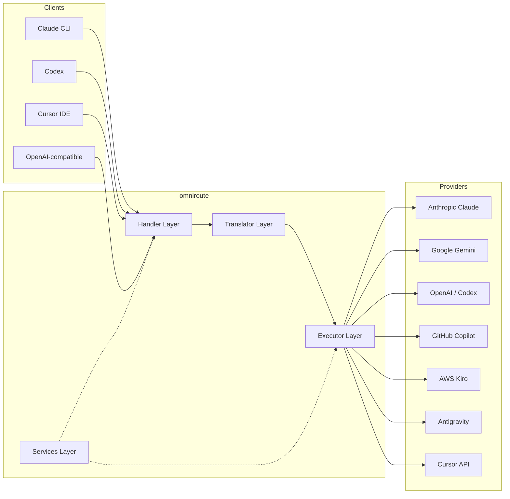
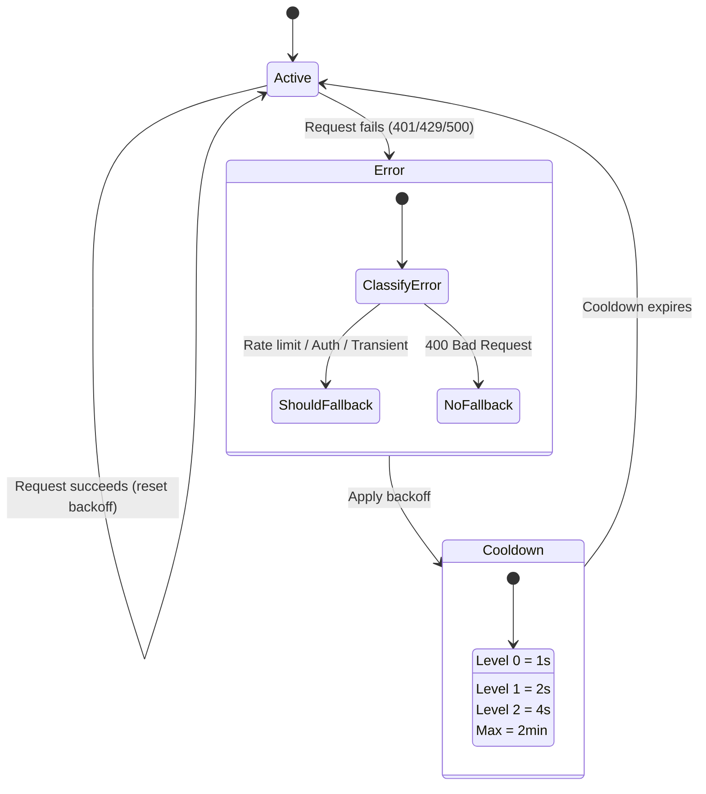
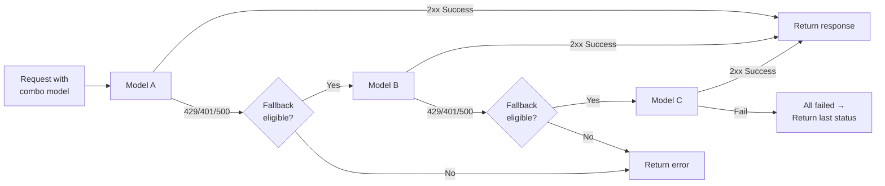
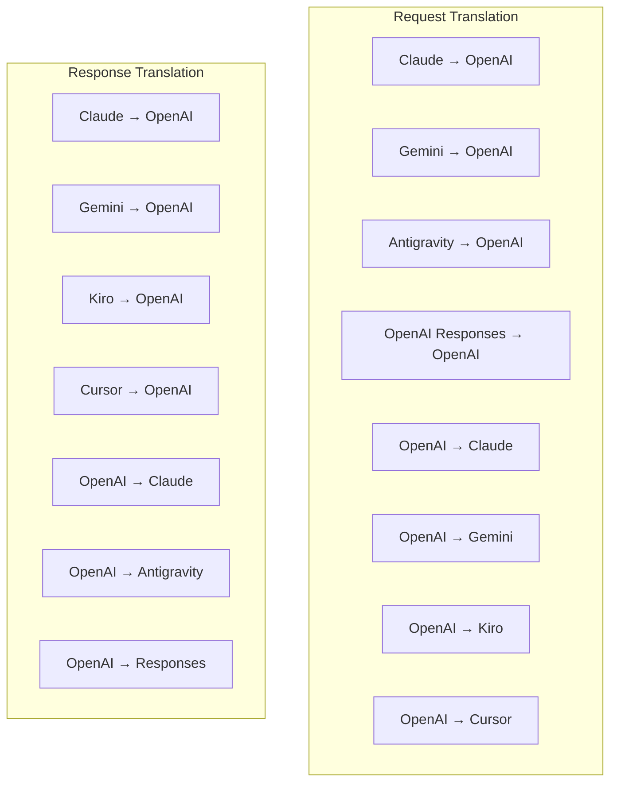
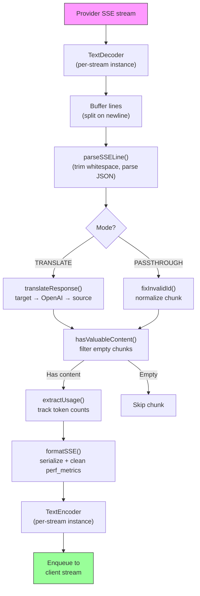
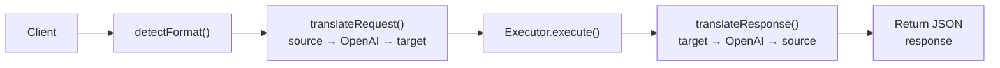
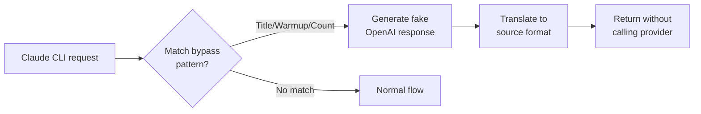

# omniroute — Codebase Documentation (中文（简体）)

🌐 **Languages:** 🇺🇸 [English](../../../../docs/CODEBASE_DOCUMENTATION.md) · 🇪🇸 [es](../../es/docs/CODEBASE_DOCUMENTATION.md) · 🇫🇷 [fr](../../fr/docs/CODEBASE_DOCUMENTATION.md) · 🇩🇪 [de](../../de/docs/CODEBASE_DOCUMENTATION.md) · 🇮🇹 [it](../../it/docs/CODEBASE_DOCUMENTATION.md) · 🇷🇺 [ru](../../ru/docs/CODEBASE_DOCUMENTATION.md) · 🇨🇳 [zh-CN](../../zh-CN/docs/CODEBASE_DOCUMENTATION.md) · 🇯🇵 [ja](../../ja/docs/CODEBASE_DOCUMENTATION.md) · 🇰🇷 [ko](../../ko/docs/CODEBASE_DOCUMENTATION.md) · 🇸🇦 [ar](../../ar/docs/CODEBASE_DOCUMENTATION.md) · 🇮🇳 [hi](../../hi/docs/CODEBASE_DOCUMENTATION.md) · 🇮🇳 [in](../../in/docs/CODEBASE_DOCUMENTATION.md) · 🇹🇭 [th](../../th/docs/CODEBASE_DOCUMENTATION.md) · 🇻🇳 [vi](../../vi/docs/CODEBASE_DOCUMENTATION.md) · 🇮🇩 [id](../../id/docs/CODEBASE_DOCUMENTATION.md) · 🇲🇾 [ms](../../ms/docs/CODEBASE_DOCUMENTATION.md) · 🇳🇱 [nl](../../nl/docs/CODEBASE_DOCUMENTATION.md) · 🇵🇱 [pl](../../pl/docs/CODEBASE_DOCUMENTATION.md) · 🇸🇪 [sv](../../sv/docs/CODEBASE_DOCUMENTATION.md) · 🇳🇴 [no](../../no/docs/CODEBASE_DOCUMENTATION.md) · 🇩🇰 [da](../../da/docs/CODEBASE_DOCUMENTATION.md) · 🇫🇮 [fi](../../fi/docs/CODEBASE_DOCUMENTATION.md) · 🇵🇹 [pt](../../pt/docs/CODEBASE_DOCUMENTATION.md) · 🇷🇴 [ro](../../ro/docs/CODEBASE_DOCUMENTATION.md) · 🇭🇺 [hu](../../hu/docs/CODEBASE_DOCUMENTATION.md) · 🇧🇬 [bg](../../bg/docs/CODEBASE_DOCUMENTATION.md) · 🇸🇰 [sk](../../sk/docs/CODEBASE_DOCUMENTATION.md) · 🇺🇦 [uk-UA](../../uk-UA/docs/CODEBASE_DOCUMENTATION.md) · 🇮🇱 [he](../../he/docs/CODEBASE_DOCUMENTATION.md) · 🇵🇭 [phi](../../phi/docs/CODEBASE_DOCUMENTATION.md) · 🇧🇷 [pt-BR](../../pt-BR/docs/CODEBASE_DOCUMENTATION.md) · 🇨🇿 [cs](../../cs/docs/CODEBASE_DOCUMENTATION.md) · 🇹🇷 [tr](../../tr/docs/CODEBASE_DOCUMENTATION.md)

---

> **omniroute**多提供商 AI 代理路由器的全面且适合初学者的指南。---

## 1. What Is omniroute?

omn​​iroute 是一个**代理路由器**，位于 AI 客户端（Claude CLI、Codex、Cursor IDE 等）和 AI 提供商（Anthropic、Google、OpenAI、AWS、GitHub 等）之间。它解决了一个大问题：

> **不同的 AI 客户端使用不同的“语言”（API 格式），不同的 AI 提供商也期望不同的“语言”。**omniroute 自动在它们之间进行翻译。

可以将其想象为联合国的通用翻译器 - 任何代表都可以说任何语言，翻译器可以将其转换为任何其他代表。---

## 2. Architecture Overview



### Core Principle: Hub-and-Spoke Translation

所有格式翻译均通过**OpenAI格式作为枢纽**：```
Client Format → [OpenAI Hub] → Provider Format (request)
Provider Format → [OpenAI Hub] → Client Format (response)

```

这意味着您只需要**N 个翻译器**（每种格式一个），而不是**N²**（每对）。---

## 3. Project Structure

```

omniroute/
├── open-sse/ ← Core proxy library (portable, framework-agnostic)
│ ├── index.js ← Main entry point, exports everything
│ ├── config/ ← Configuration & constants
│ ├── executors/ ← Provider-specific request execution
│ ├── handlers/ ← Request handling orchestration
│ ├── services/ ← Business logic (auth, models, fallback, usage)
│ ├── translator/ ← Format translation engine
│ │ ├── request/ ← Request translators (8 files)
│ │ ├── response/ ← Response translators (7 files)
│ │ └── helpers/ ← Shared translation utilities (6 files)
│ └── utils/ ← Utility functions
├── src/ ← Application layer (Express/Worker runtime)
│ ├── app/ ← Web UI, API routes, middleware
│ ├── lib/ ← Database, auth, and shared library code
│ ├── mitm/ ← Man-in-the-middle proxy utilities
│ ├── models/ ← Database models
│ ├── shared/ ← Shared utilities (wrappers around open-sse)
│ ├── sse/ ← SSE endpoint handlers
│ └── store/ ← State management
├── data/ ← Runtime data (credentials, logs)
│ └── provider-credentials.json (external credentials override, gitignored)
└── tester/ ← Test utilities

````

---

## 4. Module-by-Module Breakdown

### 4.1 Config (`open-sse/config/`)

所有提供者配置的**单一事实来源**。

|文件|目的|
| -------------------------------------- | ----------------------------------------------------------------------------------------------------------------------------------------------------------------------------------------------------------------------------------------- |
| `常量.ts` | “PROVIDERS”对象，包含每个提供商的基本 URL、OAuth 凭据（默认）、标头和默认系统提示。还定义了“HTTP_STATUS”、“ERROR_TYPES”、“COOLDOWN_MS”、“BACKOFF_CONFIG”和“SKIP_PATTERNS”。 |
| `credentialLoader.ts` |从“data/provider-credentials.json”加载外部凭据，并将它们合并到“PROVIDERS”中的硬编码默认值上。让秘密不受源代码控制，同时保持向后兼容性。               |
| `providerModels.ts` |中央模型注册表：映射提供者别名 → 模型 ID。诸如“getModels()”、“getProviderByAlias()”之类的函数。                                                                                                          |
| `codexInstructions.ts` |系统指令注入到 Codex 请求中（编辑约束、沙箱规则、批准策略）。                                                                                                                 |
| `defaultThinkingSignature.ts` |克劳德和双子座模型的默认“思考”签名。                                                                                                                                                               |
| `ollamaModels.ts` |本地 Ollama 模型的架构定义（名称、大小、系列、量化）。                                                                                                                                             |#### Credential Loading Flow

```mermaid
flowchart TD
    A["App starts"] --> B["constants.ts defines PROVIDERS\nwith hardcoded defaults"]
    B --> C{"data/provider-credentials.json\nexists?"}
    C -->|Yes| D["credentialLoader reads JSON"]
    C -->|No| E["Use hardcoded defaults"]
    D --> F{"For each provider in JSON"}
    F --> G{"Provider exists\nin PROVIDERS?"}
    G -->|No| H["Log warning, skip"]
    G -->|Yes| I{"Value is object?"}
    I -->|No| J["Log warning, skip"]
    I -->|Yes| K["Merge clientId, clientSecret,\ntokenUrl, authUrl, refreshUrl"]
    K --> F
    H --> F
    J --> F
    F -->|Done| L["PROVIDERS ready with\nmerged credentials"]
    E --> L
````

---

### 4.2 Executors (`open-sse/executors/`)

执行器使用**策略模式**封装**特定于提供者的逻辑**。每个执行器根据需要重写基本方法。```mermaid
classDiagram
class BaseExecutor {
+buildUrl(model, stream, options)
+buildHeaders(credentials, stream, body)
+transformRequest(body, model, stream, credentials)
+execute(url, options)
+shouldRetry(status, error)
+refreshCredentials(credentials, log)
}

    class DefaultExecutor {
        +refreshCredentials()
    }

    class AntigravityExecutor {
        +buildUrl()
        +buildHeaders()
        +transformRequest()
        +shouldRetry()
        +refreshCredentials()
    }

    class CursorExecutor {
        +buildUrl()
        +buildHeaders()
        +transformRequest()
        +parseResponse()
        +generateChecksum()
    }

    class KiroExecutor {
        +buildUrl()
        +buildHeaders()
        +transformRequest()
        +parseEventStream()
        +refreshCredentials()
    }

    BaseExecutor <|-- DefaultExecutor
    BaseExecutor <|-- AntigravityExecutor
    BaseExecutor <|-- CursorExecutor
    BaseExecutor <|-- KiroExecutor
    BaseExecutor <|-- CodexExecutor
    BaseExecutor <|-- GeminiCLIExecutor
    BaseExecutor <|-- GithubExecutor

````

|执行人|供应商|重点专业|
| ---------------- | ------------------------------------------------------ | ---------------------------------------------------------------------------------------------------------------------------------- |
| `base.ts` | — |抽象基础：URL 构建、标头、重试逻辑、凭证刷新 |
| `默认.ts` |克劳德、Gemini、OpenAI、GLM、Kimi、MiniMax |标准提供商的通用 OAuth 令牌刷新 |
| `反重力.ts` |谷歌云代码|项目/会话 ID 生成、多 URL 回退、自定义重试错误消息解析（“2 小时 7 分 23 秒后重置”）|
| `cursor.ts` |光标IDE |**最复杂**：SHA-256 校验和验证、Protobuf 请求编码、二进制 EventStream → SSE 响应解析 |
| `codex.ts` | OpenAI 法典 |注入系统指令、管理思维水平、删除不支持的参数 |
| `gemini-cli.ts` |谷歌 Gemini CLI |自定义 URL 构建（`streamGenerateContent`）、Google OAuth 令牌刷新 |
| `github.ts` | GitHub 副驾驶 |双令牌系统（GitHub OAuth + Copilot 令牌），VSCode 标头模仿 |
| `kiro.ts` | AWS 代码耳语 | AWS EventStream 二进制解析、AMZN 事件框架、令牌估计 |
| `index.ts` | — |工厂：地图提供者名称 → 执行器类，具有默认后备|---

### 4.3 Handlers (`open-sse/handlers/`)

**编排层**— 协调翻译、执行、流式传输和错误处理。

|文件|目的|
| -------------------- | ------------------------------------------------------------------------------------------------------------------------------------------------------------------------------------------------------------------------------------------ |
| `chatCore.ts` |**中央编排器**（约 600 行）。处理完整的请求生命周期：格式检测→转换→执行程序调度→流/非流响应→令牌刷新→错误处理→使用日志记录。 |
| `responsesHandler.ts` | OpenAI 响应 API 的适配器：转换响应格式 → 聊天完成 → 发送到 `chatCore` → 将 SSE 转换回响应格式。                                                                        |
| `embeddings.ts` |嵌入生成处理程序：解析嵌入模型→提供者，分派到提供者 API，返回兼容 OpenAI 的嵌入响应。支持 6 个以上提供商。                                                    |
| `imageGeneration.ts` |图像生成处理程序：解析图像模型→提供程序，支持 OpenAI 兼容、Gemini-image（反重力）和后备（Nebius）模式。返回 base64 或 URL 图像。                                          |#### Request Lifecycle (chatCore.ts)

```mermaid
sequenceDiagram
    participant Client
    participant chatCore
    participant Translator
    participant Executor
    participant Provider

    Client->>chatCore: Request (any format)
    chatCore->>chatCore: Detect source format
    chatCore->>chatCore: Check bypass patterns
    chatCore->>chatCore: Resolve model & provider
    chatCore->>Translator: Translate request (source → OpenAI → target)
    chatCore->>Executor: Get executor for provider
    Executor->>Executor: Build URL, headers, transform request
    Executor->>Executor: Refresh credentials if needed
    Executor->>Provider: HTTP fetch (streaming or non-streaming)

    alt Streaming
        Provider-->>chatCore: SSE stream
        chatCore->>chatCore: Pipe through SSE transform stream
        Note over chatCore: Transform stream translates<br/>each chunk: target → OpenAI → source
        chatCore-->>Client: Translated SSE stream
    else Non-streaming
        Provider-->>chatCore: JSON response
        chatCore->>Translator: Translate response
        chatCore-->>Client: Translated JSON
    end

    alt Error (401, 429, 500...)
        chatCore->>Executor: Retry with credential refresh
        chatCore->>chatCore: Account fallback logic
    end
````

---

### 4.4 Services (`open-sse/services/`)

| 支持处理程序和执行程序的业务逻辑。 | File                                                                                                                                                                                                                                                                                                                                   | Purpose |
| ---------------------------------- | -------------------------------------------------------------------------------------------------------------------------------------------------------------------------------------------------------------------------------------------------------------------------------------------------------------------------------------- | ------- |
| `provider.ts`                      | **Format detection** (`detectFormat`): analyzes request body structure to identify Claude/OpenAI/Gemini/Antigravity/Responses formats (includes `max_tokens` heuristic for Claude). Also: URL building, header building, thinking config normalization. Supports `openai-compatible-*` and `anthropic-compatible-*` dynamic providers. |
| `model.ts`                         | Model string parsing (`claude/model-name` → `{provider: "claude", model: "model-name"}`), alias resolution with collision detection, input sanitization (rejects path traversal/control chars), and model info resolution with async alias getter support.                                                                             |
| `accountFallback.ts`               | Rate-limit handling: exponential backoff (1s → 2s → 4s → max 2min), account cooldown management, error classification (which errors trigger fallback vs. not).                                                                                                                                                                         |
| `tokenRefresh.ts`                  | OAuth token refresh for **every provider**: Google (Gemini, Antigravity), Claude, Codex, Qwen, Qoder, GitHub (OAuth + Copilot dual-token), Kiro (AWS SSO OIDC + Social Auth). Includes in-flight promise deduplication cache and retry with exponential backoff.                                                                       |
| `combo.ts`                         | **Combo models**: chains of fallback models. If model A fails with a fallback-eligible error, try model B, then C, etc. Returns actual upstream status codes.                                                                                                                                                                          |
| `usage.ts`                         | Fetches quota/usage data from provider APIs (GitHub Copilot quotas, Antigravity model quotas, Codex rate limits, Kiro usage breakdowns, Claude settings).                                                                                                                                                                              |
| `accountSelector.ts`               | Smart account selection with scoring algorithm: considers priority, health status, round-robin position, and cooldown state to pick the optimal account for each request.                                                                                                                                                              |
| `contextManager.ts`                | Request context lifecycle management: creates and tracks per-request context objects with metadata (request ID, timestamps, provider info) for debugging and logging.                                                                                                                                                                  |
| `ipFilter.ts`                      | IP-based access control: supports allowlist and blocklist modes. Validates client IP against configured rules before processing API requests.                                                                                                                                                                                          |
| `sessionManager.ts`                | Session tracking with client fingerprinting: tracks active sessions using hashed client identifiers, monitors request counts, and provides session metrics.                                                                                                                                                                            |
| `signatureCache.ts`                | Request signature-based deduplication cache: prevents duplicate requests by caching recent request signatures and returning cached responses for identical requests within a time window.                                                                                                                                              |
| `systemPrompt.ts`                  | Global system prompt injection: prepends or appends a configurable system prompt to all requests, with per-provider compatibility handling.                                                                                                                                                                                            |
| `thinkingBudget.ts`                | Reasoning token budget management: supports passthrough, auto (strip thinking config), custom (fixed budget), and adaptive (complexity-scaled) modes for controlling thinking/reasoning tokens.                                                                                                                                        |
| `wildcardRouter.ts`                | Wildcard model pattern routing: resolves wildcard patterns (e.g., `*/claude-*`) to concrete provider/model pairs based on availability and priority.                                                                                                                                                                                   |

#### Token Refresh Deduplication

```mermaid
sequenceDiagram
    participant R1 as Request 1
    participant R2 as Request 2
    participant Cache as refreshPromiseCache
    participant OAuth as OAuth Provider

    R1->>Cache: getAccessToken("gemini", token)
    Cache->>Cache: No in-flight promise
    Cache->>OAuth: Start refresh
    R2->>Cache: getAccessToken("gemini", token)
    Cache->>Cache: Found in-flight promise
    Cache-->>R2: Return existing promise
    OAuth-->>Cache: New access token
    Cache-->>R1: New access token
    Cache-->>R2: Same access token (shared)
    Cache->>Cache: Delete cache entry
```

#### Account Fallback State Machine



#### Combo Model Chain



---

### 4.5 Translator (`open-sse/translator/`)

使用自注册插件系统的**格式翻译引擎**。#### 架构



| 目录         | 文件     | 描述                                                                                                                                                                                                     |
| ------------ | -------- | -------------------------------------------------------------------------------------------------------------------------------------------------------------------------------------------------------- | ----------------------------------------- |
| `请求/`      | 8 位译员 | 在格式之间转换请求正文。每个文件在导入时通过“register(from, to, fn)”进行自注册。                                                                                                                         |
| `响应/`      | 7 名翻译 | 在格式之间转换流响应块。处理 SSE 事件类型、思维块、工具调用。                                                                                                                                            |
| `帮手/`      | 6 帮手   | 共享实用程序：`claudeHelper`（系统提示提取、思维配置）、`geminiHelper`（部分/内容映射）、`openaiHelper`（格式过滤）、`toolCallHelper`（ID生成、缺少响应注入）、`maxTokensHelper`、`responsesApiHelper`。 |
| `index.ts`   | —        | 翻译引擎：`translateRequest()`、`translateResponse()`、状态管理、注册表。                                                                                                                                |
| `formats.ts` | —        | 格式常量：`OPENAI`、`CLAUDE`、`GEMINI`、`ANTIGRAVITY`、`KIRO`、`CURSOR`、`OPENAI_RESPONSES`。                                                                                                            | #### Key Design: Self-Registering Plugins |

```javascript
// Each translator file calls register() on import:
import { register } from "../index.js";
register("claude", "openai", translateClaudeToOpenAI);

// The index.js imports all translator files, triggering registration:
import "./request/claude-to-openai.js"; // ← self-registers
```

---

### 4.6 Utils (`open-sse/utils/`)

| 文件               | 目的                                                                                                                                                                                                 |
| ------------------ | ---------------------------------------------------------------------------------------------------------------------------------------------------------------------------------------------------- | --------------------------- |
| `错误.ts`          | 错误响应构建（OpenAI 兼容格式）、上游错误解析、从错误消息中提取反重力重试时间、SSE 错误流。                                                                                                          |
| `stream.ts`        | **SSE Transform Stream**— 核心流管道。两种模式：“TRANSLATE”（完整格式翻译）和“PASSTHROUGH”（规范化+提取使用）。处理块缓冲、使用情况估计、内容长度跟踪。每个流编码器/解码器实例避免共享状态。         |
| `streamHelpers.ts` | 低级 SSE 实用程序：“parseSSELine”（容忍空格）、“hasValuableContent”（过滤 OpenAI/Claude/Gemini 的空块）、“fixInvalidId”、“formatSSE”（具有“perf_metrics”清理功能的格式感知 SSE 序列化）。            |
| `usageTracking.ts` | 从任何格式（Claude/OpenAI/Gemini/Responses）提取令牌使用情况，使用单独的工具/消息字符/令牌比率进行估计，缓冲区添加（2000 个令牌安全裕度），特定于格式的字段过滤，使用 ANSI 颜色的控制台日志记录。    |
| `requestLogger.ts` | Legacy file-based request logging helper kept for compatibility. Current deployments should prefer `APP_LOG_TO_FILE` for application logs and the call log pipeline for persisted request artifacts. |
| `bypassHandler.ts` | 拦截来自 Claude CLI 的特定模式（标题提取、预热、计数）并返回虚假响应，而无需调用任何提供者。支持流式和非流式。有意限制于 Claude CLI 范围。                                                           |
| `networkProxy.ts`  | 优先解析给定提供商的出站代理 URL：特定于提供商的配置 → 全局配置 → 环境变量 (`HTTPS_PROXY`/`HTTP_PROXY`/`ALL_PROXY`)。支持“NO_PROXY”排除。缓存配置 30 秒。                                            | #### SSE Streaming Pipeline |



#### Request Logger Session Structure

```
logs/
└── claude_gemini_claude-sonnet_20260208_143045/
    ├── 1_req_client.json      ← Raw client request
    ├── 2_req_source.json      ← After initial conversion
    ├── 3_req_openai.json      ← OpenAI intermediate format
    ├── 4_req_target.json      ← Final target format
    ├── 5_res_provider.txt     ← Provider SSE chunks (streaming)
    ├── 5_res_provider.json    ← Provider response (non-streaming)
    ├── 6_res_openai.txt       ← OpenAI intermediate chunks
    ├── 7_res_client.txt       ← Client-facing SSE chunks
    └── 6_error.json           ← Error details (if any)
```

---

### 4.7 Application Layer (`src/`)

| 目录          | 目的                                                     |
| ------------- | -------------------------------------------------------- | ----------------------- |
| `src/app/`    | Web UI、API 路由、Express 中间件、OAuth 回调处理程序     |
| `src/lib/`    | 数据库访问（`localDb.ts`、`usageDb.ts`）、身份验证、共享 |
| `src/mitm/`   | 用于拦截提供商流量的中间人代理实用程序                   |
| `src/models/` | 数据库模型定义                                           |
| `src/共享/`   | open-sse 函数（提供程序、流、错误等）的包装器            |
| `src/sse/`    | 将 open-sse 库连接到 Express 路由的 SSE 端点处理程序     |
| `src/store/`  | 应用状态管理                                             | #### Notable API Routes |

| 路线                                           | 方法           | 目的                                                         |
| ---------------------------------------------- | -------------- | ------------------------------------------------------------ | --- |
| `/api/provider-models`                         | 获取/发布/删除 | 针对每个提供商的自定义模型的 CRUD                            |
| `/api/models/catalog`                          | 获取           | 按提供商分组的所有模型（聊天、嵌入、图像、自定义）的聚合目录 |
| `/api/settings/proxy`                          | 获取/放置/删除 | 分层出站代理配置（`global/providers/combos/keys`）           |
| `/api/settings/proxy/test`                     | 发布           | 验证代理连接并返回公共 IP/延迟                               |
| `/v1/providers/[provider]/chat/completions`    | 发布           | 通过模型验证完成每个提供商的专用聊天                         |
| `/v1/providers/[provider]/embeddings`          | 发布           | 具有模型验证功能的专用每个提供商嵌入                         |
| `/v1/providers/[provider]/images/ Generations` | 发布           | 通过模型验证生成专用的每个提供商图像                         |
| `/api/settings/ip-filter`                      | 获取/放置      | IP 允许列表/阻止列表管理                                     |
| `/api/settings/thinking-budget`                | 获取/放置      | 推理代币预算配置（直通/自动/自定义/自适应）                  |
| `/api/settings/system-prompt`                  | 获取/放置      | 所有请求的全局系统提示注入                                   |
| `/api/sessions`                                | 获取           | 活动会话跟踪和指标                                           |
| `/api/rate-limits`                             | 获取           | 每个帐户的速率限制状态                                       | --- |

## 5. Key Design Patterns

### 5.1 Hub-and-Spoke Translation

所有格式均通过**OpenAI 格式作为中心**进行转换。添加新的提供者只需要编写**一对**翻译器（到/来自 OpenAI），而不是 N 对。### 5.2 Executor Strategy Pattern

每个提供者都有一个继承自“BaseExecutor”的专用执行器类。 `executors/index.ts` 中的工厂在运行时选择正确的工厂。### 5.3 Self-Registering Plugin System

翻译器模块在导入时通过“register()”注册自身。添加新翻译器只是创建一个文件并将其导入。### 5.4 Account Fallback with Exponential Backoff

当提供者返回 429/401/500 时，系统可以切换到下一个帐户，应用指数冷却时间（1 秒 → 2 秒 → 4 秒 → 最长 2 分钟）。### 5.5 Combo Model Chains

“组合”将多个“provider/model”字符串组合在一起。如果第一个失败，则自动回退到下一个。### 5.6 Stateful Streaming Translation

响应翻译通过“initState()”机制维护跨 SSE 块的状态（思维块跟踪、工具调用累积、内容块索引）。### 5.7 Usage Safety Buffer

在报告的使用情况中添加了 2000 个令牌缓冲区，以防止客户端由于系统提示和格式转换的开销而达到上下文窗口限制。---

## 6. Supported Formats

| 格式            | 方向      | 标识符        |
| --------------- | --------- | ------------- | --- |
| OpenAI 聊天完成 | 来源+目标 | `openai`      |
| OpenAI 响应 API | 来源+目标 | `openai 响应` |
| 人类克劳德      | 来源+目标 | '克劳德'      |
| 谷歌双子座      | 来源+目标 | `双子座`      |
| 谷歌 Gemini CLI | 仅目标    | `gemini-cli`  |
| 反重力          | 来源+目标 | `反重力`      |
| AWS 基罗        | AWS仅目标 | `基罗`        |
| 光标            | 仅目标    | `光标`        | --- |

## 7. Supported Providers

| 供应商             | 认证方式             | 执行人    | 要点                            |
| ------------------ | -------------------- | --------- | ------------------------------- | --- |
| 人类克劳德         | API 密钥或 OAuth     | 默认      | 使用“x-api-key”标头             |
| 谷歌双子座         | API 密钥或 OAuth     | 默认      | 使用“x-goog-api-key”标头        |
| 谷歌 Gemini CLI    | OAuth                | GeminiCLI | 使用“streamGenerateContent”端点 |
| 反重力             | OAuth                | 反重力    | 多 URL 回退、自定义重试解析     |
| 开放人工智能       | API 密钥             | 默认      | 标准持有者身份验证              |
| 法典               | OAuth                | 法典      | 注入系统指令，管理思维          |
| GitHub 副驾驶      | OAuth + Copilot 令牌 | GitHub    | 双令牌，VSCode 标头模仿         |
| 基罗 (AWS)         | AWS SSO OIDC 或社交  | 基罗      | 二进制EventStream解析           |
| 光标IDE            | 校验和验证           | 光标      | Protobuf 编码、SHA-256 校验和   |
| 奎文               | OAuth                | 默认      | 标准授权                        |
| 科德尔             | OAuth（基本 + 承载） | 默认      | 双重身份验证标头                |
| 开放路由器         | API 密钥             | 默认      | 标准持有者身份验证              |
| GLM、Kimi、MiniMax | API 密钥             | 默认      | 克劳德兼容，使用 `x-api-key`    |
| `openai 兼容-*`    | API 密钥             | 默认      | 动态：任何 OpenAI 兼容端点      |
| `人类兼容-*`       | API 密钥             | 默认      | 动态：任何与 Claude 兼容的端点  | --- |

## 8. Data Flow Summary

### Streaming Request

```mermaid
flowchart LR
    A["Client"] --> B["detectFormat()"]
    B --> C["translateRequest()\nsource → OpenAI → target"]
    C --> D["Executor\nbuildUrl + buildHeaders"]
    D --> E["fetch(providerURL)"]
    E --> F["createSSEStream()\nTRANSLATE mode"]
    F --> G["parseSSELine()"]
    G --> H["translateResponse()\ntarget → OpenAI → source"]
    H --> I["extractUsage()\n+ addBuffer"]
    I --> J["formatSSE()"]
    J --> K["Client receives\ntranslated SSE"]
    K --> L["logUsage()\nsaveRequestUsage()"]
```



### Non-Streaming Request



### Bypass Flow (Claude CLI)


